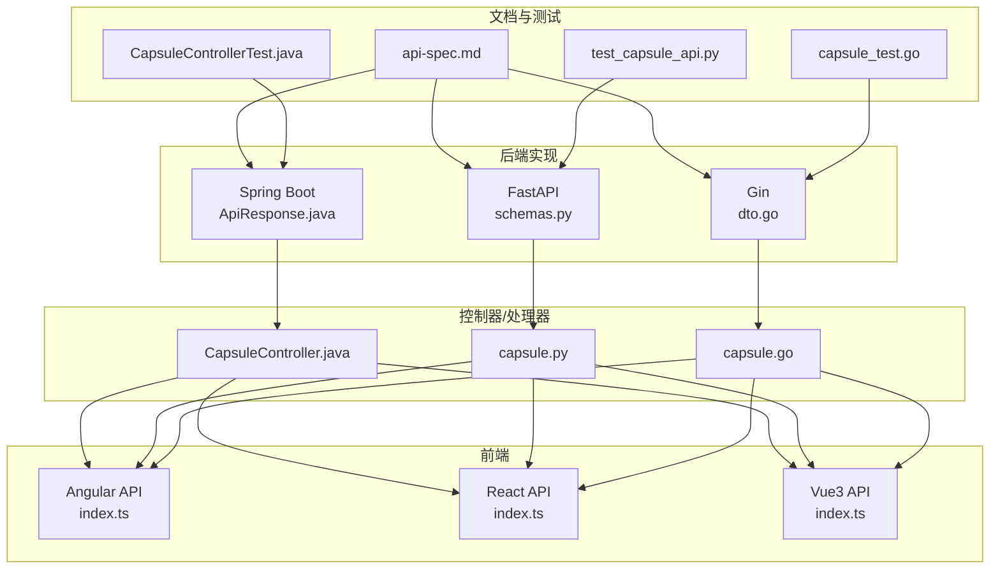
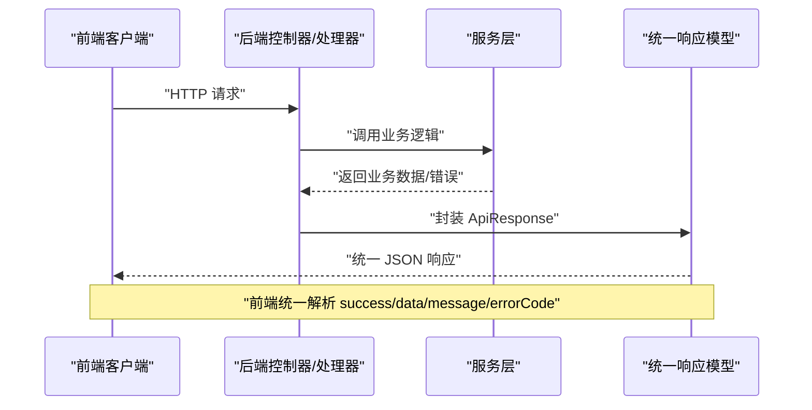
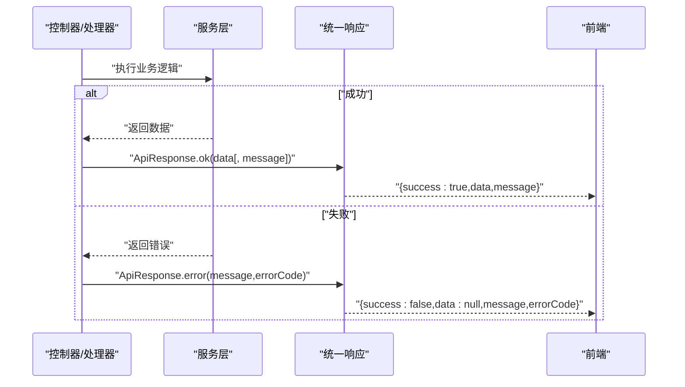
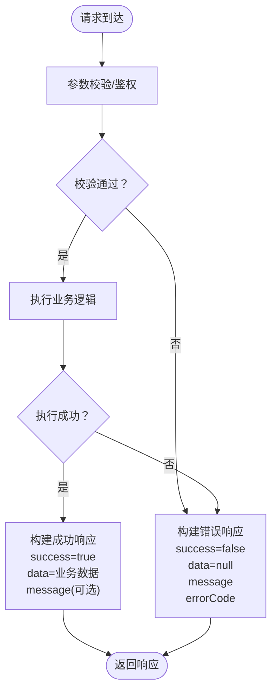
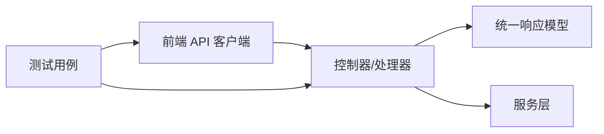

# API响应格式

<cite>
**本文档引用的文件**
- [ApiResponse.java](file://backends/spring-boot/src/main/java/com/hellotime/dto/ApiResponse.java)
- [dto.go](file://backends/gin/dto/dto.go)
- [schemas.py](file://backends/fastapi/app/schemas.py)
- [api-spec.md](file://docs/api-spec.md)
- [CapsuleController.java](file://backends/spring-boot/src/main/java/com/hellotime/controller/CapsuleController.java)
- [capsule.go](file://backends/gin/handler/capsule.go)
- [capsule.py](file://backends/fastapi/app/routers/capsule.py)
- [GlobalExceptionHandler.java](file://backends/spring-boot/src/main/java/com/hellotime/exception/GlobalExceptionHandler.java)
- [CapsuleControllerTest.java](file://backends/spring-boot/src/test/java/com/hellotime/controller/CapsuleControllerTest.java)
- [capsule_test.go](file://backends/gin/tests/capsule_test.go)
- [test_capsule_api.py](file://backends/fastapi/tests/test_capsule_api.py)
- [index.ts（Angular）](file://frontends/angular-ts/src/app/api/index.ts)
- [index.ts（React）](file://frontends/react-ts/src/api/index.ts)
- [index.ts（Vue3）](file://frontends/vue3-ts/src/api/index.ts)
</cite>

## 目录
1. [简介](#简介)
2. [项目结构](#项目结构)
3. [核心组件](#核心组件)
4. [架构总览](#架构总览)
5. [详细组件分析](#详细组件分析)
6. [依赖关系分析](#依赖关系分析)
7. [性能考虑](#性能考虑)
8. [故障排除指南](#故障排除指南)
9. [结论](#结论)
10. [附录](#附录)

## 简介
本文件系统性阐述 HelloTime 项目的统一 API 响应格式规范，确保 Spring Boot、FastAPI、Gin 三套后端实现以及 Angular/React/Vue3 前端在数据契约上保持一致。统一响应格式包含四个关键字段：success（布尔）、data（对象或 null）、message（字符串）、errorCode（字符串，失败时可选）。文档将详细说明不同场景下的格式变化、错误码使用规则、各后端实现的一致性保证方式，以及客户端解析与处理最佳实践。

## 项目结构
围绕统一响应格式的关键文件分布如下：
- 后端统一响应模型与控制器/处理器：
  - Spring Boot：ApiResponse 数据类、控制器、全局异常处理器
  - FastAPI：Pydantic 响应模型与路由
  - Gin：Go 结构体与处理器
- 文档与测试：
  - API 规范文档、单元测试与集成测试
- 前端 API 客户端：
  - Angular/React/Vue3 的统一请求封装与错误处理



图表来源
- [ApiResponse.java:21-48](file://backends/spring-boot/src/main/java/com/hellotime/dto/ApiResponse.java#L21-L48)
- [schemas.py:81-96](file://backends/fastapi/app/schemas.py#L81-L96)
- [dto.go:5-34](file://backends/gin/dto/dto.go#L5-L34)
- [CapsuleController.java:37-55](file://backends/spring-boot/src/main/java/com/hellotime/controller/CapsuleController.java#L37-L55)
- [capsule.py:17-30](file://backends/fastapi/app/routers/capsule.py#L17-L30)
- [capsule.go:19-55](file://backends/gin/handler/capsule.go#L19-L55)
- [api-spec.md:5-14](file://docs/api-spec.md#L5-L14)

章节来源
- [ApiResponse.java:1-48](file://backends/spring-boot/src/main/java/com/hellotime/dto/ApiResponse.java#L1-L48)
- [schemas.py:81-96](file://backends/fastapi/app/schemas.py#L81-L96)
- [dto.go:1-77](file://backends/gin/dto/dto.go#L1-L77)
- [api-spec.md:1-195](file://docs/api-spec.md#L1-L195)

## 核心组件
统一响应格式由三个后端框架分别实现，均遵循相同的契约：
- 字段定义
  - success：布尔值，表示请求是否成功
  - data：响应数据对象；成功时存在，失败时为 null
  - message：字符串，描述操作说明或错误信息
  - errorCode：字符串，仅在失败时出现，标识错误类型
- 序列化约定
  - Spring Boot：使用 Jackson，字段名采用驼峰命名
  - FastAPI：使用 Pydantic，字段名采用驼峰命名
  - Gin：使用 Go 结构体，字段名采用驼峰命名

章节来源
- [ApiResponse.java:21-48](file://backends/spring-boot/src/main/java/com/hellotime/dto/ApiResponse.java#L21-L48)
- [schemas.py:81-96](file://backends/fastapi/app/schemas.py#L81-L96)
- [dto.go:5-34](file://backends/gin/dto/dto.go#L5-L34)

## 架构总览
下图展示统一响应格式在不同后端与前端之间的流转关系，强调一致性与可预测性。



图表来源
- [CapsuleController.java:37-55](file://backends/spring-boot/src/main/java/com/hellotime/controller/CapsuleController.java#L37-L55)
- [capsule.py:17-30](file://backends/fastapi/app/routers/capsule.py#L17-L30)
- [capsule.go:19-55](file://backends/gin/handler/capsule.go#L19-L55)
- [ApiResponse.java:21-48](file://backends/spring-boot/src/main/java/com/hellotime/dto/ApiResponse.java#L21-L48)
- [schemas.py:81-96](file://backends/fastapi/app/schemas.py#L81-L96)
- [dto.go:5-34](file://backends/gin/dto/dto.go#L5-L34)

## 详细组件分析

### 统一响应模型对比
三套后端实现均提供统一响应模型与工厂方法，确保成功/失败响应的一致性。

```mermaid
classDiagram
class Spring_ApiResponse {
+boolean success
+T data
+String message
+String errorCode
+ok(data)
+ok(data,message)
+error(message,errorCode)
}
class FastAPI_ApiResponse {
+boolean success
+T data
+String message
+String error_code
+ok(data,message)
+error(message,error_code)
}
class Gin_ApiResponse {
+boolean success
+interface{} data
+*string message
+*string errorCode
+OK(data,message)
+Error(message,errorCode)
}
```

图表来源
- [ApiResponse.java:21-48](file://backends/spring-boot/src/main/java/com/hellotime/dto/ApiResponse.java#L21-L48)
- [schemas.py:81-96](file://backends/fastapi/app/schemas.py#L81-L96)
- [dto.go:5-34](file://backends/gin/dto/dto.go#L5-L34)

章节来源
- [ApiResponse.java:21-48](file://backends/spring-boot/src/main/java/com/hellotime/dto/ApiResponse.java#L21-L48)
- [schemas.py:81-96](file://backends/fastapi/app/schemas.py#L81-L96)
- [dto.go:5-34](file://backends/gin/dto/dto.go#L5-L34)

### 控制器/处理器中的统一响应使用
- Spring Boot：控制器直接返回 ResponseEntity<ApiResponse<T>>，使用 ApiResponse.ok()/error() 构造响应
- FastAPI：路由返回 JSONResponse，使用 ApiResponse.ok()/error() 并通过 model_dump(by_alias=True, exclude_none=True) 序列化
- Gin：处理器使用 c.JSON() 返回 dto.OK()/dto.Error()



图表来源
- [CapsuleController.java:37-55](file://backends/spring-boot/src/main/java/com/hellotime/controller/CapsuleController.java#L37-L55)
- [capsule.py:17-30](file://backends/fastapi/app/routers/capsule.py#L17-L30)
- [capsule.go:19-55](file://backends/gin/handler/capsule.go#L19-L55)
- [ApiResponse.java:28-47](file://backends/spring-boot/src/main/java/com/hellotime/dto/ApiResponse.java#L28-L47)
- [schemas.py:89-95](file://backends/fastapi/app/schemas.py#L89-L95)
- [dto.go:14-34](file://backends/gin/dto/dto.go#L14-L34)

章节来源
- [CapsuleController.java:37-55](file://backends/spring-boot/src/main/java/com/hellotime/controller/CapsuleController.java#L37-L55)
- [capsule.py:17-30](file://backends/fastapi/app/routers/capsule.py#L17-L30)
- [capsule.go:19-55](file://backends/gin/handler/capsule.go#L19-L55)

### 错误码与错误响应场景
- 错误码定义（来自 API 规范文档）
  - VALIDATION_ERROR：参数校验失败（400）
  - BAD_REQUEST：请求参数错误（400）
  - UNAUTHORIZED：认证失败（401）
  - CAPSULE_NOT_FOUND：胶囊不存在（404）
  - INTERNAL_ERROR：服务器内部错误（500）

- 后端实现对错误码的映射
  - Spring Boot：全局异常处理器根据异常类型映射到相应错误码
  - Gin：在处理器中针对特定错误返回对应错误码
  - FastAPI：在路由层根据业务异常返回对应错误码



图表来源
- [GlobalExceptionHandler.java:34-51](file://backends/spring-boot/src/main/java/com/hellotime/exception/GlobalExceptionHandler.java#L34-L51)
- [capsule.go:22-34](file://backends/gin/handler/capsule.go#L22-L34)
- [capsule.py:17-24](file://backends/fastapi/app/routers/capsule.py#L17-L24)
- [api-spec.md:186-195](file://docs/api-spec.md#L186-L195)

章节来源
- [GlobalExceptionHandler.java:34-51](file://backends/spring-boot/src/main/java/com/hellotime/exception/GlobalExceptionHandler.java#L34-L51)
- [capsule.go:22-34](file://backends/gin/handler/capsule.go#L22-L34)
- [capsule.py:17-24](file://backends/fastapi/app/routers/capsule.py#L17-L24)
- [api-spec.md:186-195](file://docs/api-spec.md#L186-L195)

### 响应示例与场景说明
- 成功创建胶囊
  - 字段：success=true、data 包含 code/title/creator/openAt/createdAt、message（可选）
  - 参考：[api-spec.md:56-69](file://docs/api-spec.md#L56-L69)
- 查询未到时间的胶囊
  - 字段：success=true、data 包含 code/title/creator/openAt/createdAt/opened=false、content 不存在或为 null
  - 参考：[api-spec.md:80-93](file://docs/api-spec.md#L80-L93)
- 管理员权限不足
  - 字段：success=false、data=null、message、errorCode=UNAUTHORIZED
  - 参考：[api-spec.md:186-195](file://docs/api-spec.md#L186-L195)
- 参数校验失败
  - 字段：success=false、data=null、message、errorCode=VALIDATION_ERROR
  - 参考：[api-spec.md:186-195](file://docs/api-spec.md#L186-L195)

章节来源
- [api-spec.md:56-93](file://docs/api-spec.md#L56-L93)
- [api-spec.md:114-133](file://docs/api-spec.md#L114-L133)
- [api-spec.md:137-182](file://docs/api-spec.md#L137-L182)
- [api-spec.md:186-195](file://docs/api-spec.md#L186-L195)

### 前端解析与处理最佳实践
- 统一错误处理
  - 前端在 request 方法中统一判断 response.ok 与 data.success，任一为假即抛出错误
  - 参考：[Angular:20-27](file://frontends/angular-ts/src/app/api/index.ts#L20-L27)、[React:24-31](file://frontends/react-ts/src/api/index.ts#L24-L31)、[Vue3:29-36](file://frontends/vue3-ts/src/api/index.ts#L29-L36)
- 成功数据提取
  - 前端从 data.data 中读取业务数据，避免重复解析
  - 参考：[Angular:15-24](file://frontends/angular-ts/src/app/services/capsule.service.ts#L15-L24)、[React:18-28](file://frontends/react-ts/src/hooks/useCapsule.ts#L18-L28)、[Vue3:28-37](file://frontends/vue3-ts/src/composables/useCapsule.ts#L28-L37)
- 加载与错误状态管理
  - 建议在调用前后设置 loading/error 状态，提升用户体验
  - 参考：[Angular:11-24](file://frontends/angular-ts/src/app/services/capsule.service.ts#L11-L24)、[React:14-28](file://frontends/react-ts/src/hooks/useCapsule.ts#L14-L28)、[Vue3:24-37](file://frontends/vue3-ts/src/composables/useCapsule.ts#L24-L37)

章节来源
- [index.ts（Angular）:10-27](file://frontends/angular-ts/src/app/api/index.ts#L10-L27)
- [index.ts（React）:14-31](file://frontends/react-ts/src/api/index.ts#L14-L31)
- [index.ts（Vue3）:19-37](file://frontends/vue3-ts/src/api/index.ts#L19-L37)
- [capsule.service.ts:11-24](file://frontends/angular-ts/src/app/services/capsule.service.ts#L11-L24)
- [useCapsule.ts（React）:14-28](file://frontends/react-ts/src/hooks/useCapsule.ts#L14-L28)
- [useCapsule.ts（Vue3）:24-37](file://frontends/vue3-ts/src/composables/useCapsule.ts#L24-L37)

## 依赖关系分析
- 后端耦合与内聚
  - 控制器/处理器依赖服务层，服务层不直接关心响应格式，降低耦合
  - 统一响应模型作为横切关注点，被所有控制器复用
- 前后端契约
  - 前端通过统一的 request 封装与后端交互，减少重复逻辑
- 测试验证
  - 单元测试与集成测试覆盖成功/失败场景，确保响应格式一致性



图表来源
- [CapsuleController.java:37-55](file://backends/spring-boot/src/main/java/com/hellotime/controller/CapsuleController.java#L37-L55)
- [capsule.py:17-30](file://backends/fastapi/app/routers/capsule.py#L17-L30)
- [capsule.go:19-55](file://backends/gin/handler/capsule.go#L19-L55)
- [ApiResponse.java:21-48](file://backends/spring-boot/src/main/java/com/hellotime/dto/ApiResponse.java#L21-L48)
- [schemas.py:81-96](file://backends/fastapi/app/schemas.py#L81-L96)
- [dto.go:5-34](file://backends/gin/dto/dto.go#L5-L34)
- [index.ts（Angular）:10-27](file://frontends/angular-ts/src/app/api/index.ts#L10-L27)

章节来源
- [CapsuleController.java:37-55](file://backends/spring-boot/src/main/java/com/hellotime/controller/CapsuleController.java#L37-L55)
- [capsule.py:17-30](file://backends/fastapi/app/routers/capsule.py#L17-L30)
- [capsule.go:19-55](file://backends/gin/handler/capsule.go#L19-L55)
- [index.ts（Angular）:10-27](file://frontends/angular-ts/src/app/api/index.ts#L10-L27)

## 性能考虑
- 响应序列化开销
  - 三套后端均采用轻量级序列化策略，统一响应模型字段较少，开销可控
- 前端解析效率
  - 统一的错误处理逻辑减少分支判断，提升解析效率
- 缓存与网络
  - 建议在前端对常用查询结果进行缓存，减少重复请求

## 故障排除指南
- 常见问题定位
  - success=false 且 errorCode 存在：优先检查后端日志与异常映射
  - success=true 但 data 为空：确认业务逻辑是否按预期返回空数据
  - message 为空：检查后端是否遗漏消息参数
- 测试参考
  - Spring Boot：[CapsuleControllerTest.java:61-76](file://backends/spring-boot/src/test/java/com/hellotime/controller/CapsuleControllerTest.java#L61-L76)
  - Gin：[capsule_test.go:104-129](file://backends/gin/tests/capsule_test.go#L104-L129)
  - FastAPI：[test_capsule_api.py:33-50](file://backends/fastapi/tests/test_capsule_api.py#L33-L50)

章节来源
- [CapsuleControllerTest.java:61-76](file://backends/spring-boot/src/test/java/com/hellotime/controller/CapsuleControllerTest.java#L61-L76)
- [capsule_test.go:104-129](file://backends/gin/tests/capsule_test.go#L104-L129)
- [test_capsule_api.py:33-50](file://backends/fastapi/tests/test_capsule_api.py#L33-L50)

## 结论
HelloTime 项目通过三套后端实现与统一的前端客户端，确保了 API 响应格式的一致性与可维护性。统一响应模型明确了 success/data/message/errorCode 的职责边界，结合严格的错误码映射与前端统一错误处理，显著提升了系统的可靠性与开发效率。建议在后续迭代中持续完善测试覆盖，并在前端增加更细粒度的错误提示与重试机制。

## 附录
- 错误码对照表
  - VALIDATION_ERROR：参数校验失败（400）
  - BAD_REQUEST：请求参数错误（400）
  - UNAUTHORIZED：认证失败（401）
  - CAPSULE_NOT_FOUND：胶囊不存在（404）
  - INTERNAL_ERROR：服务器内部错误（500）
- 参考文档
  - [api-spec.md:186-195](file://docs/api-spec.md#L186-L195)