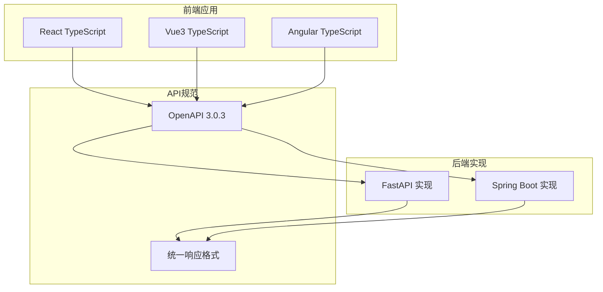
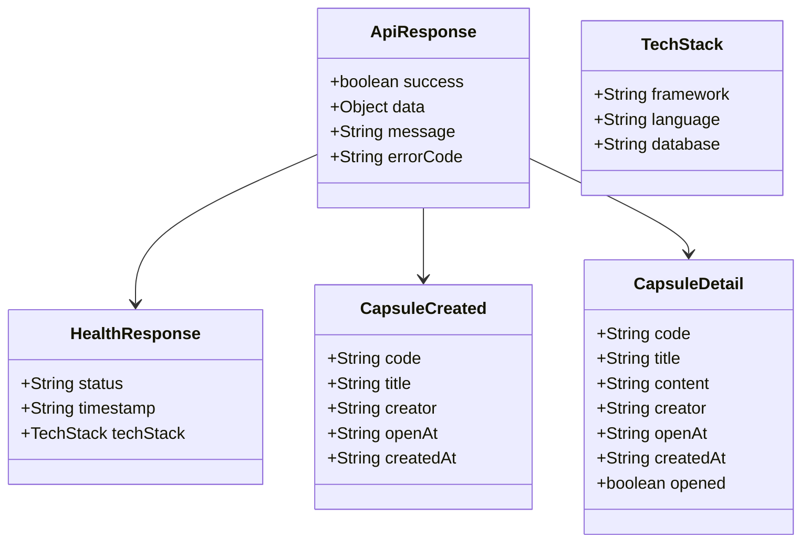
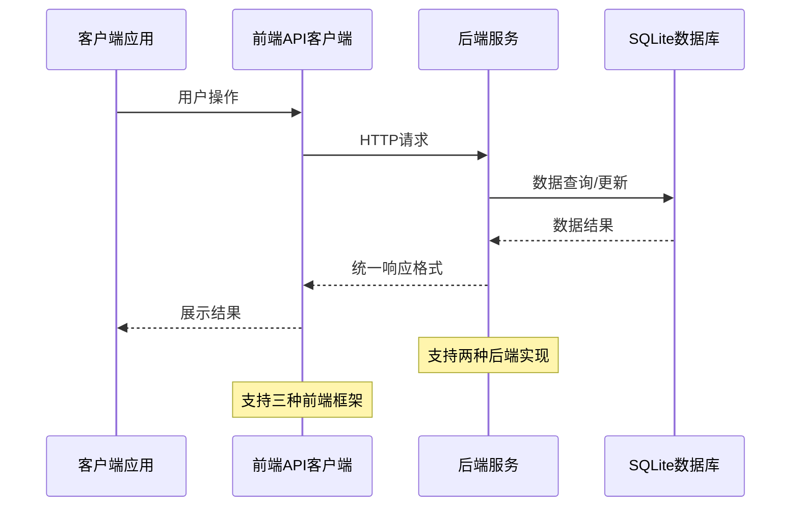
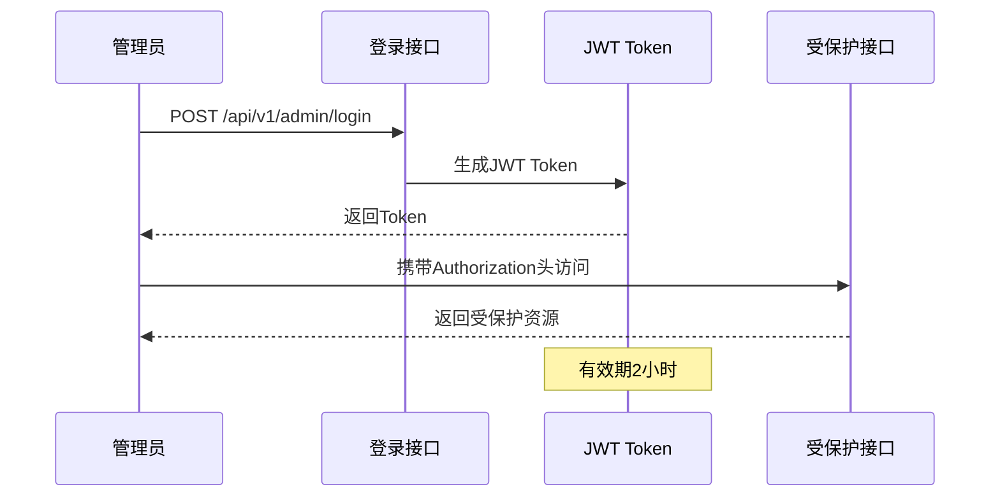
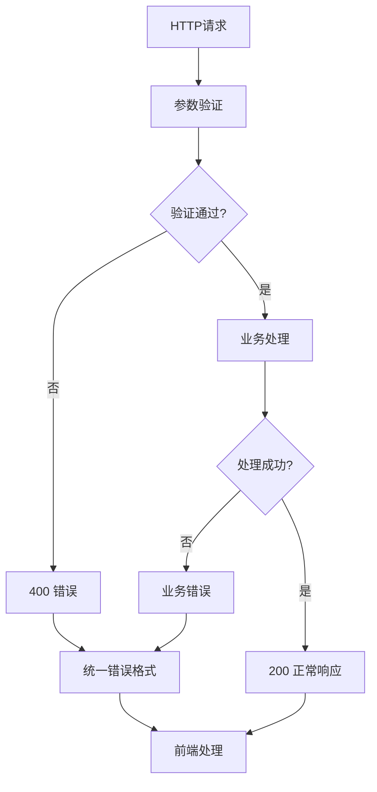

# API接口文档

<cite>
**本文档引用的文件**
- [openapi.yaml](file://spec/api/openapi.yaml)
- [main.py](file://backends/fastapi/app/main.py)
- [health.py](file://backends/fastapi/app/routers/health.py)
- [capsule.py](file://backends/fastapi/app/routers/capsule.py)
- [admin.py](file://backends/fastapi/app/routers/admin.py)
- [HealthController.java](file://backends/spring-boot/src/main/java/com/hellotime/controller/HealthController.java)
- [CapsuleController.java](file://backends/spring-boot/src/main/java/com/hellotime/controller/CapsuleController.java)
- [AdminController.java](file://backends/spring-boot/src/main/java/com/hellotime/controller/AdminController.java)
- [CorsConfig.java](file://backends/spring-boot/src/main/java/com/hellotime/config/CorsConfig.java)
- [application.yml](file://backends/spring-boot/src/main/resources/application.yml)
- [index.ts](file://frontends/react-ts/src/api/index.ts)
- [index.ts](file://frontends/vue3-ts/src/api/index.ts)
- [index.ts](file://frontends/angular-ts/src/app/api/index.ts)
- [api-spec.md](file://docs/api-spec.md)
</cite>

## 目录
1. [简介](#简介)
2. [项目结构](#项目结构)
3. [核心组件](#核心组件)
4. [架构概览](#架构概览)
5. [详细组件分析](#详细组件分析)
6. [依赖分析](#依赖分析)
7. [性能考虑](#性能考虑)
8. [故障排除指南](#故障排除指南)
9. [结论](#结论)
10. [附录](#附录)

## 简介
HelloTime是一个时间胶囊应用，允许用户创建未来可开启的消息胶囊，并在指定时间自动解锁。本项目提供了两套后端实现（FastAPI和Spring Boot）以及三套前端实现（React、Vue3、Angular），均遵循统一的REST API规范。

## 项目结构
项目采用多后端、多前端的架构设计，核心API接口在两个后端实现中保持一致：



**图表来源**
- [openapi.yaml:1-349](file://spec/api/openapi.yaml#L1-L349)
- [main.py:19-34](file://backends/fastapi/app/main.py#L19-L34)

**章节来源**
- [openapi.yaml:1-349](file://spec/api/openapi.yaml#L1-L349)
- [main.py:19-34](file://backends/fastapi/app/main.py#L19-L34)

## 核心组件
系统的核心组件包括健康检查、时间胶囊管理和管理员认证三个主要功能模块：

### 统一响应格式
所有API响应都遵循统一的JSON格式：



**图表来源**
- [openapi.yaml:196-349](file://spec/api/openapi.yaml#L196-L349)

### 错误响应格式
系统定义了标准的错误响应格式，包含业务错误码映射：

| 错误码 | HTTP状态码 | 说明 |
|--------|-------------|------|
| VALIDATION_ERROR | 400 | 参数校验失败 |
| BAD_REQUEST | 400 | 请求参数错误 |
| UNAUTHORIZED | 401 | 认证失败 |
| CAPSULE_NOT_FOUND | 404 | 胶囊不存在 |
| INTERNAL_ERROR | 500 | 服务器内部错误 |

**章节来源**
- [openapi.yaml:336-349](file://spec/api/openapi.yaml#L336-L349)
- [api-spec.md:186-195](file://docs/api-spec.md#L186-L195)

## 架构概览
系统采用前后端分离架构，通过REST API进行通信：



**图表来源**
- [main.py:31-34](file://backends/fastapi/app/main.py#L31-L34)
- [HealthController.java:15-26](file://backends/spring-boot/src/main/java/com/hellotime/controller/HealthController.java#L15-L26)

## 详细组件分析

### 健康检查接口
提供系统健康状态检查功能，用于监控服务可用性。

#### 接口定义
- **HTTP方法**: GET
- **URL模式**: `/api/v1/health`
- **认证要求**: 无需认证
- **响应格式**: HealthResponse

#### 请求示例
```json
GET /api/v1/health
```

#### 成功响应示例
```json
{
  "success": true,
  "data": {
    "status": "UP",
    "timestamp": "2024-01-01T00:00:00Z",
    "techStack": {
      "framework": "Spring Boot 3.2.5",
      "language": "Java 17",
      "database": "SQLite"
    }
  }
}
```

**章节来源**
- [openapi.yaml:10-23](file://spec/api/openapi.yaml#L10-L23)
- [health.py:14-24](file://backends/fastapi/app/routers/health.py#L14-L24)
- [HealthController.java:15-26](file://backends/spring-boot/src/main/java/com/hellotime/controller/HealthController.java#L15-L26)

### 时间胶囊管理接口

#### 创建时间胶囊
- **HTTP方法**: POST
- **URL模式**: `/api/v1/capsules`
- **认证要求**: 无需认证
- **请求体**: CreateCapsuleRequest

##### 请求参数定义
| 字段名 | 类型 | 必填 | 最大长度 | 说明 |
|--------|------|------|----------|------|
| title | string | 是 | 100字符 | 胶囊标题 |
| content | string | 是 | 无限制 | 胶囊内容 |
| creator | string | 是 | 30字符 | 创建者昵称 |
| openAt | string (ISO 8601) | 是 | 无限制 | 开启时间（未来时间） |

##### 成功响应示例
```json
{
  "success": true,
  "data": {
    "code": "Ab3xK9mZ",
    "title": "给未来的信",
    "creator": "小明",
    "openAt": "2025-06-01T00:00:00Z",
    "createdAt": "2024-01-01T12:00:00Z"
  },
  "message": "胶囊创建成功"
}
```

**章节来源**
- [openapi.yaml:24-48](file://spec/api/openapi.yaml#L24-L48)
- [capsule.py:17-24](file://backends/fastapi/app/routers/capsule.py#L17-L24)
- [CapsuleController.java:37-42](file://backends/spring-boot/src/main/java/com/hellotime/controller/CapsuleController.java#L37-L42)

#### 查询时间胶囊
- **HTTP方法**: GET
- **URL模式**: `/api/v1/capsules/{code}`
- **路径参数**: code (8位字母数字组合)
- **认证要求**: 无需认证

##### 响应状态说明
- **200 OK**: 查询成功
  - 时间未到：content为null
  - 已到时间：content包含实际内容
- **404 Not Found**: 胶囊不存在

##### 成功响应示例
```json
{
  "success": true,
  "data": {
    "code": "Ab3xK9mZ",
    "title": "给未来的信",
    "content": "希望你一切都好...",
    "creator": "小明",
    "openAt": "2025-06-01T00:00:00Z",
    "createdAt": "2024-01-01T12:00:00Z",
    "opened": true
  }
}
```

**章节来源**
- [openapi.yaml:49-74](file://spec/api/openapi.yaml#L49-L74)
- [capsule.py:27-30](file://backends/fastapi/app/routers/capsule.py#L27-L30)
- [CapsuleController.java:51-55](file://backends/spring-boot/src/main/java/com/hellotime/controller/CapsuleController.java#L51-L55)

### 管理员认证接口

#### 管理员登录
- **HTTP方法**: POST
- **URL模式**: `/api/v1/admin/login`
- **认证要求**: 无需认证
- **请求体**: AdminLoginRequest

##### 请求参数
| 字段名 | 类型 | 必填 | 说明 |
|--------|------|------|------|
| password | string | 是 | 管理员密码 |

##### 成功响应示例
```json
{
  "success": true,
  "data": {
    "token": "eyJhbGciOiJIUzI1NiJ9..."
  },
  "message": "登录成功"
}
```

**章节来源**
- [openapi.yaml:75-99](file://spec/api/openapi.yaml#L75-L99)
- [admin.py:25-30](file://backends/fastapi/app/routers/admin.py#L25-L30)
- [AdminController.java:39-46](file://backends/spring-boot/src/main/java/com/hellotime/controller/AdminController.java#L39-L46)

#### 管理员功能接口

##### 分页查询胶囊列表
- **HTTP方法**: GET
- **URL模式**: `/api/v1/admin/capsules?page={page}&size={size}`
- **认证要求**: Bearer Token
- **请求头**: Authorization: Bearer {token}

##### 请求参数
| 参数名 | 类型 | 默认值 | 说明 |
|--------|------|--------|------|
| page | integer | 0 | 页码（从0开始） |
| size | integer | 20 | 每页大小（1-100） |

##### 成功响应示例
```json
{
  "success": true,
  "data": {
    "content": [...],
    "totalElements": 1,
    "totalPages": 1,
    "number": 0,
    "size": 20
  }
}
```

##### 删除胶囊
- **HTTP方法**: DELETE
- **URL模式**: `/api/v1/admin/capsules/{code}`
- **认证要求**: Bearer Token
- **请求头**: Authorization: Bearer {token}

**章节来源**
- [openapi.yaml:100-164](file://spec/api/openapi.yaml#L100-L164)
- [admin.py:33-54](file://backends/fastapi/app/routers/admin.py#L33-L54)
- [AdminController.java:57-76](file://backends/spring-boot/src/main/java/com/hellotime/controller/AdminController.java#L57-L76)

## 依赖分析

### CORS配置
系统支持跨域资源共享，配置如下：

```mermaid
graph LR
subgraph "CORS配置"
Origin[http://localhost:*]
Methods[GET, POST, PUT, DELETE, OPTIONS]
Headers[*]
Credentials[允许]
MaxAge[3600秒]
end
subgraph "安全考虑"
Regex[正则表达式匹配]
Path[/api/**]
end
Origin --> Regex
Path --> Methods
Path --> Headers
Credentials --> MaxAge
```

**图表来源**
- [main.py:21-29](file://backends/fastapi/app/main.py#L21-L29)
- [CorsConfig.java:14-26](file://backends/spring-boot/src/main/java/com/hellotime/config/CorsConfig.java#L14-L26)

### JWT Bearer Token认证
管理员接口采用JWT Bearer Token认证机制：



**图表来源**
- [application.yml:19-21](file://backends/spring-boot/src/main/resources/application.yml#L19-L21)
- [openapi.yaml:166-170](file://spec/api/openapi.yaml#L166-L170)

**章节来源**
- [main.py:21-29](file://backends/fastapi/app/main.py#L21-L29)
- [CorsConfig.java:14-26](file://backends/spring-boot/src/main/java/com/hellotime/config/CorsConfig.java#L14-L26)
- [application.yml:19-21](file://backends/spring-boot/src/main/resources/application.yml#L19-L21)

## 性能考虑
- **CORS预检缓存**: max-age设置为3600秒，减少预检请求次数
- **数据库连接**: 使用SQLAlchemy ORM，支持连接池管理
- **响应缓存**: 健康检查接口可利用浏览器缓存
- **分页查询**: 管理员接口支持分页，避免大量数据传输

## 故障排除指南

### 常见错误处理
系统提供统一的错误响应格式，便于前端处理：



**图表来源**
- [main.py:37-89](file://backends/fastapi/app/main.py#L37-L89)

### 前端API调用示例

#### React TypeScript实现
```typescript
// 创建时间胶囊
await createCapsule({
  title: "测试胶囊",
  content: "这是测试内容",
  creator: "测试用户",
  openAt: new Date("2025-01-01T00:00:00Z")
});

// 管理员登录
const { data } = await adminLogin("your-admin-password");
const token = data.token;

// 获取管理员胶囊列表
await getAdminCapsules(token, 0, 20);
```

#### Vue3 TypeScript实现
```typescript
// 删除胶囊示例
await deleteAdminCapsule(token, "Ab3xK9mZ");
```

#### Angular TypeScript实现
```typescript
// 查询胶囊详情
await getCapsule("Ab3xK9mZ");
```

**章节来源**
- [index.ts:37-93](file://frontends/react-ts/src/api/index.ts#L37-L93)
- [index.ts:46-119](file://frontends/vue3-ts/src/api/index.ts#L46-L119)
- [index.ts:29-71](file://frontends/angular-ts/src/app/api/index.ts#L29-L71)

## 结论
HelloTime项目提供了完整的时间胶囊管理解决方案，具有以下特点：

1. **统一规范**: 两套后端实现遵循相同的OpenAPI规范
2. **跨平台支持**: 三种前端框架均可无缝集成
3. **安全可靠**: 完善的JWT认证和CORS配置
4. **易于扩展**: 清晰的架构设计便于功能扩展

该API设计确保了良好的开发者体验和稳定的生产环境表现。

## 附录

### API版本控制策略
- **当前版本**: v1.0.0
- **版本路径**: `/api/v1`
- **向后兼容性**: 保持现有接口不变，新增功能通过新版本实现

### 数据库配置
- **数据库类型**: SQLite
- **连接字符串**: `jdbc:sqlite:../../data/hellotime.db`
- **自动迁移**: 启用DDL自动更新

### 环境变量配置
- **管理员密码**: `ADMIN_PASSWORD` (默认: `timecapsule-admin`)
- **JWT密钥**: `JWT_SECRET` (默认: 长度足够的随机密钥)
- **JWT过期时间**: 2小时