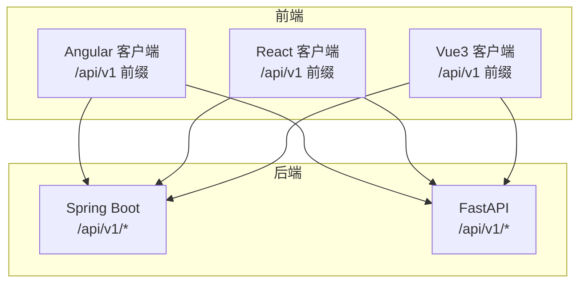
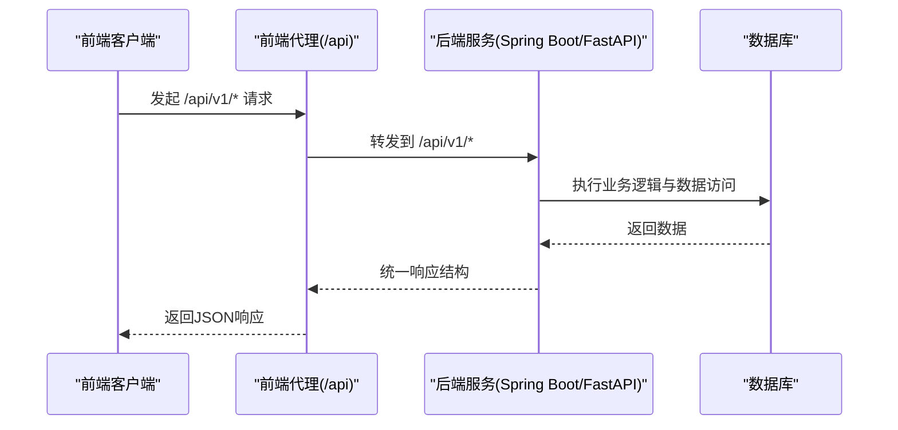
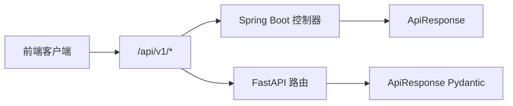
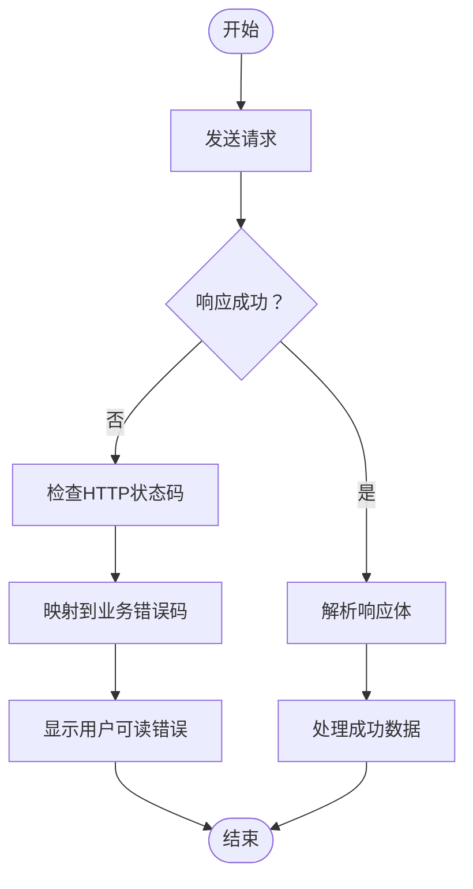

# API调用示例

<cite>
**本文档引用的文件**
- [backends/fastapi/app/main.py](file://backends/fastapi/app/main.py)
- [backends/fastapi/app/routers/capsule.py](file://backends/fastapi/app/routers/capsule.py)
- [backends/fastapi/app/routers/admin.py](file://backends/fastapi/app/routers/admin.py)
- [backends/fastapi/app/routers/health.py](file://backends/fastapi/app/routers/health.py)
- [backends/fastapi/app/schemas.py](file://backends/fastapi/app/schemas.py)
- [backends/spring-boot/src/main/java/com/hellotime/controller/CapsuleController.java](file://backends/spring-boot/src/main/java/com/hellotime/controller/CapsuleController.java)
- [backends/spring-boot/src/main/java/com/hellotime/controller/AdminController.java](file://backends/spring-boot/src/main/java/com/hellotime/controller/AdminController.java)
- [backends/spring-boot/src/main/java/com/hellotime/dto/ApiResponse.java](file://backends/spring-boot/src/main/java/com/hellotime/dto/ApiResponse.java)
- [backends/spring-boot/src/main/java/com/hellotime/config/CorsConfig.java](file://backends/spring-boot/src/main/java/com/hellotime/config/CorsConfig.java)
- [spec/api/openapi.yaml](file://spec/api/openapi.yaml)
- [frontends/angular-ts/src/app/api/index.ts](file://frontends/angular-ts/src/app/api/index.ts)
- [frontends/angular-ts/src/app/services/capsule.service.ts](file://frontends/angular-ts/src/app/services/capsule.service.ts)
- [frontends/angular-ts/proxy.conf.json](file://frontends/angular-ts/proxy.conf.json)
- [frontends/react-ts/src/api/index.ts](file://frontends/react-ts/src/api/index.ts)
- [frontends/react-ts/src/hooks/useCapsule.ts](file://frontends/react-ts/src/hooks/useCapsule.ts)
- [frontends/vue3-ts/src/api/index.ts](file://frontends/vue3-ts/src/api/index.ts)
- [frontends/vue3-ts/src/composables/useCapsule.ts](file://frontends/vue3-ts/src/composables/useCapsule.ts)
</cite>

## 目录
1. [简介](#简介)
2. [项目结构](#项目结构)
3. [核心组件](#核心组件)
4. [架构总览](#架构总览)
5. [详细组件分析](#详细组件分析)
6. [依赖分析](#依赖分析)
7. [性能考虑](#性能考虑)
8. [故障排除指南](#故障排除指南)
9. [结论](#结论)
10. [附录](#附录)

## 简介
本文件提供时间胶囊（HelloTime）应用的完整API调用示例文档，覆盖以下内容：
- 多语言与框架的调用示例：curl命令行、JavaScript fetch、Python requests
- 主要接口的调用步骤：请求头设置、参数传递、响应处理
- CORS配置与跨域请求处理
- 错误处理示例：HTTP状态码与业务错误响应
- 前端框架实现：Angular、React、Vue中的具体调用方式
- API测试最佳实践与调试技巧

## 项目结构
后端采用双栈架构：
- Spring Boot（Java）：提供REST API，统一响应包装，CORS配置
- FastAPI（Python）：提供健康检查与路由，统一异常处理与CORS配置

前端提供三套实现：
- Angular（TypeScript）
- React（TypeScript）
- Vue 3（TypeScript）

图表来源
- [backends/spring-boot/src/main/java/com/hellotime/controller/CapsuleController.java:17-56](file://backends/spring-boot/src/main/java/com/hellotime/controller/CapsuleController.java#L17-L56)
- [backends/spring-boot/src/main/java/com/hellotime/controller/AdminController.java:16-77](file://backends/spring-boot/src/main/java/com/hellotime/controller/AdminController.java#L16-L77)
- [backends/fastapi/app/routers/capsule.py:14-30](file://backends/fastapi/app/routers/capsule.py#L14-L30)
- [backends/fastapi/app/routers/admin.py:22-54](file://backends/fastapi/app/routers/admin.py#L22-L54)

章节来源
- [backends/spring-boot/src/main/java/com/hellotime/config/CorsConfig.java:12-26](file://backends/spring-boot/src/main/java/com/hellotime/config/CorsConfig.java#L12-L26)
- [backends/fastapi/app/main.py:21-29](file://backends/fastapi/app/main.py#L21-L29)
- [frontends/angular-ts/proxy.conf.json:1-7](file://frontends/angular-ts/proxy.conf.json#L1-L7)

## 核心组件
- 统一响应模型
  - Java：ApiResponse<T>，包含success、data、message、errorCode字段
  - Python：ApiResponse Pydantic模型，驼峰命名序列化
- 接口契约
  - OpenAPI规范定义了所有端点、请求体、响应体与安全方案
- CORS策略
  - Spring Boot与FastAPI均允许本地开发域名跨域访问

章节来源
- [backends/spring-boot/src/main/java/com/hellotime/dto/ApiResponse.java:16-67](file://backends/spring-boot/src/main/java/com/hellotime/dto/ApiResponse.java#L16-L67)
- [backends/fastapi/app/schemas.py:81-96](file://backends/fastapi/app/schemas.py#L81-L96)
- [spec/api/openapi.yaml:165-349](file://spec/api/openapi.yaml#L165-L349)

## 架构总览
系统通过统一的/api/v1前缀暴露REST接口，前端通过代理或直接访问后端。Spring Boot负责生产环境API，FastAPI用于健康检查与开发辅助。

图表来源
- [frontends/angular-ts/proxy.conf.json:1-7](file://frontends/angular-ts/proxy.conf.json#L1-L7)
- [backends/spring-boot/src/main/java/com/hellotime/controller/CapsuleController.java:37-54](file://backends/spring-boot/src/main/java/com/hellotime/controller/CapsuleController.java#L37-L54)
- [backends/fastapi/app/routers/capsule.py:17-30](file://backends/fastapi/app/routers/capsule.py#L17-L30)

## 详细组件分析

### 健康检查接口
- 端点：GET /api/v1/health
- 功能：返回服务状态、时间戳与技术栈信息
- 响应：统一响应结构，success=true

调用示例（curl）
- curl -i http://localhost:8080/api/v1/health

调用示例（JavaScript fetch）
- fetch('/api/v1/health').then(r => r.json()).then(console.log)

调用示例（Python requests）
- import requests; r = requests.get('http://localhost:8080/api/v1/health'); print(r.json())

章节来源
- [backends/fastapi/app/routers/health.py:14-24](file://backends/fastapi/app/routers/health.py#L14-L24)
- [spec/api/openapi.yaml:10-23](file://spec/api/openapi.yaml#L10-L23)

### 创建时间胶囊接口
- 端点：POST /api/v1/capsules
- 请求体：CreateCapsuleRequest（标题、内容、创建者、开启时间）
- 响应：统一响应结构，data为创建的胶囊信息（不含content）
- 状态码：201 Created；参数错误400

调用示例（curl）
- curl -X POST http://localhost:8080/api/v1/capsules -H "Content-Type: application/json" -d '{"title":"示例","content":"内容","creator":"张三","openAt":"2025-12-31T23:59:59Z"}'

调用示例（JavaScript fetch）
- fetch('/api/v1/capsules', {method: 'POST', body: JSON.stringify({...})}).then(r => r.json()).then(console.log)

调用示例（Python requests）
- import requests; r = requests.post('http://localhost:8080/api/v1/capsules', json={...}); print(r.json())

章节来源
- [backends/spring-boot/src/main/java/com/hellotime/controller/CapsuleController.java:37-42](file://backends/spring-boot/src/main/java/com/hellotime/controller/CapsuleController.java#L37-L42)
- [backends/fastapi/app/routers/capsule.py:17-24](file://backends/fastapi/app/routers/capsule.py#L17-L24)
- [spec/api/openapi.yaml:24-48](file://spec/api/openapi.yaml#L24-L48)

### 查询时间胶囊接口
- 端点：GET /api/v1/capsules/{code}
- 路径参数：code（8位字符）
- 响应：统一响应结构，data为胶囊详情；未到开启时间content为null
- 状态码：200 OK；不存在404

调用示例（curl）
- curl http://localhost:8080/api/v1/capsules/ABCDEFGH

调用示例（JavaScript fetch）
- fetch(`/api/v1/capsules/${code}`).then(r => r.json()).then(console.log)

调用示例（Python requests）
- import requests; r = requests.get(f'http://localhost:8080/api/v1/capsules/{code}'); print(r.json())

章节来源
- [backends/spring-boot/src/main/java/com/hellotime/controller/CapsuleController.java:51-55](file://backends/spring-boot/src/main/java/com/hellotime/controller/CapsuleController.java#L51-L55)
- [backends/fastapi/app/routers/capsule.py:27-30](file://backends/fastapi/app/routers/capsule.py#L27-L30)
- [spec/api/openapi.yaml:49-73](file://spec/api/openapi.yaml#L49-L73)

### 管理员登录接口
- 端点：POST /api/v1/admin/login
- 请求体：AdminLoginRequest（密码）
- 响应：统一响应结构，data包含token
- 状态码：200 OK；密码错误401

调用示例（curl）
- curl -X POST http://localhost:8080/api/v1/admin/login -H "Content-Type: application/json" -d '{"password":"your_password"}'

调用示例（JavaScript fetch）
- fetch('/api/v1/admin/login', {method: 'POST', body: JSON.stringify({password})}).then(r => r.json()).then(console.log)

调用示例（Python requests）
- import requests; r = requests.post('http://localhost:8080/api/v1/admin/login', json={...}); print(r.json())

章节来源
- [backends/spring-boot/src/main/java/com/hellotime/controller/AdminController.java:39-46](file://backends/spring-boot/src/main/java/com/hellotime/controller/AdminController.java#L39-L46)
- [backends/fastapi/app/routers/admin.py:25-30](file://backends/fastapi/app/routers/admin.py#L25-L30)
- [spec/api/openapi.yaml:75-98](file://spec/api/openapi.yaml#L75-L98)

### 管理员分页查询接口
- 端点：GET /api/v1/admin/capsules?page=0&size=20
- 认证：Bearer Token（Authorization: Bearer <token>）
- 响应：统一响应结构，data为分页结果
- 状态码：200 OK；未授权401

调用示例（curl）
- curl -H "Authorization: Bearer YOUR_TOKEN" "http://localhost:8080/api/v1/admin/capsules?page=0&size=20"

调用示例（JavaScript fetch）
- fetch('/api/v1/admin/capsules?page=0&size=20', {headers: {'Authorization': 'Bearer YOUR_TOKEN'}}).then(r => r.json()).then(console.log)

调用示例（Python requests）
- import requests; r = requests.get('http://localhost:8080/api/v1/admin/capsules', params={'page':0,'size':20}, headers={'Authorization':'Bearer YOUR_TOKEN'}); print(r.json())

章节来源
- [backends/spring-boot/src/main/java/com/hellotime/controller/AdminController.java:57-62](file://backends/spring-boot/src/main/java/com/hellotime/controller/AdminController.java#L57-L62)
- [backends/fastapi/app/routers/admin.py:33-44](file://backends/fastapi/app/routers/admin.py#L33-L44)
- [spec/api/openapi.yaml:100-130](file://spec/api/openapi.yaml#L100-L130)

### 管理员删除胶囊接口
- 端点：DELETE /api/v1/admin/capsules/{code}
- 认证：Bearer Token
- 响应：统一响应结构，data为null
- 状态码：200 OK；未授权401；不存在404

调用示例（curl）
- curl -X DELETE -H "Authorization: Bearer YOUR_TOKEN" http://localhost:8080/api/v1/admin/capsules/ABCDEFGH

调用示例（JavaScript fetch）
- fetch(`/api/v1/admin/capsules/${code}`, {method: 'DELETE', headers: {'Authorization': 'Bearer YOUR_TOKEN'}}).then(r => r.json()).then(console.log)

调用示例（Python requests）
- import requests; r = requests.delete(f'http://localhost:8080/api/v1/admin/capsules/{code}', headers={'Authorization':'Bearer YOUR_TOKEN'}); print(r.json())

章节来源
- [backends/spring-boot/src/main/java/com/hellotime/controller/AdminController.java:72-76](file://backends/spring-boot/src/main/java/com/hellotime/controller/AdminController.java#L72-L76)
- [backends/fastapi/app/routers/admin.py:47-54](file://backends/fastapi/app/routers/admin.py#L47-L54)
- [spec/api/openapi.yaml:132-163](file://spec/api/openapi.yaml#L132-L163)

## 依赖分析
- 前端到后端的依赖
  - Angular/React/Vue均通过/api/v1前缀调用后端
  - Spring Boot提供生产API，FastAPI提供健康检查与开发辅助
- CORS依赖
  - Spring Boot与FastAPI分别配置允许本地开发域名跨域
- 统一响应依赖
  - Java与Python均使用统一响应模型，便于前端一致处理

图表来源
- [frontends/angular-ts/src/app/api/index.ts:8-27](file://frontends/angular-ts/src/app/api/index.ts#L8-L27)
- [frontends/react-ts/src/api/index.ts:8-31](file://frontends/react-ts/src/api/index.ts#L8-L31)
- [frontends/vue3-ts/src/api/index.ts:8-37](file://frontends/vue3-ts/src/api/index.ts#L8-L37)
- [backends/spring-boot/src/main/java/com/hellotime/dto/ApiResponse.java:16-67](file://backends/spring-boot/src/main/java/com/hellotime/dto/ApiResponse.java#L16-L67)
- [backends/fastapi/app/schemas.py:81-96](file://backends/fastapi/app/schemas.py#L81-L96)

章节来源
- [backends/spring-boot/src/main/java/com/hellotime/config/CorsConfig.java:14-26](file://backends/spring-boot/src/main/java/com/hellotime/config/CorsConfig.java#L14-L26)
- [backends/fastapi/app/main.py:22-29](file://backends/fastapi/app/main.py#L22-L29)

## 性能考虑
- 统一响应模型减少前端分支判断复杂度
- 前端代理避免跨域带来的额外握手开销
- 合理使用分页参数控制数据量（page/size）
- 建议对频繁查询的接口增加缓存策略（如浏览器缓存或CDN）

## 故障排除指南
常见错误与处理
- 400 参数校验失败
  - 检查请求体字段类型与长度限制
  - 参考OpenAPI定义的schema
- 401 未授权
  - 确认Bearer Token存在且有效
  - 检查管理员登录流程
- 404 资源不存在
  - 确认code是否正确（8位字符）
  - 检查胶囊是否存在
- 500 服务器内部错误
  - 查看后端日志
  - 检查数据库连接与服务状态

统一错误处理流程

章节来源
- [backends/fastapi/app/main.py:37-88](file://backends/fastapi/app/main.py#L37-L88)
- [spec/api/openapi.yaml:165-349](file://spec/api/openapi.yaml#L165-L349)

## 结论
本项目提供了清晰的API契约与统一响应模型，配合多前端框架的调用示例，能够快速集成与测试。建议在生产环境中结合Spring Security与JWT进行更严格的鉴权，并完善监控与日志体系。

## 附录

### CORS配置与跨域处理
- Spring Boot CORS
  - 允许来源：http://localhost:*
  - 允许方法：GET、POST、PUT、DELETE、OPTIONS
  - 允许头：*
  - 凭据：允许
  - 最大预检缓存：3600秒

- FastAPI CORS
  - 允许来源正则：http://localhost(:\d+)?
  - 允许方法：GET、POST、PUT、DELETE、OPTIONS
  - 允许头：*
  - 凭据：允许
  - 最大预检缓存：3600秒

- 前端代理（Angular）
  - 将/api转发至http://localhost:8080，避免跨域问题

章节来源
- [backends/spring-boot/src/main/java/com/hellotime/config/CorsConfig.java:14-26](file://backends/spring-boot/src/main/java/com/hellotime/config/CorsConfig.java#L14-L26)
- [backends/fastapi/app/main.py:22-29](file://backends/fastapi/app/main.py#L22-L29)
- [frontends/angular-ts/proxy.conf.json:1-7](file://frontends/angular-ts/proxy.conf.json#L1-L7)

### 前端框架调用示例

#### Angular
- API封装：/api/v1前缀，统一错误处理
- 管理员接口：自动附加Authorization头
- 代理配置：/api -> http://localhost:8080

章节来源
- [frontends/angular-ts/src/app/api/index.ts:10-67](file://frontends/angular-ts/src/app/api/index.ts#L10-L67)
- [frontends/angular-ts/src/app/services/capsule.service.ts:11-39](file://frontends/angular-ts/src/app/services/capsule.service.ts#L11-L39)
- [frontends/angular-ts/proxy.conf.json:1-7](file://frontends/angular-ts/proxy.conf.json#L1-L7)

#### React
- API封装：/api/v1前缀，统一错误处理
- 管理员接口：自动附加Authorization头

章节来源
- [frontends/react-ts/src/api/index.ts:14-93](file://frontends/react-ts/src/api/index.ts#L14-L93)
- [frontends/react-ts/src/hooks/useCapsule.ts:14-44](file://frontends/react-ts/src/hooks/useCapsule.ts#L14-L44)

#### Vue 3
- API封装：/api/v1前缀，统一错误处理
- 管理员接口：自动附加Authorization头

章节来源
- [frontends/vue3-ts/src/api/index.ts:19-119](file://frontends/vue3-ts/src/api/index.ts#L19-L119)
- [frontends/vue3-ts/src/composables/useCapsule.ts:24-60](file://frontends/vue3-ts/src/composables/useCapsule.ts#L24-L60)

### API测试最佳实践与调试技巧
- 使用curl验证基础功能与错误场景
- 在Postman中导入OpenAPI规范，自动生成测试集合
- 利用浏览器开发者工具查看网络请求与响应
- 前端统一错误处理：捕获异常并提示用户
- 后端日志：记录请求ID与关键参数，便于追踪

章节来源
- [spec/api/openapi.yaml:1-349](file://spec/api/openapi.yaml#L1-L349)