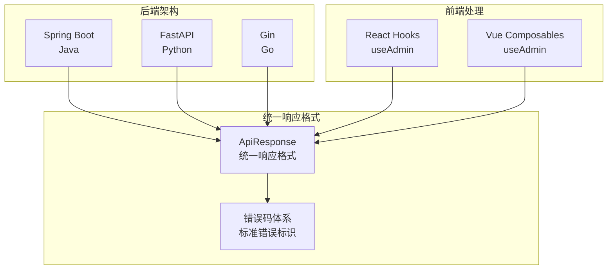
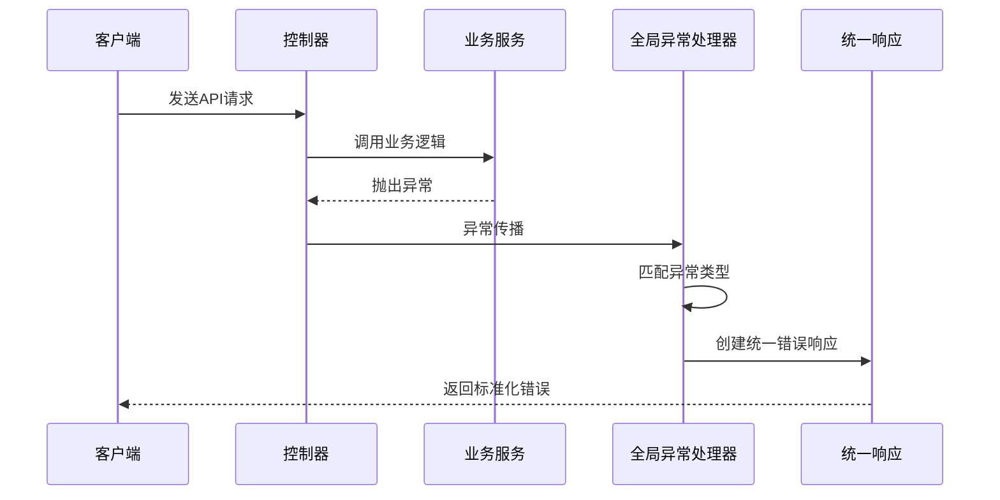
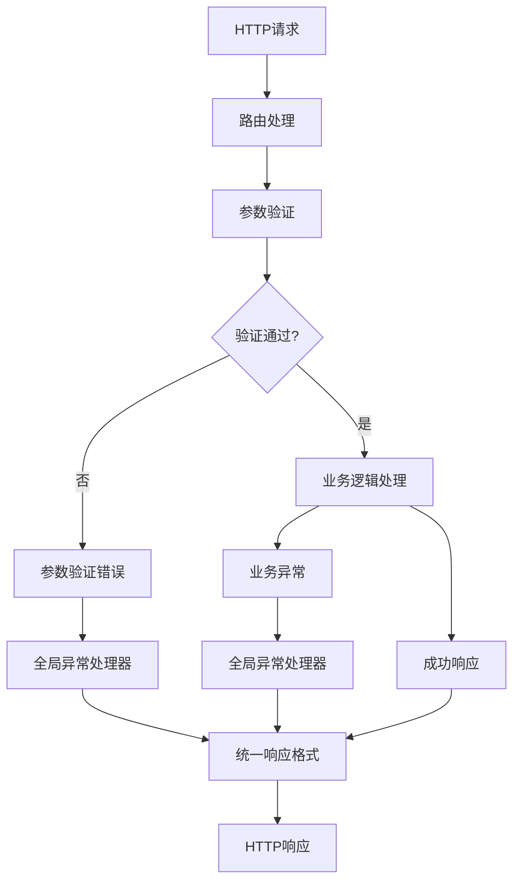
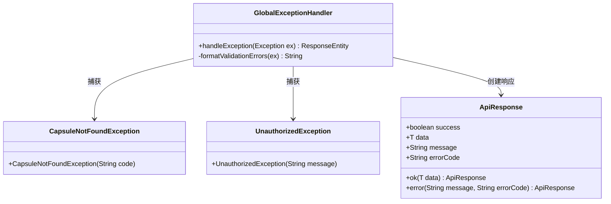
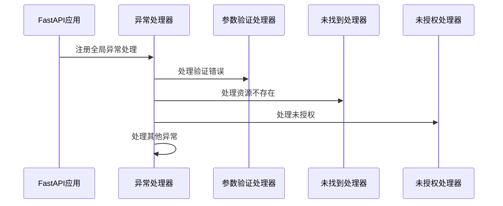
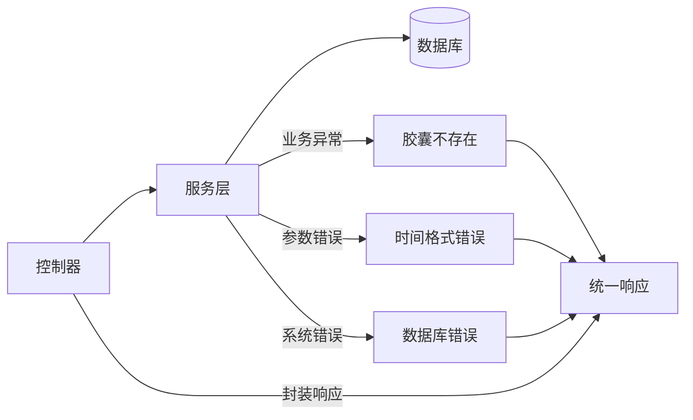
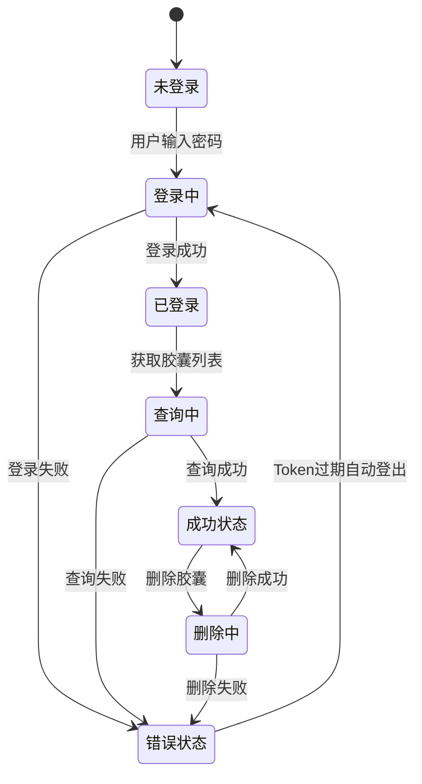
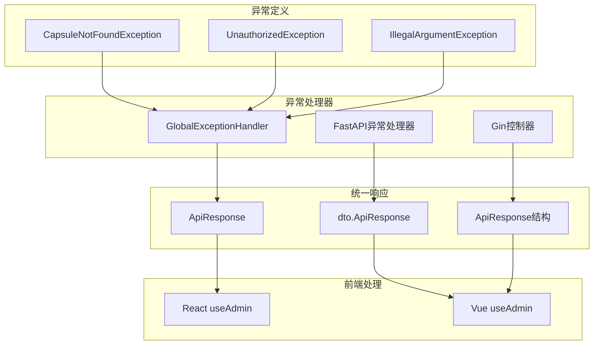

# API错误处理

<cite>
**本文档引用的文件**
- [GlobalExceptionHandler.java](file://backends/spring-boot/src/main/java/com/hellotime/exception/GlobalExceptionHandler.java)
- [CapsuleNotFoundException.java](file://backends/spring-boot/src/main/java/com/hellotime/exception/CapsuleNotFoundException.java)
- [UnauthorizedException.java](file://backends/spring-boot/src/main/java/com/hellotime/exception/UnauthorizedException.java)
- [ApiResponse.java](file://backends/spring-boot/src/main/java/com/hellotime/dto/ApiResponse.java)
- [main.py](file://backends/fastapi/app/main.py)
- [dto.go](file://backends/gin/dto/dto.go)
- [capsule.go](file://backends/gin/handler/capsule.go)
- [capsule_service.go](file://backends/gin/service/capsule_service.go)
- [useAdmin.ts (React)](file://frontends/react-ts/src/hooks/useAdmin.ts)
- [useAdmin.ts (Vue3)](file://frontends/vue3-ts/src/composables/useAdmin.ts)
</cite>

## 目录
1. [简介](#简介)
2. [项目结构](#项目结构)
3. [核心组件](#核心组件)
4. [架构概览](#架构概览)
5. [详细组件分析](#详细组件分析)
6. [依赖关系分析](#依赖关系分析)
7. [性能考虑](#性能考虑)
8. [故障排除指南](#故障排除指南)
9. [结论](#结论)

## 简介

HelloTime项目实现了统一的API错误处理机制，确保所有后端服务（Spring Boot、FastAPI、Gin）都遵循一致的错误响应格式和错误码体系。该机制提供了标准化的错误处理流程，包括参数验证错误、业务逻辑错误、系统异常和权限错误的统一处理。

## 项目结构

HelloTime项目采用多后端架构，每个后端都实现了独立的错误处理机制：



**图表来源**
- [GlobalExceptionHandler.java:17-51](file://backends/spring-boot/src/main/java/com/hellotime/exception/GlobalExceptionHandler.java#L17-L51)
- [main.py:37-89](file://backends/fastapi/app/main.py#L37-L89)
- [dto.go:5-34](file://backends/gin/dto/dto.go#L5-L34)

**章节来源**
- [GlobalExceptionHandler.java:1-66](file://backends/spring-boot/src/main/java/com/hellotime/exception/GlobalExceptionHandler.java#L1-L66)
- [main.py:1-89](file://backends/fastapi/app/main.py#L1-L89)
- [dto.go:1-77](file://backends/gin/dto/dto.go#L1-L77)

## 核心组件

### 统一响应格式

所有后端服务都实现了统一的API响应格式，确保前后端数据交互的一致性：

| 字段名 | 类型 | 必填 | 描述 | 示例值 |
|--------|------|------|------|--------|
| success | boolean | 是 | 请求是否成功 | true/false |
| data | T | 否 | 响应数据（成功时包含） | {} |
| message | string | 否 | 响应消息 | "操作成功" |
| errorCode | string | 否 | 错误码（失败时包含） | "INTERNAL_ERROR" |

### 错误码体系

项目建立了标准化的错误码标识系统：

| 错误码 | HTTP状态码 | 描述 | 场景示例 |
|--------|------------|------|----------|
| CAPSULE_NOT_FOUND | 404 | 资源不存在 | 查询不存在的胶囊码 |
| UNAUTHORIZED | 401 | 未授权访问 | Token无效或缺失 |
| VALIDATION_ERROR | 400 | 参数验证失败 | 请求参数不符合约束 |
| BAD_REQUEST | 400 | 请求参数错误 | 业务逻辑参数错误 |
| INTERNAL_ERROR | 500 | 服务器内部错误 | 未预期的系统异常 |

**章节来源**
- [ApiResponse.java:1-48](file://backends/spring-boot/src/main/java/com/hellotime/dto/ApiResponse.java#L1-L48)
- [GlobalExceptionHandler.java:35-50](file://backends/spring-boot/src/main/java/com/hellotime/exception/GlobalExceptionHandler.java#L35-L50)
- [main.py:40-89](file://backends/fastapi/app/main.py#L40-L89)

## 架构概览

### Spring Boot错误处理架构



**图表来源**
- [GlobalExceptionHandler.java:27-51](file://backends/spring-boot/src/main/java/com/hellotime/exception/GlobalExceptionHandler.java#L27-L51)

### FastAPI错误处理架构



**图表来源**
- [main.py:37-89](file://backends/fastapi/app/main.py#L37-L89)

**章节来源**
- [GlobalExceptionHandler.java:17-51](file://backends/spring-boot/src/main/java/com/hellotime/exception/GlobalExceptionHandler.java#L17-L51)
- [main.py:37-89](file://backends/fastapi/app/main.py#L37-L89)

## 详细组件分析

### Spring Boot全局异常处理器

#### 异常处理机制

Spring Boot使用@RestControllerAdvice注解实现全局异常处理，通过Java 21的switch表达式模式匹配来简化异常处理逻辑：



**图表来源**
- [GlobalExceptionHandler.java:17-66](file://backends/spring-boot/src/main/java/com/hellotime/exception/GlobalExceptionHandler.java#L17-L66)
- [CapsuleNotFoundException.java:8-18](file://backends/spring-boot/src/main/java/com/hellotime/exception/CapsuleNotFoundException.java#L8-L18)
- [UnauthorizedException.java:8-18](file://backends/spring-boot/src/main/java/com/hellotime/exception/UnauthorizedException.java#L8-L18)
- [ApiResponse.java:22-48](file://backends/spring-boot/src/main/java/com/hellotime/dto/ApiResponse.java#L22-L48)

#### 异常类型映射

| 异常类型 | HTTP状态码 | 错误码 | 处理逻辑 |
|----------|------------|--------|----------|
| CapsuleNotFoundException | 404 | CAPSULE_NOT_FOUND | 返回资源不存在错误 |
| UnauthorizedException | 401 | UNAUTHORIZED | 返回未授权错误 |
| IllegalArgumentException | 400 | BAD_REQUEST | 返回参数错误 |
| MethodArgumentNotValidException | 400 | VALIDATION_ERROR | 格式化字段验证错误 |
| Exception | 500 | INTERNAL_ERROR | 返回通用服务器错误 |

**章节来源**
- [GlobalExceptionHandler.java:27-66](file://backends/spring-boot/src/main/java/com/hellotime/exception/GlobalExceptionHandler.java#L27-L66)

### FastAPI异常处理机制

#### 全局异常处理器实现

FastAPI使用装饰器模式实现异常处理，针对不同类型的异常提供专门的处理函数：



**图表来源**
- [main.py:37-89](file://backends/fastapi/app/main.py#L37-L89)

#### 参数验证错误处理

FastAPI使用Pydantic进行参数验证，自定义验证错误处理器将多个字段错误合并为统一格式：

**章节来源**
- [main.py:58-70](file://backends/fastapi/app/main.py#L58-L70)

### Gin后端错误处理

#### 业务异常处理

Gin后端通过服务层抛出具体的业务异常，控制器层捕获并转换为统一的错误响应：



**图表来源**
- [capsule.go:20-55](file://backends/gin/handler/capsule.go#L20-L55)
- [capsule_service.go:132-143](file://backends/gin/service/capsule_service.go#L132-L143)

**章节来源**
- [capsule.go:19-55](file://backends/gin/handler/capsule.go#L19-L55)
- [capsule_service.go:25-29](file://backends/gin/service/capsule_service.go#L25-L29)

### 前端错误处理实现

#### React Hooks错误处理

React前端使用自定义Hook封装管理员功能，实现了完整的错误处理机制：



**图表来源**
- [useAdmin.ts (React):49-93](file://frontends/react-ts/src/hooks/useAdmin.ts#L49-L93)

#### Vue3 Composables错误处理

Vue3前端使用Composition API实现相似的错误处理逻辑：

**章节来源**
- [useAdmin.ts (React):1-133](file://frontends/react-ts/src/hooks/useAdmin.ts#L1-L133)
- [useAdmin.ts (Vue3):1-132](file://frontends/vue3-ts/src/composables/useAdmin.ts#L1-L132)

## 依赖关系分析

### 错误处理依赖图



**图表来源**
- [GlobalExceptionHandler.java:27-51](file://backends/spring-boot/src/main/java/com/hellotime/exception/GlobalExceptionHandler.java#L27-L51)
- [main.py:37-89](file://backends/fastapi/app/main.py#L37-L89)
- [capsule.go:20-55](file://backends/gin/handler/capsule.go#L20-L55)

### 错误响应示例

#### 400 参数错误示例

```json
{
  "success": false,
  "data": null,
  "message": "title: 不能为空; content: 不能为空",
  "errorCode": "VALIDATION_ERROR"
}
```

#### 401 未授权示例

```json
{
  "success": false,
  "data": null,
  "message": "Token无效或已过期",
  "errorCode": "UNAUTHORIZED"
}
```

#### 404 资源不存在示例

```json
{
  "success": false,
  "data": null,
  "message": "胶囊不存在：ABCDEF12",
  "errorCode": "CAPSULE_NOT_FOUND"
}
```

#### 500 服务器错误示例

```json
{
  "success": false,
  "data": null,
  "message": "服务器内部错误",
  "errorCode": "INTERNAL_ERROR"
}
```

**章节来源**
- [GlobalExceptionHandler.java:35-50](file://backends/spring-boot/src/main/java/com/hellotime/exception/GlobalExceptionHandler.java#L35-L50)
- [main.py:40-89](file://backends/fastapi/app/main.py#L40-L89)
- [capsule.go:46-50](file://backends/gin/handler/capsule.go#L46-L50)

## 性能考虑

### 错误处理性能优化

1. **异常处理成本控制**
   - 避免在热路径上频繁抛出异常
   - 使用快速失败策略减少不必要的计算
   - 缓存常见的错误响应格式

2. **响应序列化优化**
   - 使用流式JSON序列化减少内存占用
   - 避免在错误响应中包含敏感信息
   - 合理使用字段过滤减少响应大小

3. **日志性能影响**
   - 异步记录错误日志避免阻塞请求
   - 限制错误日志的详细程度
   - 使用采样策略处理高频错误

## 故障排除指南

### 常见错误诊断

#### 参数验证错误排查

1. **检查请求格式**
   - 确认Content-Type设置为application/json
   - 验证JSON结构符合API规范
   - 检查必填字段是否完整

2. **验证字段约束**
   - 检查字符串长度限制
   - 确认日期格式符合ISO 8601
   - 验证数值范围和类型

#### 权限错误排查

1. **Token验证**
   - 确认Token格式正确（Bearer前缀）
   - 检查Token是否过期
   - 验证签名密钥配置

2. **权限检查**
   - 确认管理员账户状态
   - 检查Token权限范围
   - 验证请求路径权限

#### 系统异常排查

1. **数据库连接**
   - 检查数据库连接池配置
   - 验证数据库服务状态
   - 确认SQL语句执行情况

2. **服务监控**
   - 查看应用日志级别
   - 监控系统资源使用
   - 检查第三方服务可用性

### 前端错误处理最佳实践

#### 错误状态管理

1. **错误分类处理**
   ```typescript
   // 基于错误码进行分类处理
   switch(errorCode) {
     case 'UNAUTHORIZED':
       // 自动登出并跳转登录页
       break;
     case 'CAPSULE_NOT_FOUND':
       // 显示友好的资源不存在提示
       break;
     case 'VALIDATION_ERROR':
       // 显示具体的字段验证错误
       break;
   }
   ```

2. **用户体验优化**
   - 提供清晰的错误描述
   - 支持错误重试机制
   - 保持界面状态一致性

**章节来源**
- [useAdmin.ts (React):84-88](file://frontends/react-ts/src/hooks/useAdmin.ts#L84-L88)
- [useAdmin.ts (Vue3):88-92](file://frontends/vue3-ts/src/composables/useAdmin.ts#L88-L92)

## 结论

HelloTime项目的API错误处理机制通过统一的响应格式和标准化的错误码体系，实现了跨后端的一致性错误处理。该机制具有以下特点：

1. **统一性**：所有后端服务遵循相同的错误响应格式
2. **可扩展性**：支持新增异常类型和错误码
3. **可观测性**：提供完整的错误日志和监控支持
4. **用户体验**：前端能够优雅地处理和展示各种错误场景

通过合理的错误处理设计，项目确保了系统的稳定性和可靠性，同时为开发者和用户提供了清晰的错误反馈和良好的使用体验。