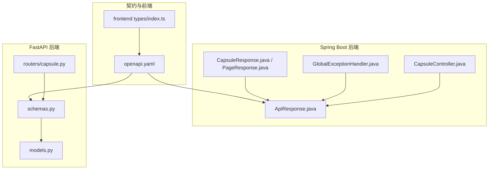
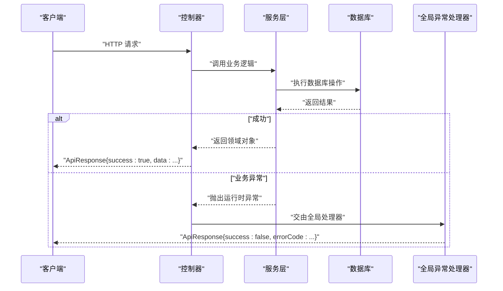
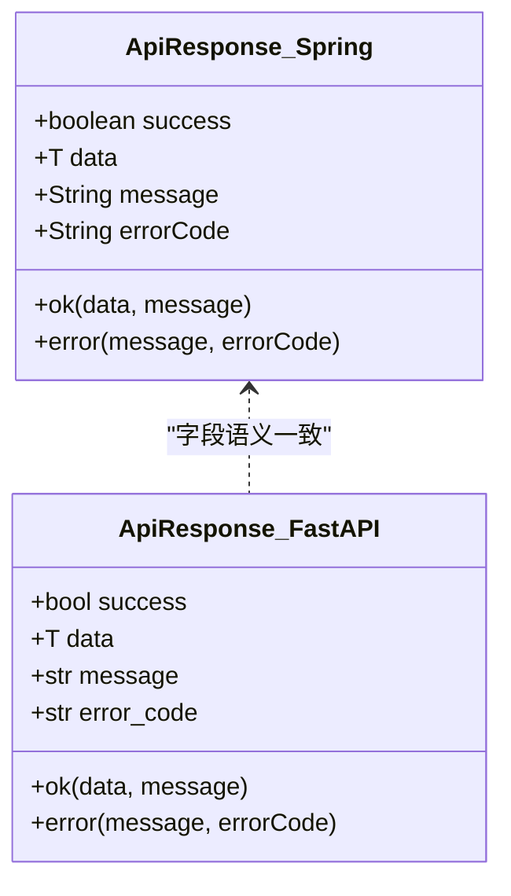
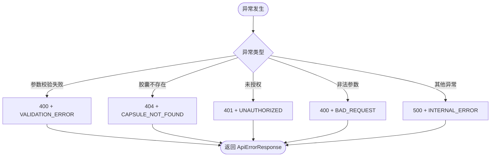
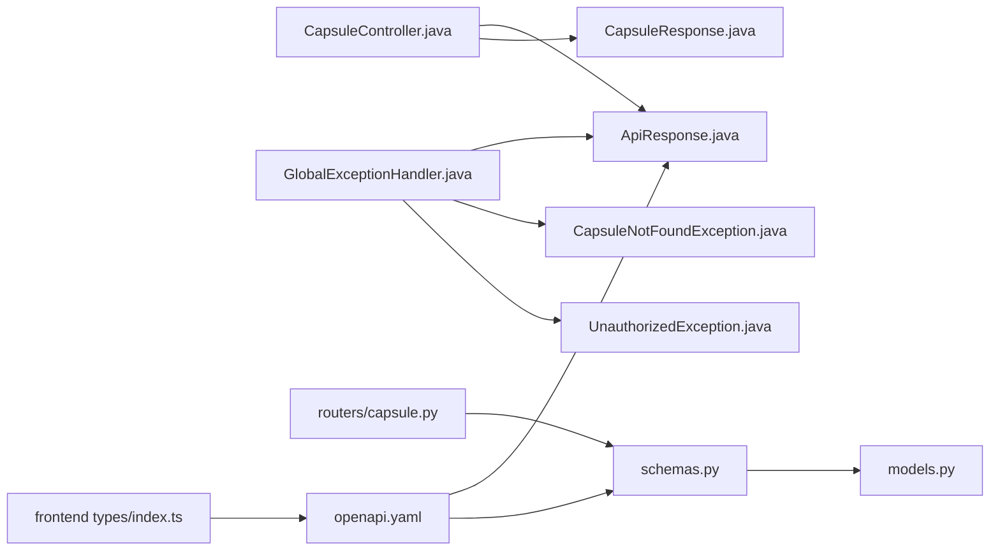

# 响应格式规范

<cite>
**本文引用的文件**
- [ApiResponse.java](file://backends/spring-boot/src/main/java/com/hellotime/dto/ApiResponse.java)
- [CapsuleResponse.java](file://backends/spring-boot/src/main/java/com/hellotime/dto/CapsuleResponse.java)
- [PageResponse.java](file://backends/spring-boot/src/main/java/com/hellotime/dto/PageResponse.java)
- [GlobalExceptionHandler.java](file://backends/spring-boot/src/main/java/com/hellotime/exception/GlobalExceptionHandler.java)
- [CapsuleNotFoundException.java](file://backends/spring-boot/src/main/java/com/hellotime/exception/CapsuleNotFoundException.java)
- [UnauthorizedException.java](file://backends/spring-boot/src/main/java/com/hellotime/exception/UnauthorizedException.java)
- [CapsuleController.java](file://backends/spring-boot/src/main/java/com/hellotime/controller/CapsuleController.java)
- [ApiResponse（FastAPI）.py](file://backends/fastapi/app/schemas.py)
- [Capsule（FastAPI）.py](file://backends/fastapi/app/models.py)
- [Capsule 路由（FastAPI）.py](file://backends/fastapi/app/routers/capsule.py)
- [OpenAPI 规范](file://spec/api/openapi.yaml)
- [胶囊控制器测试（Spring Boot）.java](file://backends/spring-boot/src/test/java/com/hellotime/controller/CapsuleControllerTest.java)
- [胶囊 API 测试（FastAPI）.py](file://backends/fastapi/tests/test_capsule_api.py)
- [前端 TypeScript 类型定义](file://frontends/react-ts/src/types/index.ts)
</cite>

## 目录
1. [简介](#简介)
2. [项目结构](#项目结构)
3. [核心组件](#核心组件)
4. [架构总览](#架构总览)
5. [详细组件分析](#详细组件分析)
6. [依赖分析](#依赖分析)
7. [性能考虑](#性能考虑)
8. [故障排查指南](#故障排查指南)
9. [结论](#结论)
10. [附录](#附录)

## 简介
本规范定义了 HelloTimeByClaude 项目中统一的 API 响应格式，确保 Java Spring Boot 与 Python FastAPI 双后端在响应结构上保持一致，便于前端消费与集成。统一响应格式包含以下字段：
- success：布尔值，表示请求是否成功
- data：响应数据，成功时存在；部分场景可能为 null
- message：人类可读的消息，用于补充说明
- errorCode：错误码，仅在失败时存在

同时，本规范明确了错误响应格式、常见错误码及其含义，并对各接口返回的数据模型进行说明，如 CapsuleCreated、CapsuleDetail、CapsulePage 等。最后，提供多种响应场景的示例与版本控制与向后兼容性建议。

## 项目结构
本项目采用双后端架构：
- Spring Boot 后端：提供统一响应包装类、异常处理、控制器与 DTO
- FastAPI 后端：提供 Pydantic 响应模型、路由与服务层
- OpenAPI 规范：定义接口契约与响应模型
- 前端 TypeScript：定义与后端一致的类型定义

图表来源
- [ApiResponse.java:1-68](file://backends/spring-boot/src/main/java/com/hellotime/dto/ApiResponse.java#L1-L68)
- [CapsuleController.java:1-57](file://backends/spring-boot/src/main/java/com/hellotime/controller/CapsuleController.java#L1-L57)
- [GlobalExceptionHandler.java:1-87](file://backends/spring-boot/src/main/java/com/hellotime/exception/GlobalExceptionHandler.java#L1-L87)
- [CapsuleResponse.java:1-31](file://backends/spring-boot/src/main/java/com/hellotime/dto/CapsuleResponse.java#L1-L31)
- [PageResponse.java:1-26](file://backends/spring-boot/src/main/java/com/hellotime/dto/PageResponse.java#L1-L26)
- [ApiResponse（FastAPI）.py:1-96](file://backends/fastapi/app/schemas.py#L1-L96)
- [Capsule（FastAPI）.py:1-26](file://backends/fastapi/app/models.py#L1-L26)
- [Capsule 路由（FastAPI）.py:1-31](file://backends/fastapi/app/routers/capsule.py#L1-L31)
- [OpenAPI 规范:1-349](file://spec/api/openapi.yaml#L1-L349)
- [前端 TypeScript 类型定义:1-80](file://frontends/react-ts/src/types/index.ts#L1-L80)

章节来源
- [ApiResponse.java:1-68](file://backends/spring-boot/src/main/java/com/hellotime/dto/ApiResponse.java#L1-L68)
- [ApiResponse（FastAPI）.py:1-96](file://backends/fastapi/app/schemas.py#L1-L96)
- [OpenAPI 规范:1-349](file://spec/api/openapi.yaml#L1-L349)
- [前端 TypeScript 类型定义:1-80](file://frontends/react-ts/src/types/index.ts#L1-L80)

## 核心组件
- 统一响应包装类
  - Spring Boot：ApiResponse<T>，包含 success、data、message、errorCode 字段，提供 ok() 与 error() 静态工厂方法
  - FastAPI：ApiResponse[T] Pydantic 模型，字段同上，提供 ok() 与 error() 静态方法
- 数据模型
  - CapsuleResponse：封装胶囊详情字段（code、title、content、creator、openAt、createdAt、opened）
  - PageResponse<T>：封装分页字段（content、totalElements、totalPages、number、size）
- 异常处理
  - GlobalExceptionHandler：集中处理参数校验、未找到、未授权、非法参数与通用异常，统一返回 ApiErrorResponse
- OpenAPI 契约
  - 定义了 ApiResponse_CapsuleCreated、ApiResponse_CapsuleDetail、ApiResponse_CapsulePage、ApiErrorResponse 等模型

章节来源
- [ApiResponse.java:15-67](file://backends/spring-boot/src/main/java/com/hellotime/dto/ApiResponse.java#L15-L67)
- [ApiResponse（FastAPI）.py:81-96](file://backends/fastapi/app/schemas.py#L81-L96)
- [CapsuleResponse.java:6-30](file://backends/spring-boot/src/main/java/com/hellotime/dto/CapsuleResponse.java#L6-L30)
- [PageResponse.java:5-25](file://backends/spring-boot/src/main/java/com/hellotime/dto/PageResponse.java#L5-L25)
- [GlobalExceptionHandler.java:15-86](file://backends/spring-boot/src/main/java/com/hellotime/exception/GlobalExceptionHandler.java#L15-L86)
- [OpenAPI 规范:172-349](file://spec/api/openapi.yaml#L172-L349)

## 架构总览
下图展示了请求从控制器到响应的流程，以及异常如何被全局处理器统一转换为错误响应：

图表来源
- [CapsuleController.java:37-55](file://backends/spring-boot/src/main/java/com/hellotime/controller/CapsuleController.java#L37-L55)
- [GlobalExceptionHandler.java:24-85](file://backends/spring-boot/src/main/java/com/hellotime/exception/GlobalExceptionHandler.java#L24-L85)
- [ApiResponse.java:27-55](file://backends/spring-boot/src/main/java/com/hellotime/dto/ApiResponse.java#L27-L55)
- [Capsule 路由（FastAPI）.py:17-31](file://backends/fastapi/app/routers/capsule.py#L17-L31)
- [ApiResponse（FastAPI）.py:89-95](file://backends/fastapi/app/schemas.py#L89-L95)

## 详细组件分析

### 统一响应格式（ApiResponse）
- 字段定义
  - success：布尔值，true 表示成功，false 表示失败
  - data：泛型数据，成功时存在；部分场景允许为 null
  - message：字符串，可选的人类可读消息
  - errorCode：字符串，仅在失败时存在，用于标识错误类型
- 工厂方法
  - ok(data, message?)：构造成功响应
  - error(message, errorCode)：构造失败响应
- 序列化策略
  - Spring Boot：使用 Jackson 的 JsonInclude.Include.NON_NULL，自动忽略 null 字段
  - FastAPI：使用 Pydantic 的 alias_generator 与 exclude_none，确保 camelCase 且排除 null

图表来源
- [ApiResponse.java:15-67](file://backends/spring-boot/src/main/java/com/hellotime/dto/ApiResponse.java#L15-L67)
- [ApiResponse（FastAPI）.py:81-96](file://backends/fastapi/app/schemas.py#L81-L96)

章节来源
- [ApiResponse.java:15-67](file://backends/spring-boot/src/main/java/com/hellotime/dto/ApiResponse.java#L15-L67)
- [ApiResponse（FastAPI）.py:81-96](file://backends/fastapi/app/schemas.py#L81-L96)

### 错误响应格式（ApiErrorResponse）
- 结构
  - success 固定为 false
  - data 可为 null
  - message 为错误描述
  - errorCode 为错误码
- 常见错误码
  - VALIDATION_ERROR：参数校验失败
  - CAPSULE_NOT_FOUND：胶囊不存在
  - UNAUTHORIZED：未授权访问
  - BAD_REQUEST：非法参数
  - INTERNAL_ERROR：服务器内部错误
- 异常映射
  - 参数校验失败：MethodArgumentNotValidException → 400 + VALIDATION_ERROR
  - 胶囊不存在：CapsuleNotFoundException → 404 + CAPSULE_NOT_FOUND
  - 未授权：UnauthorizedException → 401 + UNAUTHORIZED
  - 非法参数：IllegalArgumentException → 400 + BAD_REQUEST
  - 其他异常：Exception → 500 + INTERNAL_ERROR

图表来源
- [GlobalExceptionHandler.java:24-85](file://backends/spring-boot/src/main/java/com/hellotime/exception/GlobalExceptionHandler.java#L24-L85)
- [CapsuleNotFoundException.java:8-18](file://backends/spring-boot/src/main/java/com/hellotime/exception/CapsuleNotFoundException.java#L8-L18)
- [UnauthorizedException.java:8-18](file://backends/spring-boot/src/main/java/com/hellotime/exception/UnauthorizedException.java#L8-L18)

章节来源
- [GlobalExceptionHandler.java:15-86](file://backends/spring-boot/src/main/java/com/hellotime/exception/GlobalExceptionHandler.java#L15-L86)
- [CapsuleNotFoundException.java:1-19](file://backends/spring-boot/src/main/java/com/hellotime/exception/CapsuleNotFoundException.java#L1-L19)
- [UnauthorizedException.java:1-19](file://backends/spring-boot/src/main/java/com/hellotime/exception/UnauthorizedException.java#L1-L19)

### 数据模型

#### CapsuleResponse（胶囊详情）
- 字段
  - code：8 位胶囊码
  - title：标题
  - content：内容；时间未到时为 null
  - creator：创建者
  - openAt：开启时间（ISO 8601 字符串）
  - createdAt：创建时间（ISO 8601 字符串，可选）
  - opened：是否已开启（可选）
- 说明
  - 未开启时 content 为 null，opened 为 false
  - 该模型在 Spring Boot 与 FastAPI 中字段语义一致

章节来源
- [CapsuleResponse.java:6-30](file://backends/spring-boot/src/main/java/com/hellotime/dto/CapsuleResponse.java#L6-L30)
- [ApiResponse（FastAPI）.py:54-65](file://backends/fastapi/app/schemas.py#L54-L65)

#### CapsuleCreated（创建成功）
- 字段
  - code、title、creator、openAt、createdAt：与 CapsuleDetail 类似，但不包含 content
- 用途
  - 创建成功时返回，避免泄露 content

章节来源
- [OpenAPI 规范:228-243](file://spec/api/openapi.yaml#L228-L243)

#### CapsulePage（分页列表）
- 字段
  - content：数组，元素为 CapsuleDetail
  - totalElements：总数
  - totalPages：总页数
  - number：当前页（从 0 开始）
  - size：每页大小
- 用途
  - 管理后台分页查询胶囊列表

章节来源
- [PageResponse.java:5-25](file://backends/spring-boot/src/main/java/com/hellotime/dto/PageResponse.java#L5-L25)
- [OpenAPI 规范:266-281](file://spec/api/openapi.yaml#L266-L281)

#### PageResponse<T>（分页包装）
- 字段
  - content：List<T>
  - totalElements、totalPages、number、size：分页元数据
- 用途
  - Spring Boot 中用于封装分页数据

章节来源
- [PageResponse.java:5-25](file://backends/spring-boot/src/main/java/com/hellotime/dto/PageResponse.java#L5-L25)

### 接口与响应示例

#### 创建胶囊（POST /api/v1/capsules）
- 成功响应
  - 状态码：201
  - data：CapsuleCreated
  - message：操作成功提示
- 参数校验失败
  - 状态码：400
  - errorCode：VALIDATION_ERROR
  - message：字段级错误描述

章节来源
- [CapsuleController.java:37-42](file://backends/spring-boot/src/main/java/com/hellotime/controller/CapsuleController.java#L37-L42)
- [Capsule 路由（FastAPI）.py:17-24](file://backends/fastapi/app/routers/capsule.py#L17-L24)
- [胶囊控制器测试（Spring Boot）.java:38-63](file://backends/spring-boot/src/test/java/com/hellotime/controller/CapsuleControllerTest.java#L38-L63)
- [胶囊 API 测试（FastAPI）.py:16-42](file://backends/fastapi/tests/test_capsule_api.py#L16-L42)

#### 查询胶囊（GET /api/v1/capsules/{code}）
- 成功响应
  - 状态码：200
  - data：CapsuleDetail
  - 未开启时 content 为 null，opened 为 false
- 资源不存在
  - 状态码：404
  - errorCode：CAPSULE_NOT_FOUND

章节来源
- [CapsuleController.java:51-55](file://backends/spring-boot/src/main/java/com/hellotime/controller/CapsuleController.java#L51-L55)
- [Capsule 路由（FastAPI）.py:27-31](file://backends/fastapi/app/routers/capsule.py#L27-L31)
- [胶囊控制器测试（Spring Boot）.java:65-71](file://backends/spring-boot/src/test/java/com/hellotime/controller/CapsuleControllerTest.java#L65-L71)
- [胶囊 API 测试（FastAPI）.py:44-51](file://backends/fastapi/tests/test_capsule_api.py#L44-L51)

#### 健康检查（GET /api/v1/health）
- 成功响应
  - 状态码：200
  - data：包含 status、timestamp、techStack
  - message：可选

章节来源
- [OpenAPI 规范:10-23](file://spec/api/openapi.yaml#L10-L23)
- [胶囊控制器测试（Spring Boot）.java:30-36](file://backends/spring-boot/src/test/java/com/hellotime/controller/CapsuleControllerTest.java#L30-L36)
- [胶囊 API 测试（FastAPI）.py:7-14](file://backends/fastapi/tests/test_capsule_api.py#L7-L14)

## 依赖分析
- 控制器依赖统一响应包装类与 DTO
- 全局异常处理器依赖统一响应包装类与各类业务异常
- FastAPI 路由依赖 Pydantic 响应模型与服务层
- OpenAPI 规范作为契约，约束前后端数据结构
- 前端 TypeScript 类型与后端模型保持一致

图表来源
- [CapsuleController.java:1-57](file://backends/spring-boot/src/main/java/com/hellotime/controller/CapsuleController.java#L1-L57)
- [ApiResponse.java:1-68](file://backends/spring-boot/src/main/java/com/hellotime/dto/ApiResponse.java#L1-L68)
- [CapsuleResponse.java:1-31](file://backends/spring-boot/src/main/java/com/hellotime/dto/CapsuleResponse.java#L1-L31)
- [GlobalExceptionHandler.java:1-87](file://backends/spring-boot/src/main/java/com/hellotime/exception/GlobalExceptionHandler.java#L1-L87)
- [CapsuleNotFoundException.java:1-19](file://backends/spring-boot/src/main/java/com/hellotime/exception/CapsuleNotFoundException.java#L1-L19)
- [UnauthorizedException.java:1-19](file://backends/spring-boot/src/main/java/com/hellotime/exception/UnauthorizedException.java#L1-L19)
- [Capsule 路由（FastAPI）.py:1-31](file://backends/fastapi/app/routers/capsule.py#L1-L31)
- [ApiResponse（FastAPI）.py:1-96](file://backends/fastapi/app/schemas.py#L1-L96)
- [Capsule（FastAPI）.py:1-26](file://backends/fastapi/app/models.py#L1-L26)
- [OpenAPI 规范:1-349](file://spec/api/openapi.yaml#L1-L349)
- [前端 TypeScript 类型定义:1-80](file://frontends/react-ts/src/types/index.ts#L1-L80)

章节来源
- [CapsuleController.java:1-57](file://backends/spring-boot/src/main/java/com/hellotime/controller/CapsuleController.java#L1-L57)
- [GlobalExceptionHandler.java:1-87](file://backends/spring-boot/src/main/java/com/hellotime/exception/GlobalExceptionHandler.java#L1-L87)
- [Capsule 路由（FastAPI）.py:1-31](file://backends/fastapi/app/routers/capsule.py#L1-L31)
- [OpenAPI 规范:1-349](file://spec/api/openapi.yaml#L1-L349)
- [前端 TypeScript 类型定义:1-80](file://frontends/react-ts/src/types/index.ts#L1-L80)

## 性能考虑
- 响应体积优化
  - Spring Boot 使用 JsonInclude.Include.NON_NULL，避免发送 null 字段
  - FastAPI 使用 exclude_none，同样减少响应体积
- 序列化开销
  - camelCase 序列化在前端更友好，减少字段映射成本
- 分页与大数据量
  - PageResponse 提供 totalElements、totalPages 等元信息，便于前端实现高效分页

## 故障排查指南
- 参数校验失败
  - 症状：400 错误，errorCode 为 VALIDATION_ERROR
  - 排查：检查请求体字段类型、长度与必填项
- 资源不存在
  - 症状：404 错误，errorCode 为 CAPSULE_NOT_FOUND
  - 排查：确认路径参数 code 是否正确
- 未授权访问
  - 症状：401 错误，errorCode 为 UNAUTHORIZED
  - 排查：确认鉴权头与令牌有效性
- 非法参数
  - 症状：400 错误，errorCode 为 BAD_REQUEST
  - 排查：检查业务规则（如开启时间不能早于当前时间）
- 服务器内部错误
  - 症状：500 错误，errorCode 为 INTERNAL_ERROR
  - 排查：查看服务端日志，定位异常根因

章节来源
- [GlobalExceptionHandler.java:24-85](file://backends/spring-boot/src/main/java/com/hellotime/exception/GlobalExceptionHandler.java#L24-L85)
- [胶囊控制器测试（Spring Boot）.java:55-71](file://backends/spring-boot/src/test/java/com/hellotime/controller/CapsuleControllerTest.java#L55-L71)
- [胶囊 API 测试（FastAPI）.py:33-51](file://backends/fastapi/tests/test_capsule_api.py#L33-L51)

## 结论
本规范统一了 HelloTimeByClaude 的 API 响应格式，确保双后端与前端的一致性。通过明确的成功/失败结构、错误码体系与数据模型，提升了系统的可维护性与可扩展性。建议在后续版本中持续遵循 camelCase、ISO 8601 时间格式与非空字段优化策略，以保障向后兼容性与性能表现。

## 附录

### 版本控制与向后兼容性
- 版本号
  - OpenAPI 版本：1.0.0
  - 建议在后续迭代中以语义化版本管理（如 1.1.0、2.0.0）
- 向后兼容性原则
  - 新增字段时保持可选（nullable），避免破坏现有客户端
  - 不改变现有字段的类型与语义
  - 错误码新增需配合文档说明，避免与现有枚举冲突
- 迁移策略
  - 重大变更前提供过渡期，同时支持新旧两种响应格式
  - 在契约中明确 deprecation 与迁移时间线

章节来源
- [OpenAPI 规范:1-6](file://spec/api/openapi.yaml#L1-L6)