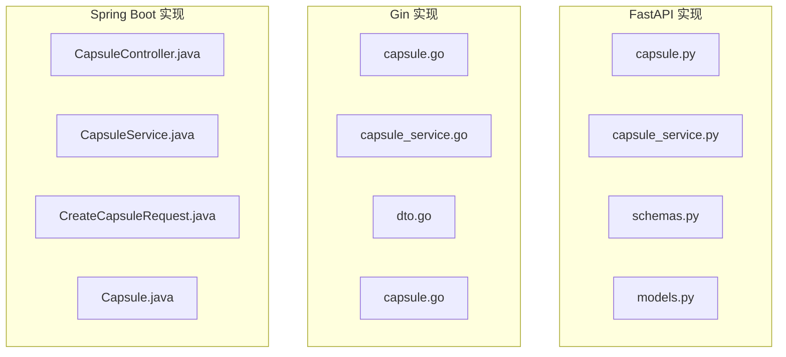
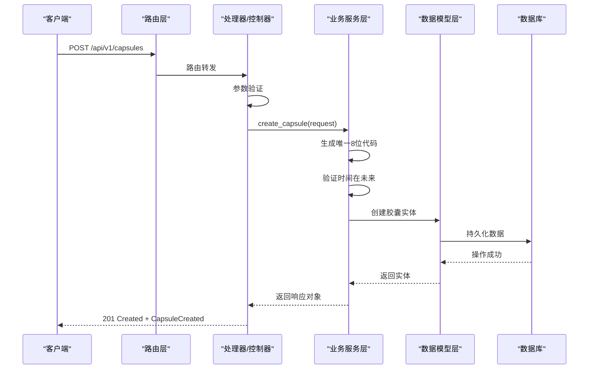
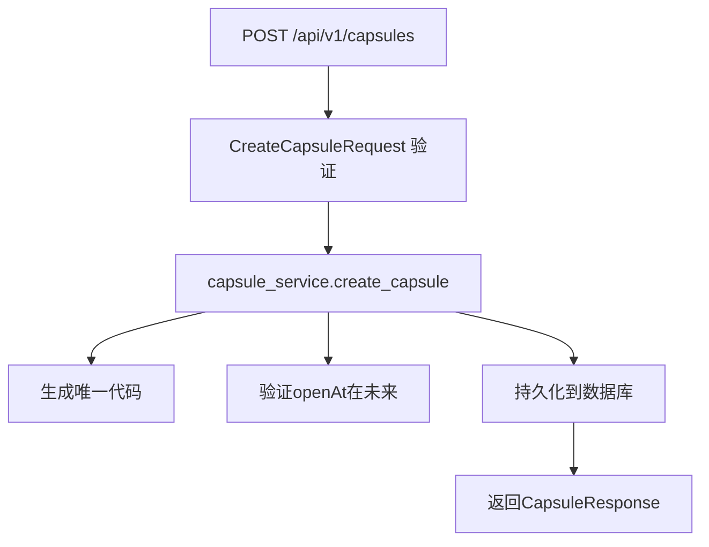
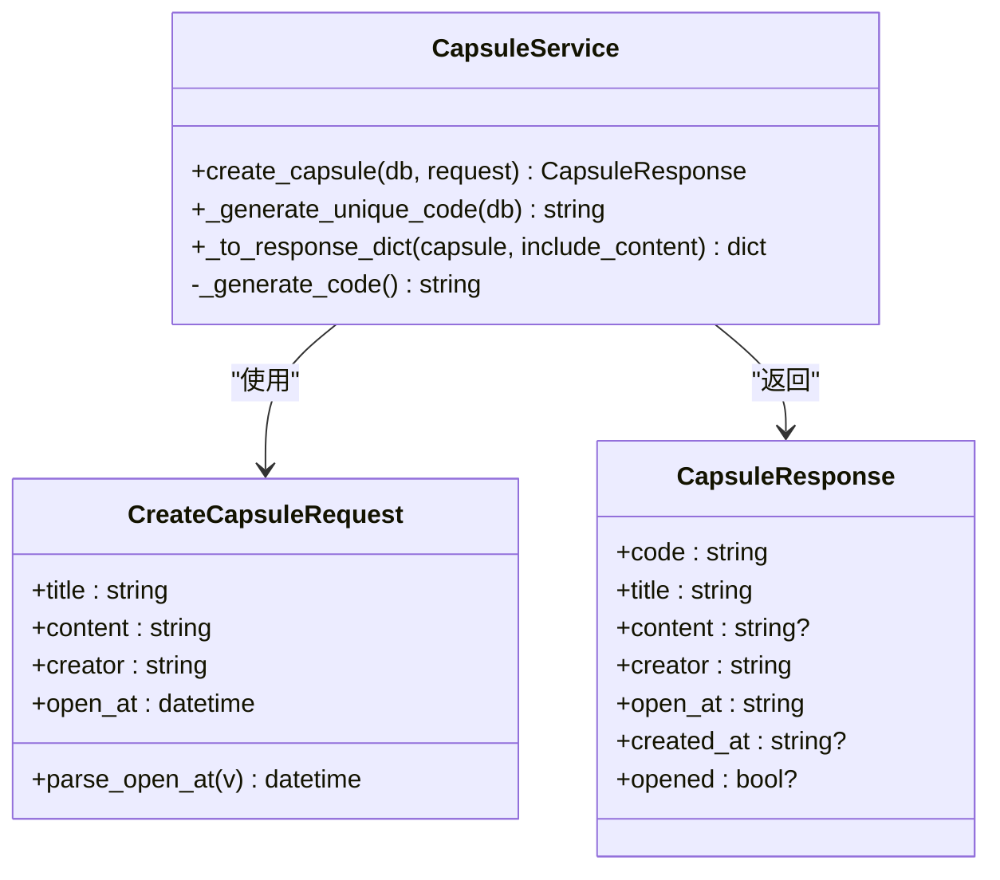
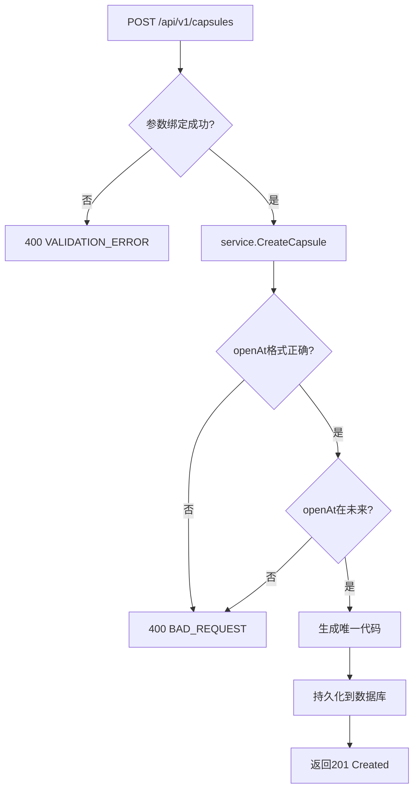
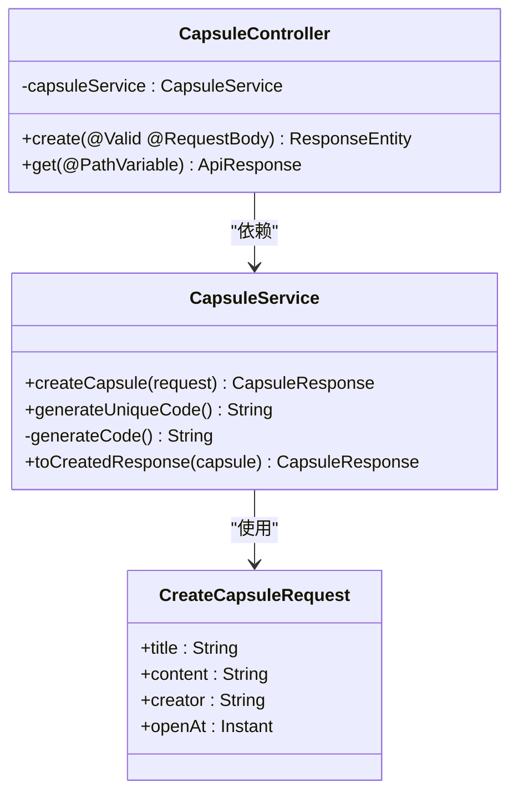
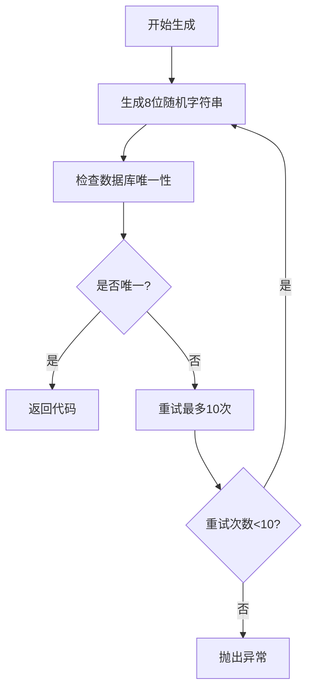
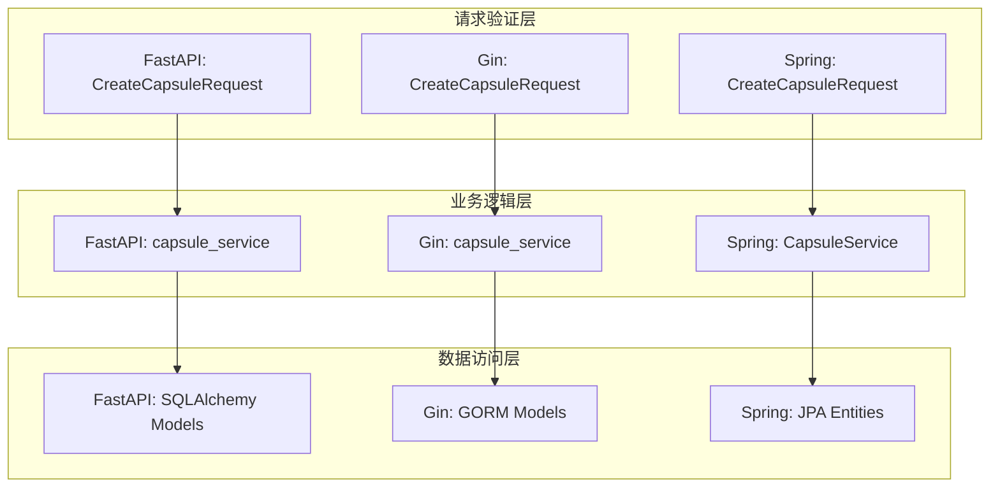

# 创建时间胶囊接口

<cite>
**本文档引用的文件**
- [capsule.py](file://backends/fastapi/app/routers/capsule.py)
- [capsule_service.py](file://backends/fastapi/app/services/capsule_service.py)
- [schemas.py](file://backends/fastapi/app/schemas.py)
- [models.py](file://backends/fastapi/app/models.py)
- [capsule.go](file://backends/gin/handler/capsule.go)
- [capsule_service.go](file://backends/gin/service/capsule_service.go)
- [dto.go](file://backends/gin/dto/dto.go)
- [capsule.go](file://backends/gin/model/capsule.go)
- [CapsuleController.java](file://backends/spring-boot/src/main/java/com/hellotime/controller/CapsuleController.java)
- [CapsuleService.java](file://backends/spring-boot/src/main/java/com/hellotime/service/CapsuleService.java)
- [CreateCapsuleRequest.java](file://backends/spring-boot/src/main/java/com/hellotime/dto/CreateCapsuleRequest.java)
- [Capsule.java](file://backends/spring-boot/src/main/java/com/hellotime/entity/Capsule.java)
- [test_capsule_api.py](file://backends/fastapi/tests/test_capsule_api.py)
- [capsule_test.go](file://backends/gin/tests/capsule_test.go)
- [CapsuleControllerTest.java](file://backends/spring-boot/src/test/java/com/hellotime/controller/CapsuleControllerTest.java)
</cite>

## 目录
1. [简介](#简介)
2. [项目结构](#项目结构)
3. [核心组件](#核心组件)
4. [架构概览](#架构概览)
5. [详细组件分析](#详细组件分析)
6. [依赖关系分析](#依赖关系分析)
7. [性能考虑](#性能考虑)
8. [故障排除指南](#故障排除指南)
9. [结论](#结论)

## 简介

本文档详细说明了创建时间胶囊接口（POST /api/v1/capsules）的完整实现。该接口允许用户创建时间胶囊，包含完整的请求参数验证、唯一8位代码生成机制、时间验证逻辑以及数据持久化流程。

## 项目结构

时间胶囊接口在三个后端框架中都有实现：

**图表来源**
- [capsule.py:1-31](file://backends/fastapi/app/routers/capsule.py#L1-L31)
- [capsule.go:1-56](file://backends/gin/handler/capsule.go#L1-L56)
- [CapsuleController.java:1-57](file://backends/spring-boot/src/main/java/com/hellotime/controller/CapsuleController.java#L1-L57)

## 核心组件

### 请求参数验证规则

所有后端实现都严格遵循以下验证规则：

| 参数名 | 类型 | 验证规则 | 最大长度 |
|--------|------|----------|----------|
| title | 字符串 | 必填，1-100字符 | 100字符 |
| content | 字符串 | 必填，至少1字符 | 无限制 |
| creator | 字符串 | 必填，1-30字符 | 30字符 |
| openAt | 日期时间 | 必填，必须在未来时间 | 无限制 |

### 响应数据结构

成功创建时返回的 CapsuleCreated 对象包含以下字段：

| 字段名 | 类型 | 描述 | 是否必填 |
|--------|------|------|----------|
| code | 字符串 | 8位唯一识别码 | 是 |
| title | 字符串 | 胶囊标题 | 是 |
| content | 字符串或null | 胶囊内容（可能为null） | 否 |
| creator | 字符串 | 创建者昵称 | 是 |
| open_at | 字符串 | 开启时间（ISO 8601格式） | 是 |
| created_at | 字符串或null | 创建时间（ISO 8601格式） | 否 |
| opened | 布尔值或null | 是否已开启 | 否 |

**章节来源**
- [schemas.py:26-45](file://backends/fastapi/app/schemas.py#L26-L45)
- [dto.go:38-44](file://backends/gin/dto/dto.go#L38-L44)
- [CreateCapsuleRequest.java:18-32](file://backends/spring-boot/src/main/java/com/hellotime/dto/CreateCapsuleRequest.java#L18-L32)

## 架构概览

**图表来源**
- [capsule.py:17-24](file://backends/fastapi/app/routers/capsule.py#L17-L24)
- [capsule.go:19-38](file://backends/gin/handler/capsule.go#L19-L38)
- [CapsuleController.java:37-42](file://backends/spring-boot/src/main/java/com/hellotime/controller/CapsuleController.java#L37-L42)

## 详细组件分析

### FastAPI 实现

#### 路由处理

FastAPI 的路由层负责接收请求并调用业务服务：

**图表来源**
- [capsule.py:17-24](file://backends/fastapi/app/routers/capsule.py#L17-L24)

#### 业务逻辑实现

FastAPI 的业务服务实现了完整的创建逻辑：

**图表来源**
- [capsule_service.py:79-102](file://backends/fastapi/app/services/capsule_service.py#L79-L102)
- [schemas.py:26-64](file://backends/fastapi/app/schemas.py#L26-L64)

**章节来源**
- [capsule_service.py:79-102](file://backends/fastapi/app/services/capsule_service.py#L79-L102)
- [schemas.py:26-45](file://backends/fastapi/app/schemas.py#L26-L45)

### Gin 实现

#### 处理器实现

Gin 框架的处理器提供了完整的错误处理机制：

**图表来源**
- [capsule.go:19-38](file://backends/gin/handler/capsule.go#L19-L38)

#### 代码生成机制

Gin 实现使用加密安全的随机数生成器：

**章节来源**
- [capsule_service.go:94-129](file://backends/gin/service/capsule_service.go#L94-L129)
- [dto.go:38-44](file://backends/gin/dto/dto.go#L38-L44)

### Spring Boot 实现

#### 控制器设计

Spring Boot 的控制器使用现代化的 Record 类型简化代码：

**图表来源**
- [CapsuleController.java:37-42](file://backends/spring-boot/src/main/java/com/hellotime/controller/CapsuleController.java#L37-L42)
- [CapsuleService.java:52-73](file://backends/spring-boot/src/main/java/com/hellotime/service/CapsuleService.java#L52-L73)

**章节来源**
- [CapsuleController.java:37-42](file://backends/spring-boot/src/main/java/com/hellotime/controller/CapsuleController.java#L37-L42)
- [CapsuleService.java:52-73](file://backends/spring-boot/src/main/java/com/hellotime/service/CapsuleService.java#L52-L73)

### 唯一8位代码生成机制

所有实现都采用相同的代码生成策略：

代码字符集：A-Z, a-z, 0-9（共62个字符）

**图表来源**
- [capsule_service.py:32-43](file://backends/fastapi/app/services/capsule_service.py#L32-L43)
- [capsule_service.go:31-59](file://backends/gin/service/capsule_service.go#L31-L59)
- [CapsuleService.java:125-133](file://backends/spring-boot/src/main/java/com/hellotime/service/CapsuleService.java#L125-L133)

## 依赖关系分析

**图表来源**
- [schemas.py:26-45](file://backends/fastapi/app/schemas.py#L26-L45)
- [capsule_service.py:14-18](file://backends/fastapi/app/services/capsule_service.py#L14-L18)
- [dto.go:38-44](file://backends/gin/dto/dto.go#L38-L44)
- [capsule_service.go:14-17](file://backends/gin/service/capsule_service.go#L14-L17)
- [CreateCapsuleRequest.java:18-32](file://backends/spring-boot/src/main/java/com/hellotime/dto/CreateCapsuleRequest.java#L18-L32)
- [CapsuleService.java:38-42](file://backends/spring-boot/src/main/java/com/hellotime/service/CapsuleService.java#L38-L42)

**章节来源**
- [models.py:14-26](file://backends/fastapi/app/models.py#L14-L26)
- [capsule.go:6-15](file://backends/gin/model/capsule.go#L6-L15)
- [Capsule.java:10-58](file://backends/spring-boot/src/main/java/com/hellotime/entity/Capsule.java#L10-L58)

## 性能考虑

### 代码生成优化

- **随机数安全性**：所有实现都使用加密安全的随机数生成器
- **冲突检测**：通过数据库唯一约束确保代码唯一性
- **重试机制**：最多10次重试避免无限循环

### 数据库性能

- **索引优化**：code字段建立唯一索引
- **时间字段**：open_at和created_at字段优化查询性能
- **字符集选择**：VARCHAR(8)存储8位代码，节省空间

### 缓存策略

- **响应缓存**：对于已开启的胶囊，content字段可被缓存
- **查询优化**：按创建时间倒序查询，支持分页

## 故障排除指南

### 常见错误及解决方案

| 错误类型 | 状态码 | 错误原因 | 解决方案 |
|----------|--------|----------|----------|
| 参数验证失败 | 400 | 缺少必需字段或超出长度限制 | 检查请求体格式，确保所有字段都符合验证规则 |
| 时间格式错误 | 400 | openAt不是有效的ISO 8601格式 | 使用标准ISO 8601格式：YYYY-MM-DDTHH:mm:ssZ |
| 开启时间在过去 | 400 | openAt早于当前时间 | 确保openAt在未来时间点 |
| 代码生成冲突 | 500 | 无法生成唯一8位代码 | 检查数据库状态，重试请求 |
| 数据库连接失败 | 500 | 数据库不可用 | 检查数据库连接配置 |

### 调试建议

1. **启用日志记录**：在开发环境中启用详细的请求/响应日志
2. **参数验证**：使用在线JSON验证工具检查请求格式
3. **时间同步**：确保服务器时间准确，避免时间相关错误
4. **数据库监控**：监控数据库连接池和查询性能

**章节来源**
- [capsule.go:22-35](file://backends/gin/handler/capsule.go#L22-L35)
- [capsule_service.go:96-104](file://backends/gin/service/capsule_service.go#L96-L104)
- [CapsuleController.java:38-41](file://backends/spring-boot/src/main/java/com/hellotime/controller/CapsuleController.java#L38-L41)

## 结论

创建时间胶囊接口在三个后端框架中都实现了高度一致的功能和行为。每个实现都包含了：

- **严格的参数验证**：确保数据完整性和一致性
- **安全的代码生成**：使用加密安全的随机数生成8位唯一代码
- **完善的时间验证**：确保开启时间在未来
- **优雅的错误处理**：提供清晰的错误信息和适当的HTTP状态码
- **标准化的响应格式**：统一的API响应结构

推荐的最佳实践包括：使用HTTPS确保数据传输安全、定期备份数据库、监控API性能指标、实施适当的速率限制以防止滥用。