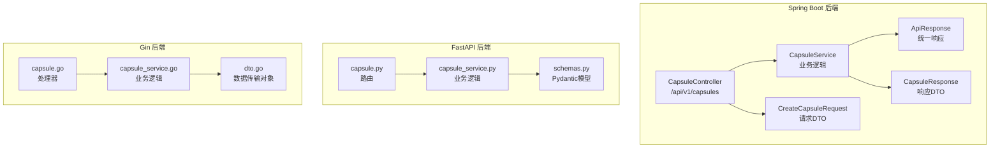
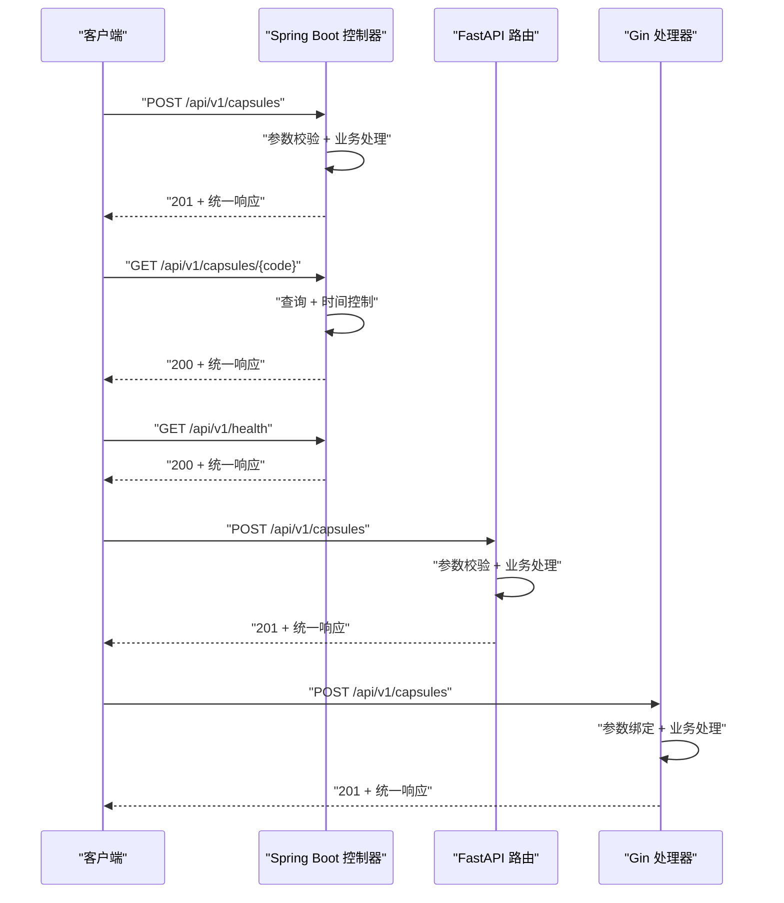
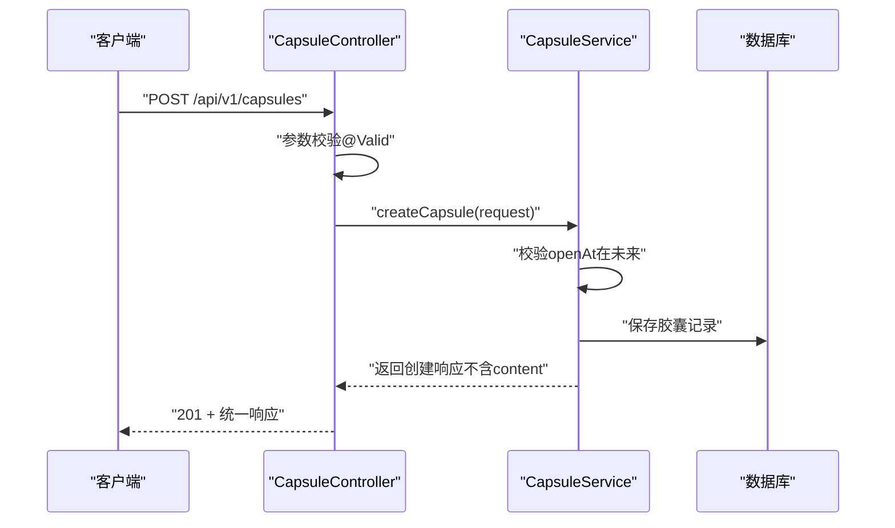
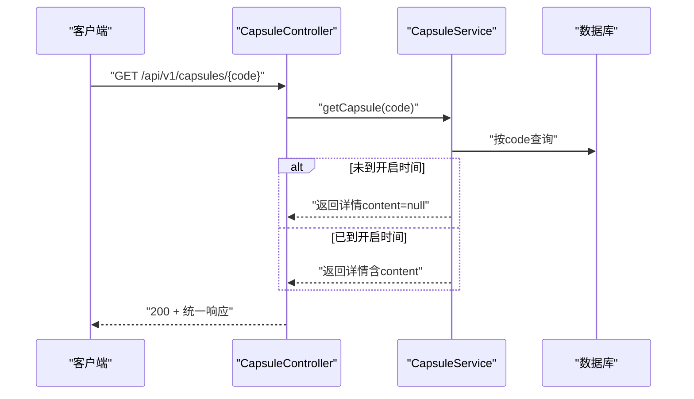
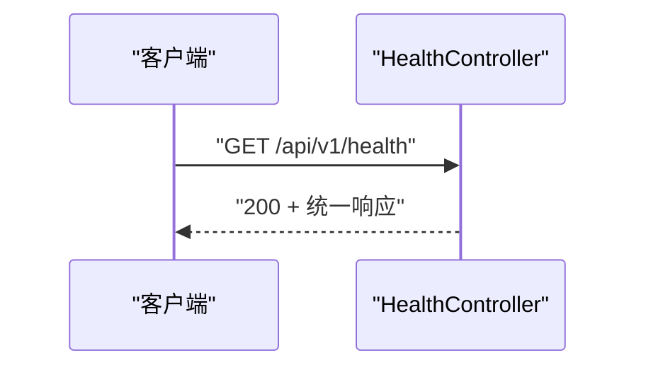
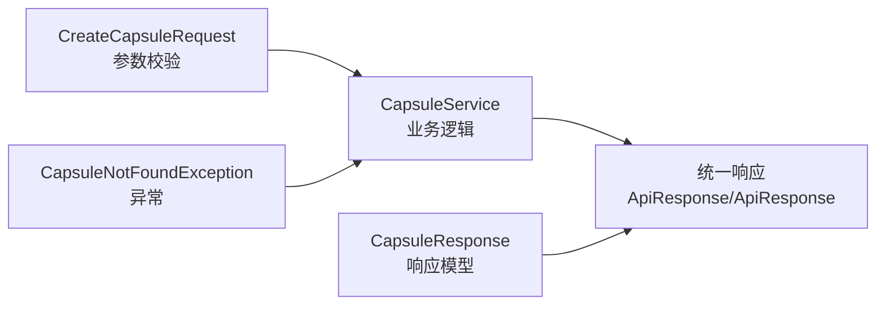

# 核心API端点

<cite>
**本文档引用的文件**
- [CapsuleController.java](file://backends/spring-boot/src/main/java/com/hellotime/controller/CapsuleController.java)
- [CapsuleService.java](file://backends/spring-boot/src/main/java/com/hellotime/service/CapsuleService.java)
- [ApiResponse.java](file://backends/spring-boot/src/main/java/com/hellotime/dto/ApiResponse.java)
- [CreateCapsuleRequest.java](file://backends/spring-boot/src/main/java/com/hellotime/dto/CreateCapsuleRequest.java)
- [CapsuleResponse.java](file://backends/spring-boot/src/main/java/com/hellotime/dto/CapsuleResponse.java)
- [CapsuleControllerTest.java](file://backends/spring-boot/src/test/java/com/hellotime/controller/CapsuleControllerTest.java)
- [capsule.py](file://backends/fastapi/app/routers/capsule.py)
- [schemas.py](file://backends/fastapi/app/schemas.py)
- [capsule_service.py](file://backends/fastapi/app/services/capsule_service.py)
- [test_capsule_api.py](file://backends/fastapi/tests/test_capsule_api.py)
- [capsule.go](file://backends/gin/handler/capsule.go)
- [capsule_service.go](file://backends/gin/service/capsule_service.go)
- [dto.go](file://backends/gin/dto/dto.go)
- [HealthController.java](file://backends/spring-boot/src/main/java/com/hellotime/controller/HealthController.java)
- [health.py](file://backends/fastapi/app/routers/health.py)
- [health.go](file://backends/gin/handler/health.go)
</cite>

## 目录
1. [简介](#简介)
2. [项目结构](#项目结构)
3. [核心组件](#核心组件)
4. [架构总览](#架构总览)
5. [详细组件分析](#详细组件分析)
6. [依赖分析](#依赖分析)
7. [性能考虑](#性能考虑)
8. [故障排除指南](#故障排除指南)
9. [结论](#结论)

## 简介
本文件聚焦HelloTime项目的核心API端点，围绕“胶囊”主题提供统一、可复用的接口规范与实现说明。重点覆盖以下三个端点：
- 创建时间胶囊：POST /api/v1/capsules
- 查询时间胶囊：GET /api/v1/capsules/{code}
- 健康检查：GET /api/v1/health

文档将详细说明每个端点的HTTP方法、URL路径、请求参数、响应格式，并给出成功与失败场景的请求/响应示例。同时解释胶囊查询的时间控制逻辑（未到开启时间时content字段为null的设计），并提供统一的API响应格式说明（success、data、message、errorCode字段的作用）。最后包含参数验证规则、错误码说明与最佳实践建议。

## 项目结构
HelloTime采用多后端实现（Spring Boot、FastAPI、Gin），但核心API契约保持一致。本文档以Spring Boot实现为主进行说明，其他后端实现遵循相同契约。

图表来源
- [CapsuleController.java:17-56](file://backends/spring-boot/src/main/java/com/hellotime/controller/CapsuleController.java#L17-L56)
- [CapsuleService.java:26-196](file://backends/spring-boot/src/main/java/com/hellotime/service/CapsuleService.java#L26-L196)
- [ApiResponse.java:21-48](file://backends/spring-boot/src/main/java/com/hellotime/dto/ApiResponse.java#L21-L48)
- [CreateCapsuleRequest.java:18-32](file://backends/spring-boot/src/main/java/com/hellotime/dto/CreateCapsuleRequest.java#L18-L32)
- [CapsuleResponse.java:19-27](file://backends/spring-boot/src/main/java/com/hellotime/dto/CapsuleResponse.java#L19-L27)
- [capsule.py:14-31](file://backends/fastapi/app/routers/capsule.py#L14-L31)
- [capsule_service.py:79-112](file://backends/fastapi/app/services/capsule_service.py#L79-L112)
- [schemas.py:26-96](file://backends/fastapi/app/schemas.py#L26-L96)
- [capsule.go:19-55](file://backends/gin/handler/capsule.go#L19-L55)
- [capsule_service.go:94-143](file://backends/gin/service/capsule_service.go#L94-L143)
- [dto.go:5-77](file://backends/gin/dto/dto.go#L5-L77)

章节来源
- [CapsuleController.java:17-56](file://backends/spring-boot/src/main/java/com/hellotime/controller/CapsuleController.java#L17-L56)
- [capsule.py:14-31](file://backends/fastapi/app/routers/capsule.py#L14-L31)
- [capsule.go:19-55](file://backends/gin/handler/capsule.go#L19-L55)

## 核心组件
- 统一响应格式：所有接口返回统一的JSON结构，包含success、data、message、errorCode字段，便于前后端一致处理。
- 请求参数校验：通过注解或Schema对输入参数进行严格校验，确保数据质量。
- 时间控制逻辑：胶囊查询时根据当前时间与开启时间比较，未到开启时间则隐藏content字段。
- 错误码体系：针对不同错误场景返回特定错误码，便于客户端快速定位问题。

章节来源
- [ApiResponse.java:21-48](file://backends/spring-boot/src/main/java/com/hellotime/dto/ApiResponse.java#L21-L48)
- [schemas.py:81-96](file://backends/fastapi/app/schemas.py#L81-L96)
- [dto.go:5-34](file://backends/gin/dto/dto.go#L5-L34)

## 架构总览
下图展示了三个核心端点在各后端中的调用链路与职责分工。

图表来源
- [CapsuleController.java:37-55](file://backends/spring-boot/src/main/java/com/hellotime/controller/CapsuleController.java#L37-L55)
- [capsule.py:17-30](file://backends/fastapi/app/routers/capsule.py#L17-L30)
- [capsule.go:19-38](file://backends/gin/handler/capsule.go#L19-L38)
- [HealthController.java:15-26](file://backends/spring-boot/src/main/java/com/hellotime/controller/HealthController.java#L15-L26)
- [health.py:14-24](file://backends/fastapi/app/routers/health.py#L14-L24)
- [health.go:12-23](file://backends/gin/handler/health.go#L12-L23)

## 详细组件分析

### 创建时间胶囊（POST /api/v1/capsules）
- 功能概述：接收标题、内容、创建者、开启时间等参数，创建新的时间胶囊并返回唯一8位编码。
- 请求参数（JSON）：
  - title: 字符串，必填，最大100字符
  - content: 字符串，必填，最小1字符
  - creator: 字符串，必填，最大30字符
  - openAt: ISO 8601时间字符串，必填，必须在未来时刻
- 响应格式：统一响应，data中包含code、title、creator、openAt、createdAt等字段；content字段在创建响应中不返回。
- 状态码：
  - 201：创建成功
  - 400：参数校验失败（如缺失字段、openAt格式错误）
  - 500：服务器内部错误
- 示例（成功）：
  - 请求体：包含title、content、creator、openAt
  - 响应体：success=true，data包含code等字段，message为“胶囊创建成功”
- 示例（失败-参数缺失）：
  - 请求体：仅包含部分字段
  - 响应体：success=false，errorCode=VALIDATION_ERROR

图表来源
- [CapsuleController.java:37-42](file://backends/spring-boot/src/main/java/com/hellotime/controller/CapsuleController.java#L37-L42)
- [CapsuleService.java:52-73](file://backends/spring-boot/src/main/java/com/hellotime/service/CapsuleService.java#L52-L73)
- [CreateCapsuleRequest.java:18-32](file://backends/spring-boot/src/main/java/com/hellotime/dto/CreateCapsuleRequest.java#L18-L32)

章节来源
- [CapsuleController.java:37-42](file://backends/spring-boot/src/main/java/com/hellotime/controller/CapsuleController.java#L37-L42)
- [CapsuleService.java:52-73](file://backends/spring-boot/src/main/java/com/hellotime/service/CapsuleService.java#L52-L73)
- [CreateCapsuleRequest.java:18-32](file://backends/spring-boot/src/main/java/com/hellotime/dto/CreateCapsuleRequest.java#L18-L32)
- [capsule.py:17-24](file://backends/fastapi/app/routers/capsule.py#L17-L24)
- [capsule_service.py:79-102](file://backends/fastapi/app/services/capsule_service.py#L79-L102)
- [capsule.go:19-38](file://backends/gin/handler/capsule.go#L19-L38)
- [capsule_service.go:94-129](file://backends/gin/service/capsule_service.go#L94-L129)
- [CapsuleControllerTest.java:42-58](file://backends/spring-boot/src/test/java/com/hellotime/controller/CapsuleControllerTest.java#L42-L58)
- [test_capsule_api.py:16-31](file://backends/fastapi/tests/test_capsule_api.py#L16-L31)

### 查询时间胶囊（GET /api/v1/capsules/{code}）
- 功能概述：根据8位胶囊码查询胶囊详情。若当前时间未到达开启时间，则content字段为null。
- 路径参数：
  - code: 字符串，8位字母数字组合
- 响应格式：统一响应，data中包含code、title、content（可能为null）、creator、openAt、createdAt、opened等字段。
- 状态码：
  - 200：查询成功
  - 404：胶囊不存在
  - 500：服务器内部错误
- 示例（成功-已开启）：
  - 响应体：success=true，data包含完整信息，opened=true
- 示例（成功-未开启）：
  - 响应体：success=true，data中content为null，opened=false
- 示例（失败-不存在）：
  - 响应体：success=false，errorCode=CAPSULE_NOT_FOUND

图表来源
- [CapsuleController.java:51-55](file://backends/spring-boot/src/main/java/com/hellotime/controller/CapsuleController.java#L51-L55)
- [CapsuleService.java:83-87](file://backends/spring-boot/src/main/java/com/hellotime/service/CapsuleService.java#L83-L87)
- [CapsuleService.java:167-178](file://backends/spring-boot/src/main/java/com/hellotime/service/CapsuleService.java#L167-L178)

章节来源
- [CapsuleController.java:51-55](file://backends/spring-boot/src/main/java/com/hellotime/controller/CapsuleController.java#L51-L55)
- [CapsuleService.java:83-87](file://backends/spring-boot/src/main/java/com/hellotime/service/CapsuleService.java#L83-L87)
- [CapsuleService.java:167-178](file://backends/spring-boot/src/main/java/com/hellotime/service/CapsuleService.java#L167-L178)
- [CapsuleResponse.java:19-27](file://backends/spring-boot/src/main/java/com/hellotime/dto/CapsuleResponse.java#L19-L27)
- [capsule.py:27-30](file://backends/fastapi/app/routers/capsule.py#L27-L30)
- [capsule_service.py:105-112](file://backends/fastapi/app/services/capsule_service.py#L105-L112)
- [capsule.go:40-55](file://backends/gin/handler/capsule.go#L40-L55)
- [capsule_service.go:131-143](file://backends/gin/service/capsule_service.go#L131-L143)
- [CapsuleControllerTest.java:70-98](file://backends/spring-boot/src/test/java/com/hellotime/controller/CapsuleControllerTest.java#L70-L98)
- [test_capsule_api.py:44-69](file://backends/fastapi/tests/test_capsule_api.py#L44-L69)

### 健康检查（GET /api/v1/health）
- 功能概述：返回系统健康状态及技术栈信息。
- 响应格式：统一响应，data中包含status、timestamp、techStack等字段。
- 状态码：200
- 示例：
  - 响应体：success=true，data.status=UP，包含时间戳与技术栈信息

图表来源
- [HealthController.java:15-26](file://backends/spring-boot/src/main/java/com/hellotime/controller/HealthController.java#L15-L26)
- [health.py:14-24](file://backends/fastapi/app/routers/health.py#L14-L24)
- [health.go:12-23](file://backends/gin/handler/health.go#L12-L23)

章节来源
- [HealthController.java:15-26](file://backends/spring-boot/src/main/java/com/hellotime/controller/HealthController.java#L15-L26)
- [health.py:14-24](file://backends/fastapi/app/routers/health.py#L14-L24)
- [health.go:12-23](file://backends/gin/handler/health.go#L12-L23)
- [CapsuleControllerTest.java:34-40](file://backends/spring-boot/src/test/java/com/hellotime/controller/CapsuleControllerTest.java#L34-L40)
- [test_capsule_api.py:7-14](file://backends/fastapi/tests/test_capsule_api.py#L7-L14)

## 依赖分析
- 统一响应：Spring Boot使用Record封装ApiResponse；FastAPI使用Pydantic；Gin使用结构体。三者均提供ok/error工厂方法，保证响应格式一致。
- 参数校验：Spring Boot使用Jakarta Validation注解；FastAPI使用Pydantic字段校验；Gin使用binding标签。三者均对title/content/creator/openAt进行严格约束。
- 时间控制：服务层统一比较当前时间与openAt，未到时间则content为null；已到时间则返回content。管理员视图可强制包含content。

图表来源
- [CreateCapsuleRequest.java:18-32](file://backends/spring-boot/src/main/java/com/hellotime/dto/CreateCapsuleRequest.java#L18-L32)
- [CapsuleService.java:52-87](file://backends/spring-boot/src/main/java/com/hellotime/service/CapsuleService.java#L52-L87)
- [ApiResponse.java:21-48](file://backends/spring-boot/src/main/java/com/hellotime/dto/ApiResponse.java#L21-L48)
- [schemas.py:26-96](file://backends/fastapi/app/schemas.py#L26-L96)
- [capsule_service.py:79-112](file://backends/fastapi/app/services/capsule_service.py#L79-L112)
- [dto.go:5-77](file://backends/gin/dto/dto.go#L5-L77)
- [capsule_service.go:94-143](file://backends/gin/service/capsule_service.go#L94-L143)

章节来源
- [CapsuleService.java:52-87](file://backends/spring-boot/src/main/java/com/hellotime/service/CapsuleService.java#L52-L87)
- [capsule_service.py:79-112](file://backends/fastapi/app/services/capsule_service.py#L79-L112)
- [capsule_service.go:94-143](file://backends/gin/service/capsule_service.go#L94-L143)

## 性能考虑
- 数据库访问：查询与创建均涉及数据库IO，建议在高并发场景下：
  - 使用连接池与索引优化（code字段）
  - 对查询路径增加缓存（如未开启胶囊短期内不会变化）
- 时间计算：服务层使用UTC时间比较，避免时区差异带来的额外开销。
- 响应序列化：统一使用框架内置序列化工具，减少手动拼装JSON的开销。

## 故障排除指南
- 参数校验失败（400）：
  - 检查请求体是否包含title/content/creator/openAt
  - 确认openAt为未来时间，且符合ISO 8601格式
- 胶囊不存在（404）：
  - 确认code为8位字母数字组合
  - 检查数据库中是否存在该code
- 服务器内部错误（500）：
  - 查看后端日志，确认数据库连接与异常处理
  - 确认唯一code生成流程未触发重试上限

章节来源
- [CapsuleControllerTest.java:61-76](file://backends/spring-boot/src/test/java/com/hellotime/controller/CapsuleControllerTest.java#L61-L76)
- [test_capsule_api.py:33-51](file://backends/fastapi/tests/test_capsule_api.py#L33-L51)
- [capsule.go:22-35](file://backends/gin/handler/capsule.go#L22-L35)
- [capsule_service.go:96-104](file://backends/gin/service/capsule_service.go#L96-L104)

## 结论
本文档系统梳理了HelloTime项目的核心API端点，明确了创建与查询胶囊的关键行为以及健康检查的实现方式。通过统一的响应格式、严格的参数校验与清晰的时间控制逻辑，确保了跨后端的一致性与可靠性。建议在生产环境中结合缓存与监控进一步提升性能与可观测性。