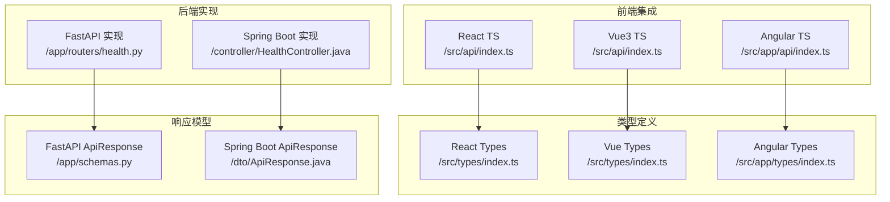
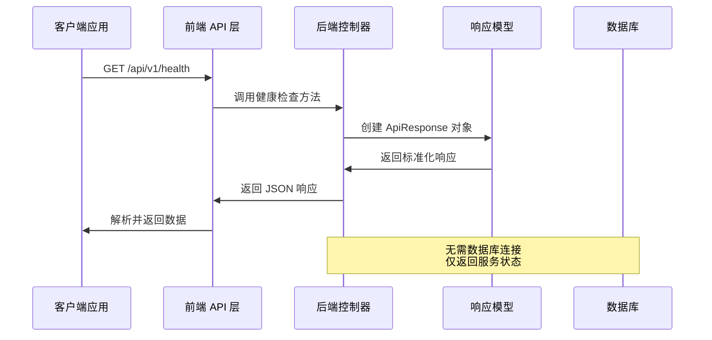
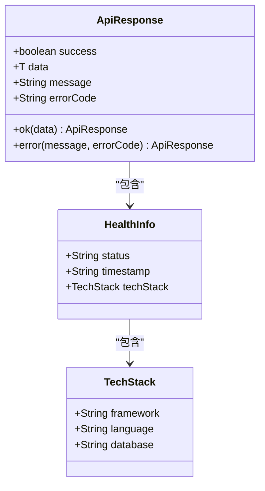
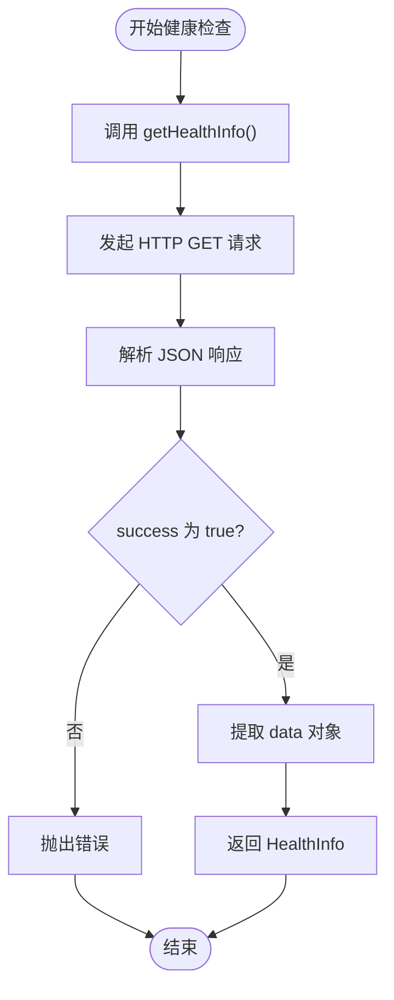
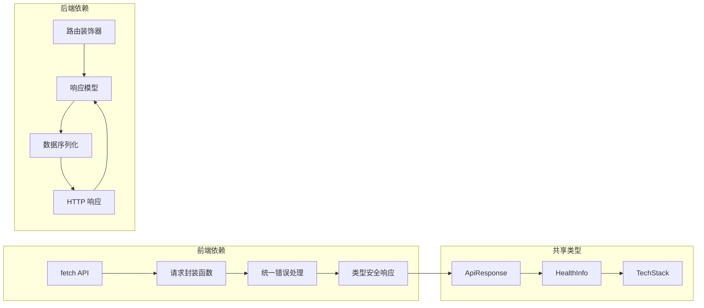

# 健康检查接口

<cite>
**本文档引用的文件**
- [backends/fastapi/app/routers/health.py](file://backends/fastapi/app/routers/health.py)
- [backends/spring-boot/src/main/java/com/hellotime/controller/HealthController.java](file://backends/spring-boot/src/main/java/com/hellotime/controller/HealthController.java)
- [backends/fastapi/app/schemas.py](file://backends/fastapi/app/schemas.py)
- [backends/spring-boot/src/main/java/com/hellotime/dto/ApiResponse.java](file://backends/spring-boot/src/main/java/com/hellotime/dto/ApiResponse.java)
- [frontends/react-ts/src/api/index.ts](file://frontends/react-ts/src/api/index.ts)
- [frontends/vue3-ts/src/api/index.ts](file://frontends/vue3-ts/src/api/index.ts)
- [frontends/angular-ts/src/app/api/index.ts](file://frontends/angular-ts/src/app/api/index.ts)
- [frontends/react-ts/src/types/index.ts](file://frontends/react-ts/src/types/index.ts)
- [frontends/vue3-ts/src/types/index.ts](file://frontends/vue3-ts/src/types/index.ts)
- [frontends/angular-ts/src/app/types/index.ts](file://frontends/angular-ts/src/app/types/index.ts)
- [backends/fastapi/tests/test_capsule_api.py](file://backends/fastapi/tests/test_capsule_api.py)
- [backends/spring-boot/src/test/java/com/hellotime/controller/CapsuleControllerTest.java](file://backends/spring-boot/src/test/java/com/hellotime/controller/CapsuleControllerTest.java)
</cite>

## 目录
1. [简介](#简介)
2. [项目结构](#项目结构)
3. [核心组件](#核心组件)
4. [架构概览](#架构概览)
5. [详细组件分析](#详细组件分析)
6. [依赖关系分析](#依赖关系分析)
7. [性能考虑](#性能考虑)
8. [故障排除指南](#故障排除指南)
9. [结论](#结论)

## 简介

健康检查接口是系统监控和运维的重要组成部分，用于验证应用程序及其依赖服务的运行状态。本项目提供了跨平台的健康检查功能，支持 FastAPI 和 Spring Boot 两种后端实现，以及 React、Vue3、Angular 三种主流前端框架。

该接口通过简单的 HTTP GET 请求即可完成服务状态检测，返回标准化的响应格式，包含服务状态、时间戳和完整的技术栈信息。这对于容器编排、负载均衡器配置、自动化部署和监控系统集成都具有重要意义。

## 项目结构

健康检查接口在项目中的组织结构如下：



**图表来源**
- [backends/fastapi/app/routers/health.py:1-25](file://backends/fastapi/app/routers/health.py#L1-L25)
- [backends/spring-boot/src/main/java/com/hellotime/controller/HealthController.java:1-28](file://backends/spring-boot/src/main/java/com/hellotime/controller/HealthController.java#L1-L28)
- [frontends/react-ts/src/api/index.ts:87-93](file://frontends/react-ts/src/api/index.ts#L87-L93)

**章节来源**
- [backends/fastapi/app/routers/health.py:1-25](file://backends/fastapi/app/routers/health.py#L1-L25)
- [backends/spring-boot/src/main/java/com/hellotime/controller/HealthController.java:1-28](file://backends/spring-boot/src/main/java/com/hellotime/controller/HealthController.java#L1-L28)

## 核心组件

### 健康检查端点规范

**端点地址**: `GET /api/v1/health`

**功能描述**: 
- 检查服务运行状态
- 返回技术栈信息
- 提供时间戳验证
- 支持容器化部署监控

**响应格式**: 统一的 ApiResponse 包装格式

**成功响应示例**:
```json
{
  "success": true,
  "data": {
    "status": "UP",
    "timestamp": "2024-01-15T10:30:45.123456Z",
    "techStack": {
      "framework": "FastAPI >=0.115",
      "language": "Python 3.12",
      "database": "SQLite"
    }
  }
}
```

**响应字段说明**:
- `success`: 布尔值，表示请求是否成功
- `data`: 包含健康检查详细信息的对象
  - `status`: 服务状态，通常为 "UP"
  - `timestamp`: ISO 8601 格式的服务器时间戳
  - `techStack`: 技术栈信息对象

**章节来源**
- [backends/fastapi/app/routers/health.py:14-24](file://backends/fastapi/app/routers/health.py#L14-L24)
- [backends/spring-boot/src/main/java/com/hellotime/controller/HealthController.java:15-26](file://backends/spring-boot/src/main/java/com/hellotime/controller/HealthController.java#L15-L26)

### 技术栈信息详解

TechStack 对象包含以下关键字段：

**framework 字段**:
- 描述: 后端框架名称和版本信息
- 示例值: "FastAPI >=0.115" 或 "Spring Boot 3.2.5"
- 作用: 标识服务使用的框架版本，便于依赖管理和兼容性检查

**language 字段**:
- 描述: 编程语言和版本信息
- 示例值: "Python 3.12" 或 "Java 17"
- 作用: 显示运行环境的技术栈，支持运维环境验证

**database 字段**:
- 描述: 数据库类型信息
- 示例值: "SQLite"
- 作用: 标识数据存储方案，便于数据库连接状态检查

**章节来源**
- [frontends/react-ts/src/types/index.ts:62-79](file://frontends/react-ts/src/types/index.ts#L62-L79)
- [frontends/vue3-ts/src/types/index.ts:62-79](file://frontends/vue3-ts/src/types/index.ts#L62-L79)
- [frontends/angular-ts/src/app/types/index.ts:42-52](file://frontends/angular-ts/src/app/types/index.ts#L42-L52)

## 架构概览

健康检查接口采用分层架构设计，确保跨平台兼容性和可维护性：



**图表来源**
- [backends/fastapi/app/routers/health.py:14-24](file://backends/fastapi/app/routers/health.py#L14-L24)
- [backends/spring-boot/src/main/java/com/hellotime/controller/HealthController.java:15-26](file://backends/spring-boot/src/main/java/com/hellotime/controller/HealthController.java#L15-L26)

### 统一响应模型

两个后端实现都遵循相同的响应格式规范：



**图表来源**
- [backends/fastapi/app/schemas.py:81-96](file://backends/fastapi/app/schemas.py#L81-L96)
- [backends/spring-boot/src/main/java/com/hellotime/dto/ApiResponse.java:16-67](file://backends/spring-boot/src/main/java/com/hellotime/dto/ApiResponse.java#L16-L67)
- [frontends/react-ts/src/types/index.ts:62-79](file://frontends/react-ts/src/types/index.ts#L62-L79)

**章节来源**
- [backends/fastapi/app/schemas.py:81-96](file://backends/fastapi/app/schemas.py#L81-L96)
- [backends/spring-boot/src/main/java/com/hellotime/dto/ApiResponse.java:16-67](file://backends/spring-boot/src/main/java/com/hellotime/dto/ApiResponse.java#L16-L67)

## 详细组件分析

### FastAPI 实现

FastAPI 版本的健康检查接口实现了现代化的异步处理和类型安全：

**核心实现特点**:
- 使用 Python 3.12 和 FastAPI >=0.115
- 采用 UTC 时间戳格式
- 返回 SQLite 数据库连接状态
- 集成 Pydantic 数据验证

**实现细节**:
- 路由装饰器自动添加 `/api/v1` 前缀
- 使用 `ApiResponse.ok()` 方法返回标准化响应
- 技术栈信息硬编码在响应体中

**章节来源**
- [backends/fastapi/app/routers/health.py:14-24](file://backends/fastapi/app/routers/health.py#L14-L24)

### Spring Boot 实现

Spring Boot 版本提供了企业级的生产环境特性：

**核心实现特点**:
- 使用 Java 17 和 Spring Boot 3.2.5
- 基于 Jackson 的 JSON 序列化
- 支持多种数据库配置
- 集成 Spring MVC 注解

**实现细节**:
- REST 控制器自动扫描和注册
- 使用 `ApiResponse.ok()` 静态方法
- Instant.now() 提供高精度时间戳
- Map.of() 构建不可变技术栈信息

**章节来源**
- [backends/spring-boot/src/main/java/com/hellotime/controller/HealthController.java:15-26](file://backends/spring-boot/src/main/java/com/hellotime/controller/HealthController.java#L15-L26)

### 前端集成实现

三个前端框架都提供了统一的 API 调用方式：

#### React TypeScript 实现



**图表来源**
- [frontends/react-ts/src/api/index.ts:87-93](file://frontends/react-ts/src/api/index.ts#L87-L93)

#### Vue3 TypeScript 实现

Vue3 版本采用了更现代的组合式 API 设计：

**核心特性**:
- 使用 async/await 语法
- 统一的错误处理机制
- 类型安全的响应解析
- 支持响应式数据绑定

**章节来源**
- [frontends/vue3-ts/src/api/index.ts:113-119](file://frontends/vue3-ts/src/api/index.ts#L113-L119)

#### Angular TypeScript 实现

Angular 版本提供了完整的依赖注入支持：

**核心特性**:
- 基于 fetch API 的轻量级实现
- 统一的错误处理策略
- 类型安全的响应模型
- 支持 Angular 的响应式编程

**章节来源**
- [frontends/angular-ts/src/app/api/index.ts:69-71](file://frontends/angular-ts/src/app/api/index.ts#L69-L71)

### 测试验证

健康检查接口经过完整的单元测试验证：

**测试要点**:
- HTTP 状态码验证 (200 OK)
- success 字段验证 (true)
- status 字段验证 ("UP")
- 响应格式完整性检查

**章节来源**
- [backends/fastapi/tests/test_capsule_api.py:7-14](file://backends/fastapi/tests/test_capsule_api.py#L7-L14)
- [backends/spring-boot/src/test/java/com/hellotime/controller/CapsuleControllerTest.java:31-36](file://backends/spring-boot/src/test/java/com/hellotime/controller/CapsuleControllerTest.java#L31-L36)

## 依赖关系分析

健康检查接口的依赖关系相对简单，主要涉及类型定义和响应模型：



**图表来源**
- [frontends/react-ts/src/api/index.ts:14-31](file://frontends/react-ts/src/api/index.ts#L14-L31)
- [backends/fastapi/app/schemas.py:81-96](file://backends/fastapi/app/schemas.py#L81-L96)

### 类型系统设计

三个前端框架共享相同的数据类型定义，确保跨框架的一致性：

**类型定义一致性**:
- ApiResponse 接口定义完全相同
- HealthInfo 结构保持一致
- TechStack 字段标准化
- 泛型类型参数统一

**章节来源**
- [frontends/react-ts/src/types/index.ts:35-80](file://frontends/react-ts/src/types/index.ts#L35-L80)
- [frontends/vue3-ts/src/types/index.ts:35-80](file://frontends/vue3-ts/src/types/index.ts#L35-L80)
- [frontends/angular-ts/src/app/types/index.ts:23-52](file://frontends/angular-ts/src/app/types/index.ts#L23-L52)

## 性能考虑

健康检查接口设计注重性能优化和资源效率：

**性能特性**:
- 无数据库连接开销
- 内存中生成响应数据
- 最小化的计算复杂度
- 快速的 JSON 序列化

**内存使用**:
- 响应数据结构简单
- 无大型对象分配
- 时间戳格式紧凑
- 技术栈信息固定长度

**网络传输**:
- 响应体体积小
- 无压缩开销
- 直接 JSON 序列化
- 无额外头部信息

## 故障排除指南

### 常见问题诊断

**服务不可达**:
- 检查后端服务是否启动
- 验证端点路径拼写
- 确认 CORS 配置正确
- 检查防火墙设置

**响应格式错误**:
- 验证 ApiResponse 结构
- 检查 success 字段值
- 确认 data 对象完整性
- 验证 TechStack 字段存在

**时间戳问题**:
- 检查服务器时区配置
- 验证 ISO 8601 格式
- 确认 UTC 时间偏移
- 检查客户端解析逻辑

### 调试建议

**开发环境调试**:
- 使用浏览器开发者工具
- 检查网络面板响应
- 验证响应头信息
- 监控请求耗时

**生产环境监控**:
- 设置健康检查告警
- 监控响应延迟
- 跟踪错误率变化
- 验证技术栈一致性

**章节来源**
- [backends/fastapi/tests/test_capsule_api.py:7-14](file://backends/fastapi/tests/test_capsule_api.py#L7-L14)
- [backends/spring-boot/src/test/java/com/hellotime/controller/CapsuleControllerTest.java:31-36](file://backends/spring-boot/src/test/java/com/hellotime/controller/CapsuleControllerTest.java#L31-L36)

## 结论

健康检查接口作为系统监控的基础组件，在本项目中实现了高度的一致性和跨平台兼容性。通过标准化的响应格式、清晰的类型定义和完善的测试覆盖，确保了不同技术栈之间的无缝集成。

该接口的设计充分考虑了实际应用场景的需求，提供了简洁而强大的服务状态检查能力。无论是用于容器编排、负载均衡配置还是自动化运维，都能提供可靠的支撑。

未来可以考虑扩展功能，如添加更详细的服务依赖检查、自定义健康检查规则等，但当前实现已经能够满足大多数监控场景的需求。