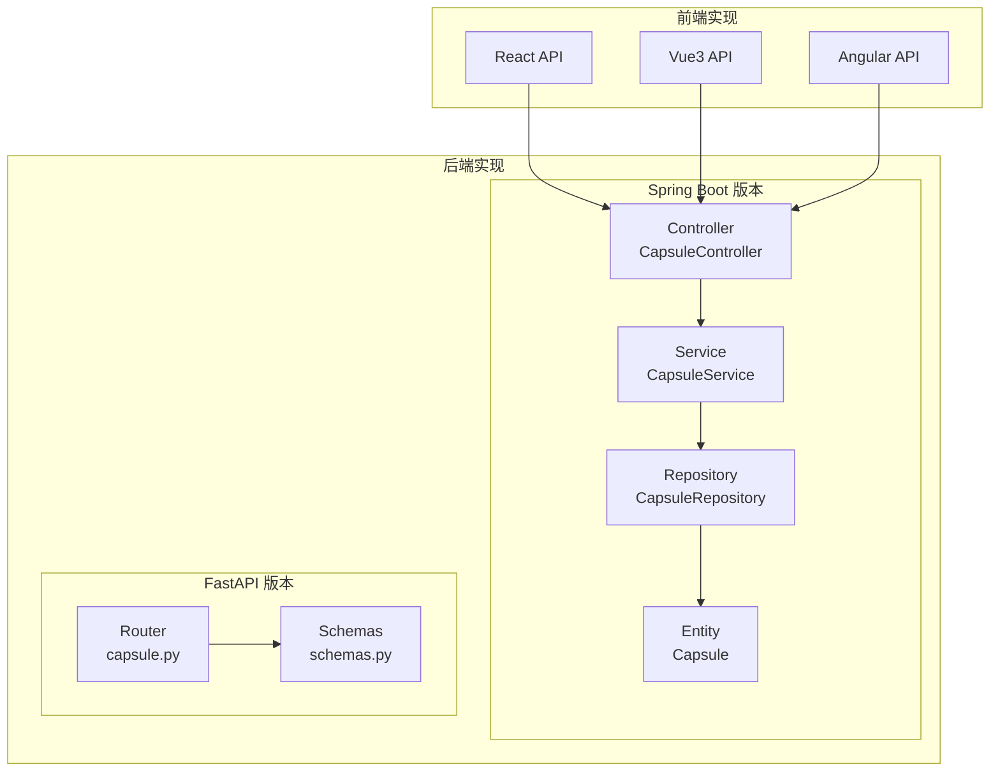
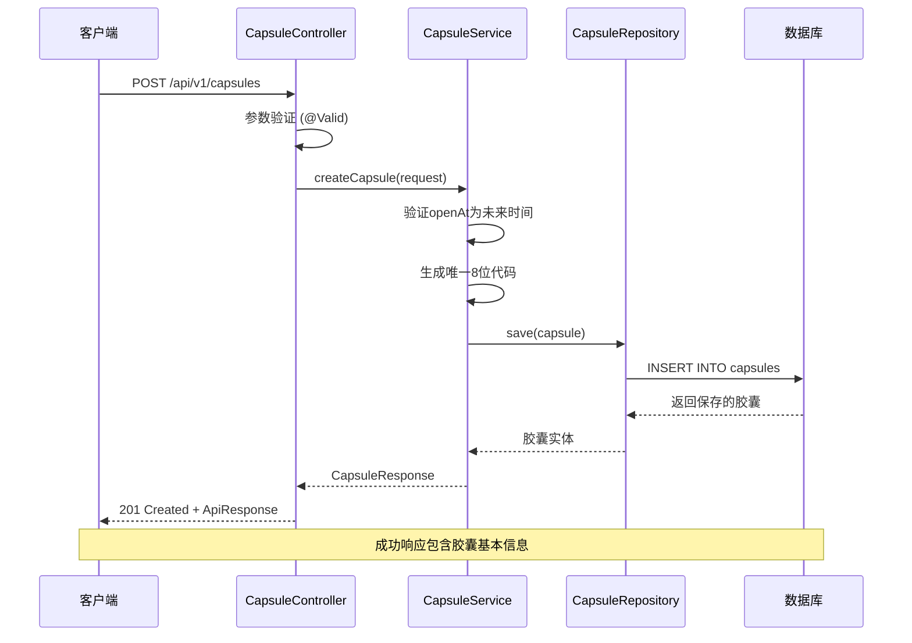
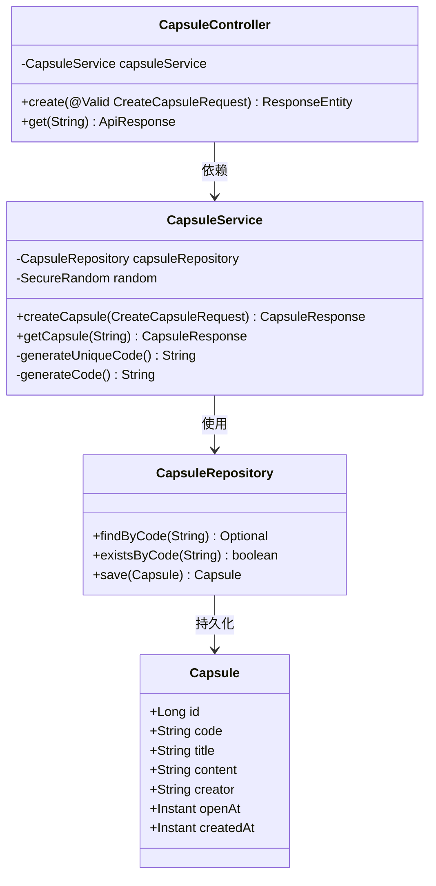
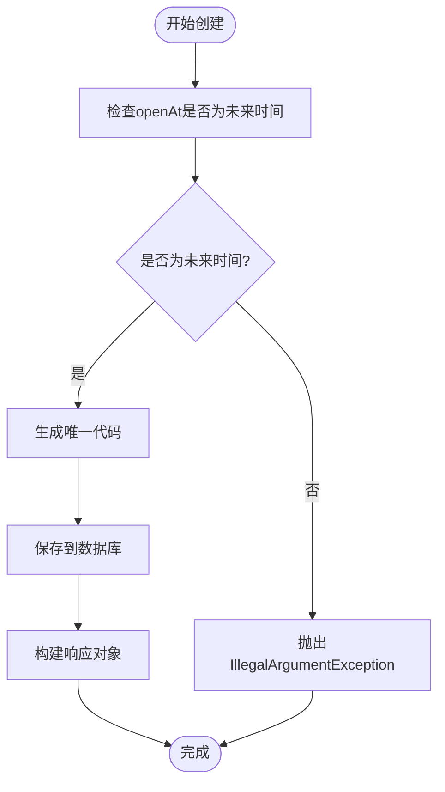
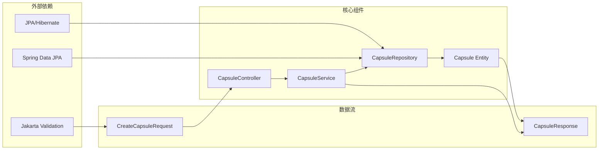

# 创建胶囊接口

<cite>
**本文档引用的文件**
- [CapsuleController.java](file://backends/spring-boot/src/main/java/com/hellotime/controller/CapsuleController.java)
- [CreateCapsuleRequest.java](file://backends/spring-boot/src/main/java/com/hellotime/dto/CreateCapsuleRequest.java)
- [CapsuleService.java](file://backends/spring-boot/src/main/java/com/hellotime/service/CapsuleService.java)
- [Capsule.java](file://backends/spring-boot/src/main/java/com/hellotime/entity/Capsule.java)
- [CapsuleRepository.java](file://backends/spring-boot/src/main/java/com/hellotime/repository/CapsuleRepository.java)
- [capsule.py](file://backends/fastapi/app/routers/capsule.py)
- [schemas.py](file://backends/fastapi/app/schemas.py)
- [index.ts (React)](file://frontends/react-ts/src/api/index.ts)
- [index.ts (Vue3)](file://frontends/vue3-ts/src/api/index.ts)
- [index.ts (Angular)](file://frontends/angular-ts/src/app/api/index.ts)
- [CapsuleControllerTest.java](file://backends/spring-boot/src/test/java/com/hellotime/controller/CapsuleControllerTest.java)
- [CapsuleServiceTest.java](file://backends/spring-boot/src/test/java/com/hellotime/service/CapsuleServiceTest.java)
- [openapi.yaml](file://spec/api/openapi.yaml)
</cite>

## 目录
1. [简介](#简介)
2. [项目结构](#项目结构)
3. [核心组件](#核心组件)
4. [架构概览](#架构概览)
5. [详细组件分析](#详细组件分析)
6. [依赖关系分析](#依赖关系分析)
7. [性能考虑](#性能考虑)
8. [故障排除指南](#故障排除指南)
9. [结论](#结论)
10. [附录](#附录)

## 简介

本文档详细说明了时间胶囊系统中创建胶囊的完整实现，重点分析POST /api/v1/capsules端点。该接口允许用户创建带有未来开启时间的胶囊，系统通过8位唯一代码进行标识，并在指定时间后才可查看内容。

## 项目结构

时间胶囊系统的后端采用多语言实现，包含Spring Boot和FastAPI两个版本：



**图表来源**
- [CapsuleController.java:17-28](file://backends/spring-boot/src/main/java/com/hellotime/controller/CapsuleController.java#L17-L28)
- [CapsuleService.java:22-38](file://backends/spring-boot/src/main/java/com/hellotime/service/CapsuleService.java#L22-L38)
- [capsule.py:14-24](file://backends/fastapi/app/routers/capsule.py#L14-L24)

**章节来源**
- [CapsuleController.java:17-56](file://backends/spring-boot/src/main/java/com/hellotime/controller/CapsuleController.java#L17-L56)
- [capsule.py:14-31](file://backends/fastapi/app/routers/capsule.py#L14-L31)

## 核心组件

### 请求体验证规则

创建胶囊接口的请求体包含以下字段及其验证规则：

| 字段名 | 类型 | 必填 | 长度限制 | 格式要求 | 描述 |
|--------|------|------|----------|----------|------|
| title | string | 是 | 最大100字符 | UTF-8字符串 | 胶囊标题，不能为空 |
| content | string | 是 | 无限制 | UTF-8字符串 | 胶囊内容，不能为空 |
| creator | string | 是 | 最大30字符 | UTF-8字符串 | 创建者昵称，不能为空 |
| openAt | datetime | 是 | 无限制 | ISO 8601格式 | 开启时间，必须为未来时间 |

### UUID生成算法和8位代码编码机制

系统使用62进制字符集生成8位唯一代码：
- **字符集**: ABCDEFGHIJKLMNOPQRSTUVWXYZabcdefghijklmnopqrstuvwxyz0123456789
- **长度**: 8位
- **总组合数**: 62^8 = 218,340,105,584,896种可能性
- **生成算法**: 使用SecureRandom确保加密安全的随机性

**章节来源**
- [CreateCapsuleRequest.java:19-43](file://backends/spring-boot/src/main/java/com/hellotime/dto/CreateCapsuleRequest.java#L19-L43)
- [CapsuleService.java:25-32](file://backends/spring-boot/src/main/java/com/hellotime/service/CapsuleService.java#L25-L32)
- [CapsuleService.java:121-141](file://backends/spring-boot/src/main/java/com/hellotime/service/CapsuleService.java#L121-L141)

## 架构概览

创建胶囊的完整处理流程：



**图表来源**
- [CapsuleController.java:37-42](file://backends/spring-boot/src/main/java/com/hellotime/controller/CapsuleController.java#L37-L42)
- [CapsuleService.java:48-69](file://backends/spring-boot/src/main/java/com/hellotime/service/CapsuleService.java#L48-L69)
- [CapsuleRepository.java:46](file://backends/spring-boot/src/main/java/com/hellotime/repository/CapsuleRepository.java#L46)

## 详细组件分析

### Spring Boot 实现

#### 控制器层 (CapsuleController)

控制器负责HTTP请求处理和响应封装：



**图表来源**
- [CapsuleController.java:21-28](file://backends/spring-boot/src/main/java/com/hellotime/controller/CapsuleController.java#L21-L28)
- [CapsuleService.java:34-38](file://backends/spring-boot/src/main/java/com/hellotime/service/CapsuleService.java#L34-L38)
- [CapsuleRepository.java:15-47](file://backends/spring-boot/src/main/java/com/hellotime/repository/CapsuleRepository.java#L15-L47)

#### 服务层 (CapsuleService)

服务层实现核心业务逻辑：

**时间验证流程**:


**图表来源**
- [CapsuleService.java:48-69](file://backends/spring-boot/src/main/java/com/hellotime/service/CapsuleService.java#L48-L69)

**章节来源**
- [CapsuleController.java:37-42](file://backends/spring-boot/src/main/java/com/hellotime/controller/CapsuleController.java#L37-L42)
- [CapsuleService.java:48-69](file://backends/spring-boot/src/main/java/com/hellotime/service/CapsuleService.java#L48-L69)

### FastAPI 实现

#### 路由层 (capsule.py)

FastAPI版本提供了相同的API契约：

**章节来源**
- [capsule.py:17-24](file://backends/fastapi/app/routers/capsule.py#L17-L24)

#### 数据模型 (schemas.py)

FastAPI使用Pydantic模型进行数据验证：

**章节来源**
- [schemas.py:26-45](file://backends/fastapi/app/schemas.py#L26-L45)

### 前端集成

#### React TypeScript 实现

**章节来源**
- [index.ts (React):37-45](file://frontends/react-ts/src/api/index.ts#L37-L45)

#### Vue3 TypeScript 实现

**章节来源**
- [index.ts (Vue3):46-54](file://frontends/vue3-ts/src/api/index.ts#L46-L54)

#### Angular TypeScript 实现

**章节来源**
- [index.ts (Angular):29-37](file://frontends/angular-ts/src/app/api/index.ts#L29-L37)

## 依赖关系分析



**图表来源**
- [CapsuleController.java:6-10](file://backends/spring-boot/src/main/java/com/hellotime/controller/CapsuleController.java#L6-L10)
- [CapsuleService.java:8-12](file://backends/spring-boot/src/main/java/com/hellotime/service/CapsuleService.java#L8-L12)
- [CapsuleRepository.java:4-6](file://backends/spring-boot/src/main/java/com/hellotime/repository/CapsuleRepository.java#L4-L6)

**章节来源**
- [CapsuleController.java:6-10](file://backends/spring-boot/src/main/java/com/hellotime/controller/CapsuleController.java#L6-L10)
- [CapsuleService.java:8-12](file://backends/spring-boot/src/main/java/com/hellotime/service/CapsuleService.java#L8-L12)

## 性能考虑

### 代码生成性能

- **随机算法**: 使用SecureRandom确保加密安全，但可能影响性能
- **重试机制**: 最多重试10次生成唯一代码，避免无限循环
- **字符集大小**: 62个字符提供足够的组合空间，减少冲突概率

### 数据库优化

- **索引设计**: code字段设置唯一索引，确保查询效率
- **事务管理**: 使用@Transactional注解确保数据一致性
- **延迟加载**: 内容字段在未开启时不会返回，减少传输数据量

## 故障排除指南

### 常见错误及解决方案

| 错误类型 | HTTP状态码 | 错误原因 | 解决方案 |
|----------|------------|----------|----------|
| 参数验证错误 | 400 | 缺少必填字段或字段格式不正确 | 检查请求体格式，确保所有字段都符合验证规则 |
| 开启时间错误 | 400 | openAt为过去时间 | 确保开启时间在未来时间点 |
| 胶囊不存在 | 404 | 查询的code不存在 | 检查胶囊code是否正确 |
| 代码冲突 | 500 | 无法生成唯一代码 | 系统会自动重试，如持续失败请检查随机数生成器 |

**章节来源**
- [CapsuleControllerTest.java:56-63](file://backends/spring-boot/src/test/java/com/hellotime/controller/CapsuleControllerTest.java#L56-L63)
- [CapsuleServiceTest.java:45-53](file://backends/spring-boot/src/test/java/com/hellotime/service/CapsuleServiceTest.java#L45-L53)

## 结论

创建胶囊接口实现了完整的业务流程：从请求验证、唯一代码生成、数据持久化到响应封装。系统通过严格的验证规则和安全的随机算法确保数据的完整性和唯一性。前后端分离的设计使得接口易于扩展和维护。

## 附录

### API规范详情

**请求示例**:
```json
{
  "title": "我的未来计划",
  "content": "这是一段重要的内容",
  "creator": "张三",
  "openAt": "2024-12-31T23:59:59Z"
}
```

**成功响应 (201 Created)**:
```json
{
  "success": true,
  "data": {
    "code": "ABC123de",
    "title": "我的未来计划",
    "creator": "张三",
    "openAt": "2024-12-31T23:59:59Z",
    "createdAt": "2024-01-01T00:00:00Z"
  },
  "message": "胶囊创建成功"
}
```

**错误响应 (400 Bad Request)**:
```json
{
  "success": false,
  "message": "参数验证失败",
  "errorCode": "VALIDATION_ERROR"
}
```

### 前端框架调用示例

#### React (TypeScript)
```typescript
// 发送请求
await createCapsule({
  title: "我的胶囊",
  content: "内容",
  creator: "用户名",
  openAt: new Date("2024-12-31T23:59:59Z")
});
```

#### Vue3 (TypeScript)
```typescript
// 发送请求
await createCapsule({
  title: "我的胶囊",
  content: "内容",
  creator: "用户名",
  openAt: new Date("2024-12-31T23:59:59Z")
});
```

#### Angular (TypeScript)
```typescript
// 发送请求
await createCapsule({
  title: "我的胶囊",
  content: "内容",
  creator: "用户名",
  openAt: new Date("2024-12-31T23:59:59Z")
});
```

**章节来源**
- [openapi.yaml:24-48](file://spec/api/openapi.yaml#L24-L48)
- [openapi.yaml:172-187](file://spec/api/openapi.yaml#L172-L187)