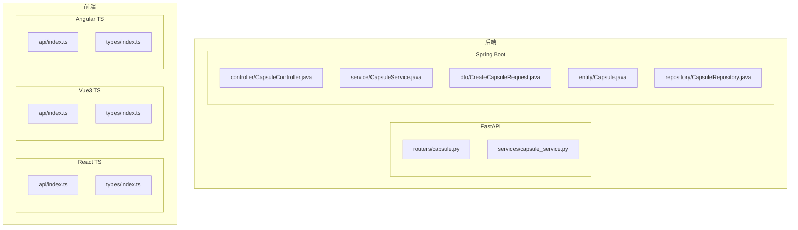
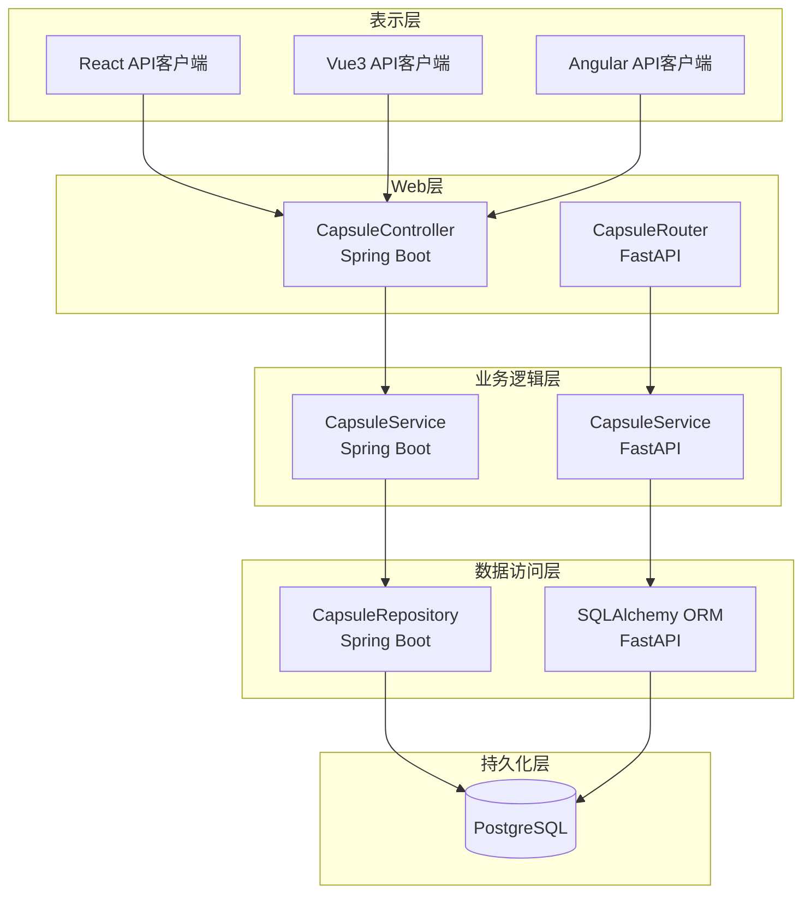
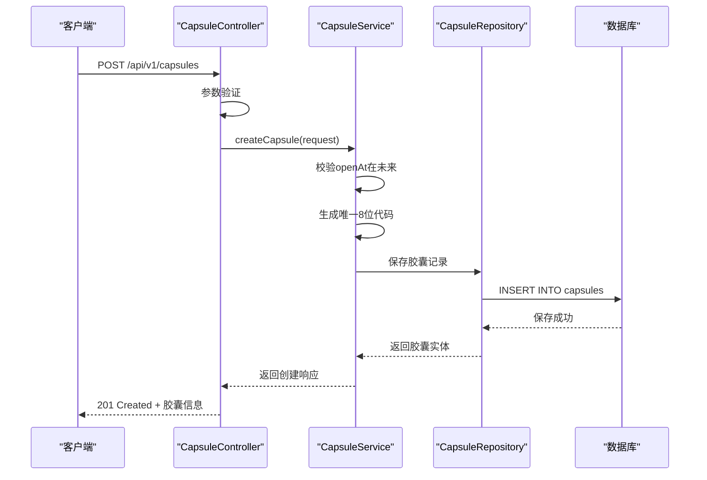
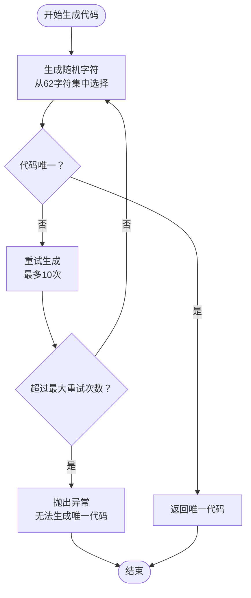
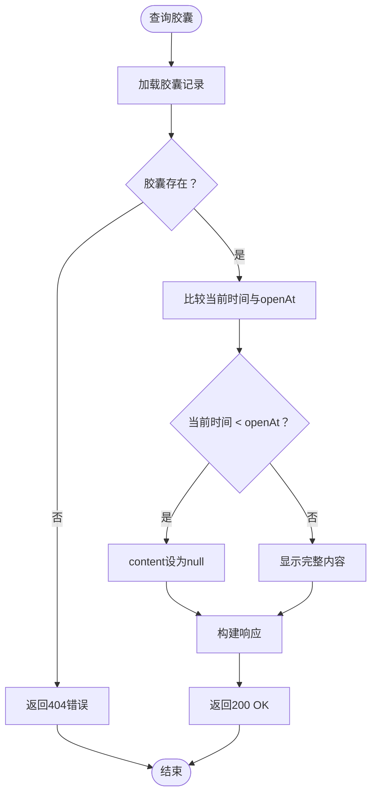
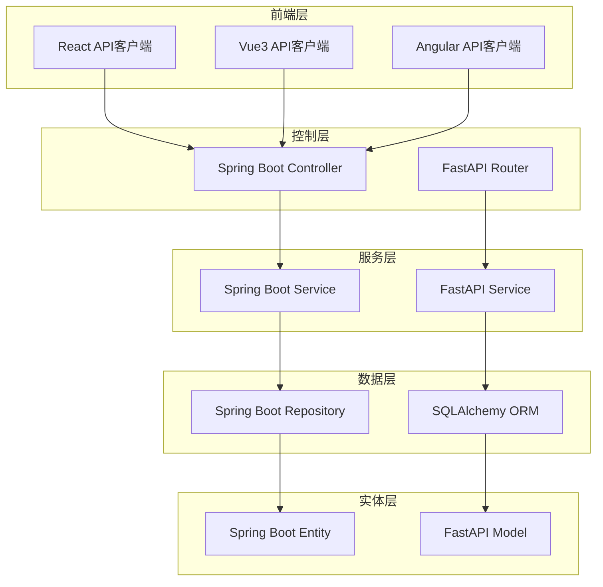

# 时间胶囊管理接口

<cite>
**本文档引用的文件**
- [backends/fastapi/app/routers/capsule.py](file://backends/fastapi/app/routers/capsule.py)
- [backends/fastapi/app/services/capsule_service.py](file://backends/fastapi/app/services/capsule_service.py)
- [backends/spring-boot/src/main/java/com/hellotime/controller/CapsuleController.java](file://backends/spring-boot/src/main/java/com/hellotime/controller/CapsuleController.java)
- [backends/spring-boot/src/main/java/com/hellotime/service/CapsuleService.java](file://backends/spring-boot/src/main/java/com/hellotime/service/CapsuleService.java)
- [backends/spring-boot/src/main/java/com/hellotime/dto/CreateCapsuleRequest.java](file://backends/spring-boot/src/main/java/com/hellotime/dto/CreateCapsuleRequest.java)
- [backends/spring-boot/src/main/java/com/hellotime/dto/CapsuleResponse.java](file://backends/spring-boot/src/main/java/com/hellotime/dto/CapsuleResponse.java)
- [backends/spring-boot/src/main/java/com/hellotime/entity/Capsule.java](file://backends/spring-boot/src/main/java/com/hellotime/entity/Capsule.java)
- [backends/spring-boot/src/main/java/com/hellotime/repository/CapsuleRepository.java](file://backends/spring-boot/src/main/java/com/hellotime/repository/CapsuleRepository.java)
- [frontends/react-ts/src/api/index.ts](file://frontends/react-ts/src/api/index.ts)
- [frontends/vue3-ts/src/api/index.ts](file://frontends/vue3-ts/src/api/index.ts)
- [frontends/angular-ts/src/app/api/index.ts](file://frontends/angular-ts/src/app/api/index.ts)
- [docs/api-spec.md](file://docs/api-spec.md)
- [backends/spring-boot/src/test/java/com/hellotime/controller/CapsuleControllerTest.java](file://backends/spring-boot/src/test/java/com/hellotime/controller/CapsuleControllerTest.java)
- [backends/fastapi/tests/test_capsule_api.py](file://backends/fastapi/tests/test_capsule_api.py)
</cite>

## 目录
1. [简介](#简介)
2. [项目结构](#项目结构)
3. [核心组件](#核心组件)
4. [架构概览](#架构概览)
5. [详细组件分析](#详细组件分析)
6. [依赖关系分析](#依赖关系分析)
7. [性能考虑](#性能考虑)
8. [故障排除指南](#故障排除指南)
9. [结论](#结论)
10. [附录](#附录)

## 简介

HelloTime 是一个时间胶囊管理系统，允许用户创建带有未来开启时间的加密胶囊。该系统提供了两个核心接口：POST /api/v1/capsules（创建胶囊）和GET /api/v1/capsules/{code}（查询胶囊）。系统采用前后端分离架构，后端提供RESTful API，前端支持React、Vue3和Angular三种主流框架。

## 项目结构

项目采用多模块架构，包含后端（FastAPI和Spring Boot）和前端三个框架的实现：



**图表来源**
- [backends/fastapi/app/routers/capsule.py:1-31](file://backends/fastapi/app/routers/capsule.py#L1-L31)
- [backends/spring-boot/src/main/java/com/hellotime/controller/CapsuleController.java:1-57](file://backends/spring-boot/src/main/java/com/hellotime/controller/CapsuleController.java#L1-L57)

**章节来源**
- [backends/fastapi/app/routers/capsule.py:1-31](file://backends/fastapi/app/routers/capsule.py#L1-L31)
- [backends/spring-boot/src/main/java/com/hellotime/controller/CapsuleController.java:1-57](file://backends/spring-boot/src/main/java/com/hellotime/controller/CapsuleController.java#L1-L57)

## 核心组件

### 接口规范

系统提供两个核心REST API接口：

1. **创建时间胶囊**
   - 方法：POST /api/v1/capsules
   - 功能：创建新的时间胶囊，返回8位唯一代码
   - 状态码：201 Created

2. **查询时间胶囊**
   - 方法：GET /api/v1/capsules/{code}
   - 功能：根据8位代码查询胶囊详情
   - 参数：code（8位字符串）
   - 状态码：200 OK

### 请求体字段要求

CreateCapsuleRequest请求体包含以下字段：

| 字段名 | 类型 | 必填 | 长度限制 | 格式约束 | 描述 |
|--------|------|------|----------|----------|------|
| title | string | 是 | 最多100字符 | 非空字符串 | 胶囊标题 |
| content | string | 是 | 无限制 | 非空字符串 | 胶囊内容（长文本） |
| creator | string | 是 | 最多30字符 | 非空字符串 | 创建者昵称 |
| openAt | string (ISO 8601) | 是 | 无 | UTC时间戳 | 开启时间（必须为未来时间） |

**章节来源**
- [backends/spring-boot/src/main/java/com/hellotime/dto/CreateCapsuleRequest.java:13-56](file://backends/spring-boot/src/main/java/com/hellotime/dto/CreateCapsuleRequest.java#L13-L56)
- [docs/api-spec.md:39-54](file://docs/api-spec.md#L39-L54)

## 架构概览

系统采用分层架构设计，包含表示层、业务逻辑层、数据访问层和持久化层：



**图表来源**
- [backends/spring-boot/src/main/java/com/hellotime/controller/CapsuleController.java:17-56](file://backends/spring-boot/src/main/java/com/hellotime/controller/CapsuleController.java#L17-L56)
- [backends/fastapi/app/routers/capsule.py:6-30](file://backends/fastapi/app/routers/capsule.py#L6-L30)

## 详细组件分析

### 创建胶囊流程

创建胶囊涉及完整的数据验证、唯一性保证和安全生成机制：



**图表来源**
- [backends/spring-boot/src/main/java/com/hellotime/controller/CapsuleController.java:37-42](file://backends/spring-boot/src/main/java/com/hellotime/controller/CapsuleController.java#L37-L42)
- [backends/spring-boot/src/main/java/com/hellotime/service/CapsuleService.java:48-69](file://backends/spring-boot/src/main/java/com/hellotime/service/CapsuleService.java#L48-L69)

### UUID生成机制

系统使用Base62编码生成8位唯一代码，确保全球唯一性：



**图表来源**
- [backends/spring-boot/src/main/java/com/hellotime/service/CapsuleService.java:121-129](file://backends/spring-boot/src/main/java/com/hellotime/service/CapsuleService.java#L121-L129)
- [backends/fastapi/app/services/capsule_service.py:37-43](file://backends/fastapi/app/services/capsule_service.py#L37-L43)

### 查询胶囊特殊行为

查询接口实现了"时间延迟"功能，未到开启时间时不返回内容：



**图表来源**
- [backends/spring-boot/src/main/java/com/hellotime/service/CapsuleService.java:79-83](file://backends/spring-boot/src/main/java/com/hellotime/service/CapsuleService.java#L79-L83)
- [backends/fastapi/app/services/capsule_service.py:105-111](file://backends/fastapi/app/services/capsule_service.py#L105-L111)

**章节来源**
- [backends/spring-boot/src/main/java/com/hellotime/service/CapsuleService.java:79-83](file://backends/spring-boot/src/main/java/com/hellotime/service/CapsuleService.java#L79-L83)
- [backends/fastapi/app/services/capsule_service.py:105-111](file://backends/fastapi/app/services/capsule_service.py#L105-L111)

## 依赖关系分析

系统各层之间的依赖关系清晰明确：



**图表来源**
- [backends/spring-boot/src/main/java/com/hellotime/controller/CapsuleController.java:21-28](file://backends/spring-boot/src/main/java/com/hellotime/controller/CapsuleController.java#L21-L28)
- [backends/fastapi/app/routers/capsule.py:10-12](file://backends/fastapi/app/routers/capsule.py#L10-L12)

**章节来源**
- [backends/spring-boot/src/main/java/com/hellotime/controller/CapsuleController.java:21-28](file://backends/spring-boot/src/main/java/com/hellotime/controller/CapsuleController.java#L21-L28)
- [backends/fastapi/app/routers/capsule.py:10-12](file://backends/fastapi/app/routers/capsule.py#L10-L12)

## 性能考虑

### 数据库优化
- 胶囊码字段建立唯一索引，确保查询效率
- open_at字段建立索引，优化时间范围查询
- 使用连接池管理数据库连接

### 缓存策略
- 响应数据采用JSON序列化，减少传输体积
- 未开启胶囊不返回大字段内容，降低网络传输

### 并发处理
- Spring Boot使用@Transactional注解确保数据一致性
- FastAPI使用异步数据库连接池

## 故障排除指南

### 常见错误及解决方案

| 错误类型 | HTTP状态码 | 错误码 | 说明 | 解决方案 |
|----------|------------|--------|------|----------|
| 参数验证失败 | 400 | VALIDATION_ERROR | 请求参数不符合要求 | 检查字段长度和格式约束 |
| 开启时间无效 | 400 | BAD_REQUEST | 开启时间不是未来时间 | 确保openAt大于当前时间 |
| 胶囊不存在 | 404 | CAPSULE_NOT_FOUND | 查询的胶囊代码不存在 | 确认胶囊代码正确性 |
| 服务器内部错误 | 500 | INTERNAL_ERROR | 服务器处理异常 | 检查数据库连接和日志 |

**章节来源**
- [backends/spring-boot/src/test/java/com/hellotime/controller/CapsuleControllerTest.java:56-71](file://backends/spring-boot/src/test/java/com/hellotime/controller/CapsuleControllerTest.java#L56-L71)
- [backends/fastapi/tests/test_capsule_api.py:33-50](file://backends/fastapi/tests/test_capsule_api.py#L33-L50)

## 结论

HelloTime时间胶囊管理系统提供了完整的时间延迟内容分享解决方案。系统通过严格的参数验证、安全的唯一代码生成和智能的时间控制机制，确保了用户体验和数据安全。前后端分离的架构设计使得系统具有良好的可扩展性和维护性。

## 附录

### API调用示例

#### React TypeScript 示例
```typescript
// 创建胶囊
await createCapsule({
  title: "测试胶囊",
  content: "这是胶囊内容",
  creator: "测试用户",
  openAt: new Date(Date.now() + 24*60*60*1000).toISOString()
});

// 查询胶囊
await getCapsule("ABC123de");
```

#### Vue3 TypeScript 示例
```typescript
// 创建胶囊
await createCapsule({
  title: "测试胶囊",
  content: "这是胶囊内容",
  creator: "测试用户",
  openAt: new Date().toISOString()
});

// 查询胶囊
await getCapsule("ABC123de");
```

#### Angular TypeScript 示例
```typescript
// 创建胶囊
await createCapsule({
  title: "测试胶囊",
  content: "这是胶囊内容",
  creator: "测试用户",
  openAt: new Date().toISOString()
});

// 查询胶囊
await getCapsule("ABC123de");
```

### 请求响应示例

#### 成功创建胶囊响应
```json
{
  "success": true,
  "data": {
    "code": "Ab3xK9mZ",
    "title": "给未来的信",
    "creator": "小明",
    "openAt": "2025-06-01T00:00:00Z",
    "createdAt": "2024-01-01T12:00:00Z"
  },
  "message": "胶囊创建成功"
}
```

#### 未到时间胶囊响应
```json
{
  "success": true,
  "data": {
    "code": "Ab3xK9mZ",
    "title": "给未来的信",
    "creator": "小明",
    "openAt": "2025-06-01T00:00:00Z",
    "createdAt": "2024-01-01T12:00:00Z",
    "opened": false
  }
}
```

#### 已到时间胶囊响应
```json
{
  "success": true,
  "data": {
    "code": "Ab3xK9mZ",
    "title": "给未来的信",
    "content": "希望你一切都好...",
    "creator": "小明",
    "openAt": "2025-06-01T00:00:00Z",
    "createdAt": "2024-01-01T12:00:00Z",
    "opened": true
  }
}
```

**章节来源**
- [docs/api-spec.md:56-109](file://docs/api-spec.md#L56-L109)
- [frontends/react-ts/src/api/index.ts:37-53](file://frontends/react-ts/src/api/index.ts#L37-L53)
- [frontends/vue3-ts/src/api/index.ts:46-65](file://frontends/vue3-ts/src/api/index.ts#L46-L65)
- [frontends/angular-ts/src/app/api/index.ts:29-41](file://frontends/angular-ts/src/app/api/index.ts#L29-L41)