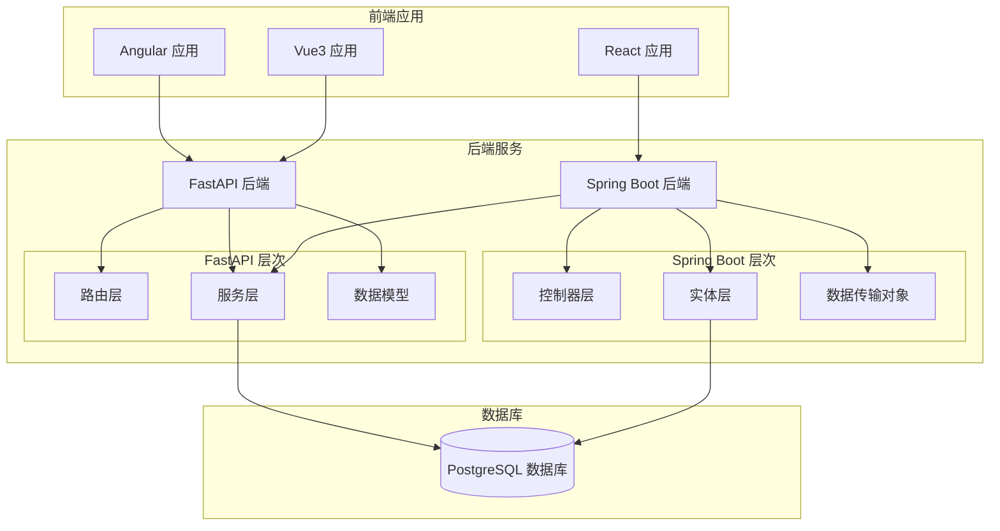
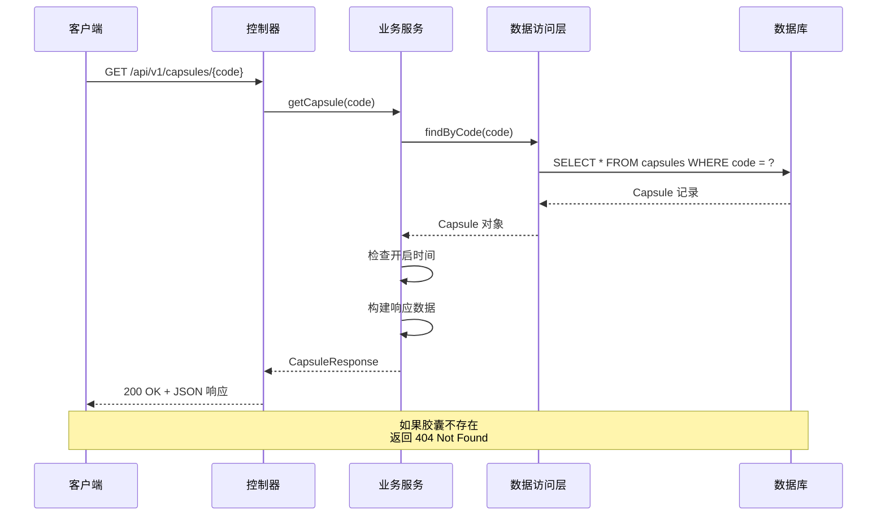
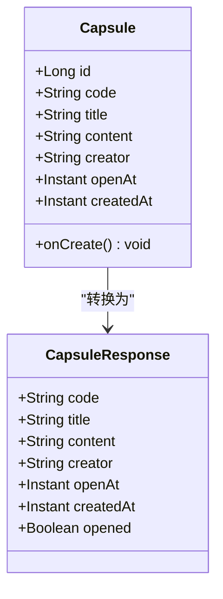
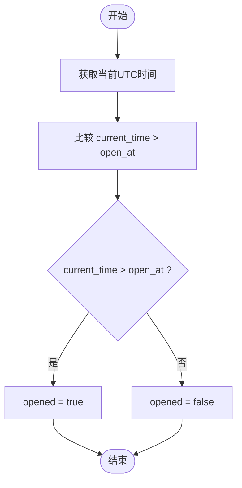
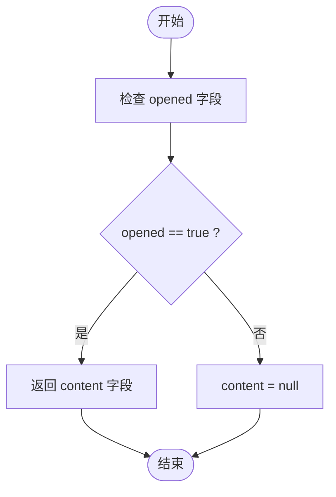
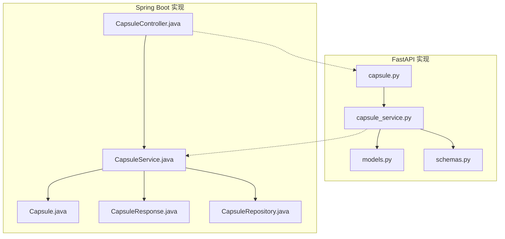
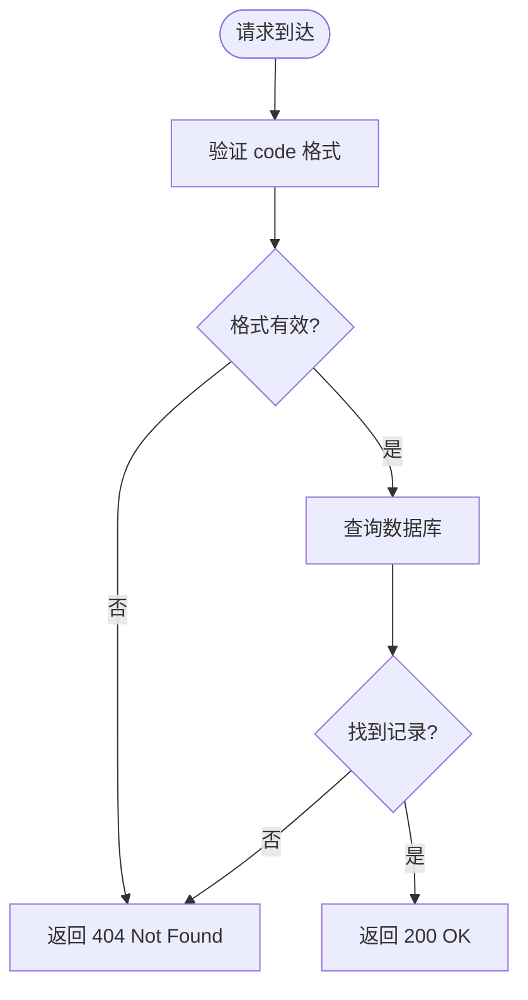

# 查询胶囊接口

<cite>
**本文档引用的文件**
- [backends/fastapi/app/routers/capsule.py](file://backends/fastapi/app/routers/capsule.py)
- [backends/fastapi/app/services/capsule_service.py](file://backends/fastapi/app/services/capsule_service.py)
- [backends/spring-boot/src/main/java/com/hellotime/controller/CapsuleController.java](file://backends/spring-boot/src/main/java/com/hellotime/controller/CapsuleController.java)
- [backends/spring-boot/src/main/java/com/hellotime/service/CapsuleService.java](file://backends/spring-boot/src/main/java/com/hellotime/service/CapsuleService.java)
- [backends/spring-boot/src/main/java/com/hellotime/entity/Capsule.java](file://backends/spring-boot/src/main/java/com/hellotime/entity/Capsule.java)
- [backends/spring-boot/src/main/java/com/hellotime/dto/CapsuleResponse.java](file://backends/spring-boot/src/main/java/com/hellotime/dto/CapsuleResponse.java)
- [frontends/angular-ts/src/app/api/index.ts](file://frontends/angular-ts/src/app/api/index.ts)
- [frontends/react-ts/src/api/index.ts](file://frontends/react-ts/src/api/index.ts)
- [frontends/vue3-ts/src/api/index.ts](file://frontends/vue3-ts/src/api/index.ts)
- [frontends/angular-ts/src/app/services/capsule.service.ts](file://frontends/angular-ts/src/app/services/capsule.service.ts)
- [frontends/react-ts/src/hooks/useCapsule.ts](file://frontends/react-ts/src/hooks/useCapsule.ts)
- [frontends/vue3-ts/src/composables/useCapsule.ts](file://frontends/vue3-ts/src/composables/useCapsule.ts)
- [backends/fastapi/tests/test_capsule_api.py](file://backends/fastapi/tests/test_capsule_api.py)
- [backends/spring-boot/src/test/java/com/hellotime/controller/CapsuleControllerTest.java](file://backends/spring-boot/src/test/java/com/hellotime/controller/CapsuleControllerTest.java)
- [backends/spring-boot/src/test/java/com/hellotime/service/CapsuleServiceTest.java](file://backends/spring-boot/src/test/java/com/hellotime/service/CapsuleServiceTest.java)
</cite>

## 目录
1. [简介](#简介)
2. [项目结构](#项目结构)
3. [核心组件](#核心组件)
4. [架构概览](#架构概览)
5. [详细组件分析](#详细组件分析)
6. [依赖关系分析](#依赖关系分析)
7. [性能考虑](#性能考虑)
8. [故障排除指南](#故障排除指南)
9. [结论](#结论)

## 简介

查询胶囊接口是 HelloTime 项目中的核心功能之一，负责提供对时间胶囊的只读访问。该接口支持两种后端实现：FastAPI 和 Spring Boot，均实现了相同的业务逻辑和数据模型。

本接口的主要功能是根据 8 位字符的胶囊代码查询胶囊详情，同时实现了重要的时间保护机制：在胶囊未到开启时间之前，content 字段会返回 null，确保内容不会被提前泄露。

## 项目结构

HelloTime 项目采用多层架构设计，包含前后端分离的完整实现：



**图表来源**
- [backends/fastapi/app/routers/capsule.py:1-31](file://backends/fastapi/app/routers/capsule.py#L1-L31)
- [backends/spring-boot/src/main/java/com/hellotime/controller/CapsuleController.java:1-57](file://backends/spring-boot/src/main/java/com/hellotime/controller/CapsuleController.java#L1-L57)

**章节来源**
- [backends/fastapi/app/routers/capsule.py:1-31](file://backends/fastapi/app/routers/capsule.py#L1-L31)
- [backends/spring-boot/src/main/java/com/hellotime/controller/CapsuleController.java:1-57](file://backends/spring-boot/src/main/java/com/hellotime/controller/CapsuleController.java#L1-L57)

## 核心组件

### 接口定义

查询胶囊接口遵循 RESTful 设计原则，提供标准的 HTTP 方法和状态码：

- **端点**: `GET /api/v1/capsules/{code}`
- **方法**: GET
- **路径参数**: code (8位字符)
- **响应类型**: JSON
- **鉴权要求**: 无需鉴权

### 路径参数规范

接口严格要求路径参数 code 必须满足以下条件：

- **长度**: 恰好 8 个字符
- **字符集**: 仅允许字母和数字 (A-Z, a-z, 0-9)
- **正则表达式**: `^[A-Za-z0-9]{8}$`

这个设计确保了：
1. 唯一性和可预测性
2. 防止注入攻击
3. 简化的 URL 结构
4. 易于分享和记忆

**章节来源**
- [backends/fastapi/app/routers/capsule.py:27-30](file://backends/fastapi/app/routers/capsule.py#L27-L30)
- [backends/spring-boot/src/main/java/com/hellotime/controller/CapsuleController.java:44-55](file://backends/spring-boot/src/main/java/com/hellotime/controller/CapsuleController.java#L44-L55)

## 架构概览

查询胶囊接口的完整架构流程如下：



**图表来源**
- [backends/spring-boot/src/main/java/com/hellotime/controller/CapsuleController.java:44-55](file://backends/spring-boot/src/main/java/com/hellotime/controller/CapsuleController.java#L44-L55)
- [backends/spring-boot/src/main/java/com/hellotime/service/CapsuleService.java:71-83](file://backends/spring-boot/src/main/java/com/hellotime/service/CapsuleService.java#L71-L83)

## 详细组件分析

### 数据模型设计

#### Capsule 实体模型



**图表来源**
- [backends/spring-boot/src/main/java/com/hellotime/entity/Capsule.java:10-90](file://backends/spring-boot/src/main/java/com/hellotime/entity/Capsule.java#L10-L90)
- [backends/spring-boot/src/main/java/com/hellotime/dto/CapsuleResponse.java:6-31](file://backends/spring-boot/src/main/java/com/hellotime/dto/CapsuleResponse.java#L6-L31)

#### 字段详细说明

| 字段名 | 类型 | 必填 | 描述 | 格式 |
|--------|------|------|------|------|
| code | String | 是 | 8位胶囊代码 | A-Za-z0-9，长度8 |
| title | String | 是 | 胶囊标题 | 最大100字符 |
| content | String | 是 | 胶囊内容 | TEXT类型，可能为null |
| creator | String | 是 | 创建者昵称 | 最大30字符 |
| openAt | Instant | 是 | 开启时间 | UTC时间戳 |
| createdAt | Instant | 是 | 创建时间 | UTC时间戳 |
| opened | Boolean | 否 | 是否已开启 | 基于时间比较 |

### 时间保护机制

#### opened 字段计算逻辑

opened 字段的计算基于当前时间与开启时间的比较：



**图表来源**
- [backends/fastapi/app/services/capsule_service.py:56-57](file://backends/fastapi/app/services/capsule_service.py#L56-L57)
- [backends/spring-boot/src/main/java/com/hellotime/service/CapsuleService.java:169-171](file://backends/spring-boot/src/main/java/com/hellotime/service/CapsuleService.java#L169-L171)

#### content 字段保护策略

content 字段的返回逻辑体现了重要的安全设计：



**图表来源**
- [backends/fastapi/app/services/capsule_service.py:70-76](file://backends/fastapi/app/services/capsule_service.py#L70-L76)
- [backends/spring-boot/src/main/java/com/hellotime/service/CapsuleService.java:172-176](file://backends/spring-boot/src/main/java/com/hellotime/service/CapsuleService.java#L172-L176)

### 响应数据结构

#### 成功响应示例

**已到开启时间的完整胶囊信息：**
```json
{
  "success": true,
  "message": "查询成功",
  "data": {
    "code": "ABC12345",
    "title": "我的重要消息",
    "content": "这是胶囊的内容",
    "creator": "张三",
    "openAt": "2024-01-01T00:00:00Z",
    "createdAt": "2023-12-01T10:30:00Z",
    "opened": true
  }
}
```

**未到开启时间的胶囊信息：**
```json
{
  "success": true,
  "message": "查询成功",
  "data": {
    "code": "XYZ98765",
    "title": "未来消息",
    "content": null,
    "creator": "李四",
    "openAt": "2024-12-31T23:59:59Z",
    "createdAt": "2023-12-01T15:45:00Z",
    "opened": false
  }
}
```

#### 错误响应示例

**404 Not Found 错误：**
```json
{
  "success": false,
  "message": "胶囊不存在",
  "errorCode": "CAPSULE_NOT_FOUND",
  "data": null
}
```

**400 Bad Request 错误（参数验证失败）：**
```json
{
  "success": false,
  "message": "参数验证失败",
  "errorCode": "VALIDATION_ERROR",
  "data": null
}
```

**章节来源**
- [backends/fastapi/tests/test_capsule_api.py:53-69](file://backends/fastapi/tests/test_capsule_api.py#L53-L69)
- [backends/spring-boot/src/test/java/com/hellotime/controller/CapsuleControllerTest.java:73-92](file://backends/spring-boot/src/test/java/com/hellotime/controller/CapsuleControllerTest.java#L73-L92)

### API 调用示例

#### Angular 实现

```typescript
// 在组件中使用
import { Component, OnInit } from '@angular/core';
import { CapsuleService } from './services/capsule.service';

@Component({
  selector: 'app-capsule-detail',
  template: `
    <div *ngIf="loading">加载中...</div>
    <div *ngIf="error">{{ error }}</div>
    <div *ngIf="capsule && !loading">
      <h2>{{ capsule.title }}</h2>
      <p>创建者: {{ capsule.creator }}</p>
      <p>开启时间: {{ capsule.openAt }}</p>
      <div *ngIf="capsule.content !== null">
        <h3>内容:</h3>
        <p>{{ capsule.content }}</p>
      </div>
      <div *ngIf="capsule.content === null && !capsule.opened">
        <p>内容尚未开放</p>
      </div>
    </div>
  `
})
export class CapsuleDetailComponent implements OnInit {
  constructor(private capsuleService: CapsuleService) {}

  ngOnInit(): void {
    this.loadCapsule('ABC12345');
  }

  async loadCapsule(code: string): Promise<void> {
    try {
      const capsule = await this.capsuleService.get(code);
      console.log('胶囊信息:', capsule);
    } catch (error) {
      console.error('查询失败:', error);
    }
  }
}
```

#### React 实现

```javascript
// 在组件中使用
import React, { useState, useEffect } from 'react';
import { useCapsule } from '@/hooks/useCapsule';

function CapsuleDetail() {
  const { capsule, loading, error, get } = useCapsule();
  const [code, setCode] = useState('ABC12345');

  useEffect(() => {
    const fetchCapsule = async () => {
      try {
        await get(code);
      } catch (err) {
        console.error('获取胶囊失败:', err);
      }
    };

    fetchCapsule();
  }, [code, get]);

  if (loading) return <div>加载中...</div>;
  if (error) return <div>错误: {error}</div>;
  if (!capsule) return <div>无数据</div>;

  return (
    <div>
      <h2>{capsule.title}</h2>
      <p>创建者: {capsule.creator}</p>
      <p>开启时间: {capsule.openAt}</p>
      {capsule.content !== null ? (
        <div>
          <h3>内容:</h3>
          <p>{capsule.content}</p>
        </div>
      ) : capsule.opened ? (
        <div>内容已开放但为空</div>
      ) : (
        <div>内容尚未开放</div>
      )}
    </div>
  );
}
```

#### Vue3 实现

```vue
<!-- 在组件中使用 -->
<template>
  <div v-if="loading">加载中...</div>
  <div v-else-if="error">错误: {{ error }}</div>
  <div v-else-if="capsule">
    <h2>{{ capsule.title }}</h2>
    <p>创建者: {{ capsule.creator }}</p>
    <p>开启时间: {{ capsule.openAt }}</p>
    <div v-if="capsule.content !== null">
      <h3>内容:</h3>
      <p>{{ capsule.content }}</p>
    </div>
    <div v-else-if="!capsule.opened">
      <p>内容尚未开放</p>
    </div>
  </div>
</template>

<script setup>
import { ref, watch } from 'vue';
import { useCapsule } from '@/composables/useCapsule';

const { capsule, loading, error, get } = useCapsule();
const code = ref('ABC12345');

watch(() => code.value, async (newCode) => {
  if (newCode.length === 8) {
    try {
      await get(newCode);
    } catch (err) {
      console.error('获取胶囊失败:', err);
    }
  }
}, { immediate: true });
</script>
```

**章节来源**
- [frontends/angular-ts/src/app/api/index.ts:39-41](file://frontends/angular-ts/src/app/api/index.ts#L39-L41)
- [frontends/react-ts/src/api/index.ts:51-53](file://frontends/react-ts/src/api/index.ts#L51-L53)
- [frontends/vue3-ts/src/api/index.ts:63-65](file://frontends/vue3-ts/src/api/index.ts#L63-L65)
- [frontends/angular-ts/src/app/services/capsule.service.ts:26-39](file://frontends/angular-ts/src/app/services/capsule.service.ts#L26-L39)
- [frontends/react-ts/src/hooks/useCapsule.ts:30-44](file://frontends/react-ts/src/hooks/useCapsule.ts#L30-L44)
- [frontends/vue3-ts/src/composables/useCapsule.ts:47-60](file://frontends/vue3-ts/src/composables/useCapsule.ts#L47-L60)

## 依赖关系分析

### 后端依赖关系



**图表来源**
- [backends/fastapi/app/routers/capsule.py:1-31](file://backends/fastapi/app/routers/capsule.py#L1-L31)
- [backends/fastapi/app/services/capsule_service.py:1-144](file://backends/fastapi/app/services/capsule_service.py#L1-L144)
- [backends/spring-boot/src/main/java/com/hellotime/controller/CapsuleController.java:1-57](file://backends/spring-boot/src/main/java/com/hellotime/controller/CapsuleController.java#L1-L57)
- [backends/spring-boot/src/main/java/com/hellotime/service/CapsuleService.java:1-195](file://backends/spring-boot/src/main/java/com/hellotime/service/CapsuleService.java#L1-L195)

### 错误处理机制

#### 404 Not Found 触发条件

接口在以下情况下返回 404 Not Found：

1. **胶囊不存在**: 数据库中没有匹配的 code 记录
2. **code 格式不正确**: 路径参数不符合 8 位字母数字的要求



**图表来源**
- [backends/fastapi/app/services/capsule_service.py:105-111](file://backends/fastapi/app/services/capsule_service.py#L105-L111)
- [backends/spring-boot/src/main/java/com/hellotime/service/CapsuleService.java:79-83](file://backends/spring-boot/src/main/java/com/hellotime/service/CapsuleService.java#L79-L83)

**章节来源**
- [backends/fastapi/tests/test_capsule_api.py:44-51](file://backends/fastapi/tests/test_capsule_api.py#L44-L51)
- [backends/spring-boot/src/test/java/com/hellotime/controller/CapsuleControllerTest.java:66-71](file://backends/spring-boot/src/test/java/com/hellotime/controller/CapsuleControllerTest.java#L66-L71)

## 性能考虑

### 查询优化策略

1. **索引设计**: code 字段应建立唯一索引以支持快速查找
2. **连接池**: 后端应配置适当的数据库连接池大小
3. **缓存策略**: 可考虑实现读取缓存减少数据库压力
4. **分页设计**: 对于大量数据的场景，建议实现分页查询

### 时间复杂度分析

- **查询操作**: O(log n) - 基于索引的查找
- **内存使用**: O(1) - 固定大小的响应对象
- **网络开销**: O(1) - 固定字段数量的 JSON 响应

## 故障排除指南

### 常见问题及解决方案

#### 1. 404 Not Found 错误排查

**症状**: 返回 404 状态码和 "胶囊不存在" 错误

**排查步骤**:
1. 验证 code 参数是否为 8 位字符
2. 检查 code 是否包含非法字符
3. 确认胶囊是否已创建且未被删除
4. 验证数据库连接状态

**解决方案**:
- 确保使用正确的 8 位代码
- 检查 URL 编码问题
- 验证数据库中是否存在该记录

#### 2. 内容始终为 null 的问题

**症状**: 即使到了开启时间，content 仍为 null

**排查步骤**:
1. 检查 openAt 字段是否正确设置
2. 验证系统时间是否准确
3. 确认数据库中 content 字段的实际值
4. 检查服务端时间处理逻辑

**解决方案**:
- 确保开启时间设置在未来
- 检查时区设置
- 验证数据库数据完整性

#### 3. 前端显示问题

**症状**: 前端无法正确显示胶囊内容

**排查步骤**:
1. 检查 API 响应格式
2. 验证前端状态管理
3. 确认错误处理逻辑
4. 检查网络请求状态

**解决方案**:
- 实现完善的错误边界处理
- 添加加载状态指示
- 提供用户友好的错误提示

**章节来源**
- [backends/fastapi/tests/test_capsule_api.py:44-69](file://backends/fastapi/tests/test_capsule_api.py#L44-L69)
- [backends/spring-boot/src/test/java/com/hellotime/service/CapsuleServiceTest.java:56-69](file://backends/spring-boot/src/test/java/com/hellotime/service/CapsuleServiceTest.java#L56-L69)

## 结论

查询胶囊接口作为 HelloTime 项目的核心功能，成功实现了以下目标：

### 设计优势

1. **安全性**: 通过时间保护机制确保内容不会被提前泄露
2. **一致性**: FastAPI 和 Spring Boot 两套实现保持完全一致的行为
3. **易用性**: 简洁的 8 位代码设计便于分享和记忆
4. **可靠性**: 完善的错误处理和状态管理

### 技术特点

- **RESTful 设计**: 符合现代 Web API 标准
- **跨平台支持**: 支持多种前端框架
- **类型安全**: 强类型的数据模型和响应结构
- **国际化**: 支持 UTC 时间戳格式

### 未来改进方向

1. **缓存优化**: 实现智能缓存策略提升性能
2. **监控增强**: 添加详细的 API 使用统计
3. **安全加固**: 考虑添加访问频率限制
4. **文档完善**: 自动生成 API 文档

该接口为用户提供了安全、可靠的时间胶囊访问体验，是整个项目的重要基础设施组件。