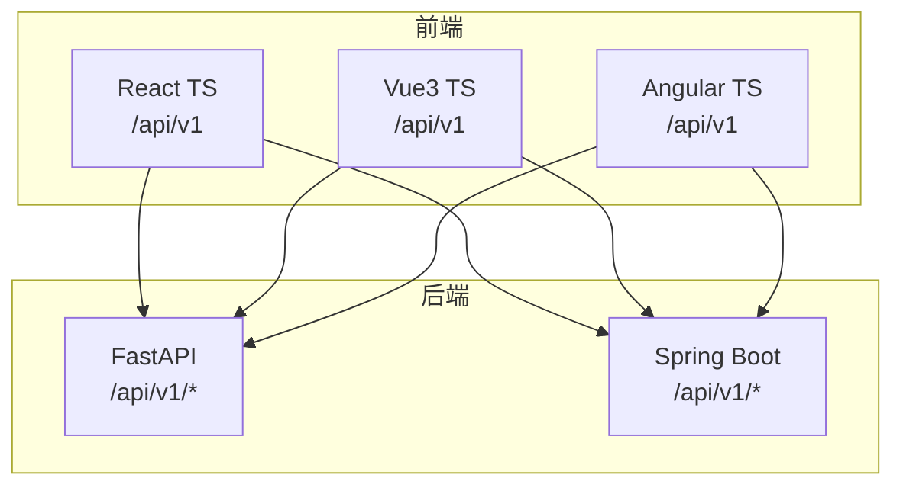
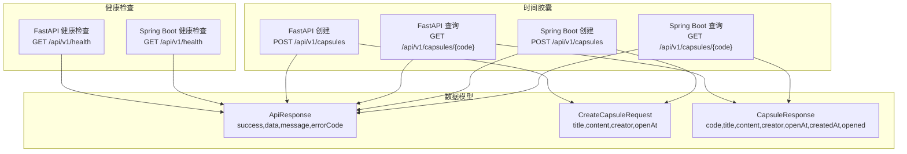
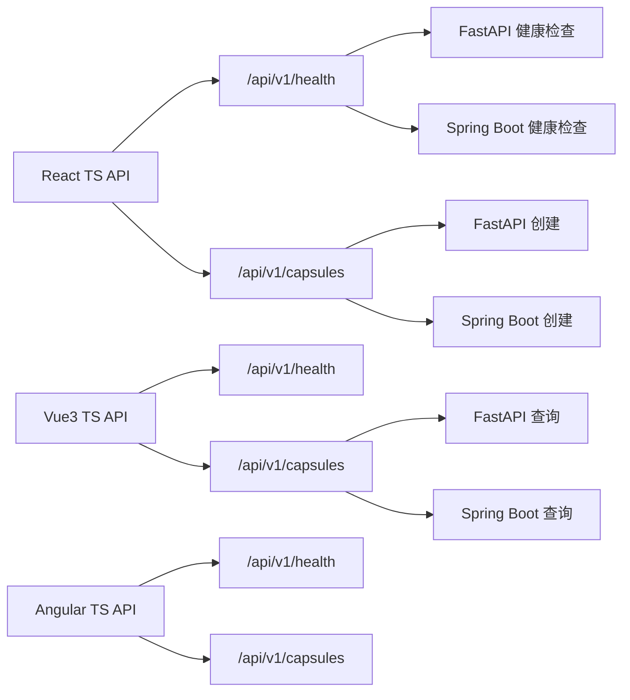
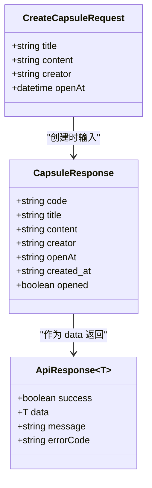
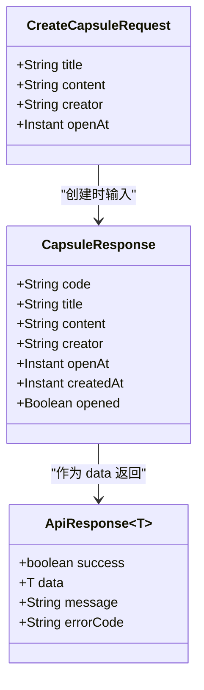
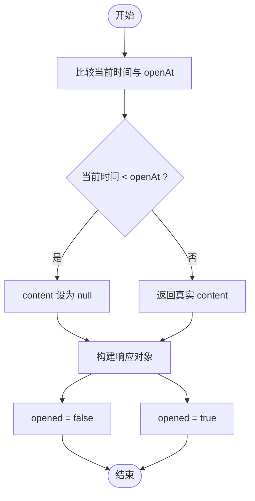

# 核心接口

<cite>
**本文引用的文件**
- [backends/fastapi/app/routers/health.py](file://backends/fastapi/app/routers/health.py)
- [backends/fastapi/app/routers/capsule.py](file://backends/fastapi/app/routers/capsule.py)
- [backends/fastapi/app/schemas.py](file://backends/fastapi/app/schemas.py)
- [backends/fastapi/app/services/capsule_service.py](file://backends/fastapi/app/services/capsule_service.py)
- [backends/fastapi/tests/test_capsule_api.py](file://backends/fastapi/tests/test_capsule_api.py)
- [backends/spring-boot/src/main/java/com/hellotime/controller/HealthController.java](file://backends/spring-boot/src/main/java/com/hellotime/controller/HealthController.java)
- [backends/spring-boot/src/main/java/com/hellotime/controller/CapsuleController.java](file://backends/spring-boot/src/main/java/com/hellotime/controller/CapsuleController.java)
- [backends/spring-boot/src/main/java/com/hellotime/dto/ApiResponse.java](file://backends/spring-boot/src/main/java/com/hellotime/dto/ApiResponse.java)
- [backends/spring-boot/src/main/java/com/hellotime/dto/CapsuleResponse.java](file://backends/spring-boot/src/main/java/com/hellotime/dto/CapsuleResponse.java)
- [backends/spring-boot/src/main/java/com/hellotime/dto/CreateCapsuleRequest.java](file://backends/spring-boot/src/main/java/com/hellotime/dto/CreateCapsuleRequest.java)
- [backends/spring-boot/src/main/java/com/hellotime/service/CapsuleService.java](file://backends/spring-boot/src/main/java/com/hellotime/service/CapsuleService.java)
- [backends/spring-boot/src/test/java/com/hellotime/controller/CapsuleControllerTest.java](file://backends/spring-boot/src/test/java/com/hellotime/controller/CapsuleControllerTest.java)
- [frontends/react-ts/src/api/index.ts](file://frontends/react-ts/src/api/index.ts)
- [frontends/react-ts/src/types/index.ts](file://frontends/react-ts/src/types/index.ts)
- [frontends/vue3-ts/src/api/index.ts](file://frontends/vue3-ts/src/api/index.ts)
- [frontends/angular-ts/src/app/api/index.ts](file://frontends/angular-ts/src/app/api/index.ts)
</cite>

## 目录
1. [简介](#简介)
2. [项目结构](#项目结构)
3. [核心组件](#核心组件)
4. [架构总览](#架构总览)
5. [详细组件分析](#详细组件分析)
6. [依赖分析](#依赖分析)
7. [性能考虑](#性能考虑)
8. [故障排查指南](#故障排查指南)
9. [结论](#结论)
10. [附录](#附录)

## 简介
本文件聚焦于 HelloTime 项目的核心 API 接口，涵盖健康检查、时间胶囊创建与查询三大基础能力。文档详细说明每个端点的 HTTP 方法、URL 路径、请求参数与响应格式；重点解释时间胶囊查询接口在“时间未到”时 content 字段为 null 的特殊行为；提供成功与失败场景的请求/响应示例；阐述接口的业务逻辑与数据流转过程；并为 React、Vue3、Angular 三大前端框架提供对应的 API 调用示例。

## 项目结构
后端采用双栈实现：
- FastAPI（Python 3.12，SQLite）
- Spring Boot（Java 17，SQLite）

前端提供三套实现（React TS、Vue3 TS、Angular TS），均通过统一的基础路径 /api/v1 与后端交互。

图表来源
- [frontends/react-ts/src/api/index.ts:8-93](file://frontends/react-ts/src/api/index.ts#L8-L93)
- [frontends/vue3-ts/src/api/index.ts:8-119](file://frontends/vue3-ts/src/api/index.ts#L8-L119)
- [frontends/angular-ts/src/app/api/index.ts:8-70](file://frontends/angular-ts/src/app/api/index.ts#L8-L70)
- [backends/fastapi/app/routers/health.py:14-24](file://backends/fastapi/app/routers/health.py#L14-L24)
- [backends/fastapi/app/routers/capsule.py:17-30](file://backends/fastapi/app/routers/capsule.py#L17-L30)
- [backends/spring-boot/src/main/java/com/hellotime/controller/HealthController.java:15-26](file://backends/spring-boot/src/main/java/com/hellotime/controller/HealthController.java#L15-L26)
- [backends/spring-boot/src/main/java/com/hellotime/controller/CapsuleController.java:37-54](file://backends/spring-boot/src/main/java/com/hellotime/controller/CapsuleController.java#L37-L54)

章节来源
- [frontends/react-ts/src/api/index.ts:8-93](file://frontends/react-ts/src/api/index.ts#L8-L93)
- [frontends/vue3-ts/src/api/index.ts:8-119](file://frontends/vue3-ts/src/api/index.ts#L8-L119)
- [frontends/angular-ts/src/app/api/index.ts:8-70](file://frontends/angular-ts/src/app/api/index.ts#L8-L70)
- [backends/fastapi/app/routers/health.py:14-24](file://backends/fastapi/app/routers/health.py#L14-L24)
- [backends/fastapi/app/routers/capsule.py:17-30](file://backends/fastapi/app/routers/capsule.py#L17-L30)
- [backends/spring-boot/src/main/java/com/hellotime/controller/HealthController.java:15-26](file://backends/spring-boot/src/main/java/com/hellotime/controller/HealthController.java#L15-L26)
- [backends/spring-boot/src/main/java/com/hellotime/controller/CapsuleController.java:37-54](file://backends/spring-boot/src/main/java/com/hellotime/controller/CapsuleController.java#L37-L54)

## 核心组件
- 健康检查接口：提供系统运行状态与技术栈信息，便于运维与前端健康页展示。
- 时间胶囊创建接口：接收标题、内容、创建者与开启时间，生成 8 位唯一编码，返回创建结果。
- 时间胶囊查询接口：根据 8 位编码查询详情；若开启时间未到，则 content 为 null。

章节来源
- [backends/fastapi/app/routers/health.py:14-24](file://backends/fastapi/app/routers/health.py#L14-L24)
- [backends/fastapi/app/routers/capsule.py:17-30](file://backends/fastapi/app/routers/capsule.py#L17-L30)
- [backends/spring-boot/src/main/java/com/hellotime/controller/HealthController.java:15-26](file://backends/spring-boot/src/main/java/com/hellotime/controller/HealthController.java#L15-L26)
- [backends/spring-boot/src/main/java/com/hellotime/controller/CapsuleController.java:37-54](file://backends/spring-boot/src/main/java/com/hellotime/controller/CapsuleController.java#L37-L54)

## 架构总览
下图展示了核心接口在不同后端实现中的对应关系与数据模型映射。

图表来源
- [backends/fastapi/app/routers/health.py:14-24](file://backends/fastapi/app/routers/health.py#L14-L24)
- [backends/fastapi/app/routers/capsule.py:17-30](file://backends/fastapi/app/routers/capsule.py#L17-L30)
- [backends/spring-boot/src/main/java/com/hellotime/controller/HealthController.java:15-26](file://backends/spring-boot/src/main/java/com/hellotime/controller/HealthController.java#L15-L26)
- [backends/spring-boot/src/main/java/com/hellotime/controller/CapsuleController.java:37-54](file://backends/spring-boot/src/main/java/com/hellotime/controller/CapsuleController.java#L37-L54)
- [backends/fastapi/app/schemas.py:54-95](file://backends/fastapi/app/schemas.py#L54-L95)
- [backends/spring-boot/src/main/java/com/hellotime/dto/ApiResponse.java:16-55](file://backends/spring-boot/src/main/java/com/hellotime/dto/ApiResponse.java#L16-L55)
- [backends/spring-boot/src/main/java/com/hellotime/dto/CreateCapsuleRequest.java:13-55](file://backends/spring-boot/src/main/java/com/hellotime/dto/CreateCapsuleRequest.java#L13-L55)
- [backends/spring-boot/src/main/java/com/hellotime/dto/CapsuleResponse.java:7-30](file://backends/spring-boot/src/main/java/com/hellotime/dto/CapsuleResponse.java#L7-L30)

## 详细组件分析

### 健康检查接口
- HTTP 方法与路径
  - GET /api/v1/health
- 请求参数
  - 无
- 响应格式
  - 统一响应体：success、data、message、errorCode
  - data 包含 status、timestamp、techStack
  - techStack 包含 framework、language、database
- 业务逻辑
  - 返回后端运行状态与技术栈信息，便于监控与前端健康页展示
- 请求/响应示例
  - 成功示例
    - 请求：GET /api/v1/health
    - 响应：{
        "success": true,
        "data": {
          "status": "UP",
          "timestamp": "2024-01-01T00:00:00Z",
          "techStack": {
            "framework": "Spring Boot 3.2.5",
            "language": "Java 17",
            "database": "SQLite"
          }
        }
      }
  - 失败示例
    - 该端点通常不会失败；若异常，响应将包含 success=false、message、errorCode
- 前端调用示例
  - React TS
    - [frontends/react-ts/src/api/index.ts:91-93](file://frontends/react-ts/src/api/index.ts#L91-L93)
  - Vue3 TS
    - [frontends/vue3-ts/src/api/index.ts:117-119](file://frontends/vue3-ts/src/api/index.ts#L117-L119)
  - Angular TS
    - [frontends/angular-ts/src/app/api/index.ts:69-70](file://frontends/angular-ts/src/app/api/index.ts#L69-L70)

章节来源
- [backends/fastapi/app/routers/health.py:14-24](file://backends/fastapi/app/routers/health.py#L14-L24)
- [backends/spring-boot/src/main/java/com/hellotime/controller/HealthController.java:15-26](file://backends/spring-boot/src/main/java/com/hellotime/controller/HealthController.java#L15-L26)
- [frontends/react-ts/src/api/index.ts:91-93](file://frontends/react-ts/src/api/index.ts#L91-L93)
- [frontends/vue3-ts/src/api/index.ts:117-119](file://frontends/vue3-ts/src/api/index.ts#L117-L119)
- [frontends/angular-ts/src/app/api/index.ts:69-70](file://frontends/angular-ts/src/app/api/index.ts#L69-L70)

### 时间胶囊创建接口
- HTTP 方法与路径
  - POST /api/v1/capsules
- 请求参数
  - title: string（必填，1-100 字符）
  - content: string（必填）
  - creator: string（必填，1-30 字符）
  - openAt: string（ISO 8601，必填，必须为未来时间）
- 响应格式
  - 统一响应体：success、data、message、errorCode
  - data 为 CapsuleResponse，包含 code、title、creator、openAt、createdAt；注意：content 不会随创建响应返回
- 业务逻辑
  - 校验 openAt 必须在未来
  - 生成 8 位唯一编码（最多重试若干次）
  - 保存胶囊并返回创建结果
- 请求/响应示例
  - 成功示例
    - 请求体：{
        "title": "我的未来信",
        "content": "你好，未来的我。",
        "creator": "Alice",
        "openAt": "2025-01-01T00:00:00Z"
      }
    - 响应体：{
        "success": true,
        "data": {
          "code": "aB3xK9mN",
          "title": "我的未来信",
          "creator": "Alice",
          "openAt": "2025-01-01T00:00:00Z",
          "createdAt": "2024-01-01T00:00:00Z"
        },
        "message": "胶囊创建成功"
      }
  - 失败示例（参数缺失）
    - 请求体：{ "title": "测试" }
    - 响应体：{
        "success": false,
        "message": "参数校验失败",
        "errorCode": "VALIDATION_ERROR"
      }
- 前端调用示例
  - React TS
    - [frontends/react-ts/src/api/index.ts:37-44](file://frontends/react-ts/src/api/index.ts#L37-L44)
    - [frontends/react-ts/src/types/index.ts:24-29](file://frontends/react-ts/src/types/index.ts#L24-L29)
  - Vue3 TS
    - [frontends/vue3-ts/src/api/index.ts:46-53](file://frontends/vue3-ts/src/api/index.ts#L46-L53)
    - [frontends/vue3-ts/src/types/index.ts:24-29](file://frontends/vue3-ts/src/types/index.ts#L24-L29)
  - Angular TS
    - [frontends/angular-ts/src/app/api/index.ts:29-36](file://frontends/angular-ts/src/app/api/index.ts#L29-L36)
    - [frontends/angular-ts/src/app/types/index.ts:24-29](file://frontends/angular-ts/src/app/types/index.ts#L24-L29)

章节来源
- [backends/fastapi/app/routers/capsule.py:17-24](file://backends/fastapi/app/routers/capsule.py#L17-L24)
- [backends/fastapi/app/schemas.py:26-44](file://backends/fastapi/app/schemas.py#L26-L44)
- [backends/fastapi/app/services/capsule_service.py:79-102](file://backends/fastapi/app/services/capsule_service.py#L79-L102)
- [backends/spring-boot/src/main/java/com/hellotime/controller/CapsuleController.java:37-41](file://backends/spring-boot/src/main/java/com/hellotime/controller/CapsuleController.java#L37-L41)
- [backends/spring-boot/src/main/java/com/hellotime/dto/CreateCapsuleRequest.java:13-55](file://backends/spring-boot/src/main/java/com/hellotime/dto/CreateCapsuleRequest.java#L13-L55)
- [backends/spring-boot/src/main/java/com/hellotime/service/CapsuleService.java:48-68](file://backends/spring-boot/src/main/java/com/hellotime/service/CapsuleService.java#L48-L68)
- [frontends/react-ts/src/api/index.ts:37-44](file://frontends/react-ts/src/api/index.ts#L37-L44)
- [frontends/vue3-ts/src/api/index.ts:46-53](file://frontends/vue3-ts/src/api/index.ts#L46-L53)
- [frontends/angular-ts/src/app/api/index.ts:29-36](file://frontends/angular-ts/src/app/api/index.ts#L29-L36)

### 时间胶囊查询接口
- HTTP 方法与路径
  - GET /api/v1/capsules/{code}
- 请求参数
  - 路径参数：code（8 位字符串）
- 响应格式
  - 统一响应体：success、data、message、errorCode
  - data 为 CapsuleResponse，包含 code、title、creator、openAt、createdAt、opened；content 在未到开启时间时为 null
- 特殊行为
  - 若当前时间早于 openAt，则 content 为 null；opened 为 false
  - 若当前时间已到或晚于 openAt，则 content 返回实际内容，opened 为 true
- 业务逻辑
  - 根据 code 查询胶囊；若不存在，返回 404（success=false，errorCode=CAPSULE_NOT_FOUND）
  - 判断是否到达开启时间以决定是否返回 content
- 请求/响应示例
  - 成功示例（未开启）
    - 请求：GET /api/v1/capsules/aB3xK9mN
    - 响应：{
        "success": true,
        "data": {
          "code": "aB3xK9mN",
          "title": "我的未来信",
          "creator": "Alice",
          "openAt": "2025-01-01T00:00:00Z",
          "createdAt": "2024-01-01T00:00:00Z",
          "opened": false,
          "content": null
        }
      }
  - 成功示例（已开启）
    - 请求：GET /api/v1/capsules/aB3xK9mN
    - 响应：{
        "success": true,
        "data": {
          "code": "aB3xK9mN",
          "title": "我的未来信",
          "creator": "Alice",
          "openAt": "2025-01-01T00:00:00Z",
          "createdAt": "2024-01-01T00:00:00Z",
          "opened": true,
          "content": "你好，未来的我。"
        }
      }
  - 失败示例（不存在）
    - 请求：GET /api/v1/capsules/NONEXIST
    - 响应：{
        "success": false,
        "message": "胶囊不存在",
        "errorCode": "CAPSULE_NOT_FOUND"
      }
- 前端调用示例
  - React TS
    - [frontends/react-ts/src/api/index.ts:51-53](file://frontends/react-ts/src/api/index.ts#L51-L53)
    - [frontends/react-ts/src/types/index.ts:10-18](file://frontends/react-ts/src/types/index.ts#L10-L18)
  - Vue3 TS
    - [frontends/vue3-ts/src/api/index.ts:63-65](file://frontends/vue3-ts/src/api/index.ts#L63-L65)
    - [frontends/vue3-ts/src/types/index.ts:10-18](file://frontends/vue3-ts/src/types/index.ts#L10-L18)
  - Angular TS
    - [frontends/angular-ts/src/app/api/index.ts:39-41](file://frontends/angular-ts/src/app/api/index.ts#L39-L41)
    - [frontends/angular-ts/src/app/types/index.ts:10-18](file://frontends/angular-ts/src/app/types/index.ts#L10-L18)

章节来源
- [backends/fastapi/app/routers/capsule.py:27-30](file://backends/fastapi/app/routers/capsule.py#L27-L30)
- [backends/fastapi/app/schemas.py:54-64](file://backends/fastapi/app/schemas.py#L54-L64)
- [backends/fastapi/app/services/capsule_service.py:105-111](file://backends/fastapi/app/services/capsule_service.py#L105-L111)
- [backends/spring-boot/src/main/java/com/hellotime/controller/CapsuleController.java:51-54](file://backends/spring-boot/src/main/java/com/hellotime/controller/CapsuleController.java#L51-L54)
- [backends/spring-boot/src/main/java/com/hellotime/dto/CapsuleResponse.java:7-30](file://backends/spring-boot/src/main/java/com/hellotime/dto/CapsuleResponse.java#L7-L30)
- [backends/spring-boot/src/main/java/com/hellotime/service/CapsuleService.java:79-82](file://backends/spring-boot/src/main/java/com/hellotime/service/CapsuleService.java#L79-L82)
- [frontends/react-ts/src/api/index.ts:51-53](file://frontends/react-ts/src/api/index.ts#L51-L53)
- [frontends/vue3-ts/src/api/index.ts:63-65](file://frontends/vue3-ts/src/api/index.ts#L63-L65)
- [frontends/angular-ts/src/app/api/index.ts:39-41](file://frontends/angular-ts/src/app/api/index.ts#L39-L41)

## 依赖分析
- 前端对后端的依赖
  - 三个前端框架均通过 /api/v1 基础路径访问后端接口
  - 健康检查与胶囊接口在 FastAPI 与 Spring Boot 两端均有实现，互为备份
- 后端对数据模型的依赖
  - FastAPI 使用 Pydantic 模型定义请求/响应契约
  - Spring Boot 使用 DTO 类定义请求/响应契约
  - 两者均遵循统一的 ApiResponse 包裹结构

图表来源
- [frontends/react-ts/src/api/index.ts:8-93](file://frontends/react-ts/src/api/index.ts#L8-L93)
- [frontends/vue3-ts/src/api/index.ts:8-119](file://frontends/vue3-ts/src/api/index.ts#L8-L119)
- [frontends/angular-ts/src/app/api/index.ts:8-70](file://frontends/angular-ts/src/app/api/index.ts#L8-L70)
- [backends/fastapi/app/routers/health.py:14-24](file://backends/fastapi/app/routers/health.py#L14-L24)
- [backends/fastapi/app/routers/capsule.py:17-30](file://backends/fastapi/app/routers/capsule.py#L17-L30)
- [backends/spring-boot/src/main/java/com/hellotime/controller/HealthController.java:15-26](file://backends/spring-boot/src/main/java/com/hellotime/controller/HealthController.java#L15-L26)
- [backends/spring-boot/src/main/java/com/hellotime/controller/CapsuleController.java:37-54](file://backends/spring-boot/src/main/java/com/hellotime/controller/CapsuleController.java#L37-L54)

章节来源
- [frontends/react-ts/src/api/index.ts:8-93](file://frontends/react-ts/src/api/index.ts#L8-L93)
- [frontends/vue3-ts/src/api/index.ts:8-119](file://frontends/vue3-ts/src/api/index.ts#L8-L119)
- [frontends/angular-ts/src/app/api/index.ts:8-70](file://frontends/angular-ts/src/app/api/index.ts#L8-L70)
- [backends/fastapi/app/routers/health.py:14-24](file://backends/fastapi/app/routers/health.py#L14-L24)
- [backends/fastapi/app/routers/capsule.py:17-30](file://backends/fastapi/app/routers/capsule.py#L17-L30)
- [backends/spring-boot/src/main/java/com/hellotime/controller/HealthController.java:15-26](file://backends/spring-boot/src/main/java/com/hellotime/controller/HealthController.java#L15-L26)
- [backends/spring-boot/src/main/java/com/hellotime/controller/CapsuleController.java:37-54](file://backends/spring-boot/src/main/java/com/hellotime/controller/CapsuleController.java#L37-L54)

## 性能考虑
- 响应体统一包裹：前后端统一使用 ApiResponse 包裹，便于错误处理与扩展
- 时间字段序列化：后端统一使用 ISO 8601 字符串与时区信息，避免时区歧义
- 查询策略：查询接口在未到开启时间时不返回敏感内容，降低不必要的数据传输
- 前端缓存建议：对健康检查与公开查询可设置合理的缓存策略，减少重复请求

## 故障排查指南
- 健康检查失败
  - 检查后端服务状态与数据库连接
  - 确认 /api/v1/health 路由可达
- 创建胶囊失败
  - 参数校验失败：确认 title/content/creator/openAt 是否满足约束
  - 开启时间必须在未来：确保 openAt 为未来时间
- 查询胶囊失败
  - 404 未找到：确认 code 是否正确
  - 未到开启时间：content 为 null 属于预期行为
- 前端调用异常
  - 统一错误处理：当 response.ok 为 false 或 data.success 为 false 时，抛出错误
  - 检查网络代理与跨域配置

章节来源
- [backends/fastapi/tests/test_capsule_api.py:7-13](file://backends/fastapi/tests/test_capsule_api.py#L7-L13)
- [backends/fastapi/tests/test_capsule_api.py:33-41](file://backends/fastapi/tests/test_capsule_api.py#L33-L41)
- [backends/fastapi/tests/test_capsule_api.py:44-50](file://backends/fastapi/tests/test_capsule_api.py#L44-L50)
- [backends/fastapi/tests/test_capsule_api.py:53-68](file://backends/fastapi/tests/test_capsule_api.py#L53-L68)
- [backends/spring-boot/src/test/java/com/hellotime/controller/CapsuleControllerTest.java:30-36](file://backends/spring-boot/src/test/java/com/hellotime/controller/CapsuleControllerTest.java#L30-L36)
- [backends/spring-boot/src/test/java/com/hellotime/controller/CapsuleControllerTest.java:55-62](file://backends/spring-boot/src/test/java/com/hellotime/controller/CapsuleControllerTest.java#L55-L62)
- [backends/spring-boot/src/test/java/com/hellotime/controller/CapsuleControllerTest.java:65-71](file://backends/spring-boot/src/test/java/com/hellotime/controller/CapsuleControllerTest.java#L65-L71)
- [backends/spring-boot/src/test/java/com/hellotime/controller/CapsuleControllerTest.java:73-92](file://backends/spring-boot/src/test/java/com/hellotime/controller/CapsuleControllerTest.java#L73-L92)
- [frontends/react-ts/src/api/index.ts:14-31](file://frontends/react-ts/src/api/index.ts#L14-L31)
- [frontends/vue3-ts/src/api/index.ts:19-37](file://frontends/vue3-ts/src/api/index.ts#L19-L37)
- [frontends/angular-ts/src/app/api/index.ts:10-27](file://frontends/angular-ts/src/app/api/index.ts#L10-L27)

## 结论
本文档系统梳理了 HelloTime 的核心 API 接口，明确了健康检查、时间胶囊创建与查询的端点规范、参数约束、响应格式与特殊行为。通过统一的响应模型与严格的参数校验，保障了前后端交互的一致性与可靠性。同时，针对未到开启时间的 content 为 null 的设计，既保护了隐私，也体现了产品理念。

## 附录
- 统一响应体字段
  - success: boolean
  - data: T
  - message: string（可选）
  - errorCode: string（可选）
- FastAPI 数据模型概览

图表来源
- [backends/fastapi/app/schemas.py:26-64](file://backends/fastapi/app/schemas.py#L26-L64)
- [backends/fastapi/app/schemas.py:81-95](file://backends/fastapi/app/schemas.py#L81-L95)

- Spring Boot 数据模型概览

图表来源
- [backends/spring-boot/src/main/java/com/hellotime/dto/CreateCapsuleRequest.java:13-55](file://backends/spring-boot/src/main/java/com/hellotime/dto/CreateCapsuleRequest.java#L13-L55)
- [backends/spring-boot/src/main/java/com/hellotime/dto/CapsuleResponse.java:7-30](file://backends/spring-boot/src/main/java/com/hellotime/dto/CapsuleResponse.java#L7-L30)
- [backends/spring-boot/src/main/java/com/hellotime/dto/ApiResponse.java:16-55](file://backends/spring-boot/src/main/java/com/hellotime/dto/ApiResponse.java#L16-L55)

- 查询流程（时间未到时 content 为 null）

图表来源
- [backends/fastapi/app/services/capsule_service.py:46-76](file://backends/fastapi/app/services/capsule_service.py#L46-L76)
- [backends/spring-boot/src/main/java/com/hellotime/service/CapsuleService.java:157-176](file://backends/spring-boot/src/main/java/com/hellotime/service/CapsuleService.java#L157-L176)