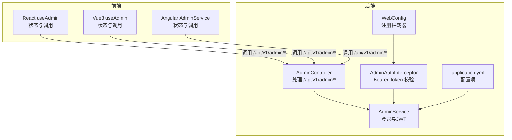
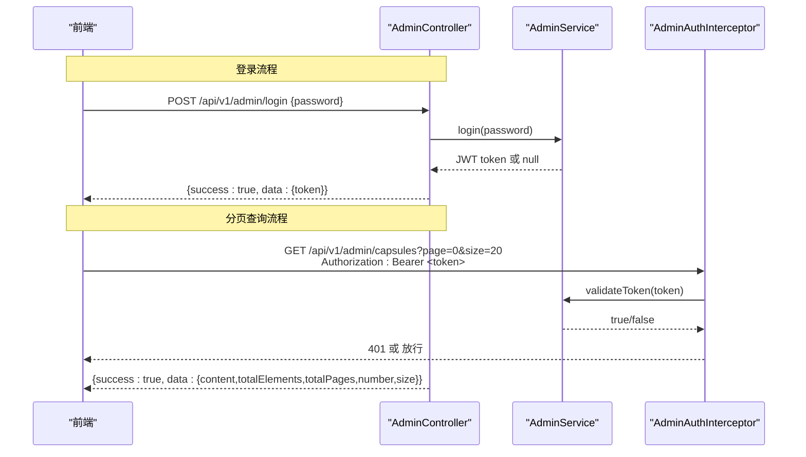
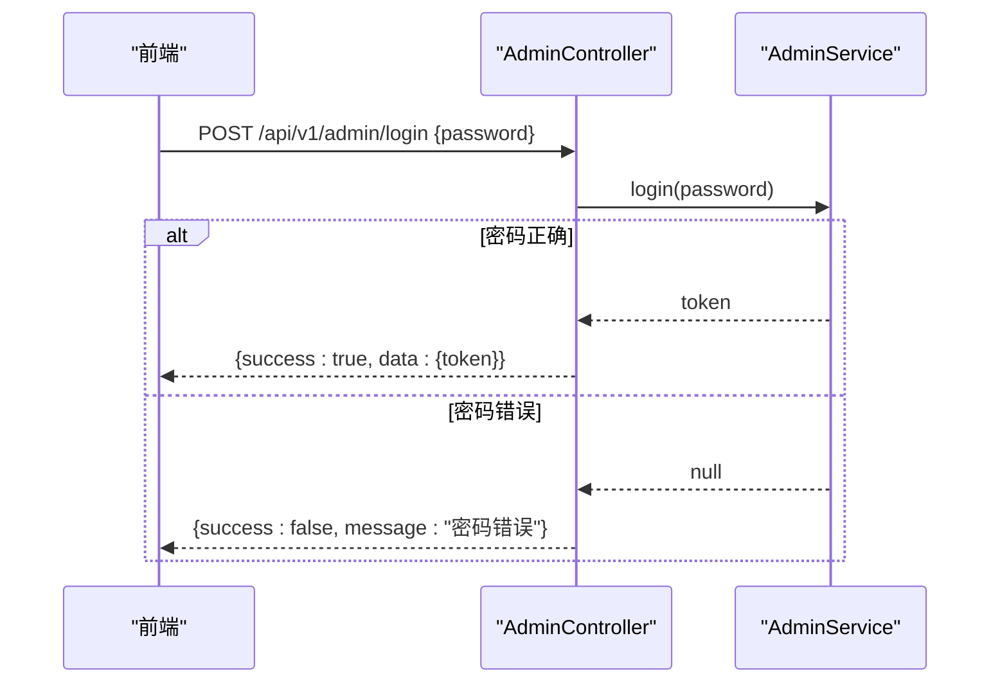
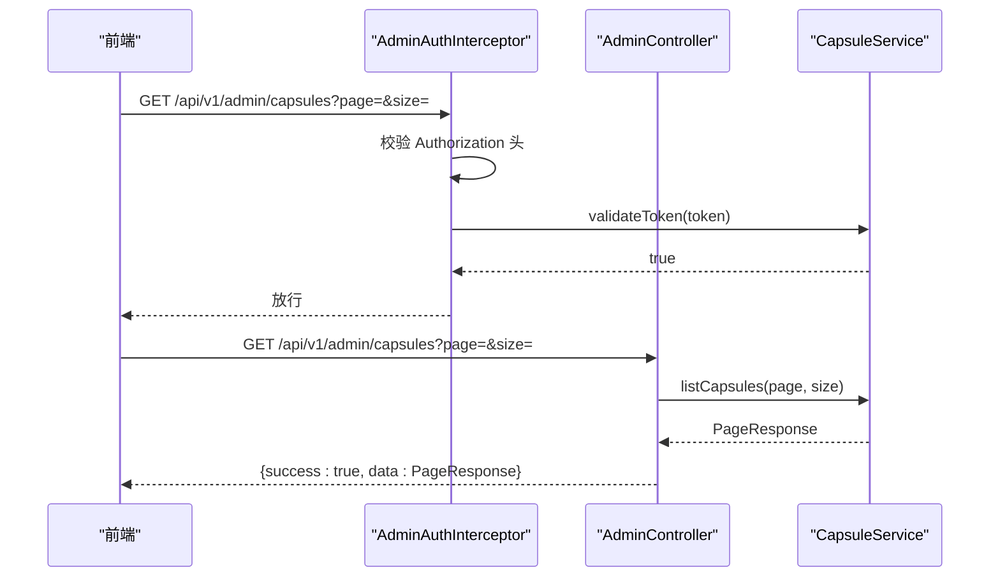
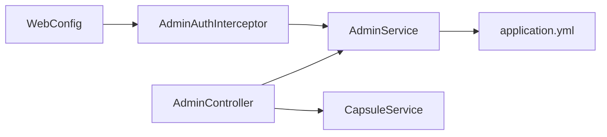

# 管理员接口

<cite>
**本文引用的文件**
- [AdminController.java](file://backends/spring-boot/src/main/java/com/hellotime/controller/AdminController.java)
- [AdminService.java](file://backends/spring-boot/src/main/java/com/hellotime/service/AdminService.java)
- [AdminAuthInterceptor.java](file://backends/spring-boot/src/main/java/com/hellotime/config/AdminAuthInterceptor.java)
- [WebConfig.java](file://backends/spring-boot/src/main/java/com/hellotime/config/WebConfig.java)
- [AdminLoginRequest.java](file://backends/spring-boot/src/main/java/com/hellotime/dto/AdminLoginRequest.java)
- [AdminTokenResponse.java](file://backends/spring-boot/src/main/java/com/hellotime/dto/AdminTokenResponse.java)
- [ApiResponse.java](file://backends/spring-boot/src/main/java/com/hellotime/dto/ApiResponse.java)
- [PageResponse.java](file://backends/spring-boot/src/main/java/com/hellotime/dto/PageResponse.java)
- [application.yml](file://backends/spring-boot/src/main/resources/application.yml)
- [openapi.yaml](file://spec/api/openapi.yaml)
- [AdminControllerTest.java](file://backends/spring-boot/src/test/java/com/hellotime/controller/AdminControllerTest.java)
- [useAdmin.ts（React）](file://frontends/react-ts/src/hooks/useAdmin.ts)
- [index.ts（React API）](file://frontends/react-ts/src/api/index.ts)
- [useAdmin.ts（Vue3）](file://frontends/vue3-ts/src/composables/useAdmin.ts)
- [admin.service.ts（Angular）](file://frontends/angular-ts/src/app/services/admin.service.ts)
</cite>

## 目录
1. [简介](#简介)
2. [项目结构](#项目结构)
3. [核心组件](#核心组件)
4. [架构总览](#架构总览)
5. [详细组件分析](#详细组件分析)
6. [依赖分析](#依赖分析)
7. [性能考虑](#性能考虑)
8. [故障排查指南](#故障排查指南)
9. [结论](#结论)
10. [附录](#附录)

## 简介
本文件面向管理员相关接口的综合文档，重点覆盖以下内容：
- /api/v1/admin 标签下的两个核心接口：POST /api/v1/admin/login（管理员登录）与 GET /api/v1/admin/capsules（分页查询所有胶囊）
- AdminLoginRequest 的密码验证机制与 JWT 令牌生成流程
- 分页查询参数 page（默认0）与 size（默认20）的作用与取值范围
- Bearer Token 认证机制的实现与安全考虑
- 完整的请求/响应示例（登录成功、未授权访问、分页查询等）
- SecurityScheme 配置与 JWT Bearer Token 的使用方法
- 不同前端框架（React/Vue3/Angular）的管理员 API 调用示例

## 项目结构
管理员接口位于 Spring Boot 后端，采用标准的分层架构：
- 控制器层：处理 HTTP 请求与响应
- 服务层：负责业务逻辑（登录、JWT、分页查询）
- 配置层：拦截器与跨域配置
- DTO 层：请求/响应数据模型
- 前端层：多框架示例（React/Vue3/Angular）

图表来源
- [AdminController.java:1-78](file://backends/spring-boot/src/main/java/com/hellotime/controller/AdminController.java#L1-L78)
- [AdminService.java:1-89](file://backends/spring-boot/src/main/java/com/hellotime/service/AdminService.java#L1-L89)
- [AdminAuthInterceptor.java:1-59](file://backends/spring-boot/src/main/java/com/hellotime/config/AdminAuthInterceptor.java#L1-L59)
- [WebConfig.java:1-32](file://backends/spring-boot/src/main/java/com/hellotime/config/WebConfig.java#L1-L32)
- [application.yml:1-22](file://backends/spring-boot/src/main/resources/application.yml#L1-L22)

章节来源
- [AdminController.java:1-78](file://backends/spring-boot/src/main/java/com/hellotime/controller/AdminController.java#L1-L78)
- [WebConfig.java:1-32](file://backends/spring-boot/src/main/java/com/hellotime/config/WebConfig.java#L1-L32)

## 核心组件
- 管理员控制器：提供登录与分页查询接口，并处理删除胶囊（扩展能力）
- 管理员服务：实现密码校验与 JWT 令牌生成/校验
- 管理员认证拦截器：统一校验 Authorization 头中的 Bearer Token
- Web 配置：注册拦截器并对 /api/v1/admin/** 生效
- DTO 与响应包装：统一请求/响应结构与分页模型
- 前端集成：多框架封装了登录、存储 Token、携带 Bearer Token 发起请求

章节来源
- [AdminController.java:31-77](file://backends/spring-boot/src/main/java/com/hellotime/controller/AdminController.java#L31-L77)
- [AdminService.java:46-87](file://backends/spring-boot/src/main/java/com/hellotime/service/AdminService.java#L46-L87)
- [AdminAuthInterceptor.java:24-57](file://backends/spring-boot/src/main/java/com/hellotime/config/AdminAuthInterceptor.java#L24-L57)
- [WebConfig.java:20-30](file://backends/spring-boot/src/main/java/com/hellotime/config/WebConfig.java#L20-L30)
- [ApiResponse.java:15-67](file://backends/spring-boot/src/main/java/com/hellotime/dto/ApiResponse.java#L15-L67)
- [PageResponse.java:5-25](file://backends/spring-boot/src/main/java/com/hellotime/dto/PageResponse.java#L5-L25)

## 架构总览
管理员接口的认证与授权流程如下：

图表来源
- [AdminController.java:39-62](file://backends/spring-boot/src/main/java/com/hellotime/controller/AdminController.java#L39-L62)
- [AdminService.java:53-87](file://backends/spring-boot/src/main/java/com/hellotime/service/AdminService.java#L53-L87)
- [AdminAuthInterceptor.java:34-57](file://backends/spring-boot/src/main/java/com/hellotime/config/AdminAuthInterceptor.java#L34-L57)

## 详细组件分析

### 登录接口：POST /api/v1/admin/login
- 功能：接收管理员密码，校验通过后返回 JWT 令牌
- 请求体：AdminLoginRequest（包含 password）
- 响应：统一包装 ApiResponse，data 为 AdminTokenResponse（包含 token）
- 失败：密码错误返回 401 与统一错误响应

图表来源
- [AdminController.java:39-46](file://backends/spring-boot/src/main/java/com/hellotime/controller/AdminController.java#L39-L46)
- [AdminService.java:53-66](file://backends/spring-boot/src/main/java/com/hellotime/service/AdminService.java#L53-L66)
- [AdminLoginRequest.java:5-12](file://backends/spring-boot/src/main/java/com/hellotime/dto/AdminLoginRequest.java#L5-L12)
- [AdminTokenResponse.java:3-12](file://backends/spring-boot/src/main/java/com/hellotime/dto/AdminTokenResponse.java#L3-L12)
- [ApiResponse.java:27-55](file://backends/spring-boot/src/main/java/com/hellotime/dto/ApiResponse.java#L27-L55)

章节来源
- [AdminController.java:39-46](file://backends/spring-boot/src/main/java/com/hellotime/controller/AdminController.java#L39-L46)
- [AdminService.java:53-66](file://backends/spring-boot/src/main/java/com/hellotime/service/AdminService.java#L53-L66)
- [AdminLoginRequest.java:5-12](file://backends/spring-boot/src/main/java/com/hellotime/dto/AdminLoginRequest.java#L5-L12)
- [AdminTokenResponse.java:3-12](file://backends/spring-boot/src/main/java/com/hellotime/dto/AdminTokenResponse.java#L3-L12)
- [ApiResponse.java:27-55](file://backends/spring-boot/src/main/java/com/hellotime/dto/ApiResponse.java#L27-L55)

### 分页查询接口：GET /api/v1/admin/capsules
- 功能：分页查询所有胶囊，需携带 Bearer Token
- 查询参数：
  - page：页码，默认 0，最小 0
  - size：每页大小，默认 20，建议范围 1-100（后端未强制限制，前端可按需约束）
- 响应：统一包装 ApiResponse，data 为 PageResponse<CapsuleResponse>

图表来源
- [AdminController.java:57-62](file://backends/spring-boot/src/main/java/com/hellotime/controller/AdminController.java#L57-L62)
- [AdminAuthInterceptor.java:34-57](file://backends/spring-boot/src/main/java/com/hellotime/config/AdminAuthInterceptor.java#L34-L57)
- [PageResponse.java:5-25](file://backends/spring-boot/src/main/java/com/hellotime/dto/PageResponse.java#L5-L25)

章节来源
- [AdminController.java:57-62](file://backends/spring-boot/src/main/java/com/hellotime/controller/AdminController.java#L57-L62)
- [AdminAuthInterceptor.java:34-57](file://backends/spring-boot/src/main/java/com/hellotime/config/AdminAuthInterceptor.java#L34-L57)
- [PageResponse.java:5-25](file://backends/spring-boot/src/main/java/com/hellotime/dto/PageResponse.java#L5-L25)

### 删除胶囊接口：DELETE /api/v1/admin/capsules/{code}
- 功能：删除指定胶囊（扩展能力）
- 路径参数：code（8 位胶囊码）
- 认证：需要 Bearer Token
- 响应：统一包装 ApiResponse

章节来源
- [AdminController.java:72-76](file://backends/spring-boot/src/main/java/com/hellotime/controller/AdminController.java#L72-L76)

### Bearer Token 认证机制与安全考虑
- 安全方案：HTTP Bearer Token（JWT），由 AdminAuthInterceptor 校验
- 校验步骤：
  1) 检查 Authorization 头是否存在且以 "Bearer " 开头
  2) 提取 Token 并调用 AdminService.validateToken
  3) validateToken 使用 HS256 密钥验证签名与过期时间
- 安全建议：
  - 仅在 HTTPS 下传输
  - 合理设置过期时间（默认 2 小时）
  - 前端妥善存储（sessionStorage），避免明文泄露
  - 服务端严格拦截 /api/v1/admin/** 且排除 /login

章节来源
- [AdminAuthInterceptor.java:34-57](file://backends/spring-boot/src/main/java/com/hellotime/config/AdminAuthInterceptor.java#L34-L57)
- [AdminService.java:75-87](file://backends/spring-boot/src/main/java/com/hellotime/service/AdminService.java#L75-L87)
- [WebConfig.java:26-29](file://backends/spring-boot/src/main/java/com/hellotime/config/WebConfig.java#L26-L29)

### JWT 令牌生成流程
- 密码验证：AdminService.login 比较配置中的管理员密码
- 令牌生成：使用 JJWT 构建，包含 subject、签发时间、过期时间与签名
- 密钥来源：application.yml 中的 app.jwt.secret（HS256）
- 过期时间：application.yml 中的 app.jwt.expiration-hours（小时）

章节来源
- [AdminService.java:35-44](file://backends/spring-boot/src/main/java/com/hellotime/service/AdminService.java#L35-L44)
- [AdminService.java:53-66](file://backends/spring-boot/src/main/java/com/hellotime/service/AdminService.java#L53-L66)
- [application.yml:16-22](file://backends/spring-boot/src/main/resources/application.yml#L16-L22)

### 分页参数说明
- page（默认0）：从 0 开始的页码
- size（默认20）：每页数量，建议 1-100
- 后端未做强制上限校验，前端可自行约束以避免过大请求

章节来源
- [AdminController.java:59-60](file://backends/spring-boot/src/main/java/com/hellotime/controller/AdminController.java#L59-L60)

### 统一响应与分页模型
- 统一响应：ApiResponse<T>，包含 success、data、message、errorCode
- 分页模型：PageResponse<T>，包含 content、totalElements、totalPages、number、size

章节来源
- [ApiResponse.java:15-67](file://backends/spring-boot/src/main/java/com/hellotime/dto/ApiResponse.java#L15-L67)
- [PageResponse.java:5-25](file://backends/spring-boot/src/main/java/com/hellotime/dto/PageResponse.java#L5-L25)

## 依赖分析
- 控制器依赖服务与胶囊服务
- 拦截器依赖服务进行 Token 校验
- Web 配置注册拦截器并对管理员路径生效
- DTO 与响应包装被控制器与服务广泛使用

图表来源
- [AdminController.java:20-29](file://backends/spring-boot/src/main/java/com/hellotime/controller/AdminController.java#L20-L29)
- [AdminAuthInterceptor.java:18-22](file://backends/spring-boot/src/main/java/com/hellotime/config/AdminAuthInterceptor.java#L18-L22)
- [WebConfig.java:14-18](file://backends/spring-boot/src/main/java/com/hellotime/config/WebConfig.java#L14-L18)
- [AdminService.java:35-44](file://backends/spring-boot/src/main/java/com/hellotime/service/AdminService.java#L35-L44)

章节来源
- [AdminController.java:20-29](file://backends/spring-boot/src/main/java/com/hellotime/controller/AdminController.java#L20-L29)
- [AdminAuthInterceptor.java:18-22](file://backends/spring-boot/src/main/java/com/hellotime/config/AdminAuthInterceptor.java#L18-L22)
- [WebConfig.java:14-18](file://backends/spring-boot/src/main/java/com/hellotime/config/WebConfig.java#L14-L18)
- [AdminService.java:35-44](file://backends/spring-boot/src/main/java/com/hellotime/service/AdminService.java#L35-L44)

## 性能考虑
- 分页查询建议前端控制 size，避免一次性拉取过多数据
- Token 校验为轻量级操作，HS256 解析开销较小
- 建议在网关或反向代理层开启压缩与缓存策略（如适用）

## 故障排查指南
- 401 未授权
  - 可能原因：缺少 Authorization 头、格式不正确、Token 无效或过期
  - 前端处理：检测错误信息，清空本地 token 并引导重新登录
- 登录失败
  - 可能原因：密码错误
  - 建议：确认密码与后端配置一致
- 分页查询为空
  - 可能原因：page/size 参数不当或数据库中无数据
  - 建议：调整 page/size 或检查数据

章节来源
- [AdminAuthInterceptor.java:44-52](file://backends/spring-boot/src/main/java/com/hellotime/config/AdminAuthInterceptor.java#L44-L52)
- [AdminControllerTest.java:68-82](file://backends/spring-boot/src/test/java/com/hellotime/controller/AdminControllerTest.java#L68-L82)

## 结论
管理员接口提供了简洁可靠的登录与管理能力，配合 Bearer Token 认证与统一响应模型，便于前端多框架集成。通过合理的分页参数与安全配置，可在保证易用性的同时兼顾安全性。

## 附录

### 请求/响应示例

- 登录成功
  - 请求
    - POST /api/v1/admin/login
    - Content-Type: application/json
    - Body: {"password":"<管理员密码>"}
  - 响应
    - 200 OK
    - Body: {"success":true,"data":{"token":"<JWT Token>"}}

- 未授权访问（缺少或无效 Token）
  - 请求
    - GET /api/v1/admin/capsules?page=0&size=20
    - Authorization: Bearer <无效/缺失Token>
  - 响应
    - 401 Unauthorized
    - Body: {"success":false,"message":"缺少认证令牌"/"认证令牌无效或已过期"}

- 分页查询成功
  - 请求
    - GET /api/v1/admin/capsules?page=0&size=20
    - Authorization: Bearer <有效Token>
  - 响应
    - 200 OK
    - Body: {"success":true,"data":{"content":[...],"totalElements":...,"totalPages":...,"number":0,"size":20}}

章节来源
- [AdminControllerTest.java:43-82](file://backends/spring-boot/src/test/java/com/hellotime/controller/AdminControllerTest.java#L43-L82)
- [openapi.yaml:75-131](file://spec/api/openapi.yaml#L75-L131)

### SecurityScheme 与 Bearer Token 使用
- SecurityScheme：BearerAuth（scheme: bearer, bearerFormat: JWT）
- 使用方式：在 Authorization 头中发送 "Bearer <token>"
- OpenAPI 描述见 openapi.yaml 中的 securitySchemes 与各管理员接口的 security 配置

章节来源
- [openapi.yaml:166-170](file://spec/api/openapi.yaml#L166-L170)
- [openapi.yaml:105-106](file://spec/api/openapi.yaml#L105-L106)
- [openapi.yaml:137-138](file://spec/api/openapi.yaml#L137-L138)

### 前端调用示例

- React（使用自定义 Hook）
  - 登录：调用 adminLogin(password)，成功后将 token 存入 sessionStorage
  - 分页查询：调用 getAdminCapsules(token, page, size)，并在请求头添加 Authorization: Bearer <token>
  - 删除胶囊：调用 deleteAdminCapsule(token, code)

- Vue3（使用 Composables）
  - 登录：调用 adminLogin(password)，成功后将 token 存入 sessionStorage
  - 分页查询：调用 getAdminCapsules(token, page)
  - 删除胶囊：调用 deleteAdminCapsule(token, code)

- Angular（使用 Service）
  - 登录：调用 adminLogin(password)，成功后将 token 存入 sessionStorage
  - 分页查询：调用 getAdminCapsules(token, page)
  - 删除胶囊：调用 deleteAdminCapsule(token, code)

章节来源
- [useAdmin.ts（React）:49-93](file://frontends/react-ts/src/hooks/useAdmin.ts#L49-L93)
- [index.ts（React API）:59-85](file://frontends/react-ts/src/api/index.ts#L59-L85)
- [useAdmin.ts（Vue3）:43-96](file://frontends/vue3-ts/src/composables/useAdmin.ts#L43-L96)
- [admin.service.ts（Angular）:27-82](file://frontends/angular-ts/src/app/services/admin.service.ts#L27-L82)