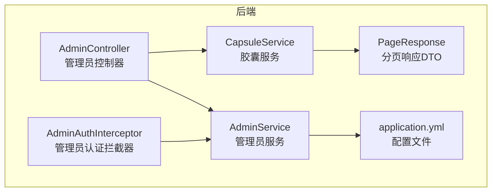
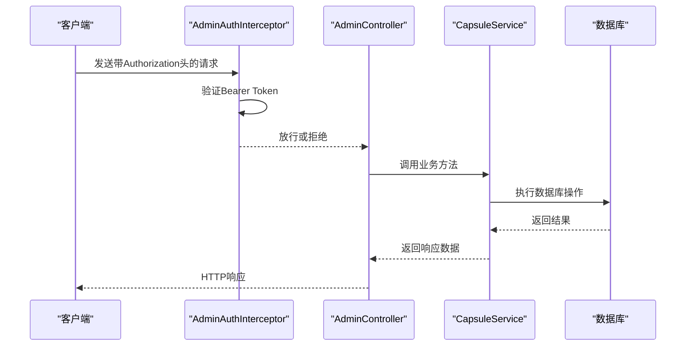
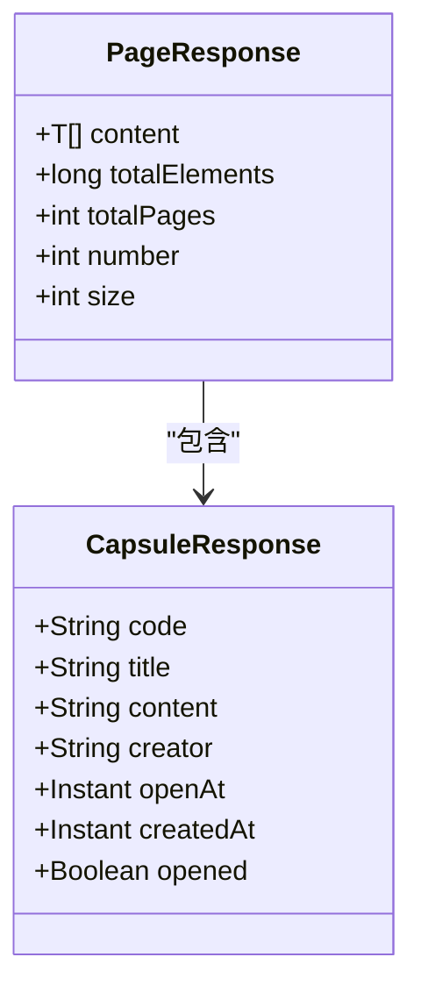
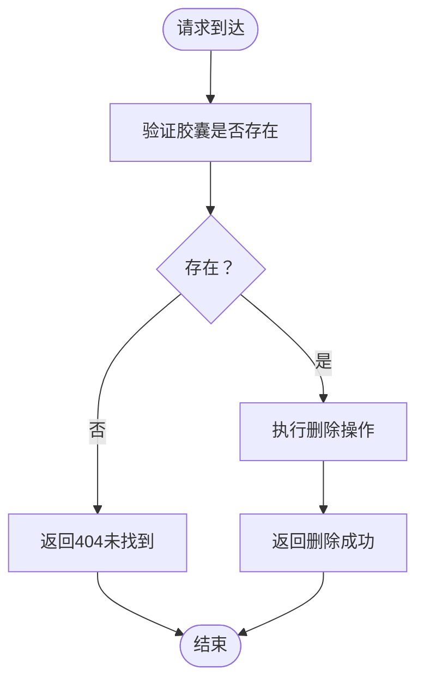
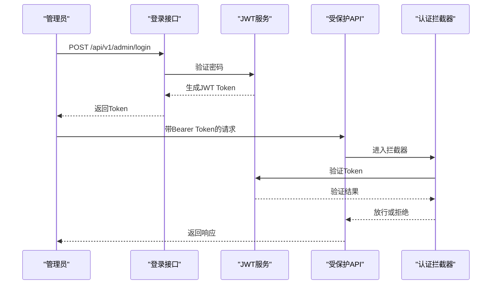
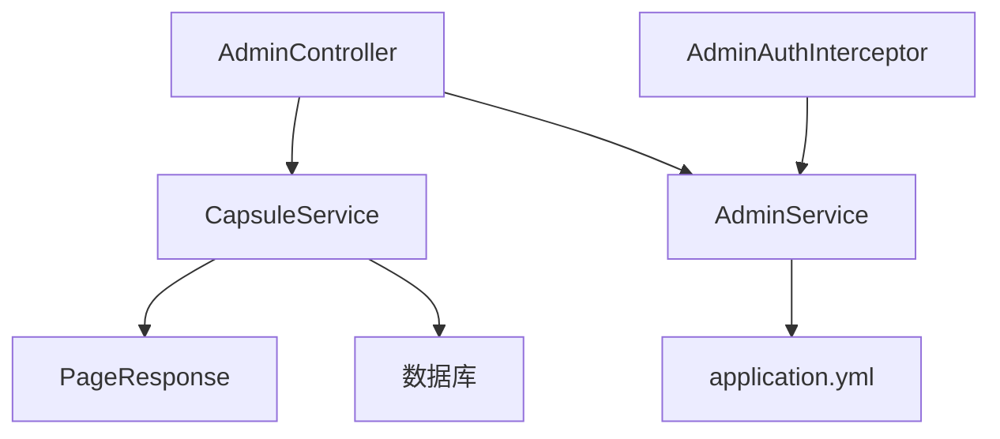

# 管理员管理接口

<cite>
**本文档引用的文件**
- [AdminController.java](file://backends/spring-boot/src/main/java/com/hellotime/controller/AdminController.java)
- [CapsuleService.java](file://backends/spring-boot/src/main/java/com/hellotime/service/CapsuleService.java)
- [AdminService.java](file://backends/spring-boot/src/main/java/com/hellotime/service/AdminService.java)
- [AdminAuthInterceptor.java](file://backends/spring-boot/src/main/java/com/hellotime/config/AdminAuthInterceptor.java)
- [PageResponse.java](file://backends/spring-boot/src/main/java/com/hellotime/dto/PageResponse.java)
- [application.yml](file://backends/spring-boot/src/main/resources/application.yml)
- [AdminControllerTest.java](file://backends/spring-boot/src/test/java/com/hellotime/controller/AdminControllerTest.java)
- [useAdmin.ts](file://frontends/vue3-ts/src/composables/useAdmin.ts)
</cite>

## 目录
1. [简介](#简介)
2. [项目结构](#项目结构)
3. [核心组件](#核心组件)
4. [架构概览](#架构概览)
5. [详细组件分析](#详细组件分析)
6. [依赖分析](#依赖分析)
7. [性能考虑](#性能考虑)
8. [故障排除指南](#故障排除指南)
9. [结论](#结论)
10. [附录](#附录)

## 简介
本文件详细说明管理员管理接口，包括：
- GET /api/v1/admin/capsules：分页查询所有胶囊
- DELETE /api/v1/admin/capsules/{code}：删除指定胶囊
- JWT认证与权限控制机制
- 分页查询参数与响应结构
- 删除机制与安全验证
- 前端框架调用示例
- 扩展功能说明（批量操作、条件筛选、数据导出）

## 项目结构
后端采用Spring Boot实现REST API，管理员接口位于独立的控制器中，配合拦截器进行JWT认证，服务层负责业务逻辑，DTO定义响应结构。



**图表来源**
- [AdminController.java:16-78](file://backends/spring-boot/src/main/java/com/hellotime/controller/AdminController.java#L16-L78)
- [AdminService.java:18-89](file://backends/spring-boot/src/main/java/com/hellotime/service/AdminService.java#L18-L89)
- [CapsuleService.java:22-195](file://backends/spring-boot/src/main/java/com/hellotime/service/CapsuleService.java#L22-L195)
- [AdminAuthInterceptor.java:15-59](file://backends/spring-boot/src/main/java/com/hellotime/config/AdminAuthInterceptor.java#L15-L59)
- [PageResponse.java:5-26](file://backends/spring-boot/src/main/java/com/hellotime/dto/PageResponse.java#L5-L26)
- [application.yml:16-22](file://backends/spring-boot/src/main/resources/application.yml#L16-L22)

**章节来源**
- [AdminController.java:16-78](file://backends/spring-boot/src/main/java/com/hellotime/controller/AdminController.java#L16-L78)
- [application.yml:1-22](file://backends/spring-boot/src/main/resources/application.yml#L1-L22)

## 核心组件
- 管理员控制器：提供登录、分页查询、删除等接口
- 管理员服务：处理JWT生成与验证
- 胶囊服务：实现分页查询、删除等业务逻辑
- 认证拦截器：统一验证Bearer Token
- 分页响应DTO：标准化分页数据结构

**章节来源**
- [AdminController.java:18-29](file://backends/spring-boot/src/main/java/com/hellotime/controller/AdminController.java#L18-L29)
- [AdminService.java:18-44](file://backends/spring-boot/src/main/java/com/hellotime/service/AdminService.java#L18-L44)
- [CapsuleService.java:22-38](file://backends/spring-boot/src/main/java/com/hellotime/service/CapsuleService.java#L22-L38)
- [AdminAuthInterceptor.java:15-22](file://backends/spring-boot/src/main/java/com/hellotime/config/AdminAuthInterceptor.java#L15-L22)
- [PageResponse.java:5-18](file://backends/spring-boot/src/main/java/com/hellotime/dto/PageResponse.java#L5-L18)

## 架构概览
管理员接口采用基于JWT的无状态认证，通过拦截器统一验证请求头中的Bearer Token。



**图表来源**
- [AdminAuthInterceptor.java:34-57](file://backends/spring-boot/src/main/java/com/hellotime/config/AdminAuthInterceptor.java#L34-L57)
- [AdminController.java:57-76](file://backends/spring-boot/src/main/java/com/hellotime/controller/AdminController.java#L57-L76)
- [CapsuleService.java:93-100](file://backends/spring-boot/src/main/java/com/hellotime/service/CapsuleService.java#L93-L100)

## 详细组件分析

### 接口定义与参数说明

#### GET /api/v1/admin/capsules
- 功能：分页查询所有胶囊
- 认证：需要Bearer Token
- 参数：
  - page：页码，默认值为0，取值范围≥0
  - size：每页大小，默认值为20，最大限制为服务端配置的上限
- 响应：PageResponse结构，包含content、totalElements、totalPages等字段

#### DELETE /api/v1/admin/capsules/{code}
- 功能：删除指定胶囊
- 认证：需要Bearer Token
- 路径参数：code（8位胶囊码）
- 响应：删除成功的通用响应结构

**章节来源**
- [AdminController.java:57-76](file://backends/spring-boot/src/main/java/com/hellotime/controller/AdminController.java#L57-L76)

### 分页查询接口详解

#### 参数配置
- page参数
  - 默认值：0
  - 取值范围：非负整数（≥0）
  - 语义：从第0页开始的页码
- size参数
  - 默认值：20
  - 最大限制：由服务端分页实现决定
  - 语义：每页返回的记录数量

#### 响应数据结构
分页响应对象包含以下字段：
- content：当前页的数据列表
- totalElements：总记录数
- totalPages：总页数
- number：当前页码（从0开始）
- size：每页大小



**图表来源**
- [PageResponse.java:5-26](file://backends/spring-boot/src/main/java/com/hellotime/dto/PageResponse.java#L5-L26)
- [CapsuleService.java:183-193](file://backends/spring-boot/src/main/java/com/hellotime/service/CapsuleService.java#L183-L193)

**章节来源**
- [PageResponse.java:5-26](file://backends/spring-boot/src/main/java/com/hellotime/dto/PageResponse.java#L5-L26)
- [CapsuleService.java:93-100](file://backends/spring-boot/src/main/java/com/hellotime/service/CapsuleService.java#L93-L100)

### 删除接口机制与安全验证

#### 删除流程


**图表来源**
- [CapsuleService.java:109-115](file://backends/spring-boot/src/main/java/com/hellotime/service/CapsuleService.java#L109-L115)

#### 安全验证机制
- 认证拦截器检查Authorization头格式
- 验证JWT签名和有效期
- 对OPTIONS预检请求放行
- 异常情况下返回401未授权

**章节来源**
- [AdminAuthInterceptor.java:34-57](file://backends/spring-boot/src/main/java/com/hellotime/config/AdminAuthInterceptor.java#L34-L57)
- [CapsuleService.java:109-115](file://backends/spring-boot/src/main/java/com/hellotime/service/CapsuleService.java#L109-L115)

### JWT认证与权限控制

#### 认证流程


**图表来源**
- [AdminService.java:53-66](file://backends/spring-boot/src/main/java/com/hellotime/service/AdminService.java#L53-L66)
- [AdminAuthInterceptor.java:34-57](file://backends/spring-boot/src/main/java/com/hellotime/config/AdminAuthInterceptor.java#L34-L57)

#### 配置参数
- 管理员密码：支持环境变量覆盖
- JWT密钥：用于HMAC-SHA256签名
- Token有效期：默认2小时

**章节来源**
- [AdminService.java:35-44](file://backends/spring-boot/src/main/java/com/hellotime/service/AdminService.java#L35-L44)
- [application.yml:16-22](file://backends/spring-boot/src/main/resources/application.yml#L16-L22)

### 请求响应示例

#### 分页查询所有胶囊
- 请求示例
  - GET /api/v1/admin/capsules?page=0&size=20
  - Authorization: Bearer YOUR_JWT_TOKEN
- 响应示例
  - 成功：HTTP 200，包含分页数据
  - 未授权：HTTP 401，缺少或无效的认证令牌

#### 删除指定胶囊
- 请求示例
  - DELETE /api/v1/admin/capsules/ABCDEF12
  - Authorization: Bearer YOUR_JWT_TOKEN
- 响应示例
  - 成功：HTTP 200，删除成功消息
  - 未找到：HTTP 404，胶囊不存在
  - 未授权：HTTP 401，认证失败

**章节来源**
- [AdminControllerTest.java:75-83](file://backends/spring-boot/src/test/java/com/hellotime/controller/AdminControllerTest.java#L75-L83)
- [AdminControllerTest.java:86-111](file://backends/spring-boot/src/test/java/com/hellotime/controller/AdminControllerTest.java#L86-L111)

### 前端框架调用示例

#### Vue 3 + TypeScript
使用组合式函数封装管理员功能：

```typescript
// 登录流程
async function login(password: string) {
  const res = await apiLogin(password)
  token.value = res.data.token
  sessionStorage.setItem('admin_token', res.data.token)
}

// 分页查询
async function fetchCapsules(page = 0) {
  const res = await getAdminCapsules(token.value, page)
  capsules.value = res.data.content
  pageInfo.value = {
    totalElements: res.data.totalElements,
    totalPages: res.data.totalPages,
    number: res.data.number,
    size: res.data.size,
  }
}

// 删除胶囊
async function deleteCapsule(code: string) {
  await deleteAdminCapsule(token.value, code)
  await fetchCapsules(pageInfo.value.number)
}
```

**章节来源**
- [useAdmin.ts:43-96](file://frontends/vue3-ts/src/composables/useAdmin.ts#L43-L96)
- [useAdmin.ts:104-116](file://frontends/vue3-ts/src/composables/useAdmin.ts#L104-L116)

### 扩展功能说明

#### 批量操作
- 批量删除：可扩展为接收code数组的DELETE接口
- 批量更新：可扩展为接收批量更新请求的PUT接口
- 注意：需在服务层添加事务管理和批量验证

#### 条件筛选
- 时间范围筛选：按openAt或createdAt过滤
- 状态筛选：按opened状态过滤
- 内容搜索：按title或creator模糊匹配
- 实现方式：在服务层添加相应的查询方法和Repository接口

#### 数据导出
- CSV导出：将分页数据转换为CSV格式
- Excel导出：支持多sheet导出
- 导出限制：建议添加导出条数上限防止性能问题
- 实现方式：新增导出控制器方法，使用Apache POI或类似库

## 依赖分析
管理员接口各组件之间的依赖关系如下：



**图表来源**
- [AdminController.java:20-29](file://backends/spring-boot/src/main/java/com/hellotime/controller/AdminController.java#L20-L29)
- [AdminAuthInterceptor.java:18-22](file://backends/spring-boot/src/main/java/com/hellotime/config/AdminAuthInterceptor.java#L18-L22)
- [CapsuleService.java:34-38](file://backends/spring-boot/src/main/java/com/hellotime/service/CapsuleService.java#L34-L38)

**章节来源**
- [AdminController.java:20-29](file://backends/spring-boot/src/main/java/com/hellotime/controller/AdminController.java#L20-L29)
- [AdminAuthInterceptor.java:18-22](file://backends/spring-boot/src/main/java/com/hellotime/config/AdminAuthInterceptor.java#L18-L22)
- [CapsuleService.java:34-38](file://backends/spring-boot/src/main/java/com/hellotime/service/CapsuleService.java#L34-L38)

## 性能考虑
- 分页查询：合理设置size参数，避免过大导致内存压力
- JWT验证：拦截器中进行签名验证，注意Token缓存策略
- 数据库查询：使用分页查询避免全表扫描
- 并发控制：删除操作使用事务确保数据一致性

## 故障排除指南
- 401未授权错误：检查Authorization头格式和Token有效性
- 404未找到：确认胶囊code是否正确，数据库中是否存在
- 500服务器错误：检查服务端日志，关注数据库连接和事务异常
- Token过期：重新登录获取新的JWT Token

**章节来源**
- [AdminAuthInterceptor.java:44-53](file://backends/spring-boot/src/main/java/com/hellotime/config/AdminAuthInterceptor.java#L44-L53)
- [AdminControllerTest.java:69-72](file://backends/spring-boot/src/test/java/com/hellotime/controller/AdminControllerTest.java#L69-L72)

## 结论
管理员管理接口提供了完整的胶囊管理能力，包括认证、查询、删除等功能。通过JWT实现无状态认证，配合拦截器统一验证，确保了接口的安全性。分页查询设计合理，支持灵活的参数配置。建议在生产环境中根据实际需求扩展批量操作、条件筛选和数据导出等高级功能。

## 附录

### API规范对照
- 基础URL：/api/v1/admin
- 认证方式：Bearer Token
- 默认分页：page=0, size=20
- Token有效期：2小时

### 配置参考
- 管理员密码：可通过环境变量覆盖
- JWT密钥：建议使用足够长度的随机密钥
- 数据库连接：SQLite数据库配置