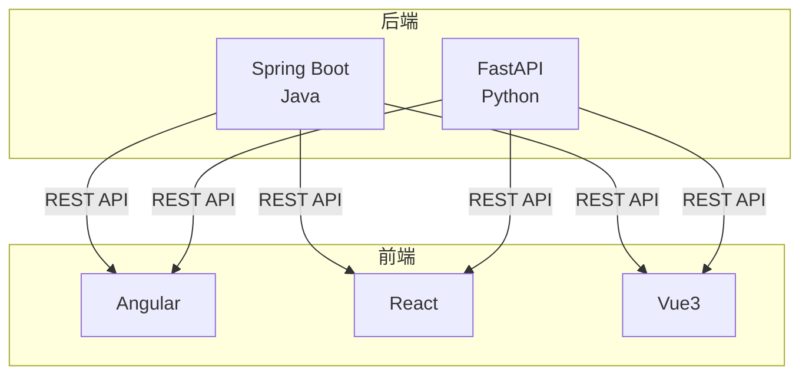
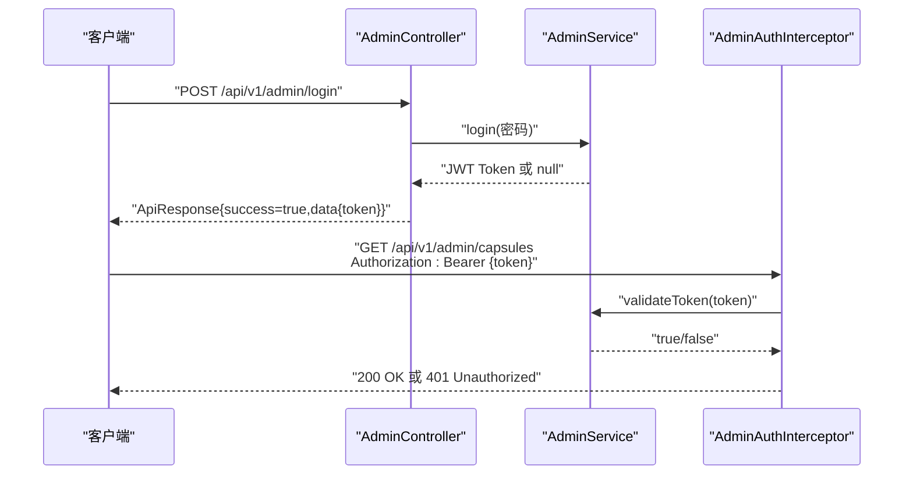
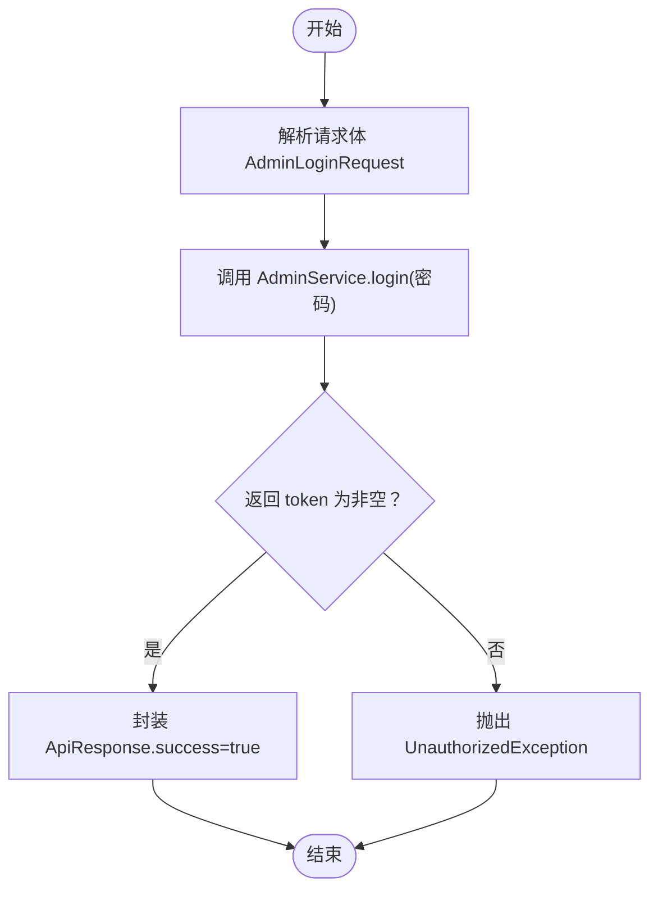
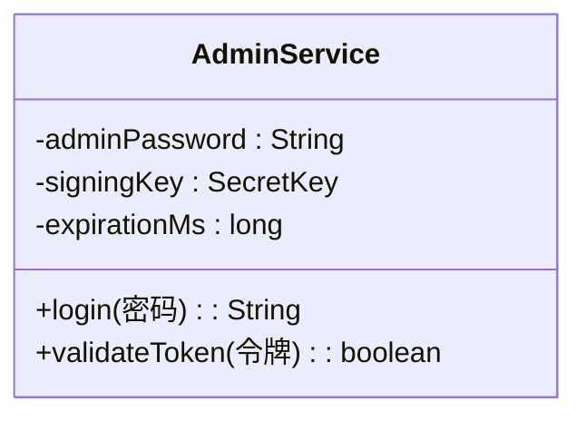
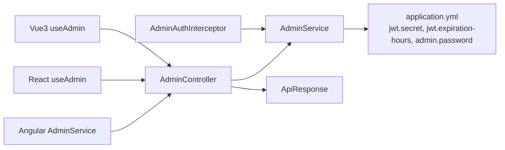

# 管理员认证接口

<cite>
**本文档引用的文件**
- [AdminController.java](file://backends/spring-boot/src/main/java/com/hellotime/controller/AdminController.java)
- [AdminService.java](file://backends/spring-boot/src/main/java/com/hellotime/service/AdminService.java)
- [AdminAuthInterceptor.java](file://backends/spring-boot/src/main/java/com/hellotime/config/AdminAuthInterceptor.java)
- [AdminLoginRequest.java](file://backends/spring-boot/src/main/java/com/hellotime/dto/AdminLoginRequest.java)
- [AdminTokenResponse.java](file://backends/spring-boot/src/main/java/com/hellotime/dto/AdminTokenResponse.java)
- [ApiResponse.java](file://backends/spring-boot/src/main/java/com/hellotime/dto/ApiResponse.java)
- [application.yml](file://backends/spring-boot/src/main/resources/application.yml)
- [AdminControllerTest.java](file://backends/spring-boot/src/test/java/com/hellotime/controller/AdminControllerTest.java)
- [openapi.yaml](file://spec/api/openapi.yaml)
- [admin.service.ts](file://frontends/angular-ts/src/app/services/admin.service.ts)
- [useAdmin.ts (React)](file://frontends/react-ts/src/hooks/useAdmin.ts)
- [useAdmin.ts (Vue3)](file://frontends/vue3-ts/src/composables/useAdmin.ts)
- [admin.py](file://backends/fastapi/app/routers/admin.py)
- [schemas.py](file://backends/fastapi/app/schemas.py)
</cite>

## 目录
1. [简介](#简介)
2. [项目结构](#项目结构)
3. [核心组件](#核心组件)
4. [架构总览](#架构总览)
5. [详细组件分析](#详细组件分析)
6. [依赖关系分析](#依赖关系分析)
7. [性能考量](#性能考量)
8. [故障排查指南](#故障排查指南)
9. [结论](#结论)
10. [附录](#附录)

## 简介
本文件面向管理员认证接口的实现与使用，重点覆盖以下内容：
- POST /api/v1/admin/login 端点的实现细节与行为
- AdminLoginRequest 的密码验证机制与安全考虑
- JWT 令牌的生成流程、过期时间与安全性保障
- 完整的请求/响应示例（成功登录返回 token 与 401 未授权错误）
- Bearer Token 认证头的设置方法与客户端使用方式
- SecurityScheme 配置中的 JWT Bearer Token 机制
- 不同前端框架的登录 API 调用示例与 token 存储最佳实践
- 密码加密存储、token 刷新机制与会话管理的安全建议

## 项目结构
后端采用 Spring Boot（Java）与 FastAPI（Python）双栈实现，OpenAPI 规范统一定义了接口契约与安全方案；前端提供 Angular、React、Vue3 三种实现。

**图表来源**
- [AdminController.java:39-46](file://backends/spring-boot/src/main/java/com/hellotime/controller/AdminController.java#L39-L46)
- [admin.py:25-30](file://backends/fastapi/app/routers/admin.py#L25-L30)

**章节来源**
- [openapi.yaml:75-98](file://spec/api/openapi.yaml#L75-L98)
- [application.yml:16-22](file://backends/spring-boot/src/main/resources/application.yml#L16-L22)

## 核心组件
- 管理员控制器：负责处理 /api/v1/admin/login 等管理员相关请求，并进行统一响应封装。
- 管理员服务：负责密码校验与 JWT 令牌的签发与验证。
- 认证拦截器：拦截需要管理员权限的请求，校验 Authorization 头中的 Bearer Token。
- DTO 与响应模型：定义登录请求体、令牌响应与统一 API 响应格式。
- 前端服务钩子：封装登录、登出、胶囊管理等业务逻辑，并持久化 token。

**章节来源**
- [AdminController.java:39-46](file://backends/spring-boot/src/main/java/com/hellotime/controller/AdminController.java#L39-L46)
- [AdminService.java:53-66](file://backends/spring-boot/src/main/java/com/hellotime/service/AdminService.java#L53-L66)
- [AdminAuthInterceptor.java:34-57](file://backends/spring-boot/src/main/java/com/hellotime/config/AdminAuthInterceptor.java#L34-L57)
- [ApiResponse.java:27-55](file://backends/spring-boot/src/main/java/com/hellotime/dto/ApiResponse.java#L27-L55)

## 架构总览
管理员认证的整体流程如下：
- 客户端向 /api/v1/admin/login 发送登录请求，携带密码
- 后端服务进行密码校验，通过则签发 JWT
- 返回统一响应结构，包含 token
- 后续访问受保护接口时，客户端在 Authorization 头中携带 Bearer Token
- 服务器通过拦截器解析并验证 Token，决定是否放行

**图表来源**
- [AdminController.java:39-46](file://backends/spring-boot/src/main/java/com/hellotime/controller/AdminController.java#L39-L46)
- [AdminService.java:53-66](file://backends/spring-boot/src/main/java/com/hellotime/service/AdminService.java#L53-L66)
- [AdminAuthInterceptor.java:34-57](file://backends/spring-boot/src/main/java/com/hellotime/config/AdminAuthInterceptor.java#L34-L57)

## 详细组件分析

### 管理员登录端点（POST /api/v1/admin/login）
- 接口职责：接收管理员密码，进行校验并通过则签发 JWT。
- 请求体：AdminLoginRequest（包含 password 字段）
- 响应体：ApiResponse<AdminTokenResponse>，其中 data.token 为 JWT
- 异常处理：密码错误时抛出未授权异常，返回 401

**图表来源**
- [AdminController.java:39-46](file://backends/spring-boot/src/main/java/com/hellotime/controller/AdminController.java#L39-L46)
- [AdminService.java:53-66](file://backends/spring-boot/src/main/java/com/hellotime/service/AdminService.java#L53-L66)

**章节来源**
- [AdminController.java:39-46](file://backends/spring-boot/src/main/java/com/hellotime/controller/AdminController.java#L39-L46)
- [AdminLoginRequest.java:5-12](file://backends/spring-boot/src/main/java/com/hellotime/dto/AdminLoginRequest.java#L5-L12)
- [AdminTokenResponse.java:3-12](file://backends/spring-boot/src/main/java/com/hellotime/dto/AdminTokenResponse.java#L3-L12)
- [ApiResponse.java:27-55](file://backends/spring-boot/src/main/java/com/hellotime/dto/ApiResponse.java#L27-L55)

### AdminLoginRequest 密码验证机制与安全考虑
- 输入校验：密码字段非空约束，防止空密码绕过
- 校验策略：服务层直接比较配置文件中的管理员密码与请求密码
- 安全建议：
  - 生产环境应使用哈希算法（如 bcrypt）存储密码，而非明文
  - 密码长度与复杂度策略应在服务层增强
  - 防暴力破解：引入速率限制与账户锁定机制

**章节来源**
- [AdminLoginRequest.java:7-8](file://backends/spring-boot/src/main/java/com/hellotime/dto/AdminLoginRequest.java#L7-L8)
- [AdminService.java:55-57](file://backends/spring-boot/src/main/java/com/hellotime/service/AdminService.java#L55-L57)

### JWT 令牌生成流程、过期时间与安全性
- 生成流程：
  - subject 设置为固定值（用于标识管理员身份）
  - 设置签发时间与过期时间（基于配置项）
  - 使用 HMAC-SHA256 签名密钥进行签名
- 过期时间：由配置项控制，默认 2 小时
- 安全性保障：
  - 使用强密钥（配置项提供）
  - 仅使用签名验证，不包含敏感信息
  - 建议配合 HTTPS 传输，防止中间人攻击

**图表来源**
- [AdminService.java:35-44](file://backends/spring-boot/src/main/java/com/hellotime/service/AdminService.java#L35-L44)
- [AdminService.java:53-66](file://backends/spring-boot/src/main/java/com/hellotime/service/AdminService.java#L53-L66)
- [AdminService.java:75-87](file://backends/spring-boot/src/main/java/com/hellotime/service/AdminService.java#L75-L87)

**章节来源**
- [AdminService.java:53-66](file://backends/spring-boot/src/main/java/com/hellotime/service/AdminService.java#L53-L66)
- [application.yml:19-21](file://backends/spring-boot/src/main/resources/application.yml#L19-L21)

### Bearer Token 认证头设置与客户端使用
- 设置方法：Authorization: Bearer <token>
- 客户端实践：
  - Angular：使用信号与 sessionStorage 持久化 token
  - React：使用 useSyncExternalStore 共享 token 状态
  - Vue3：使用 ref 与 sessionStorage 持久化 token
- 自动清理：当检测到认证失败时，前端自动清除 token 并重置状态

**章节来源**
- [admin.service.ts:27-46](file://frontends/angular-ts/src/app/services/admin.service.ts#L27-L46)
- [useAdmin.ts (React):49-67](file://frontends/react-ts/src/hooks/useAdmin.ts#L49-L67)
- [useAdmin.ts (Vue3):43-66](file://frontends/vue3-ts/src/composables/useAdmin.ts#L43-L66)

### SecurityScheme 配置（JWT Bearer Token）
- OpenAPI 中定义了 BearerAuth 类型的安全方案
- 管理员相关接口（分页查询、删除胶囊）声明使用该安全方案
- 客户端在调用这些接口时必须携带有效的 Bearer Token

**章节来源**
- [openapi.yaml:166-171](file://spec/api/openapi.yaml#L166-L171)
- [openapi.yaml:105-106](file://spec/api/openapi.yaml#L105-L106)
- [openapi.yaml:137-138](file://spec/api/openapi.yaml#L137-L138)

### 请求/响应示例

- 成功登录（200 OK）
  - 请求：POST /api/v1/admin/login
  - 请求体：{
      "password": "your-admin-password"
    }
  - 响应体：{
      "success": true,
      "data": {
        "token": "eyJhb...（JWT）"
      },
      "message": "登录成功"
    }

- 密码错误（401 Unauthorized）
  - 请求：POST /api/v1/admin/login
  - 请求体：{
      "password": "wrong-password"
    }
  - 响应体：{
      "success": false,
      "data": null,
      "message": "密码错误"
    }

- 受保护接口（携带 Bearer Token）
  - 请求：GET /api/v1/admin/capsules
  - 请求头：Authorization: Bearer eyJhb...
  - 响应：200 OK，包含分页胶囊数据

- 未携带或无效 Token（401 Unauthorized）
  - 请求：GET /api/v1/admin/capsules
  - 请求头：Authorization: Bearer invalid-token
  - 响应：401 Unauthorized，message 为“认证令牌无效或已过期”

**章节来源**
- [AdminControllerTest.java:44-66](file://backends/spring-boot/src/test/java/com/hellotime/controller/AdminControllerTest.java#L44-L66)
- [AdminControllerTest.java:68-83](file://backends/spring-boot/src/test/java/com/hellotime/controller/AdminControllerTest.java#L68-L83)
- [AdminControllerTest.java:85-111](file://backends/spring-boot/src/test/java/com/hellotime/controller/AdminControllerTest.java#L85-L111)

### FastAPI 实现对比
- 路由定义：/api/v1/admin/login 使用 Pydantic 模型 AdminLoginRequest
- 服务层：调用 admin_service.login(request.password)，返回 ApiResponse[AdminTokenResponse]
- 行为与 Spring Boot 一致：密码错误返回未授权异常

**章节来源**
- [admin.py:25-30](file://backends/fastapi/app/routers/admin.py#L25-L30)
- [schemas.py:47-49](file://backends/fastapi/app/schemas.py#L47-L49)
- [schemas.py:67-69](file://backends/fastapi/app/schemas.py#L67-L69)

## 依赖关系分析

**图表来源**
- [AdminController.java:39-46](file://backends/spring-boot/src/main/java/com/hellotime/controller/AdminController.java#L39-L46)
- [AdminService.java:35-44](file://backends/spring-boot/src/main/java/com/hellotime/service/AdminService.java#L35-L44)
- [AdminAuthInterceptor.java:18-22](file://backends/spring-boot/src/main/java/com/hellotime/config/AdminAuthInterceptor.java#L18-L22)
- [application.yml:16-22](file://backends/spring-boot/src/main/resources/application.yml#L16-L22)

**章节来源**
- [AdminController.java:20-29](file://backends/spring-boot/src/main/java/com/hellotime/controller/AdminController.java#L20-L29)
- [AdminAuthInterceptor.java:18-22](file://backends/spring-boot/src/main/java/com/hellotime/config/AdminAuthInterceptor.java#L18-L22)

## 性能考量
- Token 生成与验证均为内存计算，开销极低
- 建议：
  - 控制 Token 过期时间以平衡安全与用户体验
  - 对频繁访问的受保护接口启用缓存（注意与认证状态的协调）

## 故障排查指南
- 登录返回 401：
  - 检查密码是否正确
  - 确认服务端配置的管理员密码与请求一致
- 受保护接口返回 401：
  - 检查 Authorization 头格式是否为 “Bearer <token>”
  - 验证 Token 是否过期或被篡改
  - 确认服务端 JWT 密钥与客户端一致
- 前端自动登出：
  - 当检测到认证异常时，前端会自动清除 token 并清空状态，需重新登录

**章节来源**
- [AdminControllerTest.java:56-72](file://backends/spring-boot/src/test/java/com/hellotime/controller/AdminControllerTest.java#L56-L72)
- [AdminAuthInterceptor.java:44-53](file://backends/spring-boot/src/main/java/com/hellotime/config/AdminAuthInterceptor.java#L44-L53)
- [useAdmin.ts (React):84-87](file://backends/spring-boot/src/test/java/com/hellotime/controller/AdminControllerTest.java#L84-L87)

## 结论
本认证体系以简单直接的方式实现了管理员登录与受保护接口访问。Spring Boot 与 FastAPI 双栈实现确保了跨语言兼容性，OpenAPI 统一了接口契约与安全方案。生产环境中建议强化密码存储与传输安全，并考虑引入更完善的会话与令牌刷新机制。

## 附录

### 前端框架登录 API 调用示例与最佳实践
- Angular
  - 使用 AdminService.login(password) 完成登录
  - 登录成功后将 token 写入 sessionStorage，并更新全局状态
  - 访问受保护接口时在请求头添加 Authorization: Bearer <token>
- React
  - 使用 useAdmin().login(password) 完成登录
  - 通过 useSyncExternalStore 共享 token 状态，自动触发 UI 更新
  - 登录成功后写入 sessionStorage，失败时捕获异常并提示
- Vue3
  - 使用 useAdmin().login(password) 完成登录
  - 将 token 写入 sessionStorage，提供 computed 属性判断登录状态
  - 访问受保护接口时在请求头添加 Authorization: Bearer <token>

**章节来源**
- [admin.service.ts:27-46](file://frontends/angular-ts/src/app/services/admin.service.ts#L27-L46)
- [useAdmin.ts (React):49-67](file://frontends/react-ts/src/hooks/useAdmin.ts#L49-L67)
- [useAdmin.ts (Vue3):43-66](file://frontends/vue3-ts/src/composables/useAdmin.ts#L43-L66)

### 安全建议
- 密码加密存储：使用强哈希算法（如 bcrypt）存储管理员密码
- 传输安全：强制使用 HTTPS，防止明文传输
- Token 管理：短有效期、支持刷新、撤销机制（可选）
- 速率限制：防暴力破解与自动化攻击
- 最小权限：仅授予必要接口访问权限