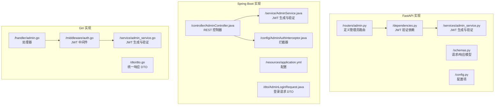
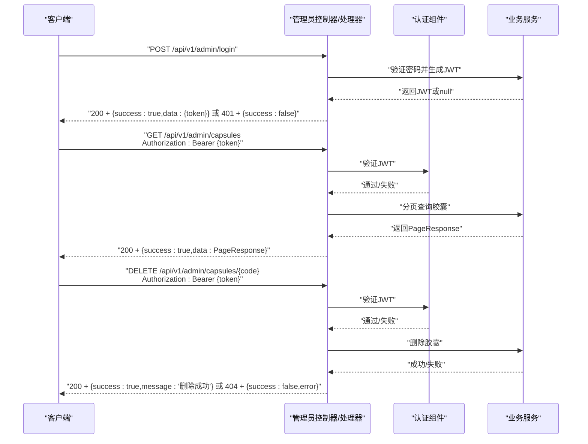
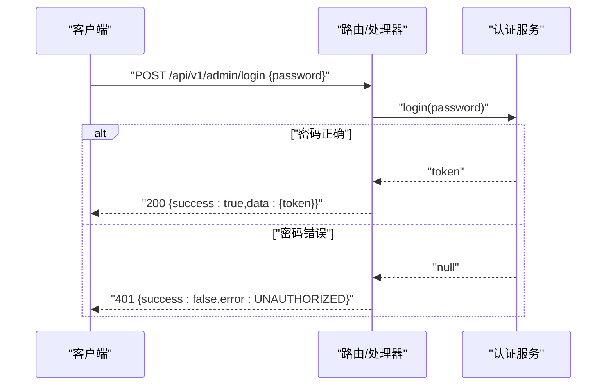
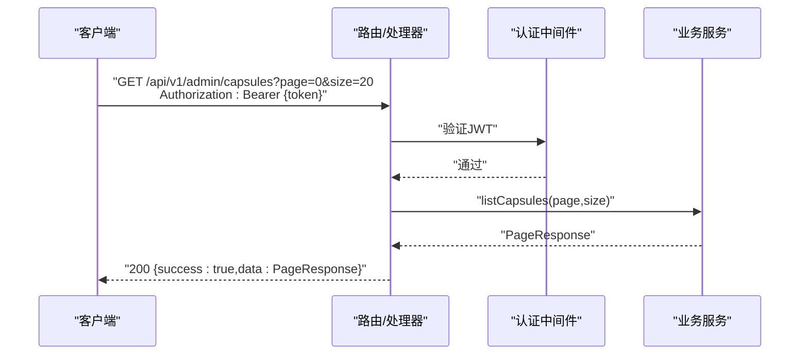
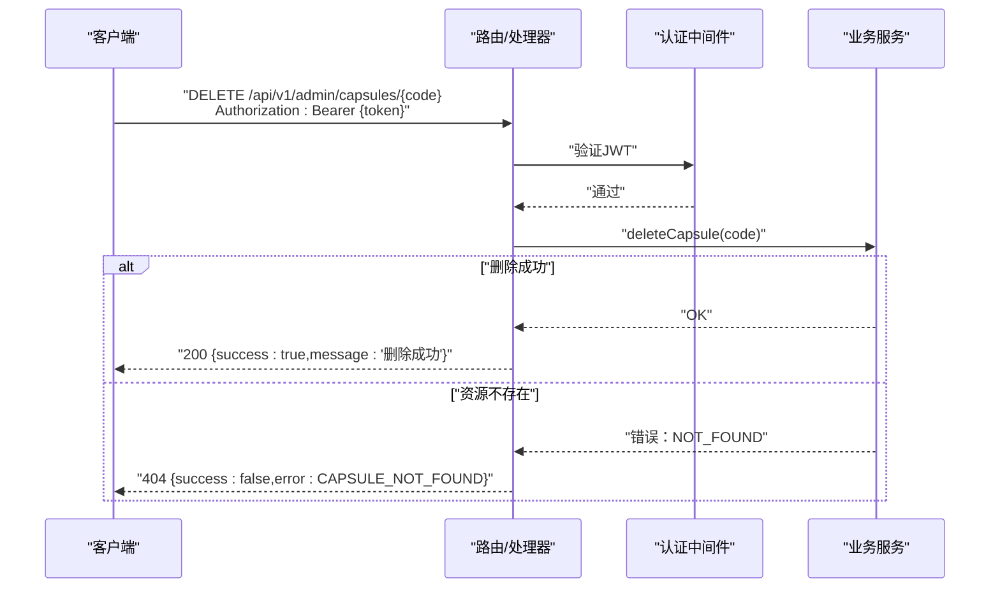
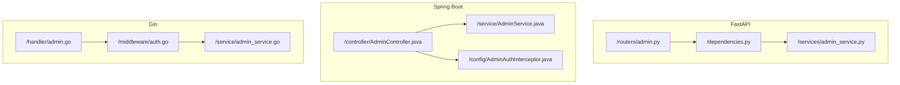

# 管理员API端点

<cite>
**本文档引用的文件**
- [backends/fastapi/app/routers/admin.py](file://backends/fastapi/app/routers/admin.py)
- [backends/fastapi/app/dependencies.py](file://backends/fastapi/app/dependencies.py)
- [backends/fastapi/app/services/admin_service.py](file://backends/fastapi/app/services/admin_service.py)
- [backends/fastapi/app/schemas.py](file://backends/fastapi/app/schemas.py)
- [backends/fastapi/app/config.py](file://backends/fastapi/app/config.py)
- [backends/fastapi/tests/test_admin_api.py](file://backends/fastapi/tests/test_admin_api.py)
- [backends/spring-boot/src/main/java/com/hellotime/controller/AdminController.java](file://backends/spring-boot/src/main/java/com/hellotime/controller/AdminController.java)
- [backends/spring-boot/src/main/java/com/hellotime/service/AdminService.java](file://backends/spring-boot/src/main/java/com/hellotime/service/AdminService.java)
- [backends/spring-boot/src/main/java/com/hellotime/config/AdminAuthInterceptor.java](file://backends/spring-boot/src/main/java/com/hellotime/config/AdminAuthInterceptor.java)
- [backends/spring-boot/src/main/java/com/hellotime/dto/AdminLoginRequest.java](file://backends/spring-boot/src/main/java/com/hellotime/dto/AdminLoginRequest.java)
- [backends/spring-boot/src/main/resources/application.yml](file://backends/spring-boot/src/main/resources/application.yml)
- [backends/spring-boot/src/test/java/com/hellotime/controller/AdminControllerTest.java](file://backends/spring-boot/src/test/java/com/hellotime/controller/AdminControllerTest.java)
- [backends/gin/handler/admin.go](file://backends/gin/handler/admin.go)
- [backends/gin/middleware/auth.go](file://backends/gin/middleware/auth.go)
- [backends/gin/service/admin_service.go](file://backends/gin/service/admin_service.go)
- [backends/gin/dto/dto.go](file://backends/gin/dto/dto.go)
- [backends/gin/tests/admin_test.go](file://backends/gin/tests/admin_test.go)
</cite>

## 目录
1. [简介](#简介)
2. [项目结构](#项目结构)
3. [核心组件](#核心组件)
4. [架构概览](#架构概览)
5. [详细组件分析](#详细组件分析)
6. [依赖分析](#依赖分析)
7. [性能考虑](#性能考虑)
8. [故障排除指南](#故障排除指南)
9. [结论](#结论)

## 简介
本文件针对 HelloTime 项目的管理员 API 端点进行系统性文档化，重点覆盖以下三个接口：
- 管理员登录：/api/v1/admin/login（POST）
- 分页查询胶囊：/api/v1/admin/capsules（GET）
- 删除胶囊：/api/v1/admin/capsules/{code}（DELETE）

文档将详细说明 JWT 认证机制（Authorization 头格式、Token 管理）、分页查询参数（page 和 size 的作用与限制）、删除操作的安全验证机制，并提供认证失败、权限不足、资源不存在等错误场景的完整请求/响应示例。最后给出管理员操作的最佳实践与安全注意事项。

## 项目结构
HelloTime 提供了三种后端实现（FastAPI、Spring Boot、Gin），但管理员 API 的核心行为在各实现中保持一致：登录生成 JWT，后续接口通过 Bearer Token 认证，分页查询支持 page/size 参数，删除操作基于胶囊码进行安全验证。

**图表来源**
- [backends/fastapi/app/routers/admin.py:1-55](file://backends/fastapi/app/routers/admin.py#L1-L55)
- [backends/fastapi/app/dependencies.py:1-23](file://backends/fastapi/app/dependencies.py#L1-L23)
- [backends/fastapi/app/services/admin_service.py:1-42](file://backends/fastapi/app/services/admin_service.py#L1-L42)
- [backends/spring-boot/src/main/java/com/hellotime/controller/AdminController.java:1-79](file://backends/spring-boot/src/main/java/com/hellotime/controller/AdminController.java#L1-L79)
- [backends/spring-boot/src/main/java/com/hellotime/service/AdminService.java:1-89](file://backends/spring-boot/src/main/java/com/hellotime/service/AdminService.java#L1-L89)
- [backends/spring-boot/src/main/java/com/hellotime/config/AdminAuthInterceptor.java:1-59](file://backends/spring-boot/src/main/java/com/hellotime/config/AdminAuthInterceptor.java#L1-L59)
- [backends/gin/handler/admin.go:1-77](file://backends/gin/handler/admin.go#L1-L77)
- [backends/gin/middleware/auth.go:1-37](file://backends/gin/middleware/auth.go#L1-L37)
- [backends/gin/service/admin_service.go:1-47](file://backends/gin/service/admin_service.go#L1-L47)

**章节来源**
- [backends/fastapi/app/routers/admin.py:1-55](file://backends/fastapi/app/routers/admin.py#L1-L55)
- [backends/spring-boot/src/main/java/com/hellotime/controller/AdminController.java:1-79](file://backends/spring-boot/src/main/java/com/hellotime/controller/AdminController.java#L1-L79)
- [backends/gin/handler/admin.go:1-77](file://backends/gin/handler/admin.go#L1-L77)

## 核心组件
- 管理员登录接口负责验证管理员密码并签发 JWT。三套实现均支持相同请求体结构（password），返回统一的响应模型（success/data/message/errorCode）。
- 分页查询接口支持 page（默认 0，>=0）和 size（默认 20，1-100）参数，返回 PageResponse 结构（content/totalElements/totalPages/number/size）。
- 删除接口以胶囊码为路径参数，执行删除并返回成功消息；若资源不存在则返回相应错误码。

**章节来源**
- [backends/fastapi/app/routers/admin.py:25-54](file://backends/fastapi/app/routers/admin.py#L25-L54)
- [backends/spring-boot/src/main/java/com/hellotime/controller/AdminController.java:41-78](file://backends/spring-boot/src/main/java/com/hellotime/controller/AdminController.java#L41-L78)
- [backends/gin/handler/admin.go:20-76](file://backends/gin/handler/admin.go#L20-L76)
- [backends/fastapi/app/schemas.py:71-96](file://backends/fastapi/app/schemas.py#L71-L96)
- [backends/spring-boot/src/main/java/com/hellotime/dto/AdminLoginRequest.java:11-14](file://backends/spring-boot/src/main/java/com/hellotime/dto/AdminLoginRequest.java#L11-L14)
- [backends/gin/dto/dto.go:46-77](file://backends/gin/dto/dto.go#L46-L77)

## 架构概览
管理员 API 的认证与授权流程在三套实现中保持一致：登录阶段不需认证，后续所有管理员接口均需携带 Bearer Token。认证失败或过期将统一返回 401/403 等错误。

**图表来源**
- [backends/fastapi/app/routers/admin.py:25-54](file://backends/fastapi/app/routers/admin.py#L25-L54)
- [backends/fastapi/app/dependencies.py:10-22](file://backends/fastapi/app/dependencies.py#L10-L22)
- [backends/fastapi/app/services/admin_service.py:18-41](file://backends/fastapi/app/services/admin_service.py#L18-L41)
- [backends/spring-boot/src/main/java/com/hellotime/controller/AdminController.java:41-78](file://backends/spring-boot/src/main/java/com/hellotime/controller/AdminController.java#L41-L78)
- [backends/spring-boot/src/main/java/com/hellotime/config/AdminAuthInterceptor.java:34-57](file://backends/spring-boot/src/main/java/com/hellotime/config/AdminAuthInterceptor.java#L34-L57)
- [backends/gin/handler/admin.go:20-76](file://backends/gin/handler/admin.go#L20-L76)
- [backends/gin/middleware/auth.go:15-36](file://backends/gin/middleware/auth.go#L15-L36)

## 详细组件分析

### 管理员登录接口
- 接口：POST /api/v1/admin/login
- 请求体：password（字符串，必填）
- 成功响应：包含 token 的 data 字段
- 失败响应：错误码 UNAUTHORIZED（密码错误）

**图表来源**
- [backends/fastapi/app/routers/admin.py:25-30](file://backends/fastapi/app/routers/admin.py#L25-L30)
- [backends/fastapi/app/services/admin_service.py:18-32](file://backends/fastapi/app/services/admin_service.py#L18-L32)
- [backends/spring-boot/src/main/java/com/hellotime/controller/AdminController.java:41-47](file://backends/spring-boot/src/main/java/com/hellotime/controller/AdminController.java#L41-L47)
- [backends/spring-boot/src/main/java/com/hellotime/service/AdminService.java:53-66](file://backends/spring-boot/src/main/java/com/hellotime/service/AdminService.java#L53-L66)
- [backends/gin/handler/admin.go:20-35](file://backends/gin/handler/admin.go#L20-L35)
- [backends/gin/service/admin_service.go:12-32](file://backends/gin/service/admin_service.go#L12-L32)

**章节来源**
- [backends/fastapi/app/routers/admin.py:25-30](file://backends/fastapi/app/routers/admin.py#L25-L30)
- [backends/fastapi/app/services/admin_service.py:18-32](file://backends/fastapi/app/services/admin_service.py#L18-L32)
- [backends/spring-boot/src/main/java/com/hellotime/controller/AdminController.java:41-47](file://backends/spring-boot/src/main/java/com/hellotime/controller/AdminController.java#L41-L47)
- [backends/spring-boot/src/main/java/com/hellotime/service/AdminService.java:53-66](file://backends/spring-boot/src/main/java/com/hellotime/service/AdminService.java#L53-L66)
- [backends/gin/handler/admin.go:20-35](file://backends/gin/handler/admin.go#L20-L35)
- [backends/gin/service/admin_service.go:12-32](file://backends/gin/service/admin_service.go#L12-L32)

### 分页查询胶囊接口
- 接口：GET /api/v1/admin/capsules
- 认证：需要 Bearer Token
- 查询参数：
  - page：页码，默认 0，最小 0
  - size：每页数量，默认 20，最小 1，最大 100
- 响应：PageResponse（content/totalElements/totalPages/number/size）

**图表来源**
- [backends/fastapi/app/routers/admin.py:33-44](file://backends/fastapi/app/routers/admin.py#L33-L44)
- [backends/fastapi/app/dependencies.py:10-22](file://backends/fastapi/app/dependencies.py#L10-L22)
- [backends/spring-boot/src/main/java/com/hellotime/controller/AdminController.java:59-64](file://backends/spring-boot/src/main/java/com/hellotime/controller/AdminController.java#L59-L64)
- [backends/gin/handler/admin.go:37-59](file://backends/gin/handler/admin.go#L37-L59)

**章节来源**
- [backends/fastapi/app/routers/admin.py:33-44](file://backends/fastapi/app/routers/admin.py#L33-L44)
- [backends/spring-boot/src/main/java/com/hellotime/controller/AdminController.java:59-64](file://backends/spring-boot/src/main/java/com/hellotime/controller/AdminController.java#L59-L64)
- [backends/gin/handler/admin.go:37-59](file://backends/gin/handler/admin.go#L37-L59)

### 删除胶囊接口
- 接口：DELETE /api/v1/admin/capsules/{code}
- 认证：需要 Bearer Token
- 路径参数：code（8 位胶囊码）
- 响应：删除成功的消息；若资源不存在返回 404

**图表来源**
- [backends/fastapi/app/routers/admin.py:47-54](file://backends/fastapi/app/routers/admin.py#L47-L54)
- [backends/spring-boot/src/main/java/com/hellotime/controller/AdminController.java:74-78](file://backends/spring-boot/src/main/java/com/hellotime/controller/AdminController.java#L74-L78)
- [backends/gin/handler/admin.go:61-76](file://backends/gin/handler/admin.go#L61-L76)

**章节来源**
- [backends/fastapi/app/routers/admin.py:47-54](file://backends/fastapi/app/routers/admin.py#L47-L54)
- [backends/spring-boot/src/main/java/com/hellotime/controller/AdminController.java:74-78](file://backends/spring-boot/src/main/java/com/hellotime/controller/AdminController.java#L74-L78)
- [backends/gin/handler/admin.go:61-76](file://backends/gin/handler/admin.go#L61-L76)

## 依赖分析
- FastAPI：路由层依赖 JWT 验证依赖（Header 提取 Bearer Token 并调用验证函数），业务层依赖数据库会话。
- Spring Boot：控制器依赖服务层；拦截器在进入控制器前统一验证 Authorization 头。
- Gin：处理器依赖中间件进行 JWT 验证，服务层负责业务逻辑。

**图表来源**
- [backends/fastapi/app/routers/admin.py:1-55](file://backends/fastapi/app/routers/admin.py#L1-L55)
- [backends/fastapi/app/dependencies.py:1-23](file://backends/fastapi/app/dependencies.py#L1-L23)
- [backends/fastapi/app/services/admin_service.py:1-42](file://backends/fastapi/app/services/admin_service.py#L1-L42)
- [backends/spring-boot/src/main/java/com/hellotime/controller/AdminController.java:1-79](file://backends/spring-boot/src/main/java/com/hellotime/controller/AdminController.java#L1-L79)
- [backends/spring-boot/src/main/java/com/hellotime/config/AdminAuthInterceptor.java:1-59](file://backends/spring-boot/src/main/java/com/hellotime/config/AdminAuthInterceptor.java#L1-L59)
- [backends/gin/handler/admin.go:1-77](file://backends/gin/handler/admin.go#L1-L77)
- [backends/gin/middleware/auth.go:1-37](file://backends/gin/middleware/auth.go#L1-L37)

**章节来源**
- [backends/fastapi/app/routers/admin.py:1-55](file://backends/fastapi/app/routers/admin.py#L1-L55)
- [backends/spring-boot/src/main/java/com/hellotime/controller/AdminController.java:1-79](file://backends/spring-boot/src/main/java/com/hellotime/controller/AdminController.java#L1-L79)
- [backends/gin/handler/admin.go:1-77](file://backends/gin/handler/admin.go#L1-L77)

## 性能考虑
- JWT 验证开销极小，主要成本在数据库查询（分页查询）。建议合理设置 page/size，避免超大分页导致查询延迟。
- Token 默认有效期为 2 小时，建议生产环境缩短有效期并启用刷新机制（如需）。
- Spring Boot 使用虚拟线程（Java 21+），可提升高并发下的吞吐量。

[本节为通用指导，无需特定文件引用]

## 故障排除指南
常见错误场景与处理建议：

- 认证失败（密码错误）
  - 现象：登录接口返回 401，error_code 为 UNAUTHORIZED
  - 处理：确认 password 是否正确
  - 参考测试用例验证行为
  - **章节来源**
    - [backends/fastapi/tests/test_admin_api.py:22-29](file://backends/fastapi/tests/test_admin_api.py#L22-L29)
    - [backends/spring-boot/src/test/java/com/hellotime/controller/AdminControllerTest.java:58-67](file://backends/spring-boot/src/test/java/com/hellotime/controller/AdminControllerTest.java#L58-L67)
    - [backends/gin/tests/admin_test.go:59-84](file://backends/gin/tests/admin_test.go#L59-L84)

- 权限不足（缺少或无效 Token）
  - 现象：访问受保护接口返回 401
  - 处理：确保 Authorization 头格式为 "Bearer {token}"，且 token 未过期
  - 参考认证中间件/拦截器逻辑
  - **章节来源**
    - [backends/fastapi/app/dependencies.py:16-22](file://backends/fastapi/app/dependencies.py#L16-L22)
    - [backends/spring-boot/src/main/java/com/hellotime/config/AdminAuthInterceptor.java:44-53](file://backends/spring-boot/src/main/java/com/hellotime/config/AdminAuthInterceptor.java#L44-L53)
    - [backends/gin/middleware/auth.go:17-32](file://backends/gin/middleware/auth.go#L17-L32)

- 资源不存在（删除胶囊）
  - 现象：DELETE 返回 404，error_code 为 CAPSULE_NOT_FOUND
  - 处理：确认 code 是否正确且存在
  - **章节来源**
    - [backends/gin/handler/admin.go:67-70](file://backends/gin/handler/admin.go#L67-L70)
    - [backends/gin/tests/admin_test.go:172-179](file://backends/gin/tests/admin_test.go#L172-L179)

- 分页参数越界
  - 现象：FastAPI/Spring Boot/Gin 实现对 page/size 有默认与边界约束
  - 处理：page >= 0，size ∈ [1,100]；超出范围会被修正或拒绝
  - **章节来源**
    - [backends/fastapi/app/routers/admin.py:38-40](file://backends/fastapi/app/routers/admin.py#L38-L40)
    - [backends/gin/handler/admin.go:39-50](file://backends/gin/handler/admin.go#L39-L50)

## 结论
管理员 API 在三套后端实现中保持一致的行为契约：登录生成 JWT，后续接口通过 Bearer Token 认证；分页查询支持 page/size 参数；删除操作基于胶囊码进行安全验证。遵循本文档的认证流程、参数规范与错误处理策略，可确保管理员功能的稳定与安全运行。