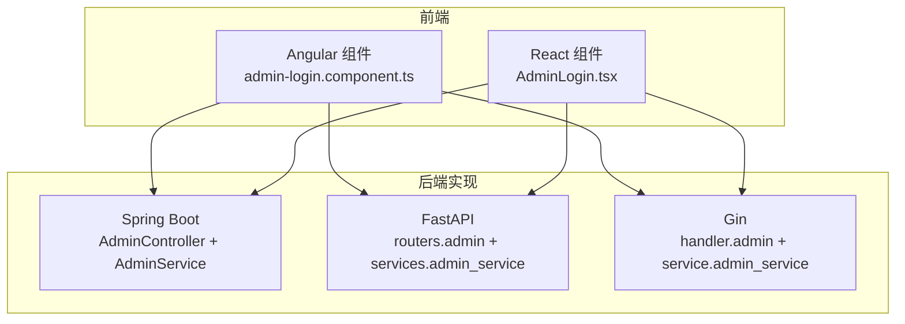
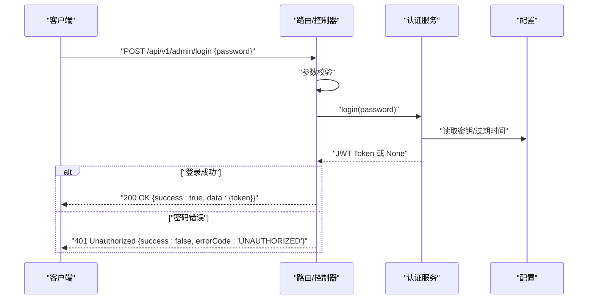
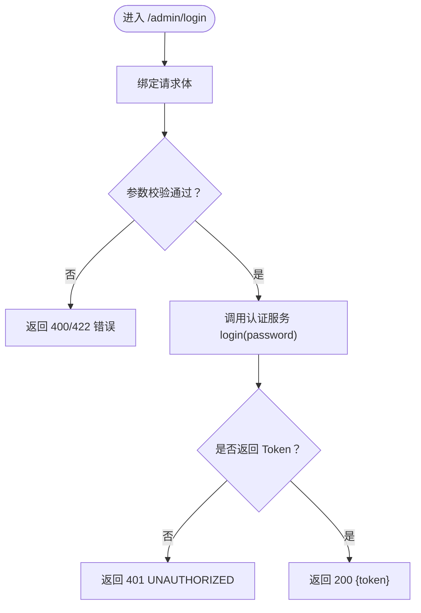
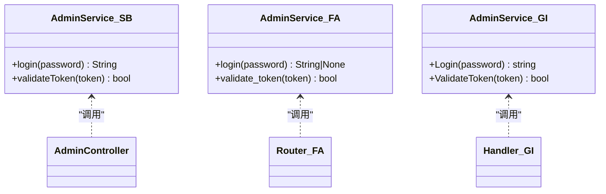
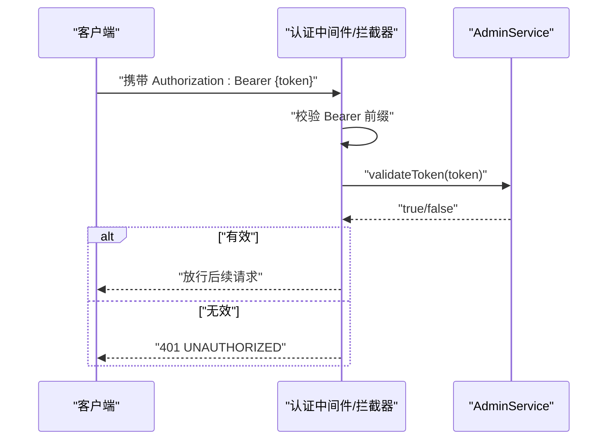
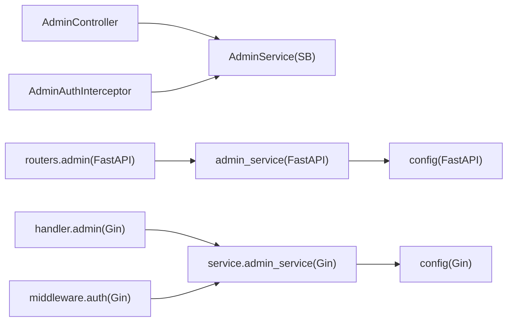

# 管理员登录端点

<cite>
**本文引用的文件**
- [backends/spring-boot/src/main/java/com/hellotime/dto/AdminLoginRequest.java](file://backends/spring-boot/src/main/java/com/hellotime/dto/AdminLoginRequest.java)
- [backends/spring-boot/src/main/java/com/hellotime/controller/AdminController.java](file://backends/spring-boot/src/main/java/com/hellotime/controller/AdminController.java)
- [backends/spring-boot/src/main/java/com/hellotime/service/AdminService.java](file://backends/spring-boot/src/main/java/com/hellotime/service/AdminService.java)
- [backends/spring-boot/src/main/java/com/hellotime/config/AdminAuthInterceptor.java](file://backends/spring-boot/src/main/java/com/hellotime/config/AdminAuthInterceptor.java)
- [backends/spring-boot/src/main/resources/application.yml](file://backends/spring-boot/src/main/resources/application.yml)
- [backends/fastapi/app/routers/admin.py](file://backends/fastapi/app/routers/admin.py)
- [backends/fastapi/app/schemas.py](file://backends/fastapi/app/schemas.py)
- [backends/fastapi/app/services/admin_service.py](file://backends/fastapi/app/services/admin_service.py)
- [backends/fastapi/app/dependencies.py](file://backends/fastapi/app/dependencies.py)
- [backends/fastapi/app/config.py](file://backends/fastapi/app/config.py)
- [backends/gin/handler/admin.go](file://backends/gin/handler/admin.go)
- [backends/gin/service/admin_service.go](file://backends/gin/service/admin_service.go)
- [backends/gin/middleware/auth.go](file://backends/gin/middleware/auth.go)
- [backends/gin/config/config.go](file://backends/gin/config/config.go)
- [backends/gin/dto/dto.go](file://backends/gin/dto/dto.go)
- [spec/api/openapi.yaml](file://spec/api/openapi.yaml)
- [frontends/angular-ts/src/app/components/admin-login/admin-login.component.ts](file://frontends/angular-ts/src/app/components/admin-login/admin-login.component.ts)
- [frontends/react-ts/src/components/AdminLogin.tsx](file://frontends/react-ts/src/components/AdminLogin.tsx)
</cite>

## 目录
1. [简介](#简介)
2. [项目结构](#项目结构)
3. [核心组件](#核心组件)
4. [架构总览](#架构总览)
5. [详细组件分析](#详细组件分析)
6. [依赖分析](#依赖分析)
7. [性能考虑](#性能考虑)
8. [故障排查指南](#故障排查指南)
9. [结论](#结论)
10. [附录](#附录)

## 简介
本文件针对管理员登录端点 /admin/login（POST）进行系统性说明，覆盖以下内容：
- 完整登录流程与请求参数 AdminLoginRequest.password 的验证规则
- 登录成功后的 JWT Token 生成机制（有效期与结构）
- 请求/响应示例（成功与密码错误）
- 安全考量（密码存储、防暴力破解）
- 不同后端实现的技术差异（Spring Boot、FastAPI、Gin）
- 客户端集成指南与最佳实践

## 项目结构
该仓库采用多后端并行实现的架构，管理员登录功能在三个后端中均提供一致的 API 行为与安全策略：
- Spring Boot（Java 21，JJWT，拦截器）
- FastAPI（Python，Pydantic，依赖注入）
- Gin（Go，JWT 中间件）

图表来源
- [backends/spring-boot/src/main/java/com/hellotime/controller/AdminController.java:41-48](file://backends/spring-boot/src/main/java/com/hellotime/controller/AdminController.java#L41-L48)
- [backends/fastapi/app/routers/admin.py:25-30](file://backends/fastapi/app/routers/admin.py#L25-L30)
- [backends/gin/handler/admin.go:20-35](file://backends/gin/handler/admin.go#L20-L35)

章节来源
- [backends/spring-boot/src/main/java/com/hellotime/controller/AdminController.java:18-48](file://backends/spring-boot/src/main/java/com/hellotime/controller/AdminController.java#L18-L48)
- [backends/fastapi/app/routers/admin.py:22-30](file://backends/fastapi/app/routers/admin.py#L22-L30)
- [backends/gin/handler/admin.go:15-35](file://backends/gin/handler/admin.go#L15-L35)

## 核心组件
- 请求模型与验证
  - Spring Boot：使用 Java Record + Jakarta Validation 注解，password 字段非空校验
  - FastAPI：使用 Pydantic BaseModel，password 字段最小长度为 1
  - Gin：使用结构体绑定，password 字段必填
- 登录控制器/路由
  - Spring Boot：PostMapping /api/v1/admin/login；调用 AdminService.login 并返回 ApiResponse 包裹的 AdminTokenResponse
  - FastAPI：router.post /api/v1/admin/login；依赖注入验证中间件，返回 ApiResponse[AdminTokenResponse]
  - Gin：handler.Login 接收 JSON，调用 service.Login，返回统一 DTO
- 认证服务与 JWT
  - Spring Boot：基于 JJWT 生成 HS256 Token，支持配置过期时间与密钥
  - FastAPI：基于 python-jose 生成 HS256 Token，支持配置过期时间与密钥
  - Gin：基于 golang-jwt 生成 HS256 Token，支持配置过期时间与密钥
- 安全中间件/拦截器
  - Spring Boot：拦截器校验 Authorization: Bearer {token}
  - FastAPI：依赖注入校验 Bearer Token
  - Gin：中间件校验 Authorization: Bearer {token}

章节来源
- [backends/spring-boot/src/main/java/com/hellotime/dto/AdminLoginRequest.java:11-14](file://backends/spring-boot/src/main/java/com/hellotime/dto/AdminLoginRequest.java#L11-L14)
- [backends/fastapi/app/schemas.py:47-49](file://backends/fastapi/app/schemas.py#L47-L49)
- [backends/gin/dto/dto.go:46-49](file://backends/gin/dto/dto.go#L46-L49)
- [backends/spring-boot/src/main/java/com/hellotime/controller/AdminController.java:41-48](file://backends/spring-boot/src/main/java/com/hellotime/controller/AdminController.java#L41-L48)
- [backends/fastapi/app/routers/admin.py:25-30](file://backends/fastapi/app/routers/admin.py#L25-L30)
- [backends/gin/handler/admin.go:20-35](file://backends/gin/handler/admin.go#L20-L35)
- [backends/spring-boot/src/main/java/com/hellotime/service/AdminService.java:53-66](file://backends/spring-boot/src/main/java/com/hellotime/service/AdminService.java#L53-L66)
- [backends/fastapi/app/services/admin_service.py:18-32](file://backends/fastapi/app/services/admin_service.py#L18-L32)
- [backends/gin/service/admin_service.go:12-31](file://backends/gin/service/admin_service.go#L12-L31)
- [backends/spring-boot/src/main/java/com/hellotime/config/AdminAuthInterceptor.java:34-57](file://backends/spring-boot/src/main/java/com/hellotime/config/AdminAuthInterceptor.java#L34-L57)
- [backends/fastapi/app/dependencies.py:10-22](file://backends/fastapi/app/dependencies.py#L10-L22)
- [backends/gin/middleware/auth.go:13-36](file://backends/gin/middleware/auth.go#L13-L36)

## 架构总览
管理员登录端点在三个后端中的调用链如下：

图表来源
- [backends/spring-boot/src/main/java/com/hellotime/controller/AdminController.java:41-48](file://backends/spring-boot/src/main/java/com/hellotime/controller/AdminController.java#L41-L48)
- [backends/fastapi/app/routers/admin.py:25-30](file://backends/fastapi/app/routers/admin.py#L25-L30)
- [backends/gin/handler/admin.go:20-35](file://backends/gin/handler/admin.go#L20-L35)
- [backends/spring-boot/src/main/java/com/hellotime/service/AdminService.java:53-66](file://backends/spring-boot/src/main/java/com/hellotime/service/AdminService.java#L53-L66)
- [backends/fastapi/app/services/admin_service.py:18-32](file://backends/fastapi/app/services/admin_service.py#L18-L32)
- [backends/gin/service/admin_service.go:12-31](file://backends/gin/service/admin_service.go#L12-L31)

## 详细组件分析

### 请求模型与参数验证
- Spring Boot（Java Record + Jakarta Validation）
  - password 字段非空校验，错误时返回 400
- FastAPI（Pydantic）
  - password 最小长度为 1，错误时返回 422
- Gin（Gin 绑定）
  - password 字段必填，错误时返回 400

章节来源
- [backends/spring-boot/src/main/java/com/hellotime/dto/AdminLoginRequest.java:11-14](file://backends/spring-boot/src/main/java/com/hellotime/dto/AdminLoginRequest.java#L11-L14)
- [backends/fastapi/app/schemas.py:47-49](file://backends/fastapi/app/schemas.py#L47-L49)
- [backends/gin/dto/dto.go:46-49](file://backends/gin/dto/dto.go#L46-L49)

### 登录流程与控制器
- Spring Boot
  - 控制器接收 AdminLoginRequest，调用 AdminService.login，若返回 null 则抛出 401 异常
- FastAPI
  - 路由接收 AdminLoginRequest，调用 admin_service.login，若返回 None 则抛出自定义 UnauthorizedException
- Gin
  - handler.Login 绑定 JSON，调用 service.Login，若返回空字符串则返回 401

图表来源
- [backends/spring-boot/src/main/java/com/hellotime/controller/AdminController.java:41-48](file://backends/spring-boot/src/main/java/com/hellotime/controller/AdminController.java#L41-L48)
- [backends/fastapi/app/routers/admin.py:25-30](file://backends/fastapi/app/routers/admin.py#L25-L30)
- [backends/gin/handler/admin.go:20-35](file://backends/gin/handler/admin.go#L20-L35)

章节来源
- [backends/spring-boot/src/main/java/com/hellotime/controller/AdminController.java:41-48](file://backends/spring-boot/src/main/java/com/hellotime/controller/AdminController.java#L41-L48)
- [backends/fastapi/app/routers/admin.py:25-30](file://backends/fastapi/app/routers/admin.py#L25-L30)
- [backends/gin/handler/admin.go:20-35](file://backends/gin/handler/admin.go#L20-L35)

### JWT Token 生成与验证
- 密钥与过期时间
  - Spring Boot：从配置读取密钥与过期小时数，过期时间以毫秒计算
  - FastAPI：从环境变量读取密钥与过期小时数
  - Gin：从环境变量读取密钥与过期小时数
- Token 结构
  - 子主题（sub）："admin"
  - 签发时间（iat）：当前 UTC 时间
  - 过期时间（exp）：iat + 过期小时数
  - 算法：HS256（HMAC-SHA256）
- Token 校验
  - Spring Boot：使用 JJWT 验证签名与过期
  - FastAPI：使用 python-jose 解码并验证
  - Gin：使用 golang-jwt 解析并验证

图表来源
- [backends/spring-boot/src/main/java/com/hellotime/service/AdminService.java:53-87](file://backends/spring-boot/src/main/java/com/hellotime/service/AdminService.java#L53-L87)
- [backends/fastapi/app/services/admin_service.py:18-41](file://backends/fastapi/app/services/admin_service.py#L18-L41)
- [backends/gin/service/admin_service.go:12-46](file://backends/gin/service/admin_service.go#L12-L46)

章节来源
- [backends/spring-boot/src/main/java/com/hellotime/service/AdminService.java:28-44](file://backends/spring-boot/src/main/java/com/hellotime/service/AdminService.java#L28-L44)
- [backends/fastapi/app/config.py:11-17](file://backends/fastapi/app/config.py#L11-L17)
- [backends/gin/config/config.go:32-42](file://backends/gin/config/config.go#L32-L42)
- [backends/spring-boot/src/main/resources/application.yml:20-25](file://backends/spring-boot/src/main/resources/application.yml#L20-L25)

### 安全中间件与认证拦截
- Spring Boot：AdminAuthInterceptor 从 Authorization 头提取 Bearer Token，并调用 AdminService.validateToken
- FastAPI：verify_admin_token 依赖注入，校验 Bearer 前缀与 Token 有效性
- Gin：JWTAuth 中间件校验 Bearer 前缀与 Token 有效性

图表来源
- [backends/spring-boot/src/main/java/com/hellotime/config/AdminAuthInterceptor.java:34-57](file://backends/spring-boot/src/main/java/com/hellotime/config/AdminAuthInterceptor.java#L34-L57)
- [backends/fastapi/app/dependencies.py:10-22](file://backends/fastapi/app/dependencies.py#L10-L22)
- [backends/gin/middleware/auth.go:13-36](file://backends/gin/middleware/auth.go#L13-L36)

章节来源
- [backends/spring-boot/src/main/java/com/hellotime/config/AdminAuthInterceptor.java:15-57](file://backends/spring-boot/src/main/java/com/hellotime/config/AdminAuthInterceptor.java#L15-L57)
- [backends/fastapi/app/dependencies.py:10-22](file://backends/fastapi/app/dependencies.py#L10-L22)
- [backends/gin/middleware/auth.go:13-36](file://backends/gin/middleware/auth.go#L13-L36)

### 请求/响应示例
- OpenAPI 描述
  - 路径：/api/v1/admin/login
  - 方法：POST
  - 请求体：AdminLoginRequest（包含 password）
  - 成功响应：200，包含 AdminTokenResponse（含 token）
  - 失败响应：401，包含错误信息与错误码

- 示例（成功）
  - 请求
    - 方法：POST
    - 路径：/api/v1/admin/login
    - 头部：Content-Type: application/json
    - 正文：{"password":"timecapsule-admin"}
  - 响应
    - 状态：200
    - 正文：{"success":true,"data":{"token":"..."},"message":"登录成功"}

- 示例（密码错误）
  - 请求
    - 方法：POST
    - 路径：/api/v1/admin/login
    - 头部：Content-Type: application/json
    - 正文：{"password":"wrong"}
  - 响应
    - 状态：401
    - 正文：{"success":false,"message":"密码错误","errorCode":"UNAUTHORIZED"}

章节来源
- [spec/api/openapi.yaml:75-98](file://spec/api/openapi.yaml#L75-L98)
- [backends/spring-boot/src/main/java/com/hellotime/controller/AdminController.java:41-48](file://backends/spring-boot/src/main/java/com/hellotime/controller/AdminController.java#L41-L48)
- [backends/fastapi/app/routers/admin.py:25-30](file://backends/fastapi/app/routers/admin.py#L25-L30)
- [backends/gin/handler/admin.go:20-35](file://backends/gin/handler/admin.go#L20-L35)

### 安全考虑
- 密码存储
  - 当前实现为明文比较（配置中的 ADMIN_PASSWORD），不建议用于生产环境
  - 生产建议：使用强哈希（如 bcrypt、scrypt、argon2）存储管理员密码，登录时进行哈希比对
- 防暴力破解
  - 可选方案：登录失败计数与临时封禁、验证码、速率限制（基于 IP 或会话）
- Token 安全
  - 密钥长度足够（建议至少 256-bit），定期轮换
  - 过期时间合理（默认 2 小时），可结合刷新令牌策略
  - 传输层使用 HTTPS，避免 Token 泄露
- 其他
  - 严格校验 Authorization 头格式，拒绝非 Bearer 形式
  - 对 Token 过期与签名失败进行统一错误处理

章节来源
- [backends/fastapi/app/services/admin_service.py:18-24](file://backends/fastapi/app/services/admin_service.py#L18-L24)
- [backends/gin/service/admin_service.go:14-17](file://backends/gin/service/admin_service.go#L14-L17)
- [backends/spring-boot/src/main/java/com/hellotime/service/AdminService.java:53-57](file://backends/spring-boot/src/main/java/com/hellotime/service/AdminService.java#L53-L57)

### 不同后端实现的技术细节差异
- Spring Boot（Java 21 + JJWT）
  - 配置：application.yml 读取 ADMIN_PASSWORD、JWT_SECRET、JWT_EXPIRATION_HOURS
  - 认证：拦截器 AdminAuthInterceptor 校验 Bearer Token
  - Token：HS256，子主题 admin，签发/过期时间
- FastAPI（Python + Pydantic）
  - 配置：config.py 从环境变量读取 ADMIN_PASSWORD、JWT_SECRET、JWT_EXPIRATION_HOURS
  - 认证：依赖注入 verify_admin_token 校验 Bearer Token
  - Token：HS256，子主题 admin，签发/过期时间
- Gin（Go + golang-jwt）
  - 配置：config.go 从环境变量读取 DATABASE_URL、ADMIN_PASSWORD、JWT_SECRET、JWT_EXPIRATION_HOURS、PORT
  - 认证：中间件 JWTAuth 校验 Bearer Token
  - Token：HS256，子主题 admin，签发/过期时间

章节来源
- [backends/spring-boot/src/main/resources/application.yml:20-25](file://backends/spring-boot/src/main/resources/application.yml#L20-L25)
- [backends/spring-boot/src/main/java/com/hellotime/config/AdminAuthInterceptor.java:34-57](file://backends/spring-boot/src/main/java/com/hellotime/config/AdminAuthInterceptor.java#L34-L57)
- [backends/fastapi/app/config.py:11-17](file://backends/fastapi/app/config.py#L11-L17)
- [backends/fastapi/app/dependencies.py:10-22](file://backends/fastapi/app/dependencies.py#L10-L22)
- [backends/gin/config/config.go:32-42](file://backends/gin/config/config.go#L32-L42)
- [backends/gin/middleware/auth.go:13-36](file://backends/gin/middleware/auth.go#L13-L36)

### 客户端集成指南与最佳实践
- Angular
  - 使用 AdminLoginComponent 发出密码事件，调用后端 /api/v1/admin/login
  - 成功后保存 token（localStorage/sessionStorage），并在后续请求头添加 Authorization: Bearer {token}
- React
  - 使用 AdminLogin 组件收集密码，提交后保存 token
  - 使用 fetch/fetch-with-interceptors 或 axios 拦截器统一注入 Authorization 头
- 通用最佳实践
  - 仅在登录成功后持久化 token
  - 在发起受保护请求前检查 token 是否存在且未过期
  - 登录失败时清空本地存储的 token
  - 使用 HTTPS 与安全的 Cookie 属性（如 SameSite、HttpOnly、Secure）存储 token（视部署而定）

章节来源
- [frontends/angular-ts/src/app/components/admin-login/admin-login.component.ts:11-22](file://frontends/angular-ts/src/app/components/admin-login/admin-login.component.ts#L11-L22)
- [frontends/react-ts/src/components/AdminLogin.tsx:10-18](file://frontends/react-ts/src/components/AdminLogin.tsx#L10-L18)

## 依赖分析
- Spring Boot
  - AdminController 依赖 AdminService、CapsuleService
  - AdminService 依赖配置（密钥、过期时间），使用 JJWT 生成/验证 Token
  - AdminAuthInterceptor 依赖 AdminService 进行 Token 校验
- FastAPI
  - routers.admin 依赖 admin_service 与 verify_admin_token 依赖注入
  - admin_service 依赖 config（密钥、过期时间）
- Gin
  - handler.admin 依赖 service.admin_service
  - service.admin_service 依赖 config（密钥、过期时间）
  - middleware.auth 依赖 service.admin_service 进行 Token 校验

图表来源
- [backends/spring-boot/src/main/java/com/hellotime/controller/AdminController.java:22-31](file://backends/spring-boot/src/main/java/com/hellotime/controller/AdminController.java#L22-L31)
- [backends/spring-boot/src/main/java/com/hellotime/service/AdminService.java:18-44](file://backends/spring-boot/src/main/java/com/hellotime/service/AdminService.java#L18-L44)
- [backends/spring-boot/src/main/java/com/hellotime/config/AdminAuthInterceptor.java:16-22](file://backends/spring-boot/src/main/java/com/hellotime/config/AdminAuthInterceptor.java#L16-L22)
- [backends/fastapi/app/routers/admin.py:19-20](file://backends/fastapi/app/routers/admin.py#L19-L20)
- [backends/fastapi/app/services/admin_service.py](file://backends/fastapi/app/services/admin_service.py#L9)
- [backends/gin/handler/admin.go:8-10](file://backends/gin/handler/admin.go#L8-L10)
- [backends/gin/service/admin_service.go](file://backends/gin/service/admin_service.go#L8)
- [backends/gin/middleware/auth.go](file://backends/gin/middleware/auth.go#L9)

章节来源
- [backends/spring-boot/src/main/java/com/hellotime/controller/AdminController.java:22-31](file://backends/spring-boot/src/main/java/com/hellotime/controller/AdminController.java#L22-L31)
- [backends/fastapi/app/routers/admin.py:19-20](file://backends/fastapi/app/routers/admin.py#L19-L20)
- [backends/gin/handler/admin.go:8-10](file://backends/gin/handler/admin.go#L8-L10)

## 性能考虑
- Token 生成成本低（纯内存运算），对吞吐影响可忽略
- 建议在高并发场景下：
  - 使用连接池与异步 I/O（Spring Boot 已启用虚拟线程）
  - 合理设置过期时间，避免频繁重新登录
  - 对受保护接口使用缓存（如分页查询）减少数据库压力

## 故障排查指南
- 常见错误与定位
  - 400/422 参数错误：检查请求体结构与字段长度
  - 401 未授权：确认 Authorization 头格式为 Bearer {token}，且 token 未过期
  - 500 服务器错误：检查后端日志与配置项（密钥、过期时间）
- 日志与监控
  - 记录登录尝试（成功/失败）、IP、UA
  - 对异常进行统一异常处理器捕获与记录
- 配置核对
  - 确认 ADMIN_PASSWORD、JWT_SECRET、JWT_EXPIRATION_HOURS 设置正确
  - Spring Boot：application.yml 中 app.jwt.* 与 app.admin.password

章节来源
- [backends/spring-boot/src/main/resources/application.yml:20-25](file://backends/spring-boot/src/main/resources/application.yml#L20-L25)
- [backends/fastapi/app/config.py:11-17](file://backends/fastapi/app/config.py#L11-L17)
- [backends/gin/config/config.go:32-42](file://backends/gin/config/config.go#L32-L42)

## 结论
管理员登录端点在三个后端实现了统一的行为契约：参数校验、明文密码对比、HS256 JWT 生成与 Bearer 认证。生产环境中建议替换为强哈希密码存储与防暴力破解策略，并优化 Token 生命周期与传输安全。

## 附录
- API 规范参考：OpenAPI 中 /admin/login 的请求/响应定义
- 客户端组件参考：Angular 与 React 的登录表单组件

章节来源
- [spec/api/openapi.yaml:75-98](file://spec/api/openapi.yaml#L75-L98)
- [frontends/angular-ts/src/app/components/admin-login/admin-login.component.ts:11-22](file://frontends/angular-ts/src/app/components/admin-login/admin-login.component.ts#L11-L22)
- [frontends/react-ts/src/components/AdminLogin.tsx:10-18](file://frontends/react-ts/src/components/AdminLogin.tsx#L10-L18)