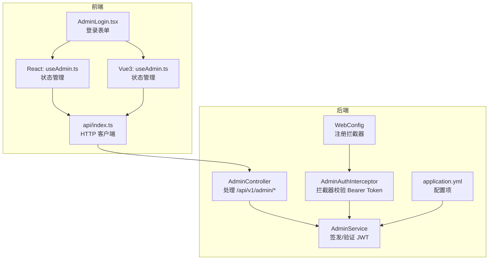
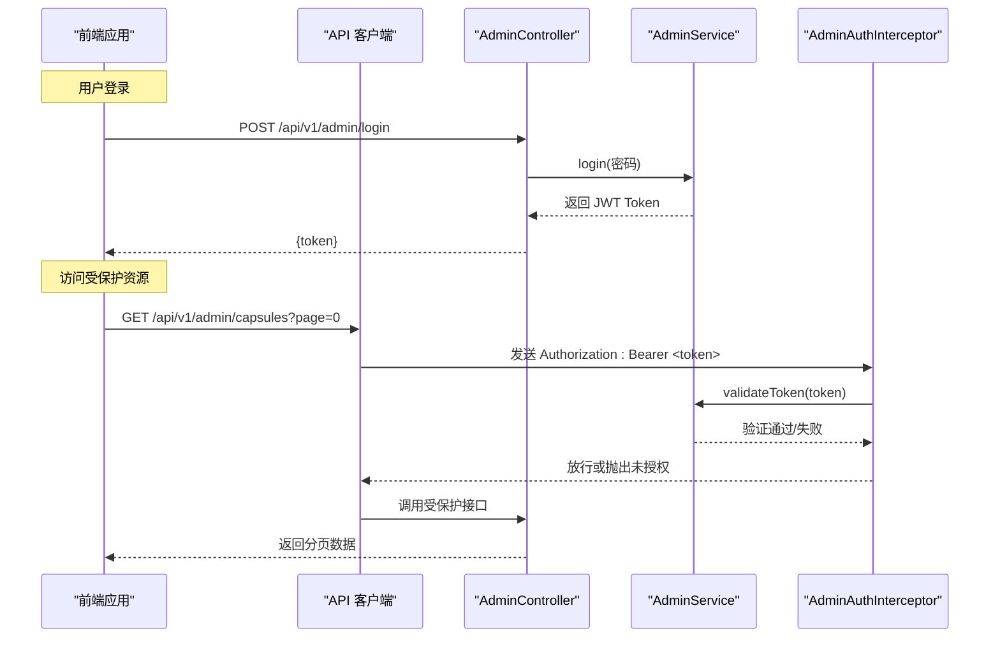
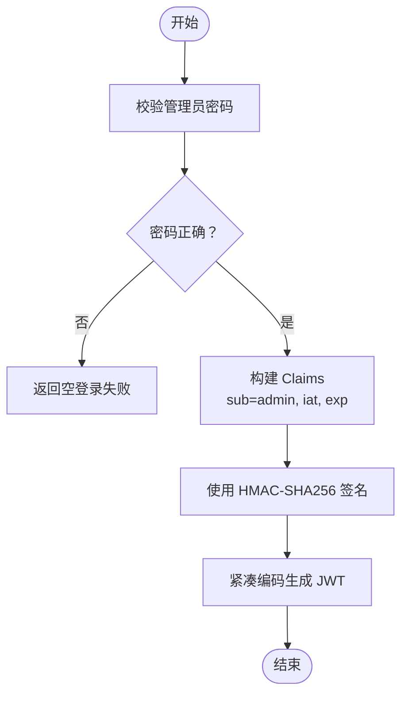
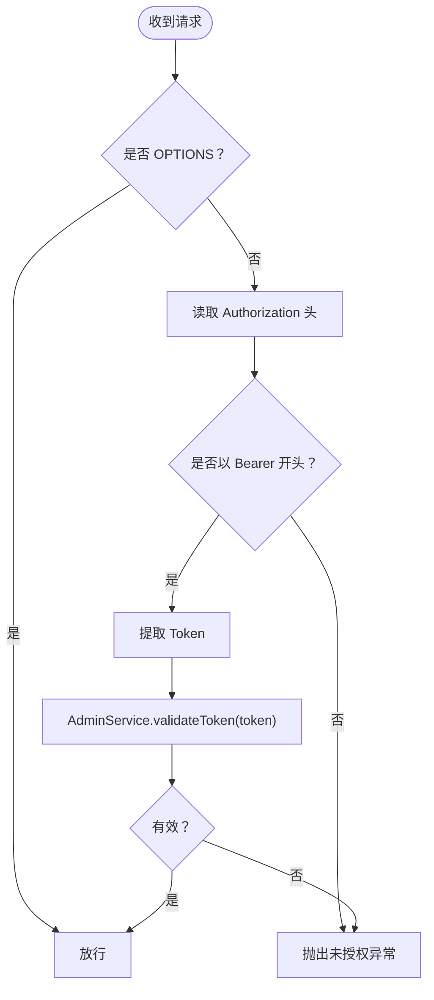
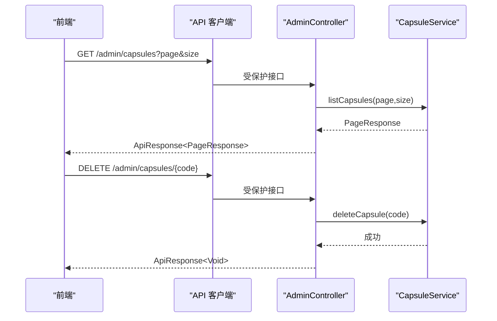
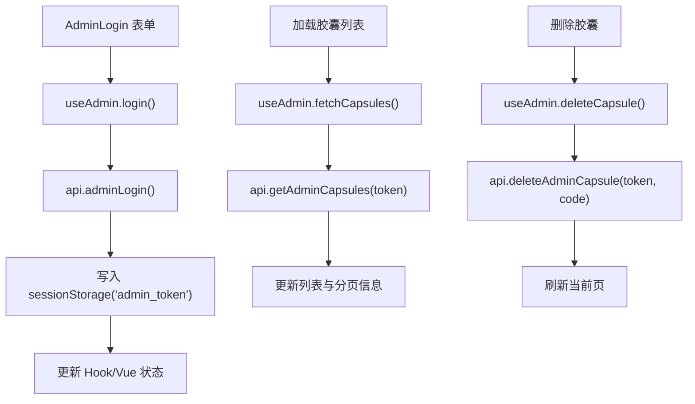
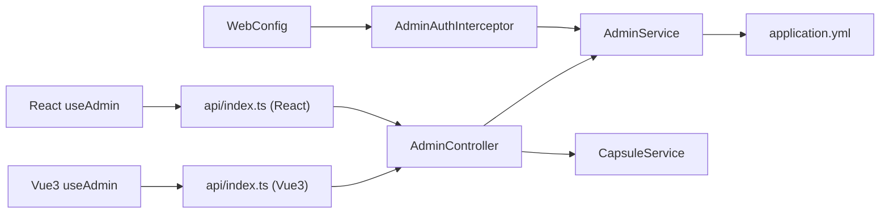

# 管理员认证

<cite>
**本文档引用的文件**
- [AdminController.java](file://backends/spring-boot/src/main/java/com/hellotime/controller/AdminController.java)
- [AdminService.java](file://backends/spring-boot/src/main/java/com/hellotime/service/AdminService.java)
- [AdminAuthInterceptor.java](file://backends/spring-boot/src/main/java/com/hellotime/config/AdminAuthInterceptor.java)
- [WebConfig.java](file://backends/spring-boot/src/main/java/com/hellotime/config/WebConfig.java)
- [UnauthorizedException.java](file://backends/spring-boot/src/main/java/com/hellotime/exception/UnauthorizedException.java)
- [AdminLoginRequest.java](file://backends/spring-boot/src/main/java/com/hellotime/dto/AdminLoginRequest.java)
- [AdminTokenResponse.java](file://backends/spring-boot/src/main/java/com/hellotime/dto/AdminTokenResponse.java)
- [application.yml](file://backends/spring-boot/src/main/resources/application.yml)
- [openapi.yaml](file://spec/api/openapi.yaml)
- [useAdmin.ts（React）](file://frontends/react-ts/src/hooks/useAdmin.ts)
- [useAdmin.ts（Vue3）](file://frontends/vue3-ts/src/composables/useAdmin.ts)
- [api/index.ts（React）](file://frontends/react-ts/src/api/index.ts)
- [api/index.ts（Vue3）](file://frontends/vue3-ts/src/api/index.ts)
- [AdminLogin.tsx](file://frontends/react-ts/src/components/AdminLogin.tsx)
- [AdminControllerTest.java](file://backends/spring-boot/src/test/java/com/hellotime/controller/AdminControllerTest.java)
</cite>

## 目录
1. [简介](#简介)
2. [项目结构](#项目结构)
3. [核心组件](#核心组件)
4. [架构总览](#架构总览)
5. [详细组件分析](#详细组件分析)
6. [依赖分析](#依赖分析)
7. [性能考虑](#性能考虑)
8. [故障排查指南](#故障排查指南)
9. [结论](#结论)
10. [附录](#附录)

## 简介
本文件面向管理员认证系统，系统采用基于 JWT 的 Bearer Token 认证机制，后端使用 Spring Boot，前端提供 React/Vue3 两种实现。文档涵盖以下主题：
- 管理员登录流程与 Token 生成
- Token 验证与安全拦截器实现
- 管理员权限接口：分页查询胶囊列表与删除胶囊
- 完整认证流程示例：从登录到访问受保护资源
- Token 过期处理与刷新机制建议
- 前端认证状态管理与 Token 存储最佳实践

## 项目结构
后端采用 Spring Boot，核心目录与职责如下：
- 控制器层：处理 HTTP 请求，位于 `/controller`
- 服务层：业务逻辑与 JWT 签发/验证，位于 `/service`
- 配置层：拦截器与 Web 配置，位于 `/config`
- DTO/异常：数据传输对象与自定义异常，位于对应包
- 配置文件：应用配置，位于 `/resources`
- 接口规范：OpenAPI 规范，位于 `/spec/api`

前端提供 React 与 Vue3 两套实现，均通过统一 API 客户端与后端交互。

图表来源
- [AdminController.java:16-78](file://backends/spring-boot/src/main/java/com/hellotime/controller/AdminController.java#L16-L78)
- [AdminService.java:18-89](file://backends/spring-boot/src/main/java/com/hellotime/service/AdminService.java#L18-L89)
- [AdminAuthInterceptor.java:15-59](file://backends/spring-boot/src/main/java/com/hellotime/config/AdminAuthInterceptor.java#L15-L59)
- [WebConfig.java:11-32](file://backends/spring-boot/src/main/java/com/hellotime/config/WebConfig.java#L11-L32)
- [application.yml:16-22](file://backends/spring-boot/src/main/resources/application.yml#L16-L22)
- [useAdmin.ts（React）:7-133](file://frontends/react-ts/src/hooks/useAdmin.ts#L7-L133)
- [useAdmin.ts（Vue3）:6-132](file://frontends/vue3-ts/src/composables/useAdmin.ts#L6-L132)
- [api/index.ts（React）:6-94](file://frontends/react-ts/src/api/index.ts#L6-L94)
- [api/index.ts（Vue3）:6-120](file://frontends/vue3-ts/src/api/index.ts#L6-L120)

章节来源
- [AdminController.java:16-78](file://backends/spring-boot/src/main/java/com/hellotime/controller/AdminController.java#L16-L78)
- [AdminService.java:18-89](file://backends/spring-boot/src/main/java/com/hellotime/service/AdminService.java#L18-L89)
- [AdminAuthInterceptor.java:15-59](file://backends/spring-boot/src/main/java/com/hellotime/config/AdminAuthInterceptor.java#L15-L59)
- [WebConfig.java:11-32](file://backends/spring-boot/src/main/java/com/hellotime/config/WebConfig.java#L11-L32)
- [application.yml:16-22](file://backends/spring-boot/src/main/resources/application.yml#L16-L22)

## 核心组件
- 管理员控制器：提供登录、分页查询胶囊、删除胶囊接口，其中除登录外均需认证。
- 管理员服务：负责管理员密码校验、JWT 签发与验证。
- 安全拦截器：拦截 /api/v1/admin/** 请求，校验 Authorization 头中的 Bearer Token。
- Web 配置：注册拦截器并对登录接口进行排除。
- 前端 Hook：封装登录、登出、胶囊列表加载与删除，并持久化 Token。
- API 客户端：统一封装请求，自动附加 Bearer Token。

章节来源
- [AdminController.java:39-77](file://backends/spring-boot/src/main/java/com/hellotime/controller/AdminController.java#L39-L77)
- [AdminService.java:53-87](file://backends/spring-boot/src/main/java/com/hellotime/service/AdminService.java#L53-L87)
- [AdminAuthInterceptor.java:34-57](file://backends/spring-boot/src/main/java/com/hellotime/config/AdminAuthInterceptor.java#L34-L57)
- [WebConfig.java:25-30](file://backends/spring-boot/src/main/java/com/hellotime/config/WebConfig.java#L25-L30)
- [useAdmin.ts（React）:35-132](file://frontends/react-ts/src/hooks/useAdmin.ts#L35-L132)
- [useAdmin.ts（Vue3）:18-131](file://frontends/vue3-ts/src/composables/useAdmin.ts#L18-L131)
- [api/index.ts（React）:55-85](file://frontends/react-ts/src/api/index.ts#L55-L85)
- [api/index.ts（Vue3）:67-111](file://frontends/vue3-ts/src/api/index.ts#L67-L111)

## 架构总览
下图展示从浏览器到后端的认证与授权流程，以及前后端协作方式。

图表来源
- [AdminController.java:39-77](file://backends/spring-boot/src/main/java/com/hellotime/controller/AdminController.java#L39-L77)
- [AdminService.java:53-87](file://backends/spring-boot/src/main/java/com/hellotime/service/AdminService.java#L53-L87)
- [AdminAuthInterceptor.java:34-57](file://backends/spring-boot/src/main/java/com/hellotime/config/AdminAuthInterceptor.java#L34-L57)
- [api/index.ts（React）:66-74](file://frontends/react-ts/src/api/index.ts#L66-L74)
- [api/index.ts（Vue3）:81-95](file://frontends/vue3-ts/src/api/index.ts#L81-L95)

## 详细组件分析

### 管理员登录与 Token 生成
- 登录接口：接收密码，校验通过后签发 JWT，包含签发时间与过期时间，使用对称密钥签名。
- Token 结构：主体为管理员标识，包含签发时间与过期时间，签名算法为 HS256。
- 配置项：管理员密码、JWT 密钥、Token 有效期（小时）。

图表来源
- [AdminService.java:53-66](file://backends/spring-boot/src/main/java/com/hellotime/service/AdminService.java#L53-L66)
- [application.yml:16-22](file://backends/spring-boot/src/main/resources/application.yml#L16-L22)

章节来源
- [AdminController.java:39-46](file://backends/spring-boot/src/main/java/com/hellotime/controller/AdminController.java#L39-L46)
- [AdminService.java:53-66](file://backends/spring-boot/src/main/java/com/hellotime/service/AdminService.java#L53-L66)
- [AdminLoginRequest.java:5-12](file://backends/spring-boot/src/main/java/com/hellotime/dto/AdminLoginRequest.java#L5-L12)
- [AdminTokenResponse.java:3-12](file://backends/spring-boot/src/main/java/com/hellotime/dto/AdminTokenResponse.java#L3-L12)
- [application.yml:16-22](file://backends/spring-boot/src/main/resources/application.yml#L16-L22)

### Token 验证与安全拦截器
- 拦截器规则：对 /api/v1/admin/** 生效，排除 /api/v1/admin/login。
- 验证逻辑：要求 Authorization 头以 "Bearer " 开头；提取 Token 并调用服务验证签名与过期。
- 异常处理：缺失或无效 Token 抛出未授权异常，由全局异常处理返回 401。

图表来源
- [AdminAuthInterceptor.java:34-57](file://backends/spring-boot/src/main/java/com/hellotime/config/AdminAuthInterceptor.java#L34-L57)
- [WebConfig.java:25-30](file://backends/spring-boot/src/main/java/com/hellotime/config/WebConfig.java#L25-L30)
- [UnauthorizedException.java:8-18](file://backends/spring-boot/src/main/java/com/hellotime/exception/UnauthorizedException.java#L8-L18)

章节来源
- [AdminAuthInterceptor.java:34-57](file://backends/spring-boot/src/main/java/com/hellotime/config/AdminAuthInterceptor.java#L34-L57)
- [WebConfig.java:25-30](file://backends/spring-boot/src/main/java/com/hellotime/config/WebConfig.java#L25-L30)
- [UnauthorizedException.java:8-18](file://backends/spring-boot/src/main/java/com/hellotime/exception/UnauthorizedException.java#L8-L18)

### 管理员权限接口
- 分页查询胶囊：GET /api/v1/admin/capsules?page=&size=，需要认证。
- 删除胶囊：DELETE /api/v1/admin/capsules/{code}，需要认证。
- OpenAPI 规范明确标注 BearerAuth 安全方案。

图表来源
- [AdminController.java:57-76](file://backends/spring-boot/src/main/java/com/hellotime/controller/AdminController.java#L57-L76)
- [openapi.yaml:100-163](file://spec/api/openapi.yaml#L100-L163)

章节来源
- [AdminController.java:57-76](file://backends/spring-boot/src/main/java/com/hellotime/controller/AdminController.java#L57-L76)
- [openapi.yaml:100-163](file://spec/api/openapi.yaml#L100-L163)

### 前端认证状态管理与 Token 存储
- React 实现：使用自定义 Hook，模块级变量共享 Token，sessionStorage 持久化，useSyncExternalStore 实现跨组件同步。
- Vue3 实现：使用组合式函数，ref 管理 Token，sessionStorage 持久化。
- API 客户端：统一在请求头附加 Authorization: Bearer <token>。
- 登录表单：简单密码输入，提交后调用登录接口并保存 Token。

图表来源
- [AdminLogin.tsx:10-18](file://frontends/react-ts/src/components/AdminLogin.tsx#L10-L18)
- [useAdmin.ts（React）:49-93](file://frontends/react-ts/src/hooks/useAdmin.ts#L49-L93)
- [useAdmin.ts（Vue3）:43-96](file://frontends/vue3-ts/src/composables/useAdmin.ts#L43-L96)
- [api/index.ts（React）:55-85](file://frontends/react-ts/src/api/index.ts#L55-L85)
- [api/index.ts（Vue3）:67-111](file://frontends/vue3-ts/src/api/index.ts#L67-L111)

章节来源
- [AdminLogin.tsx:10-18](file://frontends/react-ts/src/components/AdminLogin.tsx#L10-L18)
- [useAdmin.ts（React）:35-132](file://frontends/react-ts/src/hooks/useAdmin.ts#L35-L132)
- [useAdmin.ts（Vue3）:18-131](file://frontends/vue3-ts/src/composables/useAdmin.ts#L18-L131)
- [api/index.ts（React）:55-85](file://frontends/react-ts/src/api/index.ts#L55-L85)
- [api/index.ts（Vue3）:67-111](file://frontends/vue3-ts/src/api/index.ts#L67-L111)

## 依赖分析
- 控制器依赖服务：AdminController 注入 AdminService 与 CapsuleService。
- 拦截器依赖服务：AdminAuthInterceptor 注入 AdminService 用于 Token 验证。
- 配置依赖拦截器：WebConfig 注册 AdminAuthInterceptor 并设置路径匹配规则。
- 服务依赖配置：AdminService 从 application.yml 读取管理员密码、JWT 密钥与过期时间。
- 前端依赖 API 客户端：useAdmin 通过 api/index.ts 调用后端接口。

图表来源
- [AdminController.java:20-29](file://backends/spring-boot/src/main/java/com/hellotime/controller/AdminController.java#L20-L29)
- [AdminAuthInterceptor.java:18-22](file://backends/spring-boot/src/main/java/com/hellotime/config/AdminAuthInterceptor.java#L18-L22)
- [WebConfig.java:14-18](file://backends/spring-boot/src/main/java/com/hellotime/config/WebConfig.java#L14-L18)
- [AdminService.java:35-44](file://backends/spring-boot/src/main/java/com/hellotime/service/AdminService.java#L35-L44)
- [application.yml:16-22](file://backends/spring-boot/src/main/resources/application.yml#L16-L22)
- [useAdmin.ts（React）:9-12](file://frontends/react-ts/src/hooks/useAdmin.ts#L9-L12)
- [useAdmin.ts（Vue3）:8-16](file://frontends/vue3-ts/src/composables/useAdmin.ts#L8-L16)
- [api/index.ts（React）:6-8](file://frontends/react-ts/src/api/index.ts#L6-L8)
- [api/index.ts（Vue3）:6-8](file://frontends/vue3-ts/src/api/index.ts#L6-L8)

章节来源
- [AdminController.java:20-29](file://backends/spring-boot/src/main/java/com/hellotime/controller/AdminController.java#L20-L29)
- [AdminAuthInterceptor.java:18-22](file://backends/spring-boot/src/main/java/com/hellotime/config/AdminAuthInterceptor.java#L18-L22)
- [WebConfig.java:14-18](file://backends/spring-boot/src/main/java/com/hellotime/config/WebConfig.java#L14-L18)
- [AdminService.java:35-44](file://backends/spring-boot/src/main/java/com/hellotime/service/AdminService.java#L35-L44)
- [application.yml:16-22](file://backends/spring-boot/src/main/resources/application.yml#L16-L22)
- [useAdmin.ts（React）:9-12](file://frontends/react-ts/src/hooks/useAdmin.ts#L9-L12)
- [useAdmin.ts（Vue3）:8-16](file://frontends/vue3-ts/src/composables/useAdmin.ts#L8-L16)
- [api/index.ts（React）:6-8](file://frontends/react-ts/src/api/index.ts#L6-L8)
- [api/index.ts（Vue3）:6-8](file://frontends/vue3-ts/src/api/index.ts#L6-L8)

## 性能考虑
- Token 验证成本低：HS256 对称签名验证开销小，适合高并发场景。
- 避免重复校验：拦截器仅在进入控制器前执行一次，减少重复逻辑。
- 分页查询：后端提供分页参数，前端按需加载，降低一次性数据量。
- 前端缓存策略：可结合路由守卫与状态管理减少重复请求。

## 故障排查指南
- 401 未授权
  - 现象：访问 /api/v1/admin/* 返回 401。
  - 可能原因：未携带 Authorization 头、头格式不正确、Token 已过期或签名无效。
  - 处理建议：确认前端已将 Token 写入 sessionStorage，并在请求头附加 Bearer Token；检查后端密钥与过期时间配置。
- 登录失败
  - 现象：POST /api/v1/admin/login 返回 401。
  - 可能原因：密码错误。
  - 处理建议：核对管理员密码配置项。
- 删除失败
  - 现象：删除胶囊接口报错。
  - 可能原因：Token 失效、胶囊不存在或网络异常。
  - 处理建议：重新登录获取新 Token；确认胶囊码正确。

章节来源
- [AdminAuthInterceptor.java:44-53](file://backends/spring-boot/src/main/java/com/hellotime/config/AdminAuthInterceptor.java#L44-L53)
- [UnauthorizedException.java:8-18](file://backends/spring-boot/src/main/java/com/hellotime/exception/UnauthorizedException.java#L8-L18)
- [AdminControllerTest.java:68-83](file://backends/spring-boot/src/test/java/com/hellotime/controller/AdminControllerTest.java#L68-L83)

## 结论
本系统采用简洁可靠的 JWT Bearer Token 认证方案：后端通过拦截器统一校验，服务层负责签发与验证；前端通过 Hook/Composable 管理认证状态与 Token 存储。接口设计遵循 OpenAPI 规范，具备良好的扩展性与安全性。建议在生产环境进一步引入刷新 Token 机制与更严格的密钥轮换策略。

## 附录

### 完整认证流程示例（登录到访问受保护资源）
- 步骤 1：前端调用登录接口，传入管理员密码。
- 步骤 2：后端验证密码，签发 JWT 并返回给前端。
- 步骤 3：前端将 Token 写入 sessionStorage，并在后续请求头中附加 Authorization: Bearer <token>。
- 步骤 4：访问受保护接口（如分页查询胶囊），拦截器验证 Token 后放行至控制器。
- 步骤 5：控制器调用服务层完成业务操作并返回结果。

章节来源
- [AdminControllerTest.java:31-41](file://backends/spring-boot/src/test/java/com/hellotime/controller/AdminControllerTest.java#L31-L41)
- [api/index.ts（React）:55-85](file://frontends/react-ts/src/api/index.ts#L55-L85)
- [api/index.ts（Vue3）:67-111](file://frontends/vue3-ts/src/api/index.ts#L67-L111)

### Token 过期处理与刷新机制说明
- 当前实现：后端在拦截器中验证 Token 的签名与过期时间，过期或无效时返回 401。
- 前端处理：在查询胶囊等受保护操作失败时，若检测到“认证”相关错误，前端清空 Token 并重置本地状态，引导用户重新登录。
- 刷新机制建议：可在后端新增刷新接口，前端在 Token 即将过期时自动请求刷新，延长会话时间；同时注意刷新 Token 的安全存储与轮换。

章节来源
- [AdminAuthInterceptor.java:75-86](file://backends/spring-boot/src/main/java/com/hellotime/config/AdminAuthInterceptor.java#L75-L86)
- [useAdmin.ts（React）:84-87](file://frontends/react-ts/src/hooks/useAdmin.ts#L84-L87)
- [useAdmin.ts（Vue3）:88-92](file://frontends/vue3-ts/src/composables/useAdmin.ts#L88-L92)

### 前端认证状态管理与 Token 存储最佳实践
- 存储介质：优先使用 sessionStorage（会话关闭即清理），避免 localStorage 长期暴露风险。
- 状态同步：React 使用 useSyncExternalStore，Vue3 使用 ref + computed，确保多组件共享一致状态。
- 请求头注入：统一在 API 客户端中附加 Authorization 头，避免分散逻辑。
- 错误处理：捕获 401 错误时主动登出，清空本地状态与存储，防止二次请求继续发送无效 Token。

章节来源
- [useAdmin.ts（React）:11-33](file://frontends/react-ts/src/hooks/useAdmin.ts#L11-L33)
- [useAdmin.ts（Vue3）:14-16](file://frontends/vue3-ts/src/composables/useAdmin.ts#L14-L16)
- [api/index.ts（React）:14-31](file://frontends/react-ts/src/api/index.ts#L14-L31)
- [api/index.ts（Vue3）:19-37](file://frontends/vue3-ts/src/api/index.ts#L19-L37)