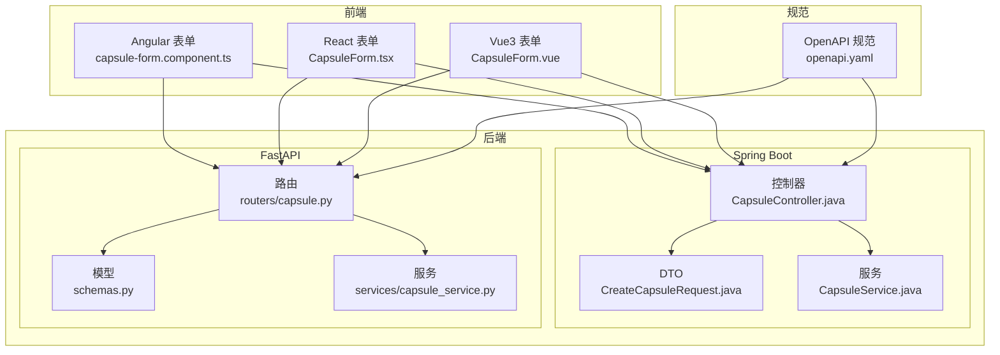
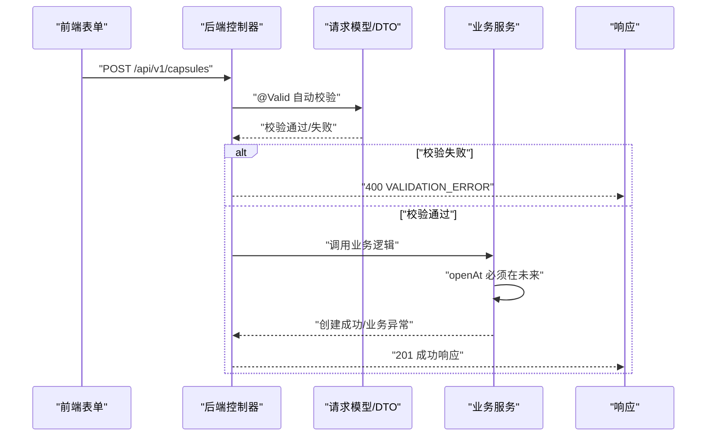
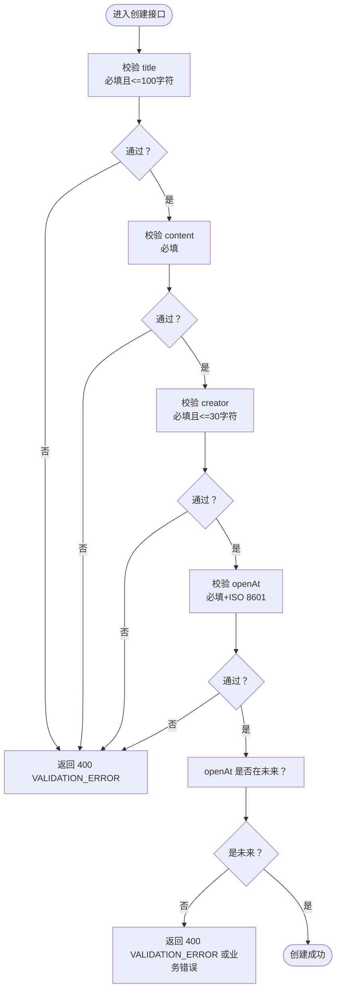
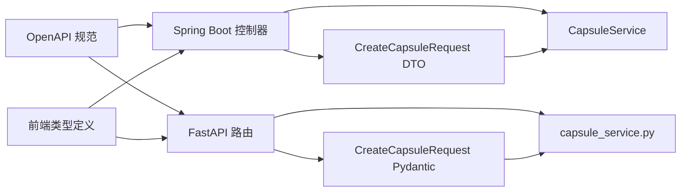

# 请求验证规则

<cite>
**本文引用的文件**
- [backends/spring-boot/src/main/java/com/hellotime/dto/CreateCapsuleRequest.java](file://backends/spring-boot/src/main/java/com/hellotime/dto/CreateCapsuleRequest.java)
- [backends/spring-boot/src/main/java/com/hellotime/controller/CapsuleController.java](file://backends/spring-boot/src/main/java/com/hellotime/controller/CapsuleController.java)
- [backends/spring-boot/src/main/java/com/hellotime/service/CapsuleService.java](file://backends/spring-boot/src/main/java/com/hellotime/service/CapsuleService.java)
- [backends/fastapi/app/routers/capsule.py](file://backends/fastapi/app/routers/capsule.py)
- [backends/fastapi/app/schemas.py](file://backends/fastapi/app/schemas.py)
- [backends/fastapi/app/services/capsule_service.py](file://backends/fastapi/app/services/capsule_service.py)
- [spec/api/openapi.yaml](file://spec/api/openapi.yaml)
- [frontends/angular-ts/src/app/components/capsule-form/capsule-form.component.ts](file://frontends/angular-ts/src/app/components/capsule-form/capsule-form.component.ts)
- [frontends/react-ts/src/components/CapsuleForm.tsx](file://frontends/react-ts/src/components/CapsuleForm.tsx)
- [frontends/vue3-ts/src/components/CapsuleForm.vue](file://frontends/vue3-ts/src/components/CapsuleForm.vue)
- [frontends/angular-ts/src/app/types/index.ts](file://frontends/angular-ts/src/app/types/index.ts)
- [frontends/react-ts/src/types/index.ts](file://frontends/react-ts/src/types/index.ts)
- [frontends/vue3-ts/src/types/index.ts](file://frontends/vue3-ts/src/types/index.ts)
- [backends/spring-boot/src/test/java/com/hellotime/controller/CapsuleControllerTest.java](file://backends/spring-boot/src/test/java/com/hellotime/controller/CapsuleControllerTest.java)
- [backends/fastapi/tests/test_capsule_api.py](file://backends/fastapi/tests/test_capsule_api.py)
</cite>

## 目录
1. [简介](#简介)
2. [项目结构](#项目结构)
3. [核心组件](#核心组件)
4. [架构总览](#架构总览)
5. [详细组件分析](#详细组件分析)
6. [依赖分析](#依赖分析)
7. [性能考虑](#性能考虑)
8. [故障排查指南](#故障排查指南)
9. [结论](#结论)
10. [附录](#附录)

## 简介
本文件系统性梳理 HelloTime 时间胶囊项目的请求参数验证规则，覆盖以下要点：
- 所有接口的输入参数验证规则：必填字段、数据类型、长度限制、格式要求
- 时间胶囊创建接口的参数验证细节：title 最大长度 100、creator 最大长度 30、openAt 日期时间格式与未来时间约束
- 路径参数 code 的 8 位字母数字格式验证
- 查询参数 page 与 size 的默认值与取值范围
- 各种验证失败场景的错误响应示例
- 前端表单验证与后端验证的对应关系

## 项目结构
本项目采用前后端分离架构，后端提供两套实现（Spring Boot 与 FastAPI），前端提供 Angular/React/Vue 三种实现。验证规则在后端通过 DTO/Pydantic 模型与控制器层注解完成，同时由 OpenAPI 规范统一约束。

图表来源
- [backends/spring-boot/src/main/java/com/hellotime/controller/CapsuleController.java:17-56](file://backends/spring-boot/src/main/java/com/hellotime/controller/CapsuleController.java#L17-L56)
- [backends/fastapi/app/routers/capsule.py:6-30](file://backends/fastapi/app/routers/capsule.py#L6-L30)
- [spec/api/openapi.yaml:10-74](file://spec/api/openapi.yaml#L10-L74)

章节来源
- [backends/spring-boot/src/main/java/com/hellotime/controller/CapsuleController.java:17-56](file://backends/spring-boot/src/main/java/com/hellotime/controller/CapsuleController.java#L17-L56)
- [backends/fastapi/app/routers/capsule.py:6-30](file://backends/fastapi/app/routers/capsule.py#L6-L30)
- [spec/api/openapi.yaml:10-74](file://spec/api/openapi.yaml#L10-L74)

## 核心组件
- Spring Boot 验证链路
  - 控制器层使用 @Valid 进行参数校验
  - DTO 中使用 Jakarta Validation 注解声明约束
  - 服务层补充业务校验（如 openAt 必须在未来）
- FastAPI 验证链路
  - Pydantic 模型声明字段约束与序列化别名
  - 路由层接收 Pydantic 模型自动校验
  - 服务层补充业务校验（如 openAt 必须在未来）
- OpenAPI 规范
  - 明确路径参数 code 的正则格式
  - 明确查询参数 page 与 size 的默认值与类型
  - 明确创建接口的必填字段与格式约束

章节来源
- [backends/spring-boot/src/main/java/com/hellotime/dto/CreateCapsuleRequest.java:13-44](file://backends/spring-boot/src/main/java/com/hellotime/dto/CreateCapsuleRequest.java#L13-L44)
- [backends/spring-boot/src/main/java/com/hellotime/controller/CapsuleController.java:37-42](file://backends/spring-boot/src/main/java/com/hellotime/controller/CapsuleController.java#L37-L42)
- [backends/spring-boot/src/main/java/com/hellotime/service/CapsuleService.java:48-69](file://backends/spring-boot/src/main/java/com/hellotime/service/CapsuleService.java#L48-L69)
- [backends/fastapi/app/schemas.py:26-44](file://backends/fastapi/app/schemas.py#L26-L44)
- [backends/fastapi/app/routers/capsule.py:17-24](file://backends/fastapi/app/routers/capsule.py#L17-L24)
- [backends/fastapi/app/services/capsule_service.py:79-102](file://backends/fastapi/app/services/capsule_service.py#L79-L102)
- [spec/api/openapi.yaml:24-74](file://spec/api/openapi.yaml#L24-L74)

## 架构总览
下图展示了“创建时间胶囊”请求从前端到后端的完整验证流程，包括前端表单本地校验与后端严格校验的协同。

图表来源
- [backends/spring-boot/src/main/java/com/hellotime/controller/CapsuleController.java:37-42](file://backends/spring-boot/src/main/java/com/hellotime/controller/CapsuleController.java#L37-L42)
- [backends/spring-boot/src/main/java/com/hellotime/dto/CreateCapsuleRequest.java:19-43](file://backends/spring-boot/src/main/java/com/hellotime/dto/CreateCapsuleRequest.java#L19-L43)
- [backends/spring-boot/src/main/java/com/hellotime/service/CapsuleService.java:48-69](file://backends/spring-boot/src/main/java/com/hellotime/service/CapsuleService.java#L48-L69)
- [backends/fastapi/app/routers/capsule.py:17-24](file://backends/fastapi/app/routers/capsule.py#L17-L24)
- [backends/fastapi/app/schemas.py:26-44](file://backends/fastapi/app/schemas.py#L26-L44)
- [backends/fastapi/app/services/capsule_service.py:79-102](file://backends/fastapi/app/services/capsule_service.py#L79-L102)

## 详细组件分析

### 接口与参数总览
- 创建时间胶囊
  - 方法与路径：POST /api/v1/capsules
  - 请求体：CreateCapsuleRequest
  - 必填字段：title、content、creator、openAt
  - 字段长度与格式：
    - title：必填，最多 100 字符
    - content：必填
    - creator：必填，最多 30 字符
    - openAt：必填，ISO 8601 日期时间字符串；业务上必须在未来
- 查询时间胶囊
  - 方法与路径：GET /api/v1/capsules/{code}
  - 路径参数 code：8 位字母数字（A-Z, a-z, 0-9），OpenAPI 正则约束
- 管理员分页查询（额外接口）
  - 方法与路径：GET /api/v1/admin/capsules
  - 查询参数：
    - page：整数，默认 0
    - size：整数，默认 20

章节来源
- [spec/api/openapi.yaml:24-74](file://spec/api/openapi.yaml#L24-L74)
- [backends/spring-boot/src/main/java/com/hellotime/dto/CreateCapsuleRequest.java:19-43](file://backends/spring-boot/src/main/java/com/hellotime/dto/CreateCapsuleRequest.java#L19-L43)
- [backends/fastapi/app/schemas.py:29-32](file://backends/fastapi/app/schemas.py#L29-L32)
- [backends/fastapi/app/services/capsule_service.py:81-84](file://backends/fastapi/app/services/capsule_service.py#L81-L84)

### 创建时间胶囊：参数验证规则
- 字段级约束
  - title
    - 必填：非空且非空白
    - 长度：最多 100 字符
  - content
    - 必填：非空且非空白
  - creator
    - 必填：非空且非空白
    - 长度：最多 30 字符
  - openAt
    - 必填：非空
    - 格式：ISO 8601 字符串（支持 Z 结尾或带时区偏移）
    - 业务约束：必须在未来时间
- 后端实现位置
  - Spring Boot：DTO 注解 + 服务层业务校验
  - FastAPI：Pydantic 字段约束 + 服务层业务校验
- 前端表单验证映射
  - Angular/React/Vue 均实现相同规则：必填校验、长度限制、未来时间校验

图表来源
- [backends/spring-boot/src/main/java/com/hellotime/dto/CreateCapsuleRequest.java:19-43](file://backends/spring-boot/src/main/java/com/hellotime/dto/CreateCapsuleRequest.java#L19-L43)
- [backends/spring-boot/src/main/java/com/hellotime/service/CapsuleService.java:48-69](file://backends/spring-boot/src/main/java/com/hellotime/service/CapsuleService.java#L48-L69)
- [backends/fastapi/app/schemas.py:29-44](file://backends/fastapi/app/schemas.py#L29-L44)
- [backends/fastapi/app/services/capsule_service.py:81-84](file://backends/fastapi/app/services/capsule_service.py#L81-L84)

章节来源
- [backends/spring-boot/src/main/java/com/hellotime/dto/CreateCapsuleRequest.java:19-43](file://backends/spring-boot/src/main/java/com/hellotime/dto/CreateCapsuleRequest.java#L19-L43)
- [backends/spring-boot/src/main/java/com/hellotime/service/CapsuleService.java:48-69](file://backends/spring-boot/src/main/java/com/hellotime/service/CapsuleService.java#L48-L69)
- [backends/fastapi/app/schemas.py:29-44](file://backends/fastapi/app/schemas.py#L29-L44)
- [backends/fastapi/app/services/capsule_service.py:79-102](file://backends/fastapi/app/services/capsule_service.py#L79-L102)

### 路径参数 code 的验证
- 格式要求：8 位字母数字（A-Z, a-z, 0-9）
- OpenAPI 规范中以正则表达式约束
- 后端控制器直接接收字符串参数，未做二次校验（通常由框架处理）

章节来源
- [spec/api/openapi.yaml:54-60](file://spec/api/openapi.yaml#L54-L60)
- [backends/spring-boot/src/main/java/com/hellotime/controller/CapsuleController.java:51-55](file://backends/spring-boot/src/main/java/com/hellotime/controller/CapsuleController.java#L51-L55)
- [backends/fastapi/app/routers/capsule.py:27-30](file://backends/fastapi/app/routers/capsule.py#L27-L30)

### 查询参数 page 与 size 的默认值与取值范围
- page：整数，默认 0
- size：整数，默认 20
- 后端实现中 size 默认值为 20，page 默认 0（Spring Boot 与 FastAPI 均如此）

章节来源
- [spec/api/openapi.yaml:107-117](file://spec/api/openapi.yaml#L107-L117)
- [backends/fastapi/app/services/capsule_service.py:114-134](file://backends/fastapi/app/services/capsule_service.py#L114-L134)

### 前端表单验证与后端验证的对应关系
- Angular
  - 必填：标题/内容/发布者/开启时间均需填写
  - 长度：title 最多 100，creator 最多 30
  - 未来时间：开启时间不得早于当前时间
- React
  - 必填：同上
  - 长度：title 最多 100，creator 最多 30
  - 未来时间：开启时间不得早于当前时间
- Vue3
  - 必填：同上
  - 长度：title 最多 100，creator 最多 30
  - 未来时间：开启时间不得早于当前时间

章节来源
- [frontends/angular-ts/src/app/components/capsule-form/capsule-form.component.ts:36-60](file://frontends/angular-ts/src/app/components/capsule-form/capsule-form.component.ts#L36-L60)
- [frontends/react-ts/src/components/CapsuleForm.tsx:30-55](file://frontends/react-ts/src/components/CapsuleForm.tsx#L30-L55)
- [frontends/vue3-ts/src/components/CapsuleForm.vue:95-122](file://frontends/vue3-ts/src/components/CapsuleForm.vue#L95-L122)
- [frontends/angular-ts/src/app/types/index.ts:16-21](file://frontends/angular-ts/src/app/types/index.ts#L16-L21)
- [frontends/react-ts/src/types/index.ts:24-29](file://frontends/react-ts/src/types/index.ts#L24-L29)
- [frontends/vue3-ts/src/types/index.ts:24-29](file://frontends/vue3-ts/src/types/index.ts#L24-L29)

### 错误响应示例与场景
- 参数缺失（400）
  - 场景：请求体缺少必填字段
  - 响应：success=false，errorCode=VALIDATION_ERROR
  - 测试验证：Spring Boot 与 FastAPI 均覆盖该场景
- 开启时间无效（400 或业务错误）
  - 场景：openAt 早于当前时间
  - 响应：success=false，可能携带 errorCode（如 VALIDATION_ERROR 或业务错误）
  - 测试验证：Spring Boot 与 FastAPI 均覆盖该场景
- 胶囊不存在（404）
  - 场景：查询不存在的 code
  - 响应：success=false，errorCode=CAPSULE_NOT_FOUND
  - 测试验证：Spring Boot 与 FastAPI 均覆盖该场景
- 未开启胶囊隐藏内容（200）
  - 场景：查询未到开启时间的胶囊
  - 响应：data.content=null 或不存在 content 字段
  - 测试验证：Spring Boot 与 FastAPI 均覆盖该场景

章节来源
- [backends/spring-boot/src/test/java/com/hellotime/controller/CapsuleControllerTest.java:55-71](file://backends/spring-boot/src/test/java/com/hellotime/controller/CapsuleControllerTest.java#L55-L71)
- [backends/fastapi/tests/test_capsule_api.py:33-51](file://backends/fastapi/tests/test_capsule_api.py#L33-L51)
- [backends/spring-boot/src/main/java/com/hellotime/service/CapsuleService.java:79-83](file://backends/spring-boot/src/main/java/com/hellotime/service/CapsuleService.java#L79-L83)
- [backends/fastapi/app/services/capsule_service.py:105-111](file://backends/fastapi/app/services/capsule_service.py#L105-L111)

## 依赖分析
- 控制器依赖模型/DTO
  - Spring Boot：@Valid 依赖 DTO 注解
  - FastAPI：路由直接接收 Pydantic 模型
- 模型依赖业务规则
  - openAt 必须在未来：由服务层统一校验
- OpenAPI 作为契约
  - 统一约束路径参数格式与查询参数默认值
- 前端依赖类型定义
  - TypeScript 类型与后端响应保持一致，便于表单校验与提示

图表来源
- [backends/spring-boot/src/main/java/com/hellotime/controller/CapsuleController.java:37-42](file://backends/spring-boot/src/main/java/com/hellotime/controller/CapsuleController.java#L37-L42)
- [backends/spring-boot/src/main/java/com/hellotime/dto/CreateCapsuleRequest.java:13-44](file://backends/spring-boot/src/main/java/com/hellotime/dto/CreateCapsuleRequest.java#L13-L44)
- [backends/spring-boot/src/main/java/com/hellotime/service/CapsuleService.java:48-69](file://backends/spring-boot/src/main/java/com/hellotime/service/CapsuleService.java#L48-L69)
- [backends/fastapi/app/routers/capsule.py:17-24](file://backends/fastapi/app/routers/capsule.py#L17-L24)
- [backends/fastapi/app/schemas.py:26-44](file://backends/fastapi/app/schemas.py#L26-L44)
- [backends/fastapi/app/services/capsule_service.py:79-102](file://backends/fastapi/app/services/capsule_service.py#L79-L102)
- [spec/api/openapi.yaml:24-74](file://spec/api/openapi.yaml#L24-L74)
- [frontends/react-ts/src/types/index.ts:24-29](file://frontends/react-ts/src/types/index.ts#L24-L29)

章节来源
- [backends/spring-boot/src/main/java/com/hellotime/controller/CapsuleController.java:37-42](file://backends/spring-boot/src/main/java/com/hellotime/controller/CapsuleController.java#L37-L42)
- [backends/fastapi/app/routers/capsule.py:17-24](file://backends/fastapi/app/routers/capsule.py#L17-L24)
- [spec/api/openapi.yaml:24-74](file://spec/api/openapi.yaml#L24-L74)

## 性能考虑
- 前端本地校验可减少无效请求，提升用户体验与后端吞吐
- 后端统一在 DTO/Pydantic 层进行格式与长度校验，避免重复逻辑
- 业务校验（openAt 未来）仅在必要时执行，避免不必要的计算

## 故障排查指南
- 400 VALIDATION_ERROR
  - 检查必填字段是否缺失
  - 检查字符串长度是否超限
  - 检查 openAt 是否为合法 ISO 8601 格式
  - 检查开启时间是否在未来
- 404 CAPSULE_NOT_FOUND
  - 检查 code 是否正确（8 位字母数字）
  - 检查是否使用了正确的环境与服务实例
- 未开启胶囊 content 为空
  - 属于预期行为，等待到达 openAt 后再次查询

章节来源
- [backends/spring-boot/src/test/java/com/hellotime/controller/CapsuleControllerTest.java:55-71](file://backends/spring-boot/src/test/java/com/hellotime/controller/CapsuleControllerTest.java#L55-L71)
- [backends/fastapi/tests/test_capsule_api.py:33-51](file://backends/fastapi/tests/test_capsule_api.py#L33-L51)
- [backends/spring-boot/src/main/java/com/hellotime/service/CapsuleService.java:79-83](file://backends/spring-boot/src/main/java/com/hellotime/service/CapsuleService.java#L79-L83)
- [backends/fastapi/app/services/capsule_service.py:105-111](file://backends/fastapi/app/services/capsule_service.py#L105-L111)

## 结论
本项目在前后端均实现了严格的请求参数验证：
- 必填字段、长度限制、格式约束由后端统一保障
- 前端表单验证与后端规则一一对应，提升一致性与可用性
- OpenAPI 规范明确了契约与默认值，便于联调与扩展
- 业务校验（openAt 必须在未来）在服务层集中实现，避免绕过

## 附录
- 关键实现与规范文件索引
  - Spring Boot：控制器、DTO、服务、测试
  - FastAPI：路由、模型、服务、测试
  - OpenAPI：契约与默认值
  - 前端类型与表单组件

章节来源
- [backends/spring-boot/src/main/java/com/hellotime/controller/CapsuleController.java:37-42](file://backends/spring-boot/src/main/java/com/hellotime/controller/CapsuleController.java#L37-L42)
- [backends/spring-boot/src/main/java/com/hellotime/dto/CreateCapsuleRequest.java:19-43](file://backends/spring-boot/src/main/java/com/hellotime/dto/CreateCapsuleRequest.java#L19-L43)
- [backends/spring-boot/src/main/java/com/hellotime/service/CapsuleService.java:48-69](file://backends/spring-boot/src/main/java/com/hellotime/service/CapsuleService.java#L48-L69)
- [backends/fastapi/app/routers/capsule.py:17-24](file://backends/fastapi/app/routers/capsule.py#L17-L24)
- [backends/fastapi/app/schemas.py:29-44](file://backends/fastapi/app/schemas.py#L29-L44)
- [backends/fastapi/app/services/capsule_service.py:79-102](file://backends/fastapi/app/services/capsule_service.py#L79-L102)
- [spec/api/openapi.yaml:24-74](file://spec/api/openapi.yaml#L24-L74)
- [frontends/angular-ts/src/app/components/capsule-form/capsule-form.component.ts:36-60](file://frontends/angular-ts/src/app/components/capsule-form/capsule-form.component.ts#L36-L60)
- [frontends/react-ts/src/components/CapsuleForm.tsx:30-55](file://frontends/react-ts/src/components/CapsuleForm.tsx#L30-L55)
- [frontends/vue3-ts/src/components/CapsuleForm.vue:95-122](file://frontends/vue3-ts/src/components/CapsuleForm.vue#L95-L122)
- [frontends/angular-ts/src/app/types/index.ts:16-21](file://frontends/angular-ts/src/app/types/index.ts#L16-L21)
- [frontends/react-ts/src/types/index.ts:24-29](file://frontends/react-ts/src/types/index.ts#L24-L29)
- [frontends/vue3-ts/src/types/index.ts:24-29](file://frontends/vue3-ts/src/types/index.ts#L24-L29)
- [backends/spring-boot/src/test/java/com/hellotime/controller/CapsuleControllerTest.java:55-71](file://backends/spring-boot/src/test/java/com/hellotime/controller/CapsuleControllerTest.java#L55-L71)
- [backends/fastapi/tests/test_capsule_api.py:33-51](file://backends/fastapi/tests/test_capsule_api.py#L33-L51)