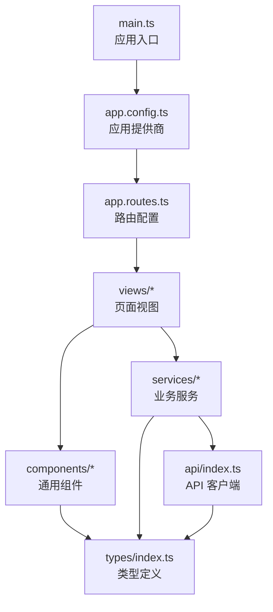
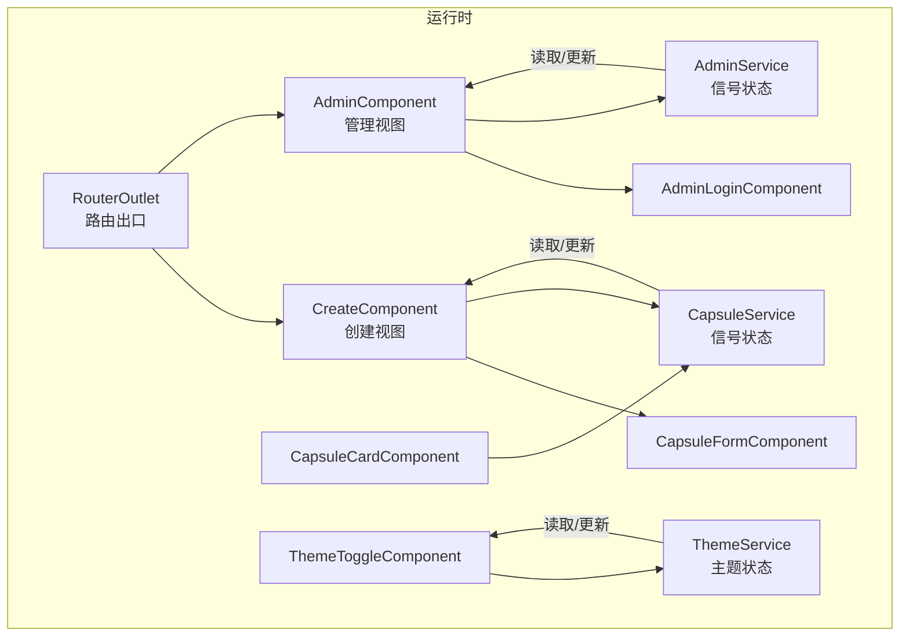
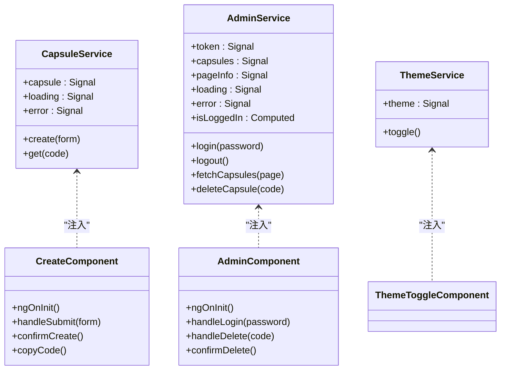
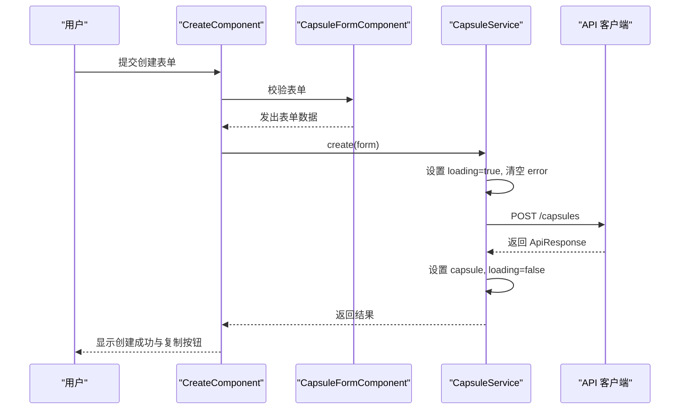
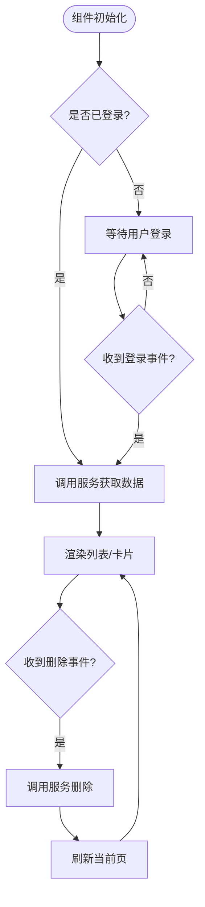
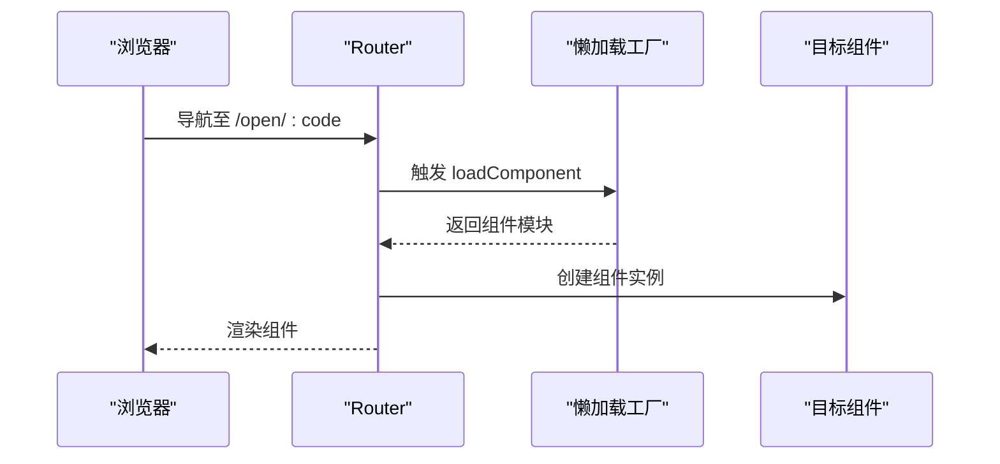
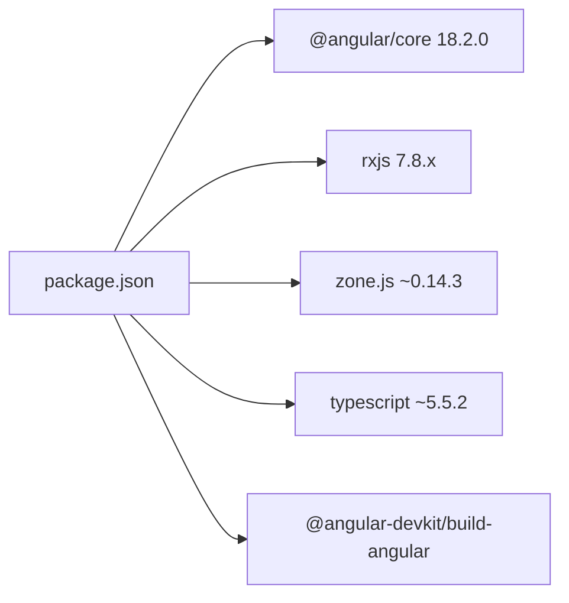

# Angular 实现

<cite>
**本文引用的文件**
- [package.json](file://frontends/angular-ts/package.json)
- [angular.json](file://frontends/angular-ts/angular.json)
- [main.ts](file://frontends/angular-ts/src/main.ts)
- [app.config.ts](file://frontends/angular-ts/src/app/app.config.ts)
- [app.component.ts](file://frontends/angular-ts/src/app/app.component.ts)
- [app.routes.ts](file://frontends/angular-ts/src/app/app.routes.ts)
- [types/index.ts](file://frontends/angular-ts/src/app/types/index.ts)
- [api/index.ts](file://frontends/angular-ts/src/app/api/index.ts)
- [services/capsule.service.ts](file://frontends/angular-ts/src/app/services/capsule.service.ts)
- [services/admin.service.ts](file://frontends/angular-ts/src/app/services/admin.service.ts)
- [services/theme.service.ts](file://frontends/angular-ts/src/app/services/theme.service.ts)
- [views/create/create.component.ts](file://frontends/angular-ts/src/app/views/create/create.component.ts)
- [views/admin/admin.component.ts](file://frontends/angular-ts/src/app/views/admin/admin.component.ts)
- [components/capsule-form/capsule-form.component.ts](file://frontends/angular-ts/src/app/components/capsule-form/capsule-form.component.ts)
- [components/admin-login/admin-login.component.ts](file://frontends/angular-ts/src/app/components/admin-login/admin-login.component.ts)
- [components/capsule-card/capsule-card.component.ts](file://frontends/angular-ts/src/app/components/capsule-card/capsule-card.component.ts)
- [components/theme-toggle/theme-toggle.component.ts](file://frontends/angular-ts/src/app/components/theme-toggle/theme-toggle.component.ts)
- [tsconfig.json](file://frontends/angular-ts/tsconfig.json)
</cite>

## 目录
1. [简介](#简介)
2. [项目结构](#项目结构)
3. [核心组件](#核心组件)
4. [架构总览](#架构总览)
5. [详细组件分析](#详细组件分析)
6. [依赖分析](#依赖分析)
7. [性能考虑](#性能考虑)
8. [故障排查指南](#故障排查指南)
9. [结论](#结论)
10. [附录](#附录)

## 简介
本文件面向 Angular 18 的 TypeScript 实现，聚焦以下主题：
- Signals 响应式模型与使用场景：包括 signal、computed、effect 的应用，以及在服务与组件中的状态管理实践。
- 依赖注入系统：服务注册方式、作用域与生命周期管理。
- 组件架构：组件通信（输入/输出）、生命周期钩子、模板绑定与表单处理。
- 路由系统：路由配置、懒加载与组件输入绑定。
- Angular 装饰器最佳实践：@Component、@Injectable 等。
- TypeScript 深度集成：类型安全的模板绑定与 API 客户端。
- 服务层设计模式、表单处理策略与设计系统集成。

## 项目结构
Angular 应用采用 Angular CLI 默认目录结构，核心入口与配置如下：
- 入口脚本：通过 main.ts 启动应用并传入应用配置。
- 应用配置：集中提供路由、HTTP 客户端与动画支持。
- 路由配置：声明式路由与按需懒加载组件。
- 类型定义：统一的数据契约与分页结构。
- API 客户端：封装基础请求、鉴权头与错误处理。
- 服务层：以 Signals 为核心的状态管理与副作用处理。
- 视图与组件：页面视图与可复用 UI 组件。

图表来源
- [main.ts:1-7](file://frontends/angular-ts/src/main.ts#L1-L7)
- [app.config.ts:1-14](file://frontends/angular-ts/src/app/app.config.ts#L1-L14)
- [app.routes.ts:1-35](file://frontends/angular-ts/src/app/app.routes.ts#L1-L35)

章节来源
- [package.json:1-38](file://frontends/angular-ts/package.json#L1-L38)
- [angular.json:1-108](file://frontends/angular-ts/angular.json#L1-L108)
- [main.ts:1-7](file://frontends/angular-ts/src/main.ts#L1-L7)
- [app.config.ts:1-14](file://frontends/angular-ts/src/app/app.config.ts#L1-L14)
- [app.routes.ts:1-35](file://frontends/angular-ts/src/app/app.routes.ts#L1-L35)
- [tsconfig.json:1-9](file://frontends/angular-ts/tsconfig.json#L1-L9)

## 核心组件
- 应用根组件：负责挂载路由出口与全局头部/尾部。
- 页面视图组件：Home、Create、Open、About、Admin。
- 可复用组件：表单、卡片、登录、主题切换、倒计时等。
- 服务层：CapsuleService、AdminService、ThemeService。
- API 客户端：统一请求封装、鉴权头与错误处理。
- 类型系统：Capsule、CreateCapsuleForm、ApiResponse、PageData 等。

章节来源
- [app.component.ts:1-14](file://frontends/angular-ts/src/app/app.component.ts#L1-L14)
- [views/create/create.component.ts:1-54](file://frontends/angular-ts/src/app/views/create/create.component.ts#L1-L54)
- [views/admin/admin.component.ts:1-45](file://frontends/angular-ts/src/app/views/admin/admin.component.ts#L1-L45)
- [services/capsule.service.ts:1-41](file://frontends/angular-ts/src/app/services/capsule.service.ts#L1-L41)
- [services/admin.service.ts:1-84](file://frontends/angular-ts/src/app/services/admin.service.ts#L1-L84)
- [services/theme.service.ts:1-28](file://frontends/angular-ts/src/app/services/theme.service.ts#L1-L28)
- [api/index.ts:1-71](file://frontends/angular-ts/src/app/api/index.ts#L1-L71)
- [types/index.ts:1-53](file://frontends/angular-ts/src/app/types/index.ts#L1-L53)

## 架构总览
应用采用“组件驱动 + 服务状态 + API 客户端”的分层架构。路由负责页面级懒加载；服务层以 Signals 管理状态与副作用；组件通过输入/输出与服务交互；类型系统贯穿模板与服务调用，确保类型安全。

图表来源
- [app.component.ts:1-14](file://frontends/angular-ts/src/app/app.component.ts#L1-L14)
- [views/create/create.component.ts:1-54](file://frontends/angular-ts/src/app/views/create/create.component.ts#L1-L54)
- [views/admin/admin.component.ts:1-45](file://frontends/angular-ts/src/app/views/admin/admin.component.ts#L1-L45)
- [services/capsule.service.ts:1-41](file://frontends/angular-ts/src/app/services/capsule.service.ts#L1-L41)
- [services/admin.service.ts:1-84](file://frontends/angular-ts/src/app/services/admin.service.ts#L1-L84)
- [services/theme.service.ts:1-28](file://frontends/angular-ts/src/app/services/theme.service.ts#L1-L28)
- [components/capsule-form/capsule-form.component.ts:1-68](file://frontends/angular-ts/src/app/components/capsule-form/capsule-form.component.ts#L1-L68)
- [components/admin-login/admin-login.component.ts:1-24](file://frontends/angular-ts/src/app/components/admin-login/admin-login.component.ts#L1-L24)
- [components/capsule-card/capsule-card.component.ts:1-27](file://frontends/angular-ts/src/app/components/capsule-card/capsule-card.component.ts#L1-L27)
- [components/theme-toggle/theme-toggle.component.ts:1-14](file://frontends/angular-ts/src/app/components/theme-toggle/theme-toggle.component.ts#L1-L14)

## 详细组件分析

### 依赖注入系统与生命周期
- 服务注册与作用域
  - 根级提供：通过 @Injectable({ providedIn: 'root' }) 注册，全局单例。
  - 视图内提供：CreateComponent 在本地 providers 中注册服务实例，实现视图级隔离。
- 生命周期管理
  - 组件生命周期：OnInit 钩子用于初始化数据拉取。
  - 服务副作用：ThemeService 使用 effect 进行响应式 DOM 属性与本地存储同步。

图表来源
- [services/capsule.service.ts:1-41](file://frontends/angular-ts/src/app/services/capsule.service.ts#L1-L41)
- [services/admin.service.ts:1-84](file://frontends/angular-ts/src/app/services/admin.service.ts#L1-L84)
- [services/theme.service.ts:1-28](file://frontends/angular-ts/src/app/services/theme.service.ts#L1-L28)
- [views/create/create.component.ts:1-54](file://frontends/angular-ts/src/app/views/create/create.component.ts#L1-L54)
- [views/admin/admin.component.ts:1-45](file://frontends/angular-ts/src/app/views/admin/admin.component.ts#L1-L45)
- [components/theme-toggle/theme-toggle.component.ts:1-14](file://frontends/angular-ts/src/app/components/theme-toggle/theme-toggle.component.ts#L1-L14)

章节来源
- [services/capsule.service.ts:5-24](file://frontends/angular-ts/src/app/services/capsule.service.ts#L5-L24)
- [services/admin.service.ts:7-40](file://frontends/angular-ts/src/app/services/admin.service.ts#L7-L40)
- [services/theme.service.ts:6-22](file://frontends/angular-ts/src/app/services/theme.service.ts#L6-L22)
- [views/create/create.component.ts:12-25](file://frontends/angular-ts/src/app/views/create/create.component.ts#L12-L25)
- [views/admin/admin.component.ts:14-24](file://frontends/angular-ts/src/app/views/admin/admin.component.ts#L14-L24)

### Signals 响应式模型与使用场景
- 状态建模
  - CapsuleService：使用 signal 管理当前胶囊、加载态与错误信息。
  - AdminService：使用 signal 管理令牌、列表、分页信息与加载/错误状态，并通过 computed 表达登录态。
  - ThemeService：使用 signal 管理主题，并通过 effect 同步到 DOM 与本地存储。
- 副作用与异步流程
  - 服务方法中统一设置 loading/error，在 finally 中收尾，避免重复逻辑。
  - 组件订阅服务的 signal 并驱动模板渲染与交互反馈。
- 使用建议
  - 将 UI 状态与业务状态分离，优先使用 signal/computed，减少样板代码。
  - 对于跨组件共享的状态，推荐根级提供与 effect 同步。

图表来源
- [views/create/create.component.ts:27-42](file://frontends/angular-ts/src/app/views/create/create.component.ts#L27-L42)
- [components/capsule-form/capsule-form.component.ts:36-66](file://frontends/angular-ts/src/app/components/capsule-form/capsule-form.component.ts#L36-L66)
- [services/capsule.service.ts:11-24](file://frontends/angular-ts/src/app/services/capsule.service.ts#L11-L24)
- [api/index.ts:29-37](file://frontends/angular-ts/src/app/api/index.ts#L29-L37)

章节来源
- [services/capsule.service.ts:7-24](file://frontends/angular-ts/src/app/services/capsule.service.ts#L7-L24)
- [services/admin.service.ts:9-25](file://frontends/angular-ts/src/app/services/admin.service.ts#L9-L25)
- [services/theme.service.ts:10-22](file://frontends/angular-ts/src/app/services/theme.service.ts#L10-L22)

### 组件架构设计
- 组件通信
  - 输入/输出：CapsuleFormComponent、AdminLoginComponent 通过 @Input/@Output 接受父组件状态与事件。
  - 事件发射：子组件向父组件传递表单数据或登录密码，父组件触发服务调用。
- 生命周期钩子
  - AdminComponent.ngOnInit：在已登录状态下自动拉取数据。
  - CreateComponent：在提交确认后进行创建与结果展示。
- 模板绑定与类型安全
  - 所有输入输出均基于强类型接口，确保模板与组件属性一致。
  - 表单控件双向绑定结合验证逻辑，提升用户体验与可靠性。

图表来源
- [views/admin/admin.component.ts:20-43](file://frontends/angular-ts/src/app/views/admin/admin.component.ts#L20-L43)
- [services/admin.service.ts:48-67](file://frontends/angular-ts/src/app/services/admin.service.ts#L48-L67)

章节来源
- [components/capsule-form/capsule-form.component.ts:1-68](file://frontends/angular-ts/src/app/components/capsule-form/capsule-form.component.ts#L1-L68)
- [components/admin-login/admin-login.component.ts:1-24](file://frontends/angular-ts/src/app/components/admin-login/admin-login.component.ts#L1-L24)
- [views/admin/admin.component.ts:14-44](file://frontends/angular-ts/src/app/views/admin/admin.component.ts#L14-L44)

### 路由系统与懒加载
- 路由配置
  - routes 定义了首页、创建、打开、关于、管理等路径。
  - 使用 loadComponent 实现按需懒加载，提升首屏性能。
- 组件输入绑定
  - app.config 中启用 withComponentInputBinding，使路由参数可直接作为组件输入属性使用。

图表来源
- [app.routes.ts:14-18](file://frontends/angular-ts/src/app/app.routes.ts#L14-L18)
- [app.config.ts:9](file://frontends/angular-ts/src/app/app.config.ts#L9)

章节来源
- [app.routes.ts:1-35](file://frontends/angular-ts/src/app/app.routes.ts#L1-L35)
- [app.config.ts:7-12](file://frontends/angular-ts/src/app/app.config.ts#L7-L12)

### Angular 装饰器最佳实践
- @Component
  - standalone: true，减少 NgModule 复杂度。
  - imports: 明确导入依赖模块与子组件，便于维护。
  - 选择器与模板路径清晰，职责单一。
- @Injectable
  - 根级提供：ThemeService、AdminService、CapsuleService。
  - 视图内提供：CreateComponent 本地提供服务，避免跨视图污染。
- 最佳实践要点
  - 优先使用 standalone 组件与 Signals，简化依赖关系。
  - 将副作用放入服务，组件专注视图与交互。
  - 通过 effect 同步外部状态（DOM/Storage）。

章节来源
- [app.component.ts:6-13](file://frontends/angular-ts/src/app/app.component.ts#L6-L13)
- [services/capsule.service.ts:5](file://frontends/angular-ts/src/app/services/capsule.service.ts#L5)
- [services/admin.service.ts:7](file://frontends/angular-ts/src/app/services/admin.service.ts#L7)
- [services/theme.service.ts:6](file://frontends/angular-ts/src/app/services/theme.service.ts#L6)
- [views/create/create.component.ts:12](file://frontends/angular-ts/src/app/views/create/create.component.ts#L12)

### TypeScript 深度集成与类型安全
- 类型定义
  - Capsule、CreateCapsuleForm、ApiResponse、PageData 等统一定义，前后端契约一致。
- 模板绑定
  - 所有输入输出属性具备明确类型，编译期检查防止运行时错误。
- API 客户端
  - 泛型 request 函数确保响应类型安全；统一错误处理与鉴权头设置。

章节来源
- [types/index.ts:1-53](file://frontends/angular-ts/src/app/types/index.ts#L1-L53)
- [api/index.ts:10-27](file://frontends/angular-ts/src/app/api/index.ts#L10-L27)

### 服务层设计模式与表单处理策略
- 设计模式
  - 单一职责：每个服务专注一类业务（胶囊、管理员、主题）。
  - 响应式状态：以 signal/computed 管理 UI 状态与派生状态。
  - 副作用隔离：effect 负责与 DOM/Storage 的同步。
- 表单处理
  - 组件内校验：字段必填、时间有效性等。
  - 事件驱动：子组件通过事件向上游传递数据。
  - 服务编排：服务统一发起网络请求、更新状态与错误提示。

章节来源
- [components/capsule-form/capsule-form.component.ts:36-66](file://frontends/angular-ts/src/app/components/capsule-form/capsule-form.component.ts#L36-L66)
- [views/create/create.component.ts:27-42](file://frontends/angular-ts/src/app/views/create/create.component.ts#L27-L42)
- [services/capsule.service.ts:11-24](file://frontends/angular-ts/src/app/services/capsule.service.ts#L11-L24)

### 与设计系统的集成方法
- 主题系统
  - ThemeService 使用 signal 管理主题，effect 同步到 <html> 的 data-theme 属性与本地存储。
  - ThemeToggleComponent 仅负责触发切换，不关心状态细节，符合关注点分离。
- 样式组织
  - angular.json 中集中引入 tokens/base/components/layout 样式，便于设计系统落地。

章节来源
- [services/theme.service.ts:10-26](file://frontends/angular-ts/src/app/services/theme.service.ts#L10-L26)
- [components/theme-toggle/theme-toggle.component.ts:11-13](file://frontends/angular-ts/src/app/components/theme-toggle/theme-toggle.component.ts#L11-L13)
- [angular.json:39-46](file://frontends/angular-ts/angular.json#L39-L46)

## 依赖分析
- Angular 核心版本：18.2.0，配合 RxJS 7.8、Zone.js 与 TypeScript 5.5。
- 构建工具：Angular DevKit 与 Karma 测试栈。
- 运行时依赖：@angular/router、@angular/forms、@angular/common/http、@angular/platform-browser/animations。

图表来源
- [package.json:11-35](file://frontends/angular-ts/package.json#L11-L35)

章节来源
- [package.json:1-38](file://frontends/angular-ts/package.json#L1-L38)
- [angular.json:24-66](file://frontends/angular-ts/angular.json#L24-L66)

## 性能考虑
- 懒加载路由：按需加载页面组件，降低首屏体积与加载时间。
- Signals 替代变更检测：以细粒度状态更新替代脏检查，提升响应速度。
- 本地缓存与会话：ThemeService 与 AdminService 利用 localStorage/sessionStorage 缓存用户偏好与令牌，减少重复请求。
- 构建优化：生产环境启用输出哈希与预算告警，开发环境保留 SourceMap 便于调试。

章节来源
- [app.routes.ts:6-7](file://frontends/angular-ts/src/app/app.routes.ts#L6-L7)
- [services/theme.service.ts:10-14](file://frontends/angular-ts/src/app/services/theme.service.ts#L10-L14)
- [services/admin.service.ts:9-13](file://frontends/angular-ts/src/app/services/admin.service.ts#L9-L13)
- [angular.json:49-63](file://frontends/angular-ts/angular.json#L49-L63)

## 故障排查指南
- 请求失败与错误提示
  - API 客户端在非成功响应时抛出错误，服务层捕获并设置 error signal，组件订阅后显示提示。
- 加载态控制
  - 服务层在请求开始设置 loading=true，finally 中统一关闭，避免遗漏清理。
- 登录状态与令牌
  - AdminService 从 sessionStorage 读取令牌，登录成功写入；登出清除令牌与列表。
- 主题同步异常
  - ThemeService 通过 effect 同步 data-theme 与本地存储，若页面未生效，检查 DOM 属性与 localStorage 写入。

章节来源
- [api/index.ts:22-26](file://frontends/angular-ts/src/app/api/index.ts#L22-L26)
- [services/capsule.service.ts:18-23](file://frontends/angular-ts/src/app/services/capsule.service.ts#L18-L23)
- [services/admin.service.ts:32-39](file://frontends/angular-ts/src/app/services/admin.service.ts#L32-L39)
- [services/theme.service.ts:17-22](file://frontends/angular-ts/src/app/services/theme.service.ts#L17-L22)

## 结论
该 Angular 18 实现以 Signals 为核心，结合依赖注入、组件化与路由懒加载，构建了类型安全、可维护且高性能的前端应用。通过服务层统一状态与副作用、组件层专注视图与交互，配合设计系统与样式体系，形成清晰的架构分层与良好的扩展性。

## 附录
- 入口与配置
  - main.ts：应用启动入口。
  - app.config.ts：提供路由、HTTP 客户端与动画。
  - app.routes.ts：声明式路由与懒加载。
- 类型与 API
  - types/index.ts：统一数据契约。
  - api/index.ts：封装请求、鉴权与错误处理。
- 服务与组件
  - services/*：业务服务与状态管理。
  - components/*：可复用 UI 组件。
  - views/*：页面视图组件。

章节来源
- [main.ts:1-7](file://frontends/angular-ts/src/main.ts#L1-L7)
- [app.config.ts:1-14](file://frontends/angular-ts/src/app/app.config.ts#L1-L14)
- [app.routes.ts:1-35](file://frontends/angular-ts/src/app/app.routes.ts#L1-L35)
- [types/index.ts:1-53](file://frontends/angular-ts/src/app/types/index.ts#L1-L53)
- [api/index.ts:1-71](file://frontends/angular-ts/src/app/api/index.ts#L1-L71)