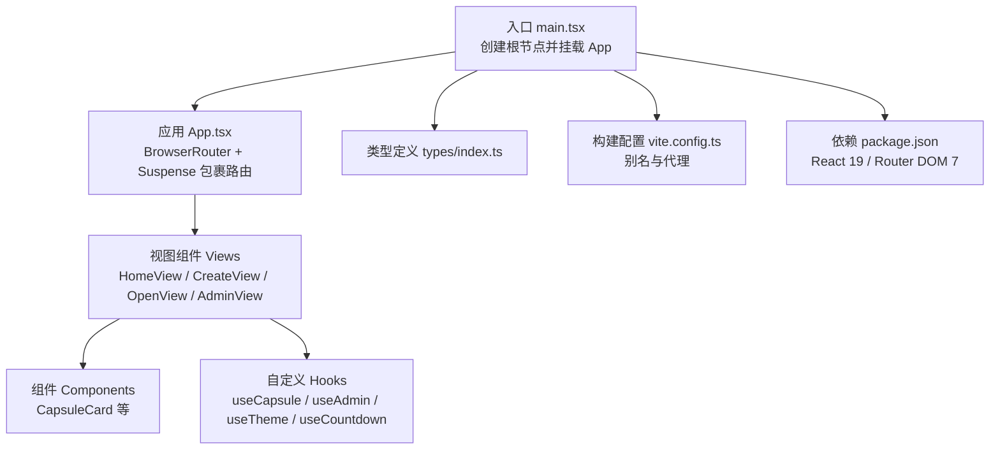
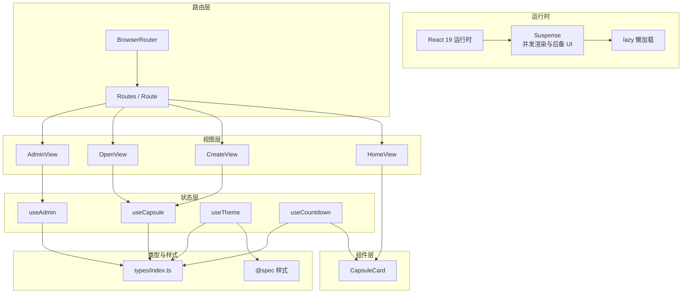
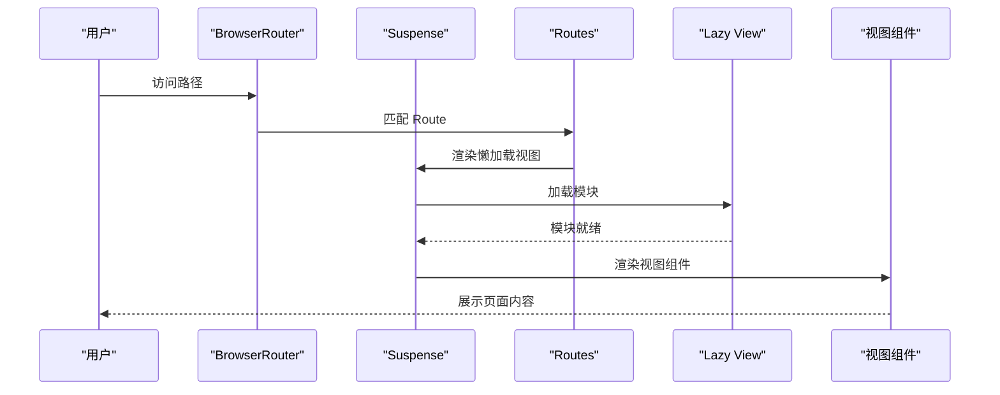
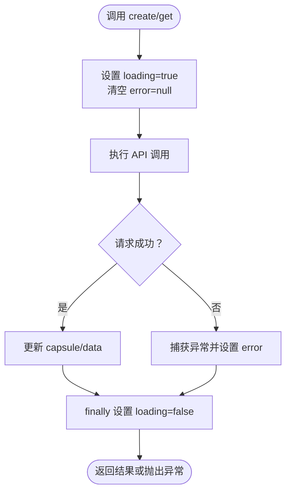
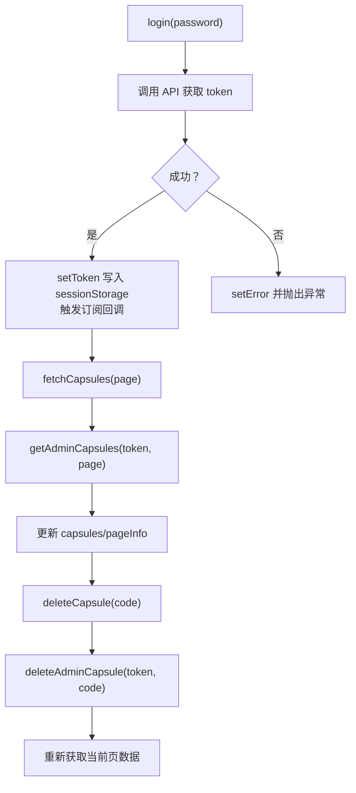
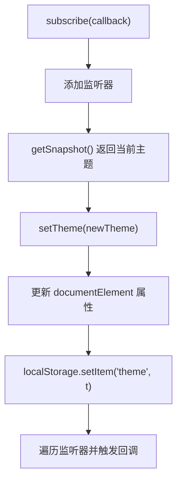
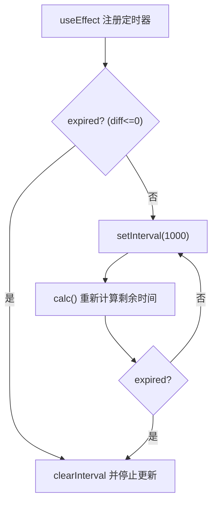
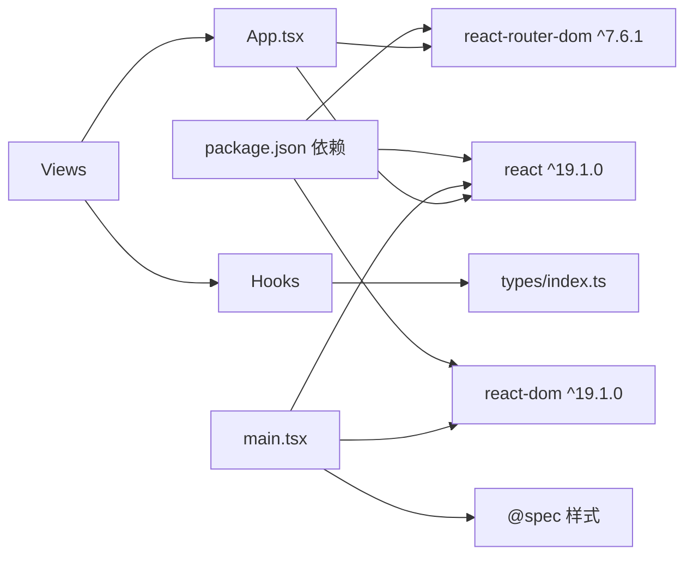

# React 实现

<cite>
**本文引用的文件**
- [package.json](file://frontends/react-ts/package.json)
- [vite.config.ts](file://frontends/react-ts/vite.config.ts)
- [tsconfig.json](file://frontends/react-ts/tsconfig.json)
- [src/main.tsx](file://frontends/react-ts/src/main.tsx)
- [src/App.tsx](file://frontends/react-ts/src/App.tsx)
- [src/hooks/useCapsule.ts](file://frontends/react-ts/src/hooks/useCapsule.ts)
- [src/hooks/useAdmin.ts](file://frontends/react-ts/src/hooks/useAdmin.ts)
- [src/hooks/useTheme.ts](file://frontends/react-ts/src/hooks/useTheme.ts)
- [src/hooks/useCountdown.ts](file://frontends/react-ts/src/hooks/useCountdown.ts)
- [src/views/HomeView.tsx](file://frontends/react-ts/src/views/HomeView.tsx)
- [src/views/AdminView.tsx](file://frontends/react-ts/src/views/AdminView.tsx)
- [src/views/CreateView.tsx](file://frontends/react-ts/src/views/CreateView.tsx)
- [src/views/OpenView.tsx](file://frontends/react-ts/src/views/OpenView.tsx)
- [src/components/CapsuleCard.tsx](file://frontends/react-ts/src/components/CapsuleCard.tsx)
- [src/types/index.ts](file://frontends/react-ts/src/types/index.ts)
</cite>

## 目录
1. [引言](#引言)
2. [项目结构](#项目结构)
3. [核心组件](#核心组件)
4. [架构总览](#架构总览)
5. [详细组件分析](#详细组件分析)
6. [依赖关系分析](#依赖关系分析)
7. [性能考虑](#性能考虑)
8. [故障排查指南](#故障排查指南)
9. [结论](#结论)
10. [附录](#附录)

## 引言
本文件面向 React 19 的实现，系统性梳理前端工程的架构设计、组件组织、状态管理模式、路由与并发渲染（Suspense）实践，并结合 TypeScript 类型体系与测试策略进行说明。重点覆盖以下方面：
- React 19 新特性：Suspense 与并发渲染在路由懒加载中的应用
- Hooks 模式：自定义 Hook 设计原则与使用场景
- 函数组件优势与最佳实践
- 状态管理策略：useState、useReducer 与 Context API 的组合使用
- React Router 配置与路由守卫实现思路
- TypeScript 在组件中的类型安全设计
- 组件测试策略、性能优化技巧与设计系统集成方法

## 项目结构
React 前端采用 Vite 构建，使用 React 19 与 React Router DOM 7。项目通过别名 @ 指向 src，@spec 指向共享样式资源。全局样式在入口处集中引入，确保设计系统的一致性。

图表来源
- [src/main.tsx:1-20](file://frontends/react-ts/src/main.tsx#L1-L20)
- [src/App.tsx:1-31](file://frontends/react-ts/src/App.tsx#L1-L31)
- [vite.config.ts:1-23](file://frontends/react-ts/vite.config.ts#L1-L23)
- [package.json:1-31](file://frontends/react-ts/package.json#L1-L31)

章节来源
- [src/main.tsx:1-20](file://frontends/react-ts/src/main.tsx#L1-L20)
- [vite.config.ts:1-23](file://frontends/react-ts/vite.config.ts#L1-L23)
- [package.json:1-31](file://frontends/react-ts/package.json#L1-L31)

## 核心组件
- 应用入口与全局样式：在入口文件中集中引入设计系统样式与全局样式，保证主题与布局一致性。
- 应用根组件：使用 BrowserRouter 包裹，配合 Suspense 实现路由级别的并发渲染与懒加载。
- 视图层：按页面拆分视图组件，职责清晰，便于测试与维护。
- 自定义 Hook：封装业务逻辑与副作用，提供可复用的状态与行为。

章节来源
- [src/main.tsx:1-20](file://frontends/react-ts/src/main.tsx#L1-L20)
- [src/App.tsx:1-31](file://frontends/react-ts/src/App.tsx#L1-L31)

## 架构总览
React 19 在本项目中的关键实践包括：
- 路由懒加载与并发渲染：通过 React.lazy 与 Suspense 实现视图组件的按需加载，提升首屏性能。
- 并发渲染：利用 React 19 的并发能力，Suspense 可以在等待异步资源时展示后备 UI，改善用户体验。
- 类型安全：通过 TypeScript 定义统一的数据模型与 API 响应结构，确保前后端契约一致。
- 设计系统：通过 @spec 引入共享样式，统一主题、布局与组件样式。

图表来源
- [src/App.tsx:1-31](file://frontends/react-ts/src/App.tsx#L1-L31)
- [src/views/HomeView.tsx:1-60](file://frontends/react-ts/src/views/HomeView.tsx#L1-L60)
- [src/views/CreateView.tsx:1-78](file://frontends/react-ts/src/views/CreateView.tsx#L1-L78)
- [src/views/OpenView.tsx:1-53](file://frontends/react-ts/src/views/OpenView.tsx#L1-L53)
- [src/views/AdminView.tsx:1-91](file://frontends/react-ts/src/views/AdminView.tsx#L1-L91)
- [src/components/CapsuleCard.tsx:1-54](file://frontends/react-ts/src/components/CapsuleCard.tsx#L1-L54)
- [src/hooks/useCapsule.ts:1-48](file://frontends/react-ts/src/hooks/useCapsule.ts#L1-L48)
- [src/hooks/useAdmin.ts:1-133](file://frontends/react-ts/src/hooks/useAdmin.ts#L1-L133)
- [src/hooks/useTheme.ts:1-48](file://frontends/react-ts/src/hooks/useTheme.ts#L1-L48)
- [src/hooks/useCountdown.ts:1-41](file://frontends/react-ts/src/hooks/useCountdown.ts#L1-L41)
- [src/types/index.ts:1-80](file://frontends/react-ts/src/types/index.ts#L1-L80)

## 详细组件分析

### 路由与并发渲染（Suspense）
- 路由懒加载：HomeView、CreateView、OpenView、AboutView、AdminView 通过 lazy 动态导入，减少初始包体积。
- 并发渲染：Suspense 包裹 Routes，等待异步组件加载完成，期间可显示后备 UI，提升交互流畅度。
- 路由守卫：当前实现未在路由层直接注入守卫，但可通过在视图组件内部调用 useAdmin 的登录状态判断与跳转实现守卫逻辑。

图表来源
- [src/App.tsx:1-31](file://frontends/react-ts/src/App.tsx#L1-L31)

章节来源
- [src/App.tsx:1-31](file://frontends/react-ts/src/App.tsx#L1-L31)

### 自定义 Hook 设计与实现

#### useCapsule：封装胶囊 CRUD 逻辑
- 状态管理：使用 useState 维护 capsule、loading、error；使用 useCallback 缓存异步方法，避免重复渲染。
- 异步流程：封装 create 与 get 方法，统一错误处理与 finally 回收 loading 状态。
- 复杂度：每个方法为 O(1)，整体复杂度取决于网络请求与 UI 渲染。

图表来源
- [src/hooks/useCapsule.ts:1-48](file://frontends/react-ts/src/hooks/useCapsule.ts#L1-L48)

章节来源
- [src/hooks/useCapsule.ts:1-48](file://frontends/react-ts/src/hooks/useCapsule.ts#L1-L48)

#### useAdmin：管理员登录与胶囊管理
- 共享外部状态：使用 useSyncExternalStore 与 sessionStorage 实现 token 跨组件共享与订阅通知。
- 登录与登出：登录成功写入 token，登出清理 token 与列表数据。
- 列表管理：封装分页查询与删除逻辑，删除后刷新当前页。
- 复杂度：登录/登出 O(1)，分页查询与删除受网络与列表长度影响。

图表来源
- [src/hooks/useAdmin.ts:1-133](file://frontends/react-ts/src/hooks/useAdmin.ts#L1-L133)

章节来源
- [src/hooks/useAdmin.ts:1-133](file://frontends/react-ts/src/hooks/useAdmin.ts#L1-L133)

#### useTheme：主题切换与持久化
- 外部存储：使用 localStorage 与 useSyncExternalStore 实现主题偏好持久化与跨组件同步。
- 切换逻辑：toggle 根据当前主题切换至另一主题，同时更新 DOM 属性与本地存储。

图表来源
- [src/hooks/useTheme.ts:1-48](file://frontends/react-ts/src/hooks/useTheme.ts#L1-L48)

章节来源
- [src/hooks/useTheme.ts:1-48](file://frontends/react-ts/src/hooks/useTheme.ts#L1-L48)

#### useCountdown：倒计时计算与定时器
- 计算逻辑：根据目标时间与当前时间计算天、小时、分钟、秒与过期状态。
- 定时器：每秒更新一次，过期后清理定时器，避免内存泄漏。

图表来源
- [src/hooks/useCountdown.ts:1-41](file://frontends/react-ts/src/hooks/useCountdown.ts#L1-L41)

章节来源
- [src/hooks/useCountdown.ts:1-41](file://frontends/react-ts/src/hooks/useCountdown.ts#L1-L41)

### 视图组件与路由守卫

#### HomeView：首页与导航
- 结构：使用 Link 导航至创建与开启胶囊页面。
- 设计：采用网格卡片展示功能亮点，配合共享样式增强一致性。

章节来源
- [src/views/HomeView.tsx:1-60](file://frontends/react-ts/src/views/HomeView.tsx#L1-L60)

#### CreateView：创建胶囊与确认流程
- 流程：表单提交后弹出确认对话框，确认后调用 useCapsule.create，成功后展示胶囊码并支持复制。
- 交互：使用 useState 控制确认弹窗与复制状态，结合错误提示与加载状态。

章节来源
- [src/views/CreateView.tsx:1-78](file://frontends/react-ts/src/views/CreateView.tsx#L1-L78)

#### OpenView：查询与展示胶囊
- 参数：从路由参数读取胶囊码，支持手动输入查询。
- 交互：当胶囊未到开启时间时，嵌入倒计时组件；过期后自动刷新数据。

章节来源
- [src/views/OpenView.tsx:1-53](file://frontends/react-ts/src/views/OpenView.tsx#L1-L53)

#### AdminView：管理后台与守卫
- 登录：未登录时渲染 AdminLogin，登录成功后进入管理界面。
- 列表：封装分页查询与删除操作，删除后刷新当前页。
- 守卫：通过 isLoggedIn 判断控制渲染分支，实现简易路由守卫效果。

章节来源
- [src/views/AdminView.tsx:1-91](file://frontends/react-ts/src/views/AdminView.tsx#L1-L91)

### 组件架构设计与最佳实践
- 函数组件优势：无类实例开销，更易组合与复用；与 Hooks 协同实现状态与副作用管理。
- 最佳实践：
  - 将 UI 与逻辑分离，使用自定义 Hook 抽象业务。
  - 使用 useCallback 缓存回调，减少子组件重渲染。
  - 在组件顶部声明类型，避免在渲染过程中进行昂贵计算。
  - 通过 Suspense 与 lazy 实现按需加载，优化首屏性能。

章节来源
- [src/components/CapsuleCard.tsx:1-54](file://frontends/react-ts/src/components/CapsuleCard.tsx#L1-L54)

### 状态管理策略
- useState：用于局部状态管理，如视图层的可见性、表单输入与加载状态。
- useReducer：适合复杂状态与派生状态的场景，可替代多处 useState 与多个 effect 的组合。
- Context API：当前项目通过 useSyncExternalStore 与模块级变量实现轻量级跨组件共享（如主题与管理员 token），避免深层传递与 Provider 嵌套。

章节来源
- [src/hooks/useAdmin.ts:1-133](file://frontends/react-ts/src/hooks/useAdmin.ts#L1-L133)
- [src/hooks/useTheme.ts:1-48](file://frontends/react-ts/src/hooks/useTheme.ts#L1-L48)

### React Router 配置与路由守卫
- 配置：BrowserRouter 提供路由上下文；Routes/Route 定义路径与组件映射。
- 懒加载：lazy 与 Suspense 实现视图级并发渲染。
- 路由守卫：当前通过视图组件内部的登录状态判断实现守卫；若需要全局守卫，可在路由层包装高阶组件或使用 Navigate 与自定义 Hook 组合。

章节来源
- [src/App.tsx:1-31](file://frontends/react-ts/src/App.tsx#L1-L31)
- [src/views/AdminView.tsx:1-91](file://frontends/react-ts/src/views/AdminView.tsx#L1-L91)

### TypeScript 类型安全
- 数据模型：统一定义 Capsule、CreateCapsuleForm、ApiResponse、PageData、AdminToken、HealthInfo 等类型，确保前后端契约一致。
- 泛型与断言：在 Hook 中使用 unknown 断言与类型守卫，保证错误处理的安全性与可读性。
- 组件类型：Props 接口明确传入数据结构，避免运行时错误。

章节来源
- [src/types/index.ts:1-80](file://frontends/react-ts/src/types/index.ts#L1-L80)
- [src/hooks/useCapsule.ts:1-48](file://frontends/react-ts/src/hooks/useCapsule.ts#L1-L48)
- [src/hooks/useAdmin.ts:1-133](file://frontends/react-ts/src/hooks/useAdmin.ts#L1-L133)

### 组件测试策略
- 单元测试：针对自定义 Hook 的状态与副作用进行测试，验证 loading、error、数据更新路径。
- 集成测试：对视图组件进行快照与交互测试，模拟用户操作（点击、输入、确认）。
- 工具链：使用 Vitest 与 @testing-library/react，结合 happy-dom 运行环境。

章节来源
- [package.json:1-31](file://frontends/react-ts/package.json#L1-L31)

## 依赖关系分析

图表来源
- [package.json:1-31](file://frontends/react-ts/package.json#L1-L31)
- [src/main.tsx:1-20](file://frontends/react-ts/src/main.tsx#L1-L20)
- [src/App.tsx:1-31](file://frontends/react-ts/src/App.tsx#L1-L31)
- [src/types/index.ts:1-80](file://frontends/react-ts/src/types/index.ts#L1-L80)

章节来源
- [package.json:1-31](file://frontends/react-ts/package.json#L1-L31)
- [vite.config.ts:1-23](file://frontends/react-ts/vite.config.ts#L1-L23)

## 性能考虑
- 懒加载与并发渲染：通过 lazy 与 Suspense 减少首屏资源，提升交互流畅度。
- 事件与回调缓存：使用 useCallback 缓存回调，降低子组件重渲染频率。
- 定时器管理：useCountdown 在过期后清理定时器，避免内存泄漏。
- 样式与资源：集中引入共享样式，减少重复下载与解析成本。
- 构建优化：Vite 默认启用代码分割与 Tree Shaking，建议结合产物分析进一步优化。

## 故障排查指南
- 路由不生效：检查 BrowserRouter 是否包裹根组件，Suspense 是否正确包裹 Routes。
- 懒加载失败：确认动态导入路径正确，网络代理配置指向后端服务。
- 主题不持久：检查 localStorage 是否可用，useTheme 的订阅与 setTheme 调用是否触发。
- 管理员 token 失效：关注 useAdmin 中对认证错误的处理与 token 清理逻辑。
- 倒计时异常：确认目标时间格式为 ISO 字符串，避免无效时间导致无限循环。

章节来源
- [src/App.tsx:1-31](file://frontends/react-ts/src/App.tsx#L1-L31)
- [src/hooks/useTheme.ts:1-48](file://frontends/react-ts/src/hooks/useTheme.ts#L1-L48)
- [src/hooks/useAdmin.ts:1-133](file://frontends/react-ts/src/hooks/useAdmin.ts#L1-L133)
- [src/hooks/useCountdown.ts:1-41](file://frontends/react-ts/src/hooks/useCountdown.ts#L1-L41)

## 结论
本项目基于 React 19 的新特性，结合 Suspense 与并发渲染，实现了高效的路由懒加载与流畅的用户体验。通过自定义 Hook 抽象业务逻辑，配合 TypeScript 的强类型约束与设计系统的样式集成，形成了清晰、可维护且可扩展的前端架构。建议后续在路由守卫、复杂状态管理与性能监控方面继续完善。

## 附录
- 构建与开发：Vite 提供快速热更新与代理配置，便于联调后端。
- 类型体系：统一的数据模型与 API 响应类型，确保前后端一致性。
- 测试体系：结合 Vitest 与 @testing-library/react，覆盖单元与集成测试。

章节来源
- [vite.config.ts:1-23](file://frontends/react-ts/vite.config.ts#L1-L23)
- [tsconfig.json:1-8](file://frontends/react-ts/tsconfig.json#L1-L8)
- [src/types/index.ts:1-80](file://frontends/react-ts/src/types/index.ts#L1-L80)