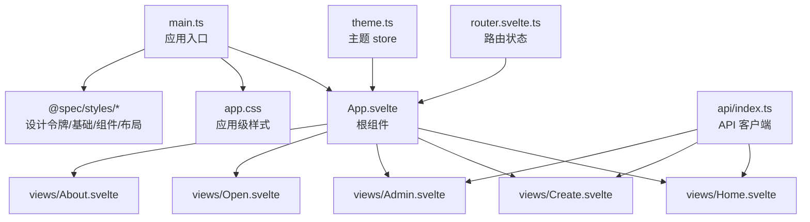
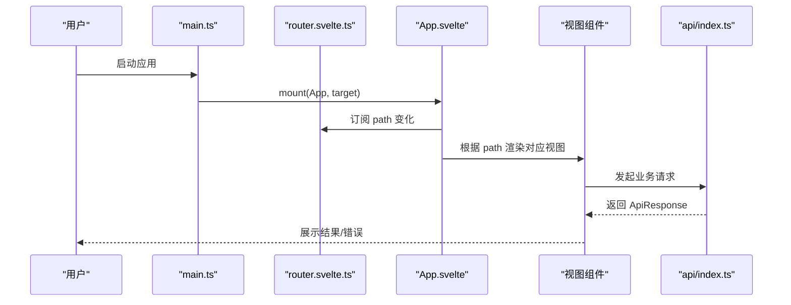
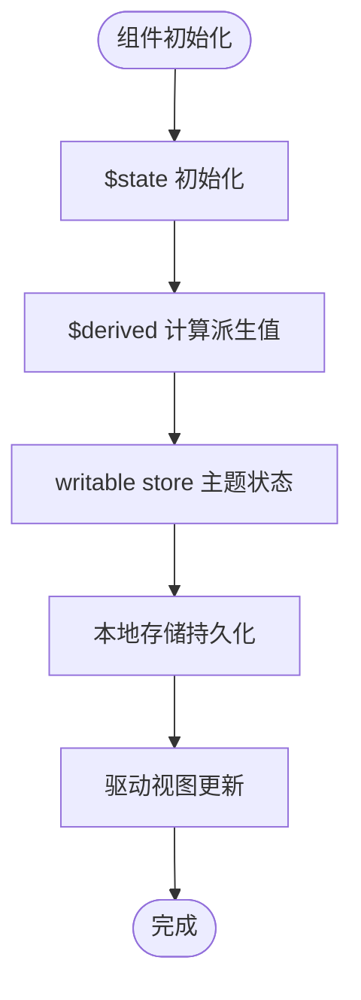
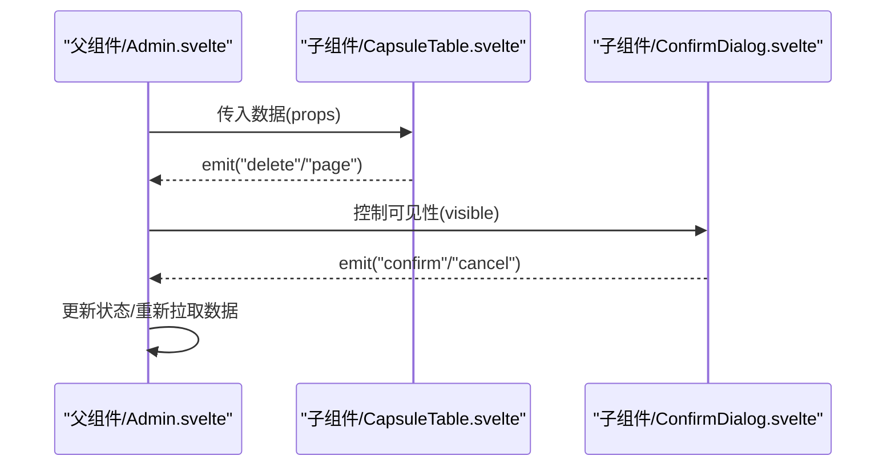
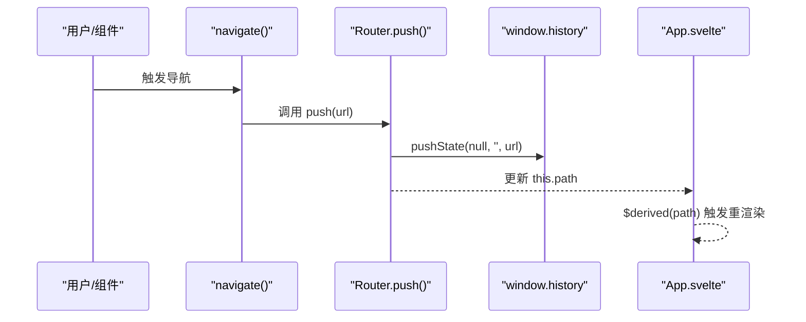
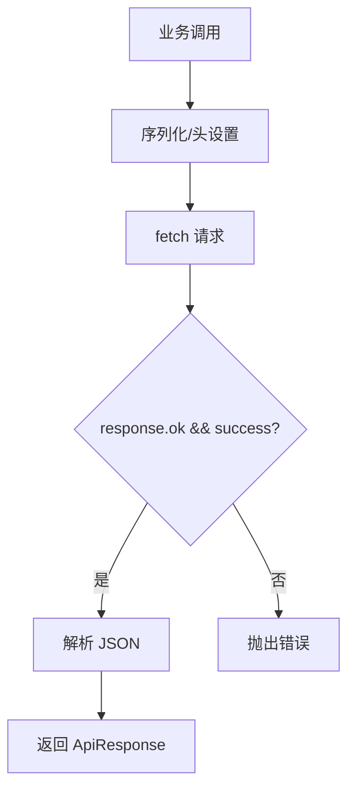
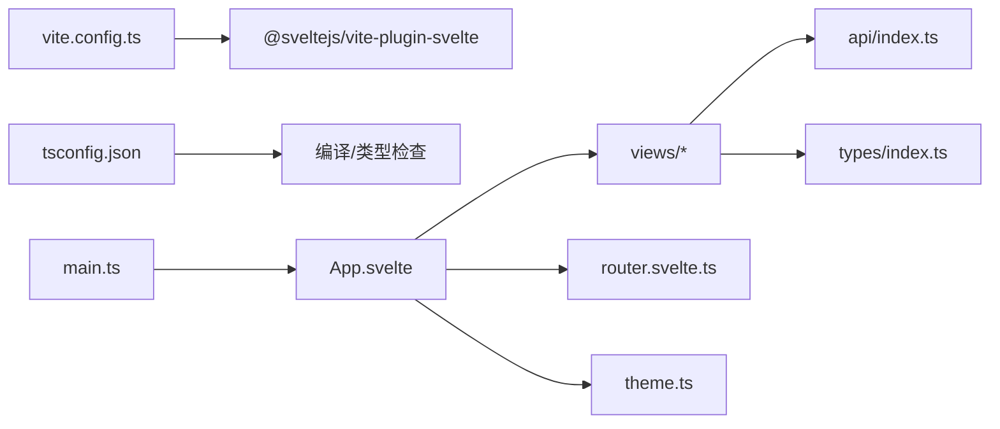

# Svelte 实现

<cite>
**本文引用的文件**
- [package.json](file://frontends/svelte-ts/package.json)
- [svelte.config.js](file://frontends/svelte-ts/svelte.config.js)
- [tsconfig.json](file://frontends/svelte-ts/tsconfig.json)
- [vite.config.ts](file://frontends/svelte-ts/vite.config.ts)
- [main.ts](file://frontends/svelte-ts/src/main.ts)
- [App.svelte](file://frontends/svelte-ts/src/App.svelte)
- [router.svelte.ts](file://frontends/svelte-ts/src/lib/router.svelte.ts)
- [theme.ts](file://frontends/svelte-ts/src/lib/theme.ts)
- [Counter.svelte](file://frontends/svelte-ts/src/lib/Counter.svelte)
- [Home.svelte](file://frontends/svelte-ts/src/views/Home.svelte)
- [Admin.svelte](file://frontends/svelte-ts/src/views/Admin.svelte)
- [Create.svelte](file://frontends/svelte-ts/src/views/Create.svelte)
- [api/index.ts](file://frontends/svelte-ts/src/lib/api/index.ts)
- [types/index.ts](file://frontends/svelte-ts/src/lib/types/index.ts)
- [app.css](file://frontends/svelte-ts/src/app.css)
</cite>

## 目录
1. [简介](#简介)
2. [项目结构](#项目结构)
3. [核心组件](#核心组件)
4. [架构总览](#架构总览)
5. [详细组件分析](#详细组件分析)
6. [依赖关系分析](#依赖关系分析)
7. [性能考量](#性能考量)
8. [故障排查指南](#故障排查指南)
9. [结论](#结论)
10. [附录](#附录)

## 简介
本文件面向 Svelte 5 在本仓库中的实现，围绕以下主题展开：响应式编程模型与状态管理（含自研路由与主题 store）、组件架构与通信（props 与事件）、编译时优化带来的性能优势、路由系统（含动态路由与导航控制）、与设计系统及样式体系的集成方式。文档同时提供可视化图示，帮助不同技术背景的读者快速理解与落地。

## 项目结构
Svelte 前端位于 frontends/svelte-ts，采用 Vite + Svelte 5 + TypeScript 的现代开发栈。核心目录与职责如下：
- src/main.ts：应用入口，挂载根组件并引入全局样式
- src/App.svelte：应用根组件，负责视图切换与布局
- src/lib：可复用模块与工具
  - router.svelte.ts：轻量级客户端路由（基于 History API）
  - theme.ts：主题状态管理（writable store + 本地持久化）
  - api/index.ts：统一 API 客户端封装
  - types/index.ts：前后端一致的数据契约类型
  - Counter.svelte：最小化响应式示例
- src/views：页面级视图组件
- 全局样式：通过 main.ts 引入设计令牌与基础样式，并在各视图内局部覆盖

图表来源
- [main.ts:1-17](file://frontends/svelte-ts/src/main.ts#L1-L17)
- [App.svelte:1-51](file://frontends/svelte-ts/src/App.svelte#L1-L51)
- [router.svelte.ts:1-25](file://frontends/svelte-ts/src/lib/router.svelte.ts#L1-L25)
- [theme.ts:1-35](file://frontends/svelte-ts/src/lib/theme.ts#L1-L35)
- [api/index.ts:1-120](file://frontends/svelte-ts/src/lib/api/index.ts#L1-L120)
- [app.css:1-2](file://frontends/svelte-ts/src/app.css#L1-L2)

章节来源
- [package.json:1-21](file://frontends/svelte-ts/package.json#L1-L21)
- [svelte.config.js:1-3](file://frontends/svelte-ts/svelte.config.js#L1-L3)
- [tsconfig.json:1-25](file://frontends/svelte-ts/tsconfig.json#L1-L25)
- [vite.config.ts:1-29](file://frontends/svelte-ts/vite.config.ts#L1-L29)
- [main.ts:1-17](file://frontends/svelte-ts/src/main.ts#L1-L17)

## 核心组件
- 响应式模型与状态管理
  - $state/$derived：用于局部状态与派生状态，如计数器与路由派生参数
  - writable store：主题状态持久化与跨组件共享
- 路由系统：基于 History API 的轻量路由，支持 push 与 popstate
- 视图层：按路径映射到具体页面组件，支持动态参数解析
- 类型系统：统一的 ApiResponse、Capsule、分页等类型定义
- API 客户端：统一请求封装、错误处理与鉴权头注入

章节来源
- [Counter.svelte:1-11](file://frontends/svelte-ts/src/lib/Counter.svelte#L1-L11)
- [router.svelte.ts:1-25](file://frontends/svelte-ts/src/lib/router.svelte.ts#L1-L25)
- [theme.ts:1-35](file://frontends/svelte-ts/src/lib/theme.ts#L1-L35)
- [App.svelte:1-51](file://frontends/svelte-ts/src/App.svelte#L1-L51)
- [types/index.ts:1-80](file://frontends/svelte-ts/src/lib/types/index.ts#L1-L80)
- [api/index.ts:1-120](file://frontends/svelte-ts/src/lib/api/index.ts#L1-L120)

## 架构总览
下图展示了从入口到视图、再到 API 的调用链路，以及主题与路由如何贯穿组件树：

图表来源
- [main.ts:1-17](file://frontends/svelte-ts/src/main.ts#L1-L17)
- [router.svelte.ts:1-25](file://frontends/svelte-ts/src/lib/router.svelte.ts#L1-L25)
- [App.svelte:1-51](file://frontends/svelte-ts/src/App.svelte#L1-L51)
- [api/index.ts:1-120](file://frontends/svelte-ts/src/lib/api/index.ts#L1-L120)

## 详细组件分析

### 响应式编程模型与状态管理
- $state：用于组件内部可变状态，如计数器
- $derived：从响应式状态派生计算值，如根据当前路径推导是否为打开页、提取参数
- writable store：主题状态跨组件共享，结合本地存储实现持久化与初始态恢复
- 导航函数：navigate 包装 router.push，便于在任意层级触发路由变更

图表来源
- [Counter.svelte:1-11](file://frontends/svelte-ts/src/lib/Counter.svelte#L1-L11)
- [App.svelte:12-15](file://frontends/svelte-ts/src/App.svelte#L12-L15)
- [theme.ts:1-35](file://frontends/svelte-ts/src/lib/theme.ts#L1-L35)

章节来源
- [Counter.svelte:1-11](file://frontends/svelte-ts/src/lib/Counter.svelte#L1-L11)
- [App.svelte:12-15](file://frontends/svelte-ts/src/App.svelte#L12-L15)
- [theme.ts:1-35](file://frontends/svelte-ts/src/lib/theme.ts#L1-L35)

### 组件架构与通信
- props 传递：视图组件接收来自父组件或 store 的数据（如分页信息、加载状态）
- 事件处理：子组件通过自定义事件向上冒泡，父组件监听并处理（如登录、删除、分页）
- 生命周期：onMount 在管理后台中用于首次拉取数据
- 动态参数：通过派生状态从路径中解析出 code 参数

图表来源
- [Admin.svelte:107-146](file://frontends/svelte-ts/src/views/Admin.svelte#L107-L146)
- [Create.svelte:77-87](file://frontends/svelte-ts/src/views/Create.svelte#L77-L87)

章节来源
- [Admin.svelte:1-146](file://frontends/svelte-ts/src/views/Admin.svelte#L1-L146)
- [Create.svelte:1-124](file://frontends/svelte-ts/src/views/Create.svelte#L1-L124)

### 路由系统设计与实现
- 路由类 Router：维护当前 path，监听 popstate，提供 push 方法
- 导航函数：navigate 包装 push，简化调用
- 视图映射：App.svelte 根据 $derived(path) 选择渲染的视图；对 /open/:code 进行参数解析
- 动态路由：通过路径字符串解析实现“动态段”效果

图表来源
- [router.svelte.ts:1-25](file://frontends/svelte-ts/src/lib/router.svelte.ts#L1-L25)
- [App.svelte:12-15](file://frontends/svelte-ts/src/App.svelte#L12-L15)

章节来源
- [router.svelte.ts:1-25](file://frontends/svelte-ts/src/lib/router.svelte.ts#L1-L25)
- [App.svelte:1-51](file://frontends/svelte-ts/src/App.svelte#L1-L51)

### API 客户端与类型系统
- 统一请求封装：request 函数负责序列化、头设置、错误处理
- 业务接口：创建胶囊、查询胶囊、管理员登录、分页查询、删除胶囊、健康检查
- 类型契约：Capsule、CreateCapsuleForm、ApiResponse、PageData、AdminToken、HealthInfo 等
- 鉴权：管理员接口通过 Authorization 头携带 Bearer Token

图表来源
- [api/index.ts:19-37](file://frontends/svelte-ts/src/lib/api/index.ts#L19-L37)
- [types/index.ts:10-80](file://frontends/svelte-ts/src/lib/types/index.ts#L10-L80)

章节来源
- [api/index.ts:1-120](file://frontends/svelte-ts/src/lib/api/index.ts#L1-L120)
- [types/index.ts:1-80](file://frontends/svelte-ts/src/lib/types/index.ts#L1-L80)

### 设计系统与样式处理
- 全局样式：main.ts 引入设计令牌、基础、组件、布局样式，确保主题与原子样式一致
- 视图样式：各视图内局部样式覆盖，遵循设计令牌变量，支持暗色模式适配
- 组件样式：通过 :global 选择器与 data-theme 属性联动，实现主题切换

章节来源
- [main.ts:3-10](file://frontends/svelte-ts/src/main.ts#L3-L10)
- [Home.svelte:59-175](file://frontends/svelte-ts/src/views/Home.svelte#L59-L175)
- [theme.ts:15-30](file://frontends/svelte-ts/src/lib/theme.ts#L15-L30)

## 依赖关系分析
- 构建与运行时
  - Vite 提供开发服务器与打包能力
  - Svelte 插件负责编译 .svelte 文件
  - TypeScript 提供类型检查与智能提示
- 应用层
  - App.svelte 依赖 router 与各视图
  - 视图组件依赖 API 客户端与类型定义
  - theme.ts 作为全局 store 被多处订阅

图表来源
- [vite.config.ts:1-29](file://frontends/svelte-ts/vite.config.ts#L1-L29)
- [tsconfig.json:1-25](file://frontends/svelte-ts/tsconfig.json#L1-L25)
- [main.ts:1-17](file://frontends/svelte-ts/src/main.ts#L1-L17)
- [App.svelte:1-51](file://frontends/svelte-ts/src/App.svelte#L1-L51)
- [api/index.ts:1-120](file://frontends/svelte-ts/src/lib/api/index.ts#L1-L120)
- [types/index.ts:1-80](file://frontends/svelte-ts/src/lib/types/index.ts#L1-L80)
- [router.svelte.ts:1-25](file://frontends/svelte-ts/src/lib/router.svelte.ts#L1-L25)
- [theme.ts:1-35](file://frontends/svelte-ts/src/lib/theme.ts#L1-L35)

章节来源
- [package.json:1-21](file://frontends/svelte-ts/package.json#L1-L21)
- [svelte.config.js:1-3](file://frontends/svelte-ts/svelte.config.js#L1-L3)
- [vite.config.ts:1-29](file://frontends/svelte-ts/vite.config.ts#L1-L29)
- [tsconfig.json:1-25](file://frontends/svelte-ts/tsconfig.json#L1-L25)

## 性能考量
- 编译时优化
  - Svelte 5 以编译时替代运行时虚拟 DOM，减少运行时开销，提升渲染性能
  - 通过 $state/$derived 精准追踪依赖，仅在必要时更新受影响的节点
- 路由与渲染
  - 路由切换基于字符串匹配与派生状态，避免复杂路由表的运行时解析成本
  - 视图按需渲染，减少不必要的组件实例化
- 样式与主题
  - 使用设计令牌与 :global 选择器，避免重复样式计算
  - 主题切换通过属性与本地存储，避免深层组件树的重复计算

## 故障排查指南
- 路由不生效
  - 检查 navigate 调用是否正确传入目标 URL
  - 确认浏览器支持 History API，且未被代理/同源策略限制
- 主题不持久
  - 确认 localStorage 可用，且 applyTheme 正常写入 data-theme 属性
- API 请求失败
  - 检查 /api 前缀与代理配置是否指向正确的后端地址
  - 关注统一错误处理逻辑，区分 HTTP 状态与业务 success 字段
- 类型报错
  - 确保 tsconfig 的 paths 与类型声明完整，避免模块解析问题

章节来源
- [router.svelte.ts:12-18](file://frontends/svelte-ts/src/lib/router.svelte.ts#L12-L18)
- [theme.ts:15-25](file://frontends/svelte-ts/src/lib/theme.ts#L15-L25)
- [api/index.ts:19-37](file://frontends/svelte-ts/src/lib/api/index.ts#L19-L37)
- [vite.config.ts:21-26](file://frontends/svelte-ts/vite.config.ts#L21-L26)
- [tsconfig.json:18-21](file://frontends/svelte-ts/tsconfig.json#L18-L21)

## 结论
本实现以 Svelte 5 的响应式模型为核心，结合自研路由与主题 store，构建了简洁高效的前端架构。通过统一的 API 客户端与类型系统，保证了前后端一致性与可维护性；配合设计令牌与主题切换机制，实现了良好的可扩展性与可访问性。整体方案在性能与开发体验之间取得平衡，适合中大型单页应用的快速迭代。

## 附录
- 术语
  - 响应式：Svelte 的状态驱动视图更新机制
  - 派生状态：由现有状态计算得出的新状态
  - store：可订阅的状态容器（writable/readable）
  - 编译时优化：将运行时逻辑在构建阶段转换为高效代码
- 最佳实践
  - 将 UI 与状态分离，优先使用 $state/$derived
  - 使用 store 管理跨组件共享状态（如主题）
  - 通过统一 API 客户端集中处理错误与鉴权
  - 利用设计令牌与 :global 选择器实现主题与样式的一致性