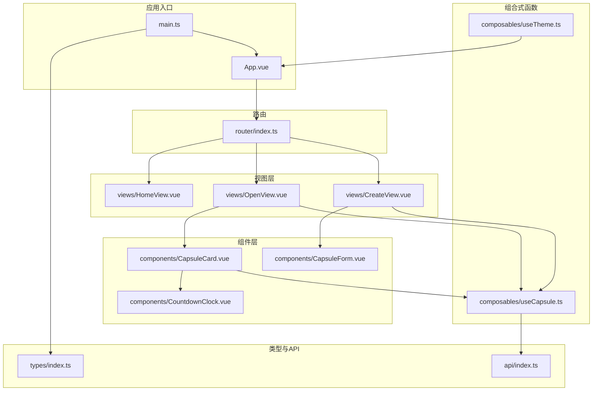
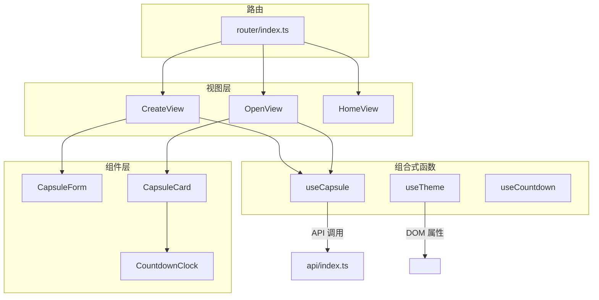
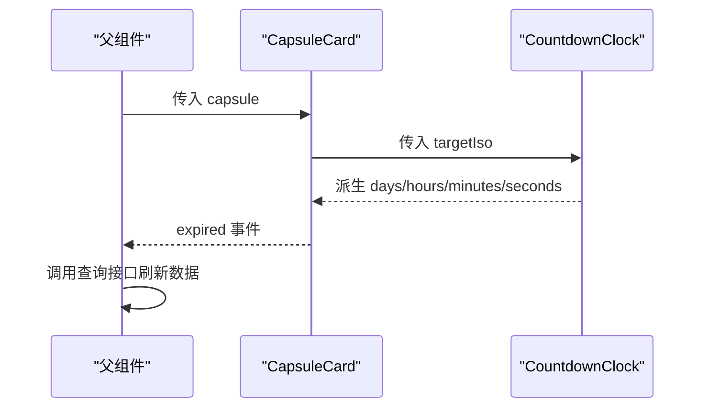
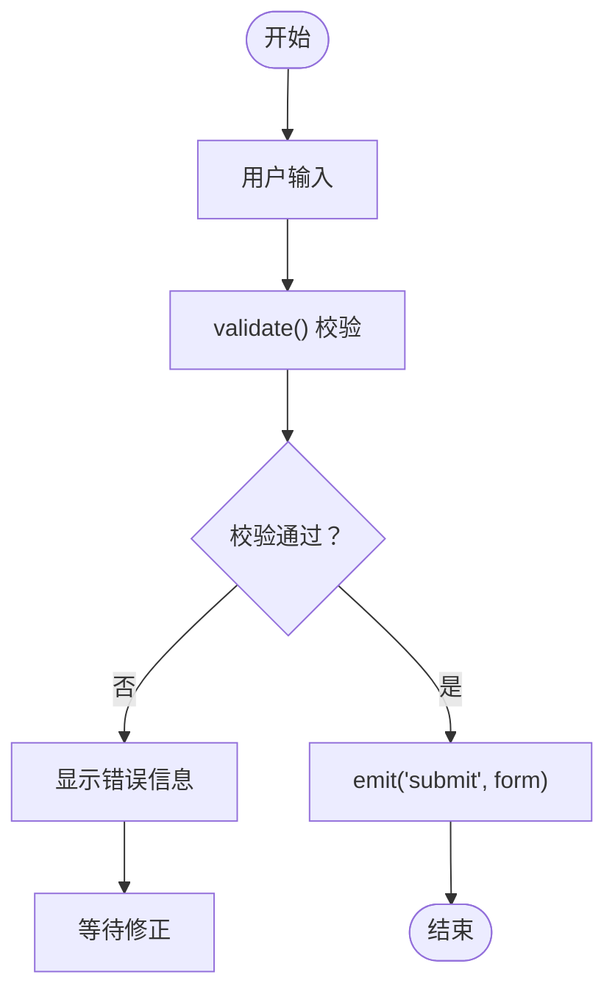
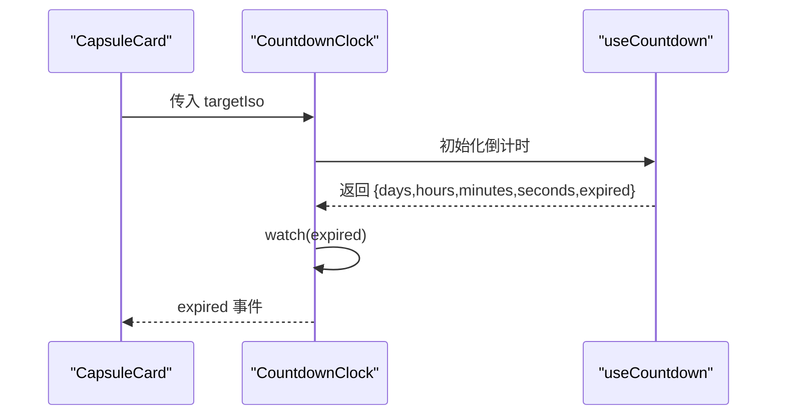
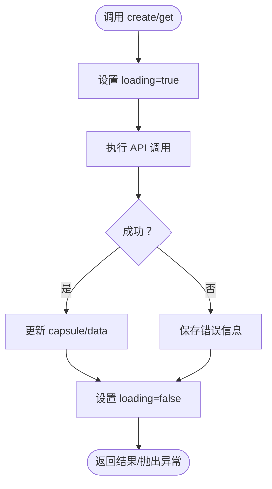
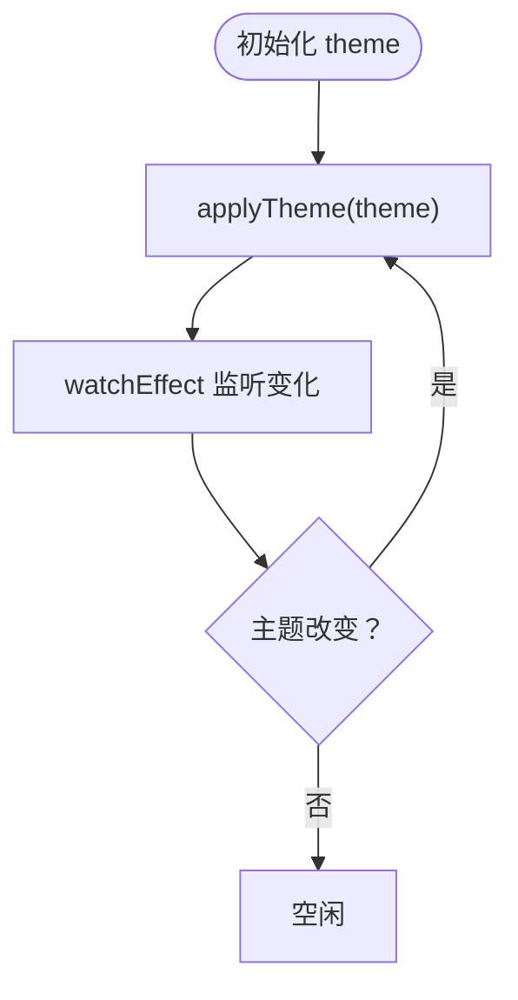
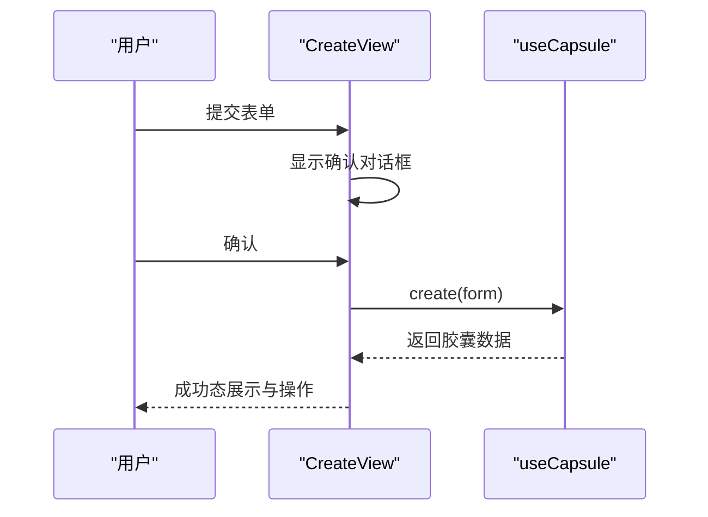
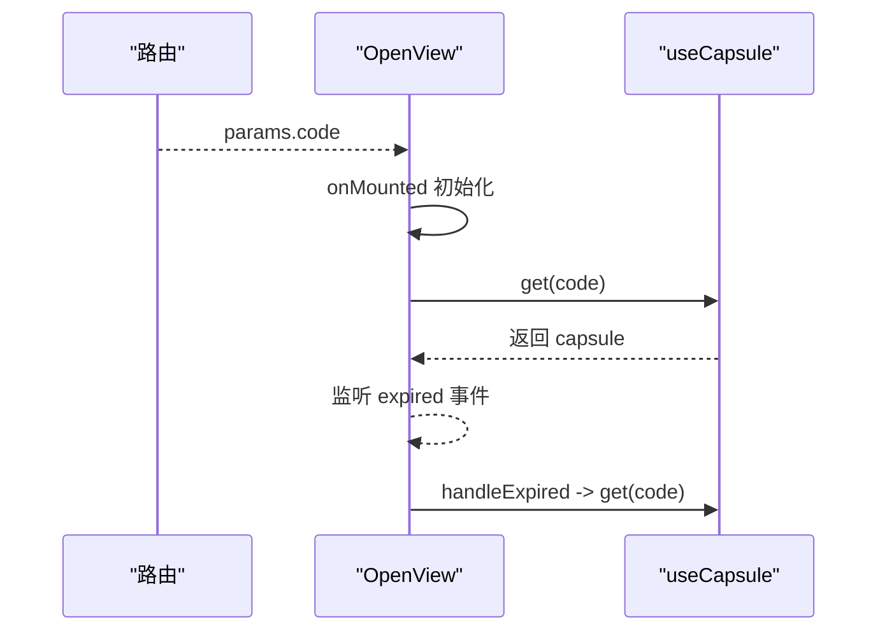
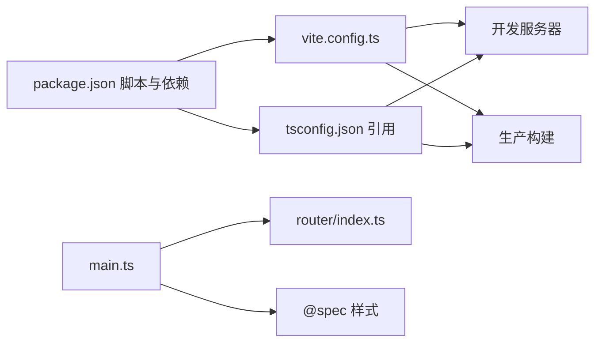

# Vue 3 实现

<cite>
**本文引用的文件**
- [package.json](file://frontends/vue3-ts/package.json)
- [vite.config.ts](file://frontends/vue3-ts/vite.config.ts)
- [tsconfig.json](file://frontends/vue3-ts/tsconfig.json)
- [main.ts](file://frontends/vue3-ts/src/main.ts)
- [App.vue](file://frontends/vue3-ts/src/App.vue)
- [router/index.ts](file://frontends/vue3-ts/src/router/index.ts)
- [components/CapsuleCard.vue](file://frontends/vue3-ts/src/components/CapsuleCard.vue)
- [components/CapsuleForm.vue](file://frontends/vue3-ts/src/components/CapsuleForm.vue)
- [components/CountdownClock.vue](file://frontends/vue3-ts/src/components/CountdownClock.vue)
- [composables/useCapsule.ts](file://frontends/vue3-ts/src/composables/useCapsule.ts)
- [composables/useTheme.ts](file://frontends/vue3-ts/src/composables/useTheme.ts)
- [types/index.ts](file://frontends/vue3-ts/src/types/index.ts)
- [views/HomeView.vue](file://frontends/vue3-ts/src/views/HomeView.vue)
- [views/CreateView.vue](file://frontends/vue3-ts/src/views/CreateView.vue)
- [views/OpenView.vue](file://frontends/vue3-ts/src/views/OpenView.vue)
</cite>

## 目录
1. [简介](#简介)
2. [项目结构](#项目结构)
3. [核心组件](#核心组件)
4. [架构总览](#架构总览)
5. [详细组件分析](#详细组件分析)
6. [依赖关系分析](#依赖关系分析)
7. [性能考虑](#性能考虑)
8. [故障排查指南](#故障排查指南)
9. [结论](#结论)
10. [附录](#附录)

## 简介
本文件面向 Vue 3 + TypeScript 前端实现，系统性梳理 Composition API 的使用模式、组件架构设计、路由系统与导航策略、自定义 Hook 设计、Vite 构建与优化、TypeScript 集成最佳实践、组件测试策略以及与设计系统的集成方法。重点覆盖 CapsuleCard、CapsuleForm、CountdownClock 等核心组件，useCapsule、useTheme 等自定义 Hook，以及路由配置与视图层交互。

## 项目结构
前端采用多框架对比工程中的 Vue 3 实现，核心目录组织如下：
- src：源代码根目录
  - components：可复用 UI 组件（如 CapsuleCard、CapsuleForm、CountdownClock）
  - composables：自定义组合式函数（useCapsule、useTheme、useCountdown）
  - views：页面级视图组件（HomeView、CreateView、OpenView 等）
  - router：路由配置
  - types：TypeScript 类型定义
  - api：API 访问封装（通过 index.ts 导出）
  - main.ts：应用入口，挂载全局样式与路由
  - App.vue：根组件，承载头部、主内容区与底部
- vite.config.ts：Vite 构建与开发服务器配置
- package.json：脚本与依赖声明
- tsconfig.json：多项目引用配置

图表来源
- [main.ts:1-23](file://frontends/vue3-ts/src/main.ts#L1-L23)
- [App.vue:1-19](file://frontends/vue3-ts/src/App.vue#L1-L19)
- [router/index.ts:1-44](file://frontends/vue3-ts/src/router/index.ts#L1-L44)
- [components/CapsuleCard.vue:1-89](file://frontends/vue3-ts/src/components/CapsuleCard.vue#L1-L89)
- [components/CapsuleForm.vue:1-165](file://frontends/vue3-ts/src/components/CapsuleForm.vue#L1-L165)
- [components/CountdownClock.vue:1-167](file://frontends/vue3-ts/src/components/CountdownClock.vue#L1-L167)
- [composables/useCapsule.ts:1-65](file://frontends/vue3-ts/src/composables/useCapsule.ts#L1-L65)
- [composables/useTheme.ts:1-57](file://frontends/vue3-ts/src/composables/useTheme.ts#L1-L57)
- [types/index.ts:1-80](file://frontends/vue3-ts/src/types/index.ts#L1-L80)

章节来源
- [main.ts:1-23](file://frontends/vue3-ts/src/main.ts#L1-L23)
- [router/index.ts:1-44](file://frontends/vue3-ts/src/router/index.ts#L1-L44)

## 核心组件
本节聚焦 Composition API 的典型使用模式与组件职责划分：
- 响应式数据管理：通过 ref、reactive、computed 管理本地状态与派生状态
- 生命周期钩子：onMounted 等在视图层进行副作用初始化
- 计算属性与侦听器：computed 用于派生显示值；watch/watchEffect 用于副作用与主题持久化
- 组件通信：props/emits 传递数据与事件，父组件处理业务逻辑

章节来源
- [components/CapsuleCard.vue:32-53](file://frontends/vue3-ts/src/components/CapsuleCard.vue#L32-L53)
- [components/CapsuleForm.vue:63-129](file://frontends/vue3-ts/src/components/CapsuleForm.vue#L63-L129)
- [components/CountdownClock.vue:21-53](file://frontends/vue3-ts/src/components/CountdownClock.vue#L21-L53)
- [views/CreateView.vue:36-73](file://frontends/vue3-ts/src/views/CreateView.vue#L36-L73)
- [views/OpenView.vue:23-50](file://frontends/vue3-ts/src/views/OpenView.vue#L23-L50)
- [composables/useCapsule.ts:10-64](file://frontends/vue3-ts/src/composables/useCapsule.ts#L10-L64)
- [composables/useTheme.ts:5-57](file://frontends/vue3-ts/src/composables/useTheme.ts#L5-L57)

## 架构总览
Vue 3 应用采用“视图层 + 组合式函数 + 组件层”的分层架构。视图层负责页面布局与用户交互；组合式函数封装跨组件的业务逻辑与状态；组件层提供可复用 UI；路由系统负责页面导航与懒加载。

图表来源
- [views/CreateView.vue:36-73](file://frontends/vue3-ts/src/views/CreateView.vue#L36-L73)
- [views/OpenView.vue:23-50](file://frontends/vue3-ts/src/views/OpenView.vue#L23-L50)
- [views/HomeView.vue:1-173](file://frontends/vue3-ts/src/views/HomeView.vue#L1-L173)
- [composables/useCapsule.ts:10-64](file://frontends/vue3-ts/src/composables/useCapsule.ts#L10-L64)
- [composables/useTheme.ts:46-57](file://frontends/vue3-ts/src/composables/useTheme.ts#L46-L57)
- [components/CountdownClock.vue:21-53](file://frontends/vue3-ts/src/components/CountdownClock.vue#L21-L53)
- [router/index.ts:11-41](file://frontends/vue3-ts/src/router/index.ts#L11-L41)

## 详细组件分析

### 组件：CapsuleCard
- 职责：展示胶囊元信息、开启倒计时、锁定态提示与内容展示
- 关键点：
  - props 接收 Capsule 类型数据
  - emits 触发 expired 事件，用于父组件刷新
  - 通过 CountdownClock 组件展示倒计时
  - formatTime 处理本地化时间显示
- 数据流：父组件传入 capsule → 渲染卡片 → 倒计时到期触发事件 → 父组件重新查询

图表来源
- [components/CapsuleCard.vue:32-53](file://frontends/vue3-ts/src/components/CapsuleCard.vue#L32-L53)
- [components/CountdownClock.vue:21-53](file://frontends/vue3-ts/src/components/CountdownClock.vue#L21-L53)

章节来源
- [components/CapsuleCard.vue:1-89](file://frontends/vue3-ts/src/components/CapsuleCard.vue#L1-L89)

### 组件：CapsuleForm
- 职责：封装创建胶囊的表单输入、校验与提交
- 关键点：
  - reactive 管理表单字段与错误信息
  - computed 提供最小可选时间（当前时间）
  - 自定义校验 validate，覆盖标题、内容、发布者、开启时间
  - emits 触发 submit 事件，携带 CreateCapsuleForm
- 数据流：用户输入 → 实时校验 → 提交事件 → 父组件处理

图表来源
- [components/CapsuleForm.vue:95-122](file://frontends/vue3-ts/src/components/CapsuleForm.vue#L95-L122)

章节来源
- [components/CapsuleForm.vue:1-165](file://frontends/vue3-ts/src/components/CapsuleForm.vue#L1-L165)

### 组件：CountdownClock
- 职责：倒计时展示与到期提示
- 关键点：
  - props 接收目标时间（ISO）
  - useCountdown 返回剩余时间对象
  - watch 监听 expired 状态，到期后延时触发 expired 事件
  - computed 组合单位数组，用于渲染
- 数据流：目标时间 → useCountdown → 单位数组 → 渲染 → 到期事件

图表来源
- [components/CountdownClock.vue:21-53](file://frontends/vue3-ts/src/components/CountdownClock.vue#L21-L53)
- [components/CapsuleCard.vue:27](file://frontends/vue3-ts/src/components/CapsuleCard.vue#L27)

章节来源
- [components/CountdownClock.vue:1-167](file://frontends/vue3-ts/src/components/CountdownClock.vue#L1-L167)

### 组合式函数：useCapsule
- 职责：封装创建与查询胶囊的业务逻辑，统一 loading/error/capsule 状态
- 关键点：
  - ref 管理 capsule、loading、error
  - create/get 两个异步方法，分别调用 API 并更新状态
  - try/catch/finally 结构保证 loading 状态正确收尾
- 使用场景：CreateView、OpenView 中直接注入并调用

图表来源
- [composables/useCapsule.ts:24-60](file://frontends/vue3-ts/src/composables/useCapsule.ts#L24-L60)

章节来源
- [composables/useCapsule.ts:1-65](file://frontends/vue3-ts/src/composables/useCapsule.ts#L1-L65)

### 组合式函数：useTheme
- 职责：主题切换与持久化，支持亮/暗模式
- 关键点：
  - ref 管理当前主题，优先从 localStorage 读取
  - applyTheme 设置 <html> 的 data-theme 属性，并写回 localStorage
  - watchEffect 监听主题变化，自动应用到 DOM
- 使用场景：ThemeToggle 组件或根组件中调用

图表来源
- [composables/useTheme.ts:13-38](file://frontends/vue3-ts/src/composables/useTheme.ts#L13-L38)

章节来源
- [composables/useTheme.ts:1-57](file://frontends/vue3-ts/src/composables/useTheme.ts#L1-L57)

### 视图层：CreateView
- 职责：创建胶囊流程编排，包含确认对话框、成功态展示与复制胶囊码
- 关键点：
  - 注入 useCapsule，处理 loading、error、create
  - handleSubmit -> 显示确认对话框 -> confirmCreate -> 调用 create -> 成功态展示
  - 复制胶囊码使用浏览器剪贴板 API

图表来源
- [views/CreateView.vue:36-73](file://frontends/vue3-ts/src/views/CreateView.vue#L36-L73)
- [composables/useCapsule.ts:24-37](file://frontends/vue3-ts/src/composables/useCapsule.ts#L24-L37)

章节来源
- [views/CreateView.vue:1-110](file://frontends/vue3-ts/src/views/CreateView.vue#L1-L110)

### 视图层：OpenView
- 职责：打开/查看胶囊，支持路由参数透传与到期刷新
- 关键点：
  - 注入 useCapsule，监听 route.params.code，自动查询
  - handleExpired 回调触发重新查询，确保状态同步

图表来源
- [views/OpenView.vue:23-50](file://frontends/vue3-ts/src/views/OpenView.vue#L23-L50)
- [composables/useCapsule.ts:47-60](file://frontends/vue3-ts/src/composables/useCapsule.ts#L47-L60)

章节来源
- [views/OpenView.vue:1-51](file://frontends/vue3-ts/src/views/OpenView.vue#L1-L51)

## 依赖关系分析
- 构建与运行时
  - Vite 作为开发服务器与打包工具，启用 @vitejs/plugin-vue，配置别名与代理
  - TypeScript 通过 vue-tsc 与 Vite 协同进行类型检查与构建
- 运行时依赖
  - vue 与 vue-router 提供核心能力
  - 测试使用 Vitest 与 @vue/test-utils、@testing-library/vue
- 设计系统集成
  - 通过导入 @spec 下的 CSS 文件（tokens、base、components、layout）实现设计令牌与通用样式

图表来源
- [package.json:1-30](file://frontends/vue3-ts/package.json#L1-L30)
- [vite.config.ts:1-23](file://frontends/vue3-ts/vite.config.ts#L1-L23)
- [tsconfig.json:1-8](file://frontends/vue3-ts/tsconfig.json#L1-L8)
- [main.ts:9-13](file://frontends/vue3-ts/src/main.ts#L9-L13)

章节来源
- [package.json:1-30](file://frontends/vue3-ts/package.json#L1-L30)
- [vite.config.ts:1-23](file://frontends/vue3-ts/vite.config.ts#L1-L23)
- [tsconfig.json:1-8](file://frontends/vue3-ts/tsconfig.json#L1-L8)
- [main.ts:1-23](file://frontends/vue3-ts/src/main.ts#L1-L23)

## 性能考虑
- 路由懒加载：路由按需加载视图组件，减少首屏体积
- 组件懒加载：路由视图通过动态 import 实现
- 响应式粒度：useCapsule 将 loading/error/capsule 独立管理，避免无关重渲染
- 倒计时优化：CountdownClock 仅在 expired 变化时触发一次延时事件，避免频繁重渲染
- 样式隔离：scoped CSS 与设计令牌变量减少样式冲突与重绘

## 故障排查指南
- 主题不生效
  - 检查 localStorage 中是否存在 theme 键，确认 <html> 上 data-theme 是否正确设置
  - 确认 useTheme 初始化逻辑在浏览器环境执行
- 倒计时不更新
  - 确认 useCountdown 返回的 expired 状态变化
  - 检查 CountdownClock 的 watch 逻辑与延时触发
- 创建/查询失败
  - 查看 useCapsule 中 error 状态与 API 返回
  - 确认网络代理配置与后端接口可用性
- 样式异常
  - 确认 @spec 样式导入顺序与 CSS 变量覆盖

章节来源
- [composables/useTheme.ts:13-38](file://frontends/vue3-ts/src/composables/useTheme.ts#L13-L38)
- [components/CountdownClock.vue:37-41](file://frontends/vue3-ts/src/components/CountdownClock.vue#L37-L41)
- [composables/useCapsule.ts:31-36](file://frontends/vue3-ts/src/composables/useCapsule.ts#L31-L36)
- [main.ts:9-13](file://frontends/vue3-ts/src/main.ts#L9-L13)

## 结论
该 Vue 3 实现以 Composition API 为核心，结合自定义 Hook 与组件分层，实现了清晰的状态管理、良好的用户体验与可维护的代码结构。配合 Vite 的高效构建与 TypeScript 的强类型保障，满足现代前端工程化需求。建议后续持续完善测试覆盖率与性能监控，进一步提升稳定性与可扩展性。

## 附录

### 路由系统与导航
- 路由模式：HTML5 History 模式
- 路由规则：首页、创建、打开（含可选参数）、关于、管理员后台
- 懒加载：所有视图组件均采用动态 import

章节来源
- [router/index.ts:11-41](file://frontends/vue3-ts/src/router/index.ts#L11-L41)

### TypeScript 集成最佳实践
- 多项目引用：tsconfig.json 通过 references 管理 app 与 node 环境配置
- 类型安全：组件 props/emits 明确类型，API 响应统一 ApiResponse 泛型
- 工具类型：PageData、Capsule、CreateCapsuleForm 等集中定义

章节来源
- [tsconfig.json:1-8](file://frontends/vue3-ts/tsconfig.json#L1-L8)
- [types/index.ts:10-80](file://frontends/vue3-ts/src/types/index.ts#L10-L80)

### 组件测试策略
- 单元测试：针对组合式函数（useCapsule、useTheme）进行状态与行为验证
- 组件测试：使用 @vue/test-utils 或 @testing-library/vue 对关键组件进行快照与交互测试
- 覆盖范围：建议围绕 useCapsule 的 create/get、useTheme 的切换与持久化、表单校验与倒计时逻辑建立测试用例

章节来源
- [package.json:10-12](file://frontends/vue3-ts/package.json#L10-L12)

### 设计系统集成方法
- 设计令牌：通过 @spec/styles/tokens.css 提供 CSS 变量
- 基础样式：base.css、components.css、layout.css 作为全局样式基底
- 组件样式：使用 scoped CSS 与设计令牌变量，确保主题切换时样式一致性

章节来源
- [main.ts:9-13](file://frontends/vue3-ts/src/main.ts#L9-L13)