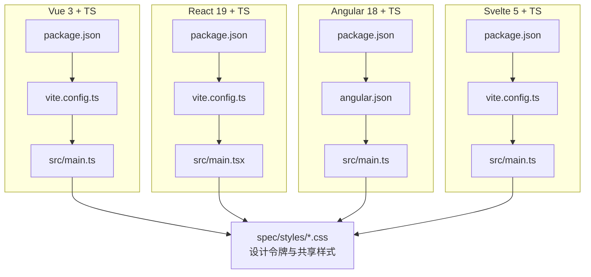
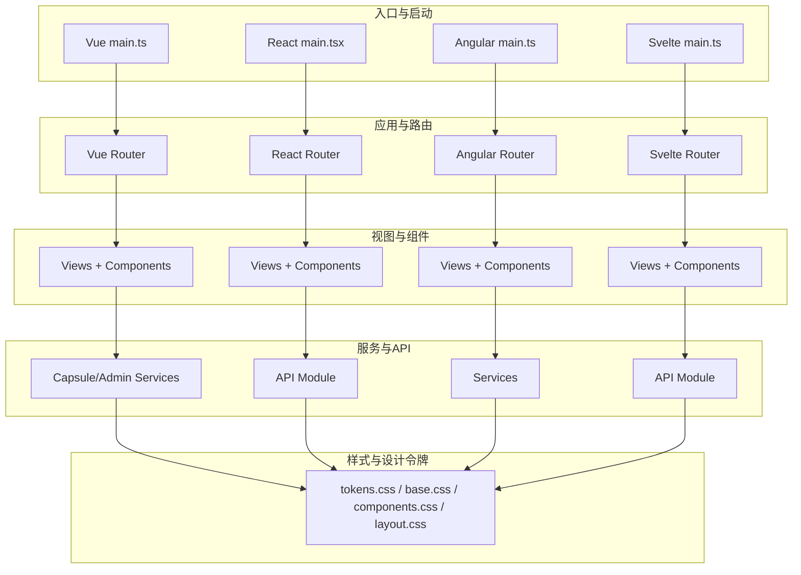
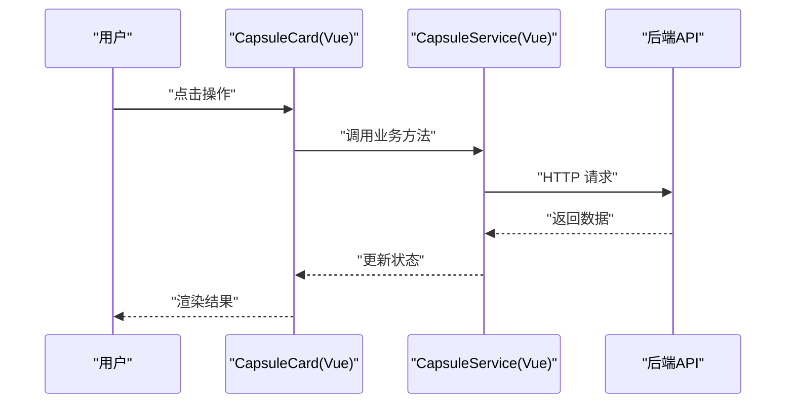
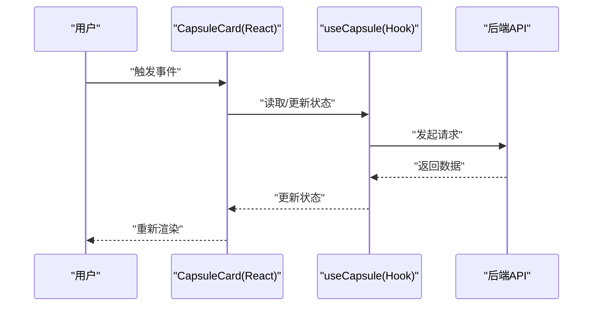
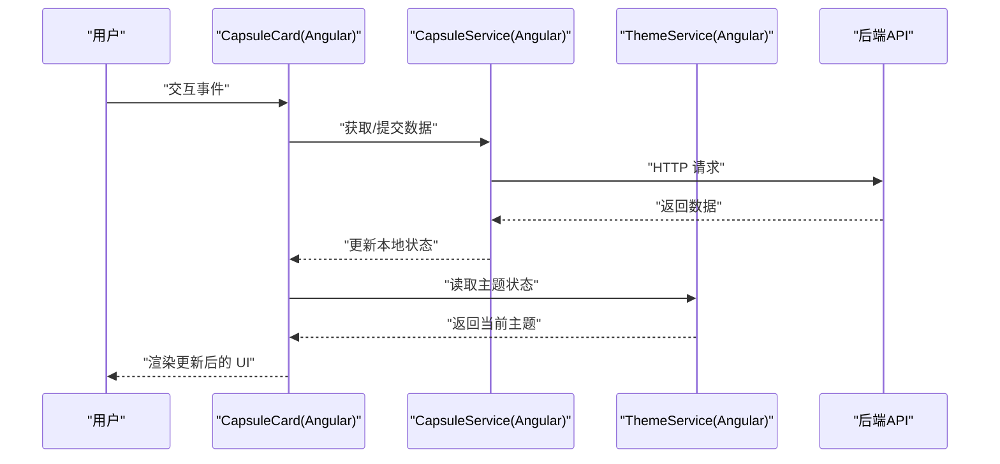
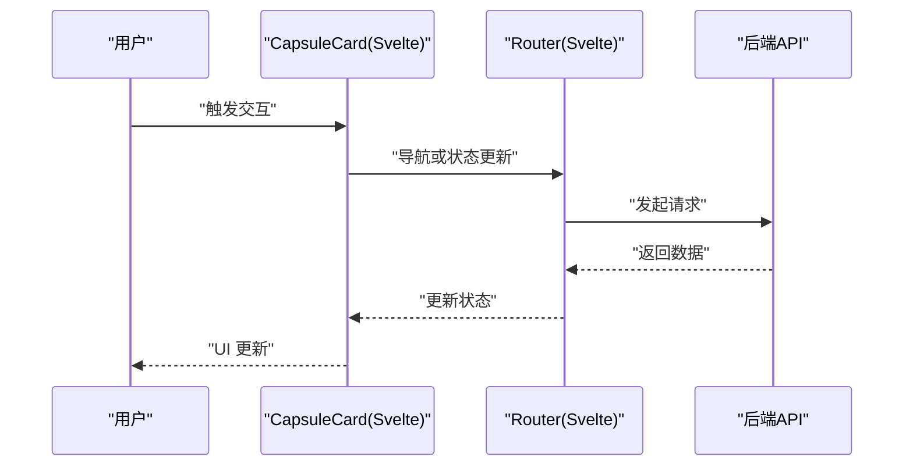
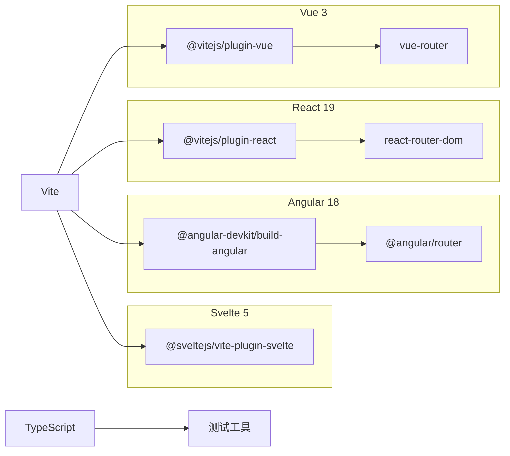

# 前端实现

<cite>
**本文引用的文件**
- [frontends/vue3-ts/package.json](file://frontends/vue3-ts/package.json)
- [frontends/vue3-ts/tsconfig.json](file://frontends/vue3-ts/tsconfig.json)
- [frontends/vue3-ts/tsconfig.app.json](file://frontends/vue3-ts/tsconfig.app.json)
- [frontends/vue3-ts/vite.config.ts](file://frontends/vue3-ts/vite.config.ts)
- [frontends/vue3-ts/src/main.ts](file://frontends/vue3-ts/src/main.ts)
- [frontends/vue3-ts/src/App.vue](file://frontends/vue3-ts/src/App.vue)
- [frontends/vue3-ts/src/router/index.ts](file://frontends/vue3-ts/src/router/index.ts)
- [frontends/vue3-ts/src/composables/useCapsule.ts](file://frontends/vue3-ts/src/composables/useCapsule.ts)
- [frontends/vue3-ts/src/composables/useTheme.ts](file://frontends/vue3-ts/src/composables/useTheme.ts)
- [frontends/vue3-ts/src/services/capsule.service.ts](file://frontends/vue3-ts/src/services/capsule.service.ts)
- [frontends/vue3-ts/src/services/admin.service.ts](file://frontends/vue3-ts/src/services/admin.service.ts)
- [frontends/vue3-ts/src/components/CapsuleCard.vue](file://frontends/vue3-ts/src/components/CapsuleCard.vue)
- [frontends/vue3-ts/src/components/ThemeToggle.vue](file://frontends/vue3-ts/src/components/ThemeToggle.vue)
- [frontends/vue3-ts/src/views/HomeView.vue](file://frontends/vue3-ts/src/views/HomeView.vue)
- [frontends/vue3-ts/src/views/AdminView.vue](file://frontends/vue3-ts/src/views/AdminView.vue)
- [frontends/vue3-ts/src/views/CreateView.vue](file://frontends/vue3-ts/src/views/CreateView.vue)
- [frontends/vue3-ts/src/views/OpenView.vue](file://frontends/vue3-ts/src/views/OpenView.vue)
- [frontends/vue3-ts/src/views/AboutView.vue](file://frontends/vue3-ts/src/views/AboutView.vue)
- [frontends/vue3-ts/src/__tests__/components/CapsuleCard.test.ts](file://frontends/vue3-ts/src/__tests__/components/CapsuleCard.test.ts)
- [frontends/vue3-ts/src/__tests__/composables/useCapsule.test.ts](file://frontends/vue3-ts/src/__tests__/composables/useCapsule.test.ts)
- [frontends/vue3-ts/src/__tests__/composables/useTheme.test.ts](file://frontends/vue3-ts/src/__tests__/composables/useTheme.test.ts)

- [frontends/react-ts/package.json](file://frontends/react-ts/package.json)
- [frontends/react-ts/tsconfig.json](file://frontends/react-ts/tsconfig.json)
- [frontends/react-ts/tsconfig.app.json](file://frontends/react-ts/tsconfig.app.json)
- [frontends/react-ts/vite.config.ts](file://frontends/react-ts/vite.config.ts)
- [frontends/react-ts/src/main.tsx](file://frontends/react-ts/src/main.tsx)
- [frontends/react-ts/src/App.tsx](file://frontends/react-ts/src/App.tsx)
- [frontends/react-ts/src/hooks/useCapsule.ts](file://frontends/react-ts/src/hooks/useCapsule.ts)
- [frontends/react-ts/src/hooks/useTheme.ts](file://frontends/react-ts/src/hooks/useTheme.ts)
- [frontends/react-ts/src/api/index.ts](file://frontends/react-ts/src/api/index.ts)
- [frontends/react-ts/src/components/CapsuleCard.tsx](file://frontends/react-ts/src/components/CapsuleCard.tsx)
- [frontends/react-ts/src/components/ThemeToggle.tsx](file://frontends/react-ts/src/components/ThemeToggle.tsx)
- [frontends/react-ts/src/views/HomeView.tsx](file://frontends/react-ts/src/views/HomeView.tsx)
- [frontends/react-ts/src/views/AdminView.tsx](file://frontends/react-ts/src/views/AdminView.tsx)
- [frontends/react-ts/src/views/CreateView.tsx](file://frontends/react-ts/src/views/CreateView.tsx)
- [frontends/react-ts/src/views/OpenView.tsx](file://frontends/react-ts/src/views/OpenView.tsx)
- [frontends/react-ts/src/views/AboutView.tsx](file://frontends/react-ts/src/views/AboutView.tsx)
- [frontends/react-ts/src/__tests__/components/CapsuleCard.test.tsx](file://frontends/react-ts/src/__tests__/components/CapsuleCard.test.tsx)
- [frontends/react-ts/src/__tests__/hooks/useCapsule.test.ts](file://frontends/react-ts/src/__tests__/hooks/useCapsule.test.ts)
- [frontends/react-ts/src/__tests__/hooks/useTheme.test.ts](file://frontends/react-ts/src/__tests__/hooks/useTheme.test.ts)

- [frontends/angular-ts/package.json](file://frontends/angular-ts/package.json)
- [frontends/angular-ts/tsconfig.json](file://frontends/angular-ts/tsconfig.json)
- [frontends/angular-ts/tsconfig.app.json](file://frontends/angular-ts/tsconfig.app.json)
- [frontends/angular-ts/tsconfig.spec.json](file://frontends/angular-ts/tsconfig.spec.json)
- [frontends/angular-ts/angular.json](file://frontends/angular-ts/angular.json)
- [frontends/angular-ts/proxy.conf.json](file://frontends/angular-ts/proxy.conf.json)
- [frontends/angular-ts/src/main.ts](file://frontends/angular-ts/src/main.ts)
- [frontends/angular-ts/src/app/app.component.ts](file://frontends/angular-ts/src/app/app.component.ts)
- [frontends/angular-ts/src/app/app.config.ts](file://frontends/angular-ts/src/app/app.config.ts)
- [frontends/angular-ts/src/app/app.routes.ts](file://frontends/angular-ts/src/app/app.routes.ts)
- [frontends/angular-ts/src/app/services/capsule.service.ts](file://frontends/angular-ts/src/app/services/capsule.service.ts)
- [frontends/angular-ts/src/app/services/admin.service.ts](file://frontends/angular-ts/src/app/services/admin.service.ts)
- [frontends/angular-ts/src/app/services/theme.service.ts](file://frontends/angular-ts/src/app/services/theme.service.ts)
- [frontends/angular-ts/src/app/components/capsule-card/capsule-card.component.ts](file://frontends/angular-ts/src/app/components/capsule-card/capsule-card.component.ts)
- [frontends/angular-ts/src/app/components/theme-toggle/theme-toggle.component.ts](file://frontends/angular-ts/src/app/components/theme-toggle/theme-toggle.component.ts)
- [frontends/angular-ts/src/app/views/home/home.component.ts](file://frontends/angular-ts/src/app/views/home/home.component.ts)
- [frontends/angular-ts/src/app/views/admin/admin.component.ts](file://frontends/angular-ts/src/app/views/admin/admin.component.ts)
- [frontends/angular-ts/src/app/views/create/create.component.ts](file://frontends/angular-ts/src/app/views/create/create.component.ts)
- [frontends/angular-ts/src/app/views/open/open.component.ts](file://frontends/angular-ts/src/app/views/open/open.component.ts)
- [frontends/angular-ts/src/app/views/about/about.component.ts](file://frontends/angular-ts/src/app/views/about/about.component.ts)
- [frontends/angular-ts/src/__tests__/components/capsule-card.component.spec.ts](file://frontends/angular-ts/src/__tests__/components/capsule-card.component.spec.ts)
- [frontends/angular-ts/src/__tests__/services/capsule.service.spec.ts](file://frontends/angular-ts/src/__tests__/services/capsule.service.spec.ts)
- [frontends/angular-ts/src/__tests__/services/theme.service.spec.ts](file://frontends/angular-ts/src/__tests__/services/theme.service.spec.ts)

- [frontends/svelte-ts/package.json](file://frontends/svelte-ts/package.json)
- [frontends/svelte-ts/tsconfig.json](file://frontends/svelte-ts/tsconfig.json)
- [frontends/svelte-ts/vite.config.ts](file://frontends/svelte-ts/vite.config.ts)
- [frontends/svelte-ts/src/main.ts](file://frontends/svelte-ts/src/main.ts)
- [frontends/svelte-ts/src/App.svelte](file://frontends/svelte-ts/src/App.svelte)
- [frontends/svelte-ts/src/lib/theme.ts](file://frontends/svelte-ts/src/lib/theme.ts)
- [frontends/svelte-ts/src/lib/router.svelte.ts](file://frontends/svelte-ts/src/lib/router.svelte.ts)
- [frontends/svelte-ts/src/lib/api/index.ts](file://frontends/svelte-ts/src/lib/api/index.ts)
- [frontends/svelte-ts/src/lib/components/CapsuleCard.svelte](file://frontends/svelte-ts/src/lib/components/CapsuleCard.svelte)
- [frontends/svelte-ts/src/lib/components/ThemeToggle.svelte](file://frontends/svelte-ts/src/lib/components/ThemeToggle.svelte)
- [frontends/svelte-ts/src/views/Home.svelte](file://frontends/svelte-ts/src/views/Home.svelte)
- [frontends/svelte-ts/src/views/Admin.svelte](file://frontends/svelte-ts/src/views/Admin.svelte)
- [frontends/svelte-ts/src/views/Create.svelte](file://frontends/svelte-ts/src/views/Create.svelte)
- [frontends/svelte-ts/src/views/Open.svelte](file://frontends/svelte-ts/src/views/Open.svelte)
- [frontends/svelte-ts/src/views/About.svelte](file://frontends/svelte-ts/src/views/About.svelte)
</cite>

## 目录
1. [引言](#引言)
2. [项目结构](#项目结构)
3. [核心组件](#核心组件)
4. [架构总览](#架构总览)
5. [详细组件分析](#详细组件分析)
6. [依赖分析](#依赖分析)
7. [性能考虑](#性能考虑)
8. [故障排查指南](#故障排查指南)
9. [结论](#结论)
10. [附录](#附录)

## 引言
本文件为 HelloTime 项目的前端实现综合文档，覆盖四种技术栈：Vue 3 + TypeScript、React 19 + TypeScript、Angular 18 + TypeScript、Svelte 5 + TypeScript。文档从架构与组件设计、状态与路由、类型系统、设计令牌与响应式布局、主题切换、组件库与自定义 Hook/组合式函数、表单验证、开发工具与构建优化等方面进行系统化梳理，并提供跨框架对比与实践建议。

## 项目结构
四个前端子项目均采用 Vite 作为本地开发服务器与打包工具，统一通过代理访问后端服务；所有实现共享同一套设计规范资源（tokens.css、base.css、components.css、layout.css），确保视觉一致性与可维护性。

图表来源
- [frontends/vue3-ts/package.json:1-30](file://frontends/vue3-ts/package.json#L1-L30)
- [frontends/vue3-ts/vite.config.ts:1-23](file://frontends/vue3-ts/vite.config.ts#L1-L23)
- [frontends/vue3-ts/src/main.ts:1-23](file://frontends/vue3-ts/src/main.ts#L1-L23)
- [frontends/react-ts/package.json:1-31](file://frontends/react-ts/package.json#L1-L31)
- [frontends/react-ts/vite.config.ts:1-23](file://frontends/react-ts/vite.config.ts#L1-L23)
- [frontends/react-ts/src/main.tsx:1-20](file://frontends/react-ts/src/main.tsx#L1-L20)
- [frontends/angular-ts/package.json:1-38](file://frontends/angular-ts/package.json#L1-L38)
- [frontends/angular-ts/angular.json:1-108](file://frontends/angular-ts/angular.json#L1-L108)
- [frontends/angular-ts/src/main.ts:1-7](file://frontends/angular-ts/src/main.ts#L1-L7)
- [frontends/svelte-ts/package.json:1-21](file://frontends/svelte-ts/package.json#L1-L21)
- [frontends/svelte-ts/vite.config.ts:1-29](file://frontends/svelte-ts/vite.config.ts#L1-L29)
- [frontends/svelte-ts/src/main.ts:1-17](file://frontends/svelte-ts/src/main.ts#L1-L17)

章节来源
- [frontends/vue3-ts/package.json:1-30](file://frontends/vue3-ts/package.json#L1-L30)
- [frontends/react-ts/package.json:1-31](file://frontends/react-ts/package.json#L1-L31)
- [frontends/angular-ts/package.json:1-38](file://frontends/angular-ts/package.json#L1-L38)
- [frontends/svelte-ts/package.json:1-21](file://frontends/svelte-ts/package.json#L1-L21)
- [frontends/vue3-ts/vite.config.ts:1-23](file://frontends/vue3-ts/vite.config.ts#L1-L23)
- [frontends/react-ts/vite.config.ts:1-23](file://frontends/react-ts/vite.config.ts#L1-L23)
- [frontends/svelte-ts/vite.config.ts:1-29](file://frontends/svelte-ts/vite.config.ts#L1-L29)
- [frontends/angular-ts/angular.json:1-108](file://frontends/angular-ts/angular.json#L1-L108)

## 核心组件
- 路由与视图：四套实现均包含首页、关于页、管理员页、创建胶囊页、打开胶囊页等视图，路由以各自生态的标准方式组织。
- 业务组件：胶囊卡片、胶囊表单、代码输入、倒计时钟、确认对话框等通用组件在各框架中均有对应实现。
- 服务层：封装对后端 API 的调用，如胶囊服务、管理员服务等。
- 主题与交互：主题切换组件贯穿各实现，提供明暗主题切换能力。
- 类型系统：统一使用 TypeScript，类型定义位于 types/index.ts 或同级目录，确保接口一致。

章节来源
- [frontends/vue3-ts/src/views/HomeView.vue](file://frontends/vue3-ts/src/views/HomeView.vue)
- [frontends/vue3-ts/src/views/AdminView.vue](file://frontends/vue3-ts/src/views/AdminView.vue)
- [frontends/vue3-ts/src/views/CreateView.vue](file://frontends/vue3-ts/src/views/CreateView.vue)
- [frontends/vue3-ts/src/views/OpenView.vue](file://frontends/vue3-ts/src/views/OpenView.vue)
- [frontends/vue3-ts/src/views/AboutView.vue](file://frontends/vue3-ts/src/views/AboutView.vue)
- [frontends/react-ts/src/views/HomeView.tsx](file://frontends/react-ts/src/views/HomeView.tsx)
- [frontends/react-ts/src/views/AdminView.tsx](file://frontends/react-ts/src/views/AdminView.tsx)
- [frontends/react-ts/src/views/CreateView.tsx](file://frontends/react-ts/src/views/CreateView.tsx)
- [frontends/react-ts/src/views/OpenView.tsx](file://frontends/react-ts/src/views/OpenView.tsx)
- [frontends/react-ts/src/views/AboutView.tsx](file://frontends/react-ts/src/views/AboutView.tsx)
- [frontends/angular-ts/src/app/views/home/home.component.ts](file://frontends/angular-ts/src/app/views/home/home.component.ts)
- [frontends/angular-ts/src/app/views/admin/admin.component.ts](file://frontends/angular-ts/src/app/views/admin/admin.component.ts)
- [frontends/angular-ts/src/app/views/create/create.component.ts](file://frontends/angular-ts/src/app/views/create/create.component.ts)
- [frontends/angular-ts/src/app/views/open/open.component.ts](file://frontends/angular-ts/src/app/views/open/open.component.ts)
- [frontends/angular-ts/src/app/views/about/about.component.ts](file://frontends/angular-ts/src/app/views/about/about.component.ts)
- [frontends/svelte-ts/src/views/Home.svelte](file://frontends/svelte-ts/src/views/Home.svelte)
- [frontends/svelte-ts/src/views/Admin.svelte](file://frontends/svelte-ts/src/views/Admin.svelte)
- [frontends/svelte-ts/src/views/Create.svelte](file://frontends/svelte-ts/src/views/Create.svelte)
- [frontends/svelte-ts/src/views/Open.svelte](file://frontends/svelte-ts/src/views/Open.svelte)
- [frontends/svelte-ts/src/views/About.svelte](file://frontends/svelte-ts/src/views/About.svelte)

## 架构总览
四套实现均遵循“入口文件 -> 应用根组件/模块 -> 路由 -> 视图 -> 组件/服务”的分层结构；通过统一的代理配置访问后端服务，共享设计令牌与样式资源。

图表来源
- [frontends/vue3-ts/src/main.ts:1-23](file://frontends/vue3-ts/src/main.ts#L1-L23)
- [frontends/react-ts/src/main.tsx:1-20](file://frontends/react-ts/src/main.tsx#L1-L20)
- [frontends/angular-ts/src/main.ts:1-7](file://frontends/angular-ts/src/main.ts#L1-L7)
- [frontends/svelte-ts/src/main.ts:1-17](file://frontends/svelte-ts/src/main.ts#L1-L17)
- [frontends/vue3-ts/src/router/index.ts](file://frontends/vue3-ts/src/router/index.ts)
- [frontends/react-ts/src/api/index.ts](file://frontends/react-ts/src/api/index.ts)
- [frontends/angular-ts/src/app/app.routes.ts](file://frontends/angular-ts/src/app/app.routes.ts)
- [frontends/svelte-ts/src/lib/router.svelte.ts](file://frontends/svelte-ts/src/lib/router.svelte.ts)
- [frontends/vue3-ts/src/services/capsule.service.ts](file://frontends/vue3-ts/src/services/capsule.service.ts)
- [frontends/vue3-ts/src/services/admin.service.ts](file://frontends/vue3-ts/src/services/admin.service.ts)
- [frontends/angular-ts/src/app/services/capsule.service.ts](file://frontends/angular-ts/src/app/services/capsule.service.ts)
- [frontends/angular-ts/src/app/services/admin.service.ts](file://frontends/angular-ts/src/app/services/admin.service.ts)
- [frontends/angular-ts/src/app/services/theme.service.ts](file://frontends/angular-ts/src/app/services/theme.service.ts)
- [frontends/svelte-ts/src/lib/api/index.ts](file://frontends/svelte-ts/src/lib/api/index.ts)
- [frontends/vue3-ts/src/components/CapsuleCard.vue](file://frontends/vue3-ts/src/components/CapsuleCard.vue)
- [frontends/react-ts/src/components/CapsuleCard.tsx](file://frontends/react-ts/src/components/CapsuleCard.tsx)
- [frontends/angular-ts/src/app/components/capsule-card/capsule-card.component.ts](file://frontends/angular-ts/src/app/components/capsule-card/capsule-card.component.ts)
- [frontends/svelte-ts/src/lib/components/CapsuleCard.svelte](file://frontends/svelte-ts/src/lib/components/CapsuleCard.svelte)

## 详细组件分析

### Vue 3 + TypeScript 实现
- 应用入口与样式：在入口文件中导入设计令牌与基础样式，创建并挂载应用，注册路由。
- 路由：集中于 router/index.ts，组织视图与导航。
- 组合式函数：useCapsule、useTheme 等封装业务逻辑与主题状态。
- 服务层：capsule.service.ts、admin.service.ts 提供 API 访问。
- 组件：CapsuleCard、ThemeToggle 等组件复用设计令牌样式。
- 测试：组件与组合式函数均配有单元测试。

图表来源
- [frontends/vue3-ts/src/components/CapsuleCard.vue](file://frontends/vue3-ts/src/components/CapsuleCard.vue)
- [frontends/vue3-ts/src/services/capsule.service.ts](file://frontends/vue3-ts/src/services/capsule.service.ts)
- [frontends/vue3-ts/src/composables/useCapsule.ts](file://frontends/vue3-ts/src/composables/useCapsule.ts)

章节来源
- [frontends/vue3-ts/src/main.ts:1-23](file://frontends/vue3-ts/src/main.ts#L1-L23)
- [frontends/vue3-ts/src/router/index.ts](file://frontends/vue3-ts/src/router/index.ts)
- [frontends/vue3-ts/src/composables/useCapsule.ts](file://frontends/vue3-ts/src/composables/useCapsule.ts)
- [frontends/vue3-ts/src/composables/useTheme.ts](file://frontends/vue3-ts/src/composables/useTheme.ts)
- [frontends/vue3-ts/src/services/capsule.service.ts](file://frontends/vue3-ts/src/services/capsule.service.ts)
- [frontends/vue3-ts/src/services/admin.service.ts](file://frontends/vue3-ts/src/services/admin.service.ts)
- [frontends/vue3-ts/src/components/CapsuleCard.vue](file://frontends/vue3-ts/src/components/CapsuleCard.vue)
- [frontends/vue3-ts/src/components/ThemeToggle.vue](file://frontends/vue3-ts/src/components/ThemeToggle.vue)
- [frontends/vue3-ts/src/__tests__/components/CapsuleCard.test.ts](file://frontends/vue3-ts/src/__tests__/components/CapsuleCard.test.ts)
- [frontends/vue3-ts/src/__tests__/composables/useCapsule.test.ts](file://frontends/vue3-ts/src/__tests__/composables/useCapsule.test.ts)
- [frontends/vue3-ts/src/__tests__/composables/useTheme.test.ts](file://frontends/vue3-ts/src/__tests__/composables/useTheme.test.ts)

### React 19 + TypeScript 实现
- 应用入口与样式：在入口文件中导入设计令牌与基础样式，使用 StrictMode 包裹应用。
- 路由：通过 React Router 组织视图与导航。
- 自定义 Hook：useCapsule、useTheme 封装状态与副作用。
- API 模块：统一导出 API 方法，便于组件调用。
- 组件：CapsuleCard、ThemeToggle 等组件复用设计令牌样式。
- 测试：组件与 Hook 均配有单元测试。

图表来源
- [frontends/react-ts/src/components/CapsuleCard.tsx](file://frontends/react-ts/src/components/CapsuleCard.tsx)
- [frontends/react-ts/src/hooks/useCapsule.ts](file://frontends/react-ts/src/hooks/useCapsule.ts)
- [frontends/react-ts/src/api/index.ts](file://frontends/react-ts/src/api/index.ts)

章节来源
- [frontends/react-ts/src/main.tsx:1-20](file://frontends/react-ts/src/main.tsx#L1-L20)
- [frontends/react-ts/src/hooks/useCapsule.ts](file://frontends/react-ts/src/hooks/useCapsule.ts)
- [frontends/react-ts/src/hooks/useTheme.ts](file://frontends/react-ts/src/hooks/useTheme.ts)
- [frontends/react-ts/src/api/index.ts](file://frontends/react-ts/src/api/index.ts)
- [frontends/react-ts/src/components/CapsuleCard.tsx](file://frontends/react-ts/src/components/CapsuleCard.tsx)
- [frontends/react-ts/src/components/ThemeToggle.tsx](file://frontends/react-ts/src/components/ThemeToggle.tsx)
- [frontends/react-ts/src/__tests__/components/CapsuleCard.test.tsx](file://frontends/react-ts/src/__tests__/components/CapsuleCard.test.tsx)
- [frontends/react-ts/src/__tests__/hooks/useCapsule.test.ts](file://frontends/react-ts/src/__tests__/hooks/useCapsule.test.ts)
- [frontends/react-ts/src/__tests__/hooks/useTheme.test.ts](file://frontends/react-ts/src/__tests__/hooks/useTheme.test.ts)

### Angular 18 + TypeScript 实现
- 启动方式：通过 bootstrapApplication 启动应用，配置集中于 app.config.ts。
- 路由：app.routes.ts 集中定义路由规则。
- 服务：独立的服务模块封装 API 调用，如 capsule.service.ts、admin.service.ts、theme.service.ts。
- 组件：胶囊卡片、主题切换等组件均为独立的 standalone 组件。
- 构建与样式：angular.json 中统一引入设计令牌与基础样式，支持生产/开发配置。

图表来源
- [frontends/angular-ts/src/app/components/capsule-card/capsule-card.component.ts](file://frontends/angular-ts/src/app/components/capsule-card/capsule-card.component.ts)
- [frontends/angular-ts/src/app/services/capsule.service.ts](file://frontends/angular-ts/src/app/services/capsule.service.ts)
- [frontends/angular-ts/src/app/services/theme.service.ts](file://frontends/angular-ts/src/app/services/theme.service.ts)

章节来源
- [frontends/angular-ts/src/main.ts:1-7](file://frontends/angular-ts/src/main.ts#L1-L7)
- [frontends/angular-ts/src/app/app.config.ts](file://frontends/angular-ts/src/app/app.config.ts)
- [frontends/angular-ts/src/app/app.routes.ts](file://frontends/angular-ts/src/app/app.routes.ts)
- [frontends/angular-ts/src/app/services/capsule.service.ts](file://frontends/angular-ts/src/app/services/capsule.service.ts)
- [frontends/angular-ts/src/app/services/admin.service.ts](file://frontends/angular-ts/src/app/services/admin.service.ts)
- [frontends/angular-ts/src/app/services/theme.service.ts](file://frontends/angular-ts/src/app/services/theme.service.ts)
- [frontends/angular-ts/src/app/components/capsule-card/capsule-card.component.ts](file://frontends/angular-ts/src/app/components/capsule-card/capsule-card.component.ts)
- [frontends/angular-ts/src/app/components/theme-toggle/theme-toggle.component.ts](file://frontends/angular-ts/src/app/components/theme-toggle/theme-toggle.component.ts)
- [frontends/angular-ts/src/__tests__/components/capsule-card.component.spec.ts](file://frontends/angular-ts/src/__tests__/components/capsule-card.component.spec.ts)
- [frontends/angular-ts/src/__tests__/services/capsule.service.spec.ts](file://frontends/angular-ts/src/__tests__/services/capsule.service.spec.ts)
- [frontends/angular-ts/src/__tests__/services/theme.service.spec.ts](file://frontends/angular-ts/src/__tests__/services/theme.service.spec.ts)

### Svelte 5 + TypeScript 实现
- 应用入口与样式：入口文件导入设计令牌与基础样式，使用 mount 渲染根组件。
- 路由：通过自定义 router.svelte.ts 管理页面跳转。
- 组件：CapsuleCard、ThemeToggle 等组件基于 Svelte 语法编写。
- API：lib/api/index.ts 统一导出 API 方法。
- 主题：lib/theme.ts 提供主题状态与切换逻辑。

图表来源
- [frontends/svelte-ts/src/lib/components/CapsuleCard.svelte](file://frontends/svelte-ts/src/lib/components/CapsuleCard.svelte)
- [frontends/svelte-ts/src/lib/router.svelte.ts](file://frontends/svelte-ts/src/lib/router.svelte.ts)
- [frontends/svelte-ts/src/lib/api/index.ts](file://frontends/svelte-ts/src/lib/api/index.ts)

章节来源
- [frontends/svelte-ts/src/main.ts:1-17](file://frontends/svelte-ts/src/main.ts#L1-L17)
- [frontends/svelte-ts/src/lib/router.svelte.ts](file://frontends/svelte-ts/src/lib/router.svelte.ts)
- [frontends/svelte-ts/src/lib/theme.ts](file://frontends/svelte-ts/src/lib/theme.ts)
- [frontends/svelte-ts/src/lib/api/index.ts](file://frontends/svelte-ts/src/lib/api/index.ts)
- [frontends/svelte-ts/src/lib/components/CapsuleCard.svelte](file://frontends/svelte-ts/src/lib/components/CapsuleCard.svelte)
- [frontends/svelte-ts/src/lib/components/ThemeToggle.svelte](file://frontends/svelte-ts/src/lib/components/ThemeToggle.svelte)

## 依赖分析
- 通用依赖：四套实现均依赖 Vite、TypeScript、测试工具（Vue 使用 Vitest，React 使用 Vitest，Angular 使用 Karma+Jasmine，Svelte 使用 Vite 测试能力）。
- 框架特定依赖：Vue 使用 @vitejs/plugin-vue；React 使用 @vitejs/plugin-react；Angular 使用 @angular-devkit/build-angular；Svelte 使用 @sveltejs/vite-plugin-svelte。
- 路由与状态：Vue 使用 vue-router；React 使用 react-router-dom；Angular 使用 @angular/router；Svelte 采用自定义路由逻辑。
- 代理与开发：四套实现均配置了 /api 代理至后端服务，端口在各框架下略有差异。

图表来源
- [frontends/vue3-ts/package.json:1-30](file://frontends/vue3-ts/package.json#L1-L30)
- [frontends/react-ts/package.json:1-31](file://frontends/react-ts/package.json#L1-L31)
- [frontends/angular-ts/package.json:1-38](file://frontends/angular-ts/package.json#L1-L38)
- [frontends/svelte-ts/package.json:1-21](file://frontends/svelte-ts/package.json#L1-L21)

章节来源
- [frontends/vue3-ts/package.json:1-30](file://frontends/vue3-ts/package.json#L1-L30)
- [frontends/react-ts/package.json:1-31](file://frontends/react-ts/package.json#L1-L31)
- [frontends/angular-ts/package.json:1-38](file://frontends/angular-ts/package.json#L1-L38)
- [frontends/svelte-ts/package.json:1-21](file://frontends/svelte-ts/package.json#L1-L21)

## 性能考虑
- 构建优化
  - 生产构建开启代码分割与最小化，按框架默认策略进行资源压缩与哈希命名。
  - Angular 在 angular.json 中配置了生产预算与输出哈希策略，有助于缓存与体积控制。
- 开发体验
  - 四套实现均启用热更新与源码映射，提升调试效率。
  - Vue 与 React 使用 Vite 插件加速编译；Angular 使用官方构建器；Svelte 使用 Vite 插件。
- 运行时优化
  - 组件按需加载与懒加载策略（视路由与视图规模而定）。
  - 使用设计令牌与共享样式减少重复计算与样式抖动。
- 网络与代理
  - 统一通过 /api 代理访问后端，避免跨域问题，同时便于本地联调。

## 故障排查指南
- 代理失败
  - 确认后端服务已启动且监听端口正确；检查各框架 vite.config.ts 中的代理配置与目标地址。
- 样式不生效
  - 确认入口文件已导入 tokens.css、base.css、components.css、layout.css；检查路径别名配置是否正确。
- 路由异常
  - Vue：检查 router/index.ts 路由定义与导航守卫。
  - React：检查路由配置与 Link/NavLink 使用。
  - Angular：检查 app.routes.ts 与路由模块导入。
  - Svelte：检查自定义路由逻辑与页面组件挂载。
- 主题切换无效
  - 检查主题服务或组合式函数/Hook 是否正确读写主题状态；确认 CSS 变量与类名切换逻辑。
- 测试失败
  - Vue：使用 Vitest 与 @testing-library/vue；确保组件快照与交互模拟正确。
  - React：使用 Vitest 与 @testing-library/react；注意 StrictMode 对副作用的影响。
  - Angular：使用 Karma+Jasmine；确保 TestBed 配置与异步测试处理。
  - Svelte：使用 Vite 测试能力；注意组件生命周期与事件绑定。

章节来源
- [frontends/vue3-ts/vite.config.ts:1-23](file://frontends/vue3-ts/vite.config.ts#L1-L23)
- [frontends/react-ts/vite.config.ts:1-23](file://frontends/react-ts/vite.config.ts#L1-L23)
- [frontends/svelte-ts/vite.config.ts:1-29](file://frontends/svelte-ts/vite.config.ts#L1-L29)
- [frontends/angular-ts/angular.json:24-66](file://frontends/angular-ts/angular.json#L24-L66)

## 结论
四套前端实现均遵循统一的设计规范与开发流程，分别利用 Vue 3 的组合式 API、React 的 Hooks、Angular 的服务与组件体系、Svelte 的响应式语法，完成相同的功能目标。在工程化方面，四套实现均采用 Vite 与 TypeScript，辅以测试工具，具备良好的可维护性与扩展性。选择哪一种技术栈取决于团队偏好、生态成熟度与长期演进需求。

## 附录
- 设计令牌与样式
  - 所有实现共享 tokens.css、base.css、components.css、layout.css，确保视觉一致性。
- 跨框架对比要点
  - 组件模型：Vue（模板+组合式）、React（函数式+Hooks）、Angular（组件+服务）、Svelte（声明式响应）。
  - 路由与状态：Vue/React/Angular 均有成熟的生态；Svelte 采用自定义路由与响应式存储。
  - 类型系统：四套实现均使用 TypeScript，接口与类型定义保持一致。
- 最佳实践
  - 组件拆分与职责单一；合理使用组合式函数/Hook；统一错误处理与加载状态；持续集成测试覆盖率。