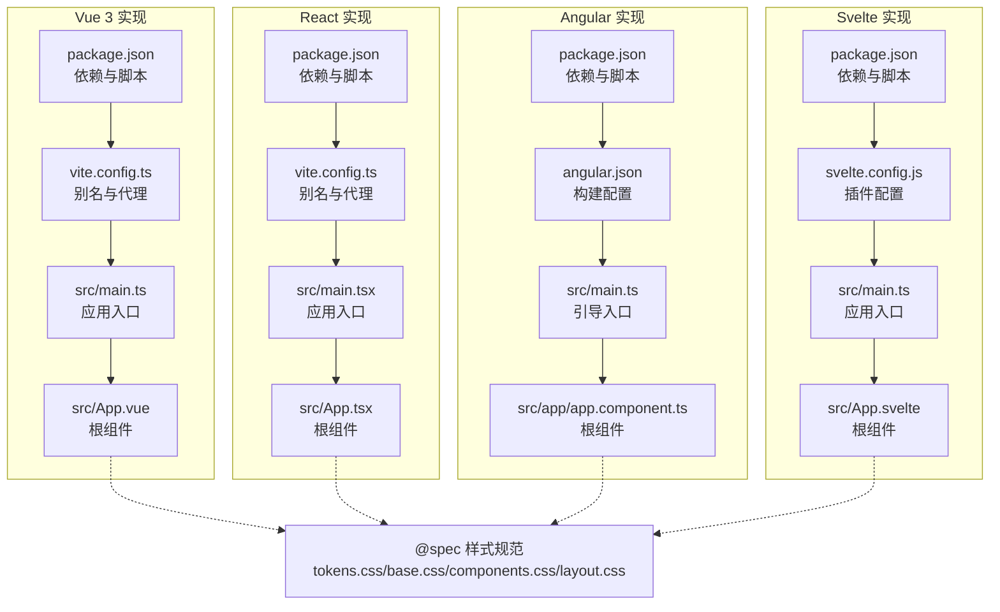
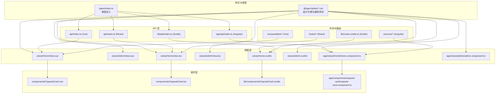
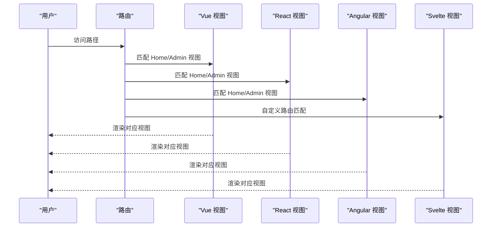
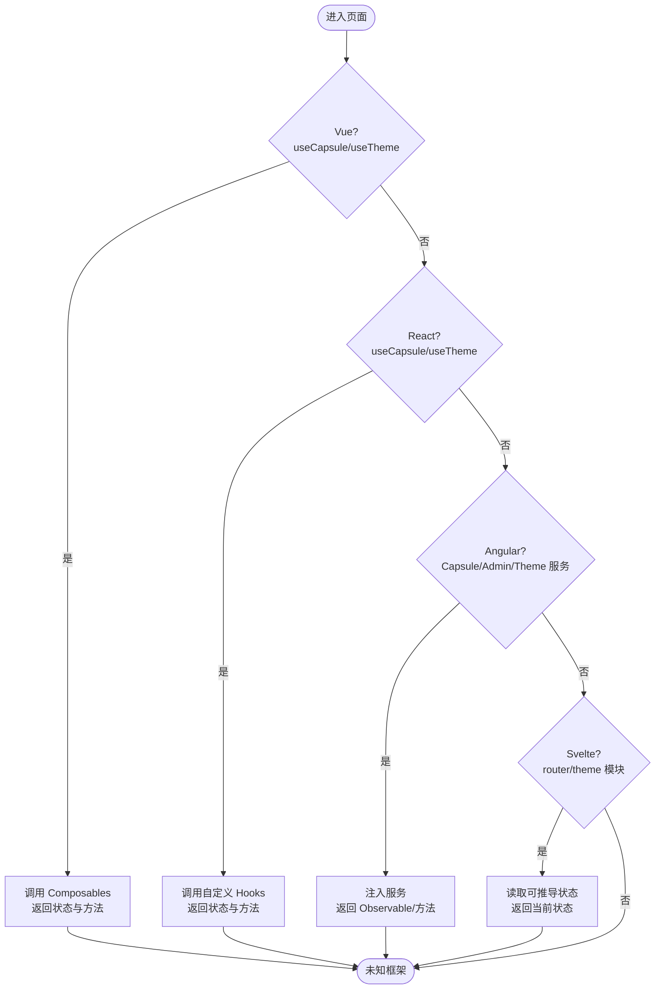
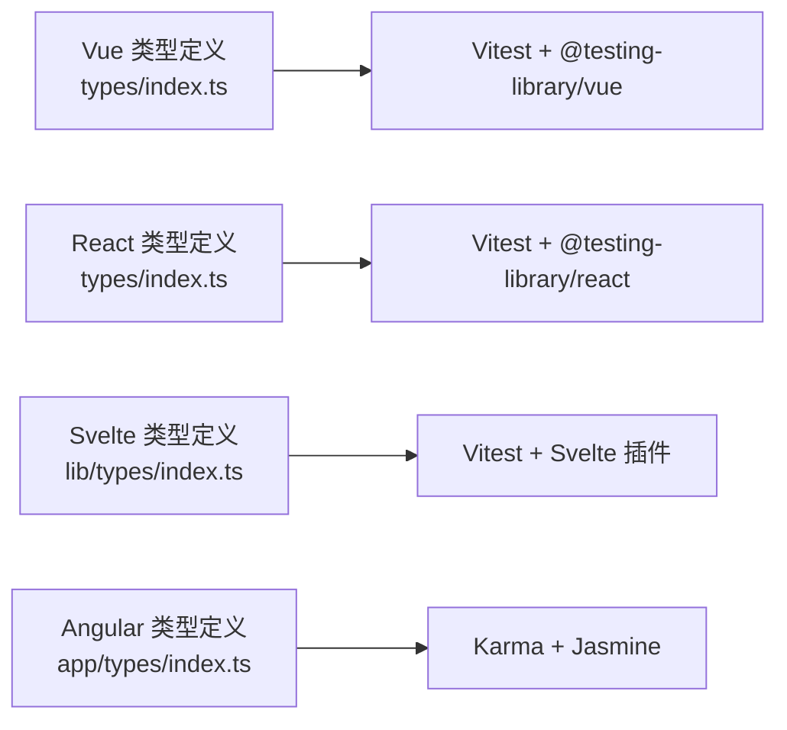
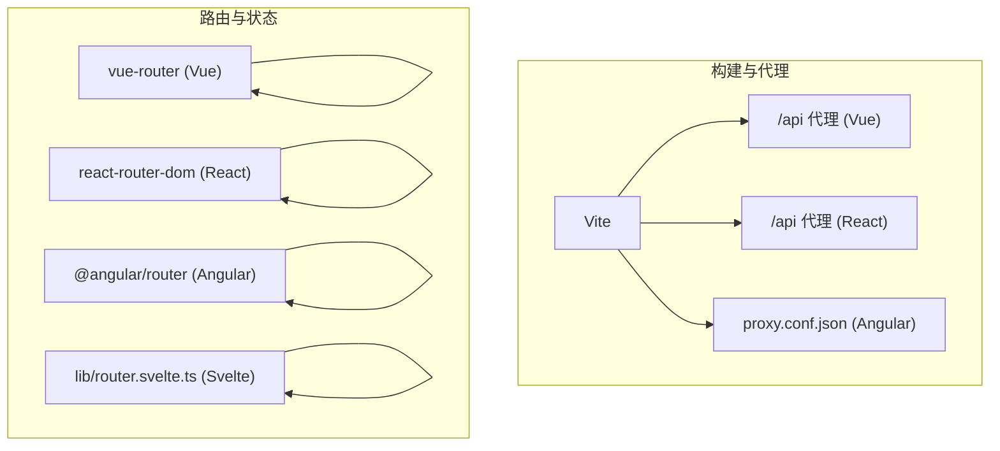

# 前端技术对比

<cite>
**本文引用的文件**
- [frontends/vue3-ts/package.json](file://frontends/vue3-ts/package.json)
- [frontends/react-ts/package.json](file://frontends/react-ts/package.json)
- [frontends/angular-ts/package.json](file://frontends/angular-ts/package.json)
- [frontends/svelte-ts/package.json](file://frontends/svelte-ts/package.json)
- [frontends/vue3-ts/vite.config.ts](file://frontends/vue3-ts/vite.config.ts)
- [frontends/react-ts/vite.config.ts](file://frontends/react-ts/vite.config.ts)
- [frontends/angular-ts/angular.json](file://frontends/angular-ts/angular.json)
- [frontends/svelte-ts/svelte.config.js](file://frontends/svelte-ts/svelte.config.js)
- [frontends/vue3-ts/src/main.ts](file://frontends/vue3-ts/src/main.ts)
- [frontends/react-ts/src/main.tsx](file://frontends/react-ts/src/main.tsx)
- [frontends/angular-ts/src/main.ts](file://frontends/angular-ts/src/main.ts)
- [frontends/svelte-ts/src/main.ts](file://frontends/svelte-ts/src/main.ts)
- [frontends/vue3-ts/src/App.vue](file://frontends/vue3-ts/src/App.vue)
- [frontends/react-ts/src/App.tsx](file://frontends/react-ts/src/App.tsx)
- [frontends/angular-ts/src/app/app.component.ts](file://frontends/angular-ts/src/app/app.component.ts)
- [frontends/svelte-ts/src/App.svelte](file://frontends/svelte-ts/src/App.svelte)
- [frontends/vue3-ts/src/router/index.ts](file://frontends/vue3-ts/src/router/index.ts)
- [frontends/vue3-ts/src/composables/useCapsule.ts](file://frontends/vue3-ts/src/composables/useCapsule.ts)
- [frontends/vue3-ts/src/composables/useTheme.ts](file://frontends/vue3-ts/src/composables/useTheme.ts)
- [frontends/react-ts/src/hooks/useCapsule.ts](file://frontends/react-ts/src/hooks/useCapsule.ts)
- [frontends/react-ts/src/hooks/useTheme.ts](file://frontends/react-ts/src/hooks/useTheme.ts)
- [frontends/svelte-ts/src/lib/router.svelte.ts](file://frontends/svelte-ts/src/lib/router.svelte.ts)
- [frontends/svelte-ts/src/lib/theme.ts](file://frontends/svelte-ts/src/lib/theme.ts)
- [frontends/angular-ts/src/app/services/capsule.service.ts](file://frontends/angular-ts/src/app/services/capsule.service.ts)
- [frontends/angular-ts/src/app/services/admin.service.ts](file://frontends/angular-ts/src/app/services/admin.service.ts)
- [frontends/angular-ts/src/app/services/theme.service.ts](file://frontends/angular-ts/src/app/services/theme.service.ts)
- [frontends/vue3-ts/src/views/HomeView.vue](file://frontends/vue3-ts/src/views/HomeView.vue)
- [frontends/vue3-ts/src/views/AdminView.vue](file://frontends/vue3-ts/src/views/AdminView.vue)
- [frontends/react-ts/src/views/HomeView.tsx](file://frontends/react-ts/src/views/HomeView.tsx)
- [frontends/react-ts/src/views/AdminView.tsx](file://frontends/react-ts/src/views/AdminView.tsx)
- [frontends/svelte-ts/src/views/Home.svelte](file://frontends/svelte-ts/src/views/Home.svelte)
- [frontends/svelte-ts/src/views/Admin.svelte](file://frontends/svelte-ts/src/views/Admin.svelte)
- [frontends/angular-ts/src/app/views/home/home.component.ts](file://frontends/angular-ts/src/app/views/home/home.component.ts)
- [frontends/angular-ts/src/app/views/admin/admin.component.ts](file://frontends/angular-ts/src/app/views/admin/admin.component.ts)
- [frontends/vue3-ts/src/components/CapsuleCard.vue](file://frontends/vue3-ts/src/components/CapsuleCard.vue)
- [frontends/react-ts/src/components/CapsuleCard.tsx](file://frontends/react-ts/src/components/CapsuleCard.tsx)
- [frontends/svelte-ts/src/lib/components/CapsuleCard.svelte](file://frontends/svelte-ts/src/lib/components/CapsuleCard.svelte)
- [frontends/angular-ts/src/app/components/capsule-card/capsule-card.component.ts](file://frontends/angular-ts/src/app/components/capsule-card/capsule-card.component.ts)
- [frontends/vue3-ts/src/types/index.ts](file://frontends/vue3-ts/src/types/index.ts)
- [frontends/react-ts/src/types/index.ts](file://frontends/react-ts/src/types/index.ts)
- [frontends/svelte-ts/src/lib/types/index.ts](file://frontends/svelte-ts/src/lib/types/index.ts)
- [frontends/angular-ts/src/app/types/index.ts](file://frontends/angular-ts/src/app/types/index.ts)
- [frontends/vue3-ts/src/api/index.ts](file://frontends/vue3-ts/src/api/index.ts)
- [frontends/react-ts/src/api/index.ts](file://frontends/react-ts/src/api/index.ts)
- [frontends/svelte-ts/src/lib/api/index.ts](file://frontends/svelte-ts/src/lib/api/index.ts)
- [frontends/angular-ts/src/app/api/index.ts](file://frontends/angular-ts/src/app/api/index.ts)
- [frontends/vue3-ts/vitest.config.ts](file://frontends/vue3-ts/vitest.config.ts)
- [frontends/react-ts/vitest.config.ts](file://frontends/react-ts/vitest.config.ts)
- [frontends/svelte-ts/vite.config.ts](file://frontends/svelte-ts/vite.config.ts)
- [frontends/angular-ts/proxy.conf.json](file://frontends/angular-ts/proxy.conf.json)
</cite>

## 目录
1. [引言](#引言)
2. [项目结构](#项目结构)
3. [核心组件](#核心组件)
4. [架构总览](#架构总览)
5. [详细组件分析](#详细组件分析)
6. [依赖分析](#依赖分析)
7. [性能考虑](#性能考虑)
8. [故障排查指南](#故障排查指南)
9. [结论](#结论)
10. [附录](#附录)

## 引言
本文件对 HelloTime 项目中 Vue 3、React、Angular、Svelte 四种前端技术栈实现进行系统性对比分析，围绕开发体验、性能表现、学习曲线与生态系统展开；同时深入剖析各技术栈在组件设计、状态管理、路由处理与类型系统方面的差异，并给出技术选型建议、迁移指南与最佳实践总结。

## 项目结构
四个前端实现均采用 TypeScript + Vite 的现代工程化方案，统一通过别名映射到共享样式规范目录，便于跨框架复用设计令牌与通用样式。Angular 使用 Angular CLI 构建配置，其他三框架使用各自构建工具与插件生态。

**图表来源**
- [frontends/vue3-ts/package.json:1-30](file://frontends/vue3-ts/package.json#L1-L30)
- [frontends/vue3-ts/vite.config.ts:1-23](file://frontends/vue3-ts/vite.config.ts#L1-L23)
- [frontends/vue3-ts/src/main.ts:1-23](file://frontends/vue3-ts/src/main.ts#L1-L23)
- [frontends/vue3-ts/src/App.vue:1-19](file://frontends/vue3-ts/src/App.vue#L1-L19)
- [frontends/react-ts/package.json:1-31](file://frontends/react-ts/package.json#L1-L31)
- [frontends/react-ts/vite.config.ts:1-23](file://frontends/react-ts/vite.config.ts#L1-L23)
- [frontends/react-ts/src/main.tsx:1-20](file://frontends/react-ts/src/main.tsx#L1-L20)
- [frontends/react-ts/src/App.tsx:1-31](file://frontends/react-ts/src/App.tsx#L1-L31)
- [frontends/angular-ts/package.json:1-38](file://frontends/angular-ts/package.json#L1-L38)
- [frontends/angular-ts/angular.json:1-108](file://frontends/angular-ts/angular.json#L1-L108)
- [frontends/angular-ts/src/main.ts:1-7](file://frontends/angular-ts/src/main.ts#L1-L7)
- [frontends/angular-ts/src/app/app.component.ts:1-14](file://frontends/angular-ts/src/app/app.component.ts#L1-L14)
- [frontends/svelte-ts/package.json:1-21](file://frontends/svelte-ts/package.json#L1-L21)
- [frontends/svelte-ts/svelte.config.js:1-3](file://frontends/svelte-ts/svelte.config.js#L1-L3)
- [frontends/svelte-ts/src/main.ts:1-17](file://frontends/svelte-ts/src/main.ts#L1-L17)
- [frontends/svelte-ts/src/App.svelte:1-51](file://frontends/svelte-ts/src/App.svelte#L1-L51)

**章节来源**
- [frontends/vue3-ts/package.json:1-30](file://frontends/vue3-ts/package.json#L1-L30)
- [frontends/react-ts/package.json:1-31](file://frontends/react-ts/package.json#L1-L31)
- [frontends/angular-ts/package.json:1-38](file://frontends/angular-ts/package.json#L1-L38)
- [frontends/svelte-ts/package.json:1-21](file://frontends/svelte-ts/package.json#L1-L21)
- [frontends/vue3-ts/vite.config.ts:1-23](file://frontends/vue3-ts/vite.config.ts#L1-L23)
- [frontends/react-ts/vite.config.ts:1-23](file://frontends/react-ts/vite.config.ts#L1-L23)
- [frontends/angular-ts/angular.json:1-108](file://frontends/angular-ts/angular.json#L1-L108)
- [frontends/svelte-ts/svelte.config.js:1-3](file://frontends/svelte-ts/svelte.config.js#L1-L3)

## 核心组件
- 应用入口：四框架均在入口文件导入共享样式规范，随后挂载根组件或启动应用。
- 根组件：Vue 与 Svelte 使用单文件组件/组件容器；React 使用函数式组件配合路由懒加载；Angular 使用独立组件。
- 路由：Vue 使用内置路由；React 使用 React Router；Angular 使用官方路由；Svelte 使用自定义轻量路由逻辑。
- 状态与组合逻辑：Vue 使用 Composables；React 使用自定义 Hooks；Angular 使用服务；Svelte 使用可推导状态与模块级主题逻辑。

**章节来源**
- [frontends/vue3-ts/src/main.ts:1-23](file://frontends/vue3-ts/src/main.ts#L1-L23)
- [frontends/react-ts/src/main.tsx:1-20](file://frontends/react-ts/src/main.tsx#L1-L20)
- [frontends/angular-ts/src/main.ts:1-7](file://frontends/angular-ts/src/main.ts#L1-L7)
- [frontends/svelte-ts/src/main.ts:1-17](file://frontends/svelte-ts/src/main.ts#L1-L17)
- [frontends/vue3-ts/src/App.vue:1-19](file://frontends/vue3-ts/src/App.vue#L1-L19)
- [frontends/react-ts/src/App.tsx:1-31](file://frontends/react-ts/src/App.tsx#L1-L31)
- [frontends/angular-ts/src/app/app.component.ts:1-14](file://frontends/angular-ts/src/app/app.component.ts#L1-L14)
- [frontends/svelte-ts/src/App.svelte:1-51](file://frontends/svelte-ts/src/App.svelte#L1-L51)

## 架构总览
下图展示四框架在 HelloTime 中的整体交互：统一的样式规范、API 层、视图层与可复用组件层，以及各自的路由与状态管理策略。

**图表来源**
- [frontends/vue3-ts/src/views/HomeView.vue](file://frontends/vue3-ts/src/views/HomeView.vue)
- [frontends/vue3-ts/src/views/AdminView.vue](file://frontends/vue3-ts/src/views/AdminView.vue)
- [frontends/react-ts/src/views/HomeView.tsx](file://frontends/react-ts/src/views/HomeView.tsx)
- [frontends/react-ts/src/views/AdminView.tsx](file://frontends/react-ts/src/views/AdminView.tsx)
- [frontends/svelte-ts/src/views/Home.svelte](file://frontends/svelte-ts/src/views/Home.svelte)
- [frontends/svelte-ts/src/views/Admin.svelte](file://frontends/svelte-ts/src/views/Admin.svelte)
- [frontends/angular-ts/src/app/views/home/home.component.ts](file://frontends/angular-ts/src/app/views/home/home.component.ts)
- [frontends/angular-ts/src/app/views/admin/admin.component.ts](file://frontends/angular-ts/src/app/views/admin/admin.component.ts)
- [frontends/vue3-ts/src/components/CapsuleCard.vue](file://frontends/vue3-ts/src/components/CapsuleCard.vue)
- [frontends/react-ts/src/components/CapsuleCard.tsx](file://frontends/react-ts/src/components/CapsuleCard.tsx)
- [frontends/svelte-ts/src/lib/components/CapsuleCard.svelte](file://frontends/svelte-ts/src/lib/components/CapsuleCard.svelte)
- [frontends/angular-ts/src/app/components/capsule-card/capsule-card.component.ts](file://frontends/angular-ts/src/app/components/capsule-card/capsule-card.component.ts)
- [frontends/vue3-ts/src/api/index.ts](file://frontends/vue3-ts/src/api/index.ts)
- [frontends/react-ts/src/api/index.ts](file://frontends/react-ts/src/api/index.ts)
- [frontends/svelte-ts/src/lib/api/index.ts](file://frontends/svelte-ts/src/lib/api/index.ts)
- [frontends/angular-ts/src/app/api/index.ts](file://frontends/angular-ts/src/app/api/index.ts)
- [frontends/vue3-ts/src/types/index.ts](file://frontends/vue3-ts/src/types/index.ts)
- [frontends/react-ts/src/types/index.ts](file://frontends/react-ts/src/types/index.ts)
- [frontends/svelte-ts/src/lib/types/index.ts](file://frontends/svelte-ts/src/lib/types/index.ts)
- [frontends/angular-ts/src/app/types/index.ts](file://frontends/angular-ts/src/app/types/index.ts)

## 详细组件分析

### 组件设计与路由处理
- Vue 3：使用单文件组件与路由视图容器，根组件集中引入头部与页脚，路由通过路由视图渲染。
- React：使用函数组件与 React Router，采用懒加载与 Suspense 提升首屏性能。
- Angular：使用独立组件与路由出口，根组件以声明式方式组织子组件。
- Svelte：在根组件内基于自定义路由逻辑进行视图切换，保持最小外部依赖。

**图表来源**
- [frontends/vue3-ts/src/App.vue:1-19](file://frontends/vue3-ts/src/App.vue#L1-L19)
- [frontends/react-ts/src/App.tsx:1-31](file://frontends/react-ts/src/App.tsx#L1-L31)
- [frontends/angular-ts/src/app/app.component.ts:1-14](file://frontends/angular-ts/src/app/app.component.ts#L1-L14)
- [frontends/svelte-ts/src/App.svelte:1-51](file://frontends/svelte-ts/src/App.svelte#L1-L51)

**章节来源**
- [frontends/vue3-ts/src/App.vue:1-19](file://frontends/vue3-ts/src/App.vue#L1-L19)
- [frontends/react-ts/src/App.tsx:1-31](file://frontends/react-ts/src/App.tsx#L1-L31)
- [frontends/angular-ts/src/app/app.component.ts:1-14](file://frontends/angular-ts/src/app/app.component.ts#L1-L14)
- [frontends/svelte-ts/src/App.svelte:1-51](file://frontends/svelte-ts/src/App.svelte#L1-L51)

### 状态管理与组合逻辑
- Vue 3：通过 Composables 抽象业务逻辑与主题切换，提供可复用的状态与副作用封装。
- React：通过自定义 Hooks 将状态与逻辑抽取为可复用单元，便于测试与维护。
- Angular：通过服务注入提供跨组件共享状态与数据流，结合 RxJS 进行响应式更新。
- Svelte：利用可推导状态与模块级主题逻辑，减少样板代码，提升响应效率。

**图表来源**
- [frontends/vue3-ts/src/composables/useCapsule.ts](file://frontends/vue3-ts/src/composables/useCapsule.ts)
- [frontends/vue3-ts/src/composables/useTheme.ts](file://frontends/vue3-ts/src/composables/useTheme.ts)
- [frontends/react-ts/src/hooks/useCapsule.ts](file://frontends/react-ts/src/hooks/useCapsule.ts)
- [frontends/react-ts/src/hooks/useTheme.ts](file://frontends/react-ts/src/hooks/useTheme.ts)
- [frontends/angular-ts/src/app/services/capsule.service.ts](file://frontends/angular-ts/src/app/services/capsule.service.ts)
- [frontends/angular-ts/src/app/services/admin.service.ts](file://frontends/angular-ts/src/app/services/admin.service.ts)
- [frontends/angular-ts/src/app/services/theme.service.ts](file://frontends/angular-ts/src/app/services/theme.service.ts)
- [frontends/svelte-ts/src/lib/router.svelte.ts](file://frontends/svelte-ts/src/lib/router.svelte.ts)
- [frontends/svelte-ts/src/lib/theme.ts](file://frontends/svelte-ts/src/lib/theme.ts)

**章节来源**
- [frontends/vue3-ts/src/composables/useCapsule.ts](file://frontends/vue3-ts/src/composables/useCapsule.ts)
- [frontends/vue3-ts/src/composables/useTheme.ts](file://frontends/vue3-ts/src/composables/useTheme.ts)
- [frontends/react-ts/src/hooks/useCapsule.ts](file://frontends/react-ts/src/hooks/useCapsule.ts)
- [frontends/react-ts/src/hooks/useTheme.ts](file://frontends/react-ts/src/hooks/useTheme.ts)
- [frontends/angular-ts/src/app/services/capsule.service.ts](file://frontends/angular-ts/src/app/services/capsule.service.ts)
- [frontends/angular-ts/src/app/services/admin.service.ts](file://frontends/angular-ts/src/app/services/admin.service.ts)
- [frontends/angular-ts/src/app/services/theme.service.ts](file://frontends/angular-ts/src/app/services/theme.service.ts)
- [frontends/svelte-ts/src/lib/router.svelte.ts](file://frontends/svelte-ts/src/lib/router.svelte.ts)
- [frontends/svelte-ts/src/lib/theme.ts](file://frontends/svelte-ts/src/lib/theme.ts)

### 类型系统与测试策略
- 类型系统：四框架均使用 TypeScript，类型定义集中在 types/index.ts 或对应命名空间，确保 API、组件与状态的强类型约束。
- 测试策略：Vue 与 React 使用 Vitest + Testing Library；Angular 使用 Karma + Jasmine；Svelte 使用 Vitest 配合 SvelteKit 插件生态。

**图表来源**
- [frontends/vue3-ts/src/types/index.ts](file://frontends/vue3-ts/src/types/index.ts)
- [frontends/react-ts/src/types/index.ts](file://frontends/react-ts/src/types/index.ts)
- [frontends/svelte-ts/src/lib/types/index.ts](file://frontends/svelte-ts/src/lib/types/index.ts)
- [frontends/angular-ts/src/app/types/index.ts](file://frontends/angular-ts/src/app/types/index.ts)
- [frontends/vue3-ts/vitest.config.ts](file://frontends/vue3-ts/vitest.config.ts)
- [frontends/react-ts/vitest.config.ts](file://frontends/react-ts/vitest.config.ts)
- [frontends/svelte-ts/vite.config.ts](file://frontends/svelte-ts/vite.config.ts)

**章节来源**
- [frontends/vue3-ts/src/types/index.ts](file://frontends/vue3-ts/src/types/index.ts)
- [frontends/react-ts/src/types/index.ts](file://frontends/react-ts/src/types/index.ts)
- [frontends/svelte-ts/src/lib/types/index.ts](file://frontends/svelte-ts/src/lib/types/index.ts)
- [frontends/angular-ts/src/app/types/index.ts](file://frontends/angular-ts/src/app/types/index.ts)
- [frontends/vue3-ts/vitest.config.ts](file://frontends/vue3-ts/vitest.config.ts)
- [frontends/react-ts/vitest.config.ts](file://frontends/react-ts/vitest.config.ts)
- [frontends/svelte-ts/vite.config.ts](file://frontends/svelte-ts/vite.config.ts)

## 依赖分析
- 开发工具链：四框架均采用 Vite 作为构建与开发服务器，支持热更新与代理；Angular 使用 CLI 构建器。
- 代理配置：Vue 与 React 在 Vite 中配置 /api 代理至后端；Angular 通过独立代理配置文件实现。
- 路由与状态：Vue 与 React 通过各自生态的路由库；Angular 使用官方路由；Svelte 使用自研路由模块。

**图表来源**
- [frontends/vue3-ts/vite.config.ts:1-23](file://frontends/vue3-ts/vite.config.ts#L1-L23)
- [frontends/react-ts/vite.config.ts:1-23](file://frontends/react-ts/vite.config.ts#L1-L23)
- [frontends/angular-ts/proxy.conf.json](file://frontends/angular-ts/proxy.conf.json)
- [frontends/vue3-ts/src/router/index.ts](file://frontends/vue3-ts/src/router/index.ts)
- [frontends/svelte-ts/src/lib/router.svelte.ts](file://frontends/svelte-ts/src/lib/router.svelte.ts)

**章节来源**
- [frontends/vue3-ts/vite.config.ts:1-23](file://frontends/vue3-ts/vite.config.ts#L1-L23)
- [frontends/react-ts/vite.config.ts:1-23](file://frontends/react-ts/vite.config.ts#L1-L23)
- [frontends/angular-ts/proxy.conf.json](file://frontends/angular-ts/proxy.conf.json)
- [frontends/vue3-ts/src/router/index.ts](file://frontends/vue3-ts/src/router/index.ts)
- [frontends/svelte-ts/src/lib/router.svelte.ts](file://frontends/svelte-ts/src/lib/router.svelte.ts)

## 性能考虑
- 启动与开发体验：四框架均具备快速冷启动与热更新能力；Angular 在大型项目中需注意构建时间与内存占用。
- 路由懒加载：React 通过动态导入与 Suspense 提升首屏性能；Vue 与 Svelte 通过路由或视图懒加载优化加载。
- 样式与体积：统一的共享样式减少重复引入；Svelte 在编译期剔除未使用代码，有利于产物体积控制。
- 测试执行：Vitest 在 Vue 与 React 中提供更快的测试运行速度；Angular 测试配置较为复杂但覆盖全面。

[本节为通用性能讨论，不直接分析具体文件]

## 故障排查指南
- 路由 404 或刷新后丢失路径：检查路由配置与服务器回退设置；确认代理是否正确转发 /api 请求。
- 样式不生效：核对 @spec 别名与样式导入顺序；确保构建配置中已包含共享样式。
- 测试失败：确认测试环境与断言库版本兼容；Angular 需要正确的 polyfills 与浏览器配置。
- 构建错误：检查 TypeScript 配置与插件版本；Svelte 需要正确的 Svelte 插件与 TS 支持。

**章节来源**
- [frontends/vue3-ts/vite.config.ts:1-23](file://frontends/vue3-ts/vite.config.ts#L1-L23)
- [frontends/react-ts/vite.config.ts:1-23](file://frontends/react-ts/vite.config.ts#L1-L23)
- [frontends/angular-ts/angular.json:1-108](file://frontends/angular-ts/angular.json#L1-L108)
- [frontends/svelte-ts/svelte.config.js:1-3](file://frontends/svelte-ts/svelte.config.js#L1-L3)

## 结论
- Vue 3：组件化成熟、生态丰富、开发体验友好，适合快速迭代与团队协作。
- React：灵活性高、社区庞大、类型系统完善，适合需要高度定制化的场景。
- Angular：全栈一体化、强类型与测试体系完备，适合企业级大型项目。
- Svelte：编译期优化、产物小、学习曲线平缓，适合追求极致性能与简洁性的项目。

[本节为总结性内容，不直接分析具体文件]

## 附录

### 技术选型建议
- 快速原型与中小型项目：Vue 3 或 Svelte。
- 大型复杂应用与企业级项目：Angular。
- 高度定制化与灵活扩展：React。

[本节为通用建议，不直接分析具体文件]

### 迁移指南（概念性）
- 统一类型系统：将各框架的类型定义迁移到共享的类型模块，确保 API 与组件接口一致。
- 组件抽象：将公共组件抽取为可复用模块，避免重复实现。
- 路由与状态：将路由与状态逻辑抽象为可互换的适配层，降低迁移成本。
- 测试策略：统一测试断言库与覆盖率要求，保证质量一致性。

[本节为概念性内容，不直接分析具体文件]