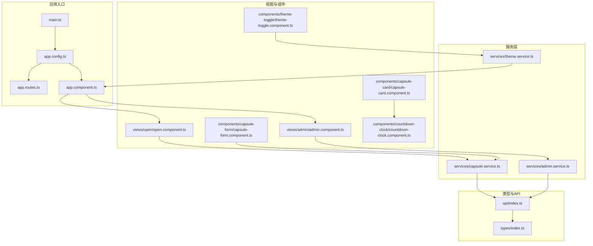
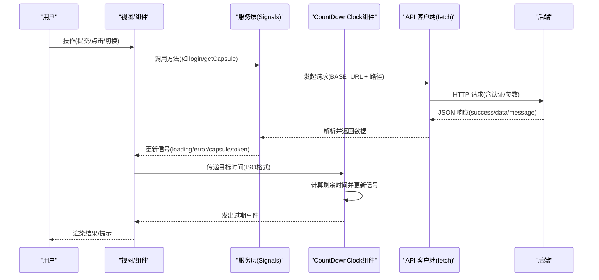
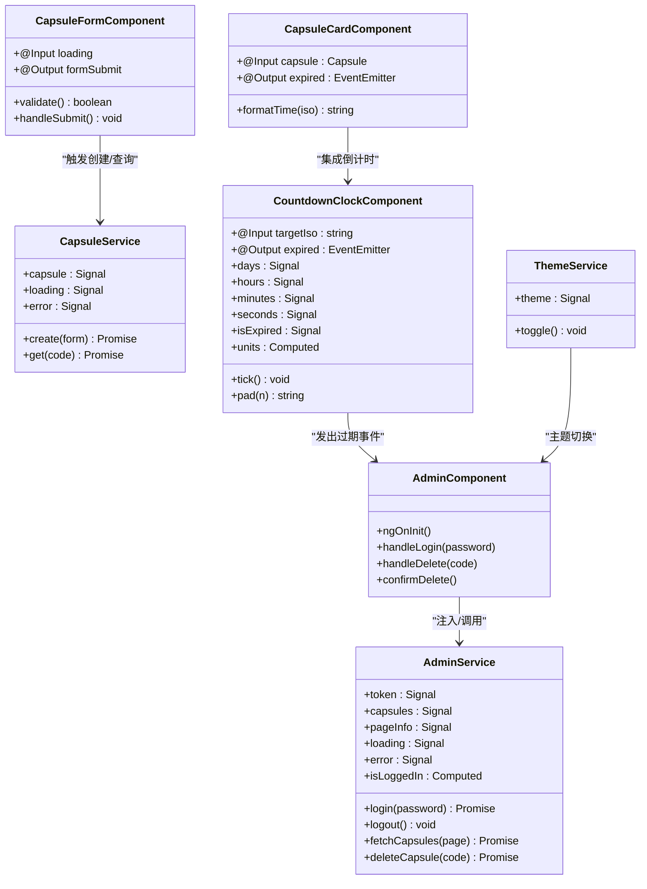
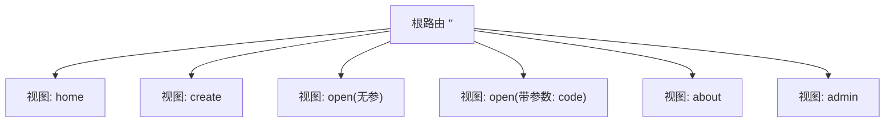
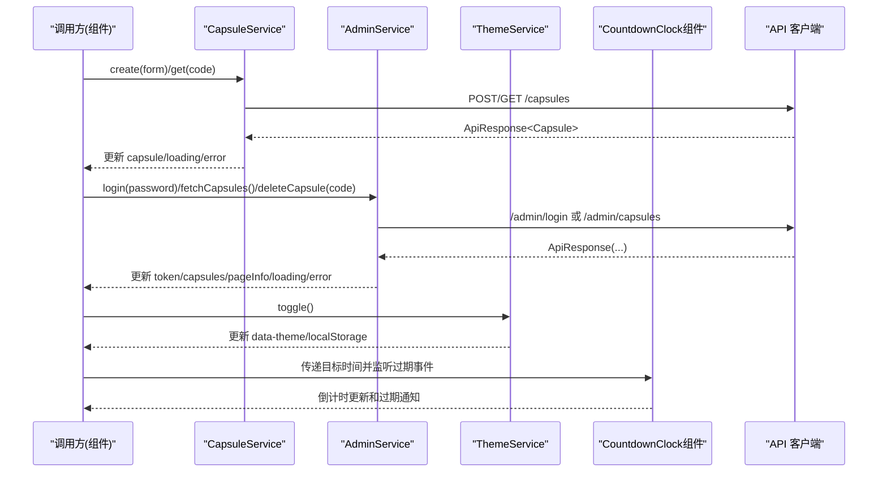
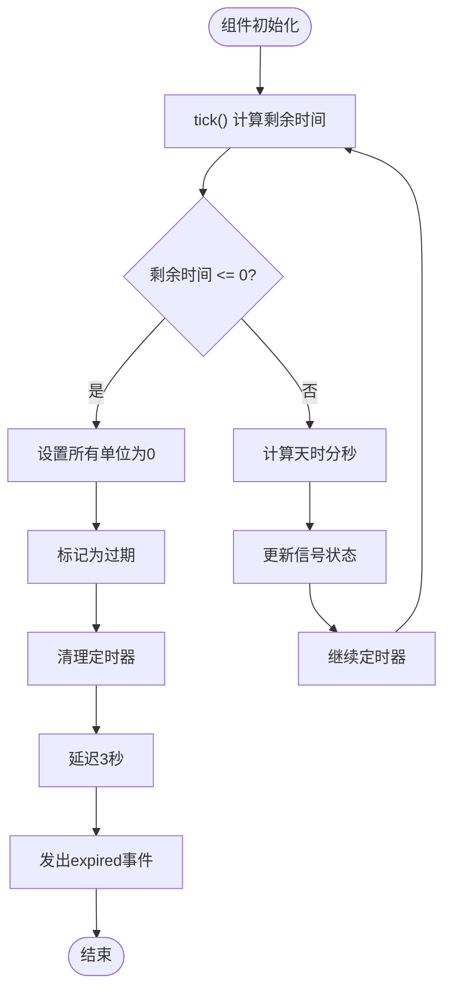
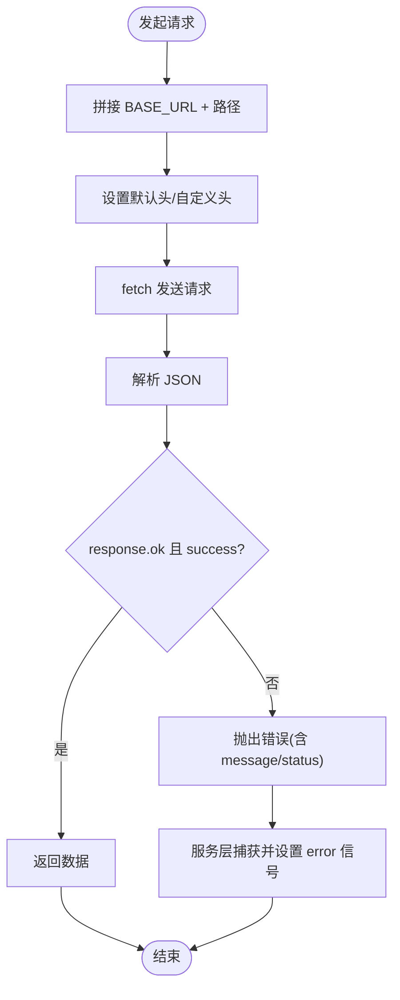
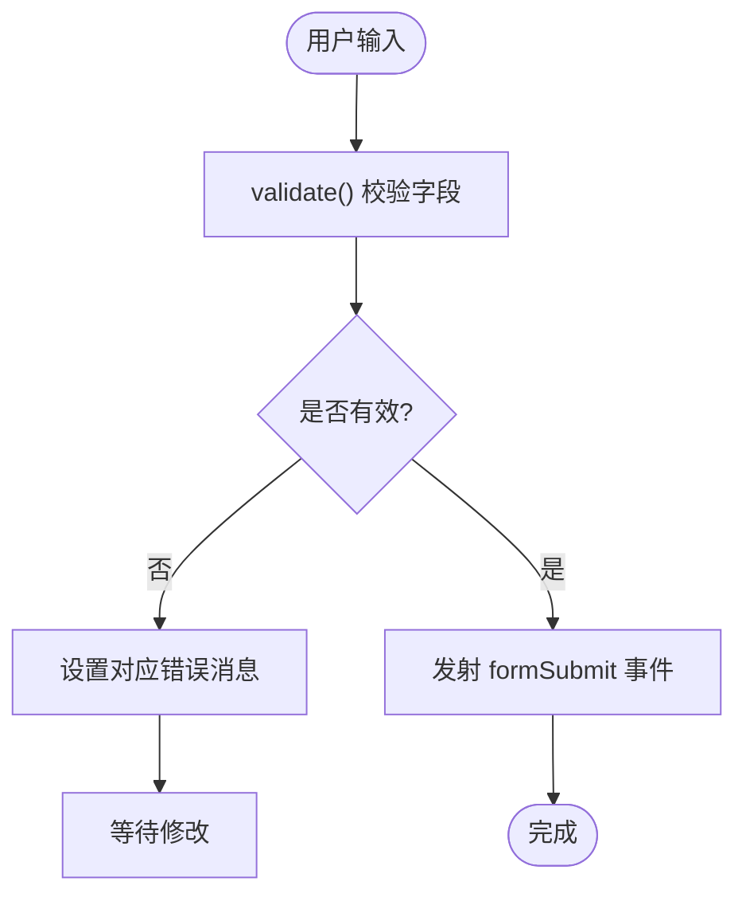
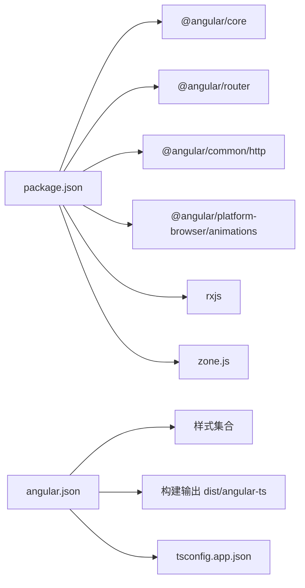

# Angular 实现

<cite>
**本文引用的文件**
- [main.ts](file://frontends/angular-ts/src/main.ts)
- [app.config.ts](file://frontends/angular-ts/src/app/app.config.ts)
- [app.routes.ts](file://frontends/angular-ts/src/app/app.routes.ts)
- [app.component.ts](file://frontends/angular-ts/src/app/app.component.ts)
- [types/index.ts](file://frontends/angular-ts/src/app/types/index.ts)
- [api/index.ts](file://frontends/angular-ts/src/app/api/index.ts)
- [services/capsule.service.ts](file://frontends/angular-ts/src/app/services/capsule.service.ts)
- [services/admin.service.ts](file://frontends/angular-ts/src/app/services/admin.service.ts)
- [services/theme.service.ts](file://frontends/angular-ts/src/app/services/theme.service.ts)
- [components/capsule-form/capsule-form.component.ts](file://frontends/angular-ts/src/app/components/capsule-form/capsule-form.component.ts)
- [components/theme-toggle/theme-toggle.component.ts](file://frontends/angular-ts/src/app/components/theme-toggle/theme-toggle.component.ts)
- [components/countdown-clock/countdown-clock.component.ts](file://frontends/angular-ts/src/app/components/countdown-clock/countdown-clock.component.ts)
- [components/countdown-clock/countdown-clock.component.html](file://frontends/angular-ts/src/app/components/countdown-clock/countdown-clock.component.html)
- [components/countdown-clock/countdown-clock.component.css](file://frontends/angular-ts/src/app/components/countdown-clock/countdown-clock.component.css)
- [components/capsule-card/capsule-card.component.ts](file://frontends/angular-ts/src/app/components/capsule-card/capsule-card.component.ts)
- [components/capsule-card/capsule-card.component.html](file://frontends/angular-ts/src/app/components/capsule-card/capsule-card.component.html)
- [components/capsule-card/capsule-card.component.css](file://frontends/angular-ts/src/app/components/capsule-card/capsule-card.component.css)
- [views/admin/admin.component.ts](file://frontends/angular-ts/src/app/views/admin/admin.component.ts)
- [views/open/open.component.ts](file://frontends/angular-ts/src/app/views/open/open.component.ts)
- [package.json](file://frontends/angular-ts/package.json)
- [angular.json](file://frontends/angular-ts/angular.json)
</cite>

## 目录
1. [简介](#简介)
2. [项目结构](#项目结构)
3. [核心组件](#核心组件)
4. [架构总览](#架构总览)
5. [详细组件分析](#详细组件分析)
6. [依赖关系分析](#依赖关系分析)
7. [性能考虑](#性能考虑)
8. [故障排查指南](#故障排查指南)
9. [结论](#结论)
10. [附录](#附录)

## 简介
本文件面向 Angular 18 + TypeScript + Angular CLI 的前端实现，系统性梳理项目架构、组件系统、服务层设计、路由与状态管理、API 客户端封装与错误处理、依赖注入模式、管道与表单处理，以及 Angular Signals 在状态管理中的应用。文档以"可读性优先"的原则，结合可视化图示帮助读者快速理解并高效开发。

**更新** 新增 CountDownClock 组件和相关服务，增强 CapsuleCard 组件的倒计时功能集成。

## 项目结构
前端采用 Angular CLI 默认目录组织，核心入口为 main.ts，应用配置在 app.config.ts 中，路由定义于 app.routes.ts，根组件 app.component.ts 组合头部、路由出口与底部组件。类型定义集中在 types/index.ts，API 客户端封装在 api/index.ts，服务层位于 services/，视图组件位于 views/，通用 UI 组件位于 components/。

**图表来源**
- [main.ts:1-7](file://frontends/angular-ts/src/main.ts#L1-L7)
- [app.config.ts:1-14](file://frontends/angular-ts/src/app/app.config.ts#L1-L14)
- [app.routes.ts:1-35](file://frontends/angular-ts/src/app/app.routes.ts#L1-L35)
- [app.component.ts:1-14](file://frontends/angular-ts/src/app/app.component.ts#L1-L14)
- [types/index.ts:1-53](file://frontends/angular-ts/src/app/types/index.ts#L1-L53)
- [api/index.ts:1-71](file://frontends/angular-ts/src/app/api/index.ts#L1-L71)
- [services/capsule.service.ts:1-41](file://frontends/angular-ts/src/app/services/capsule.service.ts#L1-L41)
- [services/admin.service.ts:1-84](file://frontends/angular-ts/src/app/services/admin.service.ts#L1-L84)
- [services/theme.service.ts:1-28](file://frontends/angular-ts/src/app/services/theme.service.ts#L1-L28)
- [views/admin/admin.component.ts:1-45](file://frontends/angular-ts/src/app/views/admin/admin.component.ts#L1-L45)
- [views/open/open.component.ts:1-41](file://frontends/angular-ts/src/app/views/open/open.component.ts#L1-L41)
- [components/capsule-form/capsule-form.component.ts:1-68](file://frontends/angular-ts/src/app/components/capsule-form/capsule-form.component.ts#L1-L68)
- [components/theme-toggle/theme-toggle.component.ts:1-14](file://frontends/angular-ts/src/app/components/theme-toggle/theme-toggle.component.ts#L1-L14)
- [components/countdown-clock/countdown-clock.component.ts:1-67](file://frontends/angular-ts/src/app/components/countdown-clock/countdown-clock.component.ts#L1-L67)
- [components/capsule-card/capsule-card.component.ts:1-27](file://frontends/angular-ts/src/app/components/capsule-card/capsule-card.component.ts#L1-L27)

**章节来源**
- [main.ts:1-7](file://frontends/angular-ts/src/main.ts#L1-L7)
- [app.config.ts:1-14](file://frontends/angular-ts/src/app/app.config.ts#L1-L14)
- [app.routes.ts:1-35](file://frontends/angular-ts/src/app/app.routes.ts#L1-L35)
- [angular.json:1-108](file://frontends/angular-ts/angular.json#L1-L108)
- [package.json:1-38](file://frontends/angular-ts/package.json#L1-L38)

## 核心组件
- 应用引导与配置：main.ts 引导应用；app.config.ts 提供路由、HTTP 客户端与动画提供商。
- 路由系统：app.routes.ts 定义懒加载路由，支持首页、创建、打开、关于、管理后台等视图。
- 类型系统：types/index.ts 定义 Capsule、CreateCapsuleForm、ApiResponse、PageData、AdminToken、HealthInfo 等核心类型。
- API 客户端：api/index.ts 封装基础请求、统一错误处理与后端接口映射。
- 服务层：CapsuleService（胶囊业务）、AdminService（管理员认证与分页列表）、ThemeService（主题切换）。
- 视图与组件：views/admin/admin.component.ts 驱动管理后台；views/open/open.component.ts 处理胶囊查询；components/capsule-form/capsule-form.component.ts 提供模板驱动表单校验；components/theme-toggle/theme-toggle.component.ts 切换主题；**新增** components/countdown-clock/countdown-clock.component.ts 提供倒计时显示功能；components/capsule-card/capsule-card.component.ts 集成倒计时组件。
- **新增** CountDownClock 组件：提供精确到秒的时间倒计时显示，支持天、时、分、秒单位，自动检测过期状态并通过事件通知父组件。

**章节来源**
- [app.component.ts:1-14](file://frontends/angular-ts/src/app/app.component.ts#L1-L14)
- [types/index.ts:1-53](file://frontends/angular-ts/src/app/types/index.ts#L1-L53)
- [api/index.ts:1-71](file://frontends/angular-ts/src/app/api/index.ts#L1-L71)
- [services/capsule.service.ts:1-41](file://frontends/angular-ts/src/app/services/capsule.service.ts#L1-L41)
- [services/admin.service.ts:1-84](file://frontends/angular-ts/src/app/services/admin.service.ts#L1-L84)
- [services/theme.service.ts:1-28](file://frontends/angular-ts/src/app/services/theme.service.ts#L1-L28)
- [views/admin/admin.component.ts:1-45](file://frontends/angular-ts/src/app/views/admin/admin.component.ts#L1-L45)
- [views/open/open.component.ts:1-41](file://frontends/angular-ts/src/app/views/open/open.component.ts#L1-L41)
- [components/capsule-form/capsule-form.component.ts:1-68](file://frontends/angular-ts/src/app/components/capsule-form/capsule-form.component.ts#L1-L68)
- [components/theme-toggle/theme-toggle.component.ts:1-14](file://frontends/angular-ts/src/app/components/theme-toggle/theme-toggle.component.ts#L1-L14)
- [components/countdown-clock/countdown-clock.component.ts:1-67](file://frontends/angular-ts/src/app/components/countdown-clock/countdown-clock.component.ts#L1-L67)
- [components/capsule-card/capsule-card.component.ts:1-27](file://frontends/angular-ts/src/app/components/capsule-card/capsule-card.component.ts#L1-L27)

## 架构总览
下图展示从用户交互到服务层再到 API 的调用链路，体现依赖注入、信号状态与懒加载路由的协同工作方式。**更新** 新增 CountDownClock 组件的倒计时功能集成。

**图表来源**
- [views/admin/admin.component.ts:26-43](file://frontends/angular-ts/src/app/views/admin/admin.component.ts#L26-L43)
- [views/open/open.component.ts:36-39](file://frontends/angular-ts/src/app/views/open/open.component.ts#L36-L39)
- [services/admin.service.ts:27-40](file://frontends/angular-ts/src/app/services/admin.service.ts#L27-L40)
- [services/capsule.service.ts:11-24](file://frontends/angular-ts/src/app/services/capsule.service.ts#L11-L24)
- [components/countdown-clock/countdown-clock.component.ts:34-61](file://frontends/angular-ts/src/app/components/countdown-clock/countdown-clock.component.ts#L34-L61)
- [api/index.ts:10-27](file://frontends/angular-ts/src/app/api/index.ts#L10-L27)

## 详细组件分析

### 依赖注入与组件系统
- 依赖注入：服务均以根级提供（providedIn: 'root'），通过构造函数或 inject() 注入，避免重复实例化。
- 组件架构：采用独立组件（standalone: true），按需导入 RouterOutlet、RouterLink、FormsModule 等。
- 生命周期：组件通过 ngOnInit 执行初始化逻辑（如管理后台拉取列表）。
- 输入输出：组件通过 @Input/@Output 与父组件通信（如 CapsuleForm 的表单数据与事件，CountDownClock 的目标时间和过期事件）。
- 依赖注入模式：在组件中直接 inject(服务)，或在构造函数注入；服务内部也通过 inject 访问 DOM 等平台服务。

**图表来源**
- [services/capsule.service.ts:1-41](file://frontends/angular-ts/src/app/services/capsule.service.ts#L1-L41)
- [services/admin.service.ts:1-84](file://frontends/angular-ts/src/app/services/admin.service.ts#L1-L84)
- [services/theme.service.ts:1-28](file://frontends/angular-ts/src/app/services/theme.service.ts#L1-L28)
- [components/countdown-clock/countdown-clock.component.ts:14-66](file://frontends/angular-ts/src/app/components/countdown-clock/countdown-clock.component.ts#L14-L66)
- [components/capsule-card/capsule-card.component.ts:12-26](file://frontends/angular-ts/src/app/components/capsule-card/capsule-card.component.ts#L12-L26)
- [views/admin/admin.component.ts:14-44](file://frontends/angular-ts/src/app/views/admin/admin.component.ts#L14-L44)
- [components/capsule-form/capsule-form.component.ts:1-68](file://frontends/angular-ts/src/app/components/capsule-form/capsule-form.component.ts#L1-L68)

**章节来源**
- [views/admin/admin.component.ts:14-44](file://frontends/angular-ts/src/app/views/admin/admin.component.ts#L14-L44)
- [components/capsule-form/capsule-form.component.ts:12-67](file://frontends/angular-ts/src/app/components/capsule-form/capsule-form.component.ts#L12-L67)
- [components/countdown-clock/countdown-clock.component.ts:14-66](file://frontends/angular-ts/src/app/components/countdown-clock/countdown-clock.component.ts#L14-L66)
- [components/capsule-card/capsule-card.component.ts:12-26](file://frontends/angular-ts/src/app/components/capsule-card/capsule-card.component.ts#L12-L26)

### 路由系统与页面导航
- 路由定义：app.routes.ts 使用 loadChildren 形式的懒加载组件，路径覆盖首页、创建、打开（带参数）、关于、管理后台。
- 导航方式：视图中使用 RouterLink 进行声明式导航；管理后台通过服务层触发业务逻辑。
- 参数绑定：withComponentInputBinding 已在 app.config.ts 提供，便于在懒加载组件中接收输入参数。

**图表来源**
- [app.routes.ts:3-34](file://frontends/angular-ts/src/app/app.routes.ts#L3-L34)
- [app.config.ts:8-12](file://frontends/angular-ts/src/app/app.config.ts#L8-L12)

**章节来源**
- [app.routes.ts:1-35](file://frontends/angular-ts/src/app/app.routes.ts#L1-L35)
- [app.config.ts:1-14](file://frontends/angular-ts/src/app/app.config.ts#L1-L14)

### 服务层设计：CapsuleService、AdminService、ThemeService
- CapsuleService
  - 状态：使用 signal 管理当前胶囊、加载态与错误信息。
  - 行为：异步创建与查询，统一设置 loading/error，成功时更新 capsule。
- AdminService
  - 状态：token、分页信息、列表、加载态与错误信息；computed 判断登录态。
  - 行为：登录写入 sessionStorage，登出清理；分页拉取列表；删除后刷新当前页。
- ThemeService
  - 状态：signal 主题，effect 同步到 documentElement 属性与本地存储。
  - 行为：toggle 切换 light/dark。

**图表来源**
- [services/capsule.service.ts:11-39](file://frontends/angular-ts/src/app/services/capsule.service.ts#L11-L39)
- [services/admin.service.ts:27-82](file://frontends/angular-ts/src/app/services/admin.service.ts#L27-L82)
- [services/theme.service.ts:16-26](file://frontends/angular-ts/src/app/services/theme.service.ts#L16-L26)
- [components/countdown-clock/countdown-clock.component.ts:34-61](file://frontends/angular-ts/src/app/components/countdown-clock/countdown-clock.component.ts#L34-L61)
- [api/index.ts:29-67](file://frontends/angular-ts/src/app/api/index.ts#L29-L67)

**章节来源**
- [services/capsule.service.ts:1-41](file://frontends/angular-ts/src/app/services/capsule.service.ts#L1-L41)
- [services/admin.service.ts:1-84](file://frontends/angular-ts/src/app/services/admin.service.ts#L1-L84)
- [services/theme.service.ts:1-28](file://frontends/angular-ts/src/app/services/theme.service.ts#L1-L28)

### CountDownClock 组件详解
**新增** CountDownClock 组件是一个独立的倒计时显示组件，提供精确到秒的时间倒计时功能。

- 组件特性
  - 输入：targetIso（必需）- 目标时间的 ISO 字符串格式
  - 输出：expired（事件）- 倒计时结束后触发的事件
  - 状态：days、hours、minutes、seconds、isExpired（信号）
  - 计算：units（计算信号）- 返回包含数值和标签的对象数组
  - 方法：pad（格式化补零）、tick（计算剩余时间）

- 核心功能
  - 实时倒计时：每秒更新一次剩余时间
  - 自动过期检测：当剩余时间为负数时标记为过期
  - 过期延迟：过期后延迟3秒再发出事件，避免界面闪烁
  - 响应式显示：使用 Angular Signals 实时更新 UI
  - 内存管理：组件销毁时清理定时器，防止内存泄漏

- 模板结构
  - 过期状态：显示庆祝表情和提示信息
  - 正常状态：显示天、时、分、秒四个单位的数字卡片
  - 响应式设计：支持小屏幕设备的适配

**图表来源**
- [components/countdown-clock/countdown-clock.component.ts:34-61](file://frontends/angular-ts/src/app/components/countdown-clock/countdown-clock.component.ts#L34-L61)

**章节来源**
- [components/countdown-clock/countdown-clock.component.ts:1-67](file://frontends/angular-ts/src/app/components/countdown-clock/countdown-clock.component.ts#L1-L67)
- [components/countdown-clock/countdown-clock.component.html:1-24](file://frontends/angular-ts/src/app/components/countdown-clock/countdown-clock.component.html#L1-L24)
- [components/countdown-clock/countdown-clock.component.css:1-111](file://frontends/angular-ts/src/app/components/countdown-clock/countdown-clock.component.css#L1-L111)

### CapsuleCard 组件与倒计时集成
**更新** CapsuleCard 组件集成了 CountDownClock 组件，为未开启的胶囊提供倒计时显示功能。

- 集成方式
  - 条件渲染：仅在胶囊未开启时显示倒计时组件
  - 数据传递：将 capsule.openAt 作为 targetIso 输入传递给倒计时组件
  - 事件处理：监听倒计时组件的 expired 事件，调用父组件的处理逻辑

- 用户体验
  - 锁定状态：显示锁图标和"胶囊尚未到开启时间"提示
  - 倒计时显示：清晰展示剩余的天、时、分、秒
  - 过期处理：倒计时结束后自动刷新胶囊状态

- 样式设计
  - 锁定区域居中显示，提供视觉焦点
  - 倒计时卡片采用圆角设计，突出数字显示
  - 移动端适配：在小屏幕设备上缩小卡片尺寸

**章节来源**
- [components/capsule-card/capsule-card.component.ts:1-27](file://frontends/angular-ts/src/app/components/capsule-card/capsule-card.component.ts#L1-L27)
- [components/capsule-card/capsule-card.component.html:19-30](file://frontends/angular-ts/src/app/components/capsule-card/capsule-card.component.html#L19-L30)
- [components/capsule-card/capsule-card.component.css:55-76](file://frontends/angular-ts/src/app/components/capsule-card/capsule-card.component.css#L55-L76)

### API 客户端封装与错误处理
- 统一请求：request 函数负责拼接 BASE_URL、设置 Content-Type、解析 JSON、判定 success/response.ok 并抛错。
- 接口映射：createCapsule、getCapsule、adminLogin、getAdminCapsules、deleteAdminCapsule、getHealthInfo。
- 错误策略：非 ok 或 success=false 时抛出错误，由服务层捕获并设置 error 信号，组件据此渲染提示。

**图表来源**
- [api/index.ts:10-27](file://frontends/angular-ts/src/app/api/index.ts#L10-L27)

**章节来源**
- [api/index.ts:1-71](file://frontends/angular-ts/src/app/api/index.ts#L1-L71)

### 表单处理：模板驱动与响应式
- 模板驱动：CapsuleFormComponent 使用 FormsModule，内部维护表单对象与错误对象，提供 validate 与 handleSubmit，通过 @Output 发射表单数据。
- 响应式表单：未在本项目中使用，若扩展可引入 ReactiveFormsModule 与 FormBuilder。
- 校验规则：标题/内容/发布者必填，开启时间必须大于当前时间，最小时间戳限制在本地时区修正后的值。

**图表来源**
- [components/capsule-form/capsule-form.component.ts:36-66](file://frontends/angular-ts/src/app/components/capsule-form/capsule-form.component.ts#L36-L66)

**章节来源**
- [components/capsule-form/capsule-form.component.ts:1-68](file://frontends/angular-ts/src/app/components/capsule-form/capsule-form.component.ts#L1-L68)

### 管道（Pipes）应用
- 当前项目未使用自定义管道。若需要，可在组件中通过 pipes 数组注册，或在 standalone 组件中按需导入。
- 建议场景：日期格式化、货币、截断文本、大小写转换等。

### Angular Signals 在状态管理中的应用
- 信号作为响应式数据源：loading、error、capsule、token、theme、**新增** days/hours/minutes/seconds/isExpired 等均以 signal 管理。
- 计算信号：isLoggedIn 基于 token 计算得出，**新增** units 基于倒计时信号计算得出，自动订阅变化。
- 效应：ThemeService 使用 effect 同步主题到 DOM 属性与本地存储，确保状态持久化与 UI 即时更新。
- 最佳实践：将副作用收敛在服务内，组件仅消费信号，避免直接操作 DOM；在服务中集中处理错误与加载态，提升可测试性与可维护性。

**章节来源**
- [services/capsule.service.ts:7-9](file://frontends/angular-ts/src/app/services/capsule.service.ts#L7-L9)
- [services/admin.service.ts:9-25](file://frontends/angular-ts/src/app/services/admin.service.ts#L9-L25)
- [services/theme.service.ts:10-22](file://frontends/angular-ts/src/app/services/theme.service.ts#L10-L22)
- [components/countdown-clock/countdown-clock.component.ts:18-32](file://frontends/angular-ts/src/app/components/countdown-clock/countdown-clock.component.ts#L18-L32)

## 依赖关系分析
- 构建与运行：Angular CLI 18、RxJS、Zone.js、TypeScript；开发脚本包含 dev、build、test。
- 样式与资源：通过 angular.json 配置样式文件与资产，构建目标 dist 输出。
- 运行时依赖：@angular/core、router、common/http、platform-browser/animations 等。

**图表来源**
- [package.json:11-22](file://frontends/angular-ts/package.json#L11-L22)
- [angular.json:24-66](file://frontends/angular-ts/angular.json#L24-L66)

**章节来源**
- [package.json:1-38](file://frontends/angular-ts/package.json#L1-L38)
- [angular.json:1-108](file://frontends/angular-ts/angular.json#L1-L108)

## 性能考虑
- 懒加载路由：app.routes.ts 使用动态导入，减少首屏体积与初次渲染时间。
- 信号替代 NgRx：使用 signal/computed 减少样板代码与复杂度，适合中小型应用的状态管理。
- 样式与资源：通过 angular.json 合理组织样式与资产，生产环境启用输出哈希与预算告警。
- 表单优化：模板驱动表单简单直观，避免过度复杂校验；必要时可引入响应式表单与异步校验。
- **新增** 倒计时优化：CountDownClock 组件使用高效的定时器管理和内存清理，避免不必要的重渲染。

## 故障排查指南
- 请求失败：检查 api/index.ts 的 request 函数是否正确处理 response.ok 与 success 字段；服务层是否捕获异常并设置 error 信号。
- 登录失效：AdminService 依赖 sessionStorage 中的 token；确认登录流程已写入 token，且后续请求携带 Authorization 头。
- 主题不同步：ThemeService 依赖 DOCUMENT 注入与 effect 同步；确认 data-theme 属性与本地存储键名一致。
- 路由不生效：确认 app.routes.ts 的路径与懒加载导入路径一致，且 app.config.ts 提供了 withComponentInputBinding。
- **新增** 倒计时异常：检查 CountDownClock 组件的 targetIso 输入格式是否为有效的 ISO 字符串；确认组件销毁时定时器被正确清理；验证 expired 事件的父组件处理逻辑。

**章节来源**
- [api/index.ts:22-24](file://frontends/angular-ts/src/app/api/index.ts#L22-L24)
- [services/admin.service.ts:32-33](file://frontends/angular-ts/src/app/services/admin.service.ts#L32-L33)
- [services/theme.service.ts:17-21](file://frontends/angular-ts/src/app/services/theme.service.ts#L17-L21)
- [app.routes.ts:6-7](file://frontends/angular-ts/src/app/app.routes.ts#L6-L7)
- [components/countdown-clock/countdown-clock.component.ts:39-42](file://frontends/angular-ts/src/app/components/countdown-clock/countdown-clock.component.ts#L39-L42)

## 结论
本项目以 Angular 18 为核心，采用独立组件、依赖注入与 Angular Signals 构建清晰的服务层与视图层。通过统一的 API 客户端与错误处理机制，实现了稳定的前后端交互；路由懒加载与主题服务提升了用户体验与可维护性。

**更新** 新增的 CountDownClock 组件为应用提供了精确的倒计时功能，增强了用户对胶囊开启时间的预期管理。该组件采用响应式编程模式，使用 Angular Signals 实现实时更新，并通过事件机制与父组件进行通信。CapsuleCard 组件的倒计时集成进一步完善了用户体验，使用户能够直观地看到剩余等待时间。

建议在后续迭代中引入响应式表单、自定义管道与更完善的测试覆盖，持续优化性能与可测试性。同时可以考虑扩展 CountDownClock 组件的功能，如支持自定义格式化、暂停/恢复倒计时等高级特性。

## 附录
- 入口与配置：main.ts 引导应用；app.config.ts 提供路由、HTTP 与动画；app.routes.ts 定义路由。
- 类型与接口：types/index.ts 定义核心数据模型；api/index.ts 映射后端接口。
- 服务与组件：services/* 提供业务能力；components/* 与 views/* 组合 UI 与交互。
- **新增** 倒计时组件：countdown-clock 提供精确到秒的倒计时显示功能；capsule-card 集成倒计时组件，增强用户体验。

**章节来源**
- [main.ts:1-7](file://frontends/angular-ts/src/main.ts#L1-L7)
- [app.config.ts:1-14](file://frontends/angular-ts/src/app/app.config.ts#L1-L14)
- [app.routes.ts:1-35](file://frontends/angular-ts/src/app/app.routes.ts#L1-L35)
- [types/index.ts:1-53](file://frontends/angular-ts/src/app/types/index.ts#L1-L53)
- [api/index.ts:1-71](file://frontends/angular-ts/src/app/api/index.ts#L1-L71)
- [components/countdown-clock/countdown-clock.component.ts:1-67](file://frontends/angular-ts/src/app/components/countdown-clock/countdown-clock.component.ts#L1-L67)
- [components/capsule-card/capsule-card.component.ts:1-27](file://frontends/angular-ts/src/app/components/capsule-card/capsule-card.component.ts#L1-L27)