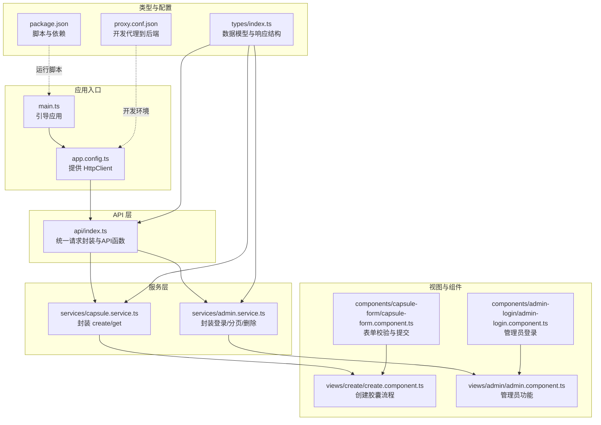
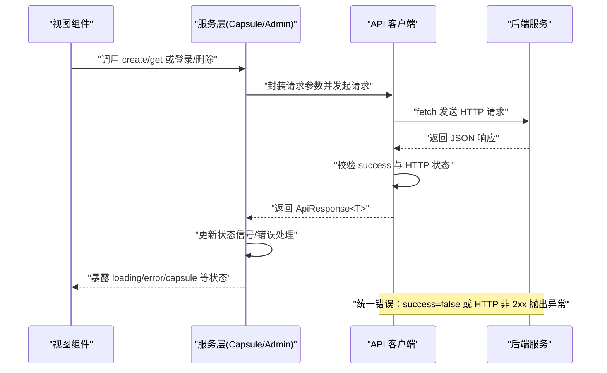
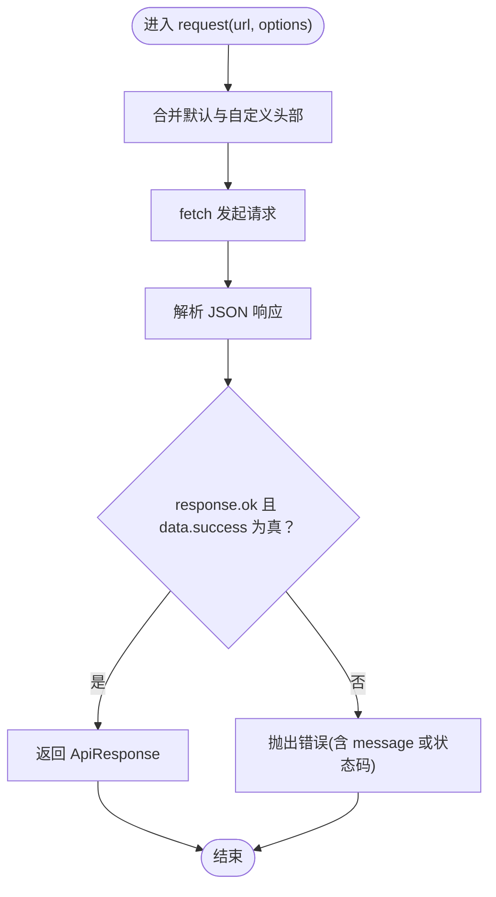
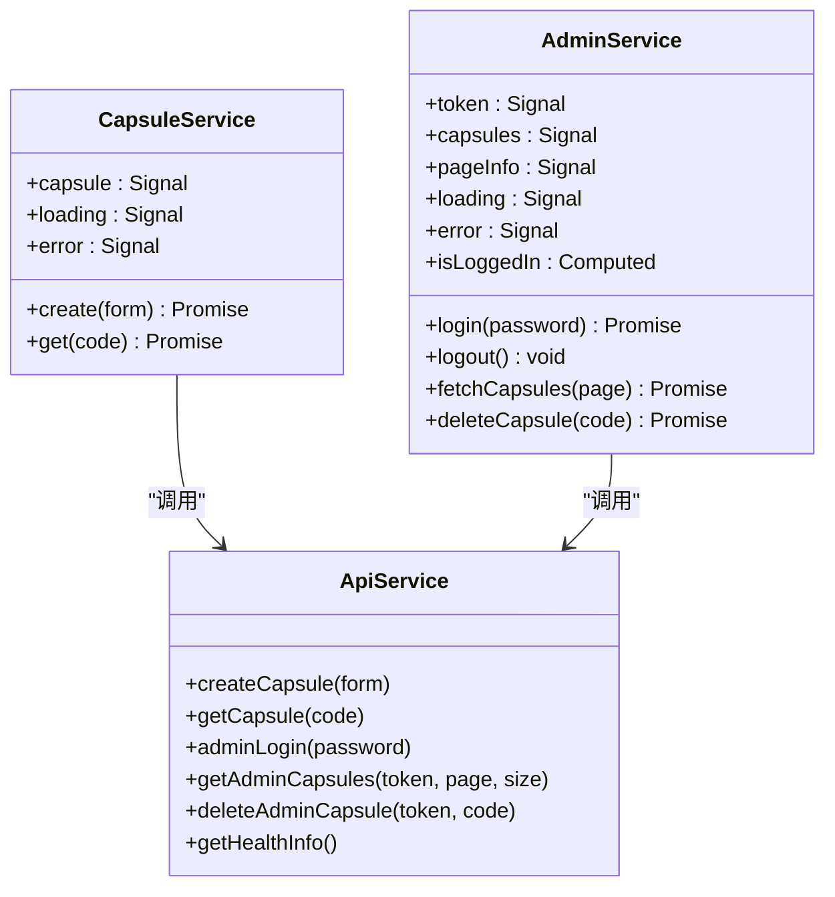
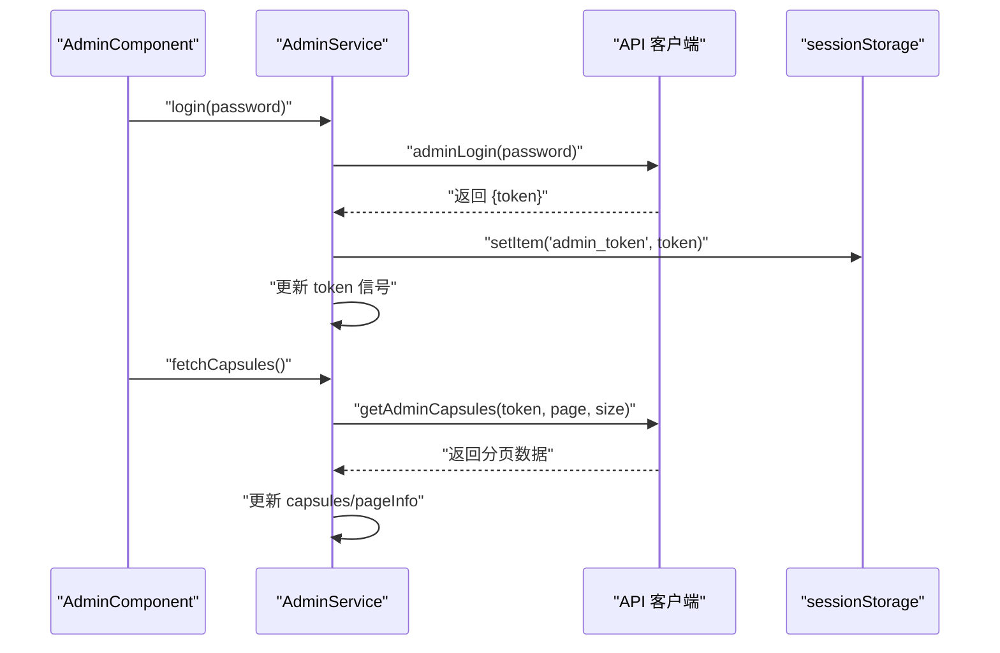
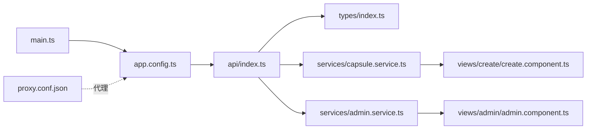

# API客户端集成

<cite>
**本文档引用的文件**
- [frontends/angular-ts/src/app/api/index.ts](file://frontends/angular-ts/src/app/api/index.ts)
- [frontends/angular-ts/src/app/services/capsule.service.ts](file://frontends/angular-ts/src/app/services/capsule.service.ts)
- [frontends/angular-ts/src/app/services/admin.service.ts](file://frontends/angular-ts/src/app/services/admin.service.ts)
- [frontends/angular-ts/src/app/types/index.ts](file://frontends/angular-ts/src/app/types/index.ts)
- [frontends/angular-ts/src/app/app.config.ts](file://frontends/angular-ts/src/app/app.config.ts)
- [frontends/angular-ts/src/app/views/create/create.component.ts](file://frontends/angular-ts/src/app/views/create/create.component.ts)
- [frontends/angular-ts/src/app/views/admin/admin.component.ts](file://frontends/angular-ts/src/app/views/admin/admin.component.ts)
- [frontends/angular-ts/src/app/components/capsule-form/capsule-form.component.ts](file://frontends/angular-ts/src/app/components/capsule-form/capsule-form.component.ts)
- [frontends/angular-ts/src/app/components/admin-login/admin-login.component.ts](file://frontends/angular-ts/src/app/components/admin-login/admin-login.component.ts)
- [frontends/angular-ts/src/__tests__/services/capsule.service.spec.ts](file://frontends/angular-ts/src/__tests__/services/capsule.service.spec.ts)
- [frontends/angular-ts/proxy.conf.json](file://frontends/angular-ts/proxy.conf.json)
- [frontends/angular-ts/package.json](file://frontends/angular-ts/package.json)
- [frontends/angular-ts/src/main.ts](file://frontends/angular-ts/src/main.ts)
</cite>

## 目录
1. [简介](#简介)
2. [项目结构](#项目结构)
3. [核心组件](#核心组件)
4. [架构总览](#架构总览)
5. [详细组件分析](#详细组件分析)
6. [依赖分析](#依赖分析)
7. [性能考虑](#性能考虑)
8. [故障排查指南](#故障排查指南)
9. [结论](#结论)
10. [附录](#附录)

## 简介
本文件系统性梳理 Angular 前端项目中的 API 客户端集成方案，重点覆盖以下方面：
- HTTP 客户端封装与统一请求函数设计
- API 函数的组织结构与使用方式（如 createCapsule、getCapsule 等）
- 统一错误处理机制（HTTP 错误码、网络错误、用户友好提示）
- API 客户端与服务层协作（数据转换、类型安全、响应格式标准化）
- 认证 token 的自动管理（Bearer Token 添加、过期处理、自动刷新策略）
- 测试策略（Mock 服务、单元测试最佳实践）
- 完整 API 调用示例与调试技巧

## 项目结构
前端采用 Angular 单页应用结构，API 客户端位于 app/api 模块，服务层位于 app/services，视图与组件位于 app/views 与 app/components，类型定义集中在 app/types。

图表来源
- [frontends/angular-ts/src/main.ts:1-7](file://frontends/angular-ts/src/main.ts#L1-L7)
- [frontends/angular-ts/src/app/app.config.ts:1-14](file://frontends/angular-ts/src/app/app.config.ts#L1-L14)
- [frontends/angular-ts/src/app/api/index.ts:1-71](file://frontends/angular-ts/src/app/api/index.ts#L1-L71)
- [frontends/angular-ts/src/app/services/capsule.service.ts:1-41](file://frontends/angular-ts/src/app/services/capsule.service.ts#L1-L41)
- [frontends/angular-ts/src/app/services/admin.service.ts:1-84](file://frontends/angular-ts/src/app/services/admin.service.ts#L1-L84)
- [frontends/angular-ts/src/app/views/create/create.component.ts:1-54](file://frontends/angular-ts/src/app/views/create/create.component.ts#L1-L54)
- [frontends/angular-ts/src/app/views/admin/admin.component.ts:1-45](file://frontends/angular-ts/src/app/views/admin/admin.component.ts#L1-L45)
- [frontends/angular-ts/src/app/components/capsule-form/capsule-form.component.ts:1-68](file://frontends/angular-ts/src/app/components/capsule-form/capsule-form.component.ts#L1-L68)
- [frontends/angular-ts/src/app/components/admin-login/admin-login.component.ts:1-24](file://frontends/angular-ts/src/app/components/admin-login/admin-login.component.ts#L1-L24)
- [frontends/angular-ts/src/app/types/index.ts:1-53](file://frontends/angular-ts/src/app/types/index.ts#L1-L53)
- [frontends/angular-ts/proxy.conf.json:1-8](file://frontends/angular-ts/proxy.conf.json#L1-L8)
- [frontends/angular-ts/package.json:1-38](file://frontends/angular-ts/package.json#L1-L38)

章节来源
- [frontends/angular-ts/src/app/api/index.ts:1-71](file://frontends/angular-ts/src/app/api/index.ts#L1-L71)
- [frontends/angular-ts/src/app/services/capsule.service.ts:1-41](file://frontends/angular-ts/src/app/services/capsule.service.ts#L1-L41)
- [frontends/angular-ts/src/app/services/admin.service.ts:1-84](file://frontends/angular-ts/src/app/services/admin.service.ts#L1-L84)
- [frontends/angular-ts/src/app/types/index.ts:1-53](file://frontends/angular-ts/src/app/types/index.ts#L1-L53)
- [frontends/angular-ts/src/app/app.config.ts:1-14](file://frontends/angular-ts/src/app/app.config.ts#L1-L14)
- [frontends/angular-ts/proxy.conf.json:1-8](file://frontends/angular-ts/proxy.conf.json#L1-L8)
- [frontends/angular-ts/package.json:1-38](file://frontends/angular-ts/package.json#L1-L38)
- [frontends/angular-ts/src/main.ts:1-7](file://frontends/angular-ts/src/main.ts#L1-L7)

## 核心组件
- API 客户端封装
  - 统一基础路径与请求函数，负责序列化请求体、解析响应、抛出业务错误。
  - 提供 createCapsule、getCapsule、adminLogin、getAdminCapsules、deleteAdminCapsule、getHealthInfo 等 API 方法。
- 服务层
  - CapsuleService：封装 create 与 get，维护 loading/error/capsule 状态信号，负责错误传播。
  - AdminService：封装登录、登出、分页查询、删除，维护 token、分页信息、loading/error 状态，并持久化 token 至 sessionStorage。
- 类型系统
  - ApiResponse<T>、PageData<T>、Capsule、CreateCapsuleForm、AdminToken、HealthInfo 等，确保前后端响应格式一致与类型安全。
- 视图与组件
  - CreateComponent 与 CapsuleFormComponent：表单校验、确认对话框、成功后的复制提示。
  - AdminComponent 与 AdminLoginComponent：登录触发、删除确认、列表展示。

章节来源
- [frontends/angular-ts/src/app/api/index.ts:10-71](file://frontends/angular-ts/src/app/api/index.ts#L10-L71)
- [frontends/angular-ts/src/app/services/capsule.service.ts:11-40](file://frontends/angular-ts/src/app/services/capsule.service.ts#L11-L40)
- [frontends/angular-ts/src/app/services/admin.service.ts:27-83](file://frontends/angular-ts/src/app/services/admin.service.ts#L27-L83)
- [frontends/angular-ts/src/app/types/index.ts:6-53](file://frontends/angular-ts/src/app/types/index.ts#L6-L53)
- [frontends/angular-ts/src/app/views/create/create.component.ts:16-53](file://frontends/angular-ts/src/app/views/create/create.component.ts#L16-L53)
- [frontends/angular-ts/src/app/views/admin/admin.component.ts:14-44](file://frontends/angular-ts/src/app/views/admin/admin.component.ts#L14-L44)
- [frontends/angular-ts/src/app/components/capsule-form/capsule-form.component.ts:12-67](file://frontends/angular-ts/src/app/components/capsule-form/capsule-form.component.ts#L12-L67)
- [frontends/angular-ts/src/app/components/admin-login/admin-login.component.ts:11-23](file://frontends/angular-ts/src/app/components/admin-login/admin-login.component.ts#L11-L23)

## 架构总览
下图展示了从视图到服务再到 API 客户端的整体调用链路，以及错误在各层的传播与处理。

图表来源
- [frontends/angular-ts/src/app/views/create/create.component.ts:32-42](file://frontends/angular-ts/src/app/views/create/create.component.ts#L32-L42)
- [frontends/angular-ts/src/app/views/admin/admin.component.ts:26-43](file://frontends/angular-ts/src/app/views/admin/admin.component.ts#L26-L43)
- [frontends/angular-ts/src/app/services/capsule.service.ts:11-24](file://frontends/angular-ts/src/app/services/capsule.service.ts#L11-L24)
- [frontends/angular-ts/src/app/services/admin.service.ts:27-83](file://frontends/angular-ts/src/app/services/admin.service.ts#L27-L83)
- [frontends/angular-ts/src/app/api/index.ts:10-27](file://frontends/angular-ts/src/app/api/index.ts#L10-L27)

## 详细组件分析

### API 客户端封装与统一错误处理
- 设计要点
  - 统一基础路径与 Content-Type 头部，支持自定义头部合并。
  - 解析响应为 JSON 并检查 success 字段与 HTTP 状态，不满足条件时抛出错误。
  - 所有 API 方法均返回 Promise<ApiResponse<T>>，保证调用方统一处理。
- 关键方法
  - createCapsule：POST /api/v1/capsules，openAt 自动转为 ISO 字符串。
  - getCapsule：GET /api/v1/capsules/{code}。
  - adminLogin：POST /api/v1/admin/login，返回 AdminToken。
  - getAdminCapsules：GET /api/v1/admin/capsules?page=&size=，携带 Bearer Token。
  - deleteAdminCapsule：DELETE /api/v1/admin/capsules/{code}，携带 Bearer Token。
  - getHealthInfo：GET /api/v1/health。
- 错误处理
  - 当 response.ok 为 false 或 data.success 为 false 时，抛出包含 message 或状态码的错误。
  - 服务层捕获错误并设置 error 信号，同时保持 loading 状态复位。

图表来源
- [frontends/angular-ts/src/app/api/index.ts:10-27](file://frontends/angular-ts/src/app/api/index.ts#L10-L27)

章节来源
- [frontends/angular-ts/src/app/api/index.ts:8-71](file://frontends/angular-ts/src/app/api/index.ts#L8-L71)

### 服务层协作模式：数据转换、类型安全与响应标准化
- CapsuleService
  - 在 create/get 中调用 API 方法，设置 loading/error/capsule 状态信号。
  - 对外暴露只读信号，便于视图层绑定。
- AdminService
  - 登录成功后将 token 写入 sessionStorage 并缓存至 signal。
  - 分页查询时提取 pageInfo 并更新内容数组；删除后重新拉取当前页。
  - 提供 isLoggedIn 计算信号，便于 UI 切换。
- 类型安全
  - 所有 API 返回值通过 ApiResponse<T> 标准化，T 与后端模型严格对应。
  - CreateCapsuleForm 与 Capsule 字段一一映射，避免运行时类型错误。

图表来源
- [frontends/angular-ts/src/app/services/capsule.service.ts:1-41](file://frontends/angular-ts/src/app/services/capsule.service.ts#L1-L41)
- [frontends/angular-ts/src/app/services/admin.service.ts:1-84](file://frontends/angular-ts/src/app/services/admin.service.ts#L1-L84)
- [frontends/angular-ts/src/app/api/index.ts:29-71](file://frontends/angular-ts/src/app/api/index.ts#L29-L71)

章节来源
- [frontends/angular-ts/src/app/services/capsule.service.ts:1-41](file://frontends/angular-ts/src/app/services/capsule.service.ts#L1-L41)
- [frontends/angular-ts/src/app/services/admin.service.ts:1-84](file://frontends/angular-ts/src/app/services/admin.service.ts#L1-L84)
- [frontends/angular-ts/src/app/types/index.ts:6-53](file://frontends/angular-ts/src/app/types/index.ts#L6-L53)

### 认证与 Token 管理
- Bearer Token 添加
  - getAdminCapsules 与 deleteAdminCapsule 在请求头中携带 Authorization: Bearer {token}。
- Token 存储与恢复
  - 登录成功后将 token 写入 sessionStorage，并同步到内存信号。
  - 应用启动时从 sessionStorage 恢复 token。
- 登出与清理
  - 清除 token、sessionStorage 与列表数据。
- 自动刷新策略
  - 当前实现未包含自动刷新逻辑；建议在拦截器或服务层增加刷新令牌的策略（例如基于过期时间的预刷新与并发去重）。

图表来源
- [frontends/angular-ts/src/app/views/admin/admin.component.ts:26-33](file://frontends/angular-ts/src/app/views/admin/admin.component.ts#L26-L33)
- [frontends/angular-ts/src/app/services/admin.service.ts:27-67](file://frontends/angular-ts/src/app/services/admin.service.ts#L27-L67)
- [frontends/angular-ts/src/app/api/index.ts:43-54](file://frontends/angular-ts/src/app/api/index.ts#L43-L54)

章节来源
- [frontends/angular-ts/src/app/services/admin.service.ts:9-46](file://frontends/angular-ts/src/app/services/admin.service.ts#L9-L46)
- [frontends/angular-ts/src/app/api/index.ts:43-67](file://frontends/angular-ts/src/app/api/index.ts#L43-L67)

### API 函数组织与使用示例
- 创建胶囊
  - 触发流程：CapsuleFormComponent 表单校验 -> CreateComponent 显示确认 -> CapsuleService.create -> API.createCapsule -> 更新状态。
- 查询胶囊
  - 触发流程：CapsuleService.get -> API.getCapsule -> 更新状态。
- 管理员操作
  - 登录：AdminLoginComponent -> AdminService.login -> 写入 token -> AdminService.fetchCapsules。
  - 删除：AdminComponent -> AdminService.deleteCapsule -> 重新拉取当前页。

章节来源
- [frontends/angular-ts/src/app/views/create/create.component.ts:27-42](file://frontends/angular-ts/src/app/views/create/create.component.ts#L27-L42)
- [frontends/angular-ts/src/app/components/capsule-form/capsule-form.component.ts:36-66](file://frontends/angular-ts/src/app/components/capsule-form/capsule-form.component.ts#L36-L66)
- [frontends/angular-ts/src/app/services/capsule.service.ts:11-39](file://frontends/angular-ts/src/app/services/capsule.service.ts#L11-L39)
- [frontends/angular-ts/src/app/views/admin/admin.component.ts:26-43](file://frontends/angular-ts/src/app/views/admin/admin.component.ts#L26-L43)
- [frontends/angular-ts/src/app/services/admin.service.ts:27-83](file://frontends/angular-ts/src/app/services/admin.service.ts#L27-L83)

### 测试策略与 Mock
- 单元测试
  - 使用 Jasmine + Karma 运行，测试用例覆盖成功与失败场景。
  - 通过 spyOn API 方法模拟返回值，断言服务层的状态信号与错误处理。
- 最佳实践
  - 为每个服务方法编写独立的测试用例，分别验证成功路径与异常路径。
  - 使用类型安全的 mock 数据，确保与 ApiResponse<T> 结构一致。
  - 在测试中验证 loading 信号在 finally 中正确复位。

章节来源
- [frontends/angular-ts/src/__tests__/services/capsule.service.spec.ts:1-79](file://frontends/angular-ts/src/__tests__/services/capsule.service.spec.ts#L1-L79)
- [frontends/angular-ts/package.json:8-9](file://frontends/angular-ts/package.json#L8-L9)

## 依赖分析
- 应用引导与 HTTP 提供
  - main.ts 引导应用，app.config.ts 提供路由、HttpClient、动画等。
  - HttpClient 已在应用配置中提供，API 客户端直接使用 fetch 实现，未使用 Angular 的 HttpClient 拦截器。
- 开发代理
  - proxy.conf.json 将 /api 前缀代理到本地后端服务，便于前后端联调。
- 依赖关系
  - 视图组件依赖服务层；服务层依赖 API 客户端；API 客户端依赖类型定义；类型定义独立于具体实现。

图表来源
- [frontends/angular-ts/src/main.ts:1-7](file://frontends/angular-ts/src/main.ts#L1-L7)
- [frontends/angular-ts/src/app/app.config.ts:1-14](file://frontends/angular-ts/src/app/app.config.ts#L1-L14)
- [frontends/angular-ts/src/app/api/index.ts:1-71](file://frontends/angular-ts/src/app/api/index.ts#L1-L71)
- [frontends/angular-ts/src/app/types/index.ts:1-53](file://frontends/angular-ts/src/app/types/index.ts#L1-L53)
- [frontends/angular-ts/src/app/services/capsule.service.ts:1-41](file://frontends/angular-ts/src/app/services/capsule.service.ts#L1-L41)
- [frontends/angular-ts/src/app/services/admin.service.ts:1-84](file://frontends/angular-ts/src/app/services/admin.service.ts#L1-L84)
- [frontends/angular-ts/src/app/views/create/create.component.ts:1-54](file://frontends/angular-ts/src/app/views/create/create.component.ts#L1-L54)
- [frontends/angular-ts/src/app/views/admin/admin.component.ts:1-45](file://frontends/angular-ts/src/app/views/admin/admin.component.ts#L1-L45)
- [frontends/angular-ts/proxy.conf.json:1-8](file://frontends/angular-ts/proxy.conf.json#L1-L8)

章节来源
- [frontends/angular-ts/src/app/app.config.ts:1-14](file://frontends/angular-ts/src/app/app.config.ts#L1-L14)
- [frontends/angular-ts/proxy.conf.json:1-8](file://frontends/angular-ts/proxy.conf.json#L1-L8)

## 性能考虑
- 请求幂等与缓存
  - GET 请求可结合浏览器缓存策略；对于分页列表，建议在服务层增加“请求去重”以避免重复请求。
- 错误快速失败
  - 在 API 层尽早校验响应结构，减少上层重复判断。
- 状态管理
  - 使用信号进行细粒度状态控制，避免不必要的组件重渲染。
- 网络优化
  - 合理设置超时与重试策略（可在 fetch 层扩展），并在 UI 上反馈加载状态。

## 故障排查指南
- 常见问题
  - 401 未授权：确认 token 是否存在、是否过期、是否正确附加到请求头。
  - 404 资源不存在：检查 code 参数或路由拼写。
  - 网络错误：检查代理配置与后端服务连通性。
- 调试技巧
  - 在 API 层打印请求 URL 与响应摘要，定位问题范围。
  - 使用浏览器开发者工具 Network 面板查看请求头与响应体。
  - 在服务层捕获错误并记录到 error 信号，便于 UI 展示。
- 开发代理
  - 确认 proxy.conf.json 的 target 地址与端口与后端一致，避免跨域与转发失败。

章节来源
- [frontends/angular-ts/proxy.conf.json:1-8](file://frontends/angular-ts/proxy.conf.json#L1-L8)
- [frontends/angular-ts/src/app/api/index.ts:10-27](file://frontends/angular-ts/src/app/api/index.ts#L10-L27)
- [frontends/angular-ts/src/app/services/admin.service.ts:27-83](file://frontends/angular-ts/src/app/services/admin.service.ts#L27-L83)

## 结论
该 API 客户端集成方案通过统一的请求封装与类型化响应，实现了清晰的职责分离与良好的可测试性。服务层承担了状态管理与错误处理，视图层专注于交互体验。认证与分页等功能已具备基础能力，后续可在拦截器或服务层引入自动刷新与请求去重等增强策略，进一步提升稳定性与用户体验。

## 附录
- API 方法一览
  - createCapsule(form)
  - getCapsule(code)
  - adminLogin(password)
  - getAdminCapsules(token, page, size)
  - deleteAdminCapsule(token, code)
  - getHealthInfo()
- 关键类型
  - ApiResponse<T>、PageData<T>、Capsule、CreateCapsuleForm、AdminToken、HealthInfo