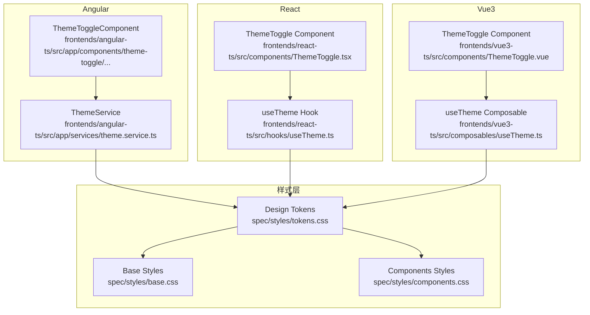
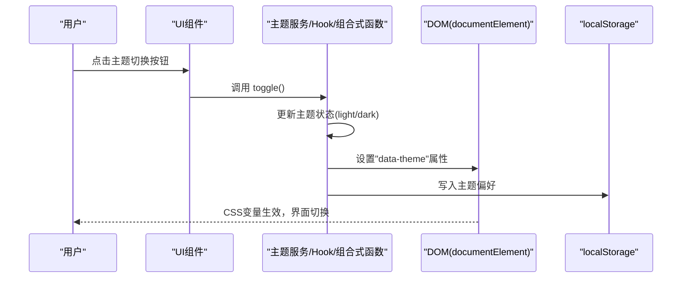
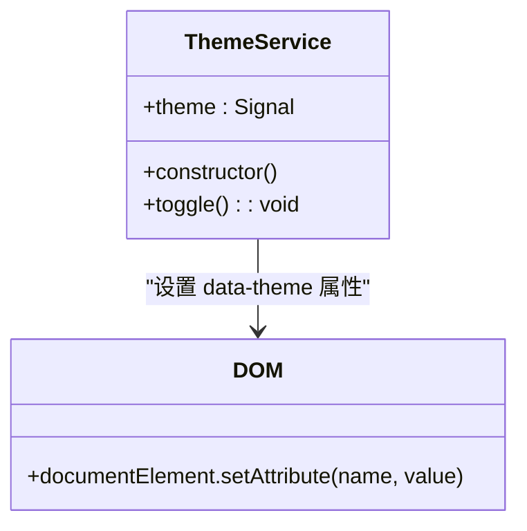
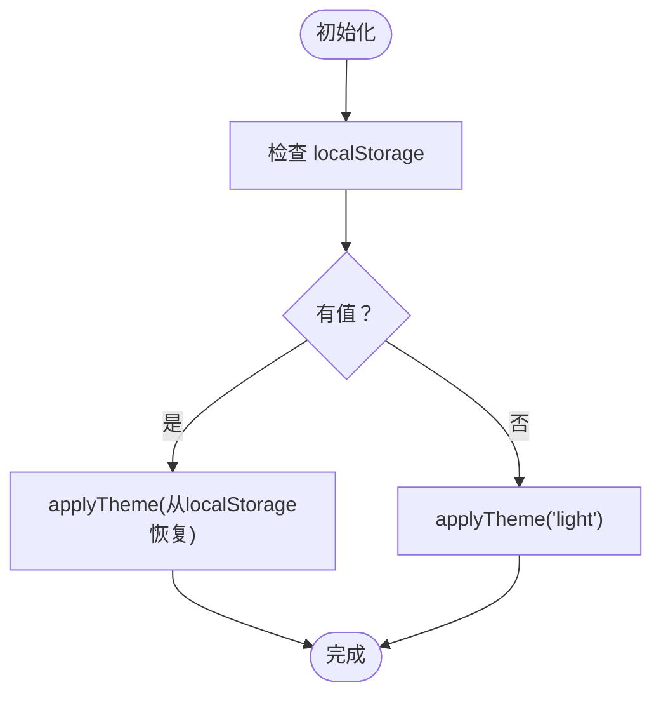
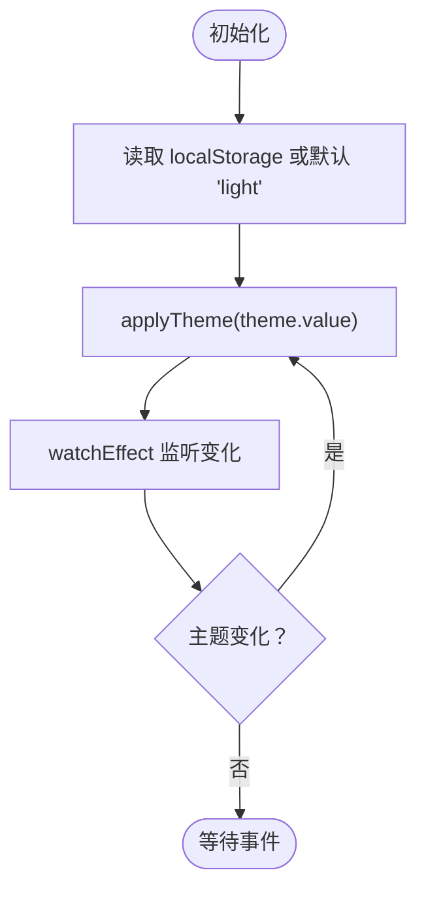
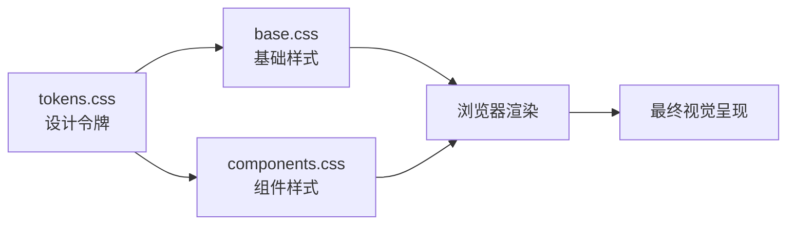
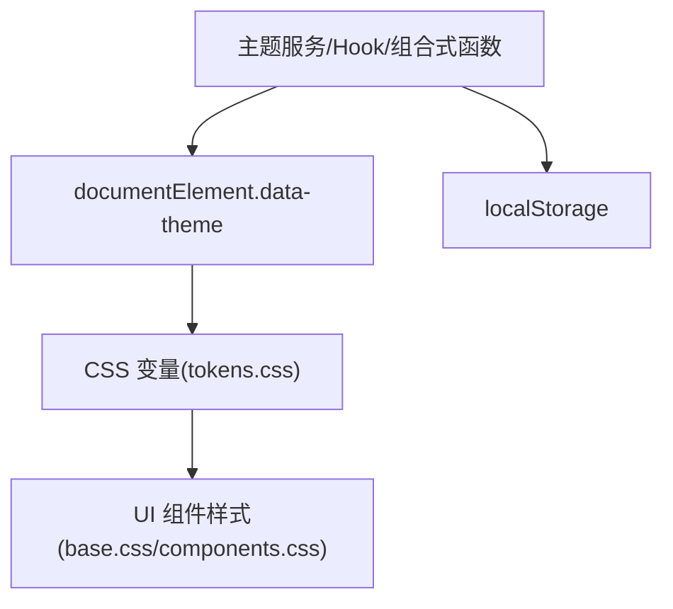

# 主题服务（ThemeService）

<cite>
**本文档引用的文件**
- [theme.service.ts](file://frontends/angular-ts/src/app/services/theme.service.ts)
- [useTheme.ts](file://frontends/react-ts/src/hooks/useTheme.ts)
- [useTheme.ts](file://frontends/vue3-ts/src/composables/useTheme.ts)
- [theme-toggle.component.ts](file://frontends/angular-ts/src/app/components/theme-toggle/theme-toggle.component.ts)
- [theme-toggle.component.html](file://frontends/angular-ts/src/app/components/theme-toggle/theme-toggle.component.html)
- [theme-toggle.component.css](file://frontends/angular-ts/src/app/components/theme-toggle/theme-toggle.component.css)
- [ThemeToggle.tsx](file://frontends/react-ts/src/components/ThemeToggle.tsx)
- [ThemeToggle.module.css](file://frontends/react-ts/src/components/ThemeToggle.module.css)
- [ThemeToggle.vue](file://frontends/vue3-ts/src/components/ThemeToggle.vue)
- [tokens.css](file://spec/styles/tokens.css)
- [base.css](file://spec/styles/base.css)
- [components.css](file://spec/styles/components.css)
- [app.component.ts](file://frontends/angular-ts/src/app/app.component.ts)
- [app.component.html](file://frontends/angular-ts/src/app/app.component.html)
- [app.component.css](file://frontends/angular-ts/src/app/app.component.css)
</cite>

## 目录
1. [简介](#简介)
2. [项目结构](#项目结构)
3. [核心组件](#核心组件)
4. [架构总览](#架构总览)
5. [详细组件分析](#详细组件分析)
6. [依赖关系分析](#依赖关系分析)
7. [性能考虑](#性能考虑)
8. [故障排查指南](#故障排查指南)
9. [结论](#结论)
10. [附录](#附录)

## 简介
本文件系统性地解析主题切换服务（ThemeService）的实现原理与最佳实践，涵盖以下关键点：
- 基于 CSS 变量的主题切换机制
- 用户偏好的持久化存储（localStorage）
- 主题状态管理（明/暗主题切换、初始化恢复）
- 与 UI 组件的协作方式（指令/Hook/组合式函数、样式类动态应用、过渡动画）
- 设计令牌系统与 CSS 变量的集成
- 自定义主题扩展与配置管理
- 完整主题切换示例与性能优化建议

## 项目结构
主题系统横跨前端三套框架（Angular、React、Vue3），并由统一的设计令牌体系驱动。Angular 采用服务+组件；React 采用自定义 Hook；Vue3 采用组合式函数；所有平台均通过在 <html> 根元素设置 data-theme 属性，联动 CSS 变量实现主题切换。

图表来源
- [theme.service.ts:1-28](file://frontends/angular-ts/src/app/services/theme.service.ts#L1-L28)
- [useTheme.ts:1-48](file://frontends/react-ts/src/hooks/useTheme.ts#L1-L48)
- [useTheme.ts:1-57](file://frontends/vue3-ts/src/composables/useTheme.ts#L1-L57)
- [theme-toggle.component.ts:1-14](file://frontends/angular-ts/src/app/components/theme-toggle/theme-toggle.component.ts#L1-L14)
- [ThemeToggle.tsx:1-17](file://frontends/react-ts/src/components/ThemeToggle.tsx#L1-L17)
- [ThemeToggle.vue:1-34](file://frontends/vue3-ts/src/components/ThemeToggle.vue#L1-L34)
- [tokens.css:1-104](file://spec/styles/tokens.css#L1-L104)
- [base.css:1-67](file://spec/styles/base.css#L1-L67)
- [components.css:1-207](file://spec/styles/components.css#L1-L207)

章节来源
- [theme.service.ts:1-28](file://frontends/angular-ts/src/app/services/theme.service.ts#L1-L28)
- [useTheme.ts:1-48](file://frontends/react-ts/src/hooks/useTheme.ts#L1-L48)
- [useTheme.ts:1-57](file://frontends/vue3-ts/src/composables/useTheme.ts#L1-L57)
- [theme-toggle.component.ts:1-14](file://frontends/angular-ts/src/app/components/theme-toggle/theme-toggle.component.ts#L1-L14)
- [ThemeToggle.tsx:1-17](file://frontends/react-ts/src/components/ThemeToggle.tsx#L1-L17)
- [ThemeToggle.vue:1-34](file://frontends/vue3-ts/src/components/ThemeToggle.vue#L1-L34)
- [tokens.css:1-104](file://spec/styles/tokens.css#L1-L104)
- [base.css:1-67](file://spec/styles/base.css#L1-L67)
- [components.css:1-207](file://spec/styles/components.css#L1-L207)

## 核心组件
- Angular：ThemeService 负责主题状态与 DOM 属性同步，并持久化到 localStorage。ThemeToggleComponent 作为 UI 触发器绑定服务。
- React：useTheme Hook 提供主题状态与切换方法，内部以模块级变量维护当前主题并在 DOM 上应用 data-theme。
- Vue3：useTheme 组合式函数提供响应式主题状态与切换方法，watchEffect 自动应用主题。
- 样式层：tokens.css 定义设计令牌与暗色模式覆盖；base.css 与 components.css 使用这些令牌实现一致的视觉语言。

章节来源
- [theme.service.ts:1-28](file://frontends/angular-ts/src/app/services/theme.service.ts#L1-L28)
- [useTheme.ts:1-48](file://frontends/react-ts/src/hooks/useTheme.ts#L1-L48)
- [useTheme.ts:1-57](file://frontends/vue3-ts/src/composables/useTheme.ts#L1-L57)
- [tokens.css:1-104](file://spec/styles/tokens.css#L1-L104)
- [base.css:1-67](file://spec/styles/base.css#L1-L67)
- [components.css:1-207](file://spec/styles/components.css#L1-L207)

## 架构总览
主题切换的核心流程是“状态变更 -> DOM 属性更新 -> CSS 变量生效 -> 视觉更新”。Angular 使用 signal/effect，React 使用 useSyncExternalStore，Vue3 使用 watchEffect，三者均在初始化时从 localStorage 恢复主题。

图表来源
- [theme.service.ts:16-26](file://frontends/angular-ts/src/app/services/theme.service.ts#L16-L26)
- [useTheme.ts:33-44](file://frontends/react-ts/src/hooks/useTheme.ts#L33-L44)
- [useTheme.ts:51-53](file://frontends/vue3-ts/src/composables/useTheme.ts#L51-L53)

## 详细组件分析

### Angular 主题服务（ThemeService）
- 状态模型：signal<Theme>，Theme 类型为 'light' | 'dark'。
- 初始化：优先从 localStorage 读取，否则默认 'light'。
- 效应：effect 监听主题变化，同步到 document.documentElement 的 data-theme 属性，并持久化到 localStorage。
- 切换：toggle() 将 light 与 dark 互换。

图表来源
- [theme.service.ts:1-28](file://frontends/angular-ts/src/app/services/theme.service.ts#L1-L28)

章节来源
- [theme.service.ts:1-28](file://frontends/angular-ts/src/app/services/theme.service.ts#L1-L28)
- [theme-toggle.component.ts:1-14](file://frontends/angular-ts/src/app/components/theme-toggle/theme-toggle.component.ts#L1-L14)
- [theme-toggle.component.html:1-13](file://frontends/angular-ts/src/app/components/theme-toggle/theme-toggle.component.html#L1-L13)
- [theme-toggle.component.css:1-16](file://frontends/angular-ts/src/app/components/theme-toggle/theme-toggle.component.css#L1-L16)

### React 主题 Hook（useTheme）
- 状态模型：模块级变量 theme，类型 'light' | 'dark'。
- 初始化：若存在 localStorage，则从其恢复；否则默认 'light'；随后立即应用到 DOM。
- 订阅：useSyncExternalStore 订阅主题变化，实现跨组件共享。
- 切换：setTheme 更新模块级状态并调用 applyTheme，后者设置 data-theme 并写入 localStorage。

图表来源
- [useTheme.ts:10-22](file://frontends/react-ts/src/hooks/useTheme.ts#L10-L22)

章节来源
- [useTheme.ts:1-48](file://frontends/react-ts/src/hooks/useTheme.ts#L1-L48)
- [ThemeToggle.tsx:1-17](file://frontends/react-ts/src/components/ThemeToggle.tsx#L1-L17)
- [ThemeToggle.module.css:1-19](file://frontends/react-ts/src/components/ThemeToggle.module.css#L1-L19)

### Vue3 主题组合式函数（useTheme）
- 状态模型：ref<Theme>，初始化逻辑与 React 类似。
- 应用：applyTheme 设置 data-theme 并写入 localStorage。
- 监听：watchEffect 在每次主题变化时自动应用到 DOM。
- 切换：toggle() 在 light 与 dark 之间切换。

图表来源
- [useTheme.ts:13-38](file://frontends/vue3-ts/src/composables/useTheme.ts#L13-L38)

章节来源
- [useTheme.ts:1-57](file://frontends/vue3-ts/src/composables/useTheme.ts#L1-L57)
- [ThemeToggle.vue:1-34](file://frontends/vue3-ts/src/components/ThemeToggle.vue#L1-L34)

### 设计令牌与 CSS 变量集成
- tokens.css：定义基础设计令牌（颜色、字体、间距、圆角、阴影、过渡、布局等），并在 [data-theme="dark"] 中提供暗色覆盖。
- base.css：在 body 等基础元素中广泛使用 var(--...)，随 data-theme 切换而动态改变。
- components.css：在组件层同样使用 var(--...)，并通过 [data-theme="dark"] 选择器对特定组件进行暗色适配。

图表来源
- [tokens.css:1-104](file://spec/styles/tokens.css#L1-L104)
- [base.css:1-67](file://spec/styles/base.css#L1-L67)
- [components.css:1-207](file://spec/styles/components.css#L1-L207)

章节来源
- [tokens.css:1-104](file://spec/styles/tokens.css#L1-L104)
- [base.css:1-67](file://spec/styles/base.css#L1-L67)
- [components.css:1-207](file://spec/styles/components.css#L1-L207)

### UI 组件协作与动画过渡
- Angular：ThemeToggleComponent 通过模板绑定调用 ThemeService.toggle()，按钮样式使用 var(--...)，hover 状态也基于设计令牌。
- React：ThemeToggle 使用 useTheme 返回的 theme 与 toggle，样式模块同样使用 var(--...)。
- Vue3：ThemeToggle 使用 useTheme 返回的 theme 与 toggle，样式在 scoped 中使用 var(--...)。

章节来源
- [theme-toggle.component.html:1-13](file://frontends/angular-ts/src/app/components/theme-toggle/theme-toggle.component.html#L1-L13)
- [theme-toggle.component.css:1-16](file://frontends/angular-ts/src/app/components/theme-toggle/theme-toggle.component.css#L1-L16)
- [ThemeToggle.tsx:1-17](file://frontends/react-ts/src/components/ThemeToggle.tsx#L1-L17)
- [ThemeToggle.module.css:1-19](file://frontends/react-ts/src/components/ThemeToggle.module.css#L1-L19)
- [ThemeToggle.vue:1-34](file://frontends/vue3-ts/src/components/ThemeToggle.vue#L1-L34)

## 依赖关系分析
- 服务/Hook/组合式函数与 DOM 的耦合：均通过设置 document.documentElement 的 data-theme 属性实现主题切换。
- 与样式层的耦合：所有 UI 组件样式依赖 tokens.css 中的 CSS 变量，无需硬编码颜色或尺寸。
- 持久化依赖：localStorage 用于跨会话保持用户偏好。

图表来源
- [theme.service.ts:17-21](file://frontends/angular-ts/src/app/services/theme.service.ts#L17-L21)
- [useTheme.ts:14-17](file://frontends/react-ts/src/hooks/useTheme.ts#L14-L17)
- [useTheme.ts:20-23](file://frontends/vue3-ts/src/composables/useTheme.ts#L20-L23)
- [tokens.css:82-103](file://spec/styles/tokens.css#L82-L103)

章节来源
- [theme.service.ts:1-28](file://frontends/angular-ts/src/app/services/theme.service.ts#L1-L28)
- [useTheme.ts:1-48](file://frontends/react-ts/src/hooks/useTheme.ts#L1-L48)
- [useTheme.ts:1-57](file://frontends/vue3-ts/src/composables/useTheme.ts#L1-L57)
- [tokens.css:1-104](file://spec/styles/tokens.css#L1-L104)

## 性能考虑
- 最小化重排与重绘：CSS 变量切换仅影响计算样式，避免大规模 DOM 结构变更。
- 避免闪烁：初始化时在服务/Hook/组合式函数中立即应用主题，确保首次渲染即正确。
- 动画过渡：利用 tokens.css 中的过渡变量，保证切换时的平滑体验。
- 本地存储访问：仅在切换时写入 localStorage，避免频繁 I/O。
- SSR 注意：在 Vue3 中已检查 document 存在性；React 中需确保在客户端执行初始化逻辑。

## 故障排查指南
- 切换无效：确认 document.documentElement 可用且未被其他脚本覆盖 data-theme；检查 localStorage 权限。
- 样式异常：检查 tokens.css 是否正确加载；确认 [data-theme="dark"] 选择器未被更高优先级规则覆盖。
- 切换闪烁：确保初始化阶段已应用主题，避免先渲染默认再切换。
- SSR 渲染问题：在 Vue3 中注意仅在客户端执行 applyTheme；React 中确保在 useSyncExternalStore 之后再进行初始化。

章节来源
- [theme.service.ts:17-21](file://frontends/angular-ts/src/app/services/theme.service.ts#L17-L21)
- [useTheme.ts:19-22](file://frontends/react-ts/src/hooks/useTheme.ts#L19-L22)
- [useTheme.ts:25-28](file://frontends/vue3-ts/src/composables/useTheme.ts#L25-L28)

## 结论
该主题系统以 CSS 变量为核心，结合 Angular 信号、React Hook 与 Vue3 组合式函数，在多框架下实现了统一、可扩展且高性能的主题切换方案。通过设计令牌与样式层解耦，主题切换不仅简单可靠，还能轻松扩展至更多主题变体。

## 附录

### 主题切换示例（步骤说明）
- Angular
  - 在组件模板中绑定按钮点击到 ThemeService.toggle()
  - 在组件样式中使用 var(--...)，确保 hover 等状态一致
- React
  - 在组件中调用 useTheme() 获取 theme 与 toggle
  - 使用样式模块中的类名，确保过渡动画生效
- Vue3
  - 在组件中调用 useTheme() 获取 theme 与 toggle
  - 在 <style scoped> 中使用 var(--...)，避免全局污染

章节来源
- [theme-toggle.component.html:1-13](file://frontends/angular-ts/src/app/components/theme-toggle/theme-toggle.component.html#L1-L13)
- [ThemeToggle.tsx:1-17](file://frontends/react-ts/src/components/ThemeToggle.tsx#L1-L17)
- [ThemeToggle.vue:1-34](file://frontends/vue3-ts/src/components/ThemeToggle.vue#L1-L34)

### 自定义主题扩展（最佳实践）
- 新增主题令牌：在 tokens.css 中新增一组变量，或新增一个 [data-theme="your-theme"] 块
- 扩展组件适配：在 components.css 中为特定组件添加 [data-theme="your-theme"] 选择器
- 服务/Hook/组合式函数：在切换逻辑中加入新主题枚举值，并在初始化时支持恢复
- 持久化策略：localStorage 中的键值保持一致，确保跨页面一致性

章节来源
- [tokens.css:1-104](file://spec/styles/tokens.css#L1-L104)
- [components.css:1-207](file://spec/styles/components.css#L1-L207)
- [theme.service.ts:4-14](file://frontends/angular-ts/src/app/services/theme.service.ts#L4-L14)
- [useTheme.ts:8-11](file://frontends/react-ts/src/hooks/useTheme.ts#L8-L11)
- [useTheme.ts:7-13](file://frontends/vue3-ts/src/composables/useTheme.ts#L7-L13)