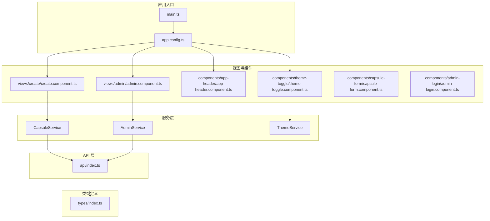
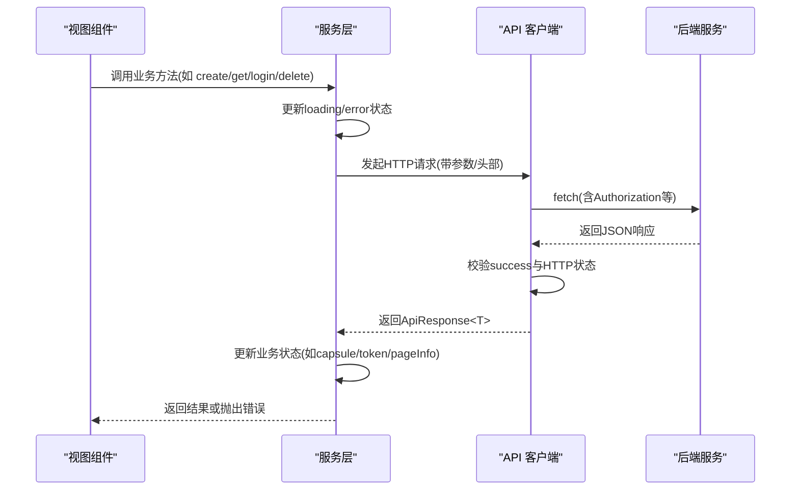
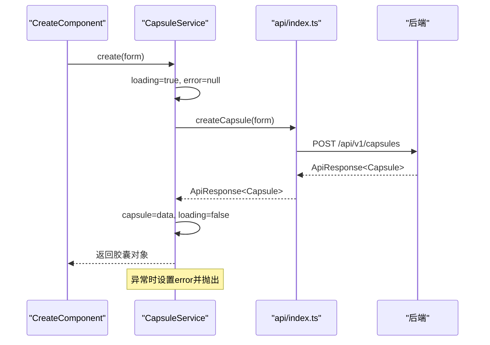
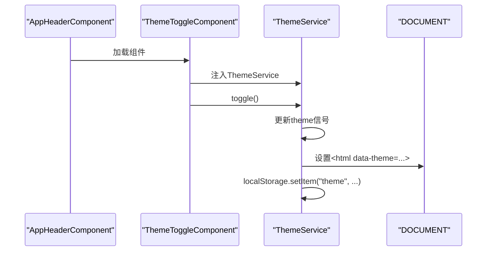
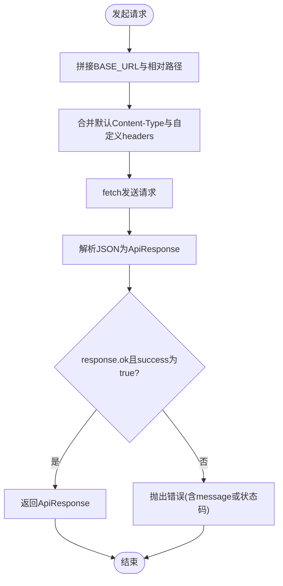
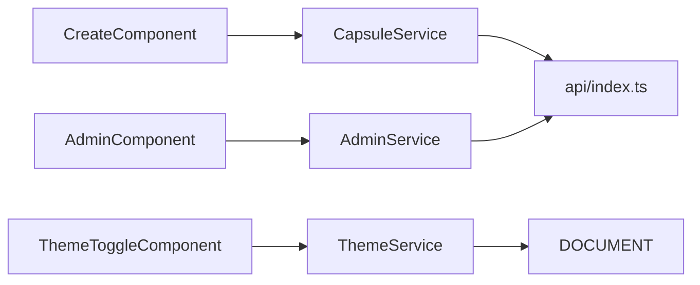

# 服务层设计

<cite>
**本文引用的文件**
- [frontends/angular-ts/src/app/services/capsule.service.ts](file://frontends/angular-ts/src/app/services/capsule.service.ts)
- [frontends/angular-ts/src/app/services/admin.service.ts](file://frontends/angular-ts/src/app/services/admin.service.ts)
- [frontends/angular-ts/src/app/services/theme.service.ts](file://frontends/angular-ts/src/app/services/theme.service.ts)
- [frontends/angular-ts/src/app/api/index.ts](file://frontends/angular-ts/src/app/api/index.ts)
- [frontends/angular-ts/src/app/types/index.ts](file://frontends/angular-ts/src/app/types/index.ts)
- [frontends/angular-ts/src/app/app.config.ts](file://frontends/angular-ts/src/app/app.config.ts)
- [frontends/angular-ts/src/main.ts](file://frontends/angular-ts/src/main.ts)
- [frontends/angular-ts/src/app/components/app-header/app-header.component.ts](file://frontends/angular-ts/src/app/components/app-header/app-header.component.ts)
- [frontends/angular-ts/src/app/components/theme-toggle/theme-toggle.component.ts](file://frontends/angular-ts/src/app/components/theme-toggle/theme-toggle.component.ts)
- [frontends/angular-ts/src/app/components/capsule-form/capsule-form.component.ts](file://frontends/angular-ts/src/app/components/capsule-form/capsule-form.component.ts)
- [frontends/angular-ts/src/app/components/admin-login/admin-login.component.ts](file://frontends/angular-ts/src/app/components/admin-login/admin-login.component.ts)
- [frontends/angular-ts/src/app/views/admin/admin.component.ts](file://frontends/angular-ts/src/app/views/admin/admin.component.ts)
- [frontends/angular-ts/src/app/views/create/create.component.ts](file://frontends/angular-ts/src/app/views/create/create.component.ts)
- [frontends/angular-ts/src/__tests__/services/capsule.service.spec.ts](file://frontends/angular-ts/src/__tests__/services/capsule.service.spec.ts)
- [frontends/angular-ts/src/__tests__/services/theme.service.spec.ts](file://frontends/angular-ts/src/__tests__/services/theme.service.spec.ts)
</cite>

## 目录
1. [引言](#引言)
2. [项目结构](#项目结构)
3. [核心组件](#核心组件)
4. [架构总览](#架构总览)
5. [详细组件分析](#详细组件分析)
6. [依赖关系分析](#依赖关系分析)
7. [性能考量](#性能考量)
8. [故障排查指南](#故障排查指南)
9. [结论](#结论)
10. [附录](#附录)

## 引言
本文件系统化梳理 HelloTime 项目中 Angular 服务层的设计与实现，重点围绕以下目标展开：
- 解释服务层在 Angular 架构中的角色与设计理念：单一职责、可测试性、可复用性
- 深入解析三个核心服务：CapsuleService（胶囊业务逻辑）、AdminService（管理员认证）、ThemeService（主题切换）的实现模式
- 阐述 HTTP 客户端封装与使用：统一请求处理、错误处理机制、响应数据转换
- 说明服务间的依赖关系与协作模式
- 介绍服务生命周期管理与内存泄漏防护
- 详解 API 客户端实现：请求/响应拦截思路、认证 token 管理
- 提供服务单元测试最佳实践与 Mock 策略

## 项目结构
Angular 前端采用功能域与分层结合的组织方式：
- 服务层位于 app/services，封装业务状态与数据流
- API 层位于 app/api，统一对外部 HTTP 请求进行封装
- 类型定义位于 app/types，确保前后端数据契约一致
- 视图与组件位于 app/views 与 app/components，通过依赖注入消费服务
- 应用引导与全局提供者位于 app/app.config.ts



图表来源
- [frontends/angular-ts/src/main.ts:1-7](file://frontends/angular-ts/src/main.ts#L1-L7)
- [frontends/angular-ts/src/app/app.config.ts:1-14](file://frontends/angular-ts/src/app/app.config.ts#L1-L14)
- [frontends/angular-ts/src/app/services/capsule.service.ts:1-41](file://frontends/angular-ts/src/app/services/capsule.service.ts#L1-L41)
- [frontends/angular-ts/src/app/services/admin.service.ts:1-84](file://frontends/angular-ts/src/app/services/admin.service.ts#L1-L84)
- [frontends/angular-ts/src/app/services/theme.service.ts:1-28](file://frontends/angular-ts/src/app/services/theme.service.ts#L1-L28)
- [frontends/angular-ts/src/app/api/index.ts:1-71](file://frontends/angular-ts/src/app/api/index.ts#L1-L71)
- [frontends/angular-ts/src/app/types/index.ts:1-53](file://frontends/angular-ts/src/app/types/index.ts#L1-L53)
- [frontends/angular-ts/src/app/views/create/create.component.ts:1-54](file://frontends/angular-ts/src/app/views/create/create.component.ts#L1-L54)
- [frontends/angular-ts/src/app/views/admin/admin.component.ts:1-45](file://frontends/angular-ts/src/app/views/admin/admin.component.ts#L1-L45)
- [frontends/angular-ts/src/app/components/app-header/app-header.component.ts:1-13](file://frontends/angular-ts/src/app/components/app-header/app-header.component.ts#L1-L13)
- [frontends/angular-ts/src/app/components/theme-toggle/theme-toggle.component.ts:1-14](file://frontends/angular-ts/src/app/components/theme-toggle/theme-toggle.component.ts#L1-L14)
- [frontends/angular-ts/src/app/components/capsule-form/capsule-form.component.ts:1-68](file://frontends/angular-ts/src/app/components/capsule-form/capsule-form.component.ts#L1-L68)
- [frontends/angular-ts/src/app/components/admin-login/admin-login.component.ts:1-24](file://frontends/angular-ts/src/app/components/admin-login/admin-login.component.ts#L1-L24)

章节来源
- [frontends/angular-ts/src/main.ts:1-7](file://frontends/angular-ts/src/main.ts#L1-L7)
- [frontends/angular-ts/src/app/app.config.ts:1-14](file://frontends/angular-ts/src/app/app.config.ts#L1-L14)

## 核心组件
本节聚焦三大服务的职责边界、状态模型与交互流程。

- CapsuleService
  - 单例提供，负责胶囊的创建与查询
  - 内部状态：当前胶囊、加载状态、错误信息
  - 关键方法：create、get
  - 设计要点：每个公共方法均包含统一的 loading/error 状态管理与 finally 清理

- AdminService
  - 单例提供，负责管理员登录、登出、分页查询胶囊列表、删除胶囊
  - 内部状态：token、胶囊列表、分页信息、加载状态、错误信息
  - 认证持久化：token 存储于 sessionStorage，并暴露 isLoggedIn 计算信号
  - 关键方法：login、logout、fetchCapsules、deleteCapsule

- ThemeService
  - 单例提供，负责主题切换与持久化
  - 内部状态：当前主题（light/dark），默认从 localStorage 恢复
  - 行为：构造函数注册 effect，自动将 data-theme 属性写入 documentElement，并同步 localStorage

章节来源
- [frontends/angular-ts/src/app/services/capsule.service.ts:1-41](file://frontends/angular-ts/src/app/services/capsule.service.ts#L1-L41)
- [frontends/angular-ts/src/app/services/admin.service.ts:1-84](file://frontends/angular-ts/src/app/services/admin.service.ts#L1-L84)
- [frontends/angular-ts/src/app/services/theme.service.ts:1-28](file://frontends/angular-ts/src/app/services/theme.service.ts#L1-L28)

## 架构总览
服务层与 API 层的协作关系如下：



图表来源
- [frontends/angular-ts/src/app/services/capsule.service.ts:11-39](file://frontends/angular-ts/src/app/services/capsule.service.ts#L11-L39)
- [frontends/angular-ts/src/app/services/admin.service.ts:27-82](file://frontends/angular-ts/src/app/services/admin.service.ts#L27-L82)
- [frontends/angular-ts/src/app/api/index.ts:10-27](file://frontends/angular-ts/src/app/api/index.ts#L10-L27)

## 详细组件分析

### CapsuleService 分析
- 设计理念
  - 单一职责：仅处理胶囊的创建与查询
  - 可测试性：通过注入 API 函数实现解耦；单元测试中以 Spy 替换
  - 可复用性：返回标准化的 ApiResponse 结构，便于上层统一处理
- 状态管理
  - 使用 signal 管理 capsule/loading/error，确保响应式更新
  - 每个异步方法均设置 loading=true，finally 中恢复
- 错误处理
  - 捕获异常并设置 error，同时抛出原错误，便于调用方感知
- 典型调用链



图表来源
- [frontends/angular-ts/src/app/views/create/create.component.ts:32-42](file://frontends/angular-ts/src/app/views/create/create.component.ts#L32-L42)
- [frontends/angular-ts/src/app/services/capsule.service.ts:11-24](file://frontends/angular-ts/src/app/services/capsule.service.ts#L11-L24)
- [frontends/angular-ts/src/app/api/index.ts:29-37](file://frontends/angular-ts/src/app/api/index.ts#L29-L37)

章节来源
- [frontends/angular-ts/src/app/services/capsule.service.ts:1-41](file://frontends/angular-ts/src/app/services/capsule.service.ts#L1-L41)
- [frontends/angular-ts/src/app/views/create/create.component.ts:1-54](file://frontends/angular-ts/src/app/views/create/create.component.ts#L1-L54)
- [frontends/angular-ts/src/__tests__/services/capsule.service.spec.ts:1-79](file://frontends/angular-ts/src/__tests__/services/capsule.service.spec.ts#L1-L79)

### AdminService 分析
- 设计理念
  - 单一职责：管理员认证与胶囊管理（分页查询、删除）
  - 认证持久化：token 写入 sessionStorage，并在服务初始化时恢复
  - 可测试性：login/fetchCapsules/deleteCapsule 均为纯异步方法，易于 Mock
- 状态管理
  - token、capsules、pageInfo、loading、error 通过 signal 组织
  - isLoggedIn 基于 token 计算得出
- 错误处理
  - 统一设置 error 并抛出，便于视图层展示
- 典型调用链

```mermaid
sequenceDiagram
participant AdminComp as "AdminComponent"
participant AdminSvc as "AdminService"
participant API as "api/index.ts"
participant BE as "后端"
AdminComp->>AdminSvc : login(password)
AdminSvc->>AdminSvc : loading=true, error=null
AdminSvc->>API : adminLogin(password)
API->>BE : POST /api/v1/admin/login
BE-->>API : ApiResponse<AdminToken>
API-->>AdminSvc : ApiResponse<AdminToken>
AdminSvc->>AdminSvc : token=...; 存储sessionStorage
AdminSvc-->>AdminComp : 登录完成
AdminComp->>AdminSvc : fetchCapsules(page)
AdminSvc->>API : getAdminCapsules(token, page)
API->>BE : GET /api/v1/admin/capsules?page=...
BE-->>API : ApiResponse<PageData<Capsule>>
API-->>AdminSvc : ApiResponse<PageData<Capsule>>
AdminSvc->>AdminSvc : 更新capsules与pageInfo
```

图表来源
- [frontends/angular-ts/src/app/views/admin/admin.component.ts:26-33](file://frontends/angular-ts/src/app/views/admin/admin.component.ts#L26-L33)
- [frontends/angular-ts/src/app/services/admin.service.ts:27-67](file://frontends/angular-ts/src/app/services/admin.service.ts#L27-L67)
- [frontends/angular-ts/src/app/api/index.ts:43-54](file://frontends/angular-ts/src/app/api/index.ts#L43-L54)

章节来源
- [frontends/angular-ts/src/app/services/admin.service.ts:1-84](file://frontends/angular-ts/src/app/services/admin.service.ts#L1-L84)
- [frontends/angular-ts/src/app/views/admin/admin.component.ts:1-45](file://frontends/angular-ts/src/app/views/admin/admin.component.ts#L1-L45)
- [frontends/angular-ts/src/app/components/admin-login/admin-login.component.ts:1-24](file://frontends/angular-ts/src/app/components/admin-login/admin-login.component.ts#L1-L24)

### ThemeService 分析
- 设计理念
  - 单一职责：主题切换与持久化
  - 响应式：effect 自动同步 DOM 属性与本地存储
  - 可测试性：通过 DOCUMENT 注入，测试中可替换
- 状态与行为
  - 默认主题从 localStorage 恢复，否则为 light
  - toggle 切换主题，effect 同步到 documentElement 与 localStorage
- 典型调用链



图表来源
- [frontends/angular-ts/src/app/components/app-header/app-header.component.ts:1-13](file://frontends/angular-ts/src/app/components/app-header/app-header.component.ts#L1-L13)
- [frontends/angular-ts/src/app/components/theme-toggle/theme-toggle.component.ts:1-14](file://frontends/angular-ts/src/app/components/theme-toggle/theme-toggle.component.ts#L1-L14)
- [frontends/angular-ts/src/app/services/theme.service.ts:16-22](file://frontends/angular-ts/src/app/services/theme.service.ts#L16-L22)

章节来源
- [frontends/angular-ts/src/app/services/theme.service.ts:1-28](file://frontends/angular-ts/src/app/services/theme.service.ts#L1-L28)
- [frontends/angular-ts/src/__tests__/services/theme.service.spec.ts:1-43](file://frontends/angular-ts/src/__tests__/services/theme.service.spec.ts#L1-L43)

### API 客户端实现与 HTTP 封装
- 统一基地址与请求封装
  - 基础路径：/api/v1
  - request 函数统一处理 Content-Type、合并自定义 headers、JSON 解析与错误校验
- 错误处理机制
  - 当 response.ok 为 false 或 data.success 为 false 时，抛出包含 message 或状态码的错误
- 响应数据转换
  - 所有导出函数返回 Promise<ApiResponse<T>>，调用方无需重复解析 JSON
- 认证 token 管理
  - 管理员相关接口通过 Authorization: Bearer token 头传递
  - AdminService 负责 token 的存储与恢复



图表来源
- [frontends/angular-ts/src/app/api/index.ts:10-27](file://frontends/angular-ts/src/app/api/index.ts#L10-L27)

章节来源
- [frontends/angular-ts/src/app/api/index.ts:1-71](file://frontends/angular-ts/src/app/api/index.ts#L1-L71)
- [frontends/angular-ts/src/app/types/index.ts:23-28](file://frontends/angular-ts/src/app/types/index.ts#L23-L28)

## 依赖关系分析
- 服务间依赖
  - CapsuleService 与 AdminService 均依赖 API 客户端
  - ThemeService 独立于 API 层，仅依赖 DOCUMENT
- 组件对服务的依赖
  - CreateComponent 依赖 CapsuleService
  - AdminComponent 依赖 AdminService
  - ThemeToggleComponent 依赖 ThemeService
- 生命周期与内存防护
  - 服务均为单例（providedIn: 'root'），避免重复实例化
  - ThemeService 使用 effect 自动同步，无显式订阅需注销
  - AdminService 在 logout 时清理 token 与缓存数据，防止残留状态



图表来源
- [frontends/angular-ts/src/app/services/capsule.service.ts:1-10](file://frontends/angular-ts/src/app/services/capsule.service.ts#L1-L10)
- [frontends/angular-ts/src/app/services/admin.service.ts:1-13](file://frontends/angular-ts/src/app/services/admin.service.ts#L1-L13)
- [frontends/angular-ts/src/app/services/theme.service.ts:1-8](file://frontends/angular-ts/src/app/services/theme.service.ts#L1-L8)
- [frontends/angular-ts/src/app/views/create/create.component.ts:1-15](file://frontends/angular-ts/src/app/views/create/create.component.ts#L1-L15)
- [frontends/angular-ts/src/app/views/admin/admin.component.ts:1-15](file://frontends/angular-ts/src/app/views/admin/admin.component.ts#L1-L15)
- [frontends/angular-ts/src/app/components/theme-toggle/theme-toggle.component.ts:1-13](file://frontends/angular-ts/src/app/components/theme-toggle/theme-toggle.component.ts#L1-L13)

章节来源
- [frontends/angular-ts/src/app/services/capsule.service.ts:1-41](file://frontends/angular-ts/src/app/services/capsule.service.ts#L1-L41)
- [frontends/angular-ts/src/app/services/admin.service.ts:1-84](file://frontends/angular-ts/src/app/services/admin.service.ts#L1-L84)
- [frontends/angular-ts/src/app/services/theme.service.ts:1-28](file://frontends/angular-ts/src/app/services/theme.service.ts#L1-L28)

## 性能考量
- 状态粒度
  - 使用 signal 粒度化状态，避免不必要的组件重渲染
- I/O 优化
  - API 层集中处理 headers 与 JSON 解析，减少重复代码
- 认证缓存
  - AdminService 在内存中持有 token，避免每次请求重新计算
- 主题切换
  - ThemeService 通过 effect 同步一次 DOM 属性，避免频繁 DOM 查询

## 故障排查指南
- 常见问题与定位
  - 创建/查询失败：检查 CapsuleService 的 error 信号与 API 返回的 message 字段
  - 管理员登录失败：检查 AdminService 的 error 信号与 sessionStorage 中的 token 是否存在
  - 主题未生效：确认 ThemeService 已执行 effect，documentElement 上是否已设置 data-theme
- 调试建议
  - 在组件中打印服务状态（loading/error/capsule/token/theme）
  - 使用浏览器 Network 面板查看 /api/v1 下的请求与响应
  - 在测试中验证错误分支与状态变更

章节来源
- [frontends/angular-ts/src/app/services/capsule.service.ts:18-23](file://frontends/angular-ts/src/app/services/capsule.service.ts#L18-L23)
- [frontends/angular-ts/src/app/services/admin.service.ts:34-39](file://frontends/angular-ts/src/app/services/admin.service.ts#L34-L39)
- [frontends/angular-ts/src/app/services/theme.service.ts:17-21](file://frontends/angular-ts/src/app/services/theme.service.ts#L17-L21)

## 结论
HelloTime 的 Angular 服务层遵循单一职责与可测试性原则，通过 signal 实现响应式状态管理，借助 API 客户端实现统一的 HTTP 请求封装与错误处理。三大核心服务分别覆盖业务逻辑、认证与主题切换，彼此解耦、协作清晰。整体设计兼顾了可维护性与扩展性，为后续功能演进提供了良好基础。

## 附录

### 服务单元测试最佳实践与 Mock 策略
- CapsuleService 测试
  - Mock 策略：使用 spyOn 替换 api.createCapsule 与 api.getCapsule，模拟成功与失败场景
  - 断言点：返回值正确、service.capsule 与 loading/error 状态符合预期
  - 参考路径：[__tests__/services/capsule.service.spec.ts:1-79](file://frontends/angular-ts/src/__tests__/services/capsule.service.spec.ts#L1-L79)
- ThemeService 测试
  - Mock 策略：通过 TestBed 注入 DOCUMENT，清空 localStorage 后验证默认主题、toggle 行为与 DOM 属性同步
  - 断言点：theme 信号变化、documentElement 属性、localStorage 写入
  - 参考路径：[__tests__/services/theme.service.spec.ts:1-43](file://frontends/angular-ts/src/__tests__/services/theme.service.spec.ts#L1-L43)
- AdminService 测试建议
  - Mock 策略：spyOn api.adminLogin、api.getAdminCapsules、api.deleteAdminCapsule
  - 断言点：token 存储、capsules 与 pageInfo 更新、错误状态与 loading 状态
- 通用建议
  - 使用 Angular Testing Platform 初始化服务
  - 对 effect 行为使用 flushEffects 确保副作用执行
  - 针对异常分支抛出错误并断言 error 信号

章节来源
- [frontends/angular-ts/src/__tests__/services/capsule.service.spec.ts:1-79](file://frontends/angular-ts/src/__tests__/services/capsule.service.spec.ts#L1-L79)
- [frontends/angular-ts/src/__tests__/services/theme.service.spec.ts:1-43](file://frontends/angular-ts/src/__tests__/services/theme.service.spec.ts#L1-L43)