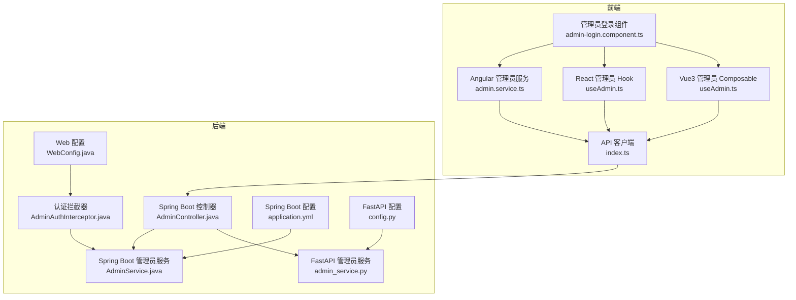
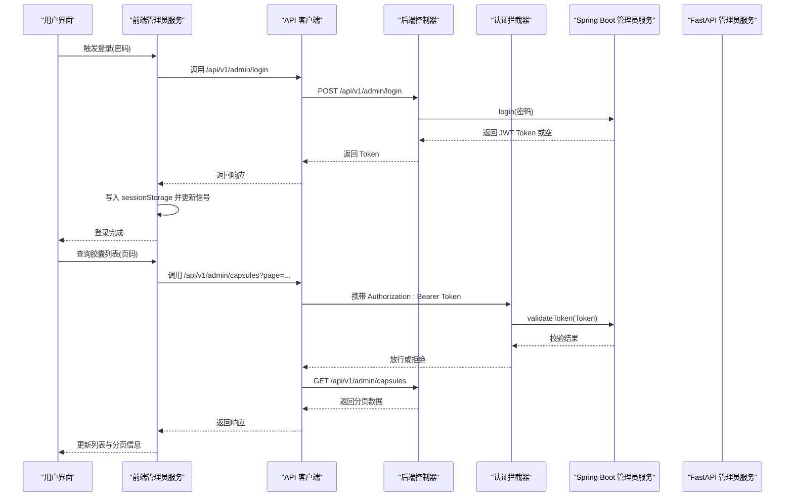
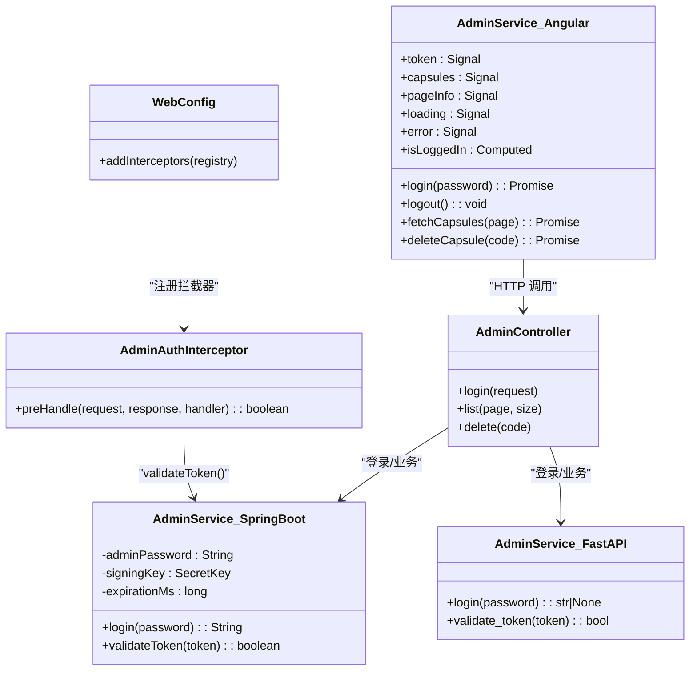

# 管理员服务 (AdminService)

<cite>
**本文档引用的文件**
- [frontends/angular-ts/src/app/services/admin.service.ts](file://frontends/angular-ts/src/app/services/admin.service.ts)
- [backends/spring-boot/src/main/java/com/hellotime/service/AdminService.java](file://backends/spring-boot/src/main/java/com/hellotime/service/AdminService.java)
- [backends/fastapi/app/services/admin_service.py](file://backends/fastapi/app/services/admin_service.py)
- [frontends/angular-ts/src/app/api/index.ts](file://frontends/angular-ts/src/app/api/index.ts)
- [backends/spring-boot/src/main/java/com/hellotime/config/AdminAuthInterceptor.java](file://backends/spring-boot/src/main/java/com/hellotime/config/AdminAuthInterceptor.java)
- [backends/spring-boot/src/main/java/com/hellotime/config/WebConfig.java](file://backends/spring-boot/src/main/java/com/hellotime/config/WebConfig.java)
- [backends/spring-boot/src/main/java/com/hellotime/controller/AdminController.java](file://backends/spring-boot/src/main/java/com/hellotime/controller/AdminController.java)
- [backends/spring-boot/src/main/resources/application.yml](file://backends/spring-boot/src/main/resources/application.yml)
- [backends/fastapi/app/config.py](file://backends/fastapi/app/config.py)
- [frontends/angular-ts/src/app/components/admin-login/admin-login.component.ts](file://frontends/angular-ts/src/app/components/admin-login/admin-login.component.ts)
- [frontends/react-ts/src/hooks/useAdmin.ts](file://frontends/react-ts/src/hooks/useAdmin.ts)
- [frontends/vue3-ts/src/composables/useAdmin.ts](file://frontends/vue3-ts/src/composables/useAdmin.ts)
- [frontends/angular-ts/src/app/types/index.ts](file://frontends/angular-ts/src/app/types/index.ts)
- [frontends/angular-ts/src/app/app.routes.ts](file://frontends/angular-ts/src/app/app.routes.ts)
</cite>

## 目录
1. [简介](#简介)
2. [项目结构](#项目结构)
3. [核心组件](#核心组件)
4. [架构总览](#架构总览)
5. [详细组件分析](#详细组件分析)
6. [依赖关系分析](#依赖关系分析)
7. [性能考虑](#性能考虑)
8. [故障排除指南](#故障排除指南)
9. [结论](#结论)
10. [附录](#附录)

## 简介
本文件面向前端与后端工程师，系统性阐述 AdminService 管理员服务的实现与集成方式，涵盖：
- 管理员认证与权限管理的完整流程
- JWT Token 的生成、存储、刷新与过期处理
- API 客户端与服务的集成：认证头自动添加、401 统一处理
- 服务状态管理：登录状态跟踪与用户信息缓存
- 与路由守卫的协作模式
- 安全最佳实践：Token 安全存储、CSRF 防护、会话管理
- 完整登录流程示例与错误处理策略

## 项目结构
本项目采用前后端分离架构，管理员相关能力在前端 Angular/React/Vue 三套实现中通过统一的 API 客户端与后端 Spring Boot/FastAPI 交互。

图表来源
- [frontends/angular-ts/src/app/services/admin.service.ts:1-84](file://frontends/angular-ts/src/app/services/admin.service.ts#L1-L84)
- [frontends/react-ts/src/hooks/useAdmin.ts:1-133](file://frontends/react-ts/src/hooks/useAdmin.ts#L1-L133)
- [frontends/vue3-ts/src/composables/useAdmin.ts:1-132](file://frontends/vue3-ts/src/composables/useAdmin.ts#L1-L132)
- [frontends/angular-ts/src/app/api/index.ts:1-71](file://frontends/angular-ts/src/app/api/index.ts#L1-L71)
- [backends/spring-boot/src/main/java/com/hellotime/controller/AdminController.java:1-78](file://backends/spring-boot/src/main/java/com/hellotime/controller/AdminController.java#L1-L78)
- [backends/spring-boot/src/main/java/com/hellotime/service/AdminService.java:1-89](file://backends/spring-boot/src/main/java/com/hellotime/service/AdminService.java#L1-L89)
- [backends/fastapi/app/services/admin_service.py:1-42](file://backends/fastapi/app/services/admin_service.py#L1-L42)
- [backends/spring-boot/src/main/java/com/hellotime/config/AdminAuthInterceptor.java:1-59](file://backends/spring-boot/src/main/java/com/hellotime/config/AdminAuthInterceptor.java#L1-L59)
- [backends/spring-boot/src/main/java/com/hellotime/config/WebConfig.java:1-32](file://backends/spring-boot/src/main/java/com/hellotime/config/WebConfig.java#L1-L32)
- [backends/spring-boot/src/main/resources/application.yml:1-22](file://backends/spring-boot/src/main/resources/application.yml#L1-L22)
- [backends/fastapi/app/config.py:1-18](file://backends/fastapi/app/config.py#L1-L18)

章节来源
- [frontends/angular-ts/src/app/services/admin.service.ts:1-84](file://frontends/angular-ts/src/app/services/admin.service.ts#L1-L84)
- [frontends/react-ts/src/hooks/useAdmin.ts:1-133](file://frontends/react-ts/src/hooks/useAdmin.ts#L1-L133)
- [frontends/vue3-ts/src/composables/useAdmin.ts:1-132](file://frontends/vue3-ts/src/composables/useAdmin.ts#L1-L132)
- [frontends/angular-ts/src/app/api/index.ts:1-71](file://frontends/angular-ts/src/app/api/index.ts#L1-L71)
- [backends/spring-boot/src/main/java/com/hellotime/controller/AdminController.java:1-78](file://backends/spring-boot/src/main/java/com/hellotime/controller/AdminController.java#L1-L78)
- [backends/spring-boot/src/main/java/com/hellotime/service/AdminService.java:1-89](file://backends/spring-boot/src/main/java/com/hellotime/service/AdminService.java#L1-L89)
- [backends/fastapi/app/services/admin_service.py:1-42](file://backends/fastapi/app/services/admin_service.py#L1-L42)
- [backends/spring-boot/src/main/java/com/hellotime/config/AdminAuthInterceptor.java:1-59](file://backends/spring-boot/src/main/java/com/hellotime/config/AdminAuthInterceptor.java#L1-L59)
- [backends/spring-boot/src/main/java/com/hellotime/config/WebConfig.java:1-32](file://backends/spring-boot/src/main/java/com/hellotime/config/WebConfig.java#L1-L32)
- [backends/spring-boot/src/main/resources/application.yml:1-22](file://backends/spring-boot/src/main/resources/application.yml#L1-L22)
- [backends/fastapi/app/config.py:1-18](file://backends/fastapi/app/config.py#L1-L18)

## 核心组件
- 前端管理员服务（Angular）：负责登录、登出、胶囊列表获取与删除、状态管理（token、loading、error、capsules、pageInfo）。
- API 客户端：封装通用请求逻辑，自动为管理员接口添加 Bearer 认证头，并统一处理非 2xx 与业务失败。
- 后端管理员服务（Spring Boot）：基于 JJWT 实现 JWT 生成与验证；提供登录与 Token 校验能力。
- 后端管理员服务（FastAPI）：基于 PyJWT 实现 JWT 生成与验证；提供登录与 Token 校验能力。
- 认证拦截器（Spring Boot）：拦截 /api/v1/admin/** 路由，校验 Authorization 头中的 Bearer Token。
- Web 配置（Spring Boot）：注册拦截器并对登录接口进行排除。
- 配置文件：Spring Boot 与 FastAPI 从环境变量读取管理员密码、JWT 密钥与过期时长。

章节来源
- [frontends/angular-ts/src/app/services/admin.service.ts:1-84](file://frontends/angular-ts/src/app/services/admin.service.ts#L1-L84)
- [frontends/angular-ts/src/app/api/index.ts:1-71](file://frontends/angular-ts/src/app/api/index.ts#L1-L71)
- [backends/spring-boot/src/main/java/com/hellotime/service/AdminService.java:1-89](file://backends/spring-boot/src/main/java/com/hellotime/service/AdminService.java#L1-L89)
- [backends/fastapi/app/services/admin_service.py:1-42](file://backends/fastapi/app/services/admin_service.py#L1-L42)
- [backends/spring-boot/src/main/java/com/hellotime/config/AdminAuthInterceptor.java:1-59](file://backends/spring-boot/src/main/java/com/hellotime/config/AdminAuthInterceptor.java#L1-L59)
- [backends/spring-boot/src/main/java/com/hellotime/config/WebConfig.java:1-32](file://backends/spring-boot/src/main/java/com/hellotime/config/WebConfig.java#L1-L32)
- [backends/spring-boot/src/main/resources/application.yml:1-22](file://backends/spring-boot/src/main/resources/application.yml#L1-L22)
- [backends/fastapi/app/config.py:1-18](file://backends/fastapi/app/config.py#L1-L18)

## 架构总览
管理员认证与权限管理的整体流程如下：

图表来源
- [frontends/angular-ts/src/app/services/admin.service.ts:27-46](file://frontends/angular-ts/src/app/services/admin.service.ts#L27-L46)
- [frontends/angular-ts/src/app/api/index.ts:43-54](file://frontends/angular-ts/src/app/api/index.ts#L43-L54)
- [backends/spring-boot/src/main/java/com/hellotime/controller/AdminController.java:39-62](file://backends/spring-boot/src/main/java/com/hellotime/controller/AdminController.java#L39-L62)
- [backends/spring-boot/src/main/java/com/hellotime/config/AdminAuthInterceptor.java:34-57](file://backends/spring-boot/src/main/java/com/hellotime/config/AdminAuthInterceptor.java#L34-L57)
- [backends/spring-boot/src/main/java/com/hellotime/service/AdminService.java:53-87](file://backends/spring-boot/src/main/java/com/hellotime/service/AdminService.java#L53-L87)

## 详细组件分析

### 前端管理员服务（Angular）
- 状态管理
  - token：来自 sessionStorage 的持久化状态，初始化时读取，登录成功写入，登出清除。
  - capsules/pageInfo/loading/error：用于列表展示与交互反馈。
  - isLoggedIn：基于 token 的计算属性。
- 关键方法
  - login(password)：调用 API 登录，成功后写入 token 并持久化到 sessionStorage。
  - logout()：清空 token 与本地缓存。
  - fetchCapsules(page)：携带 token 调用管理员接口，更新列表与分页信息。
  - deleteCapsule(code)：删除后刷新当前页。
- 错误处理
  - 统一设置 error 信号，便于 UI 展示。
  - 未登录时提前返回，避免无意义请求。

章节来源
- [frontends/angular-ts/src/app/services/admin.service.ts:1-84](file://frontends/angular-ts/src/app/services/admin.service.ts#L1-L84)

### API 客户端与认证头管理
- 通用请求封装
  - request(url, options)：统一处理基础路径、Content-Type、响应解析与错误抛出。
- 管理员接口
  - adminLogin(password)：POST /api/v1/admin/login。
  - getAdminCapsules(token, page, size)：GET /api/v1/admin/capsules，自动添加 Authorization: Bearer token。
  - deleteAdminCapsule(token, code)：DELETE /api/v1/admin/capsules/{code}，自动添加 Authorization: Bearer token。
- 401 统一处理
  - request 内部对非 2xx 或业务失败抛出错误，前端服务层捕获并展示。

章节来源
- [frontends/angular-ts/src/app/api/index.ts:1-71](file://frontends/angular-ts/src/app/api/index.ts#L1-L71)

### 后端管理员服务（Spring Boot）
- JWT 生成
  - login(password)：密码校验通过后，使用 JJWT 生成包含 sub、iat、exp 的 JWT。
- Token 校验
  - validateToken(token)：使用相同密钥验证签名并解析，捕获 JwtException/IllegalArgumentException 返回 false。
- 配置
  - 从 application.yml 读取管理员密码、JWT 密钥与过期时长（小时）。

章节来源
- [backends/spring-boot/src/main/java/com/hellotime/service/AdminService.java:1-89](file://backends/spring-boot/src/main/java/com/hellotime/service/AdminService.java#L1-L89)
- [backends/spring-boot/src/main/resources/application.yml:16-22](file://backends/spring-boot/src/main/resources/application.yml#L16-L22)

### 后端管理员服务（FastAPI）
- JWT 生成
  - login(password)：密码校验通过后，使用 PyJWT 生成 HS256 签名的 JWT。
- Token 校验
  - validate_token(token)：使用相同密钥解码并验证，异常则返回 False。
- 配置
  - 从 config.py 读取管理员密码、JWT 密钥与过期时长（小时）。

章节来源
- [backends/fastapi/app/services/admin_service.py:1-42](file://backends/fastapi/app/services/admin_service.py#L1-L42)
- [backends/fastapi/app/config.py:1-18](file://backends/fastapi/app/config.py#L1-L18)

### 认证拦截器与路由守卫
- Spring Boot 拦截器
  - AdminAuthInterceptor.preHandle：校验 Authorization 头格式与内容，提取 Bearer Token 并调用服务校验。
  - WebConfig：注册拦截器，对 /api/v1/admin/** 生效，排除 /api/v1/admin/login。
- 路由守卫（Angular）
  - 当前仓库未提供 Angular 路由守卫实现；建议在路由层检查 AdminService.isLoggedIn，未登录重定向至登录页或阻止导航。

章节来源
- [backends/spring-boot/src/main/java/com/hellotime/config/AdminAuthInterceptor.java:1-59](file://backends/spring-boot/src/main/java/com/hellotime/config/AdminAuthInterceptor.java#L1-L59)
- [backends/spring-boot/src/main/java/com/hellotime/config/WebConfig.java:1-32](file://backends/spring-boot/src/main/java/com/hellotime/config/WebConfig.java#L1-L32)
- [frontends/angular-ts/src/app/app.routes.ts:1-35](file://frontends/angular-ts/src/app/app.routes.ts#L1-L35)

### 登录流程与状态管理
- 登录流程
  - 用户输入密码 → 调用 adminLogin → 成功后写入 sessionStorage → 更新服务内部 token 信号 → 刷新胶囊列表。
- 状态管理
  - Angular：signal 与 computed 管理 token、loading、error、capsules、pageInfo。
  - React：useSyncExternalStore + sessionStorage 管理 token 共享。
  - Vue3：ref/computed 管理 token、loading、error、capsules、pageInfo。
- Token 生命周期
  - 登录成功写入 sessionStorage；登出清除；页面刷新从 sessionStorage 初始化。
- 与 API 客户端协作
  - 管理员接口统一携带 Authorization: Bearer token；非 2xx 或业务失败在 request 中抛错，前端服务层捕获。

章节来源
- [frontends/angular-ts/src/app/services/admin.service.ts:27-46](file://frontends/angular-ts/src/app/services/admin.service.ts#L27-L46)
- [frontends/react-ts/src/hooks/useAdmin.ts:49-67](file://frontends/react-ts/src/hooks/useAdmin.ts#L49-L67)
- [frontends/vue3-ts/src/composables/useAdmin.ts:43-66](file://frontends/vue3-ts/src/composables/useAdmin.ts#L43-L66)
- [frontends/angular-ts/src/app/api/index.ts:43-66](file://frontends/angular-ts/src/app/api/index.ts#L43-L66)

### 权限验证与 401 处理
- 后端
  - AdminAuthInterceptor 校验失败抛出 UnauthorizedException，Spring Boot 全局异常处理将其转换为标准响应。
- 前端
  - API 客户端在非 2xx 或业务失败时抛错；各前端实现捕获后根据错误信息决定是否登出并清理本地状态。

章节来源
- [backends/spring-boot/src/main/java/com/hellotime/config/AdminAuthInterceptor.java:44-53](file://backends/spring-boot/src/main/java/com/hellotime/config/AdminAuthInterceptor.java#L44-L53)
- [frontends/angular-ts/src/app/api/index.ts:22-26](file://frontends/angular-ts/src/app/api/index.ts#L22-L26)
- [frontends/react-ts/src/hooks/useAdmin.ts:84-87](file://frontends/react-ts/src/hooks/useAdmin.ts#L84-L87)
- [frontends/vue3-ts/src/composables/useAdmin.ts:88-92](file://frontends/vue3-ts/src/composables/useAdmin.ts#L88-L92)

### JWT 存储、刷新与过期处理
- 存储
  - 前端：sessionStorage 持久化 token，页面刷新自动恢复登录态。
- 刷新
  - 当前实现不支持自动刷新；token 过期后需重新登录。
- 过期处理
  - 后端：validateToken 检测过期返回 false，拦截器拒绝请求。
  - 前端：捕获“认证”相关错误后自动登出并清理状态。

章节来源
- [frontends/angular-ts/src/app/services/admin.service.ts:33-33](file://frontends/angular-ts/src/app/services/admin.service.ts#L33-L33)
- [backends/spring-boot/src/main/java/com/hellotime/service/AdminService.java:75-87](file://backends/spring-boot/src/main/java/com/hellotime/service/AdminService.java#L75-L87)
- [frontends/react-ts/src/hooks/useAdmin.ts:84-87](file://frontends/react-ts/src/hooks/useAdmin.ts#L84-L87)
- [frontends/vue3-ts/src/composables/useAdmin.ts:88-92](file://frontends/vue3-ts/src/composables/useAdmin.ts#L88-L92)

### 与其他服务的协作模式
- 与胶囊服务（CapsuleService）协作
  - 管理员控制器提供分页查询与删除接口，管理员服务仅负责认证与授权。
- 与路由守卫的配合
  - 建议在路由层检查 AdminService.isLoggedIn，未登录禁止进入 /admin 等受保护页面。
- 与全局异常处理的配合
  - Spring Boot 拦截器抛出 UnauthorizedException，由全局异常处理器统一返回。

章节来源
- [backends/spring-boot/src/main/java/com/hellotime/controller/AdminController.java:57-76](file://backends/spring-boot/src/main/java/com/hellotime/controller/AdminController.java#L57-L76)
- [backends/spring-boot/src/main/java/com/hellotime/config/AdminAuthInterceptor.java:34-57](file://backends/spring-boot/src/main/java/com/hellotime/config/AdminAuthInterceptor.java#L34-L57)

## 依赖关系分析

图表来源
- [frontends/angular-ts/src/app/services/admin.service.ts:1-84](file://frontends/angular-ts/src/app/services/admin.service.ts#L1-L84)
- [backends/spring-boot/src/main/java/com/hellotime/service/AdminService.java:1-89](file://backends/spring-boot/src/main/java/com/hellotime/service/AdminService.java#L1-L89)
- [backends/fastapi/app/services/admin_service.py:1-42](file://backends/fastapi/app/services/admin_service.py#L1-L42)
- [backends/spring-boot/src/main/java/com/hellotime/config/AdminAuthInterceptor.java:1-59](file://backends/spring-boot/src/main/java/com/hellotime/config/AdminAuthInterceptor.java#L1-L59)
- [backends/spring-boot/src/main/java/com/hellotime/config/WebConfig.java:1-32](file://backends/spring-boot/src/main/java/com/hellotime/config/WebConfig.java#L1-L32)
- [backends/spring-boot/src/main/java/com/hellotime/controller/AdminController.java:1-78](file://backends/spring-boot/src/main/java/com/hellotime/controller/AdminController.java#L1-L78)

## 性能考虑
- Token 校验成本低：后端使用对称密钥快速验证签名与过期时间。
- 前端状态粒度：使用信号/响应式状态减少不必要的渲染。
- 请求去抖与并发控制：可引入请求去重与并发限制，避免重复请求。
- 分页加载：后端分页接口与前端分页状态配合，降低一次性传输数据量。

## 故障排除指南
- 登录失败
  - 检查密码是否正确；确认后端配置项 ADMIN_PASSWORD 与前端调用一致。
- 401 未认证
  - 确认请求头 Authorization: Bearer token 是否存在且格式正确。
  - 检查 token 是否过期；如过期需重新登录。
- 列表为空或报错
  - 确认已登录且 token 有效；检查后端分页参数与数据库状态。
- CSRF 防护
  - 当前实现未使用 SameSite Cookie；建议在后端启用 SameSite=Lax|Strict，并结合 CSRF Token 机制（视具体需求评估）。

章节来源
- [backends/spring-boot/src/main/java/com/hellotime/config/AdminAuthInterceptor.java:44-53](file://backends/spring-boot/src/main/java/com/hellotime/config/AdminAuthInterceptor.java#L44-L53)
- [frontends/angular-ts/src/app/api/index.ts:22-26](file://frontends/angular-ts/src/app/api/index.ts#L22-L26)

## 结论
AdminService 在本项目中提供了清晰的认证与权限边界：前端负责状态管理与 UI 交互，后端负责 JWT 生成与校验、路由拦截与异常处理。通过统一的 API 客户端与认证头管理，实现了跨框架的一致体验。建议后续增强包括：自动刷新机制、路由守卫集成、CSRF 防护与更细粒度的权限控制。

## 附录

### 完整登录流程示例（步骤化）
- 步骤 1：用户在登录组件输入密码并提交。
- 步骤 2：前端管理员服务调用 API 客户端的 adminLogin。
- 步骤 3：API 客户端向 /api/v1/admin/login 发送请求。
- 步骤 4：后端控制器调用管理员服务进行密码校验与 JWT 生成。
- 步骤 5：后端返回 Token；前端写入 sessionStorage 并更新服务状态。
- 步骤 6：前端发起管理员接口请求，携带 Authorization: Bearer token。
- 步骤 7：后端拦截器校验 Token，通过后返回业务数据。

章节来源
- [frontends/angular-ts/src/app/components/admin-login/admin-login.component.ts:18-22](file://frontends/angular-ts/src/app/components/admin-login/admin-login.component.ts#L18-L22)
- [frontends/angular-ts/src/app/api/index.ts:43-48](file://frontends/angular-ts/src/app/api/index.ts#L43-L48)
- [backends/spring-boot/src/main/java/com/hellotime/controller/AdminController.java:39-46](file://backends/spring-boot/src/main/java/com/hellotime/controller/AdminController.java#L39-L46)
- [backends/spring-boot/src/main/java/com/hellotime/service/AdminService.java:53-66](file://backends/spring-boot/src/main/java/com/hellotime/service/AdminService.java#L53-L66)

### 安全最佳实践清单
- Token 安全存储
  - 使用 sessionStorage 存储短期会话；避免 localStorage 长期存储敏感信息。
- 防止 CSRF 攻击
  - 启用 SameSite Cookie；对关键操作增加 CSRF Token 校验。
- 会话管理
  - 设置合理过期时间；提供主动登出；监听浏览器隐身模式变化清理状态。
- 网络安全
  - 强制 HTTPS；校验证书；对敏感接口进行速率限制与 IP 黑名单。