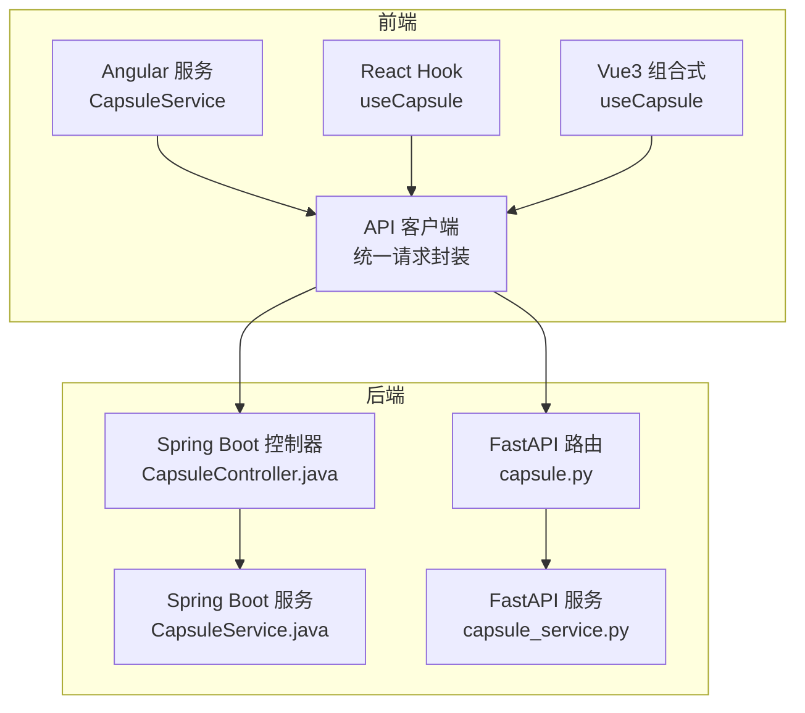
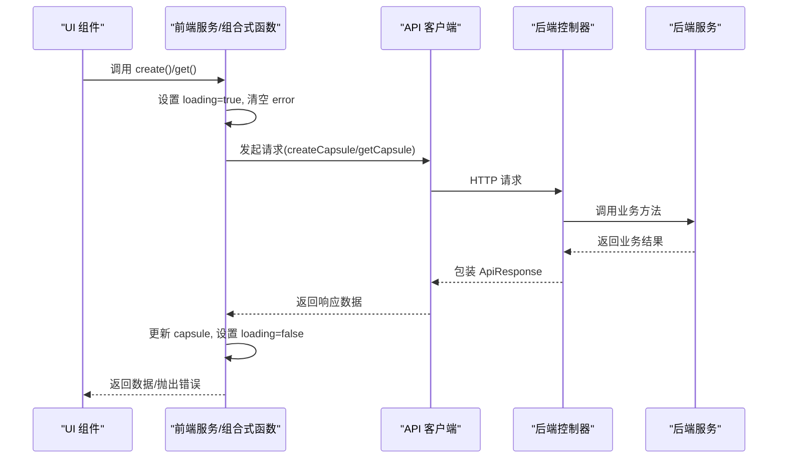
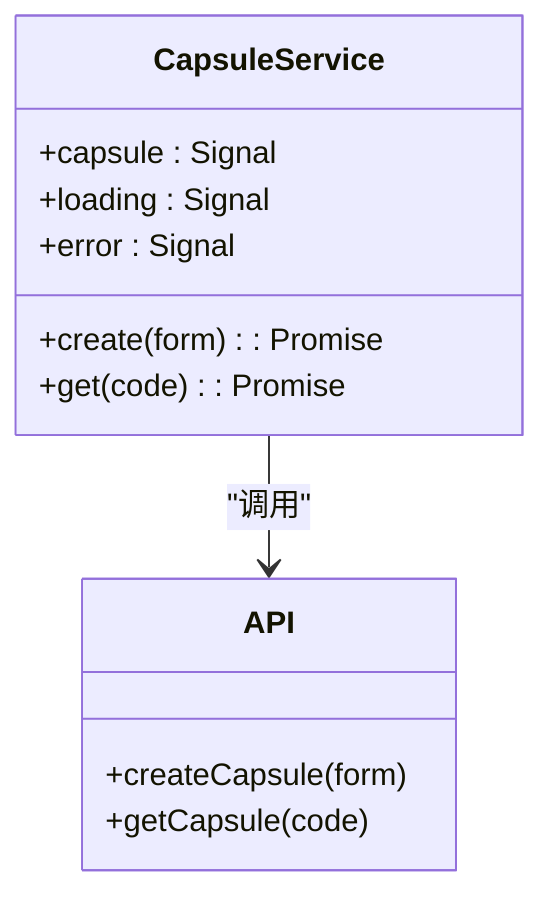
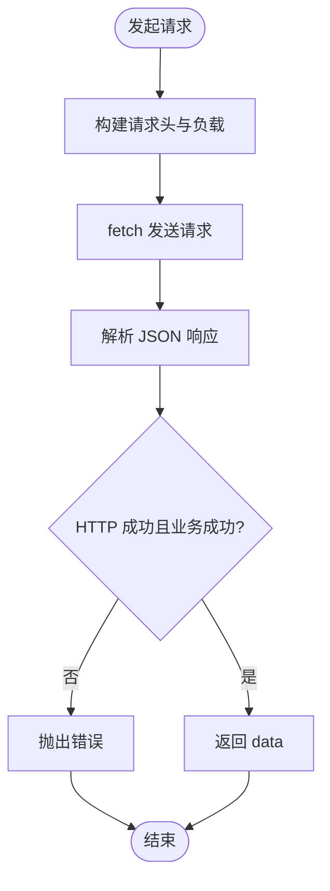
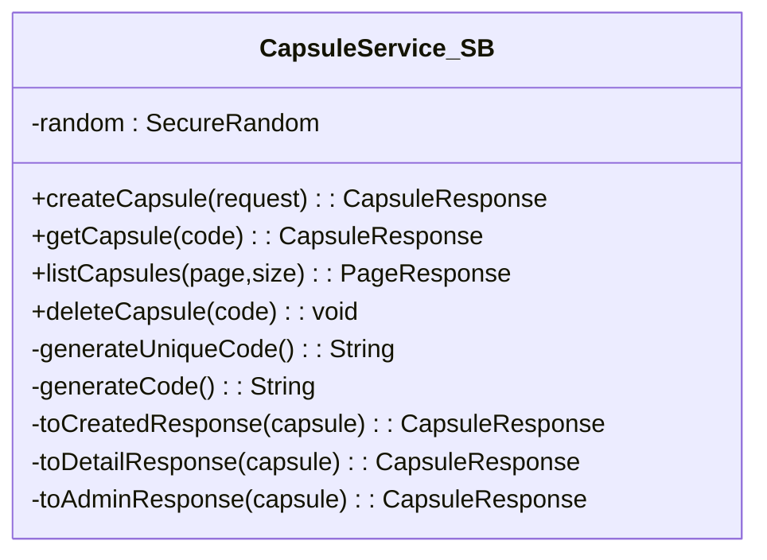
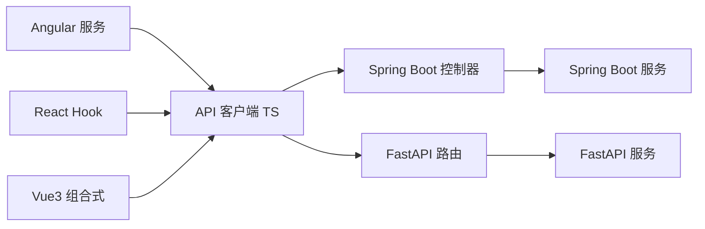

# 胶囊服务 (CapsuleService)

<cite>
**本文档引用的文件**
- [frontends/angular-ts/src/app/services/capsule.service.ts](file://frontends/angular-ts/src/app/services/capsule.service.ts)
- [frontends/react-ts/src/hooks/useCapsule.ts](file://frontends/react-ts/src/hooks/useCapsule.ts)
- [frontends/vue3-ts/src/composables/useCapsule.ts](file://frontends/vue3-ts/src/composables/useCapsule.ts)
- [backends/spring-boot/src/main/java/com/hellotime/service/CapsuleService.java](file://backends/spring-boot/src/main/java/com/hellotime/service/CapsuleService.java)
- [backends/fastapi/app/services/capsule_service.py](file://backends/fastapi/app/services/capsule_service.py)
- [frontends/angular-ts/src/app/api/index.ts](file://frontends/angular-ts/src/app/api/index.ts)
- [frontends/react-ts/src/api/index.ts](file://frontends/react-ts/src/api/index.ts)
- [frontends/vue3-ts/src/api/index.ts](file://frontends/vue3-ts/src/api/index.ts)
- [frontends/angular-ts/src/app/types/index.ts](file://frontends/angular-ts/src/app/types/index.ts)
- [backends/spring-boot/src/main/java/com/hellotime/controller/CapsuleController.java](file://backends/spring-boot/src/main/java/com/hellotime/controller/CapsuleController.java)
- [backends/fastapi/app/routers/capsule.py](file://backends/fastapi/app/routers/capsule.py)
- [frontends/angular-ts/src/__tests__/services/capsule.service.spec.ts](file://frontends/angular-ts/src/__tests__/services/capsule.service.spec.ts)
- [backends/spring-boot/src/test/java/com/hellotime/service/CapsuleServiceTest.java](file://backends/spring-boot/src/test/java/com/hellotime/service/CapsuleServiceTest.java)
- [backends/fastapi/tests/test_capsule_service.py](file://backends/fastapi/tests/test_capsule_service.py)
</cite>

## 目录
1. [简介](#简介)
2. [项目结构](#项目结构)
3. [核心组件](#核心组件)
4. [架构总览](#架构总览)
5. [详细组件分析](#详细组件分析)
6. [依赖关系分析](#依赖关系分析)
7. [性能考虑](#性能考虑)
8. [故障排除指南](#故障排除指南)
9. [结论](#结论)
10. [附录](#附录)

## 简介
本文件围绕前端多框架（Angular、React、Vue3）中的胶囊服务实现进行系统化梳理，重点解释信号状态管理（capsule、loading、error）、异步操作模式、错误处理机制，并深入解析 create() 与 get() 方法的实现细节（参数验证、API 调用流程、响应数据处理）。同时阐述服务与 API 客户端的集成模式（请求拦截、响应转换、错误传播），以及信号驱动的状态更新机制如何确保 UI 组件的响应式更新。最后提供服务使用的最佳实践（错误处理策略、加载状态管理、数据缓存机制）及常见使用场景。

## 项目结构
本项目采用前后端分离架构，前端提供 Angular、React、Vue3 三种实现，均通过统一的 API 客户端模块与后端交互；后端提供 Spring Boot 和 FastAPI 两种实现，分别对应不同的语言生态。胶囊服务在前端以服务层或组合式函数形式存在，负责封装业务逻辑与状态管理；后端服务负责核心业务规则（创建、查询、唯一码生成、时间控制等）。

图表来源
- [frontends/angular-ts/src/app/services/capsule.service.ts:1-41](file://frontends/angular-ts/src/app/services/capsule.service.ts#L1-L41)
- [frontends/react-ts/src/hooks/useCapsule.ts:1-48](file://frontends/react-ts/src/hooks/useCapsule.ts#L1-L48)
- [frontends/vue3-ts/src/composables/useCapsule.ts:1-65](file://frontends/vue3-ts/src/composables/useCapsule.ts#L1-L65)
- [frontends/angular-ts/src/app/api/index.ts:1-71](file://frontends/angular-ts/src/app/api/index.ts#L1-L71)
- [backends/spring-boot/src/main/java/com/hellotime/service/CapsuleService.java:1-195](file://backends/spring-boot/src/main/java/com/hellotime/service/CapsuleService.java#L1-L195)
- [backends/fastapi/app/services/capsule_service.py:1-144](file://backends/fastapi/app/services/capsule_service.py#L1-L144)
- [backends/spring-boot/src/main/java/com/hellotime/controller/CapsuleController.java:1-57](file://backends/spring-boot/src/main/java/com/hellotime/controller/CapsuleController.java#L1-L57)
- [backends/fastapi/app/routers/capsule.py:1-31](file://backends/fastapi/app/routers/capsule.py#L1-L31)

章节来源
- [frontends/angular-ts/src/app/services/capsule.service.ts:1-41](file://frontends/angular-ts/src/app/services/capsule.service.ts#L1-L41)
- [frontends/react-ts/src/hooks/useCapsule.ts:1-48](file://frontends/react-ts/src/hooks/useCapsule.ts#L1-L48)
- [frontends/vue3-ts/src/composables/useCapsule.ts:1-65](file://frontends/vue3-ts/src/composables/useCapsule.ts#L1-L65)
- [frontends/angular-ts/src/app/api/index.ts:1-71](file://frontends/angular-ts/src/app/api/index.ts#L1-L71)
- [backends/spring-boot/src/main/java/com/hellotime/service/CapsuleService.java:1-195](file://backends/spring-boot/src/main/java/com/hellotime/service/CapsuleService.java#L1-L195)
- [backends/fastapi/app/services/capsule_service.py:1-144](file://backends/fastapi/app/services/capsule_service.py#L1-L144)
- [backends/spring-boot/src/main/java/com/hellotime/controller/CapsuleController.java:1-57](file://backends/spring-boot/src/main/java/com/hellotime/controller/CapsuleController.java#L1-L57)
- [backends/fastapi/app/routers/capsule.py:1-31](file://backends/fastapi/app/routers/capsule.py#L1-L31)

## 核心组件
- 前端服务层/组合式函数：统一暴露 create() 与 get() 方法，维护 capsule、loading、error 三类信号/状态，封装异步调用与错误处理。
- API 客户端：统一请求封装、JSON 序列化、统一错误处理（HTTP 非 2xx 或业务失败均抛错），并负责将前端表单时间字段转换为 ISO 8601 字符串。
- 后端服务：实现核心业务逻辑（创建、查询、唯一码生成、时间控制），并提供管理员相关接口（分页列表、删除）。

章节来源
- [frontends/angular-ts/src/app/services/capsule.service.ts:1-41](file://frontends/angular-ts/src/app/services/capsule.service.ts#L1-L41)
- [frontends/react-ts/src/hooks/useCapsule.ts:1-48](file://frontends/react-ts/src/hooks/useCapsule.ts#L1-L48)
- [frontends/vue3-ts/src/composables/useCapsule.ts:1-65](file://frontends/vue3-ts/src/composables/useCapsule.ts#L1-L65)
- [frontends/angular-ts/src/app/api/index.ts:1-71](file://frontends/angular-ts/src/app/api/index.ts#L1-L71)
- [backends/spring-boot/src/main/java/com/hellotime/service/CapsuleService.java:1-195](file://backends/spring-boot/src/main/java/com/hellotime/service/CapsuleService.java#L1-L195)
- [backends/fastapi/app/services/capsule_service.py:1-144](file://backends/fastapi/app/services/capsule_service.py#L1-L144)

## 架构总览
下图展示了从前端服务到 API 客户端再到后端控制器与服务的整体调用链路，以及后端服务内部的时间控制与唯一码生成逻辑。

图表来源
- [frontends/angular-ts/src/app/services/capsule.service.ts:11-39](file://frontends/angular-ts/src/app/services/capsule.service.ts#L11-L39)
- [frontends/react-ts/src/hooks/useCapsule.ts:14-44](file://frontends/react-ts/src/hooks/useCapsule.ts#L14-L44)
- [frontends/vue3-ts/src/composables/useCapsule.ts:24-60](file://frontends/vue3-ts/src/composables/useCapsule.ts#L24-L60)
- [frontends/angular-ts/src/app/api/index.ts:10-27](file://frontends/angular-ts/src/app/api/index.ts#L10-L27)
- [backends/spring-boot/src/main/java/com/hellotime/controller/CapsuleController.java:37-55](file://backends/spring-boot/src/main/java/com/hellotime/controller/CapsuleController.java#L37-L55)
- [backends/fastapi/app/routers/capsule.py:17-30](file://backends/fastapi/app/routers/capsule.py#L17-L30)
- [backends/spring-boot/src/main/java/com/hellotime/service/CapsuleService.java:48-83](file://backends/spring-boot/src/main/java/com/hellotime/service/CapsuleService.java#L48-L83)
- [backends/fastapi/app/services/capsule_service.py:79-111](file://backends/fastapi/app/services/capsule_service.py#L79-L111)

## 详细组件分析

### 前端服务层（Angular）- CapsuleService
- 状态管理：使用 signal 管理 capsule（当前胶囊数据）、loading（加载状态）、error（错误信息）。
- 异步模式：create() 与 get() 均为 async 方法，遵循“设置 loading → 清空 error → try 调用 API → 成功更新 capsule → finally 关闭 loading”的模式。
- 错误处理：捕获未知异常，将错误消息写入 error，并重新抛出，便于上层 UI 捕获展示。
- 数据处理：API 返回的 data 字段直接赋值给 capsule，供 UI 订阅。

图表来源
- [frontends/angular-ts/src/app/services/capsule.service.ts:6-40](file://frontends/angular-ts/src/app/services/capsule.service.ts#L6-L40)
- [frontends/angular-ts/src/app/api/index.ts:29-41](file://frontends/angular-ts/src/app/api/index.ts#L29-L41)

章节来源
- [frontends/angular-ts/src/app/services/capsule.service.ts:1-41](file://frontends/angular-ts/src/app/services/capsule.service.ts#L1-L41)
- [frontends/angular-ts/src/app/api/index.ts:1-71](file://frontends/angular-ts/src/app/api/index.ts#L1-L71)

### React Hook - useCapsule
- 状态管理：useState 维护 capsule、loading、error。
- 异步模式：与 Angular 服务一致，先置 loading，再调用 API，finally 关闭 loading。
- 错误处理：捕获异常并设置 error，随后抛出，保证 UI 可感知。
- 数据处理：成功后将 data 写入 capsule。

章节来源
- [frontends/react-ts/src/hooks/useCapsule.ts:1-48](file://frontends/react-ts/src/hooks/useCapsule.ts#L1-L48)
- [frontends/react-ts/src/api/index.ts:1-94](file://frontends/react-ts/src/api/index.ts#L1-L94)

### Vue3 组合式 - useCapsule
- 状态管理：ref 维护 capsule、loading、error。
- 异步模式：与 React 类似，先置 loading，再调用 API，finally 关闭 loading。
- 错误处理：捕获异常并设置 error，随后抛出。
- 数据处理：成功后将 data 写入 capsule。

章节来源
- [frontends/vue3-ts/src/composables/useCapsule.ts:1-65](file://frontends/vue3-ts/src/composables/useCapsule.ts#L1-L65)
- [frontends/vue3-ts/src/api/index.ts:1-120](file://frontends/vue3-ts/src/api/index.ts#L1-L120)

### API 客户端集成模式
- 统一请求封装：request(url, options) 负责拼接 BASE_URL、设置 Content-Type、序列化/反序列化 JSON、统一错误处理。
- 参数转换：createCapsule 将前端表单的 openAt 转换为 ISO 8601 字符串，确保后端接收标准时间格式。
- 错误传播：当 response.ok 为 false 或 data.success 为 false 时抛出错误，前端服务层捕获并更新 error。

图表来源
- [frontends/angular-ts/src/app/api/index.ts:10-27](file://frontends/angular-ts/src/app/api/index.ts#L10-L27)
- [frontends/react-ts/src/api/index.ts:14-31](file://frontends/react-ts/src/api/index.ts#L14-L31)
- [frontends/vue3-ts/src/api/index.ts:19-37](file://frontends/vue3-ts/src/api/index.ts#L19-L37)

章节来源
- [frontends/angular-ts/src/app/api/index.ts:1-71](file://frontends/angular-ts/src/app/api/index.ts#L1-L71)
- [frontends/react-ts/src/api/index.ts:1-94](file://frontends/react-ts/src/api/index.ts#L1-L94)
- [frontends/vue3-ts/src/api/index.ts:1-120](file://frontends/vue3-ts/src/api/index.ts#L1-L120)

### 后端服务（Spring Boot）- CapsuleService
- 核心业务：
  - createCapsule：校验开启时间在未来，生成唯一 8 位代码，保存实体，返回不含 content 的创建响应。
  - getCapsule：按 code 查询，若未到开启时间则 content 置空，opened 字段反映是否已开启。
  - listCapsules/deleteCapsule：管理员功能，分页列出与删除。
- 唯一码生成：通过 SecureRandom 循环生成并在数据库中校验唯一性，超过最大重试次数抛异常。
- 响应转换：toCreatedResponse/toDetailResponse/toAdminResponse 三个方法分别处理不同场景下的字段输出。

图表来源
- [backends/spring-boot/src/main/java/com/hellotime/service/CapsuleService.java:22-195](file://backends/spring-boot/src/main/java/com/hellotime/service/CapsuleService.java#L22-L195)

章节来源
- [backends/spring-boot/src/main/java/com/hellotime/service/CapsuleService.java:1-195](file://backends/spring-boot/src/main/java/com/hellotime/service/CapsuleService.java#L1-L195)
- [backends/spring-boot/src/main/java/com/hellotime/controller/CapsuleController.java:1-57](file://backends/spring-boot/src/main/java/com/hellotime/controller/CapsuleController.java#L1-L57)

### 后端服务（FastAPI）- capsule_service.py
- 核心业务：
  - create_capsule：校验开启时间在未来，生成唯一 8 位代码，插入数据库，返回不含 content 的创建响应。
  - get_capsule：按 code 查询，未到开启时间则 content 置空，opened 字段反映是否已开启。
  - list_capsules/delete_capsule：管理员功能，分页列出与删除。
- 唯一码生成：使用 secrets.choice 循环生成并在数据库中校验唯一性，超过最大重试次数抛异常。
- 响应转换：_to_response_dict 统一处理时间格式化与 content 控制。

章节来源
- [backends/fastapi/app/services/capsule_service.py:1-144](file://backends/fastapi/app/services/capsule_service.py#L1-L144)
- [backends/fastapi/app/routers/capsule.py:1-31](file://backends/fastapi/app/routers/capsule.py#L1-L31)

### create() 方法实现细节
- 参数验证：
  - 前端：表单组件对标题、内容、发布者、开启时间进行基础校验，开启时间需在未来。
  - 后端：校验开启时间必须在未来，否则抛出参数异常。
- API 调用流程：
  - 前端服务设置 loading=true，清空 error，调用 API 客户端的 createCapsule。
  - API 客户端将 openAt 转换为 ISO 8601 字符串，发送 POST 请求。
  - 后端控制器接收请求，调用服务层 createCapsule。
  - 服务层生成唯一码、保存实体、返回不含 content 的响应。
- 响应数据处理：
  - 前端收到响应后，将 data 写入 capsule，关闭 loading。
  - UI 根据 capsule 是否为空、loading 状态、error 信息进行渲染。

章节来源
- [frontends/angular-ts/src/app/components/capsule-form/capsule-form.component.ts:36-60](file://frontends/angular-ts/src/app/components/capsule-form/capsule-form.component.ts#L36-L60)
- [frontends/angular-ts/src/app/api/index.ts:29-37](file://frontends/angular-ts/src/app/api/index.ts#L29-L37)
- [backends/spring-boot/src/main/java/com/hellotime/controller/CapsuleController.java:37-42](file://backends/spring-boot/src/main/java/com/hellotime/controller/CapsuleController.java#L37-L42)
- [backends/spring-boot/src/main/java/com/hellotime/service/CapsuleService.java:48-69](file://backends/spring-boot/src/main/java/com/hellotime/service/CapsuleService.java#L48-L69)
- [backends/fastapi/app/routers/capsule.py:17-24](file://backends/fastapi/app/routers/capsule.py#L17-L24)
- [backends/fastapi/app/services/capsule_service.py:79-102](file://backends/fastapi/app/services/capsule_service.py#L79-L102)

### get() 方法实现细节
- 参数验证：
  - 前端：get() 接收 8 位 code，无额外参数校验。
  - 后端：按 code 查询，不存在则抛出异常。
- API 调用流程：
  - 前端服务设置 loading=true，清空 error，调用 API 客户端的 getCapsule。
  - API 客户端发送 GET 请求，后端控制器调用服务层 getCapsule。
  - 服务层根据当前时间判断是否开启，未开启则 content 置空。
- 响应数据处理：
  - 前端收到响应后，将 data 写入 capsule，关闭 loading。
  - UI 根据 capsule.opened 字段决定是否显示 content。

章节来源
- [frontends/angular-ts/src/app/api/index.ts:39-41](file://frontends/angular-ts/src/app/api/index.ts#L39-L41)
- [backends/spring-boot/src/main/java/com/hellotime/controller/CapsuleController.java:51-55](file://backends/spring-boot/src/main/java/com/hellotime/controller/CapsuleController.java#L51-L55)
- [backends/spring-boot/src/main/java/com/hellotime/service/CapsuleService.java:79-83](file://backends/spring-boot/src/main/java/com/hellotime/service/CapsuleService.java#L79-L83)
- [backends/fastapi/app/routers/capsule.py:27-30](file://backends/fastapi/app/routers/capsule.py#L27-L30)
- [backends/fastapi/app/services/capsule_service.py:105-111](file://backends/fastapi/app/services/capsule_service.py#L105-L111)

### 信号驱动的状态更新机制
- Angular：signal 提供细粒度响应式更新，UI 订阅 capsule、loading、error，任一变化触发重新渲染。
- React：useState 与 useEffect 协作，组件在 loading/error/capsule 变化时重新渲染。
- Vue3：ref 提供响应式包裹，模板自动追踪依赖变化，实现 UI 响应式更新。

章节来源
- [frontends/angular-ts/src/app/services/capsule.service.ts:7-9](file://frontends/angular-ts/src/app/services/capsule.service.ts#L7-L9)
- [frontends/react-ts/src/hooks/useCapsule.ts:10-12](file://frontends/react-ts/src/hooks/useCapsule.ts#L10-L12)
- [frontends/vue3-ts/src/composables/useCapsule.ts:12-14](file://frontends/vue3-ts/src/composables/useCapsule.ts#L12-L14)

### 错误处理机制
- 前端：
  - 统一在 try/catch 中捕获异常，设置 error，重新抛出，便于 UI 层展示。
  - API 客户端在 response.ok 或 data.success 为 false 时抛错。
- 后端：
  - Spring Boot：IllegalArgumentException/CapsuleNotFoundException 等异常由全局异常处理器统一包装。
  - FastAPI：ValueError/CapsuleNotFoundException 等异常由路由层处理并返回标准响应。

章节来源
- [frontends/angular-ts/src/app/services/capsule.service.ts:18-23](file://frontends/angular-ts/src/app/services/capsule.service.ts#L18-L23)
- [frontends/react-ts/src/hooks/useCapsule.ts:21-27](file://frontends/react-ts/src/hooks/useCapsule.ts#L21-L27)
- [frontends/vue3-ts/src/composables/useCapsule.ts:31-36](file://frontends/vue3-ts/src/composables/useCapsule.ts#L31-L36)
- [frontends/angular-ts/src/app/api/index.ts:22-24](file://frontends/angular-ts/src/app/api/index.ts#L22-L24)
- [backends/spring-boot/src/main/java/com/hellotime/service/CapsuleService.java:51-53](file://backends/spring-boot/src/main/java/com/hellotime/service/CapsuleService.java#L51-L53)
- [backends/fastapi/app/services/capsule_service.py:83-84](file://backends/fastapi/app/services/capsule_service.py#L83-L84)

## 依赖关系分析
- 前端服务依赖 API 客户端，API 客户端依赖后端控制器/路由，控制器/路由依赖后端服务。
- 后端服务依赖数据库访问层（Repository/Session），并进行业务规则校验与响应转换。
- 前端类型定义与后端响应结构保持一致，确保跨端一致性。

图表来源
- [frontends/angular-ts/src/app/services/capsule.service.ts:1-41](file://frontends/angular-ts/src/app/services/capsule.service.ts#L1-L41)
- [frontends/react-ts/src/hooks/useCapsule.ts:1-48](file://frontends/react-ts/src/hooks/useCapsule.ts#L1-L48)
- [frontends/vue3-ts/src/composables/useCapsule.ts:1-65](file://frontends/vue3-ts/src/composables/useCapsule.ts#L1-L65)
- [frontends/angular-ts/src/app/api/index.ts:1-71](file://frontends/angular-ts/src/app/api/index.ts#L1-L71)
- [backends/spring-boot/src/main/java/com/hellotime/controller/CapsuleController.java:1-57](file://backends/spring-boot/src/main/java/com/hellotime/controller/CapsuleController.java#L1-L57)
- [backends/fastapi/app/routers/capsule.py:1-31](file://backends/fastapi/app/routers/capsule.py#L1-L31)
- [backends/spring-boot/src/main/java/com/hellotime/service/CapsuleService.java:1-195](file://backends/spring-boot/src/main/java/com/hellotime/service/CapsuleService.java#L1-L195)
- [backends/fastapi/app/services/capsule_service.py:1-144](file://backends/fastapi/app/services/capsule_service.py#L1-L144)

章节来源
- [frontends/angular-ts/src/app/types/index.ts:1-53](file://frontends/angular-ts/src/app/types/index.ts#L1-L53)
- [backends/spring-boot/src/main/java/com/hellotime/service/CapsuleService.java:1-195](file://backends/spring-boot/src/main/java/com/hellotime/service/CapsuleService.java#L1-L195)
- [backends/fastapi/app/services/capsule_service.py:1-144](file://backends/fastapi/app/services/capsule_service.py#L1-L144)

## 性能考虑
- 唯一码生成：循环重试生成唯一 code，建议在高并发场景下评估重试上限与数据库索引性能。
- 时间判断：后端在每次查询时进行时间比较，建议在查询层添加索引以优化性能。
- 前端渲染：使用细粒度信号/响应式状态，避免不必要的重渲染；在批量更新时可考虑批处理策略。
- 缓存策略：当前实现未内置缓存，建议在 get() 成功后短期缓存结果，减少重复请求。

## 故障排除指南
- 常见错误与定位：
  - 创建失败：检查开启时间是否在未来、网络请求是否成功、后端是否抛出参数异常。
  - 查询失败：确认 code 是否正确、胶囊是否存在、是否已到开启时间。
  - 统一错误：API 客户端会在业务失败或 HTTP 非 2xx 时抛错，前端服务层会捕获并设置 error。
- 测试参考：
  - 前端服务测试覆盖了成功与失败场景，可作为行为参考。
  - 后端服务测试覆盖了创建、查询、删除与边界条件。

章节来源
- [frontends/angular-ts/src/__tests__/services/capsule.service.spec.ts:1-79](file://frontends/angular-ts/src/__tests__/services/capsule.service.spec.ts#L1-L79)
- [backends/spring-boot/src/test/java/com/hellotime/service/CapsuleServiceTest.java:1-95](file://backends/spring-boot/src/test/java/com/hellotime/service/CapsuleServiceTest.java#L1-L95)
- [backends/fastapi/tests/test_capsule_service.py:1-89](file://backends/fastapi/tests/test_capsule_service.py#L1-L89)

## 结论
CapsuleService 在前端提供了统一的业务封装与状态管理，结合 API 客户端实现了标准化的请求与错误处理；后端服务则严格实现了业务规则（唯一码生成、时间控制、管理员功能）。通过信号/响应式状态与统一的错误传播机制，UI 组件能够实时响应数据变化。建议在生产环境中进一步完善缓存策略与性能监控，以提升用户体验与系统稳定性。

## 附录
- 最佳实践清单：
  - 错误处理策略：前端统一捕获并设置 error，后端统一业务异常包装。
  - 加载状态管理：在每次异步调用前设置 loading，在 finally 中关闭。
  - 数据缓存机制：对 get() 成功结果进行短期缓存，避免重复请求。
  - 参数验证：前端进行基础校验，后端进行关键参数校验（如开启时间）。
  - 类型一致性：前后端类型定义保持一致，确保跨端兼容性。