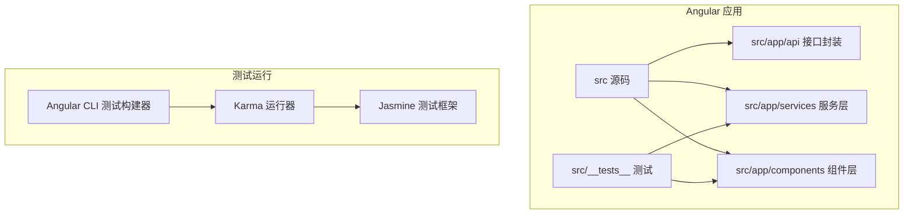
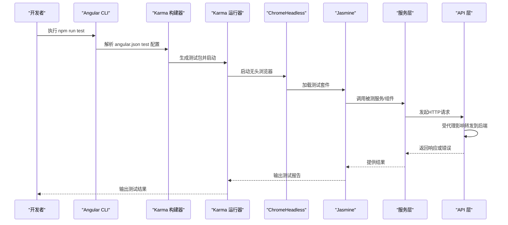
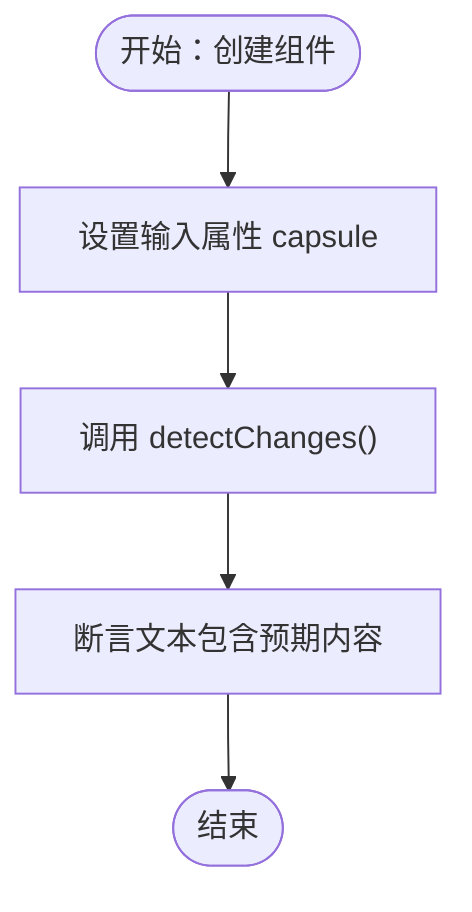
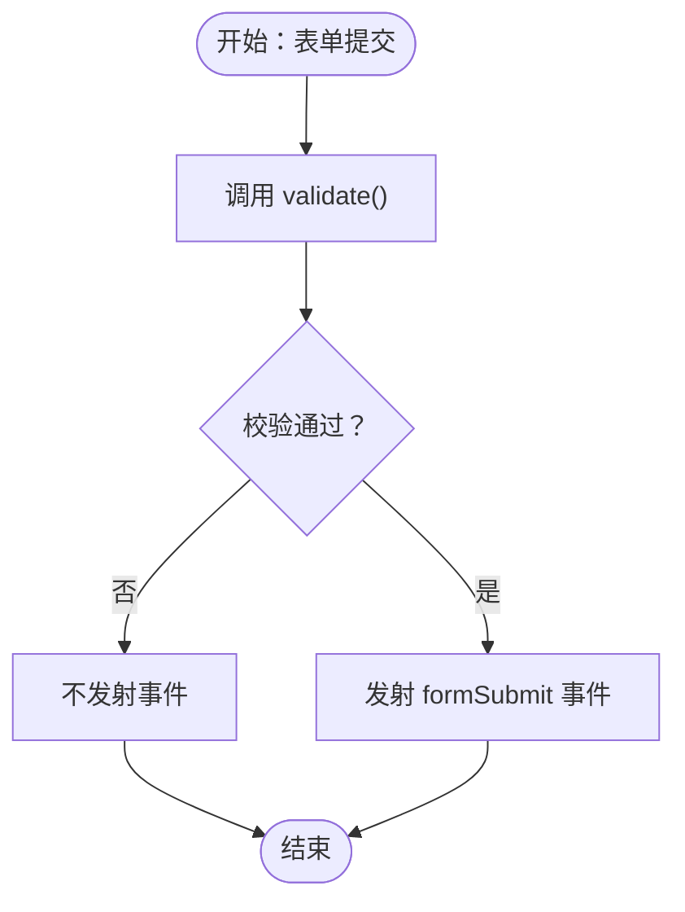
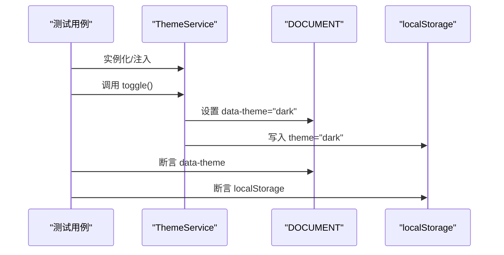
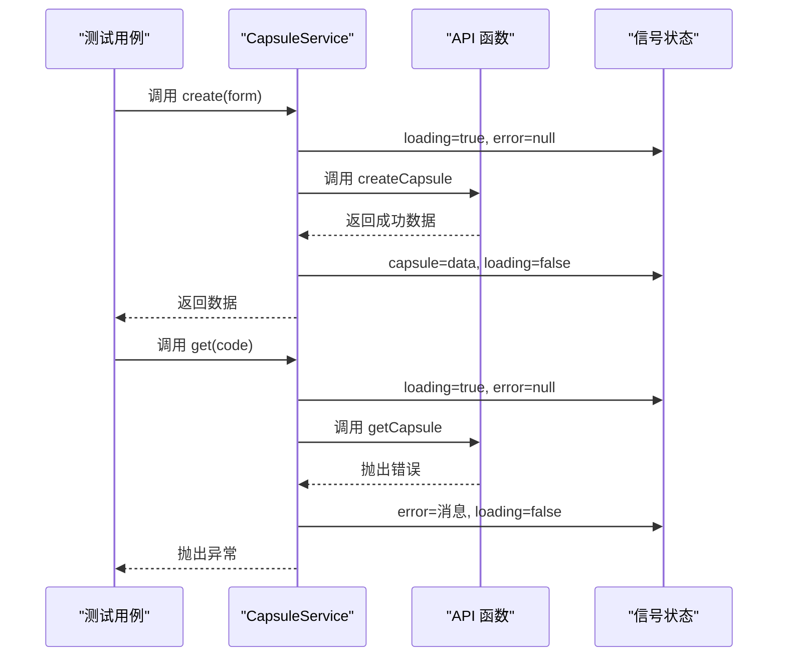
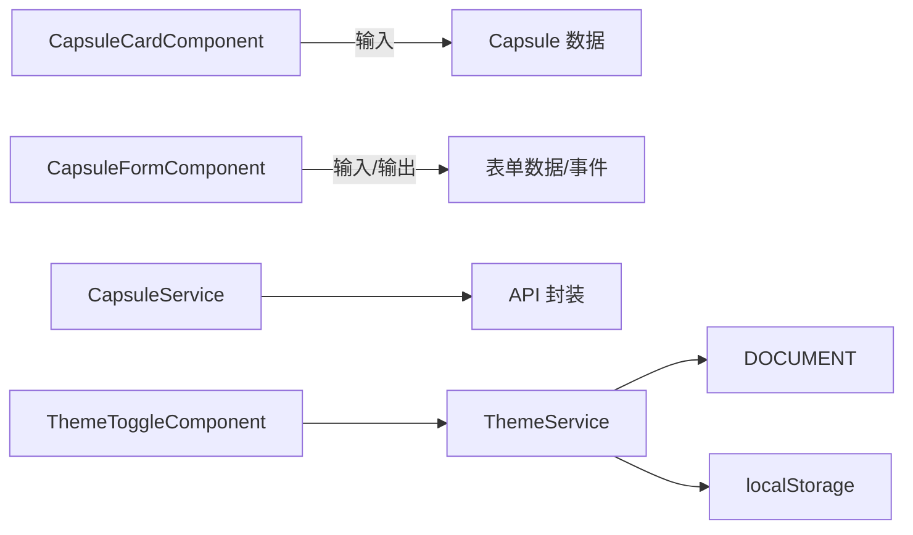

# 测试与调试

<cite>
**本文引用的文件**
- [package.json](file://frontends/angular-ts/package.json)
- [angular.json](file://frontends/angular-ts/angular.json)
- [tsconfig.spec.json](file://frontends/angular-ts/tsconfig.spec.json)
- [proxy.conf.json](file://frontends/angular-ts/proxy.conf.json)
- [capsule-card.component.spec.ts](file://frontends/angular-ts/src/__tests__/components/capsule-card.component.spec.ts)
- [capsule-form.component.spec.ts](file://frontends/angular-ts/src/__tests__/components/capsule-form.component.spec.ts)
- [theme.service.spec.ts](file://frontends/angular-ts/src/__tests__/services/theme.service.spec.ts)
- [capsule.service.spec.ts](file://frontends/angular-ts/src/__tests__/services/capsule.service.spec.ts)
- [capsule.service.ts](file://frontends/angular-ts/src/app/services/capsule.service.ts)
- [theme.service.ts](file://frontends/angular-ts/src/app/services/theme.service.ts)
- [capsule-card.component.ts](file://frontends/angular-ts/src/app/components/capsule-card/capsule-card.component.ts)
- [capsule-form.component.ts](file://frontends/angular-ts/src/app/components/capsule-form/capsule-form.component.ts)
- [theme-toggle.component.ts](file://frontends/angular-ts/src/app/components/theme-toggle/theme-toggle.component.ts)
- [api/index.ts](file://frontends/angular-ts/src/app/api/index.ts)
- [test.sh](file://scripts/test.sh)
</cite>

## 目录
1. [简介](#简介)
2. [项目结构](#项目结构)
3. [核心组件](#核心组件)
4. [架构总览](#架构总览)
5. [详细组件分析](#详细组件分析)
6. [依赖分析](#依赖分析)
7. [性能考虑](#性能考虑)
8. [故障排查指南](#故障排查指南)
9. [结论](#结论)
10. [附录](#附录)

## 简介
本文件面向Angular前端工程（位于 frontends/angular-ts），系统性梳理测试与调试策略与实践，覆盖单元测试、集成测试与端到端测试的思路；详解Jasmine/Karma在本项目中的配置与使用；总结组件与服务测试最佳实践；给出调试技巧与生产环境调试策略；提供性能测试与内存泄漏检测方法；并说明如何在持续集成中自动化执行测试。

## 项目结构
Angular前端采用Standalone组件风格，测试文件统一放置于 src/__tests__ 下，按功能模块分层组织（components、services）。测试运行由Angular CLI的Karma构建器驱动，配置集中在angular.json的“test”目标中；Jasmine类型声明与编译选项由tsconfig.spec.json管理；开发代理通过proxy.conf.json指向后端服务。

图表来源
- [angular.json:79-100](file://frontends/angular-ts/angular.json#L79-L100)
- [tsconfig.spec.json:1-25](file://frontends/angular-ts/tsconfig.spec.json#L1-L25)

章节来源
- [angular.json:1-108](file://frontends/angular-ts/angular.json#L1-L108)
- [tsconfig.spec.json:1-25](file://frontends/angular-ts/tsconfig.spec.json#L1-L25)
- [proxy.conf.json:1-8](file://frontends/angular-ts/proxy.conf.json#L1-L8)

## 核心组件
- 测试运行器与框架
  - Angular CLI测试构建器：负责编译测试代码、加载polyfills与样式、启动Karma。
  - Karma：浏览器内测试执行与覆盖率收集。
  - Jasmine：断言与测试套件语法。
- 测试配置
  - tsconfig.spec.json：启用Jasmine类型、设置ES2022目标与模块、包含*.spec.ts与*.ts。
  - angular.json test目标：配置polyfills（含zone.js/testing）、样式、资源与tsconfig。
  - package.json脚本：提供headless模式运行测试的命令。
- 代理与集成
  - proxy.conf.json：将/api前缀转发至本地后端，便于服务层HTTP测试。

章节来源
- [package.json:5-10](file://frontends/angular-ts/package.json#L5-L10)
- [angular.json:79-100](file://frontends/angular-ts/angular.json#L79-L100)
- [tsconfig.spec.json:1-25](file://frontends/angular-ts/tsconfig.spec.json#L1-L25)
- [proxy.conf.json:1-8](file://frontends/angular-ts/proxy.conf.json#L1-L8)

## 架构总览
下图展示测试生命周期：从CLI脚本触发，经Angular测试构建器生成测试包，Karma在ChromeHeadless中执行，Jasmine运行测试用例，同时调用API层进行HTTP交互（受代理影响）。

图表来源
- [package.json:8-9](file://frontends/angular-ts/package.json#L8-L9)
- [angular.json:79-100](file://frontends/angular-ts/angular.json#L79-L100)
- [api/index.ts:1-71](file://frontends/angular-ts/src/app/api/index.ts#L1-L71)
- [proxy.conf.json:1-8](file://frontends/angular-ts/proxy.conf.json#L1-L8)

## 详细组件分析

### 组件测试：CapsuleCardComponent
- 测试要点
  - 渲染验证：校验标题、创建者、胶囊码显示。
  - 条件渲染：根据opened状态决定是否显示内容与提示文案。
  - 时间格式化与剩余时间计算：验证格式化函数与剩余时间文本。
- 最佳实践
  - 使用TestBed.configureTestingModule导入组件，避免外部依赖。
  - 通过fixture.detectChanges触发生命周期，再断言DOM文本。
  - 使用fixture.nativeElement.textContent进行整体文本断言，确保渲染正确。

图表来源
- [capsule-card.component.spec.ts:28-68](file://frontends/angular-ts/src/__tests__/components/capsule-card.component.spec.ts#L28-L68)
- [capsule-card.component.ts:14-36](file://frontends/angular-ts/src/app/components/capsule-card/capsule-card.component.ts#L14-L36)

章节来源
- [capsule-card.component.spec.ts:1-69](file://frontends/angular-ts/src/__tests__/components/capsule-card.component.spec.ts#L1-L69)
- [capsule-card.component.ts:1-37](file://frontends/angular-ts/src/app/components/capsule-card/capsule-card.component.ts#L1-L37)

### 组件测试：CapsuleFormComponent
- 测试要点
  - 表单校验：空字段、过去时间等边界条件。
  - 事件发射：校验通过时发射formSubmit事件，否则不发射。
  - 最小可选时间：minDateTime基于本地时间截断，确保UI一致性。
- 最佳实践
  - 在beforeEach中创建组件实例并首次检测变更。
  - 使用spyOn监听输出事件，验证参数与调用次数。
  - 对日期比较使用严格的时间戳对比，避免时区差异导致的误判。

图表来源
- [capsule-form.component.spec.ts:8-72](file://frontends/angular-ts/src/__tests__/components/capsule-form.component.spec.ts#L8-L72)
- [capsule-form.component.ts:36-66](file://frontends/angular-ts/src/app/components/capsule-form/capsule-form.component.ts#L36-L66)

章节来源
- [capsule-form.component.spec.ts:1-73](file://frontends/angular-ts/src/__tests__/components/capsule-form.component.spec.ts#L1-L73)
- [capsule-form.component.ts:1-68](file://frontends/angular-ts/src/app/components/capsule-form/capsule-form.component.ts#L1-L68)

### 服务测试：ThemeService（主题切换）
- 测试要点
  - 默认主题：无localStorage时默认浅色。
  - 切换行为：toggle在浅/深之间循环。
  - DOM属性同步：effect将data-theme写入documentElement。
  - 本地存储持久化：切换后写入localStorage。
- 最佳实践
  - 使用TestBed.flushEffects确保effect副作用立即执行。
  - 注入DOCUMENT以断言DOM属性。
  - 使用beforeEach清理localStorage，保证测试隔离。

图表来源
- [theme.service.spec.ts:9-42](file://frontends/angular-ts/src/__tests__/services/theme.service.spec.ts#L9-L42)
- [theme.service.ts:16-26](file://frontends/angular-ts/src/app/services/theme.service.ts#L16-L26)

章节来源
- [theme.service.spec.ts:1-43](file://frontends/angular-ts/src/__tests__/services/theme.service.spec.ts#L1-L43)
- [theme.service.ts:1-28](file://frontends/angular-ts/src/app/services/theme.service.ts#L1-L28)

### 服务测试：CapsuleService（HTTP服务）
- 测试要点
  - 初始化状态：capsule为null、loading为false、error为null。
  - 创建胶囊：成功时更新信号值，失败时设置错误并抛出异常。
  - 查询胶囊：成功时更新信号值，失败时设置错误并抛出异常。
  - 异步与错误处理：使用spyOn模拟API，验证finally块对loading的复位。
- 最佳实践
  - 通过spyOn拦截API函数，避免真实HTTP请求。
  - 使用expectAsync断言异步函数抛错。
  - 断言loading在try/catch/finally各阶段的状态变化。

图表来源
- [capsule.service.spec.ts:18-78](file://frontends/angular-ts/src/__tests__/services/capsule.service.spec.ts#L18-L78)
- [capsule.service.ts:11-39](file://frontends/angular-ts/src/app/services/capsule.service.ts#L11-L39)
- [api/index.ts:29-41](file://frontends/angular-ts/src/app/api/index.ts#L29-L41)

章节来源
- [capsule.service.spec.ts:1-79](file://frontends/angular-ts/src/__tests__/services/capsule.service.spec.ts#L1-L79)
- [capsule.service.ts:1-41](file://frontends/angular-ts/src/app/services/capsule.service.ts#L1-L41)
- [api/index.ts:1-71](file://frontends/angular-ts/src/app/api/index.ts#L1-L71)

### 依赖注入与组件交互测试
- ThemeToggleComponent与ThemeService
  - 组件通过inject注入ThemeService，测试时无需mock，直接验证交互。
  - 通过切换服务状态，验证组件模板中主题状态的呈现。

章节来源
- [theme-toggle.component.ts:1-14](file://frontends/angular-ts/src/app/components/theme-toggle/theme-toggle.component.ts#L1-L14)
- [theme.service.ts:10-26](file://frontends/angular-ts/src/app/services/theme.service.ts#L10-L26)

## 依赖分析
- 组件与服务关系
  - CapsuleCardComponent与CapsuleFormComponent为纯展示型组件，依赖输入输出与本地逻辑。
  - CapsuleService与ThemeService为可注入服务，前者依赖API封装，后者依赖DOCUMENT与localStorage。
- 测试耦合度
  - 组件测试仅依赖自身与输入数据，耦合度低。
  - 服务测试通过spyOn隔离API层，降低对外部HTTP的耦合。
- 关键依赖链
  - 组件 -> 输入数据/模板
  - 服务 -> API封装 -> fetch -> 后端
  - 主题服务 -> DOCUMENT -> localStorage

图表来源
- [capsule-card.component.ts:11-36](file://frontends/angular-ts/src/app/components/capsule-card/capsule-card.component.ts#L11-L36)
- [capsule-form.component.ts:12-66](file://frontends/angular-ts/src/app/components/capsule-form/capsule-form.component.ts#L12-L66)
- [capsule.service.ts:6-39](file://frontends/angular-ts/src/app/services/capsule.service.ts#L6-L39)
- [theme.service.ts:7-26](file://frontends/angular-ts/src/app/services/theme.service.ts#L7-L26)
- [theme-toggle.component.ts:11-13](file://frontends/angular-ts/src/app/components/theme-toggle/theme-toggle.component.ts#L11-L13)

## 性能考虑
- 单元测试性能
  - 使用spyOn替代真实HTTP请求，减少I/O开销。
  - 避免在测试中执行不必要的DOM查询，优先使用fixture.debugElement或textContent断言。
- 测试运行优化
  - 使用ChromeHeadless提升CI稳定性与速度。
  - 在本地开发中可使用watch模式快速反馈。
- 内存泄漏检测
  - 避免在测试中订阅Observable后未取消，确保在afterEach中清理。
  - 对effect类服务（如ThemeService）注意副作用的执行时机与清理。

## 故障排查指南
- 测试无法启动或浏览器无响应
  - 检查ChromeHeadless可用性与版本兼容。
  - 确认angular.json test目标的polyfills包含zone.js/testing。
- HTTP请求失败或跨域
  - 检查proxy.conf.json是否正确映射/api到后端地址。
  - 确保后端服务已启动且可访问。
- DOM断言不稳定
  - 使用fixture.detectChanges后再断言。
  - 避免对动态生成的文本做精确匹配，优先断言关键文案片段。
- 异步测试未捕获错误
  - 使用expectAsync断言Promise抛错。
  - 确保finally块正确复位loading状态。

章节来源
- [angular.json:79-100](file://frontends/angular-ts/angular.json#L79-L100)
- [proxy.conf.json:1-8](file://frontends/angular-ts/proxy.conf.json#L1-8)
- [capsule.service.spec.ts:46-57](file://frontends/angular-ts/src/__tests__/services/capsule.service.spec.ts#L46-L57)

## 结论
本项目采用清晰的Standalone组件与信号式服务设计，测试文件按功能模块组织，配合Jasmine/Karma在ChromeHeadless环境下高效运行。通过spyOn隔离外部依赖、使用flushEffects处理副作用、以及合理的代理配置，实现了高可靠性的单元与集成测试。建议在CI中统一执行测试脚本，并结合覆盖率报告持续改进测试质量。

## 附录
- 持续集成中的测试自动化
  - 仓库根目录提供统一测试脚本，按顺序运行后端与前后端测试，便于CI流水线集成。
  - Angular测试脚本已在package.json中配置headless模式，适合在CI容器中稳定运行。

章节来源
- [test.sh:25-30](file://scripts/test.sh#L25-L30)
- [package.json:8-9](file://frontends/angular-ts/package.json#L8-L9)