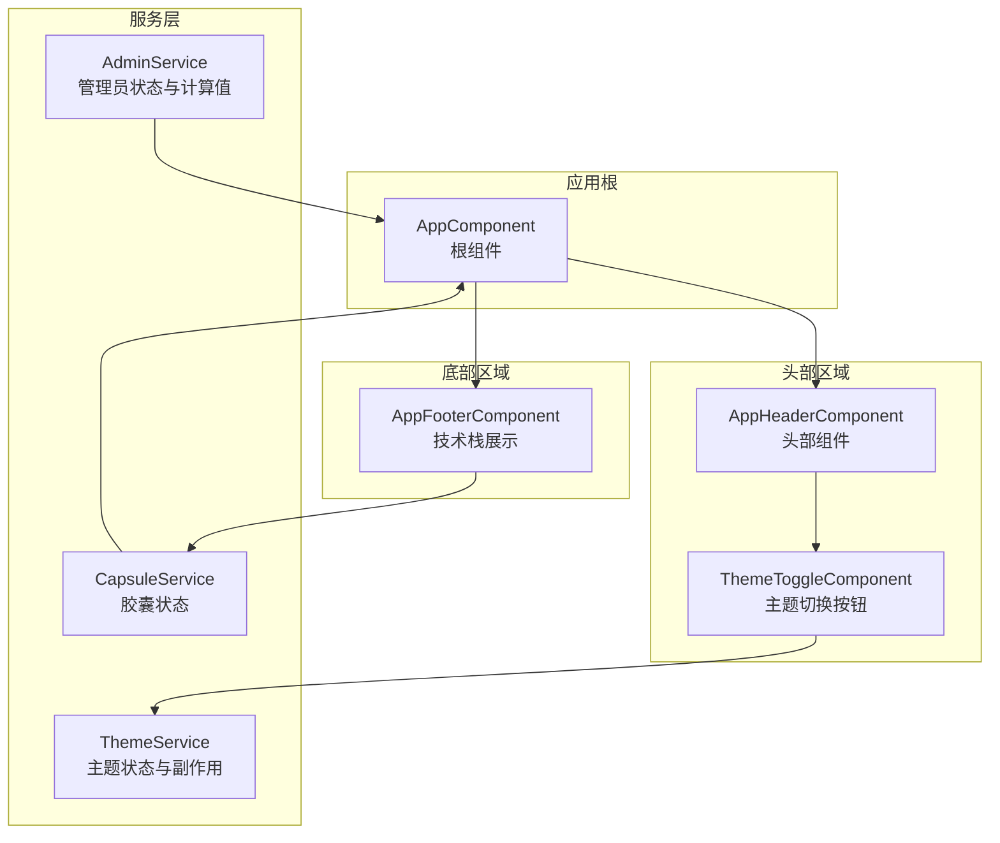
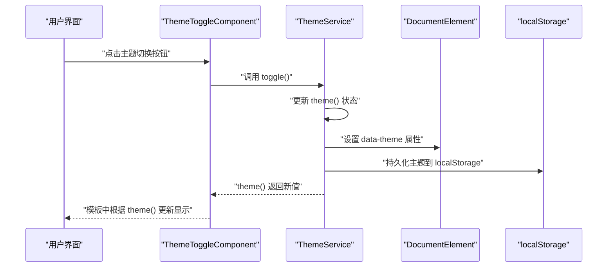
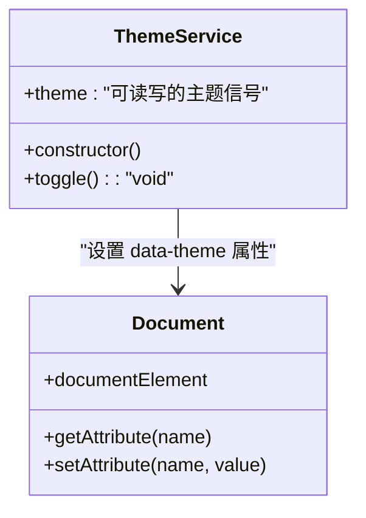
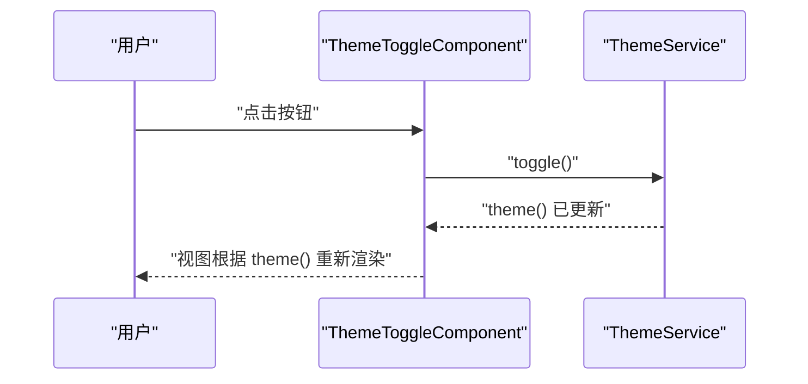
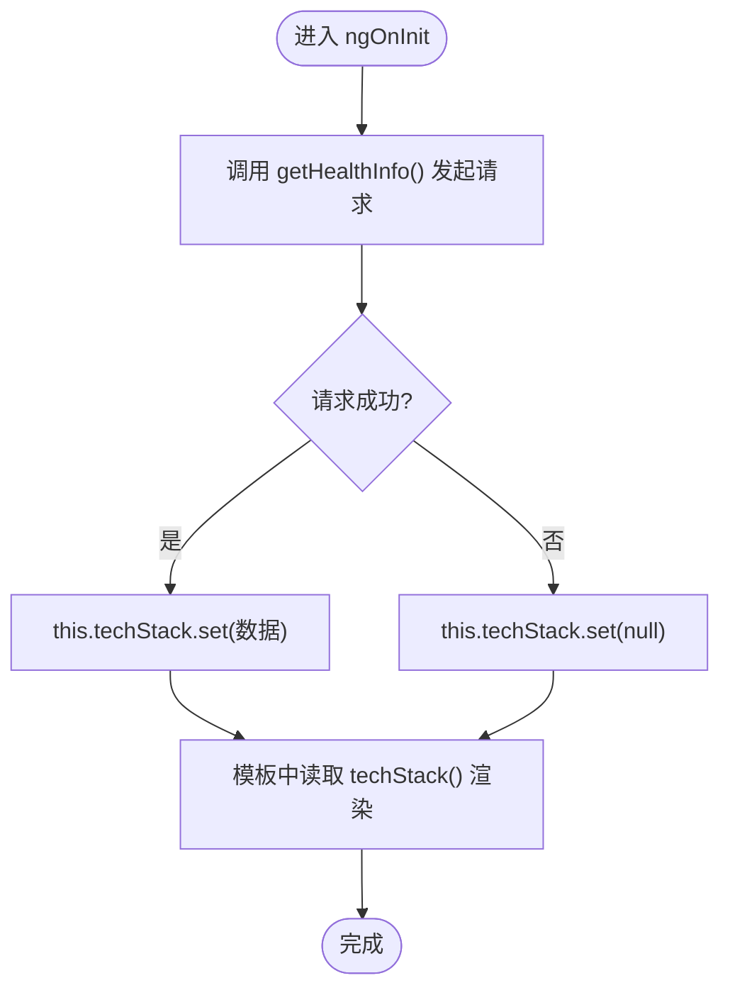
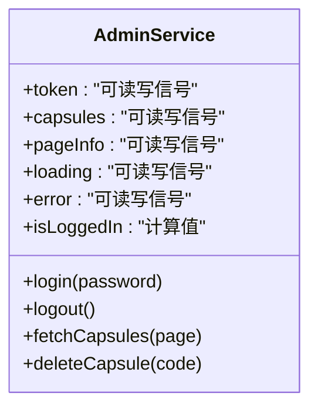
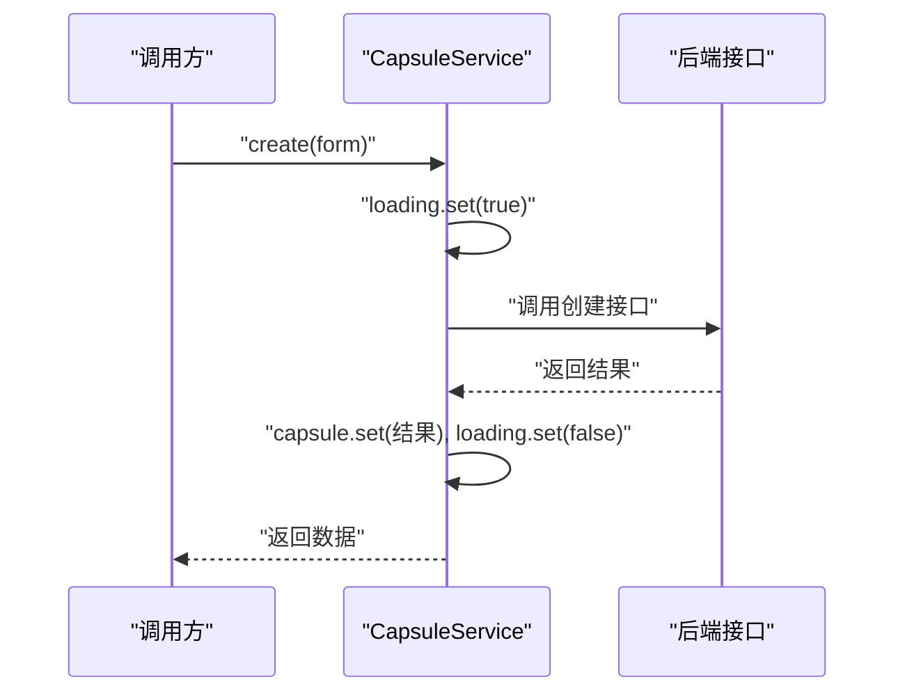
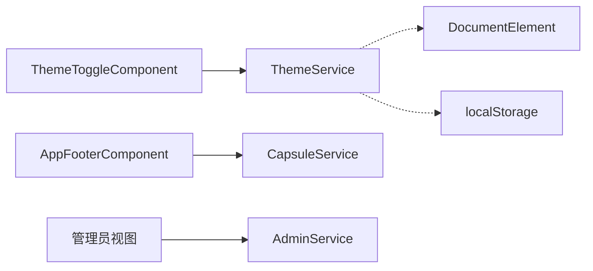

# Signals状态管理

<cite>
**本文档引用的文件**
- [theme.service.ts](file://frontends/angular-ts/src/app/services/theme.service.ts)
- [theme-toggle.component.ts](file://frontends/angular-ts/src/app/components/theme-toggle/theme-toggle.component.ts)
- [theme-toggle.component.html](file://frontends/angular-ts/src/app/components/theme-toggle/theme-toggle.component.html)
- [app-footer.component.ts](file://frontends/angular-ts/src/app/components/app-footer/app-footer.component.ts)
- [app-footer.component.html](file://frontends/angular-ts/src/app/components/app-footer/app-footer.component.html)
- [admin.service.ts](file://frontends/angular-ts/src/app/services/admin.service.ts)
- [capsule.service.ts](file://frontends/angular-ts/src/app/services/capsule.service.ts)
- [theme.service.spec.ts](file://frontends/angular-ts/src/__tests__/services/theme.service.spec.ts)
- [app-header.component.ts](file://frontends/angular-ts/src/app/components/app-header/app-header.component.ts)
- [app.component.ts](file://frontends/angular-ts/src/app/app.component.ts)
</cite>

## 目录
1. [简介](#简介)
2. [项目结构](#项目结构)
3. [核心组件](#核心组件)
4. [架构总览](#架构总览)
5. [详细组件分析](#详细组件分析)
6. [依赖关系分析](#依赖关系分析)
7. [性能考量](#性能考量)
8. [故障排除指南](#故障排除指南)
9. [结论](#结论)
10. [附录](#附录)

## 简介
本文件系统性阐述 Angular Signals 在本项目中的状态管理模式与实践，重点覆盖以下方面：
- Signal 的概念与三大核心 API：signal()、computed()、effect()
- 响应式特性：自动依赖追踪、最小化更新、副作用管理
- 与传统 RxJS Observable 的区别与优势
- ThemeService 中的完整应用案例：状态初始化、更新机制、副作用处理
- 组件间通信与状态共享策略
- 性能优化建议与调试技巧

## 项目结构
本项目前端采用 Angular 单页面应用架构，Signals 主要用于服务层的状态管理与组件层的局部状态。关键位置如下：
- 服务层：ThemeService、AdminService、CapsuleService
- 组件层：AppHeader、AppFooter、ThemeToggle 等
- 根组件：AppComponent

图表来源
- [app.component.ts:1-14](file://frontends/angular-ts/src/app/app.component.ts#L1-L14)
- [app-header.component.ts:1-13](file://frontends/angular-ts/src/app/components/app-header/app-header.component.ts#L1-L13)
- [theme-toggle.component.ts:1-14](file://frontends/angular-ts/src/app/components/theme-toggle/theme-toggle.component.ts#L1-L14)
- [theme.service.ts:1-28](file://frontends/angular-ts/src/app/services/theme.service.ts#L1-L28)
- [admin.service.ts:1-84](file://frontends/angular-ts/src/app/services/admin.service.ts#L1-L84)
- [capsule.service.ts:1-41](file://frontends/angular-ts/src/app/services/capsule.service.ts#L1-L41)
- [app-footer.component.ts:1-21](file://frontends/angular-ts/src/app/components/app-footer/app-footer.component.ts#L1-L21)

章节来源
- [app.component.ts:1-14](file://frontends/angular-ts/src/app/app.component.ts#L1-L14)
- [app-header.component.ts:1-13](file://frontends/angular-ts/src/app/components/app-header/app-header.component.ts#L1-L13)
- [theme-toggle.component.ts:1-14](file://frontends/angular-ts/src/app/components/theme-toggle/theme-toggle.component.ts#L1-L14)
- [theme.service.ts:1-28](file://frontends/angular-ts/src/app/services/theme.service.ts#L1-L28)
- [admin.service.ts:1-84](file://frontends/angular-ts/src/app/services/admin.service.ts#L1-L84)
- [capsule.service.ts:1-41](file://frontends/angular-ts/src/app/services/capsule.service.ts#L1-L41)
- [app-footer.component.ts:1-21](file://frontends/angular-ts/src/app/components/app-footer/app-footer.component.ts#L1-L21)

## 核心组件
本节聚焦于 Signals 的三大 API 及其在项目中的应用。

- signal()：创建可变状态，支持 set()、update()、patch() 等写入操作；用于服务层与组件层的状态存储。
- computed()：基于其他信号派生出只读计算值，自动依赖追踪，仅在依赖变化时重新计算。
- effect()：执行副作用逻辑，监听信号变化并触发相应动作，如 DOM 属性设置、本地存储持久化等。

章节来源
- [theme.service.ts:10-26](file://frontends/angular-ts/src/app/services/theme.service.ts#L10-L26)
- [admin.service.ts:25](file://frontends/angular-ts/src/app/services/admin.service.ts#L25)
- [app-footer.component.ts:13](file://frontends/angular-ts/src/app/components/app-footer/app-footer.component.ts#L13)

## 架构总览
下图展示了 Signals 在应用中的整体交互：组件通过注入服务访问信号，服务内部使用 signal()/computed()/effect() 实现状态管理与副作用处理，最终驱动视图更新。

图表来源
- [theme-toggle.component.ts:12](file://frontends/angular-ts/src/app/components/theme-toggle/theme-toggle.component.ts#L12)
- [theme-toggle.component.html:3-12](file://frontends/angular-ts/src/app/components/theme-toggle/theme-toggle.component.html#L3-L12)
- [theme.service.ts:17-26](file://frontends/angular-ts/src/app/services/theme.service.ts#L17-L26)

## 详细组件分析

### ThemeService：主题状态与副作用
ThemeService 是 Signals 的典型应用范例，演示了：
- 状态初始化：从 localStorage 读取主题，若无则默认亮色模式
- 状态更新：toggle() 使用 update() 切换主题
- 副作用处理：effect() 同步更新 documentElement 的 data-theme 属性，并持久化到 localStorage

图表来源
- [theme.service.ts:6-27](file://frontends/angular-ts/src/app/services/theme.service.ts#L6-L27)

章节来源
- [theme.service.ts:10-26](file://frontends/angular-ts/src/app/services/theme.service.ts#L10-L26)
- [theme.service.spec.ts:16-41](file://frontends/angular-ts/src/__tests__/services/theme.service.spec.ts#L16-L41)

### ThemeToggleComponent：组件消费信号
ThemeToggleComponent 注入 ThemeService，在模板中直接读取 theme() 并绑定点击事件，体现 Signals 的简洁易用。

图表来源
- [theme-toggle.component.ts:12](file://frontends/angular-ts/src/app/components/theme-toggle/theme-toggle.component.ts#L12)
- [theme-toggle.component.html:3-12](file://frontends/angular-ts/src/app/components/theme-toggle/theme-toggle.component.html#L3-L12)
- [theme.service.ts:24-26](file://frontends/angular-ts/src/app/services/theme.service.ts#L24-L26)

章节来源
- [theme-toggle.component.ts:1-14](file://frontends/angular-ts/src/app/components/theme-toggle/theme-toggle.component.ts#L1-L14)
- [theme-toggle.component.html:1-13](file://frontends/angular-ts/src/app/components/theme-toggle/theme-toggle.component.html#L1-L13)

### AppFooterComponent：异步数据与信号
AppFooterComponent 使用 signal() 存储技术栈信息，通过生命周期钩子发起异步请求并设置信号值，展示 Signals 在组件内状态管理的应用。

图表来源
- [app-footer.component.ts:13-19](file://frontends/angular-ts/src/app/components/app-footer/app-footer.component.ts#L13-L19)
- [app-footer.component.html:6](file://frontends/angular-ts/src/app/components/app-footer/app-footer.component.html#L6)

章节来源
- [app-footer.component.ts:1-21](file://frontends/angular-ts/src/app/components/app-footer/app-footer.component.ts#L1-L21)
- [app-footer.component.html:1-11](file://frontends/angular-ts/src/app/components/app-footer/app-footer.component.html#L1-L11)

### AdminService：计算值与复杂状态
AdminService 展示了 Signals 在复杂业务场景中的综合运用：
- 多个 signal() 管理 token、列表、分页、加载与错误状态
- computed() 派生只读计算值（如 isLoggedIn），减少重复判断
- effect() 可用于持久化 token 到 sessionStorage（当前实现中通过手动 setItem）

图表来源
- [admin.service.ts:8-25](file://frontends/angular-ts/src/app/services/admin.service.ts#L8-L25)
- [admin.service.ts:27-82](file://frontends/angular-ts/src/app/services/admin.service.ts#L27-L82)

章节来源
- [admin.service.ts:1-84](file://frontends/angular-ts/src/app/services/admin.service.ts#L1-L84)

### CapsuleService：简单状态与异步流程
CapsuleService 使用三个信号分别管理当前胶囊、加载与错误状态，配合异步方法完成创建与获取流程，体现 Signals 在轻量状态管理中的优势。

图表来源
- [capsule.service.ts:11-24](file://frontends/angular-ts/src/app/services/capsule.service.ts#L11-L24)

章节来源
- [capsule.service.ts:1-41](file://frontends/angular-ts/src/app/services/capsule.service.ts#L1-L41)

## 依赖关系分析
- 组件对服务的依赖：ThemeToggleComponent 依赖 ThemeService；AppFooterComponent 依赖 API 获取数据并更新自身信号
- 服务之间的独立性：ThemeService、AdminService、CapsuleService 各自管理不同域的状态，避免交叉污染
- 副作用边界：ThemeService 的 effect() 仅作用于 DOM 属性与本地存储，职责单一

图表来源
- [theme-toggle.component.ts:12](file://frontends/angular-ts/src/app/components/theme-toggle/theme-toggle.component.ts#L12)
- [theme.service.ts:17-26](file://frontends/angular-ts/src/app/services/theme.service.ts#L17-L26)
- [app-footer.component.ts:13-19](file://frontends/angular-ts/src/app/components/app-footer/app-footer.component.ts#L13-L19)
- [admin.service.ts:8-25](file://frontends/angular-ts/src/app/services/admin.service.ts#L8-L25)

章节来源
- [theme-toggle.component.ts:1-14](file://frontends/angular-ts/src/app/components/theme-toggle/theme-toggle.component.ts#L1-L14)
- [theme.service.ts:1-28](file://frontends/angular-ts/src/app/services/theme.service.ts#L1-L28)
- [app-footer.component.ts:1-21](file://frontends/angular-ts/src/app/components/app-footer/app-footer.component.ts#L1-L21)
- [admin.service.ts:1-84](file://frontends/angular-ts/src/app/services/admin.service.ts#L1-L84)

## 性能考量
- 自动依赖追踪：Signals 仅在实际依赖的信号发生变化时触发重算，避免不必要的视图更新
- 最小化更新：effect() 通常只做必要副作用，避免在模板中进行复杂计算
- 计算值复用：computed() 将稳定不变的派生逻辑封装为只读值，减少重复计算
- 避免过度拆分：将相关状态聚合在单个服务中，降低跨服务通信成本
- 调试友好：effect() 可通过 flushEffects() 在测试中同步执行，便于断言

## 故障排除指南
- 测试中 effect 不生效：确保在测试中调用 flushEffects() 以同步执行副作用
- 主题未持久化：确认 localStorage 可用且 effect() 正常执行
- 视图不更新：检查是否在模板中正确读取信号（如 theme()），或在组件中正确设置信号值
- 异步状态未清理：在 finally 分支中重置 loading 状态，避免 UI 锁定

章节来源
- [theme.service.spec.ts:33-41](file://frontends/angular-ts/src/__tests__/services/theme.service.spec.ts#L33-L41)

## 结论
本项目通过 ThemeService、AdminService、CapsuleService 与若干组件，完整展示了 Angular Signals 在现代前端应用中的状态管理模式。Signals 以简洁的 API 提供强大的响应式能力，结合 effect() 的副作用控制与 computed() 的计算值抽象，使状态管理更直观、可维护性更高。与 RxJS Observable 相比，Signals 更贴近函数式思维，无需订阅/取消订阅，天然具备更好的可读性与可测试性。

## 附录

### Signal 与 RxJS Observable 的区别与优势
- 订阅模型：Observable 需要订阅与取消订阅；Signals 通过自动依赖追踪实现“按需”更新
- 副作用处理：Observable 通过 pipe/subscribe 执行副作用；Signals 通过 effect() 明确声明副作用
- 计算值：Observable 需要手动组合；Signals 通过 computed() 自动缓存与重算
- 调试体验：Signals 在测试中可通过 flushEffects() 同步执行副作用，便于断言

### 组件间通信与状态共享策略
- 单向数据流：通过服务集中管理状态，组件仅负责展示与触发动作
- 共享服务：ThemeService、AdminService、CapsuleService 作为全局状态容器
- 局部状态：组件内使用 signal() 管理临时状态，避免污染全局服务