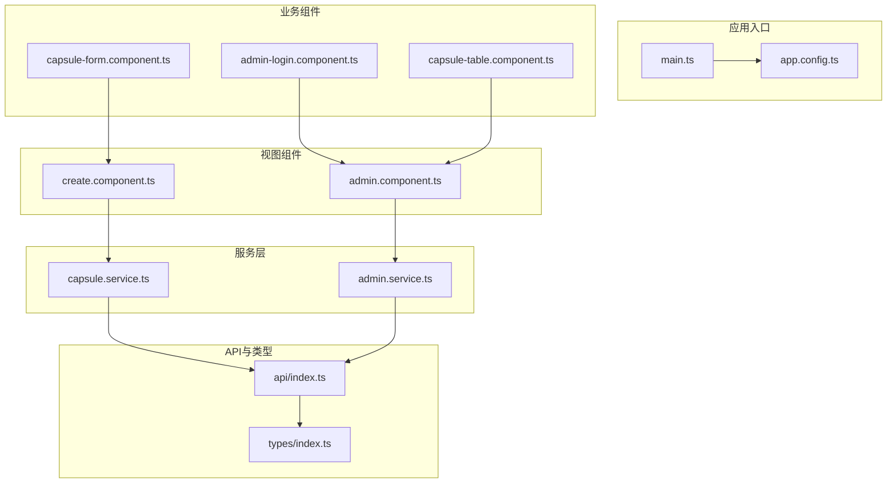
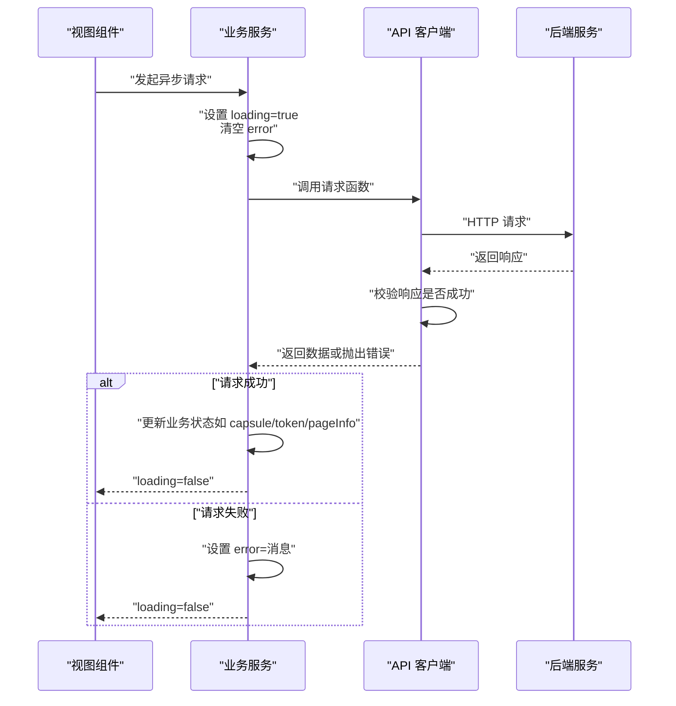
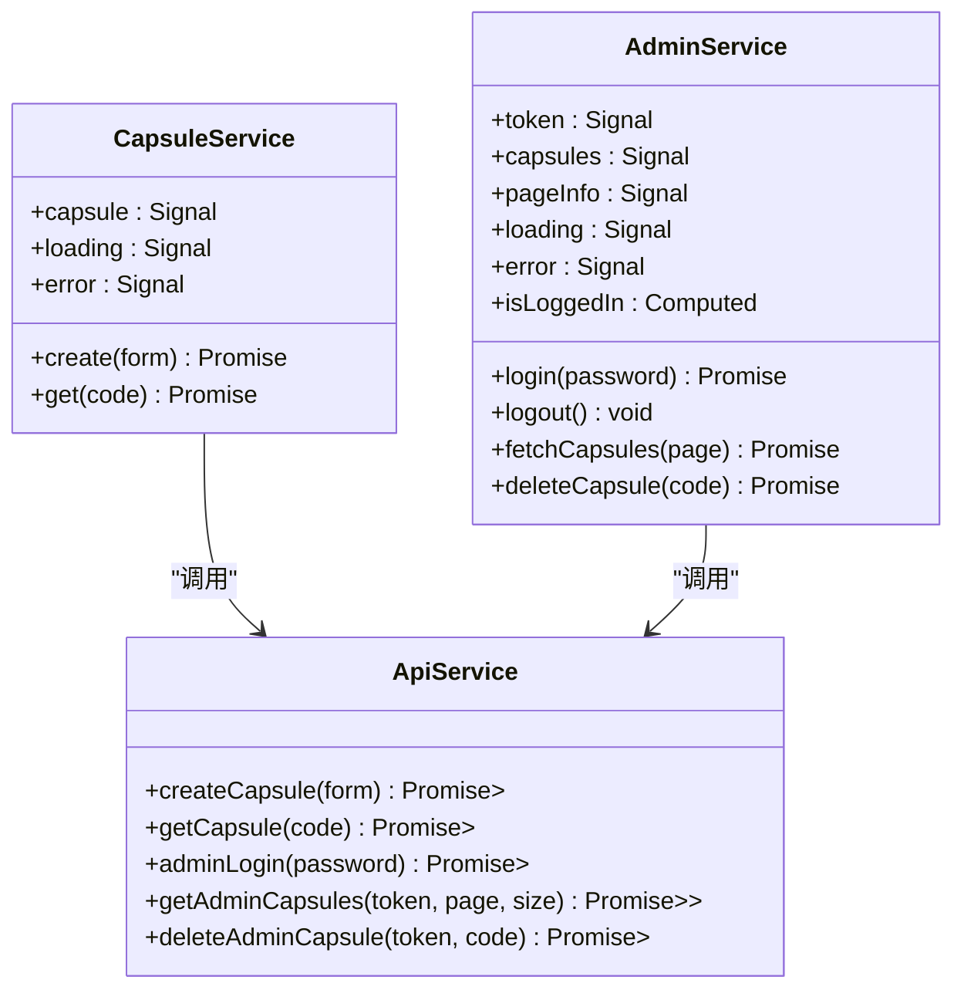
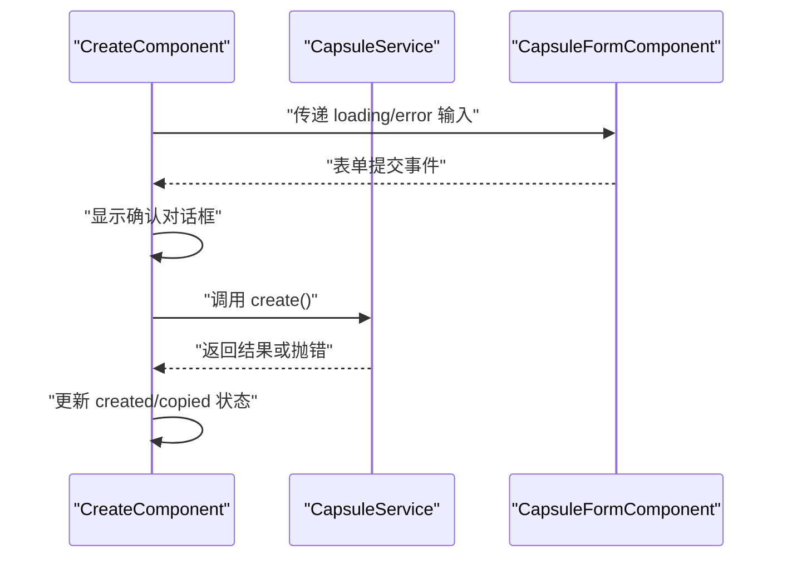
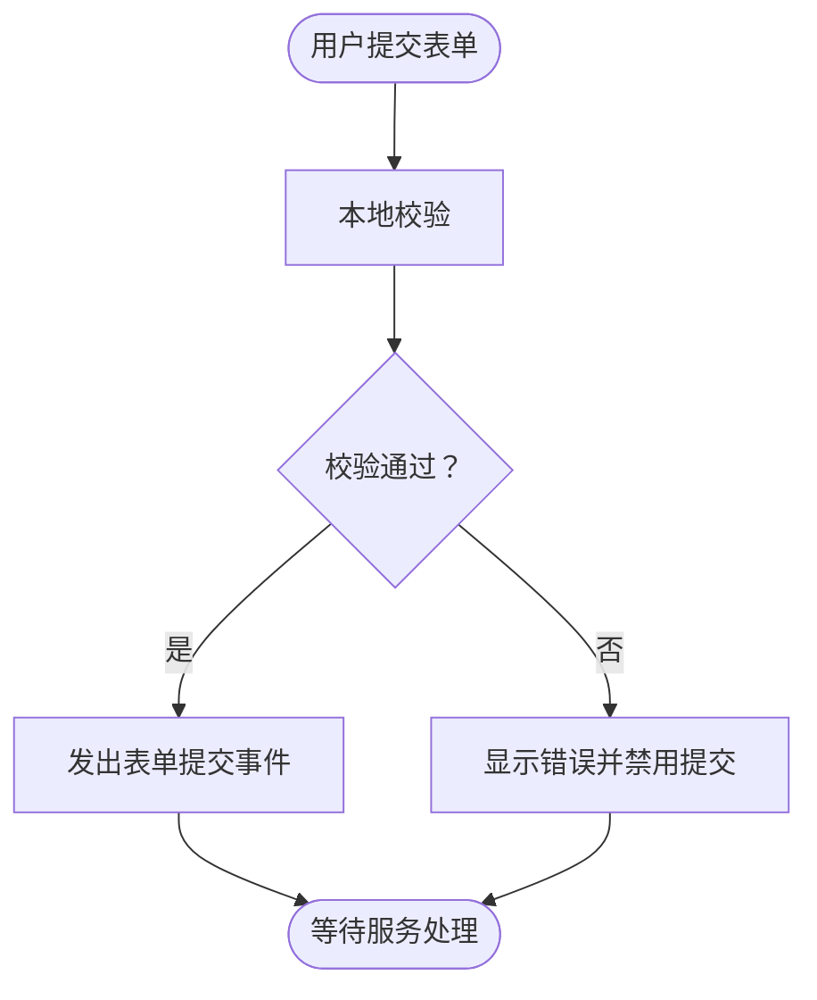
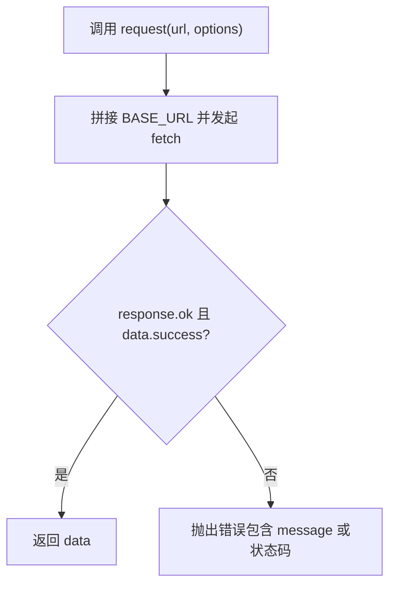
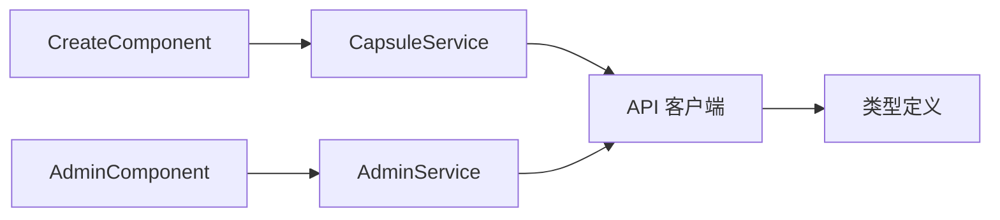

# 异步状态处理

<cite>
**本文引用的文件**
- [frontends/angular-ts/src/app/services/capsule.service.ts](file://frontends/angular-ts/src/app/services/capsule.service.ts)
- [frontends/angular-ts/src/app/services/admin.service.ts](file://frontends/angular-ts/src/app/services/admin.service.ts)
- [frontends/angular-ts/src/app/api/index.ts](file://frontends/angular-ts/src/app/api/index.ts)
- [frontends/angular-ts/src/app/types/index.ts](file://frontends/angular-ts/src/app/types/index.ts)
- [frontends/angular-ts/src/app/views/create/create.component.ts](file://frontends/angular-ts/src/app/views/create/create.component.ts)
- [frontends/angular-ts/src/app/views/admin/admin.component.ts](file://frontends/angular-ts/src/app/views/admin/admin.component.ts)
- [frontends/angular-ts/src/app/components/capsule-form/capsule-form.component.ts](file://frontends/angular-ts/src/app/components/capsule-form/capsule-form.component.ts)
- [frontends/angular-ts/src/app/components/admin-login/admin-login.component.ts](file://frontends/angular-ts/src/app/components/admin-login/admin-login.component.ts)
- [frontends/angular-ts/src/app/components/capsule-table/capsule-table.component.ts](file://frontends/angular-ts/src/app/components/capsule-table/capsule-table.component.ts)
- [frontends/angular-ts/src/app/components/capsule-form/capsule-form.component.html](file://frontends/angular-ts/src/app/components/capsule-form/capsule-form.component.html)
- [frontends/angular-ts/src/app/components/admin-login/admin-login.component.html](file://frontends/angular-ts/src/app/components/admin-login/admin-login.component.html)
- [frontends/angular-ts/src/app/views/create/create.component.html](file://frontends/angular-ts/src/app/views/create/create.component.html)
- [frontends/angular-ts/src/app/views/admin/admin.component.html](file://frontends/angular-ts/src/app/views/admin/admin.component.html)
- [frontends/angular-ts/src/app/app.config.ts](file://frontends/angular-ts/src/app/app.config.ts)
- [frontends/angular-ts/src/main.ts](file://frontends/angular-ts/src/main.ts)
</cite>

## 目录
1. [引言](#引言)
2. [项目结构](#项目结构)
3. [核心组件](#核心组件)
4. [架构总览](#架构总览)
5. [详细组件分析](#详细组件分析)
6. [依赖关系分析](#依赖关系分析)
7. [性能考量](#性能考量)
8. [故障排查指南](#故障排查指南)
9. [结论](#结论)
10. [附录](#附录)

## 引言
本文件聚焦于 Angular 异步状态处理的最佳实践，结合前端工程中的实际实现，系统阐述以下主题：
- Observable 与 Promise 在状态管理中的应用与差异
- HTTP 请求的状态管理：加载、成功、错误三态模式
- async 管道的使用与最佳实践
- 错误处理策略：捕获、恢复、用户友好提示
- API 服务中的异步状态管理案例：请求调度、状态缓存、重试机制
- 异步状态与组件生命周期的协调及内存泄漏防护
- 性能优化与调试技巧

## 项目结构
该 Angular 工程采用功能域划分的组织方式，围绕“时间胶囊”业务场景，将服务、组件、API 客户端与类型定义清晰分离：
- 服务层：封装业务状态与异步流程（如创建、查询、管理员登录与分页）
- 组件层：负责视图渲染与用户交互，订阅服务信号以驱动 UI
- API 层：统一请求封装与响应校验
- 类型层：前后端一致的数据契约

图表来源
- [frontends/angular-ts/src/main.ts:1-7](file://frontends/angular-ts/src/main.ts#L1-L7)
- [frontends/angular-ts/src/app/app.config.ts:1-14](file://frontends/angular-ts/src/app/app.config.ts#L1-L14)
- [frontends/angular-ts/src/app/views/create/create.component.ts:1-54](file://frontends/angular-ts/src/app/views/create/create.component.ts#L1-L54)
- [frontends/angular-ts/src/app/views/admin/admin.component.ts:1-45](file://frontends/angular-ts/src/app/views/admin/admin.component.ts#L1-L45)
- [frontends/angular-ts/src/app/components/capsule-form/capsule-form.component.ts:1-68](file://frontends/angular-ts/src/app/components/capsule-form/capsule-form.component.ts#L1-L68)
- [frontends/angular-ts/src/app/components/admin-login/admin-login.component.ts:1-24](file://frontends/angular-ts/src/app/components/admin-login/admin-login.component.ts#L1-L24)
- [frontends/angular-ts/src/app/components/capsule-table/capsule-table.component.ts:1-37](file://frontends/angular-ts/src/app/components/capsule-table/capsule-table.component.ts#L1-L37)
- [frontends/angular-ts/src/app/services/capsule.service.ts:1-41](file://frontends/angular-ts/src/app/services/capsule.service.ts#L1-L41)
- [frontends/angular-ts/src/app/services/admin.service.ts:1-84](file://frontends/angular-ts/src/app/services/admin.service.ts#L1-L84)
- [frontends/angular-ts/src/app/api/index.ts:1-71](file://frontends/angular-ts/src/app/api/index.ts#L1-L71)
- [frontends/angular-ts/src/app/types/index.ts:1-53](file://frontends/angular-ts/src/app/types/index.ts#L1-L53)

章节来源
- [frontends/angular-ts/src/main.ts:1-7](file://frontends/angular-ts/src/main.ts#L1-L7)
- [frontends/angular-ts/src/app/app.config.ts:1-14](file://frontends/angular-ts/src/app/app.config.ts#L1-L14)

## 核心组件
本项目通过信号（signal）与异步方法（async/await）构建了简洁而可维护的异步状态管理：
- 服务层使用 signal 暴露只读状态：加载中、错误信息、业务数据
- 视图组件通过输入属性或直接订阅服务信号，驱动 UI 行为
- API 层统一进行响应校验与错误抛出，保证上层一致性

关键要点
- 加载状态：在发起请求前设置 loading 为 true；在 finally 中统一置为 false
- 成功状态：在 try 分支中更新业务数据（如 capsule、token、分页信息）
- 错误状态：在 catch 分支设置 error，并向上抛出异常供调用方处理
- 与组件生命周期协调：在组件初始化时触发必要的数据拉取；在销毁前避免悬挂订阅

章节来源
- [frontends/angular-ts/src/app/services/capsule.service.ts:1-41](file://frontends/angular-ts/src/app/services/capsule.service.ts#L1-L41)
- [frontends/angular-ts/src/app/services/admin.service.ts:1-84](file://frontends/angular-ts/src/app/services/admin.service.ts#L1-L84)

## 架构总览
下图展示了从视图到服务再到 API 的完整异步调用链路，以及状态在各层之间的流转。

图表来源
- [frontends/angular-ts/src/app/views/create/create.component.ts:27-42](file://frontends/angular-ts/src/app/views/create/create.component.ts#L27-L42)
- [frontends/angular-ts/src/app/views/admin/admin.component.ts:26-33](file://frontends/angular-ts/src/app/views/admin/admin.component.ts#L26-L33)
- [frontends/angular-ts/src/app/services/capsule.service.ts:11-24](file://frontends/angular-ts/src/app/services/capsule.service.ts#L11-L24)
- [frontends/angular-ts/src/app/services/admin.service.ts:27-40](file://frontends/angular-ts/src/app/services/admin.service.ts#L27-L40)
- [frontends/angular-ts/src/app/api/index.ts:10-27](file://frontends/angular-ts/src/app/api/index.ts#L10-L27)

## 详细组件分析

### 服务层：异步状态管理
- CapsuleService：封装创建与查询的异步流程，暴露 capsule、loading、error 三个只读信号
- AdminService：封装管理员登录、登出、分页查询与删除的异步流程，暴露 token、capsules、pageInfo、loading、error 与 isLoggedIn 计算信号

图表来源
- [frontends/angular-ts/src/app/services/capsule.service.ts:1-41](file://frontends/angular-ts/src/app/services/capsule.service.ts#L1-L41)
- [frontends/angular-ts/src/app/services/admin.service.ts:1-84](file://frontends/angular-ts/src/app/services/admin.service.ts#L1-L84)
- [frontends/angular-ts/src/app/api/index.ts:29-67](file://frontends/angular-ts/src/app/api/index.ts#L29-L67)

章节来源
- [frontends/angular-ts/src/app/services/capsule.service.ts:1-41](file://frontends/angular-ts/src/app/services/capsule.service.ts#L1-L41)
- [frontends/angular-ts/src/app/services/admin.service.ts:1-84](file://frontends/angular-ts/src/app/services/admin.service.ts#L1-L84)

### 视图层：状态驱动的 UI
- CreateComponent：订阅服务的 loading 与 error，弹出确认对话框后执行创建；成功后展示结果并支持复制 code
- AdminComponent：在初始化时根据登录状态决定是否拉取数据；登录成功后刷新列表；删除前弹出确认

图表来源
- [frontends/angular-ts/src/app/views/create/create.component.ts:16-54](file://frontends/angular-ts/src/app/views/create/create.component.ts#L16-L54)
- [frontends/angular-ts/src/app/components/capsule-form/capsule-form.component.ts:12-68](file://frontends/angular-ts/src/app/components/capsule-form/capsule-form.component.ts#L12-L68)
- [frontends/angular-ts/src/app/services/capsule.service.ts:11-24](file://frontends/angular-ts/src/app/services/capsule.service.ts#L11-L24)

章节来源
- [frontends/angular-ts/src/app/views/create/create.component.ts:1-54](file://frontends/angular-ts/src/app/views/create/create.component.ts#L1-L54)
- [frontends/angular-ts/src/app/views/admin/admin.component.ts:1-45](file://frontends/angular-ts/src/app/views/admin/admin.component.ts#L1-L45)

### 组件层：表单与表格
- CapsuleFormComponent：本地表单校验，将验证结果与 loading 状态传入模板，禁用提交按钮
- AdminLoginComponent：接收 loading 与 error 输入，触发登录事件
- CapsuleTableComponent：接收分页数据与 loading，提供展开详情、翻页与删除事件

图表来源
- [frontends/angular-ts/src/app/components/capsule-form/capsule-form.component.ts:36-66](file://frontends/angular-ts/src/app/components/capsule-form/capsule-form.component.ts#L36-L66)
- [frontends/angular-ts/src/app/components/capsule-form/capsule-form.component.html:1-72](file://frontends/angular-ts/src/app/components/capsule-form/capsule-form.component.html#L1-L72)
- [frontends/angular-ts/src/app/components/admin-login/admin-login.component.ts:11-23](file://frontends/angular-ts/src/app/components/admin-login/admin-login.component.ts#L11-L23)
- [frontends/angular-ts/src/app/components/admin-login/admin-login.component.html:1-28](file://frontends/angular-ts/src/app/components/admin-login/admin-login.component.html#L1-L28)

章节来源
- [frontends/angular-ts/src/app/components/capsule-form/capsule-form.component.ts:1-68](file://frontends/angular-ts/src/app/components/capsule-form/capsule-form.component.ts#L1-L68)
- [frontends/angular-ts/src/app/components/admin-login/admin-login.component.ts:1-24](file://frontends/angular-ts/src/app/components/admin-login/admin-login.component.ts#L1-L24)
- [frontends/angular-ts/src/app/components/capsule-table/capsule-table.component.ts:1-37](file://frontends/angular-ts/src/app/components/capsule-table/capsule-table.component.ts#L1-L37)

### API 层：统一请求与错误处理
- request 函数：封装 fetch 调用，统一设置 Content-Type，解析 JSON，并在非 OK 或失败响应时抛出错误
- 各业务请求函数：封装具体端点、方法与认证头，返回 Promise<ApiResponse<T>>

图表来源
- [frontends/angular-ts/src/app/api/index.ts:10-27](file://frontends/angular-ts/src/app/api/index.ts#L10-L27)

章节来源
- [frontends/angular-ts/src/app/api/index.ts:1-71](file://frontends/angular-ts/src/app/api/index.ts#L1-L71)
- [frontends/angular-ts/src/app/types/index.ts:23-28](file://frontends/angular-ts/src/app/types/index.ts#L23-L28)

## 依赖关系分析
- 服务依赖 API：服务通过 API 函数发起网络请求，API 再依赖基础 URL 与通用请求封装
- 组件依赖服务：视图组件注入服务，订阅其信号以驱动 UI
- 类型定义贯穿：types/index.ts 提供前后端一致的数据契约

图表来源
- [frontends/angular-ts/src/app/views/create/create.component.ts:16-20](file://frontends/angular-ts/src/app/views/create/create.component.ts#L16-L20)
- [frontends/angular-ts/src/app/views/admin/admin.component.ts:15-16](file://frontends/angular-ts/src/app/views/admin/admin.component.ts#L15-L16)
- [frontends/angular-ts/src/app/services/capsule.service.ts:1-3](file://frontends/angular-ts/src/app/services/capsule.service.ts#L1-L3)
- [frontends/angular-ts/src/app/services/admin.service.ts:1-3](file://frontends/angular-ts/src/app/services/admin.service.ts#L1-L3)
- [frontends/angular-ts/src/app/api/index.ts:1-8](file://frontends/angular-ts/src/app/api/index.ts#L1-L8)
- [frontends/angular-ts/src/app/types/index.ts:1-53](file://frontends/angular-ts/src/app/types/index.ts#L1-L53)

章节来源
- [frontends/angular-ts/src/app/views/create/create.component.ts:1-54](file://frontends/angular-ts/src/app/views/create/create.component.ts#L1-L54)
- [frontends/angular-ts/src/app/views/admin/admin.component.ts:1-45](file://frontends/angular-ts/src/app/views/admin/admin.component.ts#L1-L45)
- [frontends/angular-ts/src/app/services/capsule.service.ts:1-41](file://frontends/angular-ts/src/app/services/capsule.service.ts#L1-L41)
- [frontends/angular-ts/src/app/services/admin.service.ts:1-84](file://frontends/angular-ts/src/app/services/admin.service.ts#L1-L84)
- [frontends/angular-ts/src/app/api/index.ts:1-71](file://frontends/angular-ts/src/app/api/index.ts#L1-L71)
- [frontends/angular-ts/src/app/types/index.ts:1-53](file://frontends/angular-ts/src/app/types/index.ts#L1-L53)

## 性能考量
- 避免不必要的重绘：使用 signal 的细粒度更新，仅在状态变化时触发变更检测
- 控制并发请求：在服务中集中管理 loading 状态，防止重复提交
- 分页与缓存：AdminService 使用 pageInfo 缓存分页元信息，减少重复计算
- 懒加载与延迟初始化：在组件 ngOnInit 中按需触发数据拉取
- 资源释放：确保在组件销毁时取消订阅或清理定时器（本项目主要使用信号，无需显式取消订阅）

## 故障排查指南
- 错误捕获与提示
  - 服务层在 catch 分支设置 error，并抛出异常，便于上层统一处理
  - 组件层通过输入属性接收 error，模板中条件渲染错误文本
- 错误恢复
  - 登录失败后，error 清空可通过重新输入密码恢复
  - 列表查询失败后，refresh 事件可触发重新拉取
- 用户友好提示
  - 模板中根据 loading 状态显示“加载中...”文案与禁用按钮
  - 表单组件在字段无效时即时反馈错误信息
- 调试技巧
  - 在服务方法的 try/catch 区间添加日志，定位失败原因
  - 使用浏览器开发者工具 Network 面板检查请求与响应
  - 在组件模板中临时输出服务信号值，确认状态流是否符合预期

章节来源
- [frontends/angular-ts/src/app/services/capsule.service.ts:18-23](file://frontends/angular-ts/src/app/services/capsule.service.ts#L18-L23)
- [frontends/angular-ts/src/app/services/admin.service.ts:34-39](file://frontends/angular-ts/src/app/services/admin.service.ts#L34-L39)
- [frontends/angular-ts/src/app/components/capsule-form/capsule-form.component.html:13-15](file://frontends/angular-ts/src/app/components/capsule-form/capsule-form.component.html#L13-L15)
- [frontends/angular-ts/src/app/components/admin-login/admin-login.component.html:16-18](file://frontends/angular-ts/src/app/components/admin-login/admin-login.component.html#L16-L18)

## 结论
本项目通过信号与 async/await 实现了清晰、可维护的异步状态管理：
- 服务层集中处理加载、成功、错误三态，组件层专注 UI 呈现
- API 层统一请求封装与错误抛出，保证上层一致性
- 通过输入输出属性与模板指令，实现状态到视图的自然映射
- 在生命周期与资源管理方面，遵循 Angular 最佳实践，降低内存泄漏风险

## 附录

### Observable vs Promise 在状态管理中的应用与区别
- Promise
  - 一次性、不可取消；适合单次请求场景
  - 与 async/await 协同，语法简洁，易于理解
  - 适用于本项目的服务方法与 API 请求封装
- Observable
  - 可取消、可组合；适合需要多播、重放、重试、取消等高级能力的场景
  - 与 RxJS operator（如 retry、debounceTime、switchMap）配合，可实现更复杂的异步编排
  - 若引入 HttpClient 的 Observable 流，可在服务层进行更精细的控制（如节流、去抖、错误重试）

### HTTP 请求的状态管理：加载、成功、错误处理模式
- 加载状态：请求开始设置 loading=true，结束在 finally 中置为 false
- 成功状态：在 try 分支中更新业务数据（如 capsule、token、pageInfo）
- 错误状态：在 catch 分支设置 error，并向上抛出异常供调用方处理

### async 管道的使用与最佳实践
- 在模板中使用 async 管道订阅可观察对象（如 Observable），自动完成订阅与取消
- 对于信号（signal），通常直接在模板中访问其值；若需要 Observable 形态，可将其转换为 Observable
- 最佳实践
  - 优先使用信号进行本地状态管理
  - 对外部库或需要组合操作的场景考虑 Observable
  - 避免在模板中直接执行副作用（如发起请求），将副作用保留在组件类中

### API 服务中的异步状态管理案例
- 请求调度：服务方法集中发起请求，统一设置 loading 与 error
- 状态缓存：AdminService 缓存分页元信息，减少重复计算
- 重试机制：可基于 RxJS 的 retry 或 retryWhen 实现指数退避重试（建议在引入 Observable 后扩展）

### 异步状态与组件生命周期的协调与内存泄漏防护
- 在 ngOnInit 中触发必要的数据拉取
- 使用信号而非手动订阅，避免忘记取消订阅导致的内存泄漏
- 在组件销毁前，确保没有悬挂的定时器或长连接