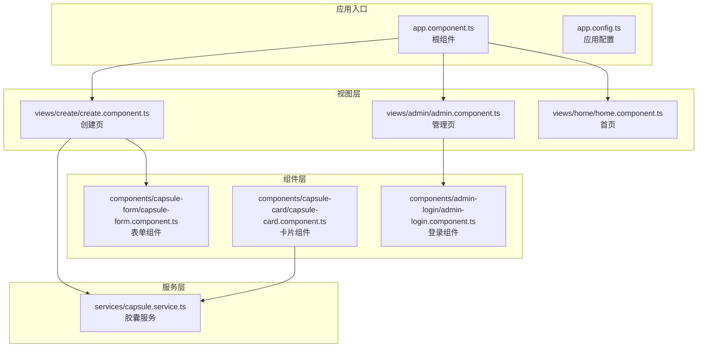
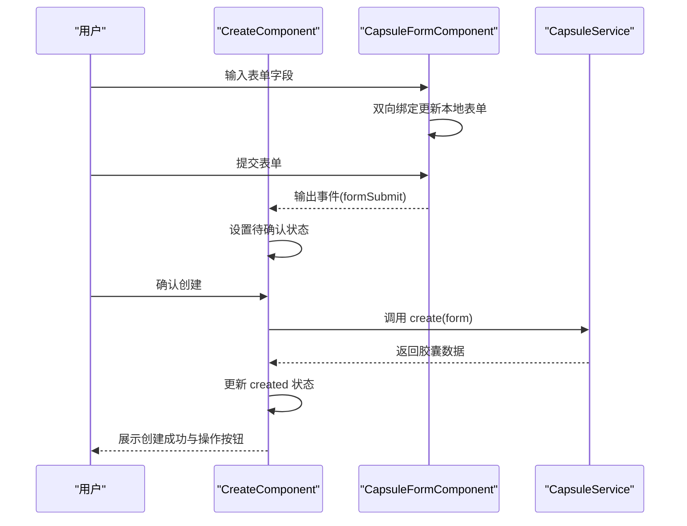
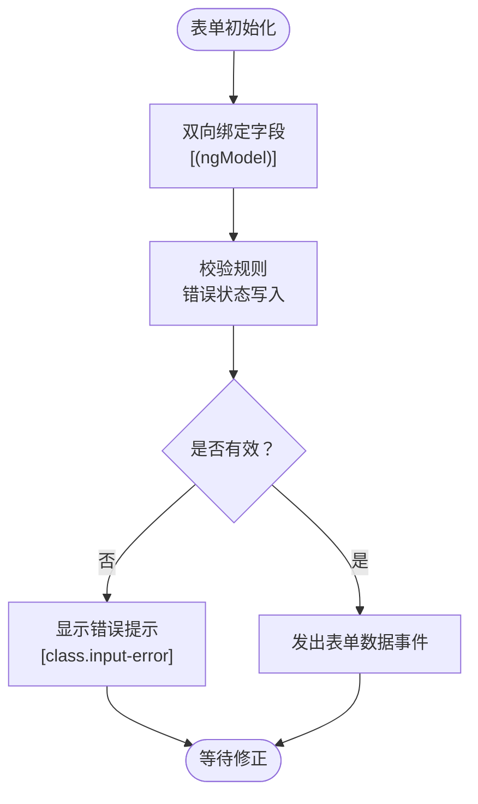
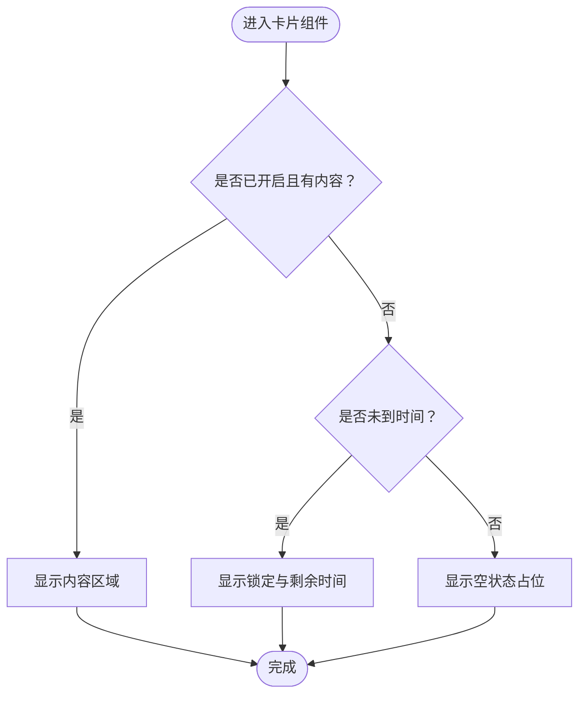
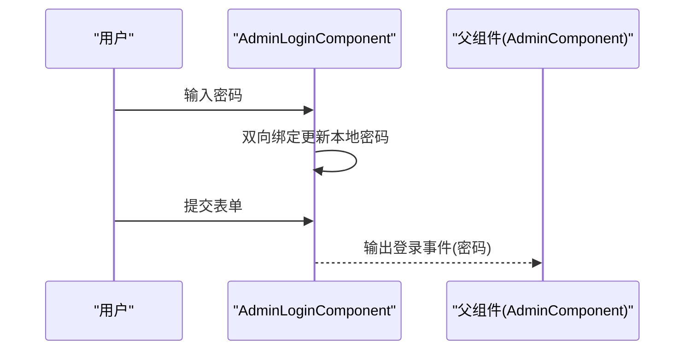
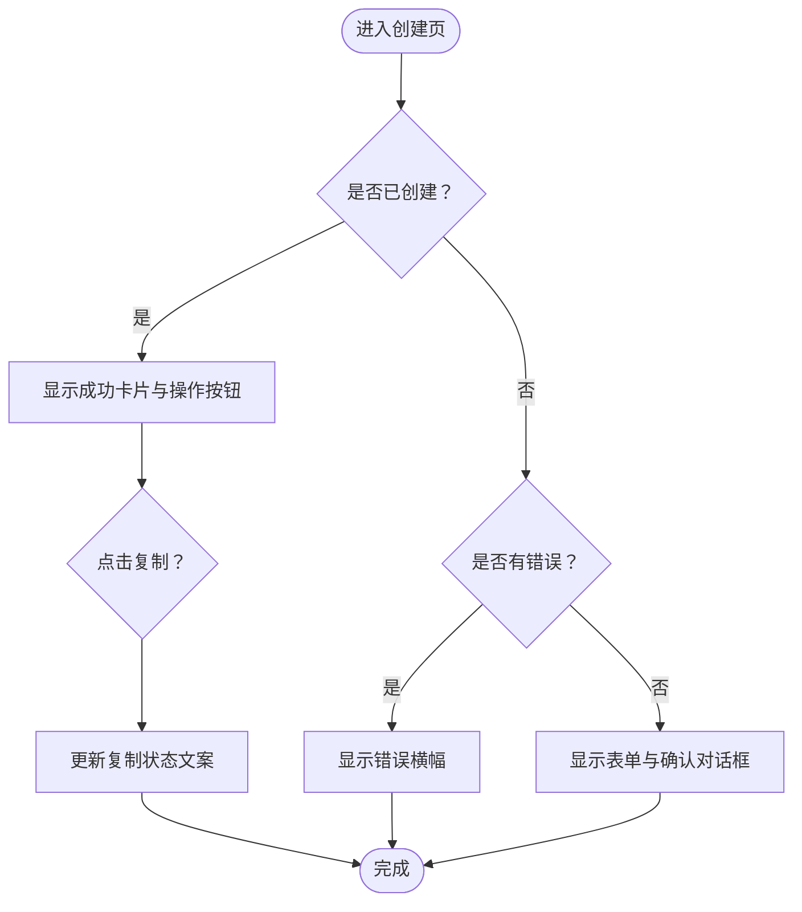
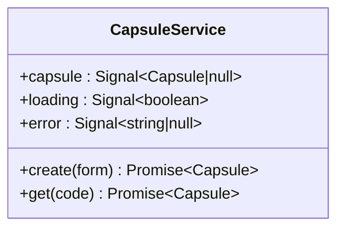
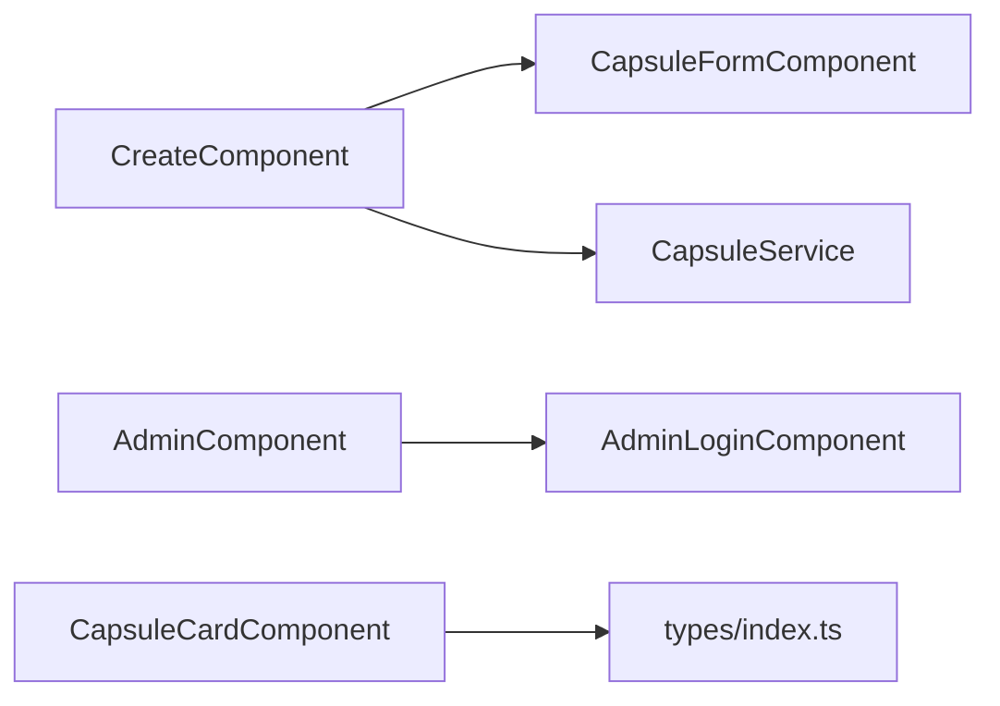

# 数据绑定机制

<cite>
**本文引用的文件**
- [frontends/angular-ts/src/app/app.component.ts](file://frontends/angular-ts/src/app/app.component.ts)
- [frontends/angular-ts/src/app/app.config.ts](file://frontends/angular-ts/src/app/app.config.ts)
- [frontends/angular-ts/src/app/components/capsule-form/capsule-form.component.ts](file://frontends/angular-ts/src/app/components/capsule-form/capsule-form.component.ts)
- [frontends/angular-ts/src/app/components/capsule-form/capsule-form.component.html](file://frontends/angular-ts/src/app/components/capsule-form/capsule-form.component.html)
- [frontends/angular-ts/src/app/components/capsule-card/capsule-card.component.ts](file://frontends/angular-ts/src/app/components/capsule-card/capsule-card.component.ts)
- [frontends/angular-ts/src/app/components/capsule-card/capsule-card.component.html](file://frontends/angular-ts/src/app/components/capsule-card/capsule-card.component.html)
- [frontends/angular-ts/src/app/components/admin-login/admin-login.component.ts](file://frontends/angular-ts/src/app/components/admin-login/admin-login.component.ts)
- [frontends/angular-ts/src/app/components/admin-login/admin-login.component.html](file://frontends/angular-ts/src/app/components/admin-login/admin-login.component.html)
- [frontends/angular-ts/src/app/views/create/create.component.ts](file://frontends/angular-ts/src/app/views/create/create.component.ts)
- [frontends/angular-ts/src/app/views/create/create.component.html](file://frontends/angular-ts/src/app/views/create/create.component.html)
- [frontends/angular-ts/src/app/views/admin/admin.component.ts](file://frontends/angular-ts/src/app/views/admin/admin.component.ts)
- [frontends/angular-ts/src/app/services/capsule.service.ts](file://frontends/angular-ts/src/app/services/capsule.service.ts)
- [frontends/angular-ts/src/app/types/index.ts](file://frontends/angular-ts/src/app/types/index.ts)
- [frontends/angular-ts/.angular/cache/18.2.21/angular-ts/vite/deps/chunk-PR7BJRWE.js](file://frontends/angular-ts/.angular/cache/18.2.21/angular-ts/vite/deps/chunk-PR7BJRWE.js)
- [frontends/angular-ts/.angular/cache/18.2.21/angular-ts/vite/deps/chunk-2WDSK4Z4.js](file://frontends/angular-ts/.angular/cache/18.2.21/angular-ts/vite/deps/chunk-2WDSK4Z4.js)
</cite>

## 目录
1. [简介](#简介)
2. [项目结构](#项目结构)
3. [核心组件](#核心组件)
4. [架构总览](#架构总览)
5. [详细组件分析](#详细组件分析)
6. [依赖关系分析](#依赖关系分析)
7. [性能考量](#性能考量)
8. [故障排查指南](#故障排查指南)
9. [结论](#结论)
10. [附录](#附录)

## 简介
本文件系统性梳理 Angular 的数据绑定机制，结合项目中的实际实现，深入讲解四种绑定类型（属性绑定、文本绑定、双向绑定、事件绑定）以及管道绑定的原理与用法；覆盖模板表达式、内联模板与外部模板的绑定语法；解释变更检测机制（脏检查、OnPush 策略、手动触发）；并通过真实场景示例（动态属性设置、条件渲染、循环渲染）演示最佳实践与性能优化技巧。

## 项目结构
本项目采用 Angular 单体应用结构，前端位于 frontends/angular-ts，核心页面由视图组件承载，业务逻辑通过服务注入，组件之间通过输入输出属性进行通信，表单交互广泛使用双向绑定与事件绑定。

**图表来源**
- [frontends/angular-ts/src/app/app.component.ts:1-14](file://frontends/angular-ts/src/app/app.component.ts#L1-L14)
- [frontends/angular-ts/src/app/app.config.ts:1-14](file://frontends/angular-ts/src/app/app.config.ts#L1-L14)
- [frontends/angular-ts/src/app/views/create/create.component.ts:1-54](file://frontends/angular-ts/src/app/views/create/create.component.ts#L1-L54)
- [frontends/angular-ts/src/app/views/admin/admin.component.ts:1-45](file://frontends/angular-ts/src/app/views/admin/admin.component.ts#L1-L45)
- [frontends/angular-ts/src/app/components/capsule-form/capsule-form.component.ts:1-68](file://frontends/angular-ts/src/app/components/capsule-form/capsule-form.component.ts#L1-L68)
- [frontends/angular-ts/src/app/components/capsule-card/capsule-card.component.ts:1-37](file://frontends/angular-ts/src/app/components/capsule-card/capsule-card.component.ts#L1-L37)
- [frontends/angular-ts/src/app/components/admin-login/admin-login.component.ts:1-24](file://frontends/angular-ts/src/app/components/admin-login/admin-login.component.ts#L1-L24)
- [frontends/angular-ts/src/app/services/capsule.service.ts:1-41](file://frontends/angular-ts/src/app/services/capsule.service.ts#L1-L41)

**章节来源**
- [frontends/angular-ts/src/app/app.component.ts:1-14](file://frontends/angular-ts/src/app/app.component.ts#L1-L14)
- [frontends/angular-ts/src/app/app.config.ts:1-14](file://frontends/angular-ts/src/app/app.config.ts#L1-L14)

## 核心组件
- 表单组件（双向绑定与事件绑定）
  - 输入属性用于接收父组件状态，输出事件向上冒泡提交数据
  - 使用双向绑定更新本地表单模型，结合事件绑定处理提交
- 卡片组件（单向绑定与文本绑定）
  - 接收只读输入对象，模板中进行文本插值与样式类绑定
- 登录组件（双向绑定与事件绑定）
  - 双向绑定输入框，事件绑定触发登录动作
- 创建页（条件渲染与事件绑定）
  - 条件渲染“创建成功”结果或错误提示，事件绑定处理确认与复制操作
- 胶囊服务（信号与异步状态）
  - 使用信号维护加载、错误与数据状态，供组件订阅

**章节来源**
- [frontends/angular-ts/src/app/components/capsule-form/capsule-form.component.ts:1-68](file://frontends/angular-ts/src/app/components/capsule-form/capsule-form.component.ts#L1-L68)
- [frontends/angular-ts/src/app/components/capsule-card/capsule-card.component.ts:1-37](file://frontends/angular-ts/src/app/components/capsule-card/capsule-card.component.ts#L1-L37)
- [frontends/angular-ts/src/app/components/admin-login/admin-login.component.ts:1-24](file://frontends/angular-ts/src/app/components/admin-login/admin-login.component.ts#L1-L24)
- [frontends/angular-ts/src/app/views/create/create.component.ts:1-54](file://frontends/angular-ts/src/app/views/create/create.component.ts#L1-L54)
- [frontends/angular-ts/src/app/services/capsule.service.ts:1-41](file://frontends/angular-ts/src/app/services/capsule.service.ts#L1-L41)

## 架构总览
下图展示了从用户交互到服务调用再到视图更新的完整流程，体现数据在组件与服务之间的流动与绑定关系。

**图表来源**
- [frontends/angular-ts/src/app/views/create/create.component.ts:27-42](file://frontends/angular-ts/src/app/views/create/create.component.ts#L27-L42)
- [frontends/angular-ts/src/app/components/capsule-form/capsule-form.component.ts:62-66](file://frontends/angular-ts/src/app/components/capsule-form/capsule-form.component.ts#L62-L66)
- [frontends/angular-ts/src/app/services/capsule.service.ts:11-24](file://frontends/angular-ts/src/app/services/capsule.service.ts#L11-L24)

## 详细组件分析

### 组件一：表单组件（双向绑定与事件绑定）
- 功能要点
  - 双向绑定：使用 [(ngModel)] 绑定表单字段，实现输入与本地状态同步
  - 事件绑定：使用 (ngSubmit) 捕获表单提交事件，校验后通过输出事件向外发送
  - 属性绑定：使用 [class.input-error] 根据错误状态切换样式类
  - 文本绑定：使用 {{ }} 插值显示动态文案与占位符
- 典型场景
  - 动态属性设置：根据当前时间限制 datetime-local 最小值
  - 条件渲染：当存在错误信息时显示对应提示
  - 循环渲染：表单字段列表（本组件为多字段组合，可扩展为列表渲染）

**图表来源**
- [frontends/angular-ts/src/app/components/capsule-form/capsule-form.component.html:1-72](file://frontends/angular-ts/src/app/components/capsule-form/capsule-form.component.html#L1-L72)
- [frontends/angular-ts/src/app/components/capsule-form/capsule-form.component.ts:36-66](file://frontends/angular-ts/src/app/components/capsule-form/capsule-form.component.ts#L36-L66)

**章节来源**
- [frontends/angular-ts/src/app/components/capsule-form/capsule-form.component.html:1-72](file://frontends/angular-ts/src/app/components/capsule-form/capsule-form.component.html#L1-L72)
- [frontends/angular-ts/src/app/components/capsule-form/capsule-form.component.ts:1-68](file://frontends/angular-ts/src/app/components/capsule-form/capsule-form.component.ts#L1-L68)

### 组件二：卡片组件（单向绑定与文本绑定）
- 功能要点
  - 输入属性：接收胶囊对象，要求必填
  - 文本绑定：使用 {{ }} 显示标题、创建/开启时间、内容等
  - 属性绑定：根据 opened 状态切换徽标样式类
  - 条件渲染：根据是否已开启与是否存在内容决定显示内容区或锁定提示
- 典型场景
  - 动态属性设置：根据时间差计算剩余时间字符串
  - 条件渲染：未开启时显示倒计时提示

**图表来源**
- [frontends/angular-ts/src/app/components/capsule-card/capsule-card.component.html:1-32](file://frontends/angular-ts/src/app/components/capsule-card/capsule-card.component.html#L1-L32)
- [frontends/angular-ts/src/app/components/capsule-card/capsule-card.component.ts:24-35](file://frontends/angular-ts/src/app/components/capsule-card/capsule-card.component.ts#L24-L35)

**章节来源**
- [frontends/angular-ts/src/app/components/capsule-card/capsule-card.component.html:1-32](file://frontends/angular-ts/src/app/components/capsule-card/capsule-card.component.html#L1-L32)
- [frontends/angular-ts/src/app/components/capsule-card/capsule-card.component.ts:1-37](file://frontends/angular-ts/src/app/components/capsule-card/capsule-card.component.ts#L1-L37)

### 组件三：登录组件（双向绑定与事件绑定）
- 功能要点
  - 双向绑定：密码输入框使用 [(ngModel)] 绑定本地状态
  - 事件绑定：(ngSubmit) 触发登录逻辑，按钮禁用基于 loading 与输入有效性
  - 文本绑定：显示错误信息与按钮文案
- 典型场景
  - 动态属性设置：根据 loading 切换按钮文案与禁用状态
  - 条件渲染：当存在错误时显示提示

**图表来源**
- [frontends/angular-ts/src/app/components/admin-login/admin-login.component.html:1-28](file://frontends/angular-ts/src/app/components/admin-login/admin-login.component.html#L1-L28)
- [frontends/angular-ts/src/app/components/admin-login/admin-login.component.ts:18-22](file://frontends/angular-ts/src/app/components/admin-login/admin-login.component.ts#L18-L22)

**章节来源**
- [frontends/angular-ts/src/app/components/admin-login/admin-login.component.html:1-28](file://frontends/angular-ts/src/app/components/admin-login/admin-login.component.html#L1-L28)
- [frontends/angular-ts/src/app/components/admin-login/admin-login.component.ts:1-24](file://frontends/angular-ts/src/app/components/admin-login/admin-login.component.ts#L1-L24)

### 组件四：创建页（条件渲染与事件绑定）
- 功能要点
  - 条件渲染：根据 created 状态切换“创建成功”或“表单+确认对话框”
  - 事件绑定：确认对话框 confirm/cancel 事件驱动状态切换
  - 文本绑定：显示胶囊码与提示文案
  - 属性绑定：按钮禁用基于 loading 与输入有效性
- 典型场景
  - 动态属性设置：复制胶囊码后的文案切换
  - 条件渲染：错误状态显示错误横幅

**图表来源**
- [frontends/angular-ts/src/app/views/create/create.component.html:1-37](file://frontends/angular-ts/src/app/views/create/create.component.html#L1-L37)
- [frontends/angular-ts/src/app/views/create/create.component.ts:44-52](file://frontends/angular-ts/src/app/views/create/create.component.ts#L44-L52)

**章节来源**
- [frontends/angular-ts/src/app/views/create/create.component.html:1-37](file://frontends/angular-ts/src/app/views/create/create.component.html#L1-L37)
- [frontends/angular-ts/src/app/views/create/create.component.ts:1-54](file://frontends/angular-ts/src/app/views/create/create.component.ts#L1-L54)

### 组件五：胶囊服务（信号与异步状态）
- 功能要点
  - 使用信号维护 capsule、loading、error 状态
  - 异步方法中更新 loading/error，并在 finally 中重置
- 典型场景
  - 作为组件的数据源，提供 create/get 方法供视图层订阅

**图表来源**
- [frontends/angular-ts/src/app/services/capsule.service.ts:1-41](file://frontends/angular-ts/src/app/services/capsule.service.ts#L1-L41)

**章节来源**
- [frontends/angular-ts/src/app/services/capsule.service.ts:1-41](file://frontends/angular-ts/src/app/services/capsule.service.ts#L1-L41)

## 依赖关系分析
- 组件间依赖
  - CreateComponent 依赖 CapsuleFormComponent 与 CapsuleService
  - AdminComponent 依赖 AdminLoginComponent 与相关服务
  - CapsuleCardComponent 依赖 CapsuleService 类型定义
- 模板依赖
  - 所有组件均通过外部模板文件定义绑定语法
- 应用配置
  - 启用 withComponentInputBinding，支持组件输入绑定

**图表来源**
- [frontends/angular-ts/src/app/views/create/create.component.ts:1-54](file://frontends/angular-ts/src/app/views/create/create.component.ts#L1-L54)
- [frontends/angular-ts/src/app/components/capsule-form/capsule-form.component.ts:1-68](file://frontends/angular-ts/src/app/components/capsule-form/capsule-form.component.ts#L1-L68)
- [frontends/angular-ts/src/app/components/admin-login/admin-login.component.ts:1-24](file://frontends/angular-ts/src/app/components/admin-login/admin-login.component.ts#L1-L24)
- [frontends/angular-ts/src/app/components/capsule-card/capsule-card.component.ts:1-37](file://frontends/angular-ts/src/app/components/capsule-card/capsule-card.component.ts#L1-L37)
- [frontends/angular-ts/src/app/types/index.ts:1-53](file://frontends/angular-ts/src/app/types/index.ts#L1-L53)

**章节来源**
- [frontends/angular-ts/src/app/app.config.ts:1-14](file://frontends/angular-ts/src/app/app.config.ts#L1-L14)

## 性能考量
- 变更检测策略
  - 脏检查与微任务调度：框架通过 NgZone 与 ChangeDetectionScheduler 在微任务空闲时触发变更检测，避免频繁全量检查
  - 手动触发：可通过 ChangeDetectorRef 手动 detach/reattach 或 detectChanges，适用于高频更新但不需要全局检测的场景
- OnPush 策略
  - 对于纯输入组件（如卡片组件），可考虑使用 OnPush，仅在输入变化或显式触发时检测，减少不必要的检查
- 管道绑定
  - AsyncPipe 支持 Promise 与可订阅对象，自动订阅并在值更新时标记检查，注意避免在模板中创建新对象导致频繁变更
- 实践建议
  - 避免在模板中执行昂贵计算，将复杂逻辑移至组件类或使用纯函数管道
  - 使用 trackBy 或结构化数据标识，提升列表渲染性能
  - 控制双向绑定范围，仅在必要表单中使用，减少不必要的状态同步

**章节来源**
- [frontends/angular-ts/.angular/cache/18.2.21/angular-ts/vite/deps/chunk-PR7BJRWE.js:12819-12860](file://frontends/angular-ts/.angular/cache/18.2.21/angular-ts/vite/deps/chunk-PR7BJRWE.js#L12819-L12860)
- [frontends/angular-ts/.angular/cache/18.2.21/angular-ts/vite/deps/chunk-2WDSK4Z4.js:3068-3116](file://frontends/angular-ts/.angular/cache/18.2.21/angular-ts/vite/deps/chunk-2WDSK4Z4.js#L3068-L3116)

## 故障排查指南
- 表单验证与错误显示
  - 症状：输入框无错误提示或样式未切换
  - 排查：确认错误对象是否被正确清空与赋值，属性绑定 [class.input-error] 是否与错误键名一致
- 双向绑定失效
  - 症状：输入无法更新本地状态
  - 排查：确保导入 FormsModule，检查 [(ngModel)] 绑定的字段名与本地属性一致
- 事件未触发
  - 症状：按钮点击无响应
  - 排查：确认 (click)/(ngSubmit) 绑定的方法存在且未被禁用，按钮 disabled 绑定逻辑正确
- 条件渲染异常
  - 症状：条件分支不按预期切换
  - 排查：检查输入属性是否为 required，模板中的条件表达式是否正确
- 管道绑定问题
  - 症状：异步数据未更新或内存泄漏
  - 排查：确认 AsyncPipe 订阅的对象类型，确保在组件销毁时释放订阅

**章节来源**
- [frontends/angular-ts/src/app/components/capsule-form/capsule-form.component.ts:36-66](file://frontends/angular-ts/src/app/components/capsule-form/capsule-form.component.ts#L36-L66)
- [frontends/angular-ts/src/app/components/admin-login/admin-login.component.ts:18-22](file://frontends/angular-ts/src/app/components/admin-login/admin-login.component.ts#L18-L22)
- [frontends/angular-ts/src/app/views/create/create.component.ts:44-52](file://frontends/angular-ts/src/app/views/create/create.component.ts#L44-L52)
- [frontends/angular-ts/.angular/cache/18.2.21/angular-ts/vite/deps/chunk-2WDSK4Z4.js:3068-3116](file://frontends/angular-ts/.angular/cache/18.2.21/angular-ts/vite/deps/chunk-2WDSK4Z4.js#L3068-L3116)

## 结论
本项目通过丰富的组件与服务展示了 Angular 数据绑定的实际应用：属性绑定与文本绑定用于展示与样式控制，双向绑定与事件绑定用于表单交互，条件渲染与模板表达式实现动态 UI。配合信号与异步管道，实现了清晰的状态管理与高效的变更检测。遵循本文的性能与排错建议，可在复杂场景中保持良好的用户体验与开发效率。

## 附录
- 绑定语法速览
  - 属性绑定：[property]="expression"
  - 文本绑定：{{ expression }}
  - 双向绑定：[(ngModel)]="localVar"
  - 事件绑定：(eventName)="handler($event)"
  - 管道绑定：{{ observableOrPromise | async }}
- 模板类型
  - 内联模板：在 @Component.template 中直接编写
  - 外部模板：通过 templateUrl 引用 .html 文件
- 关键类型参考
  - Capsule、CreateCapsuleForm、ApiResponse 等接口定义

**章节来源**
- [frontends/angular-ts/src/app/types/index.ts:1-53](file://frontends/angular-ts/src/app/types/index.ts#L1-L53)