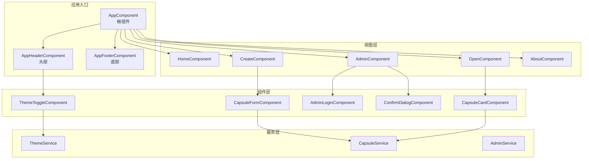
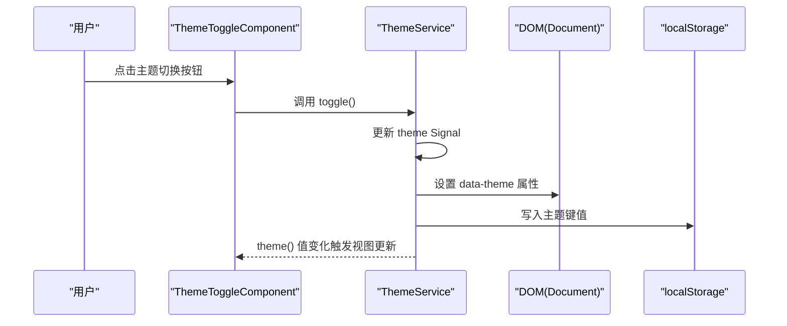
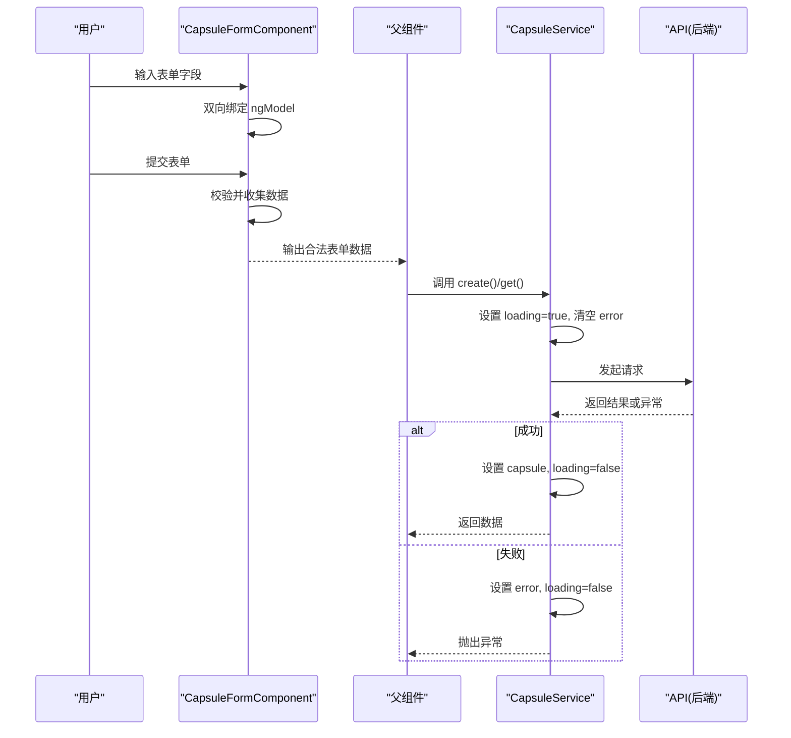
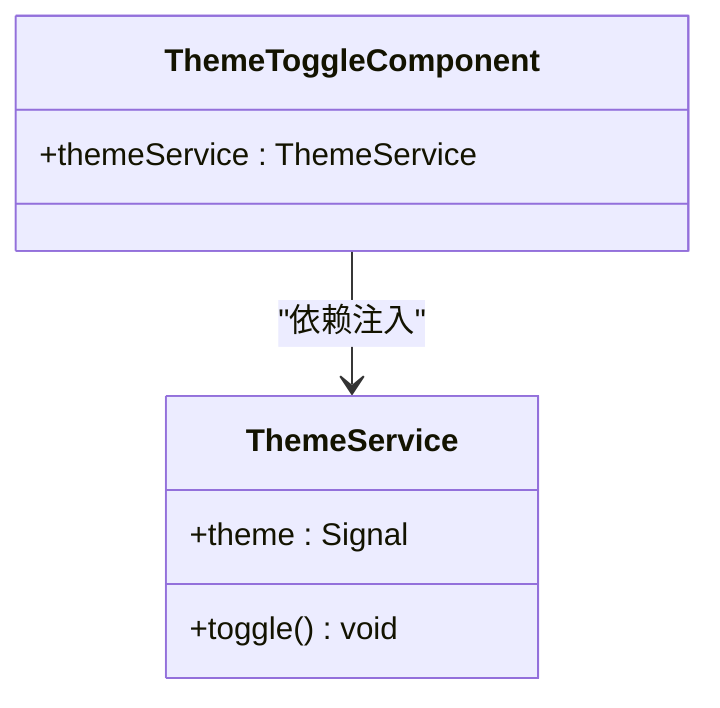
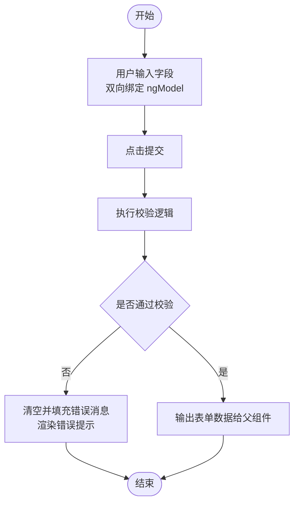
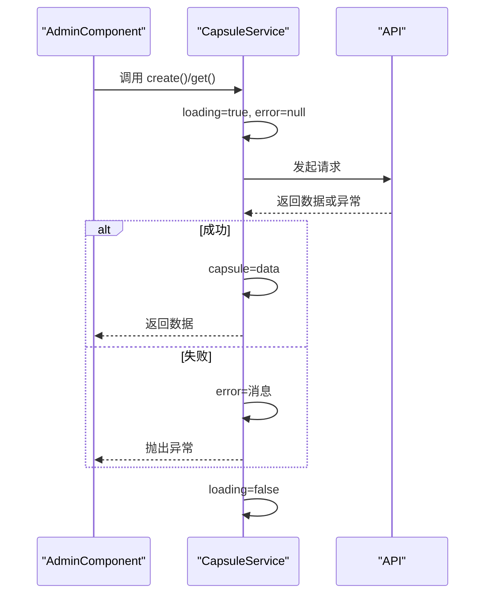
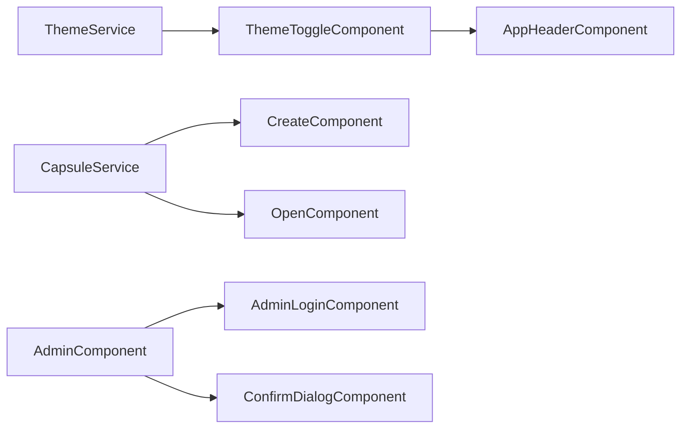

# 状态管理与数据绑定

<cite>
**本文引用的文件**
- [frontends/angular-ts/src/app/services/theme.service.ts](file://frontends/angular-ts/src/app/services/theme.service.ts)
- [frontends/angular-ts/src/app/components/theme-toggle/theme-toggle.component.ts](file://frontends/angular-ts/src/app/components/theme-toggle/theme-toggle.component.ts)
- [frontends/angular-ts/src/app/components/theme-toggle/theme-toggle.component.html](file://frontends/angular-ts/src/app/components/theme-toggle/theme-toggle.component.html)
- [frontends/angular-ts/src/app/components/app-header/app-header.component.ts](file://frontends/angular-ts/src/app/components/app-header/app-header.component.ts)
- [frontends/angular-ts/src/app/services/capsule.service.ts](file://frontends/angular-ts/src/app/services/capsule.service.ts)
- [frontends/angular-ts/src/app/components/capsule-form/capsule-form.component.ts](file://frontends/angular-ts/src/app/components/capsule-form/capsule-form.component.ts)
- [frontends/angular-ts/src/app/components/capsule-form/capsule-form.component.html](file://frontends/angular-ts/src/app/components/capsule-form/capsule-form.component.html)
- [frontends/angular-ts/src/app/components/capsule-card/capsule-card.component.ts](file://frontends/angular-ts/src/app/components/capsule-card/capsule-card.component.ts)
- [frontends/angular-ts/src/app/views/admin/admin.component.ts](file://frontends/angular-ts/src/app/views/admin/admin.component.ts)
- [frontends/angular-ts/src/app/views/admin/admin.component.html](file://frontends/angular-ts/src/app/views/admin/admin.component.html)
- [frontends/angular-ts/src/app/components/admin-login/admin-login.component.ts](file://frontends/angular-ts/src/app/components/admin-login/admin-login.component.ts)
- [frontends/angular-ts/src/app/types/index.ts](file://frontends/angular-ts/src/app/types/index.ts)
- [frontends/angular-ts/src/app/app.component.ts](file://frontends/angular-ts/src/app/app.component.ts)
- [frontends/angular-ts/src/app/app.routes.ts](file://frontends/angular-ts/src/app/app.routes.ts)
- [frontends/angular-ts/src/app/app.config.ts](file://frontends/angular-ts/src/app/app.config.ts)
</cite>

## 目录
1. [引言](#引言)
2. [项目结构](#项目结构)
3. [核心组件](#核心组件)
4. [架构总览](#架构总览)
5. [详细组件分析](#详细组件分析)
6. [依赖关系分析](#依赖关系分析)
7. [性能考虑](#性能考虑)
8. [故障排查指南](#故障排查指南)
9. [结论](#结论)
10. [附录](#附录)

## 引言
本文件聚焦于 Angular 的状态管理与数据绑定实践，结合项目中的真实实现，系统讲解以下主题：
- 数据绑定机制：单向绑定、双向绑定、事件绑定的实现与使用场景
- Signals 新特性：Signal 的创建、更新、监听机制与最佳实践
- 组件状态管理：本地状态、共享状态、全局状态的处理方式
- 表单状态管理：模板驱动表单（ngModel）与响应式表单的状态同步与验证
- 异步数据流：Observable/Promise 的使用与错误处理
- 主题切换的状态管理：ThemeService 设计与组件间状态同步
- 性能优化：变更检测策略、OnPush 策略、信号监听优化
- 依赖注入容器：工作原理与最佳实践

## 项目结构
前端采用 Angular 单页应用结构，采用基于功能域的组织方式：
- 根组件负责页面布局与路由出口
- 视图层按页面拆分（home、create、open、admin、about）
- 组件层包含可复用的业务组件（如胶囊卡片、表单、登录、确认对话框）
- 服务层封装共享状态与副作用（如主题、胶囊、管理员）
- 类型定义集中于 types/index.ts，统一前后端交互数据模型

图表来源
- [frontends/angular-ts/src/app/app.component.ts:1-14](file://frontends/angular-ts/src/app/app.component.ts#L1-L14)
- [frontends/angular-ts/src/app/components/app-header/app-header.component.ts:1-13](file://frontends/angular-ts/src/app/components/app-header/app-header.component.ts#L1-L13)
- [frontends/angular-ts/src/app/views/admin/admin.component.ts:1-45](file://frontends/angular-ts/src/app/views/admin/admin.component.ts#L1-L45)
- [frontends/angular-ts/src/app/components/capsule-form/capsule-form.component.ts:1-68](file://frontends/angular-ts/src/app/components/capsule-form/capsule-form.component.ts#L1-L68)
- [frontends/angular-ts/src/app/components/capsule-card/capsule-card.component.ts:1-37](file://frontends/angular-ts/src/app/components/capsule-card/capsule-card.component.ts#L1-L37)
- [frontends/angular-ts/src/app/components/admin-login/admin-login.component.ts:1-24](file://frontends/angular-ts/src/app/components/admin-login/admin-login.component.ts#L1-L24)
- [frontends/angular-ts/src/app/components/theme-toggle/theme-toggle.component.ts:1-14](file://frontends/angular-ts/src/app/components/theme-toggle/theme-toggle.component.ts#L1-L14)
- [frontends/angular-ts/src/app/services/theme.service.ts:1-28](file://frontends/angular-ts/src/app/services/theme.service.ts#L1-L28)
- [frontends/angular-ts/src/app/services/capsule.service.ts:1-41](file://frontends/angular-ts/src/app/services/capsule.service.ts#L1-L41)

章节来源
- [frontends/angular-ts/src/app/app.component.ts:1-14](file://frontends/angular-ts/src/app/app.component.ts#L1-L14)
- [frontends/angular-ts/src/app/app.routes.ts:1-35](file://frontends/angular-ts/src/app/app.routes.ts#L1-L35)
- [frontends/angular-ts/src/app/app.config.ts:1-14](file://frontends/angular-ts/src/app/app.config.ts#L1-L14)

## 核心组件
本节梳理与状态管理直接相关的核心组件与服务，重点说明其状态来源、更新方式与数据流向。

- ThemeService（全局主题服务）
  - 使用 Signal 暴露当前主题，使用 effect 同步 DOM 属性与本地存储
  - 提供 toggle 方法切换主题
  - 作为根级注入服务，被任意组件依赖

- CapsuleService（胶囊领域服务）
  - 使用多个 Signal 管理胶囊实体、加载状态与错误信息
  - 提供异步方法创建与查询胶囊，统一设置 loading/error 状态
  - 通过 API 模块进行网络请求

- AdminComponent（管理视图）
  - 使用本地 Signal 管理确认对话框可见性与目标项
  - 调用 AdminService 完成登录、列表拉取、删除等操作

- CapsuleFormComponent（模板驱动表单）
  - 使用 ngModel 实现双向绑定
  - 内置表单校验逻辑，通过本地属性维护错误消息
  - 通过事件输出将合法表单数据传递给父组件

- ThemeToggleComponent（主题切换按钮）
  - 仅注入 ThemeService 并调用其方法
  - 模板中读取 Signal 值并根据值渲染图标与提示

章节来源
- [frontends/angular-ts/src/app/services/theme.service.ts:1-28](file://frontends/angular-ts/src/app/services/theme.service.ts#L1-L28)
- [frontends/angular-ts/src/app/services/capsule.service.ts:1-41](file://frontends/angular-ts/src/app/services/capsule.service.ts#L1-L41)
- [frontends/angular-ts/src/app/views/admin/admin.component.ts:1-45](file://frontends/angular-ts/src/app/views/admin/admin.component.ts#L1-L45)
- [frontends/angular-ts/src/app/components/capsule-form/capsule-form.component.ts:1-68](file://frontends/angular-ts/src/app/components/capsule-form/capsule-form.component.ts#L1-L68)
- [frontends/angular-ts/src/app/components/theme-toggle/theme-toggle.component.ts:1-14](file://frontends/angular-ts/src/app/components/theme-toggle/theme-toggle.component.ts#L1-L14)

## 架构总览
下图展示从用户交互到状态更新与视图刷新的完整流程，涵盖主题切换、表单提交、异步数据加载与错误处理。

图表来源
- [frontends/angular-ts/src/app/components/theme-toggle/theme-toggle.component.ts:1-14](file://frontends/angular-ts/src/app/components/theme-toggle/theme-toggle.component.ts#L1-L14)
- [frontends/angular-ts/src/app/components/theme-toggle/theme-toggle.component.html:1-13](file://frontends/angular-ts/src/app/components/theme-toggle/theme-toggle.component.html#L1-L13)
- [frontends/angular-ts/src/app/services/theme.service.ts:1-28](file://frontends/angular-ts/src/app/services/theme.service.ts#L1-L28)

图表来源
- [frontends/angular-ts/src/app/components/capsule-form/capsule-form.component.ts:1-68](file://frontends/angular-ts/src/app/components/capsule-form/capsule-form.component.ts#L1-L68)
- [frontends/angular-ts/src/app/components/capsule-form/capsule-form.component.html:1-72](file://frontends/angular-ts/src/app/components/capsule-form/capsule-form.component.html#L1-L72)
- [frontends/angular-ts/src/app/services/capsule.service.ts:1-41](file://frontends/angular-ts/src/app/services/capsule.service.ts#L1-L41)

## 详细组件分析

### 主题切换：ThemeService 与 ThemeToggleComponent
- 设计要点
  - 使用 Signal 暴露只读主题值，初始化优先读取本地存储，兜底为亮色主题
  - 使用 effect 监听主题变化，同步到 documentElement 的 data-theme 属性，并持久化到 localStorage
  - toggle 方法通过 update 原子地切换 light/dark
- 数据绑定
  - 模板中通过 Signal 值决定按钮图标与 title 文案
  - 点击事件绑定到服务的 toggle 方法，触发状态更新与副作用

图表来源
- [frontends/angular-ts/src/app/services/theme.service.ts:1-28](file://frontends/angular-ts/src/app/services/theme.service.ts#L1-L28)
- [frontends/angular-ts/src/app/components/theme-toggle/theme-toggle.component.ts:1-14](file://frontends/angular-ts/src/app/components/theme-toggle/theme-toggle.component.ts#L1-L14)

章节来源
- [frontends/angular-ts/src/app/services/theme.service.ts:1-28](file://frontends/angular-ts/src/app/services/theme.service.ts#L1-L28)
- [frontends/angular-ts/src/app/components/theme-toggle/theme-toggle.component.ts:1-14](file://frontends/angular-ts/src/app/components/theme-toggle/theme-toggle.component.ts#L1-L14)
- [frontends/angular-ts/src/app/components/theme-toggle/theme-toggle.component.html:1-13](file://frontends/angular-ts/src/app/components/theme-toggle/theme-toggle.component.html#L1-L13)

### 表单状态管理：CapsuleFormComponent（模板驱动）
- 数据绑定
  - 使用 ngModel 实现双向绑定，输入字段与本地 form 对象同步
  - 错误消息通过本地 errors 对象维护，配合模板条件渲染
  - 最小可选时间通过 getter 动态计算，避免未来时间选择
- 事件绑定
  - 表单提交绑定 ngSubmit，内部执行校验并通过事件输出合法数据
- 验证策略
  - 标题/内容/发布者必填校验
  - 开启时间必填且必须晚于当前时间
- 与父组件协作
  - 通过 EventEmitter 将表单数据上抛，由父组件调用服务发起网络请求

图表来源
- [frontends/angular-ts/src/app/components/capsule-form/capsule-form.component.ts:1-68](file://frontends/angular-ts/src/app/components/capsule-form/capsule-form.component.ts#L1-L68)
- [frontends/angular-ts/src/app/components/capsule-form/capsule-form.component.html:1-72](file://frontends/angular-ts/src/app/components/capsule-form/capsule-form.component.html#L1-L72)

章节来源
- [frontends/angular-ts/src/app/components/capsule-form/capsule-form.component.ts:1-68](file://frontends/angular-ts/src/app/components/capsule-form/capsule-form.component.ts#L1-L68)
- [frontends/angular-ts/src/app/components/capsule-form/capsule-form.component.html:1-72](file://frontends/angular-ts/src/app/components/capsule-form/capsule-form.component.html#L1-L72)

### 异步数据流：CapsuleService 与 AdminComponent
- 状态模型
  - capsule：当前胶囊实体（可为空）
  - loading：加载中状态
  - error：错误信息（可为空）
- 流程控制
  - 在每次请求前设置 loading=true、error=null
  - 成功时写入 capsule，失败时设置 error，最终在 finally 中关闭 loading
  - 通过 try/catch 捕获异常并向上抛出，便于调用方处理
- 与视图协作
  - AdminComponent 通过 Signal 管理确认对话框状态与目标项
  - 视图模板中读取服务的 Signal 值进行显示控制与错误提示

图表来源
- [frontends/angular-ts/src/app/services/capsule.service.ts:1-41](file://frontends/angular-ts/src/app/services/capsule.service.ts#L1-L41)
- [frontends/angular-ts/src/app/views/admin/admin.component.ts:1-45](file://frontends/angular-ts/src/app/views/admin/admin.component.ts#L1-L45)

章节来源
- [frontends/angular-ts/src/app/services/capsule.service.ts:1-41](file://frontends/angular-ts/src/app/services/capsule.service.ts#L1-L41)
- [frontends/angular-ts/src/app/views/admin/admin.component.ts:1-45](file://frontends/angular-ts/src/app/views/admin/admin.component.ts#L1-L45)
- [frontends/angular-ts/src/app/views/admin/admin.component.html:1-42](file://frontends/angular-ts/src/app/views/admin/admin.component.html#L1-L42)

### 管理员登录与确认删除：AdminComponent
- 登录流程
  - 父组件接收登录事件，调用服务完成认证与数据拉取
  - 视图根据服务状态动态渲染登录表单或管理面板
- 删除流程
  - 通过本地 Signal 控制确认对话框的可见性与目标项
  - 确认后调用服务执行删除操作

章节来源
- [frontends/angular-ts/src/app/views/admin/admin.component.ts:1-45](file://frontends/angular-ts/src/app/views/admin/admin.component.ts#L1-L45)
- [frontends/angular-ts/src/app/views/admin/admin.component.html:1-42](file://frontends/angular-ts/src/app/views/admin/admin.component.html#L1-L42)
- [frontends/angular-ts/src/app/components/admin-login/admin-login.component.ts:1-24](file://frontends/angular-ts/src/app/components/admin-login/admin-login.component.ts#L1-L24)

### 类型系统与数据契约
- 统一的数据类型定义确保前后端交互一致性
- 关键类型包括胶囊实体、创建表单、通用响应、分页数据、管理员令牌等

章节来源
- [frontends/angular-ts/src/app/types/index.ts:1-53](file://frontends/angular-ts/src/app/types/index.ts#L1-L53)

## 依赖关系分析
- 依赖注入
  - ThemeService 以根级提供，任何组件均可通过依赖注入使用
  - CapsuleService 以根级提供，用于跨组件共享胶囊状态
  - AdminComponent 通过 inject 获取 AdminService（未在本文展开）
- 组件依赖
  - AppHeader 引入 ThemeToggle，形成头部主题切换入口
  - Admin 视图组合登录、表格、确认对话框组件
  - Create 视图组合 CapsuleForm；Open 视图组合 CapsuleCard

图表来源
- [frontends/angular-ts/src/app/services/theme.service.ts:1-28](file://frontends/angular-ts/src/app/services/theme.service.ts#L1-L28)
- [frontends/angular-ts/src/app/components/theme-toggle/theme-toggle.component.ts:1-14](file://frontends/angular-ts/src/app/components/theme-toggle/theme-toggle.component.ts#L1-L14)
- [frontends/angular-ts/src/app/components/app-header/app-header.component.ts:1-13](file://frontends/angular-ts/src/app/components/app-header/app-header.component.ts#L1-L13)
- [frontends/angular-ts/src/app/services/capsule.service.ts:1-41](file://frontends/angular-ts/src/app/services/capsule.service.ts#L1-L41)
- [frontends/angular-ts/src/app/views/admin/admin.component.ts:1-45](file://frontends/angular-ts/src/app/views/admin/admin.component.ts#L1-L45)
- [frontends/angular-ts/src/app/components/admin-login/admin-login.component.ts:1-24](file://frontends/angular-ts/src/app/components/admin-login/admin-login.component.ts#L1-L24)

章节来源
- [frontends/angular-ts/src/app/app.component.ts:1-14](file://frontends/angular-ts/src/app/app.component.ts#L1-L14)
- [frontends/angular-ts/src/app/app.routes.ts:1-35](file://frontends/angular-ts/src/app/app.routes.ts#L1-L35)
- [frontends/angular-ts/src/app/app.config.ts:1-14](file://frontends/angular-ts/src/app/app.config.ts#L1-L14)

## 性能考虑
- 变更检测策略
  - 优先使用 Signal 管理细粒度状态，减少不必要的变更检测范围
  - 将复杂计算放入纯函数或服务中，避免在模板中进行重型计算
- OnPush 策略
  - 对稳定不变的组件启用 OnPush，结合 Signal 的不可变更新，降低检测成本
- 效果监听优化
  - effect 适合副作用（DOM 属性、本地存储），避免在 effect 中进行昂贵计算
- 异步处理
  - 使用 finally 统一关闭 loading，避免状态悬挂
  - 对重复请求进行去重或取消（可在服务层扩展）

## 故障排查指南
- 主题切换无效
  - 检查 effect 是否正确监听 theme Signal
  - 确认 DOM 注入令牌可用，data-theme 属性是否成功设置
  - 校验 localStorage 是否可写
- 表单无法提交
  - 确认 ngSubmit 事件绑定正确
  - 检查校验逻辑是否阻断了合法输入
  - 确保父组件正确接收并处理表单输出事件
- 加载状态不消失
  - 确认 finally 分支是否执行，loading 是否在 finally 中重置
  - 检查异常是否被吞掉导致 finally 未执行
- 错误信息未显示
  - 确认 error Signal 已在失败分支设置
  - 检查模板中是否正确读取 error 值并渲染

章节来源
- [frontends/angular-ts/src/app/services/theme.service.ts:1-28](file://frontends/angular-ts/src/app/services/theme.service.ts#L1-L28)
- [frontends/angular-ts/src/app/components/capsule-form/capsule-form.component.ts:1-68](file://frontends/angular-ts/src/app/components/capsule-form/capsule-form.component.ts#L1-L68)
- [frontends/angular-ts/src/app/services/capsule.service.ts:1-41](file://frontends/angular-ts/src/app/services/capsule.service.ts#L1-L41)

## 结论
本项目通过 Signal 实现了清晰、可预测的状态管理，结合 effect 完成副作用同步，使主题切换与表单状态管理具备良好的可维护性与性能表现。模板驱动表单与事件绑定提供了直观的用户交互路径，而服务层的异步状态管理则保证了错误处理与加载状态的一致性。建议在后续迭代中进一步引入 OnPush 策略与更细粒度的信号拆分，以获得更好的变更检测效率。

## 附录
- 数据绑定速览
  - 单向绑定：[属性绑定:1-72](file://frontends/angular-ts/src/app/components/capsule-form/capsule-form.component.html#L1-L72)、[Signal 值绑定:1-42](file://frontends/angular-ts/src/app/views/admin/admin.component.html#L1-L42)
  - 双向绑定：[ngModel:1-72](file://frontends/angular-ts/src/app/components/capsule-form/capsule-form.component.html#L1-L72)
  - 事件绑定：[click:1-13](file://frontends/angular-ts/src/app/components/theme-toggle/theme-toggle.component.html#L1-L13)、[ngSubmit:1-72](file://frontends/angular-ts/src/app/components/capsule-form/capsule-form.component.html#L1-L72)
- 信号使用速览
  - 创建：[theme Signal:10-14](file://frontends/angular-ts/src/app/services/theme.service.ts#L10-L14)
  - 更新：[toggle/update:24-26](file://frontends/angular-ts/src/app/services/theme.service.ts#L24-L26)
  - 监听：[effect:16-22](file://frontends/angular-ts/src/app/services/theme.service.ts#L16-L22)
- 路由与入口
  - 应用配置：[app.config:1-14](file://frontends/angular-ts/src/app/app.config.ts#L1-L14)
  - 路由定义：[app.routes:1-35](file://frontends/angular-ts/src/app/app.routes.ts#L1-L35)
  - 根组件：[app.component:1-14](file://frontends/angular-ts/src/app/app.component.ts#L1-L14)