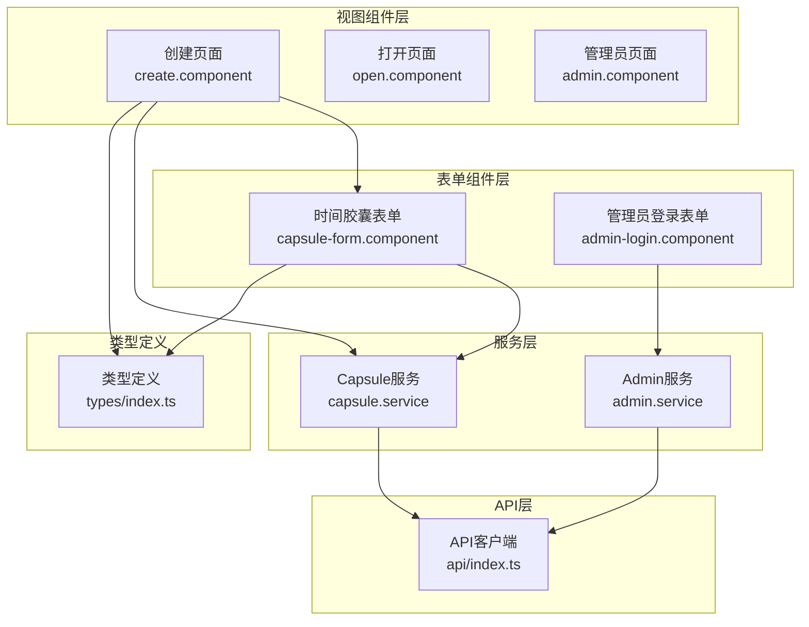
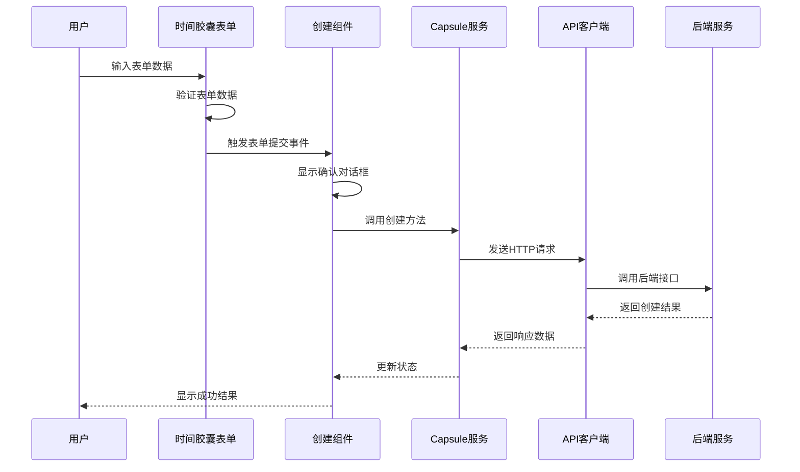
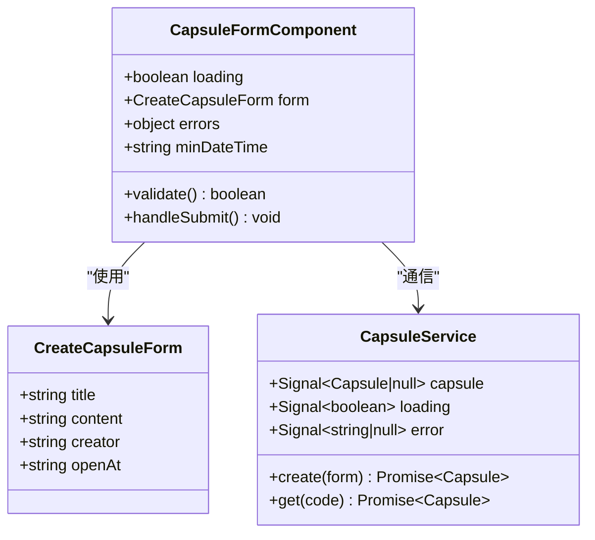
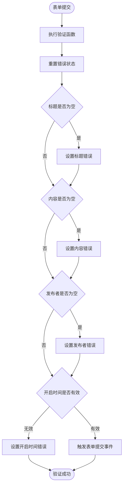
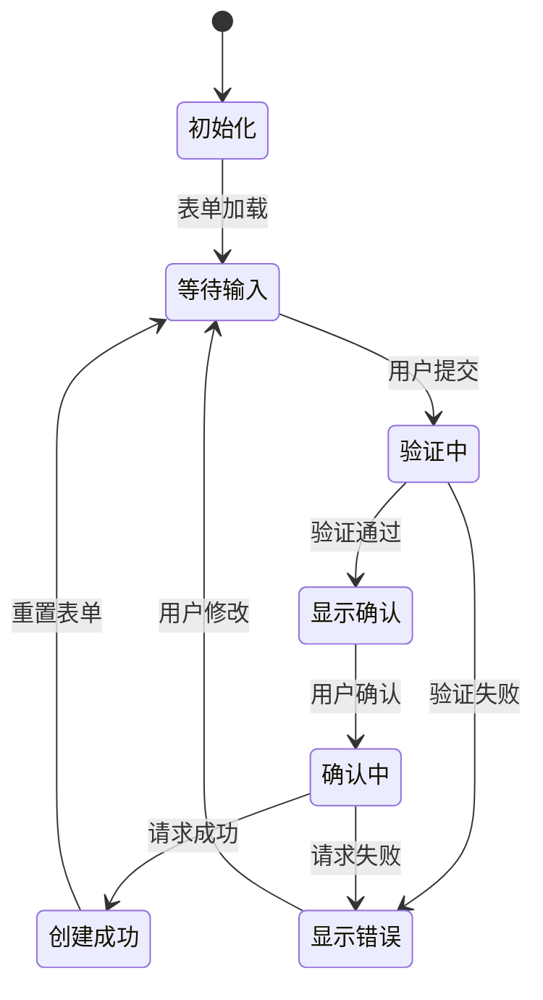
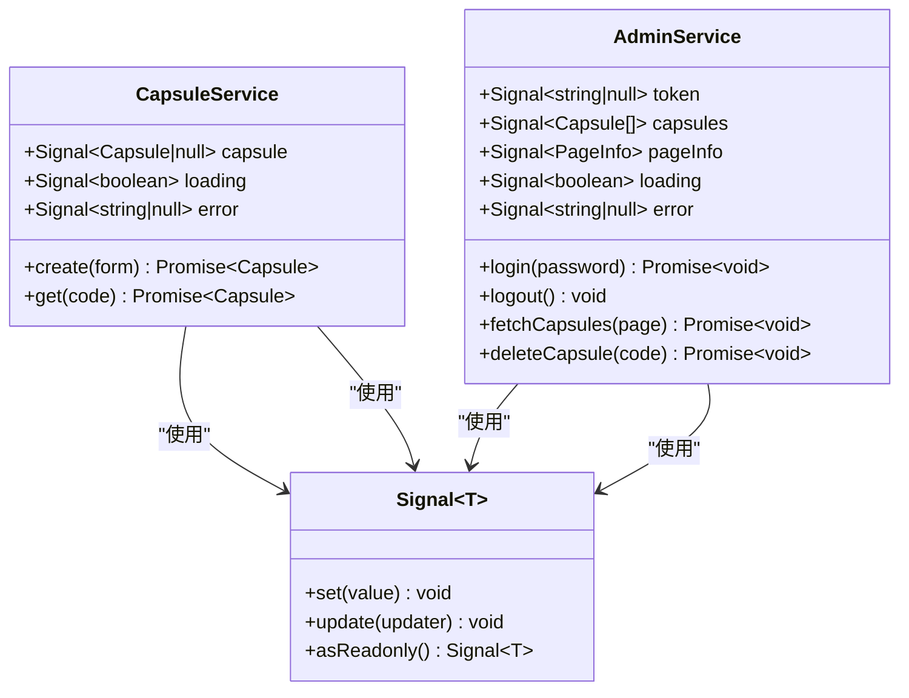
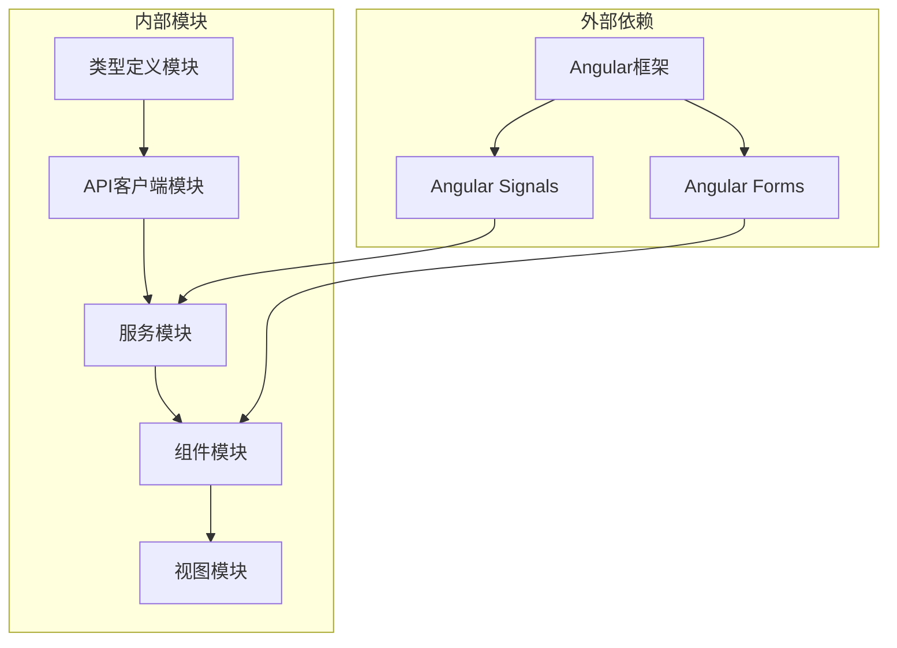

# 表单状态管理

<cite>
**本文档引用的文件**
- [capsule-form.component.ts](file://frontends/angular-ts/src/app/components/capsule-form/capsule-form.component.ts)
- [capsule-form.component.html](file://frontends/angular-ts/src/app/components/capsule-form/capsule-form.component.html)
- [capsule.service.ts](file://frontends/angular-ts/src/app/services/capsule.service.ts)
- [create.component.ts](file://frontends/angular-ts/src/app/views/create/create.component.ts)
- [create.component.html](file://frontends/angular-ts/src/app/views/create/create.component.html)
- [admin-login.component.ts](file://frontends/angular-ts/src/app/components/admin-login/admin-login.component.ts)
- [admin.service.ts](file://frontends/angular-ts/src/app/services/admin.service.ts)
- [index.ts](file://frontends/angular-ts/src/app/api/index.ts)
- [types/index.ts](file://frontends/angular-ts/src/app/types/index.ts)
- [app.config.ts](file://frontends/angular-ts/src/app/app.config.ts)
- [app.routes.ts](file://frontends/angular-ts/src/app/app.routes.ts)
</cite>

## 目录
1. [简介](#简介)
2. [项目结构](#项目结构)
3. [核心组件](#核心组件)
4. [架构概览](#架构概览)
5. [详细组件分析](#详细组件分析)
6. [依赖关系分析](#依赖关系分析)
7. [性能考虑](#性能考虑)
8. [故障排除指南](#故障排除指南)
9. [结论](#结论)

## 简介

本项目展示了Angular表单状态管理的最佳实践，重点实现了时间胶囊创建表单。该应用采用模板驱动表单模式，通过双向数据绑定、本地验证和状态管理来处理用户输入。文档将深入解释模板驱动表单与响应式表单的区别，详细说明表单控件的状态管理机制，包括值变化、验证状态和用户交互状态的处理。

## 项目结构

前端Angular项目采用模块化架构，表单相关的核心文件分布如下：

**图表来源**
- [capsule-form.component.ts:1-68](file://frontends/angular-ts/src/app/components/capsule-form/capsule-form.component.ts#L1-L68)
- [create.component.ts:1-54](file://frontends/angular-ts/src/app/views/create/create.component.ts#L1-L54)
- [capsule.service.ts:1-41](file://frontends/angular-ts/src/app/services/capsule.service.ts#L1-L41)

**章节来源**
- [app.config.ts:1-14](file://frontends/angular-ts/src/app/app.config.ts#L1-L14)
- [app.routes.ts:1-35](file://frontends/angular-ts/src/app/app.routes.ts#L1-L35)

## 核心组件

### 模板驱动表单 vs 响应式表单对比

本项目主要使用模板驱动表单模式，但同时也展示了响应式表单的关键概念。以下是两种表单模式的详细对比：

#### 模板驱动表单（Template-driven Forms）

**特点：**
- 使用`[(ngModel)]`进行双向数据绑定
- 在模板中声明验证规则
- 适合简单表单场景
- 开发效率高，学习曲线平缓

**实现示例：**
- 时间胶囊表单使用`[(ngModel)]`绑定表单字段
- 本地验证在组件方法中实现
- 错误状态通过CSS类切换控制

#### 响应式表单（Reactive Forms）

**特点：**
- 使用`FormBuilder`创建表单模型
- 类型安全的表单验证
- 更强的表单状态管理能力
- 适合复杂表单场景

**关键优势：**
- 强类型的表单控件
- 更好的测试支持
- 更灵活的表单结构
- 实时状态订阅

**章节来源**
- [capsule-form.component.ts:1-68](file://frontends/angular-ts/src/app/components/capsule-form/capsule-form.component.ts#L1-L68)
- [admin-login.component.ts:1-24](file://frontends/angular-ts/src/app/components/admin-login/admin-login.component.ts#L1-L24)

## 架构概览

系统采用分层架构设计，表单状态管理贯穿整个应用：

**图表来源**
- [capsule-form.component.ts:62-66](file://frontends/angular-ts/src/app/components/capsule-form/capsule-form.component.ts#L62-L66)
- [create.component.ts:27-42](file://frontends/angular-ts/src/app/views/create/create.component.ts#L27-L42)
- [capsule.service.ts:11-24](file://frontends/angular-ts/src/app/services/capsule.service.ts#L11-L24)

## 详细组件分析

### 时间胶囊表单组件

时间胶囊表单是本项目的核心表单组件，实现了完整的表单状态管理功能。

#### 组件结构分析

**图表来源**
- [capsule-form.component.ts:12-21](file://frontends/angular-ts/src/app/components/capsule-form/capsule-form.component.ts#L12-L21)
- [types/index.ts:16-21](file://frontends/angular-ts/src/app/types/index.ts#L16-L21)
- [capsule.service.ts:6-9](file://frontends/angular-ts/src/app/services/capsule.service.ts#L6-L9)

#### 表单状态管理机制

**值变化跟踪：**
- 使用`[(ngModel)]`实现双向数据绑定
- 自动同步输入框值到组件属性
- 支持实时验证反馈

**验证状态管理：**
- 本地验证规则集中管理
- 错误状态对象独立维护
- 验证结果显示与隐藏控制

**用户交互状态：**
- 加载状态通过按钮禁用控制
- 错误状态通过CSS类切换
- 成功状态通过条件渲染展示

#### 验证机制实现

表单实现了多层次的验证策略：

**图表来源**
- [capsule-form.component.ts:36-60](file://frontends/angular-ts/src/app/components/capsule-form/capsule-form.component.ts#L36-L60)

**章节来源**
- [capsule-form.component.ts:1-68](file://frontends/angular-ts/src/app/components/capsule-form/capsule-form.component.ts#L1-L68)
- [capsule-form.component.html:1-72](file://frontends/angular-ts/src/app/components/capsule-form/capsule-form.component.html#L1-L72)

### 创建组件集成

创建组件作为表单的容器，负责协调表单状态与业务逻辑：

#### 状态同步机制

**图表来源**
- [create.component.ts:16-53](file://frontends/angular-ts/src/app/views/create/create.component.ts#L16-L53)

#### 数据流管理

创建组件实现了完整的数据流控制：

**输入数据流：**
- 表单组件传递的表单数据
- 确认对话框的用户确认
- 服务层返回的操作结果

**输出数据流：**
- 加载状态的实时更新
- 错误信息的统一处理
- 成功结果的用户反馈

**章节来源**
- [create.component.ts:1-54](file://frontends/angular-ts/src/app/views/create/create.component.ts#L1-L54)
- [create.component.html:1-37](file://frontends/angular-ts/src/app/views/create/create.component.html#L1-L37)

### 服务层状态管理

服务层提供了统一的状态管理机制，确保表单状态在整个应用中的一致性。

#### 信号状态管理

**图表来源**
- [capsule.service.ts:6-9](file://frontends/angular-ts/src/app/services/capsule.service.ts#L6-L9)
- [admin.service.ts:8-25](file://frontends/angular-ts/src/app/services/admin.service.ts#L8-L25)

#### 异步操作状态管理

服务层实现了完善的异步操作状态管理：

**加载状态：**
- 操作开始时设置为true
- 操作结束时设置为false
- 用于控制UI交互状态

**错误状态：**
- 操作失败时设置错误信息
- 统一的错误处理机制
- 支持多种错误类型

**数据状态：**
- 成功操作后的数据存储
- 支持数据的读取和更新
- 类型安全的数据访问

**章节来源**
- [capsule.service.ts:1-41](file://frontends/angular-ts/src/app/services/capsule.service.ts#L1-L41)
- [admin.service.ts:1-84](file://frontends/angular-ts/src/app/services/admin.service.ts#L1-L84)

## 依赖关系分析

系统各组件之间的依赖关系清晰明确：

**图表来源**
- [app.config.ts:1-14](file://frontends/angular-ts/src/app/app.config.ts#L1-L14)
- [types/index.ts:1-53](file://frontends/angular-ts/src/app/types/index.ts#L1-L53)

**章节来源**
- [app.config.ts:1-14](file://frontends/angular-ts/src/app/app.config.ts#L1-L14)
- [app.routes.ts:1-35](file://frontends/angular-ts/src/app/app.routes.ts#L1-L35)

## 性能考虑

### 表单性能优化

**渲染优化：**
- 使用`ChangeDetectionStrategy.OnPush`减少变更检测
- 条件渲染避免不必要的DOM更新
- 批量状态更新减少重复渲染

**内存管理：**
- 及时清理事件监听器
- 合理使用信号状态避免内存泄漏
- 组件销毁时清理订阅

**网络优化：**
- 防抖处理避免频繁请求
- 缓存机制提升用户体验
- 错误重试机制增强稳定性

### 状态管理性能

**信号状态的优势：**
- 细粒度的状态更新
- 自动化的依赖追踪
- 高效的变更检测

**最佳实践：**
- 避免在模板中进行复杂计算
- 合理拆分状态避免全局更新
- 使用计算信号优化派生状态

## 故障排除指南

### 常见问题及解决方案

**表单验证不生效：**
- 检查`[(ngModel)]`绑定是否正确
- 确认验证函数调用时机
- 验证错误状态对象初始化

**状态不同步问题：**
- 确认信号状态的正确使用
- 检查组件间的事件传递
- 验证服务状态的更新机制

**异步操作错误处理：**
- 实现统一的错误处理逻辑
- 提供用户友好的错误提示
- 记录详细的错误日志

**性能问题排查：**
- 分析变更检测频率
- 检查不必要的组件重渲染
- 优化大型表单的渲染性能

### 调试技巧

**开发工具使用：**
- 利用Angular DevTools检查组件树
- 使用浏览器开发者工具监控状态变化
- 实施适当的日志记录策略

**测试策略：**
- 单元测试覆盖核心业务逻辑
- 集成测试验证组件间协作
- 端到端测试确保用户体验

**章节来源**
- [capsule-form.component.ts:36-60](file://frontends/angular-ts/src/app/components/capsule-form/capsule-form.component.ts#L36-L60)
- [capsule.service.ts:14-23](file://frontends/angular-ts/src/app/services/capsule.service.ts#L14-L23)

## 结论

本项目展示了Angular表单状态管理的完整实现方案。通过模板驱动表单与现代状态管理技术的结合，实现了高效、可维护的表单系统。

**核心优势：**
- 清晰的分层架构便于维护
- 完善的状态管理机制确保一致性
- 优秀的用户体验设计
- 良好的性能表现

**最佳实践总结：**
- 选择合适的表单模式适应具体需求
- 实现统一的状态管理模式
- 建立完善的错误处理机制
- 注重性能优化和用户体验

该实现为类似的应用场景提供了可靠的参考模板，可以根据具体需求进行扩展和定制。