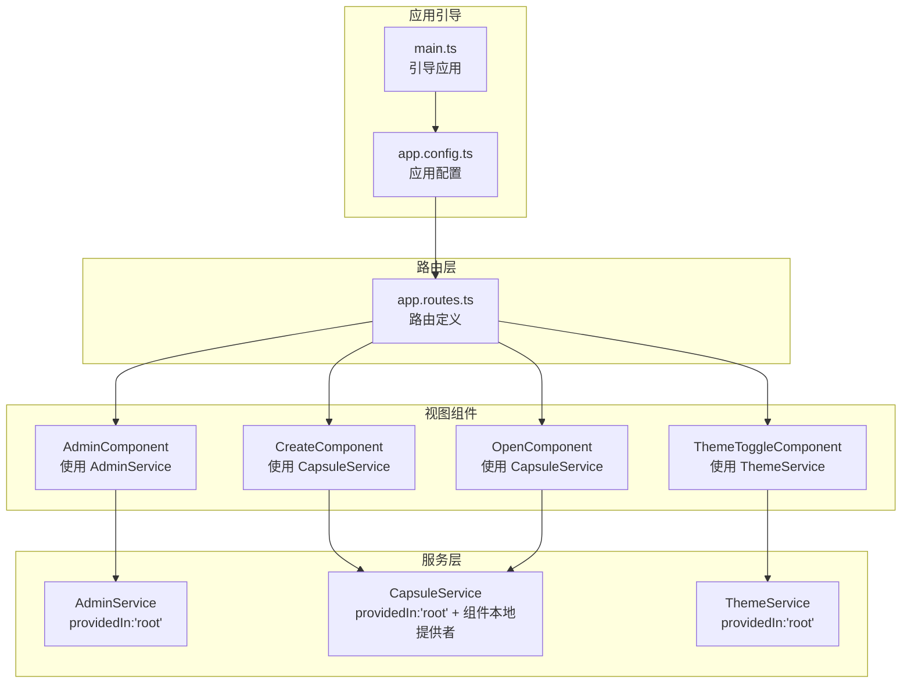
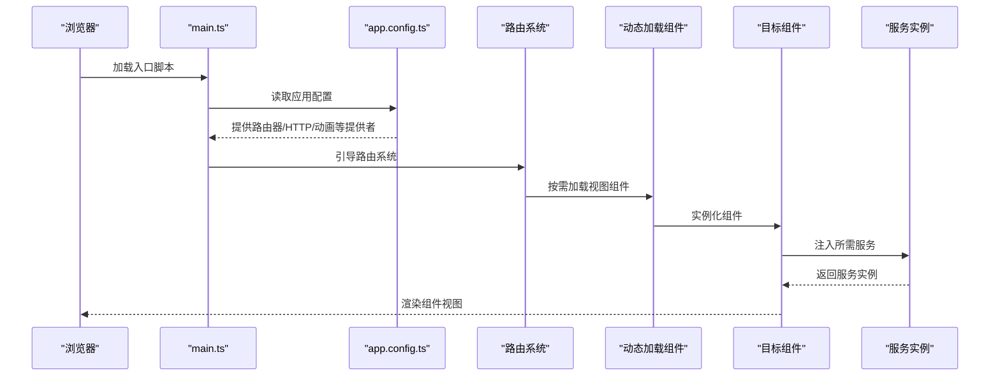
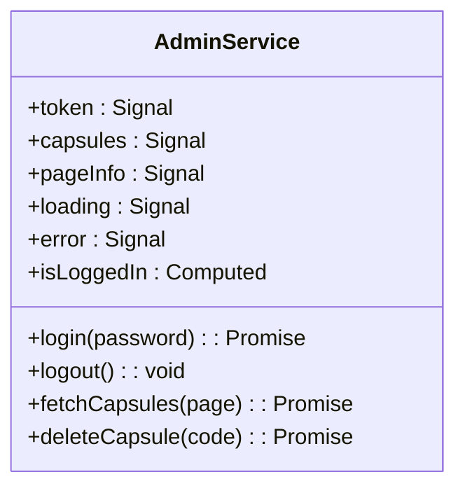
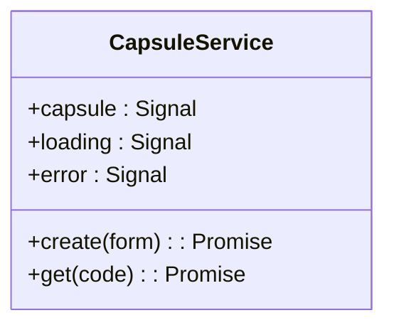
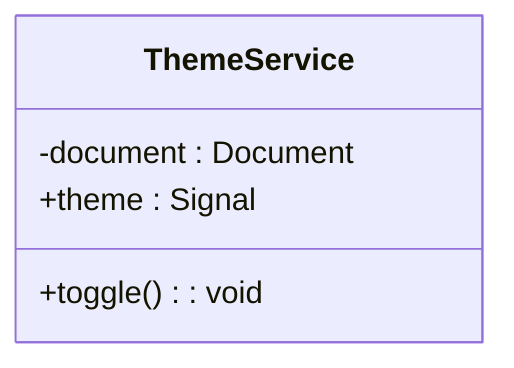
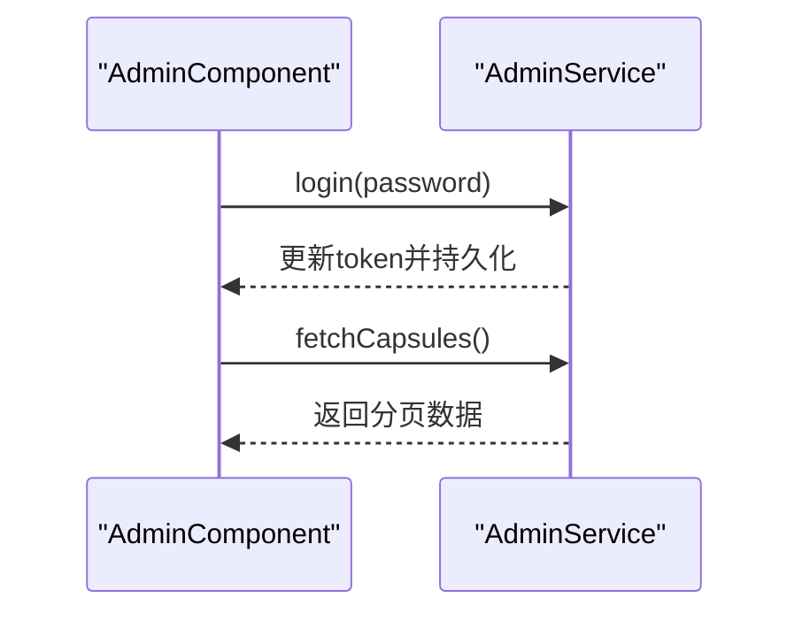
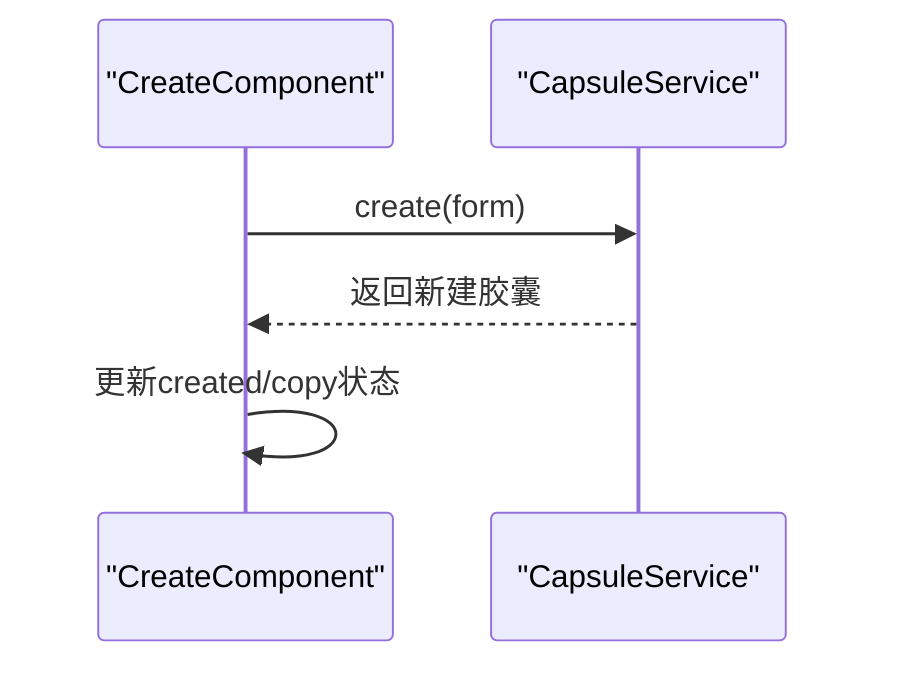
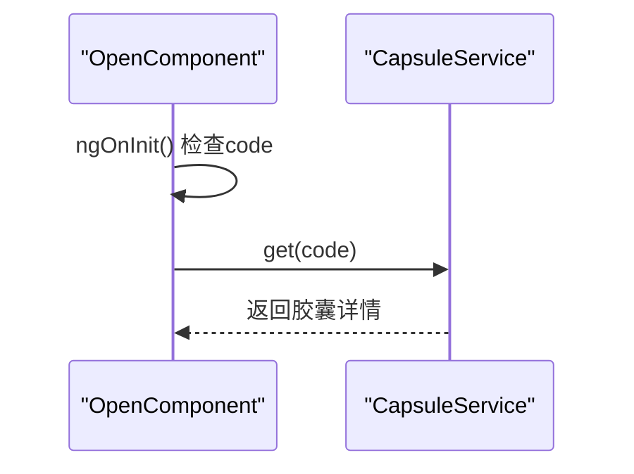
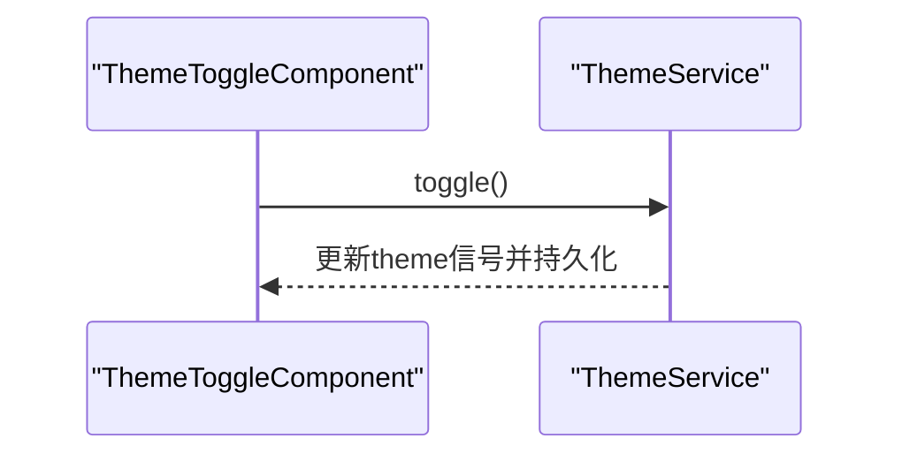
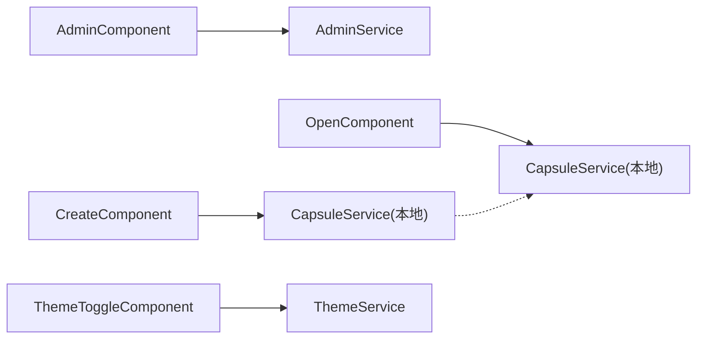

# 依赖注入机制

<cite>
**本文档引用的文件**
- [app.config.ts](file://frontends/angular-ts/src/app/app.config.ts)
- [main.ts](file://frontends/angular-ts/src/main.ts)
- [admin.service.ts](file://frontends/angular-ts/src/app/services/admin.service.ts)
- [capsule.service.ts](file://frontends/angular-ts/src/app/services/capsule.service.ts)
- [theme.service.ts](file://frontends/angular-ts/src/app/services/theme.service.ts)
- [admin.component.ts](file://frontends/angular-ts/src/app/views/admin/admin.component.ts)
- [create.component.ts](file://frontends/angular-ts/src/app/views/create/create.component.ts)
- [open.component.ts](file://frontends/angular-ts/src/app/views/open/open.component.ts)
- [theme-toggle.component.ts](file://frontends/angular-ts/src/app/components/theme-toggle/theme-toggle.component.ts)
- [app.routes.ts](file://frontends/angular-ts/src/app/app.routes.ts)
</cite>

## 目录
1. [简介](#简介)
2. [项目结构](#项目结构)
3. [核心组件](#核心组件)
4. [架构总览](#架构总览)
5. [详细组件分析](#详细组件分析)
6. [依赖关系分析](#依赖关系分析)
7. [性能考量](#性能考量)
8. [故障排除指南](#故障排除指南)
9. [结论](#结论)

## 简介
本文件系统性阐述 HelloTime 项目中 Angular 依赖注入（DI）机制的设计与实践，涵盖以下主题：
- DI 容器、提供者配置与注入令牌系统
- 构造函数注入在服务、组件、管道中的使用
- @Injectable 装饰器与注入范围（root、component、any）
- 不同提供者类型（值提供者、工厂提供者、类提供者、异质提供者）的适用场景
- 基于 HelloTime 的服务注入实例：CapsuleService、AdminService、ThemeService 的实际应用
- 可选依赖注入、循环依赖处理与延迟注入
- 依赖注入最佳实践：服务设计原则、性能优化与测试友好性

## 项目结构
HelloTime 的 Angular 前端采用基于功能模块的组织方式，依赖注入主要通过以下位置配置：
- 应用级配置：在应用引导时集中注册全局提供者
- 组件级配置：在特定组件上声明本地提供者以实现组件作用域的服务实例化
- 服务级配置：通过 @Injectable 的 providedIn 指定服务的默认注入范围

图表来源
- [main.ts:1-7](file://frontends/angular-ts/src/main.ts#L1-L7)
- [app.config.ts:1-14](file://frontends/angular-ts/src/app/app.config.ts#L1-L14)
- [app.routes.ts:1-35](file://frontends/angular-ts/src/app/app.routes.ts#L1-L35)
- [admin.component.ts:1-45](file://frontends/angular-ts/src/app/views/admin/admin.component.ts#L1-L45)
- [create.component.ts:1-54](file://frontends/angular-ts/src/app/views/create/create.component.ts#L1-L54)
- [open.component.ts:1-36](file://frontends/angular-ts/src/app/views/open/open.component.ts#L1-L36)
- [theme-toggle.component.ts:1-14](file://frontends/angular-ts/src/app/components/theme-toggle/theme-toggle.component.ts#L1-L14)
- [admin.service.ts:1-84](file://frontends/angular-ts/src/app/services/admin.service.ts#L1-L84)
- [capsule.service.ts:1-41](file://frontends/angular-ts/src/app/services/capsule.service.ts#L1-L41)
- [theme.service.ts:1-28](file://frontends/angular-ts/src/app/services/theme.service.ts#L1-L28)

章节来源
- [main.ts:1-7](file://frontends/angular-ts/src/main.ts#L1-L7)
- [app.config.ts:1-14](file://frontends/angular-ts/src/app/app.config.ts#L1-L14)
- [app.routes.ts:1-35](file://frontends/angular-ts/src/app/app.routes.ts#L1-L35)

## 核心组件
本节聚焦依赖注入的关键实现点与使用模式。

- 应用级提供者注册
  - 在应用配置中集中注册路由器、HTTP 客户端与动画等全局提供者，确保整个应用共享这些基础设施。
  - 这些提供者在应用启动时由 Angular DI 容器统一管理，避免重复实例化。

- 服务级注入范围
  - AdminService、CapsuleService、ThemeService 均通过 @Injectable({ providedIn: 'root' }) 声明为根作用域单例服务，可在应用任意位置注入使用。
  - CreateComponent 与 OpenComponent 在组件级 providers 中再次声明 CapsuleService，形成组件本地提供者，使该组件内的服务实例与其它组件隔离。

- 组件内注入方式
  - AdminComponent 使用 inject(AdminService) 进行函数式注入；ThemeToggleComponent 同样采用 inject(ThemeService)。
  - CreateComponent 与 OpenComponent 使用私有字段注入 CapsuleService，并通过信号状态暴露给模板。

- 外部依赖注入
  - ThemeService 通过 inject(DOCUMENT) 注入浏览器 DOM 文档对象，用于设置根元素的主题属性并持久化到本地存储。

章节来源
- [app.config.ts:7-13](file://frontends/angular-ts/src/app/app.config.ts#L7-L13)
- [admin.service.ts:7-8](file://frontends/angular-ts/src/app/services/admin.service.ts#L7-L8)
- [capsule.service.ts:5-6](file://frontends/angular-ts/src/app/services/capsule.service.ts#L5-L6)
- [theme.service.ts:6-7](file://frontends/angular-ts/src/app/services/theme.service.ts#L6-L7)
- [admin.component.ts:15-15](file://frontends/angular-ts/src/app/views/admin/admin.component.ts#L15-L15)
- [theme-toggle.component.ts:12-12](file://frontends/angular-ts/src/app/components/theme-toggle/theme-toggle.component.ts#L12-L12)
- [create.component.ts:12-12](file://frontends/angular-ts/src/app/views/create/create.component.ts#L12-L12)
- [open.component.ts:10-10](file://frontends/angular-ts/src/app/views/open/open.component.ts#L10-L10)
- [theme.service.ts:8-8](file://frontends/angular-ts/src/app/services/theme.service.ts#L8-L8)

## 架构总览
下图展示了应用启动、路由加载与服务注入的整体流程：

图表来源
- [main.ts:1-7](file://frontends/angular-ts/src/main.ts#L1-L7)
- [app.config.ts:7-13](file://frontends/angular-ts/src/app/app.config.ts#L7-L13)
- [app.routes.ts:6-33](file://frontends/angular-ts/src/app/app.routes.ts#L6-L33)

## 详细组件分析

### 服务层：AdminService
- 角色定位：管理管理员登录态、分页信息与胶囊数据的获取与删除。
- 注入范围：根作用域单例，保证跨组件共享登录状态与数据。
- 关键行为：
  - 登录：调用后端接口更新 token 并持久化到会话存储。
  - 获取胶囊列表：携带 token 请求分页数据，更新本地信号状态。
  - 删除胶囊：删除成功后重新拉取当前页数据。
- 依赖注入要点：
  - 作为根服务，无需在组件 providers 中重复声明即可全局使用。
  - 在组件中通过 inject 或构造函数注入均可。

图表来源
- [admin.service.ts:7-84](file://frontends/angular-ts/src/app/services/admin.service.ts#L7-L84)

章节来源
- [admin.service.ts:7-84](file://frontends/angular-ts/src/app/services/admin.service.ts#L7-L84)
- [admin.component.ts:14-44](file://frontends/angular-ts/src/app/views/admin/admin.component.ts#L14-L44)

### 服务层：CapsuleService
- 角色定位：封装胶囊的创建与查询逻辑，维护本地状态并通过信号对外暴露。
- 注入范围：根作用域单例，同时在 CreateComponent 与 OpenComponent 的 providers 中声明，形成组件本地实例。
- 关键行为：
  - 创建胶囊：提交表单数据，返回新创建的胶囊实体。
  - 查询胶囊：根据 code 获取详情并缓存到本地。
- 依赖注入要点：
  - 根作用域保证跨组件共享同一服务实例；组件本地提供者确保组件内状态隔离。
  - 通过 inject(CapsuleService) 在组件中直接获取实例。

图表来源
- [capsule.service.ts:5-41](file://frontends/angular-ts/src/app/services/capsule.service.ts#L5-L41)

章节来源
- [capsule.service.ts:5-41](file://frontends/angular-ts/src/app/services/capsule.service.ts#L5-L41)
- [create.component.ts:12-17](file://frontends/angular-ts/src/app/views/create/create.component.ts#L12-L17)
- [open.component.ts:10-17](file://frontends/angular-ts/src/app/views/open/open.component.ts#L10-L17)

### 服务层：ThemeService
- 角色定位：管理主题切换与持久化，响应式地更新根元素的 data-theme 属性。
- 注入范围：根作用域单例。
- 关键行为：
  - 从本地存储初始化主题，默认 light。
  - 通过 effect 监听主题变化，同步 DOM 属性与本地存储。
  - 提供 toggle 方法切换主题。
- 依赖注入要点：
  - 通过 inject(DOCUMENT) 注入浏览器文档对象，避免在模板中直接操作 DOM。
  - 在组件中通过 inject(ThemeService) 使用。

图表来源
- [theme.service.ts:6-28](file://frontends/angular-ts/src/app/services/theme.service.ts#L6-L28)

章节来源
- [theme.service.ts:6-28](file://frontends/angular-ts/src/app/services/theme.service.ts#L6-L28)
- [theme-toggle.component.ts:12-12](file://frontends/angular-ts/src/app/components/theme-toggle/theme-toggle.component.ts#L12-L12)

### 组件层：AdminComponent
- 注入方式：inject(AdminService) 获取服务实例。
- 生命周期：ngOnInit 中检查登录状态并拉取数据。
- 用户交互：接收登录事件，调用服务完成登录与数据刷新。

图表来源
- [admin.component.ts:15-33](file://frontends/angular-ts/src/app/views/admin/admin.component.ts#L15-L33)
- [admin.service.ts:27-67](file://frontends/angular-ts/src/app/services/admin.service.ts#L27-L67)

章节来源
- [admin.component.ts:14-44](file://frontends/angular-ts/src/app/views/admin/admin.component.ts#L14-L44)
- [admin.service.ts:27-67](file://frontends/angular-ts/src/app/services/admin.service.ts#L27-L67)

### 组件层：CreateComponent
- 注入方式：组件级 providers 声明本地 CapsuleService 实例；通过 inject(CapsuleService) 获取。
- 表单流程：收集用户输入，确认后调用服务创建胶囊，支持复制生成的 code。
- 状态管理：通过服务的 loading、error 信号与本地信号联动。

图表来源
- [create.component.ts:17-42](file://frontends/angular-ts/src/app/views/create/create.component.ts#L17-L42)
- [capsule.service.ts:11-24](file://frontends/angular-ts/src/app/services/capsule.service.ts#L11-L24)

章节来源
- [create.component.ts:12-54](file://frontends/angular-ts/src/app/views/create/create.component.ts#L12-L54)
- [capsule.service.ts:11-24](file://frontends/angular-ts/src/app/services/capsule.service.ts#L11-L24)

### 组件层：OpenComponent
- 注入方式：组件级 providers 声明本地 CapsuleService 实例；通过 inject(CapsuleService) 获取。
- 输入绑定：支持通过 @Input 接收 code 参数，进入页面即触发查询。
- 状态管理：通过服务的 capsule、loading、error 信号驱动视图。

图表来源
- [open.component.ts:14-35](file://frontends/angular-ts/src/app/views/open/open.component.ts#L14-L35)
- [capsule.service.ts:26-39](file://frontends/angular-ts/src/app/services/capsule.service.ts#L26-L39)

章节来源
- [open.component.ts:10-36](file://frontends/angular-ts/src/app/views/open/open.component.ts#L10-L36)
- [capsule.service.ts:26-39](file://frontends/angular-ts/src/app/services/capsule.service.ts#L26-L39)

### 组件层：ThemeToggleComponent
- 注入方式：inject(ThemeService) 获取服务实例。
- 交互行为：调用服务的 toggle 方法切换主题。

图表来源
- [theme-toggle.component.ts:12-12](file://frontends/angular-ts/src/app/components/theme-toggle/theme-toggle.component.ts#L12-L12)
- [theme.service.ts:24-26](file://frontends/angular-ts/src/app/services/theme.service.ts#L24-L26)

章节来源
- [theme-toggle.component.ts:11-14](file://frontends/angular-ts/src/app/components/theme-toggle/theme-toggle.component.ts#L11-L14)
- [theme.service.ts:24-26](file://frontends/angular-ts/src/app/services/theme.service.ts#L24-L26)

## 依赖关系分析
- 作用域与耦合
  - 根作用域服务（AdminService、CapsuleService、ThemeService）在应用范围内共享，降低重复实例化成本，但需注意状态一致性与内存占用。
  - 组件本地提供者（CreateComponent、OpenComponent）隔离了服务实例，避免跨组件状态污染，适合需要独立状态或临时数据的场景。
- 外部依赖
  - ThemeService 依赖 DOCUMENT，体现了对浏览器环境的直接访问，应谨慎在纯 SSR 场景使用或进行平台检测。
- 循环依赖
  - 当前代码未见显式循环依赖；若未来扩展中出现 A 依赖 B、B 依赖 C、C 又依赖 A 的情况，建议通过引入中间层或延迟注入缓解。

图表来源
- [admin.component.ts:15-15](file://frontends/angular-ts/src/app/views/admin/admin.component.ts#L15-L15)
- [create.component.ts:12-12](file://frontends/angular-ts/src/app/views/create/create.component.ts#L12-L12)
- [open.component.ts:10-10](file://frontends/angular-ts/src/app/views/open/open.component.ts#L10-L10)
- [theme-toggle.component.ts:12-12](file://frontends/angular-ts/src/app/components/theme-toggle/theme-toggle.component.ts#L12-L12)

章节来源
- [admin.component.ts:14-44](file://frontends/angular-ts/src/app/views/admin/admin.component.ts#L14-L44)
- [create.component.ts:12-54](file://frontends/angular-ts/src/app/views/create/create.component.ts#L12-L54)
- [open.component.ts:10-36](file://frontends/angular-ts/src/app/views/open/open.component.ts#L10-L36)
- [theme-toggle.component.ts:11-14](file://frontends/angular-ts/src/app/components/theme-toggle/theme-toggle.component.ts#L11-L14)

## 性能考量
- 单例与实例数量
  - 根作用域服务天然单例，减少内存占用与初始化开销；组件本地提供者适合小范围隔离，但会增加实例数量。
- 信号与变更检测
  - 服务与组件广泛使用信号（signal/computed），可减少不必要的变更检测，提升渲染性能。
- 异步操作与错误处理
  - 服务内部对异步请求进行统一的状态管理与错误处理，避免组件重复逻辑，提高可维护性。
- 按需加载与懒加载
  - 路由采用动态导入组件，结合 DI 容器按需实例化服务，有助于首屏性能优化。

## 故障排除指南
- 服务未注入或报错
  - 确认服务已通过 @Injectable({ providedIn: 'root' } 或组件 providers 声明。
  - 检查是否在正确的生命周期阶段使用 inject 或构造函数注入。
- 主题不生效
  - 确认 DOCUMENT 注入成功且根元素存在 data-theme 属性；检查本地存储权限与浏览器兼容性。
- 组件本地状态异常
  - 若期望跨组件共享状态，请移除组件级 providers；若需要隔离，请确保仅在当前组件使用该实例。
- 错误状态未显示
  - 服务内部已设置 error 信号，组件需正确绑定模板以显示错误信息。

章节来源
- [theme.service.ts:8-22](file://frontends/angular-ts/src/app/services/theme.service.ts#L8-L22)
- [create.component.ts:17-42](file://frontends/angular-ts/src/app/views/create/create.component.ts#L17-L42)
- [open.component.ts:17-35](file://frontends/angular-ts/src/app/views/open/open.component.ts#L17-L35)

## 结论
HelloTime 的 Angular 依赖注入体系通过“应用级提供者 + 根作用域服务 + 组件本地提供者”的组合，实现了高内聚、低耦合的服务架构。AdminService、CapsuleService、ThemeService 的设计体现了单一职责与可测试性；组件通过 inject 与构造函数注入灵活获取所需能力。遵循本文的最佳实践，可在保持性能与可维护性的前提下，进一步扩展复杂业务场景。