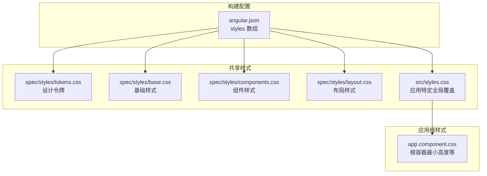
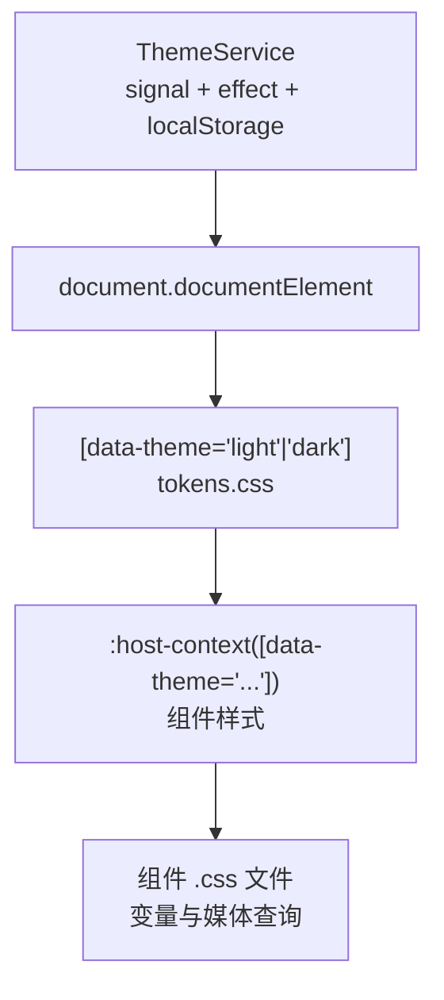
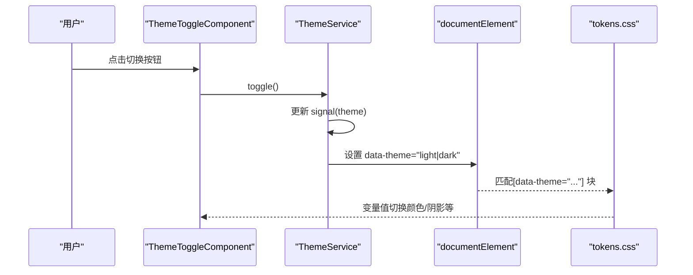
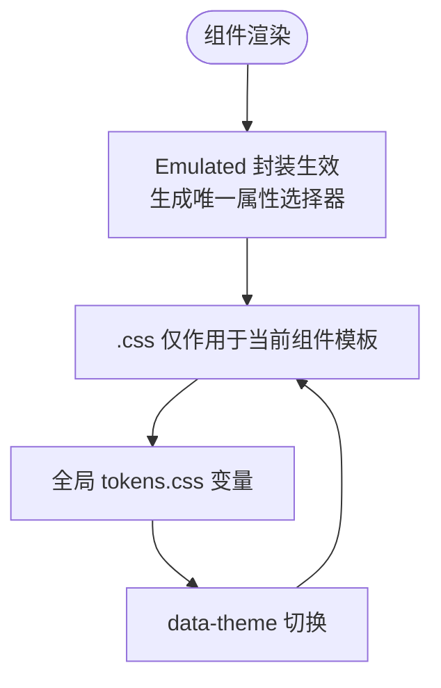
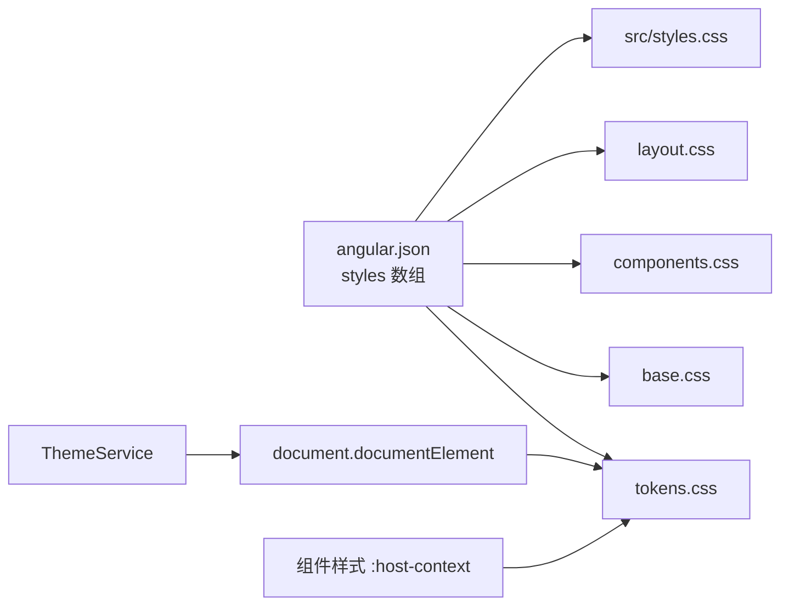

# 组件样式管理

<cite>
**本文引用的文件**
- [frontends/angular-ts/src/app/app.component.css](file://frontends/angular-ts/src/app/app.component.css)
- [frontends/angular-ts/src/styles.css](file://frontends/angular-ts/src/styles.css)
- [frontends/angular-ts/src/app/services/theme.service.ts](file://frontends/angular-ts/src/app/services/theme.service.ts)
- [frontends/angular-ts/src/app/components/theme-toggle/theme-toggle.component.ts](file://frontends/angular-ts/src/app/components/theme-toggle/theme-toggle.component.ts)
- [frontends/angular-ts/src/app/components/theme-toggle/theme-toggle.component.css](file://frontends/angular-ts/src/app/components/theme-toggle/theme-toggle.component.css)
- [frontends/angular-ts/src/app/components/app-header/app-header.component.ts](file://frontends/angular-ts/src/app/components/app-header/app-header.component.ts)
- [frontends/angular-ts/src/app/components/app-header/app-header.component.css](file://frontends/angular-ts/src/app/components/app-header/app-header.component.css)
- [frontends/angular-ts/src/app/components/capsule-card/capsule-card.component.ts](file://frontends/angular-ts/src/app/components/capsule-card/capsule-card.component.ts)
- [frontends/angular-ts/src/app/components/capsule-card/capsule-card.component.css](file://frontends/angular-ts/src/app/components/capsule-card/capsule-card.component.css)
- [frontends/angular-ts/src/app/components/admin-login/admin-login.component.css](file://frontends/angular-ts/src/app/components/admin-login/admin-login.component.css)
- [frontends/angular-ts/src/app/components/capsule-form/capsule-form.component.css](file://frontends/angular-ts/src/app/components/capsule-form/capsule-form.component.css)
- [frontends/angular-ts/src/app/views/home/home.component.css](file://frontends/angular-ts/src/app/views/home/home.component.css)
- [frontends/angular-ts/src/app/views/admin/admin.component.css](file://frontends/angular-ts/src/app/views/admin/admin.component.css)
- [frontends/angular-ts/src/app/app.config.ts](file://frontends/angular-ts/src/app/app.config.ts)
- [frontends/angular-ts/angular.json](file://frontends/angular-ts/angular.json)
- [spec/styles/tokens.css](file://spec/styles/tokens.css)
</cite>

## 目录
1. [简介](#简介)
2. [项目结构](#项目结构)
3. [核心组件](#核心组件)
4. [架构总览](#架构总览)
5. [详细组件分析](#详细组件分析)
6. [依赖关系分析](#依赖关系分析)
7. [性能考量](#性能考量)
8. [故障排查指南](#故障排查指南)
9. [结论](#结论)
10. [附录](#附录)

## 简介
本文件聚焦于 Angular 组件样式管理，结合 HelloTime 项目的实际实现，系统阐述以下主题：
- 样式封装机制与作用域：Emulated（默认）、Shadow DOM、None 的适用场景与差异
- 样式定义方式：内联样式、外部样式表、内联模板样式
- 样式作用域与冲突避免：类名策略、BEM 风格、媒体查询与响应式断点
- 主题系统：CSS 变量、data-theme 属性、暗色模式切换、host-context 适配
- 设计令牌集成：tokens.css 中的语义化变量体系
- 样式优先级与覆盖：层叠顺序、特异性、!important 的使用建议
- 最佳实践：模块化、性能优化、可维护性与可扩展性

## 项目结构
Angular 前端采用独立组件（standalone components）架构，样式以“按需加载”的方式组织：
- 全局样式通过 angular.json 的 styles 数组统一引入，包含设计令牌、基础样式、组件样式与布局样式
- 组件级样式通过 styleUrl 引入独立的 .css 文件，遵循“组件即样式边界”的原则
- 主题服务通过设置 documentElement 的 data-theme 属性驱动全局主题切换

图表来源
- [frontends/angular-ts/angular.json:39-45](file://frontends/angular-ts/angular.json#L39-L45)
- [frontends/angular-ts/src/app/app.component.css:1-4](file://frontends/angular-ts/src/app/app.component.css#L1-L4)
- [frontends/angular-ts/src/styles.css:1-3](file://frontends/angular-ts/src/styles.css#L1-L3)
- [spec/styles/tokens.css:1-104](file://spec/styles/tokens.css#L1-L104)

章节来源
- [frontends/angular-ts/angular.json:39-45](file://frontends/angular-ts/angular.json#L39-L45)
- [frontends/angular-ts/src/app/app.component.css:1-4](file://frontends/angular-ts/src/app/app.component.css#L1-L4)
- [frontends/angular-ts/src/styles.css:1-3](file://frontends/angular-ts/src/styles.css#L1-L3)
- [spec/styles/tokens.css:1-104](file://spec/styles/tokens.css#L1-L104)

## 核心组件
- 主题服务 ThemeService：提供主题信号状态、持久化存储与 DOM 属性更新
- 主题切换组件 ThemeToggleComponent：触发主题切换，复用 tokens.css 中的语义变量
- 应用头部 AppHeaderComponent：演示响应式布局与 hover 状态下的变量使用
- 卡片组件 CapsuleCardComponent：展示变量在复杂布局中的复用
- 登录与表单组件：演示输入框、按钮、错误提示的变量化样式
- 视图组件：Home 与 Admin 页面展示不同主题下的视觉差异与媒体查询

章节来源
- [frontends/angular-ts/src/app/services/theme.service.ts:1-28](file://frontends/angular-ts/src/app/services/theme.service.ts#L1-L28)
- [frontends/angular-ts/src/app/components/theme-toggle/theme-toggle.component.ts:1-14](file://frontends/angular-ts/src/app/components/theme-toggle/theme-toggle.component.ts#L1-L14)
- [frontends/angular-ts/src/app/components/theme-toggle/theme-toggle.component.css:1-16](file://frontends/angular-ts/src/app/components/theme-toggle/theme-toggle.component.css#L1-L16)
- [frontends/angular-ts/src/app/components/app-header/app-header.component.ts:1-13](file://frontends/angular-ts/src/app/components/app-header/app-header.component.ts#L1-L13)
- [frontends/angular-ts/src/app/components/app-header/app-header.component.css:1-66](file://frontends/angular-ts/src/app/components/app-header/app-header.component.css#L1-L66)
- [frontends/angular-ts/src/app/components/capsule-card/capsule-card.component.ts:1-37](file://frontends/angular-ts/src/app/components/capsule-card/capsule-card.component.ts#L1-L37)
- [frontends/angular-ts/src/app/components/capsule-card/capsule-card.component.css:1-76](file://frontends/angular-ts/src/app/components/capsule-card/capsule-card.component.css#L1-L76)
- [frontends/angular-ts/src/app/components/admin-login/admin-login.component.css:1-40](file://frontends/angular-ts/src/app/components/admin-login/admin-login.component.css#L1-L40)
- [frontends/angular-ts/src/app/components/capsule-form/capsule-form.component.css:1-46](file://frontends/angular-ts/src/app/components/capsule-form/capsule-form.component.css#L1-L46)
- [frontends/angular-ts/src/app/views/home/home.component.css:1-141](file://frontends/angular-ts/src/app/views/home/home.component.css#L1-L141)
- [frontends/angular-ts/src/app/views/admin/admin.component.css:1-37](file://frontends/angular-ts/src/app/views/admin/admin.component.css#L1-L37)

## 架构总览
主题系统通过 ThemeService 在根节点设置 data-theme 属性，所有组件样式基于 tokens.css 的 CSS 变量与 data-theme 选择器实现主题切换。全局样式通过 angular.json 的 styles 数组集中注入，确保变量与基础规则在应用启动时可用。

图表来源
- [frontends/angular-ts/src/app/services/theme.service.ts:10-22](file://frontends/angular-ts/src/app/services/theme.service.ts#L10-L22)
- [spec/styles/tokens.css:82-103](file://spec/styles/tokens.css#L82-L103)
- [frontends/angular-ts/src/app/components/capsule-form/capsule-form.component.css:42-45](file://frontends/angular-ts/src/app/components/capsule-form/capsule-form.component.css#L42-L45)
- [frontends/angular-ts/src/app/views/home/home.component.css:92-105](file://frontends/angular-ts/src/app/views/home/home.component.css#L92-L105)

## 详细组件分析

### 主题系统与 CSS 变量
- 设计令牌：tokens.css 定义了颜色、字体、间距、圆角、阴影、过渡与布局等语义变量，并为暗色模式提供覆盖块
- 主题服务：ThemeService 使用 signal 管理当前主题，effect 在主题变化时写入 data-theme 属性并持久化到 localStorage
- 组件适配：组件样式通过 :host-context([data-theme="..."]) 或直接使用变量实现明暗主题下的差异化表现

图表来源
- [frontends/angular-ts/src/app/components/theme-toggle/theme-toggle.component.ts:12-13](file://frontends/angular-ts/src/app/components/theme-toggle/theme-toggle.component.ts#L12-L13)
- [frontends/angular-ts/src/app/services/theme.service.ts:24-26](file://frontends/angular-ts/src/app/services/theme.service.ts#L24-L26)
- [frontends/angular-ts/src/app/services/theme.service.ts:17-21](file://frontends/angular-ts/src/app/services/theme.service.ts#L17-L21)
- [spec/styles/tokens.css:82-103](file://spec/styles/tokens.css#L82-L103)

章节来源
- [frontends/angular-ts/src/app/services/theme.service.ts:1-28](file://frontends/angular-ts/src/app/services/theme.service.ts#L1-L28)
- [frontends/angular-ts/src/app/components/theme-toggle/theme-toggle.component.ts:1-14](file://frontends/angular-ts/src/app/components/theme-toggle/theme-toggle.component.ts#L1-L14)
- [frontends/angular-ts/src/app/components/theme-toggle/theme-toggle.component.css:1-16](file://frontends/angular-ts/src/app/components/theme-toggle/theme-toggle.component.css#L1-L16)
- [spec/styles/tokens.css:1-104](file://spec/styles/tokens.css#L1-L104)

### 样式封装与作用域
- 默认封装：Angular 使用 Emulated 封装，为每个组件生成唯一属性选择器，避免样式泄漏
- 作用域边界：组件样式仅影响该组件模板内的元素；如需影响子组件或宿主，需使用 ::ng-deep（不推荐）或通过结构化命名与变量约束
- 全局样式：通过 angular.json 的 styles 数组引入 tokens.css、base.css、components.css、layout.css 与 src/styles.css，形成全局基线与主题变量

图表来源
- [frontends/angular-ts/angular.json:39-45](file://frontends/angular-ts/angular.json#L39-L45)
- [spec/styles/tokens.css:1-104](file://spec/styles/tokens.css#L1-L104)
- [frontends/angular-ts/src/app/services/theme.service.ts:17-21](file://frontends/angular-ts/src/app/services/theme.service.ts#L17-L21)

章节来源
- [frontends/angular-ts/angular.json:39-45](file://frontends/angular-ts/angular.json#L39-L45)
- [frontends/angular-ts/src/app/services/theme.service.ts:17-21](file://frontends/angular-ts/src/app/services/theme.service.ts#L17-L21)
- [spec/styles/tokens.css:1-104](file://spec/styles/tokens.css#L1-L104)

### 样式定义方法与组织
- 外部样式表：通过 angular.json 的 styles 数组集中引入 tokens.css、base.css、components.css、layout.css 与 src/styles.css
- 组件样式：各组件通过 styleUrl 引入独立 .css 文件，保持职责单一
- 内联模板样式：未在本项目中使用，建议优先采用外部样式表与 tokens.css 变量

章节来源
- [frontends/angular-ts/angular.json:39-45](file://frontends/angular-ts/angular.json#L39-L45)
- [frontends/angular-ts/src/app/components/app-header/app-header.component.ts:9-10](file://frontends/angular-ts/src/app/components/app-header/app-header.component.ts#L9-L10)
- [frontends/angular-ts/src/app/components/capsule-card/capsule-card.component.ts:8-9](file://frontends/angular-ts/src/app/components/capsule-card/capsule-card.component.ts#L8-L9)

### 响应式设计与媒体查询
- 断点策略：在多个组件中使用 max-width 媒体查询，如移动端隐藏 logo 文本、表单网格改为单列
- 语义化变量：配合 tokens.css 的 --max-width-* 变量，确保断点一致性

章节来源
- [frontends/angular-ts/src/app/components/app-header/app-header.component.css:60-65](file://frontends/angular-ts/src/app/components/app-header/app-header.component.css#L60-L65)
- [frontends/angular-ts/src/app/components/capsule-form/capsule-form.component.css:36-40](file://frontends/angular-ts/src/app/components/capsule-form/capsule-form.component.css#L36-L40)
- [frontends/angular-ts/src/app/views/home/home.component.css:136-140](file://frontends/angular-ts/src/app/views/home/home.component.css#L136-L140)

### 样式继承、优先级与覆盖
- 变量优先：tokens.css 提供语义化变量，组件样式通过 var(--...) 调用，便于统一管理与覆盖
- host-context 适配：组件样式使用 :host-context([data-theme="..."]) 实现主题感知，避免全局污染
- 媒体查询覆盖：在组件内部使用媒体查询对特定断点进行局部覆盖
- 全局覆盖：src/styles.css 用于应用特定的全局覆盖，谨慎使用

章节来源
- [spec/styles/tokens.css:1-104](file://spec/styles/tokens.css#L1-L104)
- [frontends/angular-ts/src/app/components/capsule-form/capsule-form.component.css:42-45](file://frontends/angular-ts/src/app/components/capsule-form/capsule-form.component.css#L42-L45)
- [frontends/angular-ts/src/app/views/admin/admin.component.css:34-36](file://frontends/angular-ts/src/app/views/admin/admin.component.css#L34-L36)
- [frontends/angular-ts/src/styles.css:1-3](file://frontends/angular-ts/src/styles.css#L1-L3)

### 组件样式示例与最佳实践
- AppHeader：使用变量控制高度、边框、背景与过渡；响应式隐藏 logo 文字
- CapsuleCard：通过变量统一标题、元信息、代码块与锁状态的样式
- AdminLogin/CapsuleForm：表单分组、标签、错误提示与按钮宽度使用变量统一
- Home/Admin：在暗色模式下调整渐变与阴影；错误横幅在暗色模式下反相背景

章节来源
- [frontends/angular-ts/src/app/components/app-header/app-header.component.css:1-66](file://frontends/angular-ts/src/app/components/app-header/app-header.component.css#L1-L66)
- [frontends/angular-ts/src/app/components/capsule-card/capsule-card.component.css:1-76](file://frontends/angular-ts/src/app/components/capsule-card/capsule-card.component.css#L1-L76)
- [frontends/angular-ts/src/app/components/admin-login/admin-login.component.css:1-40](file://frontends/angular-ts/src/app/components/admin-login/admin-login.component.css#L1-L40)
- [frontends/angular-ts/src/app/components/capsule-form/capsule-form.component.css:1-46](file://frontends/angular-ts/src/app/components/capsule-form/capsule-form.component.css#L1-L46)
- [frontends/angular-ts/src/app/views/home/home.component.css:1-141](file://frontends/angular-ts/src/app/views/home/home.component.css#L1-L141)
- [frontends/angular-ts/src/app/views/admin/admin.component.css:1-37](file://frontends/angular-ts/src/app/views/admin/admin.component.css#L1-L37)

## 依赖关系分析
- 构建期依赖：angular.json 的 styles 数组决定全局样式加载顺序与打包范围
- 运行期依赖：ThemeService 依赖 DOCUMENT 注入；组件依赖 tokens.css 变量与 data-theme 属性

图表来源
- [frontends/angular-ts/angular.json:39-45](file://frontends/angular-ts/angular.json#L39-L45)
- [frontends/angular-ts/src/app/services/theme.service.ts:8-21](file://frontends/angular-ts/src/app/services/theme.service.ts#L8-L21)
- [spec/styles/tokens.css:1-104](file://spec/styles/tokens.css#L1-L104)

章节来源
- [frontends/angular-ts/angular.json:39-45](file://frontends/angular-ts/angular.json#L39-L45)
- [frontends/angular-ts/src/app/services/theme.service.ts:8-21](file://frontends/angular-ts/src/app/services/theme.service.ts#L8-L21)
- [spec/styles/tokens.css:1-104](file://spec/styles/tokens.css#L1-L104)

## 性能考量
- 样式体积：生产构建启用输出哈希与预算限制，减少重复样式与冗余资源
- 变量复用：通过 tokens.css 统一变量，降低重复定义与打包体积
- 作用域隔离：Emulated 封装避免全局污染，同时保持较小的选择器开销
- 媒体查询：合理使用断点，避免过度嵌套与重复计算

章节来源
- [frontends/angular-ts/angular.json:49-63](file://frontends/angular-ts/angular.json#L49-L63)
- [spec/styles/tokens.css:1-104](file://spec/styles/tokens.css#L1-L104)

## 故障排查指南
- 主题未生效
  - 检查 ThemeService 是否正确设置 data-theme 属性
  - 确认 tokens.css 中存在对应 [data-theme="..."] 块
  - 排查组件是否使用 :host-context([data-theme="..."]) 或直接使用变量
- 样式覆盖异常
  - 检查组件样式与全局样式之间的层叠顺序与特异性
  - 避免使用 !important；优先通过变量与选择器层级调整
- 响应式断点不生效
  - 确认媒体查询断点与 tokens.css 的 --max-width-* 变量一致
  - 检查组件内媒体查询书写是否正确

章节来源
- [frontends/angular-ts/src/app/services/theme.service.ts:17-21](file://frontends/angular-ts/src/app/services/theme.service.ts#L17-L21)
- [spec/styles/tokens.css:75-80](file://spec/styles/tokens.css#L75-L80)
- [frontends/angular-ts/src/app/components/app-header/app-header.component.css:60-65](file://frontends/angular-ts/src/app/components/app-header/app-header.component.css#L60-L65)

## 结论
HelloTime 的 Angular 样式体系以设计令牌为核心，结合 Emulated 封装与 data-theme 主题切换，实现了高内聚、低耦合且易于维护的样式管理方案。通过 tokens.css 的语义化变量与组件级 .css 文件的模块化组织，既保证了主题一致性，又避免了全局污染与样式冲突。建议在后续迭代中持续遵循变量优先、断点统一与最小覆盖的原则，进一步提升可维护性与性能。

## 附录
- 样式封装模式说明
  - Emulated：默认模式，通过唯一属性选择器实现作用域隔离，适合大多数场景
  - Shadow DOM：适用于需要严格隔离的场景，但会增加复杂度与兼容性成本
  - None：不进行封装，易造成全局污染，不建议在组件样式中使用
- 最佳实践清单
  - 使用 tokens.css 作为唯一真实来源
  - 组件样式仅定义自身所需，避免跨组件影响
  - 合理使用 :host-context 与媒体查询，保持样式层次清晰
  - 生产构建关注体积与缓存策略