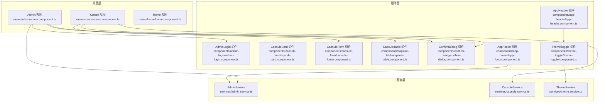
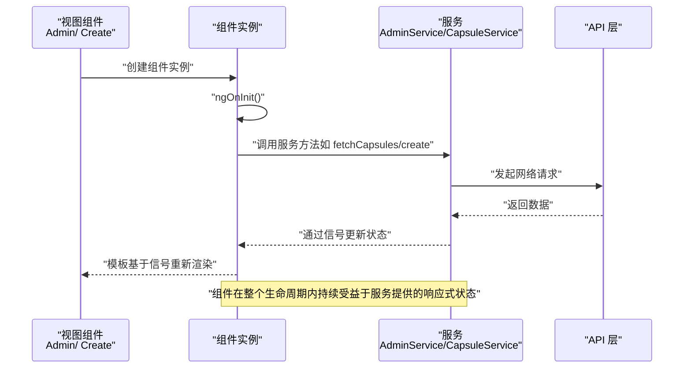
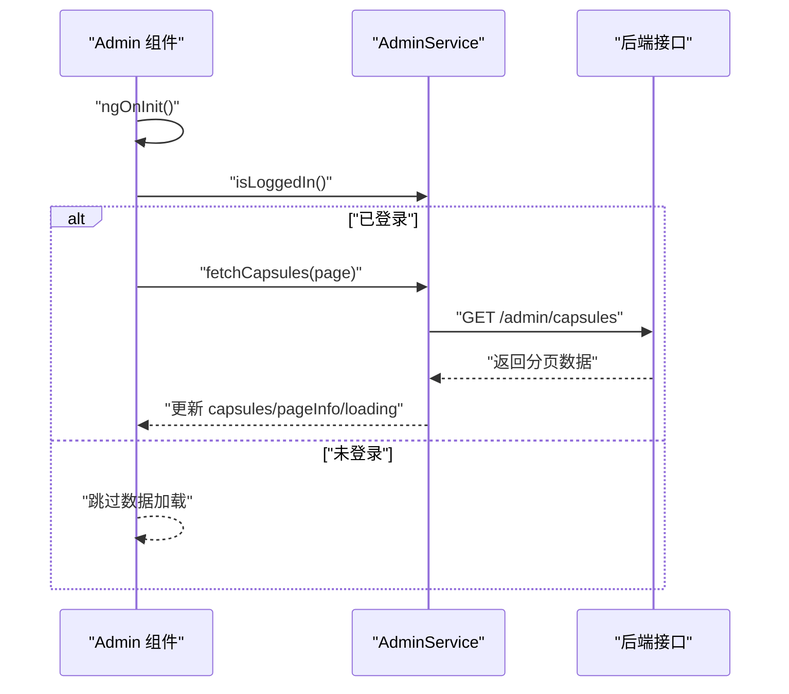
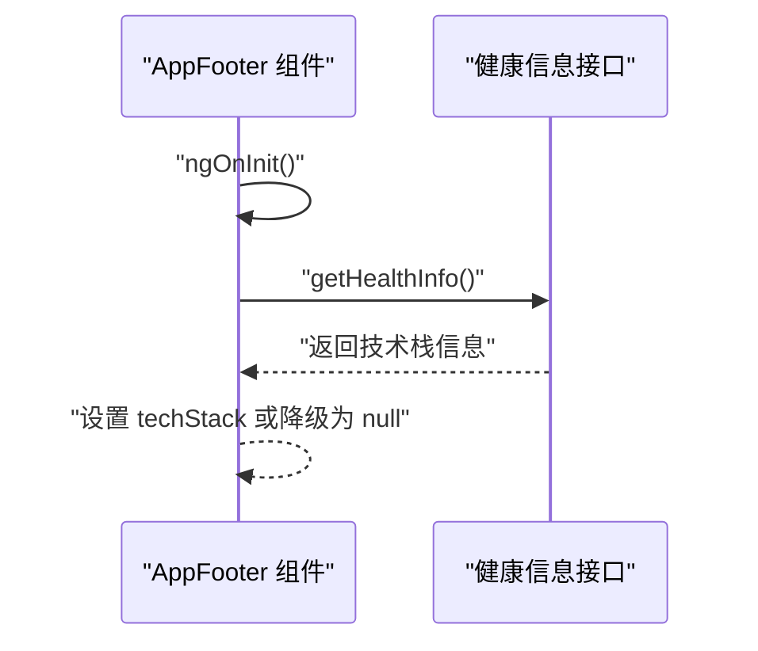
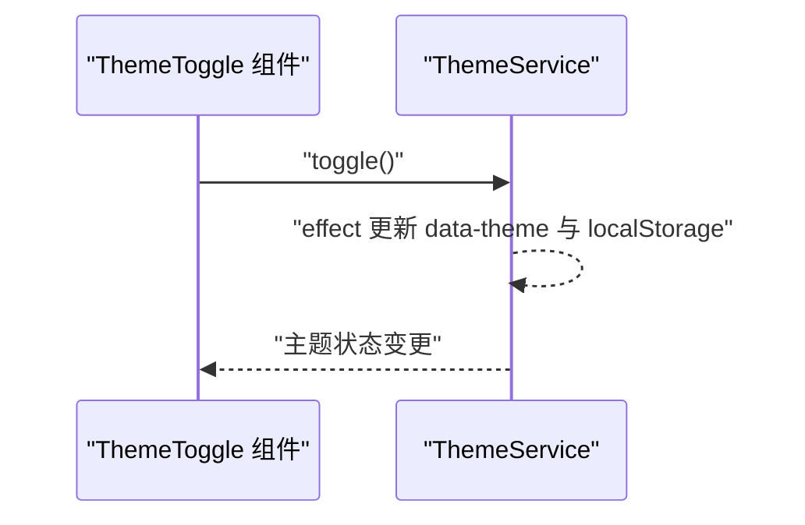
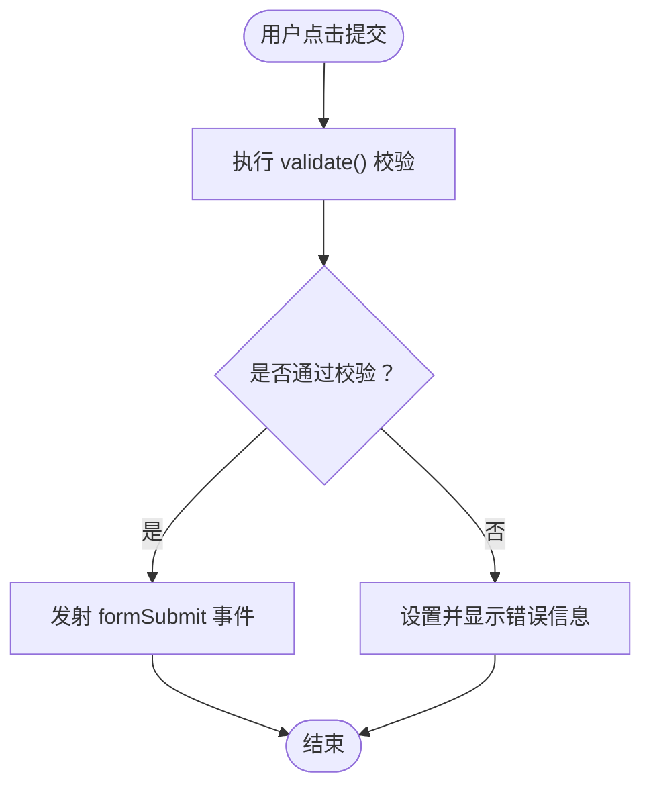
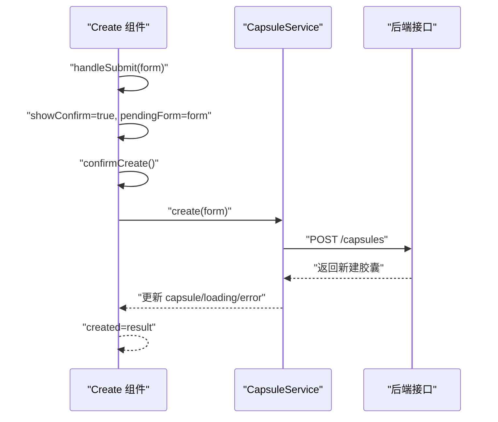
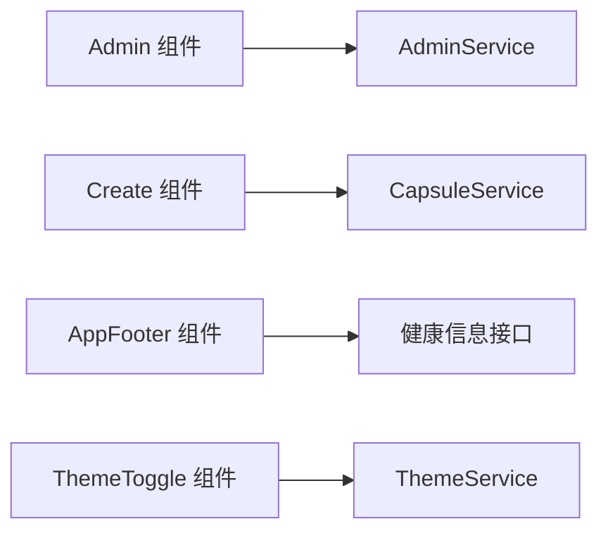

# 组件生命周期

<cite>
**本文引用的文件**
- [frontends/angular-ts/src/app/components/admin-login/admin-login.component.ts](file://frontends/angular-ts/src/app/components/admin-login/admin-login.component.ts)
- [frontends/angular-ts/src/app/components/capsule-card/capsule-card.component.ts](file://frontends/angular-ts/src/app/components/capsule-card/capsule-card.component.ts)
- [frontends/angular-ts/src/app/components/capsule-form/capsule-form.component.ts](file://frontends/angular-ts/src/app/components/capsule-form/capsule-form.component.ts)
- [frontends/angular-ts/src/app/components/capsule-table/capsule-table.component.ts](file://frontends/angular-ts/src/app/components/capsule-table/capsule-table.component.ts)
- [frontends/angular-ts/src/app/components/theme-toggle/theme-toggle.component.ts](file://frontends/angular-ts/src/app/components/theme-toggle/theme-toggle.component.ts)
- [frontends/angular-ts/src/app/components/confirm-dialog/confirm-dialog.component.ts](file://frontends/angular-ts/src/app/components/confirm-dialog/confirm-dialog.component.ts)
- [frontends/angular-ts/src/app/components/app-header/app-header.component.ts](file://frontends/angular-ts/src/app/components/app-header/app-header.component.ts)
- [frontends/angular-ts/src/app/components/app-footer/app-footer.component.ts](file://frontends/angular-ts/src/app/components/app-footer/app-footer.component.ts)
- [frontends/angular-ts/src/app/views/admin/admin.component.ts](file://frontends/angular-ts/src/app/views/admin/admin.component.ts)
- [frontends/angular-ts/src/app/views/create/create.component.ts](file://frontends/angular-ts/src/app/views/create/create.component.ts)
- [frontends/angular-ts/src/app/views/home/home.component.ts](file://frontends/angular-ts/src/app/views/home/home.component.ts)
- [frontends/angular-ts/src/app/services/capsule.service.ts](file://frontends/angular-ts/src/app/services/capsule.service.ts)
- [frontends/angular-ts/src/app/services/admin.service.ts](file://frontends/angular-ts/src/app/services/admin.service.ts)
- [frontends/angular-ts/src/app/services/theme.service.ts](file://frontends/angular-ts/src/app/services/theme.service.ts)
</cite>

## 目录
1. [引言](#引言)
2. [项目结构](#项目结构)
3. [核心组件](#核心组件)
4. [架构总览](#架构总览)
5. [详细组件分析](#详细组件分析)
6. [依赖分析](#依赖分析)
7. [性能考虑](#性能考虑)
8. [故障排查指南](#故障排查指南)
9. [结论](#结论)
10. [附录](#附录)

## 引言
本文件围绕 Angular 组件生命周期展开，结合 HelloTime 项目中的实际组件与服务，系统讲解从组件创建到销毁的关键阶段与最佳实践。重点覆盖以下钩子及其典型用法：
- ngOnInit：初始化逻辑（如拉取数据、订阅状态）
- ngOnChanges：响应输入属性变化（用于触发派生计算或副作用）
- ngOnDestroy：资源清理（取消订阅、移除事件监听、停止定时器）
- ngAfterViewInit：视图初始化完成后执行 DOM 操作或第三方集成

同时，结合项目中各组件的实际实现，说明在不同生命周期阶段应进行的操作（数据获取、DOM 操作、订阅管理、资源清理），并给出避免内存泄漏、优化异步处理与提升性能的建议。

## 项目结构
HelloTime 的 Angular 前端采用按功能分层的组织方式：
- 视图层（views）：页面级组件，负责路由与业务编排
- 组件层（components）：可复用的 UI 组件，通常无状态或仅承载少量本地状态
- 服务层（services）：封装数据访问与跨组件共享的状态
- 类型定义（types）：统一的数据模型与接口
- API 层（api）：对后端接口的薄封装

图表来源
- [frontends/angular-ts/src/app/views/admin/admin.component.ts:14-24](file://frontends/angular-ts/src/app/views/admin/admin.component.ts#L14-L24)
- [frontends/angular-ts/src/app/views/create/create.component.ts:16-25](file://frontends/angular-ts/src/app/views/create/create.component.ts#L16-L25)
- [frontends/angular-ts/src/app/components/admin-login/admin-login.component.ts:11-22](file://frontends/angular-ts/src/app/components/admin-login/admin-login.component.ts#L11-L22)
- [frontends/angular-ts/src/app/components/capsule-table/capsule-table.component.ts:13-19](file://frontends/angular-ts/src/app/components/capsule-table/capsule-table.component.ts#L13-L19)
- [frontends/angular-ts/src/app/components/capsule-form/capsule-form.component.ts:12-21](file://frontends/angular-ts/src/app/components/capsule-form/capsule-form.component.ts#L12-L21)
- [frontends/angular-ts/src/app/components/theme-toggle/theme-toggle.component.ts:11-13](file://frontends/angular-ts/src/app/components/theme-toggle/theme-toggle.component.ts#L11-L13)
- [frontends/angular-ts/src/app/components/app-footer/app-footer.component.ts:12-19](file://frontends/angular-ts/src/app/components/app-footer/app-footer.component.ts#L12-L19)
- [frontends/angular-ts/src/app/services/admin.service.ts:7-25](file://frontends/angular-ts/src/app/services/admin.service.ts#L7-L25)
- [frontends/angular-ts/src/app/services/capsule.service.ts:5-10](file://frontends/angular-ts/src/app/services/capsule.service.ts#L5-L10)
- [frontends/angular-ts/src/app/services/theme.service.ts:6-14](file://frontends/angular-ts/src/app/services/theme.service.ts#L6-L14)

章节来源
- [frontends/angular-ts/src/app/views/admin/admin.component.ts:1-45](file://frontends/angular-ts/src/app/views/admin/admin.component.ts#L1-L45)
- [frontends/angular-ts/src/app/views/create/create.component.ts:1-54](file://frontends/angular-ts/src/app/views/create/create.component.ts#L1-L54)
- [frontends/angular-ts/src/app/components/app-footer/app-footer.component.ts:1-21](file://frontends/angular-ts/src/app/components/app-footer/app-footer.component.ts#L1-L21)

## 核心组件
本节聚焦与生命周期密切相关的组件与服务，说明它们在生命周期钩子中的职责与行为。

- Admin 组件（实现 ngOnInit）
  - 在初始化阶段检查管理员登录状态，并在已登录时拉取胶囊列表
  - 关键路径：[frontends/angular-ts/src/app/views/admin/admin.component.ts:20-24](file://frontends/angular-ts/src/app/views/admin/admin.component.ts#L20-L24)

- AppFooter 组件（实现 ngOnInit）
  - 初始化时调用健康信息接口，将技术栈信息写入信号状态
  - 关键路径：[frontends/angular-ts/src/app/components/app-footer/app-footer.component.ts:15-19](file://frontends/angular-ts/src/app/components/app-footer/app-footer.component.ts#L15-L19)

- ThemeToggle 组件（依赖 ThemeService）
  - 通过注入 ThemeService 切换主题；不直接实现生命周期钩子
  - 关键路径：[frontends/angular-ts/src/app/components/theme-toggle/theme-toggle.component.ts:11-13](file://frontends/angular-ts/src/app/components/theme-toggle/theme-toggle.component.ts#L11-L13)

- CapsuleForm 组件（输入校验与表单提交）
  - 输入属性 loading 控制表单交互态；内部维护表单与错误对象
  - 关键路径：[frontends/angular-ts/src/app/components/capsule-form/capsule-form.component.ts:12-21](file://frontends/angular-ts/src/app/components/capsule-form/capsule-form.component.ts#L12-L21)

- CapsuleTable 组件（表格与分页）
  - 输入属性 capsules/pageInfo/loading；支持展开/折叠与时间格式化
  - 关键路径：[frontends/angular-ts/src/app/components/capsule-table/capsule-table.component.ts:13-19](file://frontends/angular-ts/src/app/components/capsule-table/capsule-table.component.ts#L13-L19)

- AdminLogin 组件（登录事件）
  - 输入属性 loading/error；输出 login 事件
  - 关键路径：[frontends/angular-ts/src/app/components/admin-login/admin-login.component.ts:11-14](file://frontends/angular-ts/src/app/components/admin-login/admin-login.component.ts#L11-L14)

- ConfirmDialog 组件（确认对话框）
  - 输入 visible/title/message；输出 confirm/cancel
  - 关键路径：[frontends/angular-ts/src/app/components/confirm-dialog/confirm-dialog.component.ts:10-15](file://frontends/angular-ts/src/app/components/confirm-dialog/confirm-dialog.component.ts#L10-L15)

- CapsuleCard 组件（卡片展示）
  - 输入属性 capsule；提供时间格式化与剩余时间计算
  - 关键路径：[frontends/angular-ts/src/app/components/capsule-card/capsule-card.component.ts:11-12](file://frontends/angular-ts/src/app/components/capsule-card/capsule-card.component.ts#L11-L12)

- Create 组件（创建流程）
  - 管理 pendingForm、created、loading、error 等状态；处理创建确认与复制
  - 关键路径：[frontends/angular-ts/src/app/views/create/create.component.ts:16-25](file://frontends/angular-ts/src/app/views/create/create.component.ts#L16-L25)

章节来源
- [frontends/angular-ts/src/app/views/admin/admin.component.ts:14-24](file://frontends/angular-ts/src/app/views/admin/admin.component.ts#L14-L24)
- [frontends/angular-ts/src/app/components/app-footer/app-footer.component.ts:12-19](file://frontends/angular-ts/src/app/components/app-footer/app-footer.component.ts#L12-L19)
- [frontends/angular-ts/src/app/components/theme-toggle/theme-toggle.component.ts:11-13](file://frontends/angular-ts/src/app/components/theme-toggle/theme-toggle.component.ts#L11-L13)
- [frontends/angular-ts/src/app/components/capsule-form/capsule-form.component.ts:12-21](file://frontends/angular-ts/src/app/components/capsule-form/capsule-form.component.ts#L12-L21)
- [frontends/angular-ts/src/app/components/capsule-table/capsule-table.component.ts:13-19](file://frontends/angular-ts/src/app/components/capsule-table/capsule-table.component.ts#L13-L19)
- [frontends/angular-ts/src/app/components/admin-login/admin-login.component.ts:11-14](file://frontends/angular-ts/src/app/components/admin-login/admin-login.component.ts#L11-L14)
- [frontends/angular-ts/src/app/components/confirm-dialog/confirm-dialog.component.ts:10-15](file://frontends/angular-ts/src/app/components/confirm-dialog/confirm-dialog.component.ts#L10-L15)
- [frontends/angular-ts/src/app/components/capsule-card/capsule-card.component.ts:11-12](file://frontends/angular-ts/src/app/components/capsule-card/capsule-card.component.ts#L11-L12)
- [frontends/angular-ts/src/app/views/create/create.component.ts:16-25](file://frontends/angular-ts/src/app/views/create/create.component.ts#L16-L25)

## 架构总览
下图展示了生命周期在组件与服务之间的协作关系：视图组件在 ngOnInit 中发起服务调用；服务通过信号（signal）与计算属性（computed）管理状态；组件根据状态更新 UI。

图表来源
- [frontends/angular-ts/src/app/views/admin/admin.component.ts:20-24](file://frontends/angular-ts/src/app/views/admin/admin.component.ts#L20-L24)
- [frontends/angular-ts/src/app/services/admin.service.ts:48-67](file://frontends/angular-ts/src/app/services/admin.service.ts#L48-L67)
- [frontends/angular-ts/src/app/views/create/create.component.ts:32-42](file://frontends/angular-ts/src/app/views/create/create.component.ts#L32-L42)
- [frontends/angular-ts/src/app/services/capsule.service.ts:11-24](file://frontends/angular-ts/src/app/services/capsule.service.ts#L11-L24)

## 详细组件分析

### Admin 组件（ngOnInit 数据加载）
- 生命周期钩子：ngOnInit
- 职责：在组件初始化时检查登录状态并拉取胶囊列表
- 关键点：
  - 登录状态由服务提供的计算属性判断
  - 拉取数据过程中设置 loading/error 状态，供模板显示
- 最佳实践：
  - 将“首次数据加载”放在 ngOnInit，避免在构造函数中进行异步或依赖注入
  - 使用服务集中管理状态，组件只负责调度与展示

图表来源
- [frontends/angular-ts/src/app/views/admin/admin.component.ts:20-24](file://frontends/angular-ts/src/app/views/admin/admin.component.ts#L20-L24)
- [frontends/angular-ts/src/app/services/admin.service.ts:25-67](file://frontends/angular-ts/src/app/services/admin.service.ts#L25-L67)

章节来源
- [frontends/angular-ts/src/app/views/admin/admin.component.ts:14-24](file://frontends/angular-ts/src/app/views/admin/admin.component.ts#L14-L24)
- [frontends/angular-ts/src/app/services/admin.service.ts:7-25](file://frontends/angular-ts/src/app/services/admin.service.ts#L7-L25)

### AppFooter 组件（ngOnInit 健康信息）
- 生命周期钩子：ngOnInit
- 职责：初始化时获取健康信息并写入信号状态
- 关键点：
  - 成功则设置 techStack，失败则降级为 null
  - 适合在 ngOnInit 中进行一次性数据获取
- 最佳实践：
  - 将一次性初始化逻辑放入 ngOnInit，避免重复请求
  - 对异常进行兜底处理，防止影响其他 UI

图表来源
- [frontends/angular-ts/src/app/components/app-footer/app-footer.component.ts:15-19](file://frontends/angular-ts/src/app/components/app-footer/app-footer.component.ts#L15-L19)

章节来源
- [frontends/angular-ts/src/app/components/app-footer/app-footer.component.ts:12-19](file://frontends/angular-ts/src/app/components/app-footer/app-footer.component.ts#L12-L19)

### ThemeToggle 组件（主题切换）
- 生命周期钩子：无
- 职责：通过注入 ThemeService 切换主题
- 关键点：
  - ThemeService 内部使用 effect 自动同步 DOM 属性与本地存储
  - 组件本身轻量，不涉及复杂生命周期
- 最佳实践：
  - 将副作用逻辑下沉至服务，组件保持纯展示
  - 避免在组件中直接操作 DOM 属性

图表来源
- [frontends/angular-ts/src/app/components/theme-toggle/theme-toggle.component.ts:11-13](file://frontends/angular-ts/src/app/components/theme-toggle/theme-toggle.component.ts#L11-L13)
- [frontends/angular-ts/src/app/services/theme.service.ts:16-22](file://frontends/angular-ts/src/app/services/theme.service.ts#L16-L22)

章节来源
- [frontends/angular-ts/src/app/components/theme-toggle/theme-toggle.component.ts:11-13](file://frontends/angular-ts/src/app/components/theme-toggle/theme-toggle.component.ts#L11-L13)
- [frontends/angular-ts/src/app/services/theme.service.ts:6-27](file://frontends/angular-ts/src/app/services/theme.service.ts#L6-L27)

### CapsuleForm 组件（输入校验与提交）
- 生命周期钩子：无
- 职责：表单数据收集、本地校验、事件发射
- 关键点：
  - 输入属性 loading 控制交互态
  - validate 方法集中处理字段校验与错误提示
  - handleSubmit 发射 formSubmit 事件
- 最佳实践：
  - 将校验逻辑集中在组件内部，便于复用
  - 通过输出事件向上冒泡，交由父组件处理异步提交

图表来源
- [frontends/angular-ts/src/app/components/capsule-form/capsule-form.component.ts:36-66](file://frontends/angular-ts/src/app/components/capsule-form/capsule-form.component.ts#L36-L66)

章节来源
- [frontends/angular-ts/src/app/components/capsule-form/capsule-form.component.ts:12-21](file://frontends/angular-ts/src/app/components/capsule-form/capsule-form.component.ts#L12-L21)
- [frontends/angular-ts/src/app/components/capsule-form/capsule-form.component.ts:36-66](file://frontends/angular-ts/src/app/components/capsule-form/capsule-form.component.ts#L36-L66)

### CapsuleTable 组件（表格与分页）
- 生命周期钩子：无
- 职责：展示胶囊列表、分页信息、展开/折叠详情
- 关键点：
  - 输入属性 capsules/pageInfo/loading 控制表格状态
  - toggleExpand 支持展开/折叠指定条目
  - formatTime 提供本地化时间格式化
- 最佳实践：
  - 将分页参数与数据分离，便于服务层统一管理
  - 在组件内做轻量格式化，避免模板中复杂表达式

章节来源
- [frontends/angular-ts/src/app/components/capsule-table/capsule-table.component.ts:13-19](file://frontends/angular-ts/src/app/components/capsule-table/capsule-table.component.ts#L13-L19)
- [frontends/angular-ts/src/app/components/capsule-table/capsule-table.component.ts:23-25](file://frontends/angular-ts/src/app/components/capsule-table/capsule-table.component.ts#L23-L25)
- [frontends/angular-ts/src/app/components/capsule-table/capsule-table.component.ts:27-35](file://frontends/angular-ts/src/app/components/capsule-table/capsule-table.component.ts#L27-L35)

### AdminLogin 组件（登录事件）
- 生命周期钩子：无
- 职责：接收密码输入，向父组件发出登录事件
- 关键点：
  - 输入属性 loading/error 控制交互态与错误提示
  - handleLogin 进行基本非空校验后发射事件
- 最佳实践：
  - 将业务逻辑（如登录）委托给服务，组件只负责输入与事件发射

章节来源
- [frontends/angular-ts/src/app/components/admin-login/admin-login.component.ts:11-14](file://frontends/angular-ts/src/app/components/admin-login/admin-login.component.ts#L11-L14)
- [frontends/angular-ts/src/app/components/admin-login/admin-login.component.ts:18-22](file://frontends/angular-ts/src/app/components/admin-login/admin-login.component.ts#L18-L22)

### ConfirmDialog 组件（确认对话框）
- 生命周期钩子：无
- 职责：根据可见性控制对话框显示，发射确认/取消事件
- 关键点：
  - 输入 visible/title/message 控制外观与文案
  - 输出 confirm/cancel 事件供父组件处理
- 最佳实践：
  - 将弹窗状态与业务逻辑解耦，通过输入/输出事件通信

章节来源
- [frontends/angular-ts/src/app/components/confirm-dialog/confirm-dialog.component.ts:10-15](file://frontends/angular-ts/src/app/components/confirm-dialog/confirm-dialog.component.ts#L10-L15)

### CapsuleCard 组件（卡片展示）
- 生命周期钩子：无
- 职责：展示单个胶囊的基本信息与倒计时
- 关键点：
  - 输入属性 capsule 必填
  - timeRemaining 计算剩余时间，formatTime 格式化时间
- 最佳实践：
  - 将计算逻辑放在组件内部，减少模板复杂度
  - 对时间计算进行边界处理（如已开启/即将开启）

章节来源
- [frontends/angular-ts/src/app/components/capsule-card/capsule-card.component.ts:11-12](file://frontends/angular-ts/src/app/components/capsule-card/capsule-card.component.ts#L11-L12)
- [frontends/angular-ts/src/app/components/capsule-card/capsule-card.component.ts:24-35](file://frontends/angular-ts/src/app/components/capsule-card/capsule-card.component.ts#L24-L35)

### Create 组件（创建流程）
- 生命周期钩子：无
- 职责：管理创建流程的状态（pendingForm、created、loading、error），处理确认与复制
- 关键点：
  - handleSubmit 设置 pendingForm 并打开确认对话框
  - confirmCreate 调用服务创建并设置 created
  - copyCode 使用浏览器剪贴板 API 复制代码
- 最佳实践：
  - 将异步操作集中在服务中，组件只负责状态与交互
  - 对异步操作进行 try/catch 并利用服务的 error 信号反馈

图表来源
- [frontends/angular-ts/src/app/views/create/create.component.ts:27-42](file://frontends/angular-ts/src/app/views/create/create.component.ts#L27-L42)
- [frontends/angular-ts/src/app/services/capsule.service.ts:11-24](file://frontends/angular-ts/src/app/services/capsule.service.ts#L11-L24)

章节来源
- [frontends/angular-ts/src/app/views/create/create.component.ts:16-25](file://frontends/angular-ts/src/app/views/create/create.component.ts#L16-L25)
- [frontends/angular-ts/src/app/views/create/create.component.ts:32-42](file://frontends/angular-ts/src/app/views/create/create.component.ts#L32-L42)
- [frontends/angular-ts/src/app/services/capsule.service.ts:5-10](file://frontends/angular-ts/src/app/services/capsule.service.ts#L5-L10)

## 依赖分析
- 组件与服务的耦合关系
  - 视图组件通过依赖注入获取服务实例，服务通过信号管理状态
  - 组件之间通过输入/输出事件进行松耦合通信
- 生命周期相关依赖
  - Admin 组件依赖 AdminService 的登录状态与分页数据
  - Create 组件依赖 CapsuleService 的创建与查询能力
  - AppFooter 组件依赖 API 获取健康信息
  - ThemeToggle 组件依赖 ThemeService 的主题切换

图表来源
- [frontends/angular-ts/src/app/views/admin/admin.component.ts:14-24](file://frontends/angular-ts/src/app/views/admin/admin.component.ts#L14-L24)
- [frontends/angular-ts/src/app/services/admin.service.ts:7-25](file://frontends/angular-ts/src/app/services/admin.service.ts#L7-L25)
- [frontends/angular-ts/src/app/views/create/create.component.ts:16-25](file://frontends/angular-ts/src/app/views/create/create.component.ts#L16-L25)
- [frontends/angular-ts/src/app/services/capsule.service.ts:5-10](file://frontends/angular-ts/src/app/services/capsule.service.ts#L5-L10)
- [frontends/angular-ts/src/app/components/app-footer/app-footer.component.ts:15-19](file://frontends/angular-ts/src/app/components/app-footer/app-footer.component.ts#L15-L19)
- [frontends/angular-ts/src/app/components/theme-toggle/theme-toggle.component.ts:11-13](file://frontends/angular-ts/src/app/components/theme-toggle/theme-toggle.component.ts#L11-L13)
- [frontends/angular-ts/src/app/services/theme.service.ts:6-14](file://frontends/angular-ts/src/app/services/theme.service.ts#L6-L14)

章节来源
- [frontends/angular-ts/src/app/views/admin/admin.component.ts:14-24](file://frontends/angular-ts/src/app/views/admin/admin.component.ts#L14-L24)
- [frontends/angular-ts/src/app/views/create/create.component.ts:16-25](file://frontends/angular-ts/src/app/views/create/create.component.ts#L16-L25)
- [frontends/angular-ts/src/app/components/app-footer/app-footer.component.ts:12-19](file://frontends/angular-ts/src/app/components/app-footer/app-footer.component.ts#L12-L19)
- [frontends/angular-ts/src/app/components/theme-toggle/theme-toggle.component.ts:11-13](file://frontends/angular-ts/src/app/components/theme-toggle/theme-toggle.component.ts#L11-L13)
- [frontends/angular-ts/src/app/services/admin.service.ts:7-25](file://frontends/angular-ts/src/app/services/admin.service.ts#L7-L25)
- [frontends/angular-ts/src/app/services/capsule.service.ts:5-10](file://frontends/angular-ts/src/app/services/capsule.service.ts#L5-L10)
- [frontends/angular-ts/src/app/services/theme.service.ts:6-14](file://frontends/angular-ts/src/app/services/theme.service.ts#L6-L14)

## 性能考虑
- 避免在构造函数中进行异步或依赖注入操作，将初始化逻辑放入 ngOnInit
- 使用服务集中管理状态与副作用，组件保持轻量
- 合理使用信号（signal）与计算属性（computed），减少不必要的重渲染
- 对于一次性初始化任务（如健康信息），在 ngOnInit 中执行并做好异常兜底
- 表单校验与格式化尽量在组件内部完成，避免模板中复杂表达式导致频繁变更
- 对异步操作使用 try/catch 并结合服务的 loading/error 信号，提升用户体验

## 故障排查指南
- 症状：组件未显示数据
  - 排查：确认 ngOnInit 是否被调用、服务是否正确返回数据、loading/error 信号是否被正确消费
  - 参考路径：[frontends/angular-ts/src/app/views/admin/admin.component.ts:20-24](file://frontends/angular-ts/src/app/views/admin/admin.component.ts#L20-L24)，[frontends/angular-ts/src/app/services/admin.service.ts:48-67](file://frontends/angular-ts/src/app/services/admin.service.ts#L48-L67)
- 症状：主题切换无效
  - 排查：确认 ThemeService 的 effect 是否生效、data-theme 属性是否被正确设置
  - 参考路径：[frontends/angular-ts/src/app/services/theme.service.ts:16-22](file://frontends/angular-ts/src/app/services/theme.service.ts#L16-L22)，[frontends/angular-ts/src/app/components/theme-toggle/theme-toggle.component.ts:11-13](file://frontends/angular-ts/src/app/components/theme-toggle/theme-toggle.component.ts#L11-L13)
- 症状：表单无法提交
  - 排查：确认 validate 是否通过、handleSubmit 是否发射事件、父组件是否正确处理
  - 参考路径：[frontends/angular-ts/src/app/components/capsule-form/capsule-form.component.ts:36-66](file://frontends/angular-ts/src/app/components/capsule-form/capsule-form.component.ts#L36-L66)
- 症状：创建后未显示结果
  - 排查：确认 confirmCreate 是否调用服务、created 信号是否被设置
  - 参考路径：[frontends/angular-ts/src/app/views/create/create.component.ts:32-42](file://frontends/angular-ts/src/app/views/create/create.component.ts#L32-L42)，[frontends/angular-ts/src/app/services/capsule.service.ts:11-24](file://frontends/angular-ts/src/app/services/capsule.service.ts#L11-L24)

章节来源
- [frontends/angular-ts/src/app/views/admin/admin.component.ts:20-24](file://frontends/angular-ts/src/app/views/admin/admin.component.ts#L20-L24)
- [frontends/angular-ts/src/app/services/admin.service.ts:48-67](file://frontends/angular-ts/src/app/services/admin.service.ts#L48-L67)
- [frontends/angular-ts/src/app/services/theme.service.ts:16-22](file://frontends/angular-ts/src/app/services/theme.service.ts#L16-L22)
- [frontends/angular-ts/src/app/components/theme-toggle/theme-toggle.component.ts:11-13](file://frontends/angular-ts/src/app/components/theme-toggle/theme-toggle.component.ts#L11-L13)
- [frontends/angular-ts/src/app/components/capsule-form/capsule-form.component.ts:36-66](file://frontends/angular-ts/src/app/components/capsule-form/capsule-form.component.ts#L36-L66)
- [frontends/angular-ts/src/app/views/create/create.component.ts:32-42](file://frontends/angular-ts/src/app/views/create/create.component.ts#L32-L42)
- [frontends/angular-ts/src/app/services/capsule.service.ts:11-24](file://frontends/angular-ts/src/app/services/capsule.service.ts#L11-L24)

## 结论
HelloTime 项目中的组件与服务遵循清晰的职责划分：组件专注于 UI 与交互，服务负责状态与副作用。在生命周期方面，ngOnInit 是初始化数据与状态的主要入口，而其他钩子（如 ngOnChanges、ngAfterViewInit、ngOnDestroy）在当前代码中并未显式实现。通过将异步操作、DOM 操作与资源清理下沉到服务与合适的生命周期钩子中，可以有效避免内存泄漏、提升性能并增强可维护性。

## 附录
- 生命周期钩子速查
  - ngOnInit：组件初始化，适合一次性数据加载与状态订阅
  - ngOnChanges：响应输入属性变化，适合触发派生计算或副作用
  - ngAfterViewInit：视图初始化完成，适合进行 DOM 操作或第三方集成
  - ngOnDestroy：组件销毁，适合取消订阅、移除事件监听、停止定时器