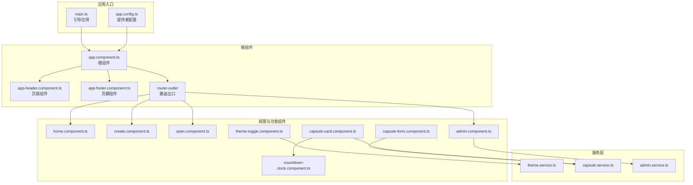
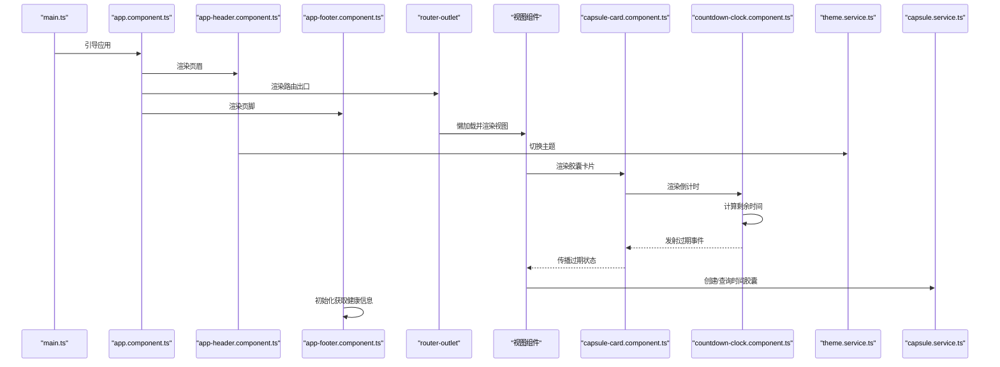
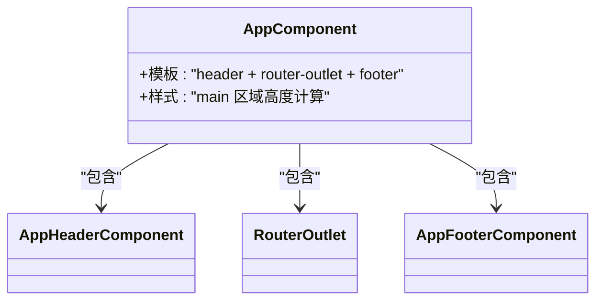
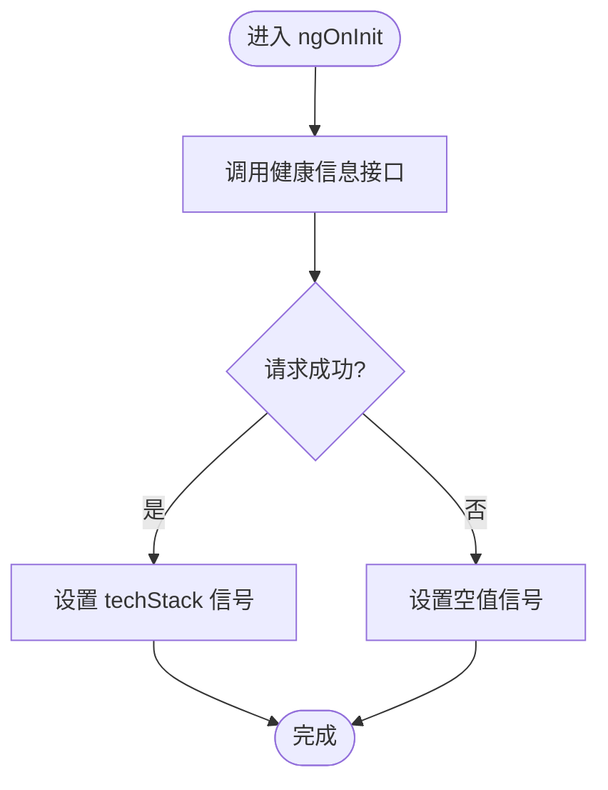
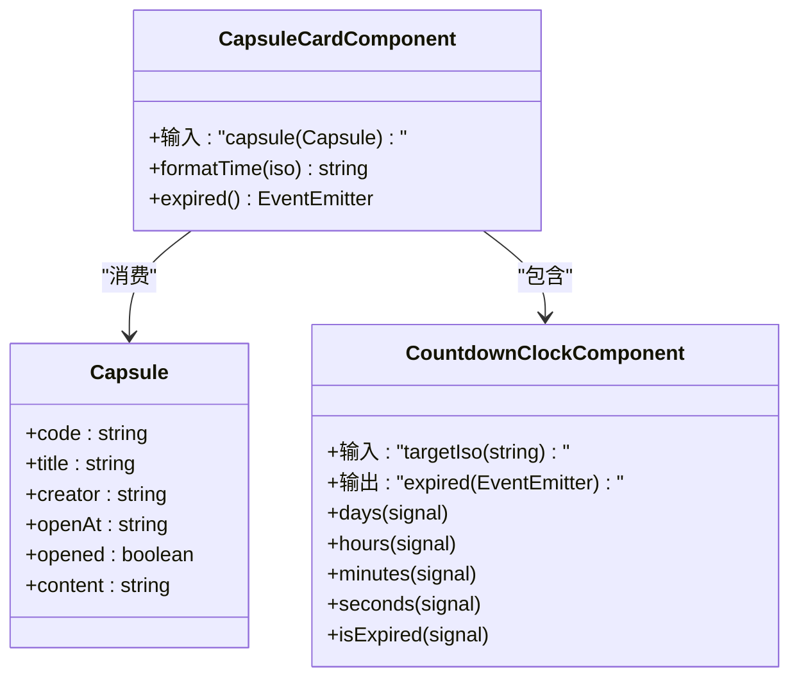
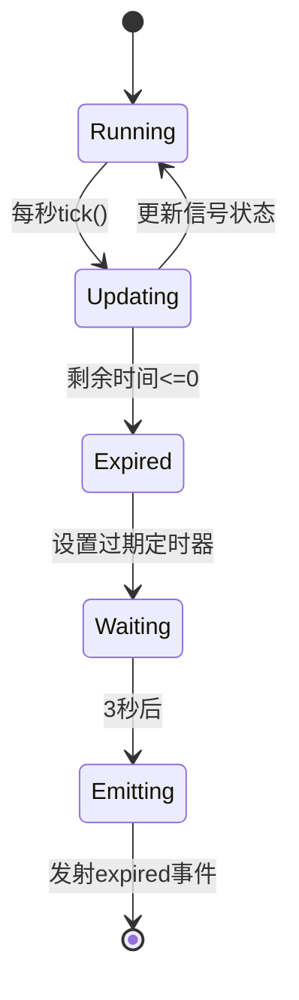
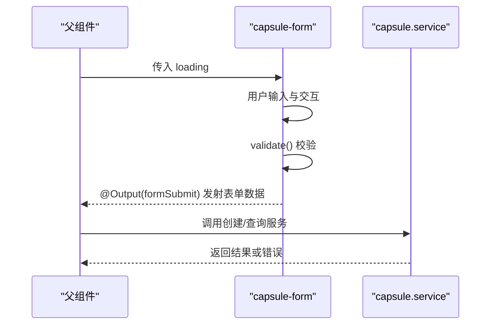
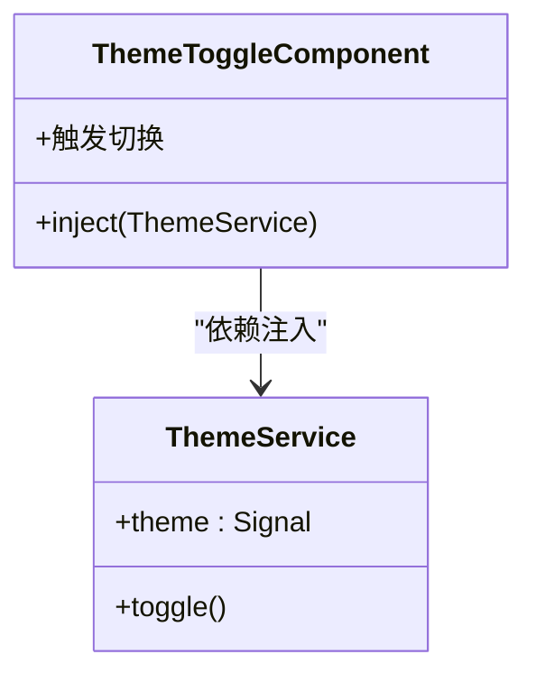
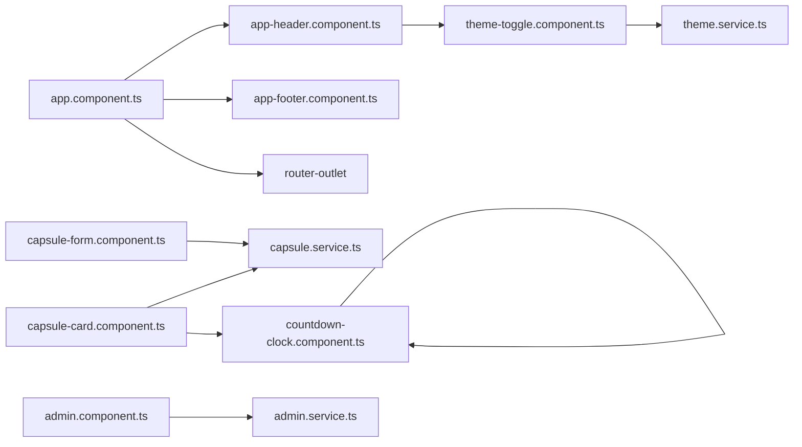

# 组件系统架构

<cite>
**本文引用的文件**
- [app.component.ts](file://frontends/angular-ts/src/app/app.component.ts)
- [app.component.html](file://frontends/angular-ts/src/app/app.component.html)
- [app.component.css](file://frontends/angular-ts/src/app/app.component.css)
- [app.config.ts](file://frontends/angular-ts/src/app/app.config.ts)
- [app.routes.ts](file://frontends/angular-ts/src/app/app.routes.ts)
- [main.ts](file://frontends/angular-ts/src/main.ts)
- [app-header.component.ts](file://frontends/angular-ts/src/app/components/app-header/app-header.component.ts)
- [app-footer.component.ts](file://frontends/angular-ts/src/app/components/app-footer/app-footer.component.ts)
- [capsule-card.component.ts](file://frontends/angular-ts/src/app/components/capsule-card/capsule-card.component.ts)
- [capsule-card.component.html](file://frontends/angular-ts/src/app/components/capsule-card/capsule-card.component.html)
- [capsule-form.component.ts](file://frontends/angular-ts/src/app/components/capsule-form/capsule-form.component.ts)
- [countdown-clock.component.ts](file://frontends/angular-ts/src/app/components/countdown-clock/countdown-clock.component.ts)
- [countdown-clock.component.html](file://frontends/angular-ts/src/app/components/countdown-clock/countdown-clock.component.html)
- [countdown-clock.component.css](file://frontends/angular-ts/src/app/components/countdown-clock/countdown-clock.component.css)
- [theme-toggle.component.ts](file://frontends/angular-ts/src/app/components/theme-toggle/theme-toggle.component.ts)
- [theme.service.ts](file://frontends/angular-ts/src/app/services/theme.service.ts)
- [capsule.service.ts](file://frontends/angular-ts/src/app/services/capsule.service.ts)
- [admin.service.ts](file://frontends/angular-ts/src/app/services/admin.service.ts)
- [index.ts](file://frontends/angular-ts/src/app/types/index.ts)
</cite>

## 目录
1. [引言](#引言)
2. [项目结构](#项目结构)
3. [核心组件](#核心组件)
4. [架构总览](#架构总览)
5. [详细组件分析](#详细组件分析)
6. [依赖分析](#依赖分析)
7. [性能考虑](#性能考虑)
8. [故障排查指南](#故障排查指南)
9. [结论](#结论)
10. [附录](#附录)

## 引言
本文件系统性梳理 HelloTime 项目中 Angular 组件系统的架构设计与实现要点，围绕组件定义、模板与样式分离、逻辑组织、生命周期钩子、组件间通信、依赖注入、核心组件设计与实现、复用与性能优化、调试技巧等方面展开，帮助读者快速理解并高效扩展该前端应用。

## 项目结构
Angular 前端采用独立组件（standalone components）与路由懒加载相结合的现代架构：
- 应用入口通过引导程序启动根组件，并在应用配置中集中提供路由器、HTTP 客户端与动画能力。
- 根组件负责页面骨架与全局布局，包含页眉、主内容区与页脚。
- 路由按需懒加载视图组件，提升首屏性能与模块化程度。
- 服务层以可观察信号为核心，提供状态管理与副作用处理。



**图表来源**
- [main.ts:1-7](file://frontends/angular-ts/src/main.ts#L1-L7)
- [app.config.ts:1-14](file://frontends/angular-ts/src/app/app.config.ts#L1-L14)
- [app.component.ts:1-14](file://frontends/angular-ts/src/app/app.component.ts#L1-L14)
- [app-header.component.ts:1-13](file://frontends/angular-ts/src/app/components/app-header/app-header.component.ts#L1-L13)
- [app-footer.component.ts:1-21](file://frontends/angular-ts/src/app/components/app-footer/app-footer.component.ts#L1-L21)
- [app.routes.ts:1-35](file://frontends/angular-ts/src/app/app.routes.ts#L1-L35)
- [capsule-form.component.ts:1-68](file://frontends/angular-ts/src/app/components/capsule-form/capsule-form.component.ts#L1-L68)
- [capsule-card.component.ts:1-27](file://frontends/angular-ts/src/app/components/capsule-card/capsule-card.component.ts#L1-L27)
- [countdown-clock.component.ts:1-67](file://frontends/angular-ts/src/app/components/countdown-clock/countdown-clock.component.ts#L1-L67)
- [theme-toggle.component.ts:1-14](file://frontends/angular-ts/src/app/components/theme-toggle/theme-toggle.component.ts#L1-L14)
- [theme.service.ts:1-28](file://frontends/angular-ts/src/app/services/theme.service.ts#L1-L28)
- [capsule.service.ts:1-41](file://frontends/angular-ts/src/app/services/capsule.service.ts#L1-L41)
- [admin.service.ts:1-84](file://frontends/angular-ts/src/app/services/admin.service.ts#L1-L84)

**章节来源**
- [main.ts:1-7](file://frontends/angular-ts/src/main.ts#L1-L7)
- [app.config.ts:1-14](file://frontends/angular-ts/src/app/app.config.ts#L1-L14)
- [app.routes.ts:1-35](file://frontends/angular-ts/src/app/app.routes.ts#L1-L35)
- [app.component.ts:1-14](file://frontends/angular-ts/src/app/app.component.ts#L1-L14)

## 核心组件
本节聚焦于根组件与关键业务组件的设计理念与实现细节，涵盖输入输出、事件发射、服务注入、生命周期使用与最佳实践。

- 根组件（app.component）
  - 设计理念：作为页面骨架容器，仅负责布局与全局装饰元素（页眉、页脚），将导航与内容渲染交由路由出口管理；通过样式变量控制主内容区高度，确保页脚始终位于可视底部。
  - 关键点：声明式导入 RouterOutlet 与页眉/页脚组件，模板简洁，职责单一，便于维护与扩展。

- 页眉组件（app-header）
  - 设计理念：承载导航链接与主题切换入口，通过路由指令实现导航高亮，内聚主题切换能力，降低跨组件耦合。
  - 关键点：引入主题切换组件，体现"关注点分离"，便于复用与测试。

- 页脚组件（app-footer）
  - 设计理念：展示技术栈信息，异步拉取健康信息并在初始化阶段设置信号状态。
  - 生命周期：使用 ngOnInit 触发数据获取，错误兜底为默认空值，保证 UI 稳定性。

- 时间胶囊卡片组件（capsule-card）
  - 设计理念：纯展示型组件，接收只读输入，内部计算剩余时间与本地化时间格式，避免父组件承担过多渲染逻辑。
  - 输入约束：使用必需输入装饰器确保调用方传递有效数据。
  - 最佳实践：将格式化与计算逻辑封装在组件内部，便于复用与变更。
  - **新增**：集成了CountdownClock组件用于显示倒计时，通过事件发射器与父组件通信。

- **新增**：倒计时组件（countdown-clock）
  - 设计理念：专门用于显示时间倒计时的独立组件，使用Angular Signals进行状态管理，提供精确的时间计算与过期处理。
  - 状态管理：使用signal管理天、时、分、秒和过期状态，computed计算单位数组，实现响应式UI更新。
  - 生命周期：在ngOnInit中启动定时器，在ngOnDestroy中清理定时器，防止内存泄漏。
  - 事件发射：当倒计时结束时，延迟3秒发射expired事件，实现优雅的过期处理。

- 时间胶囊表单组件（capsule-form）
  - 设计理念：表单域与校验逻辑内聚，通过输出事件向上抛出标准化表单数据，实现父子解耦。
  - 输入输出：loading 状态输入、表单提交事件输出；表单模型与错误对象本地化，避免污染父组件状态。
  - 校验策略：集中式校验方法返回布尔值，结合模板侧错误提示，提升用户体验。

- 主题切换组件（theme-toggle）
  - 设计理念：最小化视图组件，通过依赖注入获取服务实例，触发主题切换动作。
  - 注入方式：使用函数式注入，简洁直观，利于测试替身。

**章节来源**
- [app.component.ts:1-14](file://frontends/angular-ts/src/app/app.component.ts#L1-L14)
- [app.component.html:1-6](file://frontends/angular-ts/src/app/app.component.html#L1-L6)
- [app.component.css:1-4](file://frontends/angular-ts/src/app/app.component.css#L1-L4)
- [app-header.component.ts:1-13](file://frontends/angular-ts/src/app/components/app-header/app-header.component.ts#L1-L13)
- [app-footer.component.ts:1-21](file://frontends/angular-ts/src/app/components/app-footer/app-footer.component.ts#L1-L21)
- [capsule-card.component.ts:1-27](file://frontends/angular-ts/src/app/components/capsule-card/capsule-card.component.ts#L1-L27)
- [capsule-card.component.html:27-28](file://frontends/angular-ts/src/app/components/capsule-card/capsule-card.component.html#L27-L28)
- [countdown-clock.component.ts:1-67](file://frontends/angular-ts/src/app/components/countdown-clock/countdown-clock.component.ts#L1-L67)
- [countdown-clock.component.html:1-24](file://frontends/angular-ts/src/app/components/countdown-clock/countdown-clock.component.html#L1-L24)
- [countdown-clock.component.css:1-111](file://frontends/angular-ts/src/app/components/countdown-clock/countdown-clock.component.css#L1-L111)
- [capsule-form.component.ts:1-68](file://frontends/angular-ts/src/app/components/capsule-form/capsule-form.component.ts#L1-L68)
- [theme-toggle.component.ts:1-14](file://frontends/angular-ts/src/app/components/theme-toggle/theme-toggle.component.ts#L1-L14)

## 架构总览
下图展示了从应用引导到组件渲染、服务交互与数据流的整体关系：



**图表来源**
- [main.ts:1-7](file://frontends/angular-ts/src/main.ts#L1-L7)
- [app.component.ts:1-14](file://frontends/angular-ts/src/app/app.component.ts#L1-L14)
- [app-header.component.ts:1-13](file://frontends/angular-ts/src/app/components/app-header/app-header.component.ts#L1-L13)
- [app-footer.component.ts:1-21](file://frontends/angular-ts/src/app/components/app-footer/app-footer.component.ts#L1-L21)
- [capsule-card.component.ts:1-27](file://frontends/angular-ts/src/app/components/capsule-card/capsule-card.component.ts#L1-L27)
- [countdown-clock.component.ts:1-67](file://frontends/angular-ts/src/app/components/countdown-clock/countdown-clock.component.ts#L1-L67)
- [theme.service.ts:1-28](file://frontends/angular-ts/src/app/services/theme.service.ts#L1-L28)
- [capsule.service.ts:1-41](file://frontends/angular-ts/src/app/services/capsule.service.ts#L1-L41)

## 详细组件分析

### 根组件（app.component）分析
- 结构与职责
  - 声明式导入 RouterOutlet 与页眉/页脚组件，模板仅包含布局占位符，符合"轻根组件"原则。
  - 样式通过 CSS 变量与固定间距计算主内容区高度，确保页脚稳定贴底。
- 最佳实践
  - 避免在根组件中放置业务逻辑，保持单一职责。
  - 使用独立组件与路由出口实现清晰的页面边界。



**图表来源**
- [app.component.ts:1-14](file://frontends/angular-ts/src/app/app.component.ts#L1-L14)
- [app-header.component.ts:1-13](file://frontends/angular-ts/src/app/components/app-header/app-header.component.ts#L1-L13)
- [app-footer.component.ts:1-21](file://frontends/angular-ts/src/app/components/app-footer/app-footer.component.ts#L1-L21)

**章节来源**
- [app.component.ts:1-14](file://frontends/angular-ts/src/app/app.component.ts#L1-L14)
- [app.component.html:1-6](file://frontends/angular-ts/src/app/app.component.html#L1-L6)
- [app.component.css:1-4](file://frontends/angular-ts/src/app/app.component.css#L1-L4)

### 页脚组件（app-footer）生命周期与数据获取
- 生命周期钩子使用
  - 在 ngOnInit 中发起异步请求，成功时写入信号，失败时回退为空值，保证 UI 不中断。
- 数据模型
  - 通过类型定义模块提供的接口描述健康信息与技术栈结构，确保类型安全。



**图表来源**
- [app-footer.component.ts:15-19](file://frontends/angular-ts/src/app/components/app-footer/app-footer.component.ts#L15-L19)
- [index.ts:42-52](file://frontends/angular-ts/src/app/types/index.ts#L42-L52)

**章节来源**
- [app-footer.component.ts:1-21](file://frontends/angular-ts/src/app/components/app-footer/app-footer.component.ts#L1-L21)
- [index.ts:1-53](file://frontends/angular-ts/src/app/types/index.ts#L1-L53)

### 时间胶囊卡片组件（capsule-card）分析
- 输入与计算
  - 必需输入 capsule，内部提供格式化时间与剩余时间计算，减少父组件负担。
- **新增**：倒计时集成
  - 集成CountdownClock组件，通过targetIso输入传递目标时间，通过expired输出事件监听过期状态。
  - 在未开启状态下显示倒计时组件，开启后显示内容区域。
- 性能建议
  - 对频繁计算的结果进行缓存或使用纯函数，避免在变更检测中重复计算。
  - 若列表较大，结合 trackBy 或虚拟滚动优化渲染。



**图表来源**
- [capsule-card.component.ts:12-26](file://frontends/angular-ts/src/app/components/capsule-card/capsule-card.component.ts#L12-L26)
- [countdown-clock.component.ts:14-32](file://frontends/angular-ts/src/app/components/countdown-clock/countdown-clock.component.ts#L14-L32)
- [index.ts:6-14](file://frontends/angular-ts/src/app/types/index.ts#L6-L14)

**章节来源**
- [capsule-card.component.ts:1-27](file://frontends/angular-ts/src/app/components/capsule-card/capsule-card.component.ts#L1-L27)
- [capsule-card.component.html:27-28](file://frontends/angular-ts/src/app/components/capsule-card/capsule-card.component.html#L27-L28)
- [index.ts:1-53](file://frontends/angular-ts/src/app/types/index.ts#L1-L53)

### **新增**：倒计时组件（countdown-clock）分析
- **Signals状态管理**
  - 使用signal管理天、时、分、秒和过期状态，提供精确的时间计算。
  - 使用computed计算单位数组，自动响应信号变化，实现响应式UI更新。
- **生命周期与定时器管理**
  - 在ngOnInit中启动定时器，每秒调用tick()方法更新时间状态。
  - 在ngOnDestroy中清理定时器和过期定时器，防止内存泄漏和重复执行。
- **时间计算逻辑**
  - 计算目标时间与当前时间的差值，转换为天、时、分、秒。
  - 当剩余时间为0或负数时，标记为过期状态，停止定时器。
- **事件发射与延迟处理**
  - 过期后延迟3秒发射expired事件，实现优雅的过期处理。
  - 使用setTimeout确保事件在UI更新完成后触发。
- **模板与样式**
  - 条件渲染：过期时显示庆祝消息，否则显示倒计时界面。
  - 响应式设计：支持移动端适配，数字显示使用等宽字体。



**图表来源**
- [countdown-clock.component.ts:34-61](file://frontends/angular-ts/src/app/components/countdown-clock/countdown-clock.component.ts#L34-L61)
- [countdown-clock.component.html:1-24](file://frontends/angular-ts/src/app/components/countdown-clock/countdown-clock.component.html#L1-L24)

**章节来源**
- [countdown-clock.component.ts:1-67](file://frontends/angular-ts/src/app/components/countdown-clock/countdown-clock.component.ts#L1-L67)
- [countdown-clock.component.html:1-24](file://frontends/angular-ts/src/app/components/countdown-clock/countdown-clock.component.html#L1-L24)
- [countdown-clock.component.css:1-111](file://frontends/angular-ts/src/app/components/countdown-clock/countdown-clock.component.css#L1-L111)

### 时间胶囊表单组件（capsule-form）分析
- 输入输出与事件发射
  - 输入 loading 控制父组件的加载态；输出 formSubmit 向上传递标准化表单数据。
- 表单校验与错误提示
  - 集中式 validate 方法统一校验规则，模板侧根据错误对象显示提示，提升一致性与可维护性。
- 最佳实践
  - 将表单模型与错误对象本地化，避免污染父组件状态。
  - 使用最小可行事件载荷，减少不必要的变更传播。



**图表来源**
- [capsule-form.component.ts:12-66](file://frontends/angular-ts/src/app/components/capsule-form/capsule-form.component.ts#L12-L66)
- [capsule.service.ts:11-24](file://frontends/angular-ts/src/app/services/capsule.service.ts#L11-L24)

**章节来源**
- [capsule-form.component.ts:1-68](file://frontends/angular-ts/src/app/components/capsule-form/capsule-form.component.ts#L1-L68)
- [capsule.service.ts:1-41](file://frontends/angular-ts/src/app/services/capsule.service.ts#L1-L41)

### 主题切换组件（theme-toggle）与服务注入
- 注入与交互
  - 使用 inject 函数注入 ThemeService，触发主题切换，实现 UI 主题的即时更新。
- 服务实现要点
  - 通过信号保存当前主题，effect 监听变化并同步到 DOM 属性与本地存储，确保刷新后主题一致。
- 最佳实践
  - 将主题切换逻辑收敛到单一服务，避免多处分散的状态管理。



**图表来源**
- [theme-toggle.component.ts:11-13](file://frontends/angular-ts/src/app/components/theme-toggle/theme-toggle.component.ts#L11-L13)
- [theme.service.ts:6-27](file://frontends/angular-ts/src/app/services/theme.service.ts#L6-L27)

**章节来源**
- [theme-toggle.component.ts:1-14](file://frontends/angular-ts/src/app/components/theme-toggle/theme-toggle.component.ts#L1-L14)
- [theme.service.ts:1-28](file://frontends/angular-ts/src/app/services/theme.service.ts#L1-L28)

### 服务层：主题、胶囊与管理员服务
- ThemeService
  - 提供主题信号与切换方法，effect 同步 DOM 属性与本地存储。
- CapsuleService
  - 维护胶囊实体、加载与错误信号，封装创建与查询 API 调用，统一错误处理与最终态清理。
- AdminService
  - 管理管理员令牌、分页信息与胶囊列表，提供登录、登出、分页查询与删除操作，使用计算信号表达登录态。

```mermaid
classDiagram
class ThemeService {
+theme : Signal<Theme>
+toggle()
}
class CapsuleService {
+capsule : Signal<Capsule|null>
+loading : Signal<boolean>
+error : Signal<string|null>
+create(form)
+get(code)
}
class AdminService {
+token : Signal<string|null>
+capsules : Signal<Capsule[]>
+pageInfo : Signal<PageInfo>
+isLoggedIn : Computed<boolean)
+login(password)
+logout()
+fetchCapsules(page)
+deleteCapsule(code)
}
```

**图表来源**
- [theme.service.ts:6-27](file://frontends/angular-ts/src/app/services/theme.service.ts#L6-L27)
- [capsule.service.ts:5-40](file://frontends/angular-ts/src/app/services/capsule.service.ts#L5-L40)
- [admin.service.ts:7-83](file://frontends/angular-ts/src/app/services/admin.service.ts#L7-L83)

**章节来源**
- [theme.service.ts:1-28](file://frontends/angular-ts/src/app/services/theme.service.ts#L1-L28)
- [capsule.service.ts:1-41](file://frontends/angular-ts/src/app/services/capsule.service.ts#L1-L41)
- [admin.service.ts:1-84](file://frontends/angular-ts/src/app/services/admin.service.ts#L1-L84)

## 依赖分析
- 组件依赖
  - 根组件依赖页眉、页脚与路由出口；页眉依赖主题切换组件；表单与卡片组件分别依赖服务层。
  - **新增**：capsule-card组件依赖countdown-clock组件，实现倒计时功能。
- 服务依赖
  - 服务之间无直接依赖，通过 API 模块与类型模块间接耦合，降低耦合度。
- 路由与懒加载
  - 路由配置采用动态导入，按需加载视图组件，提升首屏性能与模块边界清晰度。



**图表来源**
- [app.component.ts:1-14](file://frontends/angular-ts/src/app/app.component.ts#L1-L14)
- [app-header.component.ts:1-13](file://frontends/angular-ts/src/app/components/app-header/app-header.component.ts#L1-L13)
- [theme-toggle.component.ts:1-14](file://frontends/angular-ts/src/app/components/theme-toggle/theme-toggle.component.ts#L1-L14)
- [capsule-form.component.ts:1-68](file://frontends/angular-ts/src/app/components/capsule-form/capsule-form.component.ts#L1-L68)
- [capsule-card.component.ts:1-27](file://frontends/angular-ts/src/app/components/capsule-card/capsule-card.component.ts#L1-L27)
- [countdown-clock.component.ts:1-67](file://frontends/angular-ts/src/app/components/countdown-clock/countdown-clock.component.ts#L1-L67)
- [admin.service.ts:1-84](file://frontends/angular-ts/src/app/services/admin.service.ts#L1-L84)

**章节来源**
- [app.routes.ts:1-35](file://frontends/angular-ts/src/app/app.routes.ts#L1-L35)

## 性能考虑
- 懒加载与按需渲染
  - 路由懒加载减少初始包体积，仅在访问对应路径时加载视图组件。
- 信号与变更检测
  - 使用信号替代传统响应式流，减少不必要的变更检测开销；合理拆分状态，避免大范围抖动。
  - **新增**：CountdownClock组件使用Signals进行精确的状态管理，computed计算仅在依赖信号变化时重新计算。
- 组件职责与渲染
  - 将计算逻辑下沉至组件内部，减少父组件渲染压力；对长列表使用虚拟滚动或分页策略。
  - **新增**：CountdownClock组件通过独立的定时器管理，避免影响其他组件的性能。
- 样式与布局
  - 使用 CSS 变量与相对单位，减少重排与重绘；避免在组件内执行昂贵的样式计算。
- 服务层优化
  - 统一错误处理与加载态管理，避免重复请求与竞态条件；必要时引入缓存策略。

## 故障排查指南
- 生命周期钩子常见问题
  - 在 ngOnInit 中进行异步请求时，务必处理异常并设置兜底状态，防止 UI 中断。
  - 如需 DOM 操作，请在 AfterViewInit 钩子中进行，避免变更检测期间的不确定性。
  - **新增**：CountdownClock组件需要特别注意定时器的清理，确保在组件销毁时清除所有定时器。
- 输入输出与事件发射
  - 确保 @Input 的必需参数在父组件正确传递；使用 @Output 时，约定最小事件载荷，避免过度渲染。
  - **新增**：CountdownClock组件的targetIso输入必须是有效的ISO时间字符串，否则会导致NaN计算。
- 服务状态与副作用
  - 检查信号的设置时机与 finally 块的清理逻辑，确保 loading/error 状态最终被重置。
  - 对主题切换与本地存储的同步，确认 effect 是否正确执行且无循环依赖。
- **新增**：倒计时组件调试技巧
  - 使用浏览器开发者工具的 Angular DevTools 查看组件树与信号状态。
  - 在CountdownClock组件中添加console.log输出tick()方法的执行情况。
  - 检查定时器是否正确清理，避免内存泄漏。
  - 验证过期事件的延迟机制，确保3秒延迟的setTimeout正确执行。
- 调试技巧
  - 使用浏览器开发者工具的 Angular DevTools 查看组件树与信号状态。
  - 在服务层添加日志或断点，定位网络请求与状态更新的时间线。
  - 对复杂表单校验，可在 validate 方法前后打印表单对象，快速定位问题字段。

**章节来源**
- [app-footer.component.ts:15-19](file://frontends/angular-ts/src/app/components/app-footer/app-footer.component.ts#L15-L19)
- [capsule-form.component.ts:36-66](file://frontends/angular-ts/src/app/components/capsule-form/capsule-form.component.ts#L36-L66)
- [capsule.service.ts:11-24](file://frontends/angular-ts/src/app/services/capsule.service.ts#L11-L24)
- [theme.service.ts:16-22](file://frontends/angular-ts/src/app/services/theme.service.ts#L16-L22)
- [countdown-clock.component.ts:39-42](file://frontends/angular-ts/src/app/components/countdown-clock/countdown-clock.component.ts#L39-L42)
- [countdown-clock.component.ts:44-61](file://frontends/angular-ts/src/app/components/countdown-clock/countdown-clock.component.ts#L44-L61)

## 结论
HelloTime 的 Angular 组件系统以"轻根组件 + 独立组件 + 信号服务"的组合实现了清晰的职责划分与良好的可维护性。通过路由懒加载、输入输出与事件发射、依赖注入与信号状态管理，系统在功能扩展与性能表现上均具备良好基础。

**新增的CountdownClock组件**进一步丰富了组件系统的功能，展示了Angular Signals在状态管理方面的强大能力。该组件通过独立的状态管理、精确的定时器控制和优雅的事件发射机制，为用户提供了流畅的倒计时体验。

建议在后续迭代中持续强化类型约束、错误边界与可观测性，进一步提升开发效率与运行稳定性。

## 附录
- 类型定义概览
  - 时间胶囊实体、创建表单、通用响应、分页数据、管理员令牌与健康信息等类型在类型模块中集中定义，确保前后端契约一致。
- 路由配置要点
  - 采用动态导入加载视图组件，支持具名参数（如打开页面的 code）与组件级输入绑定，提升路由语义与可测试性。
- **新增**：组件复用策略
  - CountdownClock组件作为独立组件，可以在多个场景中复用，如活动倒计时、促销提醒等。
  - 通过Signals状态管理，组件具有良好的性能表现和可预测的行为。

**章节来源**
- [index.ts:1-53](file://frontends/angular-ts/src/app/types/index.ts#L1-L53)
- [app.routes.ts:1-35](file://frontends/angular-ts/src/app/app.routes.ts#L1-L35)
- [countdown-clock.component.ts:1-67](file://frontends/angular-ts/src/app/components/countdown-clock/countdown-clock.component.ts#L1-L67)