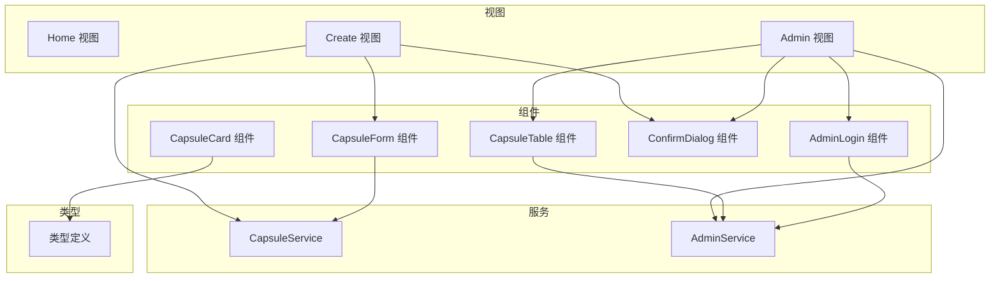
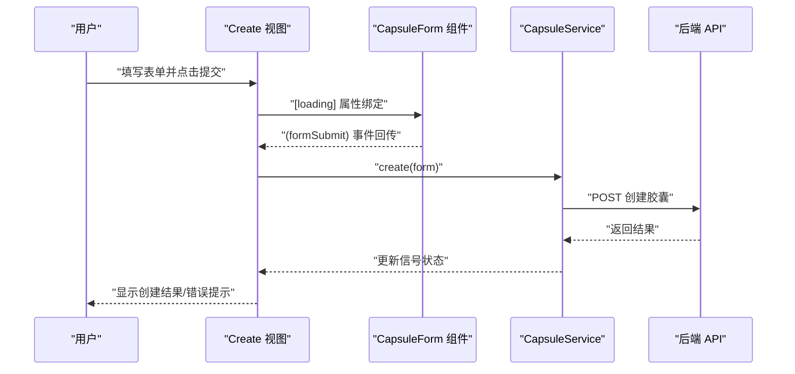
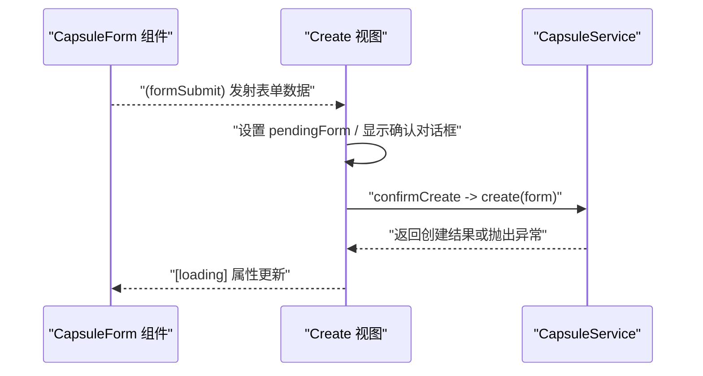
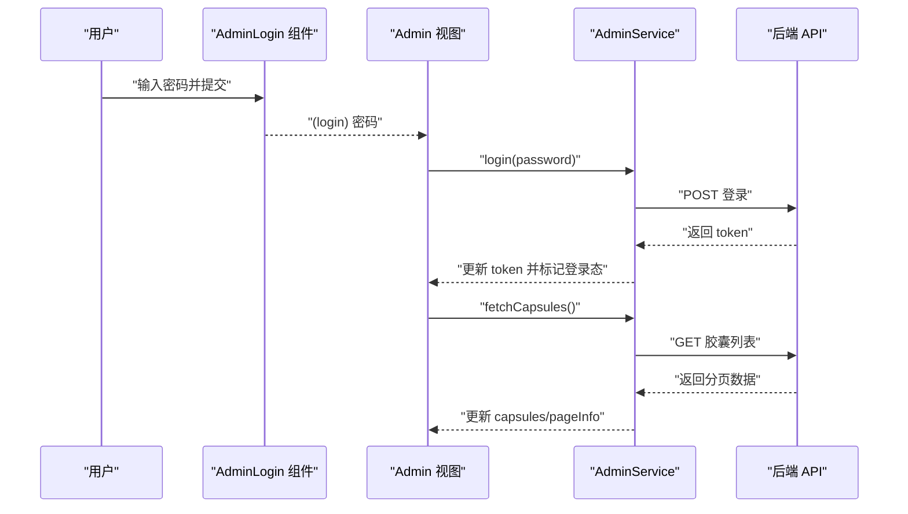
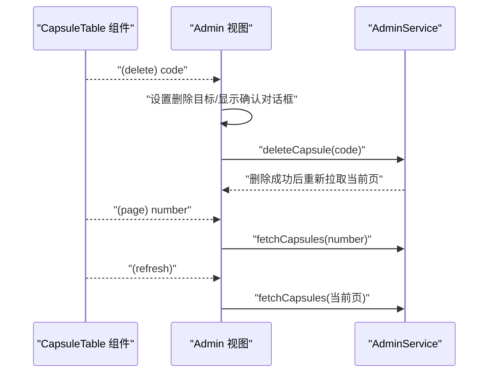
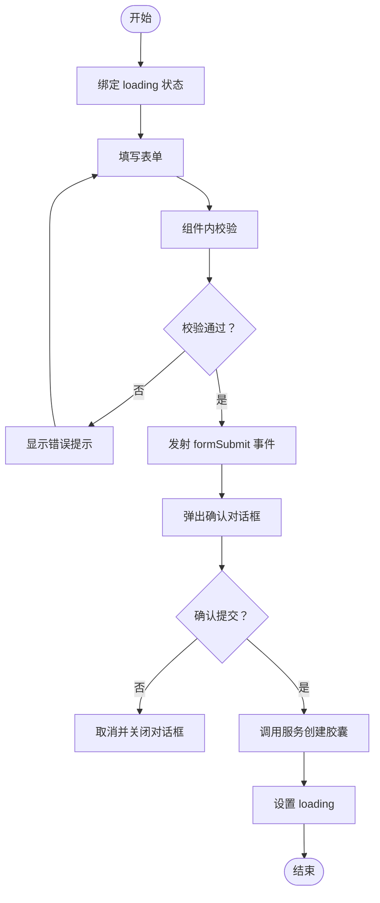
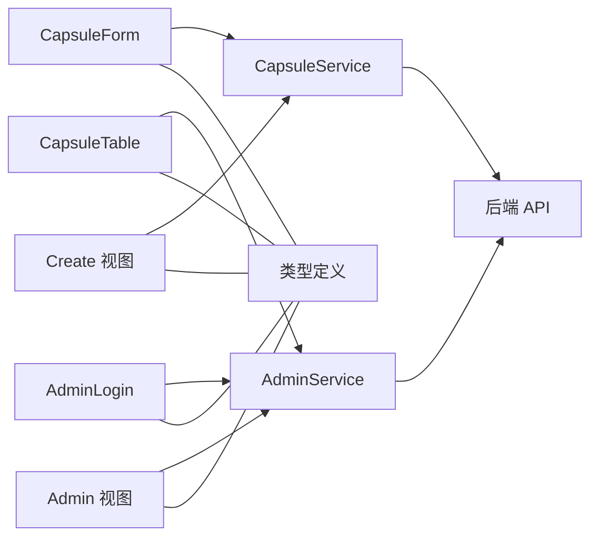

# 组件通信模式

<cite>
**本文引用的文件**
- [capsule-card.component.ts](file://frontends/angular-ts/src/app/components/capsule-card/capsule-card.component.ts)
- [capsule-form.component.ts](file://frontends/angular-ts/src/app/components/capsule-form/capsule-form.component.ts)
- [capsule-form.component.html](file://frontends/angular-ts/src/app/components/capsule-form/capsule-form.component.html)
- [capsule-table.component.ts](file://frontends/angular-ts/src/app/components/capsule-table/capsule-table.component.ts)
- [capsule-table.component.html](file://frontends/angular-ts/src/app/components/capsule-table/capsule-table.component.html)
- [admin-login.component.ts](file://frontends/angular-ts/src/app/components/admin-login/admin-login.component.ts)
- [admin-login.component.html](file://frontends/angular-ts/src/app/components/admin-login/admin-login.component.html)
- [admin.component.ts](file://frontends/angular-ts/src/app/views/admin/admin.component.ts)
- [admin.component.html](file://frontends/angular-ts/src/app/views/admin/admin.component.html)
- [create.component.ts](file://frontends/angular-ts/src/app/views/create/create.component.ts)
- [create.component.html](file://frontends/angular-ts/src/app/views/create/create.component.html)
- [capsule.service.ts](file://frontends/angular-ts/src/app/services/capsule.service.ts)
- [admin.service.ts](file://frontends/angular-ts/src/app/services/admin.service.ts)
- [index.ts](file://frontends/angular-ts/src/app/types/index.ts)
</cite>

## 目录
1. [引言](#引言)
2. [项目结构](#项目结构)
3. [核心组件](#核心组件)
4. [架构总览](#架构总览)
5. [详细组件分析](#详细组件分析)
6. [依赖关系分析](#依赖关系分析)
7. [性能考量](#性能考量)
8. [故障排查指南](#故障排查指南)
9. [结论](#结论)
10. [附录](#附录)

## 引言
本文件系统性梳理 HelloTime 项目中 Angular 组件通信模式，围绕以下目标展开：
- 深入解释组件间通信的各种方式与适用场景
- 详解 @Input/@Output 装饰器的使用方法（属性绑定、事件发射、双向数据绑定）
- 解释服务通信模式（共享服务）如何实现跨层级通信
- 说明 ViewChild/ContentChild 的使用场景与注意事项（本项目未直接使用，但可作为扩展建议）
- 解释 EventEmitter 的使用与自定义事件创建
- 结合 HelloTime 实际场景：CapsuleCard 与 CapsuleForm 的数据传递、管理员界面与子组件的交互等
- 提供最佳实践：数据流向设计、避免紧耦合、性能优化
- 在复杂组件树中选择合适通信方式的原则

## 项目结构
HelloTime 前端采用 Angular 单体应用结构，按功能域组织组件与视图：
- 视图层：home、create、admin 等页面组件
- 组件层：通用 UI 组件（如 CapsuleForm、CapsuleTable、AdminLogin、ConfirmDialog 等）
- 服务层：封装数据访问与状态管理（CapsuleService、AdminService）
- 类型定义：统一的数据契约（Capsule、CreateCapsuleForm、PageData 等）

图表来源
- [create.component.ts:1-54](file://frontends/angular-ts/src/app/views/create/create.component.ts#L1-L54)
- [admin.component.ts:1-45](file://frontends/angular-ts/src/app/views/admin/admin.component.ts#L1-L45)
- [capsule-form.component.ts:1-68](file://frontends/angular-ts/src/app/components/capsule-form/capsule-form.component.ts#L1-L68)
- [capsule-table.component.ts:1-37](file://frontends/angular-ts/src/app/components/capsule-table/capsule-table.component.ts#L1-L37)
- [admin-login.component.ts:1-24](file://frontends/angular-ts/src/app/components/admin-login/admin-login.component.ts#L1-L24)
- [capsule.service.ts:1-41](file://frontends/angular-ts/src/app/services/capsule.service.ts#L1-L41)
- [admin.service.ts:1-84](file://frontends/angular-ts/src/app/services/admin.service.ts#L1-L84)
- [index.ts:1-53](file://frontends/angular-ts/src/app/types/index.ts#L1-L53)

章节来源
- [create.component.ts:1-54](file://frontends/angular-ts/src/app/views/create/create.component.ts#L1-L54)
- [admin.component.ts:1-45](file://frontends/angular-ts/src/app/views/admin/admin.component.ts#L1-L45)
- [index.ts:1-53](file://frontends/angular-ts/src/app/types/index.ts#L1-L53)

## 核心组件
本节聚焦与通信密切相关的组件及其职责：
- CapsuleForm：负责表单输入与校验，通过输出事件向父组件传递表单数据
- CapsuleTable：负责展示胶囊列表与分页，向上游发出删除、翻页、刷新等事件
- AdminLogin：负责管理员登录，向上游发出登录凭据
- Admin 视图：协调登录态、调用服务获取数据并处理用户交互
- Create 视图：协调表单提交流程，与服务交互并展示结果
- CapsuleCard：接收胶囊数据并渲染，用于详情或卡片展示
- 服务层：CapsuleService、AdminService 提供跨组件共享的状态与数据流

章节来源
- [capsule-form.component.ts:1-68](file://frontends/angular-ts/src/app/components/capsule-form/capsule-form.component.ts#L1-L68)
- [capsule-table.component.ts:1-37](file://frontends/angular-ts/src/app/components/capsule-table/capsule-table.component.ts#L1-L37)
- [admin-login.component.ts:1-24](file://frontends/angular-ts/src/app/components/admin-login/admin-login.component.ts#L1-L24)
- [admin.component.ts:1-45](file://frontends/angular-ts/src/app/views/admin/admin.component.ts#L1-L45)
- [create.component.ts:1-54](file://frontends/angular-ts/src/app/views/create/create.component.ts#L1-L54)
- [capsule-card.component.ts:1-37](file://frontends/angular-ts/src/app/components/capsule-card/capsule-card.component.ts#L1-L37)
- [capsule.service.ts:1-41](file://frontends/angular-ts/src/app/services/capsule.service.ts#L1-L41)
- [admin.service.ts:1-84](file://frontends/angular-ts/src/app/services/admin.service.ts#L1-L84)

## 架构总览
下图展示了关键组件与服务之间的数据与事件流向，体现“自上而下属性注入 + 自下而上事件回传”的双向通信模式。

图表来源
- [create.component.html:26-33](file://frontends/angular-ts/src/app/views/create/create.component.html#L26-L33)
- [capsule-form.component.html:1-72](file://frontends/angular-ts/src/app/components/capsule-form/capsule-form.component.html#L1-L72)
- [capsule-form.component.ts:12-66](file://frontends/angular-ts/src/app/components/capsule-form/capsule-form.component.ts#L12-L66)
- [create.component.ts:27-42](file://frontends/angular-ts/src/app/views/create/create.component.ts#L27-L42)
- [capsule.service.ts:11-24](file://frontends/angular-ts/src/app/services/capsule.service.ts#L11-L24)

章节来源
- [create.component.html:26-33](file://frontends/angular-ts/src/app/views/create/create.component.html#L26-L33)
- [capsule-form.component.html:1-72](file://frontends/angular-ts/src/app/components/capsule-form/capsule-form.component.html#L1-L72)
- [capsule-form.component.ts:12-66](file://frontends/angular-ts/src/app/components/capsule-form/capsule-form.component.ts#L12-L66)
- [create.component.ts:27-42](file://frontends/angular-ts/src/app/views/create/create.component.ts#L27-L42)
- [capsule.service.ts:11-24](file://frontends/angular-ts/src/app/services/capsule.service.ts#L11-L24)

## 详细组件分析

### 输入/输出装饰器与双向绑定：CapsuleForm 与 Create 视图
- 属性绑定（@Input）：Create 视图将 loading 状态传入 CapsuleForm，控制按钮禁用与文案
- 事件发射（@Output）：CapsuleForm 通过 formSubmit 事件向外发送表单数据
- 双向绑定（[(ngModel)]）：表单字段与本地 form 对象双向同步，便于校验与提交
- 表单校验：组件内部 validate 方法维护 errors 字典，结合模板条件渲染错误提示
- 流程要点：Create 视图在收到 formSubmit 后，弹出二次确认对话框，确认后再调用服务执行创建

图表来源
- [create.component.html:26-33](file://frontends/angular-ts/src/app/views/create/create.component.html#L26-L33)
- [capsule-form.component.html:1-72](file://frontends/angular-ts/src/app/components/capsule-form/capsule-form.component.html#L1-L72)
- [capsule-form.component.ts:12-66](file://frontends/angular-ts/src/app/components/capsule-form/capsule-form.component.ts#L12-L66)
- [create.component.ts:27-42](file://frontends/angular-ts/src/app/views/create/create.component.ts#L27-L42)
- [capsule.service.ts:11-24](file://frontends/angular-ts/src/app/services/capsule.service.ts#L11-L24)

章节来源
- [capsule-form.component.ts:12-66](file://frontends/angular-ts/src/app/components/capsule-form/capsule-form.component.ts#L12-L66)
- [capsule-form.component.html:1-72](file://frontends/angular-ts/src/app/components/capsule-form/capsule-form.component.html#L1-L72)
- [create.component.ts:27-42](file://frontends/angular-ts/src/app/views/create/create.component.ts#L27-L42)
- [create.component.html:26-33](file://frontends/angular-ts/src/app/views/create/create.component.html#L26-L33)

### 服务通信模式：AdminService 与 Admin 视图
- 共享状态：AdminService 使用 signal 管理 token、capsules、pageInfo、loading、error 等状态
- 跨层级通信：Admin 视图无需逐层传递，直接注入 AdminService 获取/更新状态
- 事件驱动：AdminLogin 组件通过 login 事件将密码上送；Admin 视图调用服务完成登录并拉取数据
- 列表与分页：CapsuleTable 接收 capsules/pageInfo/loading，向上发出 delete/page/refresh 事件，Admin 视图统一处理

图表来源
- [admin-login.component.html:1-28](file://frontends/angular-ts/src/app/components/admin-login/admin-login.component.html#L1-L28)
- [admin-login.component.ts:12-22](file://frontends/angular-ts/src/app/components/admin-login/admin-login.component.ts#L12-L22)
- [admin.component.html:8-30](file://frontends/angular-ts/src/app/views/admin/admin.component.html#L8-L30)
- [admin.component.ts:26-33](file://frontends/angular-ts/src/app/views/admin/admin.component.ts#L26-L33)
- [admin.service.ts:27-67](file://frontends/angular-ts/src/app/services/admin.service.ts#L27-L67)

章节来源
- [admin-login.component.ts:12-22](file://frontends/angular-ts/src/app/components/admin-login/admin-login.component.ts#L12-L22)
- [admin-login.component.html:1-28](file://frontends/angular-ts/src/app/components/admin-login/admin-login.component.html#L1-L28)
- [admin.component.ts:26-33](file://frontends/angular-ts/src/app/views/admin/admin.component.ts#L26-L33)
- [admin.component.html:8-30](file://frontends/angular-ts/src/app/views/admin/admin.component.html#L8-L30)
- [admin.service.ts:27-67](file://frontends/angular-ts/src/app/services/admin.service.ts#L27-L67)

### 事件发射与自定义事件：CapsuleTable 与 Admin 视图
- 输出事件：CapsuleTable 暴露 delete/page/refresh 三个事件，分别对应删除、翻页与刷新
- 事件参数：delete 传递胶囊 code；page 传递页码索引；refresh 无参
- Admin 视图订阅这些事件并调用服务或触发重新拉取数据

图表来源
- [capsule-table.component.ts:17-19](file://frontends/angular-ts/src/app/components/capsule-table/capsule-table.component.ts#L17-L19)
- [capsule-table.component.html:40-79](file://frontends/angular-ts/src/app/components/capsule-table/capsule-table.component.html#L40-L79)
- [admin.component.html:23-30](file://frontends/angular-ts/src/app/views/admin/admin.component.html#L23-L30)
- [admin.service.ts:69-82](file://frontends/angular-ts/src/app/services/admin.service.ts#L69-L82)

章节来源
- [capsule-table.component.ts:17-19](file://frontends/angular-ts/src/app/components/capsule-table/capsule-table.component.ts#L17-L19)
- [capsule-table.component.html:40-79](file://frontends/angular-ts/src/app/components/capsule-table/capsule-table.component.html#L40-L79)
- [admin.component.html:23-30](file://frontends/angular-ts/src/app/views/admin/admin.component.html#L23-L30)
- [admin.service.ts:69-82](file://frontends/angular-ts/src/app/services/admin.service.ts#L69-L82)

### 数据流向与父子关系：Create 视图与 CapsuleCard
- 父传子：Create 视图在创建成功后，将生成的 Capsule 对象通过 @Input 传入 CapsuleCard 进行展示
- 场景价值：复用卡片组件，保持 UI 一致性与逻辑解耦

章节来源
- [capsule-card.component.ts:12-36](file://frontends/angular-ts/src/app/components/capsule-card/capsule-card.component.ts#L12-L36)
- [create.component.ts:32-42](file://frontends/angular-ts/src/app/views/create/create.component.ts#L32-L42)

### 服务通信模式：CapsuleService 与 Create 视图
- 状态共享：CapsuleService 使用 signal 管理 loading/error/capsule，Create 视图直接读取
- 请求封装：create/get 方法统一处理 loading/error，并在 finally 中重置 loading
- 适用场景：跨组件共享状态、避免层层传递与重复请求

章节来源
- [capsule.service.ts:7-24](file://frontends/angular-ts/src/app/services/capsule.service.ts#L7-L24)
- [create.component.ts:17-25](file://frontends/angular-ts/src/app/views/create/create.component.ts#L17-L25)

### 概念性流程：表单校验与提交

图表来源
- [capsule-form.component.ts:36-66](file://frontends/angular-ts/src/app/components/capsule-form/capsule-form.component.ts#L36-L66)
- [create.component.html:26-33](file://frontends/angular-ts/src/app/views/create/create.component.html#L26-L33)
- [create.component.ts:32-42](file://frontends/angular-ts/src/app/views/create/create.component.ts#L32-L42)
- [capsule.service.ts:11-24](file://frontends/angular-ts/src/app/services/capsule.service.ts#L11-L24)

## 依赖关系分析
- 组件到服务：Create 视图依赖 CapsuleService；Admin 视图依赖 AdminService
- 组件到组件：Create 视图包含 CapsuleForm 与 ConfirmDialog；Admin 视图包含 AdminLogin、CapsuleTable 与 ConfirmDialog
- 服务到 API：AdminService 与 CapsuleService 分别封装对后端接口的调用
- 类型定义：所有组件与服务共享 types/index.ts 中的接口契约

图表来源
- [capsule-form.component.ts:1-68](file://frontends/angular-ts/src/app/components/capsule-form/capsule-form.component.ts#L1-L68)
- [capsule-table.component.ts:1-37](file://frontends/angular-ts/src/app/components/capsule-table/capsule-table.component.ts#L1-L37)
- [admin-login.component.ts:1-24](file://frontends/angular-ts/src/app/components/admin-login/admin-login.component.ts#L1-L24)
- [create.component.ts:1-54](file://frontends/angular-ts/src/app/views/create/create.component.ts#L1-L54)
- [admin.component.ts:1-45](file://frontends/angular-ts/src/app/views/admin/admin.component.ts#L1-L45)
- [capsule.service.ts:1-41](file://frontends/angular-ts/src/app/services/capsule.service.ts#L1-L41)
- [admin.service.ts:1-84](file://frontends/angular-ts/src/app/services/admin.service.ts#L1-L84)
- [index.ts:1-53](file://frontends/angular-ts/src/app/types/index.ts#L1-L53)

章节来源
- [index.ts:1-53](file://frontends/angular-ts/src/app/types/index.ts#L1-L53)

## 性能考量
- 信号（signal）与变更检测：服务层使用 signal 管理状态，减少不必要的变更检测开销
- 懒加载与按需导入：组件采用 standalone 且仅导入必要模块，降低包体积
- 事件风暴防护：在 Admin 视图中，对分页与刷新事件进行去抖/合并策略（建议），避免频繁请求
- 模板渲染优化：列表渲染使用 track by（在模板中以 track capsule.code 形式出现），提升滚动性能
- 防重复提交：通过 loading 状态禁用提交按钮，避免并发请求

## 故障排查指南
- 表单校验失败：检查 CapsuleForm 的 validate 返回值与 errors 字段是否正确更新
- 事件未触发：确认父组件是否正确绑定 (formSubmit)/(delete)/(page)/(refresh)，并确保事件名大小写一致
- 服务状态未更新：检查服务中 loading/error/capsule 的 set 调用是否在 try/catch/finally 中正确执行
- 登录态失效：AdminService 依赖 sessionStorage 存储 token，若清除浏览器缓存需重新登录
- 分页异常：确认 CapsuleTable 的 pageInfo 输入与 page 事件参数一致，Admin 视图传入的页码从 0 开始

章节来源
- [capsule-form.component.ts:36-66](file://frontends/angular-ts/src/app/components/capsule-form/capsule-form.component.ts#L36-L66)
- [admin-login.component.ts:12-22](file://frontends/angular-ts/src/app/components/admin-login/admin-login.component.ts#L12-L22)
- [admin.service.ts:27-67](file://frontends/angular-ts/src/app/services/admin.service.ts#L27-L67)
- [capsule-table.component.html:60-79](file://frontends/angular-ts/src/app/components/capsule-table/capsule-table.component.html#L60-L79)

## 结论
HelloTime 项目通过“属性绑定 + 事件回传”与“共享服务”两种主要通信模式，实现了清晰、可维护的组件交互：
- 父子组件间优先使用 @Input/@Output，保证数据单向流动与职责分离
- 跨层级与跨视图共享状态使用服务层 signal，避免“祖传 props”
- 通过 ConfirmDialog 等通用组件统一交互体验，降低重复代码
- 在复杂组件树中，建议遵循“自上而下注入，自下而上回传”的原则，配合服务层集中管理状态

## 附录

### @Input/@Output 最佳实践清单
- 必填输入使用 required 选项，明确契约
- 输出事件命名语义化，携带最小必要数据
- 避免在 @Output 中传递大型对象，拆分为多个事件或传递标识符
- 在父组件中使用模板局部变量与安全调用，防止空值异常

章节来源
- [capsule-card.component.ts:12-12](file://frontends/angular-ts/src/app/components/capsule-card/capsule-card.component.ts#L12-L12)
- [capsule-form.component.ts:14-14](file://frontends/angular-ts/src/app/components/capsule-form/capsule-form.component.ts#L14-L14)
- [capsule-table.component.ts:17-19](file://frontends/angular-ts/src/app/components/capsule-table/capsule-table.component.ts#L17-L19)

### 服务通信最佳实践
- 将网络请求与错误处理集中在服务层，组件只负责 UI 逻辑
- 使用 signal 管理细粒度状态，避免大对象深拷贝
- 在服务层统一处理 loading/error，组件只需读取状态
- 对于需要持久化的令牌或配置，使用 sessionStorage/localStorage 并在服务初始化时恢复

章节来源
- [admin.service.ts:9-25](file://frontends/angular-ts/src/app/services/admin.service.ts#L9-L25)
- [capsule.service.ts:7-9](file://frontends/angular-ts/src/app/services/capsule.service.ts#L7-L9)

### 关于 ViewChild/ContentChild 的使用建议
- 适用场景：当需要在组件内部直接访问子组件实例或 DOM 元素时（例如聚焦输入框、调用子组件方法）
- 注意事项：尽量减少对宿主 DOM 的直接操作，优先通过 @Input/@Output 与服务解耦
- 在 HelloTime 中未直接使用，可在需要时谨慎引入，避免破坏组件边界

[本节为概念性建议，不涉及具体源码分析]