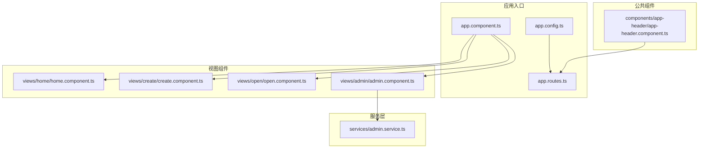
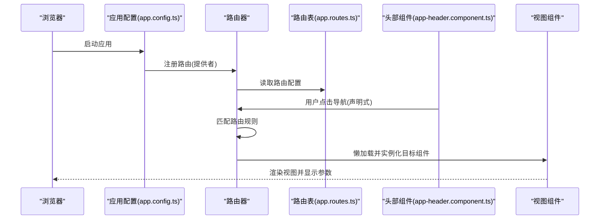
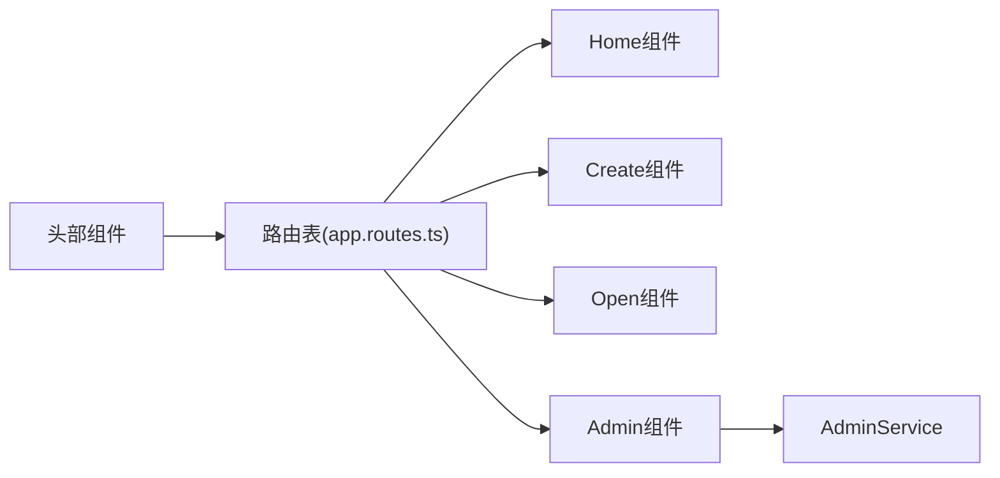

# 路由与导航系统

<cite>
**本文引用的文件**
- [app.routes.ts](file://frontends/angular-ts/src/app/app.routes.ts)
- [app.config.ts](file://frontends/angular-ts/src/app/app.config.ts)
- [app.component.ts](file://frontends/angular-ts/src/app/app.component.ts)
- [app-header.component.ts](file://frontends/angular-ts/src/app/components/app-header/app-header.component.ts)
- [home.component.ts](file://frontends/angular-ts/src/app/views/home/home.component.ts)
- [create.component.ts](file://frontends/angular-ts/src/app/views/create/create.component.ts)
- [open.component.ts](file://frontends/angular-ts/src/app/views/open/open.component.ts)
- [admin.component.ts](file://frontends/angular-ts/src/app/views/admin/admin.component.ts)
- [admin.service.ts](file://frontends/angular-ts/src/app/services/admin.service.ts)
- [@angular_router.js](file://frontends/angular-ts/.angular/cache/18.2.21/angular-ts/vite/deps/@angular_router.js)
</cite>

## 目录
1. [简介](#简介)
2. [项目结构](#项目结构)
3. [核心组件](#核心组件)
4. [架构总览](#架构总览)
5. [详细组件分析](#详细组件分析)
6. [依赖关系分析](#依赖关系分析)
7. [性能考虑](#性能考虑)
8. [故障排查指南](#故障排查指南)
9. [结论](#结论)
10. [附录](#附录)

## 简介
本文件面向HelloTime项目的Angular前端，系统性梳理路由与导航体系的设计与实现，覆盖以下主题：
- 路由声明与匹配规则
- 参数传递（路由参数与查询参数）
- 路由守卫（CanActivate、CanLoad等）的实现与应用
- 声明式导航（RouterLink）与程序化导航（Router API）的差异与场景
- 懒加载模块的配置与实现
- 性能优化（预加载策略、路由缓存）
- 路由动画与用户体验优化

## 项目结构
HelloTime的Angular前端采用标准的单页应用结构，路由集中在应用级配置中统一管理，视图组件按功能划分在views目录下，公共组件位于components目录，服务层负责数据与状态管理。

图表来源
- [app.component.ts:1-14](file://frontends/angular-ts/src/app/app.component.ts#L1-L14)
- [app.config.ts:1-14](file://frontends/angular-ts/src/app/app.config.ts#L1-L14)
- [app.routes.ts:1-35](file://frontends/angular-ts/src/app/app.routes.ts#L1-L35)
- [app-header.component.ts:1-13](file://frontends/angular-ts/src/app/components/app-header/app-header.component.ts#L1-L13)
- [admin.component.ts:1-45](file://frontends/angular-ts/src/app/views/admin/admin.component.ts#L1-L45)
- [admin.service.ts:1-84](file://frontends/angular-ts/src/app/services/admin.service.ts#L1-L84)

章节来源
- [app.component.ts:1-14](file://frontends/angular-ts/src/app/app.component.ts#L1-L14)
- [app.config.ts:1-14](file://frontends/angular-ts/src/app/app.config.ts#L1-L14)
- [app.routes.ts:1-35](file://frontends/angular-ts/src/app/app.routes.ts#L1-L35)

## 核心组件
- 应用配置与路由注册
  - 在应用配置中通过提供者注册路由器并启用组件输入绑定，确保路由参数可直接作为组件输入属性使用。
- 路由表定义
  - 定义了首页、创建胶囊、开启胶囊（含路由参数）、关于、管理员界面等路由，并采用懒加载方式按需加载视图组件。
- 视图组件
  - 各视图组件独立负责自身UI与交互逻辑，部分组件通过输入属性接收路由参数或查询参数。
- 导航组件
  - 头部组件集成声明式导航（RouterLink），用于页面内跳转。
- 管理员服务
  - 提供登录态管理、分页信息与胶囊列表获取等能力，为管理员界面提供数据支撑。

章节来源
- [app.config.ts:1-14](file://frontends/angular-ts/src/app/app.config.ts#L1-L14)
- [app.routes.ts:1-35](file://frontends/angular-ts/src/app/app.routes.ts#L1-L35)
- [app-header.component.ts:1-13](file://frontends/angular-ts/src/app/components/app-header/app-header.component.ts#L1-L13)
- [admin.service.ts:1-84](file://frontends/angular-ts/src/app/services/admin.service.ts#L1-L84)

## 架构总览
下图展示了从应用启动到路由导航的关键流程，包括路由注册、导航触发、组件加载与参数传递。

图表来源
- [app.config.ts:1-14](file://frontends/angular-ts/src/app/app.config.ts#L1-L14)
- [app.routes.ts:1-35](file://frontends/angular-ts/src/app/app.routes.ts#L1-L35)
- [app-header.component.ts:1-13](file://frontends/angular-ts/src/app/components/app-header/app-header.component.ts#L1-L13)

## 详细组件分析

### 路由声明与匹配规则
- 路由声明
  - 首页路由：空路径，懒加载Home组件。
  - 创建路由：路径为“create”，懒加载Create组件。
  - 开启路由：包含两条规则，均指向Open组件；一条带路由参数“:code”，另一条无参数但同样指向Open组件。
  - 关于路由：路径为“about”，懒加载About组件。
  - 管理员路由：路径为“admin”，懒加载Admin组件。
- 匹配规则
  - Angular按顺序匹配路由；当存在多条可能匹配时，优先匹配更精确的路由（如带参数的路由）。Open路由的两条规则体现了对“带code参数”和“无参数”的不同处理需求。
- 懒加载
  - 所有视图组件均通过loadComponent进行动态导入，实现按需加载，降低首屏体积。

章节来源
- [app.routes.ts:1-35](file://frontends/angular-ts/src/app/app.routes.ts#L1-L35)

### 参数传递：路由参数与查询参数
- 路由参数（Path Parameters）
  - Open路由定义了“:code”参数，Open组件通过输入属性接收该参数并在初始化时读取并发起查询。
- 查询参数（Query Parameters）
  - 当前Open组件未显式声明查询参数解析逻辑，但可通过路由服务读取查询参数（在实际开发中可扩展）。
- 组件输入绑定
  - 应用配置启用了withComponentInputBinding，使路由参数可直接作为组件输入属性注入，简化参数访问。

章节来源
- [app.routes.ts:14-23](file://frontends/angular-ts/src/app/app.routes.ts#L14-L23)
- [open.component.ts:14-36](file://frontends/angular-ts/src/app/views/open/open.component.ts#L14-L36)
- [app.config.ts:9](file://frontends/angular-ts/src/app/app.config.ts#L9)

### 路由守卫：CanActivate、CanLoad等
- 可用的守卫类型
  - CanActivate：控制是否允许进入某个路由。
  - CanActivateChild：控制是否允许进入子路由。
  - CanDeactivate：控制离开当前路由时的行为（如确认未保存更改）。
  - CanLoad：控制是否允许加载延迟加载的模块（通常用于权限校验）。
- 实现机制
  - 路由器在导航过程中会收集并执行相关守卫，支持函数式与类式守卫，返回值可为布尔值或重定向命令。
  - 守卫执行遵循优先级与短路策略，一旦出现false或重定向，导航将停止并执行相应动作。
- 应用场景
  - 管理员界面：可在路由上添加CanActivate以检查登录态；若未登录则重定向至登录页。
  - 懒加载模块：在模块路由上添加CanLoad以校验权限，避免未授权用户加载模块代码。
  - 离开页面：在编辑表单等场景使用CanDeactivate提示用户确认离开。

章节来源
- [@angular_router.js:2246-2497](file://frontends/angular-ts/.angular/cache/18.2.21/angular-ts/vite/deps/@angular_router.js#L2246-L2497)
- [@angular_router.js:4965-5103](file://frontends/angular-ts/.angular/cache/18.2.21/angular-ts/vite/deps/@angular_router.js#L4965-L5103)

### 声明式导航与程序化导航
- 声明式导航（RouterLink）
  - 通过RouterLink与RouterLinkActive在模板中声明导航链接，适合静态或简单跳转场景。
  - 示例：头部组件引入RouterLink与RouterLinkActive，用于站点内导航。
- 程序化导航（Router API）
  - 通过注入Router服务，在组件逻辑中动态决定跳转路径与参数，适合复杂条件判断、参数拼装与错误处理。
  - 场景示例：创建胶囊成功后，根据返回的code参数跳转至开启页面；或在管理员登录成功后跳转至管理界面。

章节来源
- [app-header.component.ts:1-13](file://frontends/angular-ts/src/app/components/app-header/app-header.component.ts#L1-L13)
- [create.component.ts:16-54](file://frontends/angular-ts/src/app/views/create/create.component.ts#L16-L54)
- [admin.component.ts:14-45](file://frontends/angular-ts/src/app/views/admin/admin.component.ts#L14-L45)

### 懒加载模块的配置与实现
- 配置要点
  - 使用loadComponent或loadChildren进行动态导入；在路由表中仅声明路径与加载函数，不直接引入组件。
  - 可结合CanLoad守卫在模块加载前进行权限校验。
- 实现流程
  - 路由器在导航到对应路由时，调用loadComponent函数动态加载模块。
  - 加载完成后实例化组件并渲染到RouterOutlet。
- 性能收益
  - 减少首屏包体，提升初始加载速度；按需加载提高资源利用率。

章节来源
- [app.routes.ts:3-34](file://frontends/angular-ts/src/app/app.routes.ts#L3-L34)
- [@angular_router.js:5017-5090](file://frontends/angular-ts/.angular/cache/18.2.21/angular-ts/vite/deps/@angular_router.js#L5017-L5090)

### 路由动画与用户体验优化
- 路由动画
  - 可通过RouterOutlet的动画钩子（如@routeAnimation）与过渡样式实现页面切换动画。
  - 建议在路由切换时保持关键元素稳定，减少不必要的重排与闪烁。
- 用户体验优化
  - 在导航开始与结束时提供加载指示，避免用户误以为页面无响应。
  - 对于需要等待网络请求的页面（如开启胶囊），在请求期间显示骨架屏或占位符。
  - 对重要操作（如删除胶囊）提供二次确认对话框，防止误操作。

## 依赖关系分析
- 组件耦合
  - 视图组件之间低耦合，通过路由与服务层进行间接通信。
  - 公共组件（如头部）仅依赖RouterLink，不直接依赖具体业务逻辑。
- 服务依赖
  - 管理员界面依赖AdminService进行登录态与数据管理。
- 路由依赖
  - 路由表集中管理所有页面路由，便于维护与扩展。

图表来源
- [app.routes.ts:1-35](file://frontends/angular-ts/src/app/app.routes.ts#L1-L35)
- [app-header.component.ts:1-13](file://frontends/angular-ts/src/app/components/app-header/app-header.component.ts#L1-L13)
- [admin.component.ts:14-45](file://frontends/angular-ts/src/app/views/admin/admin.component.ts#L14-L45)
- [admin.service.ts:1-84](file://frontends/angular-ts/src/app/services/admin.service.ts#L1-L84)

## 性能考虑
- 预加载策略
  - 可选择预加载全部模块或禁用预加载；在高带宽环境下可考虑预加载策略以提升后续导航体验。
- 路由缓存
  - 对频繁访问且数据变化不频繁的页面，可结合服务层缓存与组件生命周期进行缓存复用。
- 懒加载优化
  - 将大型第三方库拆分为独立chunk，仅在需要时加载。
  - 合理拆分路由模块，避免单个模块过大导致首次加载缓慢。
- 导航性能
  - 在导航事件中避免执行耗时任务；必要时使用异步加载与进度反馈。

章节来源
- [@angular_router.js:4965-5103](file://frontends/angular-ts/.angular/cache/18.2.21/angular-ts/vite/deps/@angular_router.js#L4965-L5103)

## 故障排查指南
- 路由无法匹配
  - 检查路由表中路径与参数定义是否正确；注意带参数与不带参数路由的优先级。
- 参数未生效
  - 确认已启用组件输入绑定；检查组件输入属性名称与路由参数一致。
- 导航无响应
  - 查看是否存在CanActivate/CanDeactivate守卫返回false或抛出异常；检查路由加载函数是否正确。
- 懒加载失败
  - 确认loadComponent函数返回的Promise已正确解析；检查模块导出与命名空间。

章节来源
- [app.routes.ts:1-35](file://frontends/angular-ts/src/app/app.routes.ts#L1-L35)
- [open.component.ts:14-36](file://frontends/angular-ts/src/app/views/open/open.component.ts#L14-L36)
- [@angular_router.js:2246-2497](file://frontends/angular-ts/.angular/cache/18.2.21/angular-ts/vite/deps/@angular_router.js#L2246-L2497)

## 结论
HelloTime的Angular路由与导航系统以清晰的路由表与懒加载为核心，配合声明式与程序化导航满足多样化的用户交互需求。通过合理使用路由守卫与服务层，可有效保障安全性与可维护性。建议在现有基础上进一步完善守卫策略、预加载与动画体验，持续优化性能与用户体验。

## 附录
- 路由设计要点速览
  - 路由声明：集中于路由表，采用懒加载与组件输入绑定。
  - 参数传递：支持路由参数与查询参数，Open组件示例展示了路由参数的接收与使用。
  - 导航方式：声明式（RouterLink）与程序化（Router API）互补。
  - 守卫体系：可扩展CanActivate、CanLoad、CanDeactivate等守卫以满足安全与用户体验需求。
  - 性能优化：结合预加载策略与懒加载模块，提升首屏与后续导航性能。