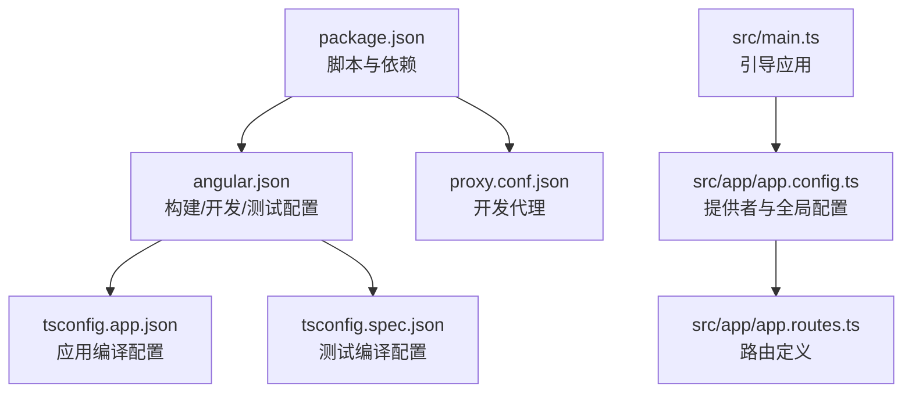
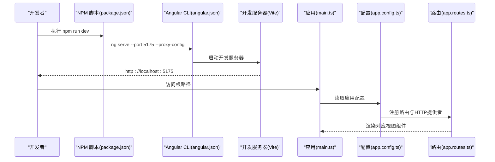
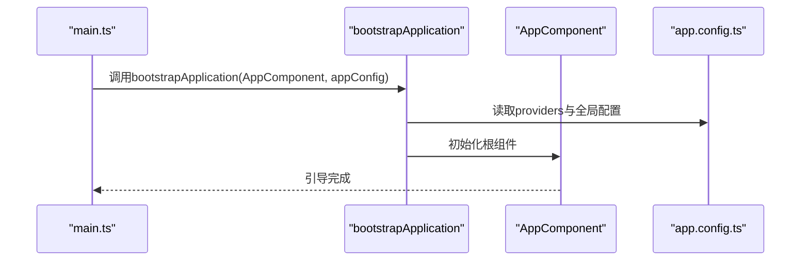
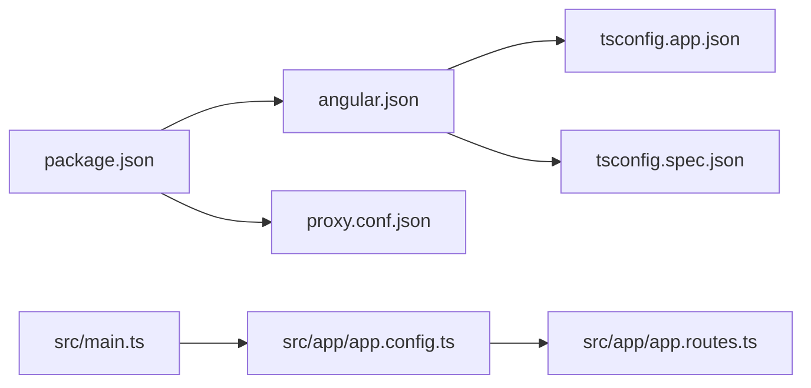

# 项目初始化与配置

<cite>
**本文引用的文件**
- [package.json](file://frontends/angular-ts/package.json)
- [angular.json](file://frontends/angular-ts/angular.json)
- [tsconfig.json](file://frontends/angular-ts/tsconfig.json)
- [tsconfig.app.json](file://frontends/angular-ts/tsconfig.app.json)
- [tsconfig.spec.json](file://frontends/angular-ts/tsconfig.spec.json)
- [main.ts](file://frontends/angular-ts/src/main.ts)
- [app.config.ts](file://frontends/angular-ts/src/app/app.config.ts)
- [app.routes.ts](file://frontends/angular-ts/src/app/app.routes.ts)
- [proxy.conf.json](file://frontends/angular-ts/proxy.conf.json)
- [README.md](file://frontends/angular-ts/README.md)
</cite>

## 目录
1. [简介](#简介)
2. [项目结构](#项目结构)
3. [核心组件](#核心组件)
4. [架构总览](#架构总览)
5. [详细组件分析](#详细组件分析)
6. [依赖关系分析](#依赖关系分析)
7. [性能考虑](#性能考虑)
8. [故障排除指南](#故障排除指南)
9. [结论](#结论)
10. [附录](#附录)

## 简介
本文件面向Angular 18项目的初始化与配置，围绕以下目标展开：  
- 解释Angular CLI如何驱动项目初始化、生成项目结构与安装依赖  
- 详解package.json中的关键依赖项及其版本范围与职责  
- 阐述tsconfig系列配置文件的编译选项、路径映射与严格模式  
- 说明main.ts中的引导流程与Standalone应用启动方式  
- 解析app.config.ts中的应用配置（提供者注册、HTTP客户端、动画与路由配置）  
- 提供启动、构建、测试的具体命令与参数说明  

该Angular 18项目采用Standalone组件与应用配置，不使用NgModule样板代码，结合TypeScript严格模式、Karma+Jasmine测试、以及Vite作为开发服务器，形成现代化的前端工程化实践。

## 项目结构
Angular 18前端位于frontends/angular-ts目录，采用Standalone组件与应用配置，核心入口与配置如下：
- 入口脚本与依赖声明：package.json
- 构建与开发服务器配置：angular.json
- TypeScript编译配置：tsconfig.json、tsconfig.app.json、tsconfig.spec.json
- 应用引导入口：src/main.ts
- 应用配置：src/app/app.config.ts
- 路由定义：src/app/app.routes.ts
- 开发代理：proxy.conf.json

图表来源
- [package.json:1-38](file://frontends/angular-ts/package.json#L1-L38)
- [angular.json:1-108](file://frontends/angular-ts/angular.json#L1-L108)
- [tsconfig.app.json:1-34](file://frontends/angular-ts/tsconfig.app.json#L1-L34)
- [tsconfig.spec.json:1-25](file://frontends/angular-ts/tsconfig.spec.json#L1-L25)
- [main.ts:1-7](file://frontends/angular-ts/src/main.ts#L1-L7)
- [app.config.ts:1-14](file://frontends/angular-ts/src/app/app.config.ts#L1-L14)
- [app.routes.ts:1-35](file://frontends/angular-ts/src/app/app.routes.ts#L1-L35)
- [proxy.conf.json:1-8](file://frontends/angular-ts/proxy.conf.json#L1-L8)

章节来源
- [package.json:1-38](file://frontends/angular-ts/package.json#L1-L38)
- [angular.json:1-108](file://frontends/angular-ts/angular.json#L1-L108)
- [tsconfig.json:1-9](file://frontends/angular-ts/tsconfig.json#L1-L9)
- [tsconfig.app.json:1-34](file://frontends/angular-ts/tsconfig.app.json#L1-L34)
- [tsconfig.spec.json:1-25](file://frontends/angular-ts/tsconfig.spec.json#L1-L25)
- [main.ts:1-7](file://frontends/angular-ts/src/main.ts#L1-L7)
- [app.config.ts:1-14](file://frontends/angular-ts/src/app/app.config.ts#L1-L14)
- [app.routes.ts:1-35](file://frontends/angular-ts/src/app/app.routes.ts#L1-L35)
- [proxy.conf.json:1-8](file://frontends/angular-ts/proxy.conf.json#L1-L8)
- [README.md:1-283](file://frontends/angular-ts/README.md#L1-L283)

## 核心组件
- Angular CLI与项目初始化：通过CLI生成Standalone组件模板、Standalone指令与管道，统一风格与最佳实践
- 应用引导：使用bootstrapApplication启动根组件与应用配置
- 应用配置：集中注册路由、HTTP客户端、动画等提供者
- 路由系统：基于withComponentInputBinding启用路由参数到组件输入的自动绑定，配合懒加载
- TypeScript编译：严格模式、ES2022目标、路径别名、Bundler模块解析
- 开发代理：将/api前缀转发至后端服务地址

章节来源
- [angular.json:8-18](file://frontends/angular-ts/angular.json#L8-L18)
- [main.ts:1-7](file://frontends/angular-ts/src/main.ts#L1-L7)
- [app.config.ts:1-14](file://frontends/angular-ts/src/app/app.config.ts#L1-L14)
- [app.routes.ts:1-35](file://frontends/angular-ts/src/app/app.routes.ts#L1-L35)
- [tsconfig.app.json:6-22](file://frontends/angular-ts/tsconfig.app.json#L6-L22)
- [proxy.conf.json:1-8](file://frontends/angular-ts/proxy.conf.json#L1-L8)

## 架构总览
下图展示从开发命令到应用启动、构建与测试的关键流程：

图表来源
- [package.json:5-10](file://frontends/angular-ts/package.json#L5-L10)
- [angular.json:67-78](file://frontends/angular-ts/angular.json#L67-L78)
- [main.ts:1-7](file://frontends/angular-ts/src/main.ts#L1-L7)
- [app.config.ts:7-13](file://frontends/angular-ts/src/app/app.config.ts#L7-L13)
- [app.routes.ts:1-35](file://frontends/angular-ts/src/app/app.routes.ts#L1-L35)

## 详细组件分析

### Angular CLI与项目初始化
- 组件/指令/管道默认模板：Standalone风格，统一样式为CSS
- 项目类型与源码根目录：application与src
- 构建器与开发服务器：application与dev-server
- 默认配置：生产与开发环境的差异化预算与优化策略

章节来源
- [angular.json:6-19](file://frontends/angular-ts/angular.json#L6-L19)
- [angular.json:23-78](file://frontends/angular-ts/angular.json#L23-L78)

### package.json中的关键依赖与脚本
- 脚本命令
  - dev：启动开发服务器，指定端口与代理配置
  - build：生产构建
  - test/test:watch：运行测试（非监听/监听模式）
- 生产依赖
  - @angular/core、common、forms、router、platform-browser、platform-browser-dynamic、animations、compiler
  - rxjs、tslib、zone.js
- 开发依赖
  - @angular-devkit/build-angular、@angular/cli、@angular/compiler-cli、@types/jasmine、jasmine-core、karma及配套插件、typescript

章节来源
- [package.json:5-10](file://frontends/angular-ts/package.json#L5-L10)
- [package.json:11-23](file://frontends/angular-ts/package.json#L11-L23)
- [package.json:24-36](file://frontends/angular-ts/package.json#L24-L36)

### TypeScript配置详解（tsconfig系列）
- 根配置tsconfig.json
  - 引用子配置：tsconfig.app.json与tsconfig.spec.json
- 应用编译配置tsconfig.app.json
  - 目标与模块：ES2022
  - 模块解析：bundler
  - 严格模式：启用（strict、noImplicit*等）
  - 装饰器：experimentalDecorators启用，emitDecoratorMetadata关闭
  - 路径映射：@app/*与@spec/*
  - 入口与包含：main.ts、src/**/*.ts；排除*.spec.ts
- 测试编译配置tsconfig.spec.json
  - 类型：jasmine
  - 其他选项与应用配置一致（目标、模块、严格、路径映射）

章节来源
- [tsconfig.json:1-9](file://frontends/angular-ts/tsconfig.json#L1-L9)
- [tsconfig.app.json:1-34](file://frontends/angular-ts/tsconfig.app.json#L1-L34)
- [tsconfig.spec.json:1-25](file://frontends/angular-ts/tsconfig.spec.json#L1-L25)

### 应用引导流程（main.ts）
- 导入：bootstrapApplication、根组件、应用配置
- 启动：bootstrapApplication(AppComponent, appConfig)，异常捕获输出

图表来源
- [main.ts:1-7](file://frontends/angular-ts/src/main.ts#L1-L7)
- [app.config.ts:7-13](file://frontends/angular-ts/src/app/app.config.ts#L7-L13)

章节来源
- [main.ts:1-7](file://frontends/angular-ts/src/main.ts#L1-L7)

### 应用配置（app.config.ts）
- 提供者注册
  - 路由：provideRouter(routes, withComponentInputBinding())，启用路由参数到组件输入的自动绑定
  - HTTP：provideHttpClient()，用于HTTP请求
  - 动画：provideAnimations()，启用浏览器动画
- 配置对象：ApplicationConfig，集中管理全局提供者

章节来源
- [app.config.ts:1-14](file://frontends/angular-ts/src/app/app.config.ts#L1-L14)

### 路由系统（app.routes.ts）
- 路由定义：根路径、创建、打开（带参数）、关于、管理员
- 懒加载：loadComponent按需导入视图组件
- 参数绑定：结合withComponentInputBinding，路由参数自动映射到组件输入属性

章节来源
- [app.routes.ts:1-35](file://frontends/angular-ts/src/app/app.routes.ts#L1-L35)

### 开发代理（proxy.conf.json）
- 将/api前缀转发到本地后端服务（http://localhost:8080）
- changeOrigin与secure配置便于跨域与HTTPS场景

章节来源
- [proxy.conf.json:1-8](file://frontends/angular-ts/proxy.conf.json#L1-L8)

### 构建与测试配置（angular.json）
- 构建
  - 构建器：@angular-devkit/build-angular:application
  - 输出目录、索引、浏览器入口、polyfills、ts配置
  - 资源与样式：引入共享设计系统样式与本地样式
  - 生产配置：初始预算、输出哈希
  - 开发配置：优化关闭、许可证提取关闭、SourceMap开启
- 开发服务器
  - serve：dev-server，区分生产/开发构建目标
- 测试
  - 构建器：@angular-devkit/build-angular:karma
  - polyfills、ts配置、资源与样式

章节来源
- [angular.json:24-78](file://frontends/angular-ts/angular.json#L24-L78)
- [angular.json:79-100](file://frontends/angular-ts/angular.json#L79-L100)

## 依赖关系分析
- 应用引导链路
  - main.ts -> app.config.ts -> app.routes.ts
- 构建链路
  - angular.json -> tsconfig.app.json/tsconfig.spec.json -> TypeScript编译 -> Vite开发服务器
- 代理链路
  - package.json dev脚本 -> proxy.conf.json -> 开发服务器 -> 后端服务

图表来源
- [package.json:5-10](file://frontends/angular-ts/package.json#L5-L10)
- [angular.json:24-78](file://frontends/angular-ts/angular.json#L24-L78)
- [tsconfig.app.json:1-34](file://frontends/angular-ts/tsconfig.app.json#L1-L34)
- [tsconfig.spec.json:1-25](file://frontends/angular-ts/tsconfig.spec.json#L1-L25)
- [main.ts:1-7](file://frontends/angular-ts/src/main.ts#L1-L7)
- [app.config.ts:7-13](file://frontends/angular-ts/src/app/app.config.ts#L7-L13)
- [app.routes.ts:1-35](file://frontends/angular-ts/src/app/app.routes.ts#L1-L35)
- [proxy.conf.json:1-8](file://frontends/angular-ts/proxy.conf.json#L1-L8)

章节来源
- [package.json:5-10](file://frontends/angular-ts/package.json#L5-L10)
- [angular.json:24-78](file://frontends/angular-ts/angular.json#L24-L78)
- [tsconfig.app.json:1-34](file://frontends/angular-ts/tsconfig.app.json#L1-L34)
- [tsconfig.spec.json:1-25](file://frontends/angular-ts/tsconfig.spec.json#L1-L25)
- [main.ts:1-7](file://frontends/angular-ts/src/main.ts#L1-L7)
- [app.config.ts:7-13](file://frontends/angular-ts/src/app/app.config.ts#L7-L13)
- [app.routes.ts:1-35](file://frontends/angular-ts/src/app/app.routes.ts#L1-L35)
- [proxy.conf.json:1-8](file://frontends/angular-ts/proxy.conf.json#L1-L8)

## 性能考虑
- 生产构建优化
  - 预先编译（AOT）
  - 树摇与代码压缩
  - 按路由懒加载分割
- 开发体验
  - SourceMap开启便于调试
  - 严格模式提升代码质量
- 资源与样式
  - 共享设计系统样式减少重复计算与体积

章节来源
- [angular.json:49-63](file://frontends/angular-ts/angular.json#L49-L63)
- [README.md:242-253](file://frontends/angular-ts/README.md#L242-L253)

## 故障排除指南
- 端口被占用
  - 使用不同端口启动开发服务器
- 模块找不到
  - 检查tsconfig.app.json中的路径别名配置
  - 确保测试配置tsconfig.spec.json与应用配置一致
- 测试失败
  - 确认测试类型与路径映射正确

章节来源
- [README.md:225-241](file://frontends/angular-ts/README.md#L225-L241)
- [tsconfig.app.json:18-22](file://frontends/angular-ts/tsconfig.app.json#L18-L22)
- [tsconfig.spec.json:14-18](file://frontends/angular-ts/tsconfig.spec.json#L14-L18)

## 结论
本项目以Angular 18为核心，采用Standalone组件与应用配置，结合严格的TypeScript编译选项、清晰的路径映射与现代化的构建/测试工具链，实现了高效、可维护且具备良好开发体验的前端工程。通过统一的API客户端与共享设计系统，进一步提升了多前端实现的一致性与可扩展性。

## 附录

### 命令与参数说明
- 启动开发服务器：npm run dev（端口5175，使用代理配置）
- 生产构建：npm run build（输出至dist/angular-ts）
- 运行测试：npm run test（单次）、npm run test:watch（监听模式）

章节来源
- [package.json:5-10](file://frontends/angular-ts/package.json#L5-L10)
- [README.md:254-271](file://frontends/angular-ts/README.md#L254-L271)