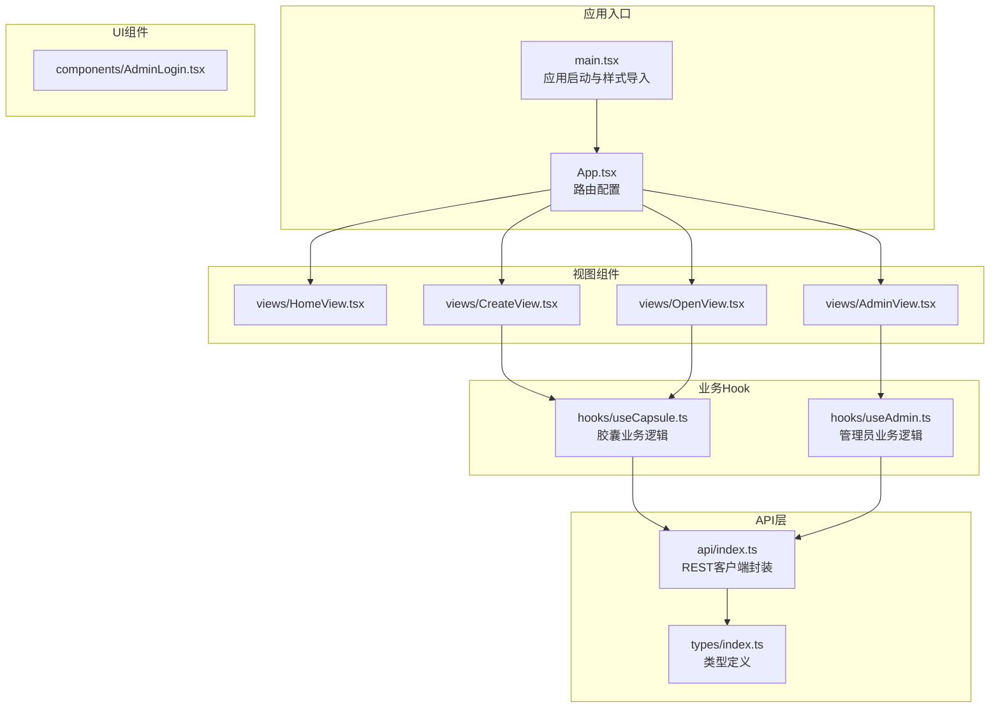
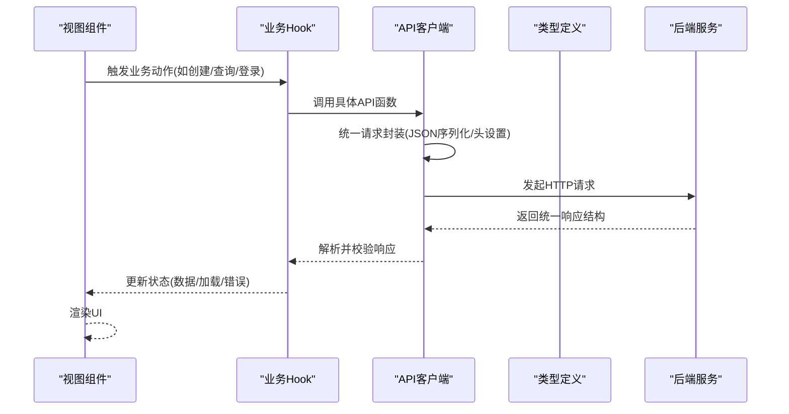
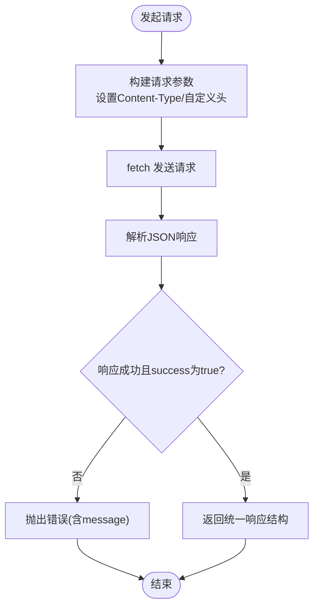
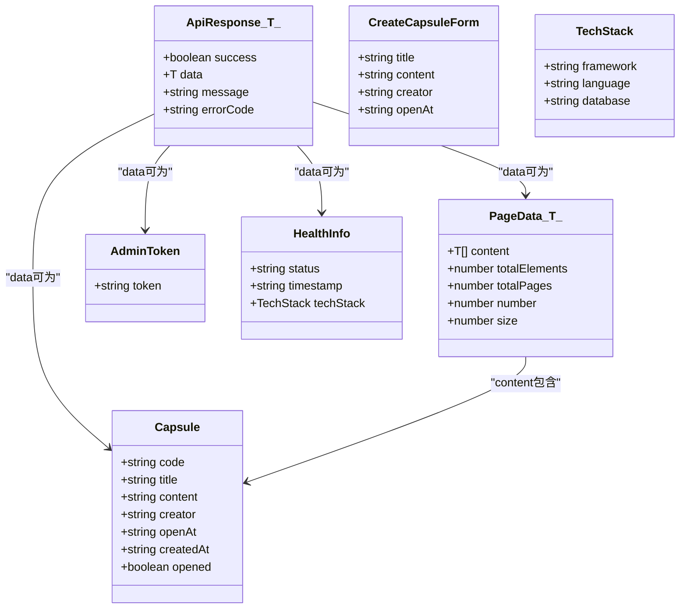
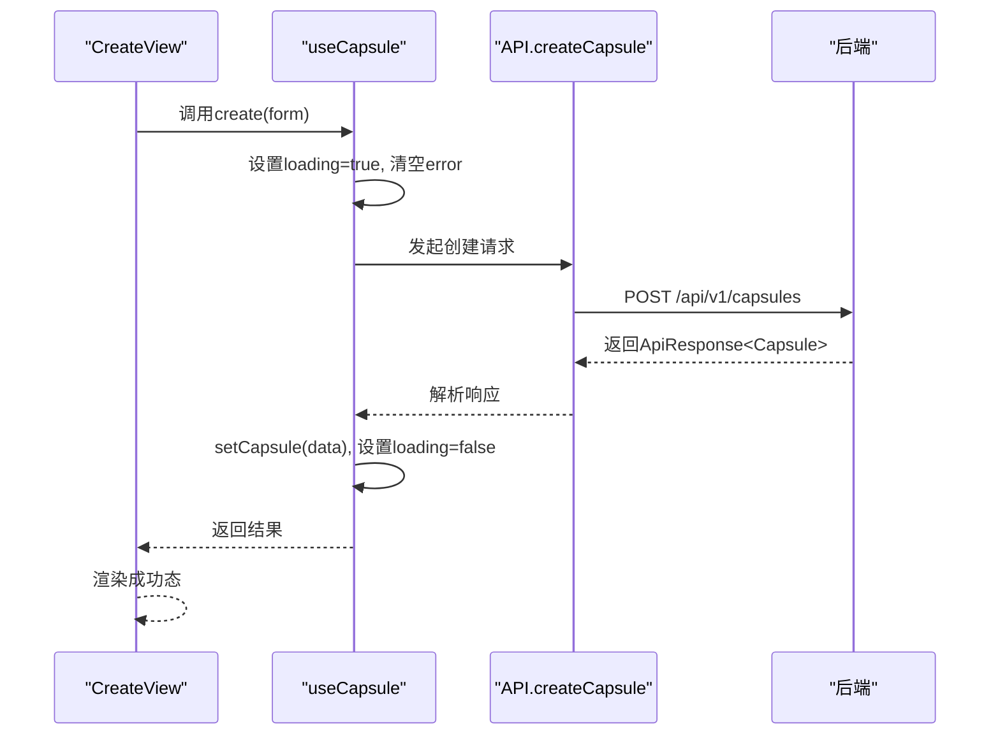
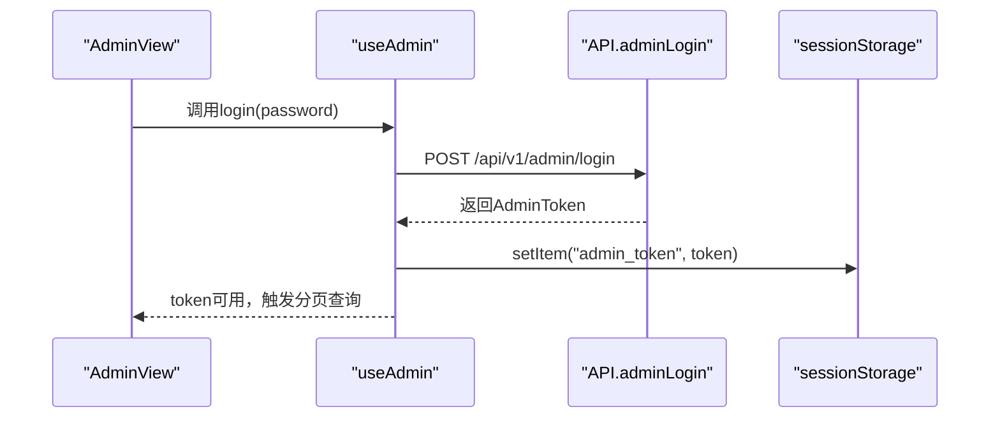
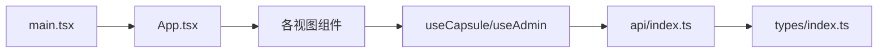

# API集成与数据流

<cite>
**本文档引用的文件**
- [frontends/react-ts/src/api/index.ts](file://frontends/react-ts/src/api/index.ts)
- [frontends/react-ts/src/types/index.ts](file://frontends/react-ts/src/types/index.ts)
- [frontends/react-ts/src/hooks/useCapsule.ts](file://frontends/react-ts/src/hooks/useCapsule.ts)
- [frontends/react-ts/src/hooks/useAdmin.ts](file://frontends/react-ts/src/hooks/useAdmin.ts)
- [frontends/react-ts/src/components/AdminLogin.tsx](file://frontends/react-ts/src/components/AdminLogin.tsx)
- [frontends/react-ts/src/views/AdminView.tsx](file://frontends/react-ts/src/views/AdminView.tsx)
- [frontends/react-ts/src/views/CreateView.tsx](file://frontends/react-ts/src/views/CreateView.tsx)
- [frontends/react-ts/src/views/OpenView.tsx](file://frontends/react-ts/src/views/OpenView.tsx)
- [frontends/react-ts/src/App.tsx](file://frontends/react-ts/src/App.tsx)
- [frontends/react-ts/src/main.tsx](file://frontends/react-ts/src/main.tsx)
</cite>

## 目录
1. [简介](#简介)
2. [项目结构](#项目结构)
3. [核心组件](#核心组件)
4. [架构总览](#架构总览)
5. [详细组件分析](#详细组件分析)
6. [依赖关系分析](#依赖关系分析)
7. [性能考虑](#性能考虑)
8. [故障排除指南](#故障排除指南)
9. [结论](#结论)

## 简介
本文件聚焦于React前端的API集成与数据流实现，系统性阐述以下主题：
- API客户端设计与实现：请求封装、响应处理、错误管理
- 数据类型定义与接口设计：类型安全与开发体验
- 数据流管理：从API获取数据到组件状态更新的完整流程
- 缓存策略、请求去重、并发控制的实现现状与改进建议
- 认证机制：JWT token的存储、自动刷新、权限验证
- 最佳实践与性能优化技巧

## 项目结构
React前端采用按功能域组织的目录结构，核心API与类型定义位于src/api与src/types，业务逻辑通过自定义Hook抽象，视图组件负责UI与用户交互。

**图表来源**
- [frontends/react-ts/src/main.tsx:1-20](file://frontends/react-ts/src/main.tsx#L1-L20)
- [frontends/react-ts/src/App.tsx:1-31](file://frontends/react-ts/src/App.tsx#L1-L31)
- [frontends/react-ts/src/api/index.ts:1-94](file://frontends/react-ts/src/api/index.ts#L1-L94)
- [frontends/react-ts/src/types/index.ts:1-80](file://frontends/react-ts/src/types/index.ts#L1-L80)
- [frontends/react-ts/src/hooks/useCapsule.ts:1-48](file://frontends/react-ts/src/hooks/useCapsule.ts#L1-L48)
- [frontends/react-ts/src/hooks/useAdmin.ts:1-133](file://frontends/react-ts/src/hooks/useAdmin.ts#L1-L133)
- [frontends/react-ts/src/views/CreateView.tsx:1-74](file://frontends/react-ts/src/views/CreateView.tsx#L1-L74)
- [frontends/react-ts/src/views/OpenView.tsx:1-48](file://frontends/react-ts/src/views/OpenView.tsx#L1-L48)
- [frontends/react-ts/src/views/AdminView.tsx:1-91](file://frontends/react-ts/src/views/AdminView.tsx#L1-L91)
- [frontends/react-ts/src/components/AdminLogin.tsx:1-42](file://frontends/react-ts/src/components/AdminLogin.tsx#L1-L42)

**章节来源**
- [frontends/react-ts/src/main.tsx:1-20](file://frontends/react-ts/src/main.tsx#L1-L20)
- [frontends/react-ts/src/App.tsx:1-31](file://frontends/react-ts/src/App.tsx#L1-L31)

## 核心组件
- API客户端：统一请求封装、JSON序列化、统一错误处理、基础URL前缀
- 类型系统：统一响应结构、胶囊数据模型、分页模型、管理员Token、健康检查信息
- 业务Hook：
  - useCapsule：封装创建与查询胶囊的加载、错误、状态管理
  - useAdmin：封装管理员登录、登出、分页查询、删除胶囊、跨组件token共享

**章节来源**
- [frontends/react-ts/src/api/index.ts:1-94](file://frontends/react-ts/src/api/index.ts#L1-L94)
- [frontends/react-ts/src/types/index.ts:1-80](file://frontends/react-ts/src/types/index.ts#L1-L80)
- [frontends/react-ts/src/hooks/useCapsule.ts:1-48](file://frontends/react-ts/src/hooks/useCapsule.ts#L1-L48)
- [frontends/react-ts/src/hooks/useAdmin.ts:1-133](file://frontends/react-ts/src/hooks/useAdmin.ts#L1-L133)

## 架构总览
下图展示了从视图组件到API客户端再到后端的整体调用链路与数据流向。

**图表来源**
- [frontends/react-ts/src/hooks/useCapsule.ts:14-44](file://frontends/react-ts/src/hooks/useCapsule.ts#L14-L44)
- [frontends/react-ts/src/hooks/useAdmin.ts:49-118](file://frontends/react-ts/src/hooks/useAdmin.ts#L49-L118)
- [frontends/react-ts/src/api/index.ts:14-31](file://frontends/react-ts/src/api/index.ts#L14-L31)

## 详细组件分析

### API客户端设计与实现
- 统一请求封装：统一设置Content-Type与基础URL，集中处理响应解析与错误抛出
- 错误处理：当响应非OK或success字段为false时，抛出包含message的错误
- 具体接口：
  - 创建胶囊：POST /api/v1/capsules，自动将openAt转换为ISO字符串
  - 查询胶囊：GET /api/v1/capsules/{code}
  - 管理员登录：POST /api/v1/admin/login，返回AdminToken
  - 管理员分页查询：GET /api/v1/admin/capsules?page=&size=，携带Authorization头
  - 管理员删除胶囊：DELETE /api/v1/admin/capsules/{code}
  - 健康检查：GET /api/v1/health

**图表来源**
- [frontends/react-ts/src/api/index.ts:14-31](file://frontends/react-ts/src/api/index.ts#L14-L31)

**章节来源**
- [frontends/react-ts/src/api/index.ts:1-94](file://frontends/react-ts/src/api/index.ts#L1-L94)

### 数据类型定义与接口设计
- 统一响应结构：包含success、data、message、errorCode
- 胶囊模型：code、title、content、creator、openAt、createdAt、opened
- 创建表单：title、content、creator、openAt
- 分页模型：content[]、totalElements、totalPages、number、size
- 管理员Token：token
- 健康信息：status、timestamp、techStack

**图表来源**
- [frontends/react-ts/src/types/index.ts:35-80](file://frontends/react-ts/src/types/index.ts#L35-L80)

**章节来源**
- [frontends/react-ts/src/types/index.ts:1-80](file://frontends/react-ts/src/types/index.ts#L1-L80)

### 数据流管理：从API到组件状态
- useCapsule：封装创建与查询，内部维护capsule、loading、error状态，并在finally中统一关闭loading
- useAdmin：封装登录、登出、分页查询、删除；使用useSyncExternalStore在模块级共享token，实现跨组件同步

**图表来源**
- [frontends/react-ts/src/views/CreateView.tsx:20-29](file://frontends/react-ts/src/views/CreateView.tsx#L20-L29)
- [frontends/react-ts/src/hooks/useCapsule.ts:14-28](file://frontends/react-ts/src/hooks/useCapsule.ts#L14-L28)
- [frontends/react-ts/src/api/index.ts:37-45](file://frontends/react-ts/src/api/index.ts#L37-L45)

**章节来源**
- [frontends/react-ts/src/views/CreateView.tsx:1-74](file://frontends/react-ts/src/views/CreateView.tsx#L1-L74)
- [frontends/react-ts/src/hooks/useCapsule.ts:1-48](file://frontends/react-ts/src/hooks/useCapsule.ts#L1-L48)

### 认证机制：JWT Token的存储、自动刷新、权限验证
- Token存储：sessionStorage持久化存储admin_token
- 跨组件共享：useSyncExternalStore订阅token变化，实现多组件同步
- 权限验证：管理员接口均携带Authorization: Bearer token头
- 自动刷新：当前实现未包含自动刷新逻辑，建议在请求拦截器中增加401处理与静默刷新

**图表来源**
- [frontends/react-ts/src/views/AdminView.tsx:24-31](file://frontends/react-ts/src/views/AdminView.tsx#L24-L31)
- [frontends/react-ts/src/hooks/useAdmin.ts:49-62](file://frontends/react-ts/src/hooks/useAdmin.ts#L49-L62)
- [frontends/react-ts/src/api/index.ts:59-64](file://frontends/react-ts/src/api/index.ts#L59-L64)

**章节来源**
- [frontends/react-ts/src/hooks/useAdmin.ts:1-133](file://frontends/react-ts/src/hooks/useAdmin.ts#L1-L133)
- [frontends/react-ts/src/views/AdminView.tsx:1-91](file://frontends/react-ts/src/views/AdminView.tsx#L1-L91)
- [frontends/react-ts/src/components/AdminLogin.tsx:1-42](file://frontends/react-ts/src/components/AdminLogin.tsx#L1-L42)

### 缓存策略、请求去重与并发控制
- 现状：未实现客户端缓存、请求去重与并发控制
- 建议：
  - 缓存策略：基于URL与参数的LRU缓存，结合TTL失效
  - 请求去重：同一key仅保留一个进行中的Promise
  - 并发控制：限制同时进行的请求数量，避免风暴效应
  - 乐观更新：在提交后立即更新本地状态，失败时回滚

[本节为通用指导，不直接分析具体文件，故无“章节来源”]

## 依赖关系分析
- 视图组件依赖业务Hook
- 业务Hook依赖API客户端
- API客户端依赖类型定义
- 应用入口负责全局样式与路由初始化

**图表来源**
- [frontends/react-ts/src/main.tsx:1-20](file://frontends/react-ts/src/main.tsx#L1-L20)
- [frontends/react-ts/src/App.tsx:1-31](file://frontends/react-ts/src/App.tsx#L1-L31)
- [frontends/react-ts/src/hooks/useCapsule.ts:1-48](file://frontends/react-ts/src/hooks/useCapsule.ts#L1-L48)
- [frontends/react-ts/src/hooks/useAdmin.ts:1-133](file://frontends/react-ts/src/hooks/useAdmin.ts#L1-L133)
- [frontends/react-ts/src/api/index.ts:1-94](file://frontends/react-ts/src/api/index.ts#L1-L94)
- [frontends/react-ts/src/types/index.ts:1-80](file://frontends/react-ts/src/types/index.ts#L1-L80)

**章节来源**
- [frontends/react-ts/src/main.tsx:1-20](file://frontends/react-ts/src/main.tsx#L1-L20)
- [frontends/react-ts/src/App.tsx:1-31](file://frontends/react-ts/src/App.tsx#L1-L31)

## 性能考虑
- 避免不必要的重渲染：useCallback稳定回调，useState合理拆分状态
- 加载态与骨架屏：在长请求期间提供占位与反馈
- 防抖与节流：对高频输入（如搜索）进行防抖
- 图片与资源优化：延迟加载、压缩与CDN
- 浏览器缓存：合理设置Cache-Control与ETag
- 代码分割：路由懒加载已在使用

[本节为通用指导，不直接分析具体文件，故无“章节来源”]

## 故障排除指南
- 统一错误处理：API层在失败时抛出包含message的错误，业务Hook捕获并设置error状态
- 管理员鉴权失败：useAdmin在检测到认证相关错误时清空token与列表
- 用户可见提示：视图组件根据loading与error状态渲染相应UI

**章节来源**
- [frontends/react-ts/src/api/index.ts:26-28](file://frontends/react-ts/src/api/index.ts#L26-L28)
- [frontends/react-ts/src/hooks/useCapsule.ts:21-27](file://frontends/react-ts/src/hooks/useCapsule.ts#L21-L27)
- [frontends/react-ts/src/hooks/useAdmin.ts:84-87](file://frontends/react-ts/src/hooks/useAdmin.ts#L84-L87)

## 结论
该React前端实现了清晰的API集成与数据流：统一的请求封装、强类型的响应结构、以Hook为核心的业务逻辑抽象，以及基于sessionStorage的管理员认证方案。建议后续引入客户端缓存、请求去重与并发控制，完善自动刷新与权限拦截，进一步提升用户体验与系统稳定性。