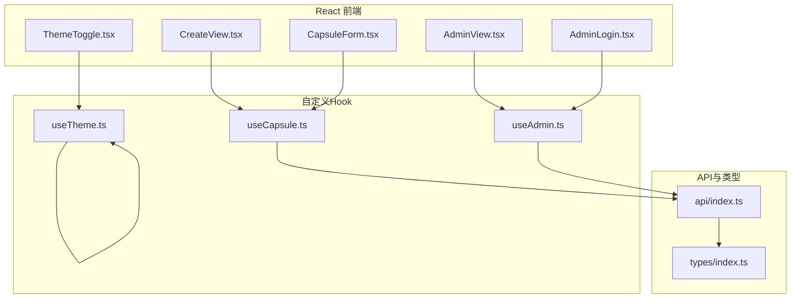
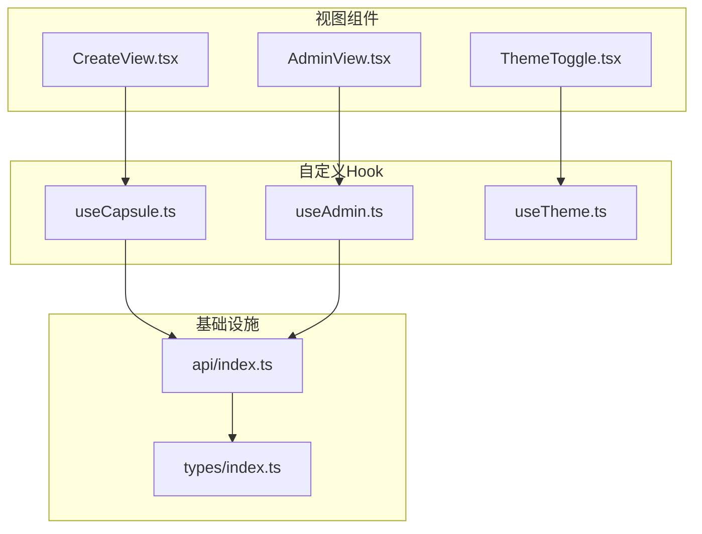
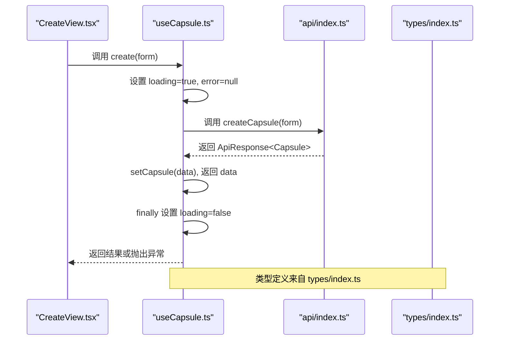
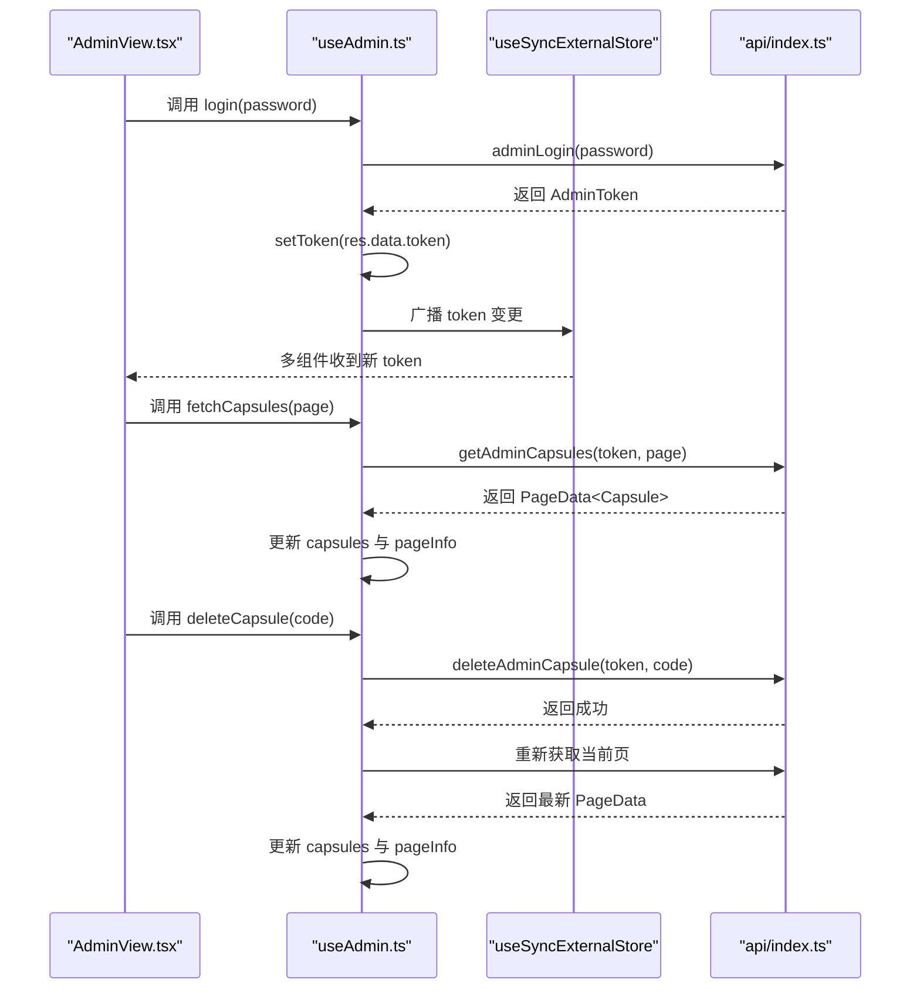
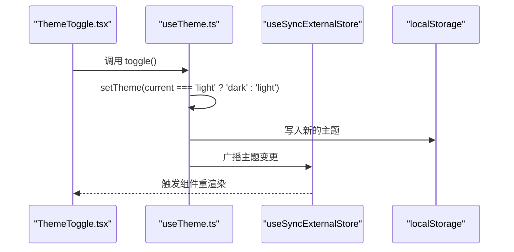
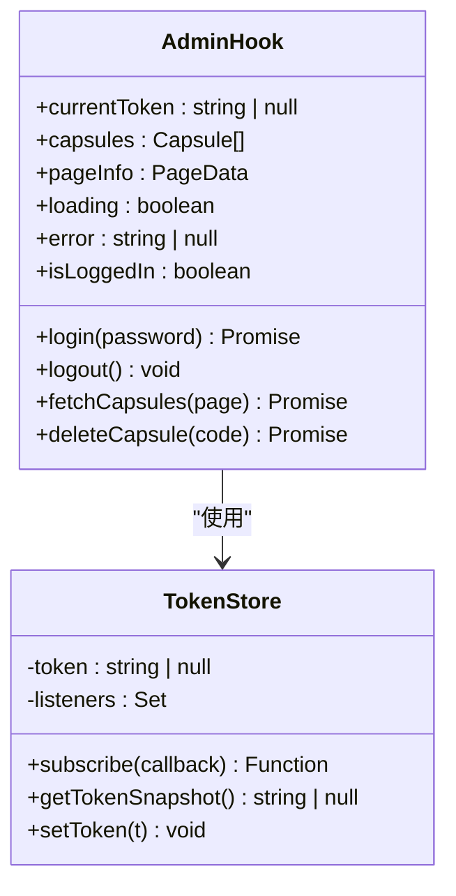
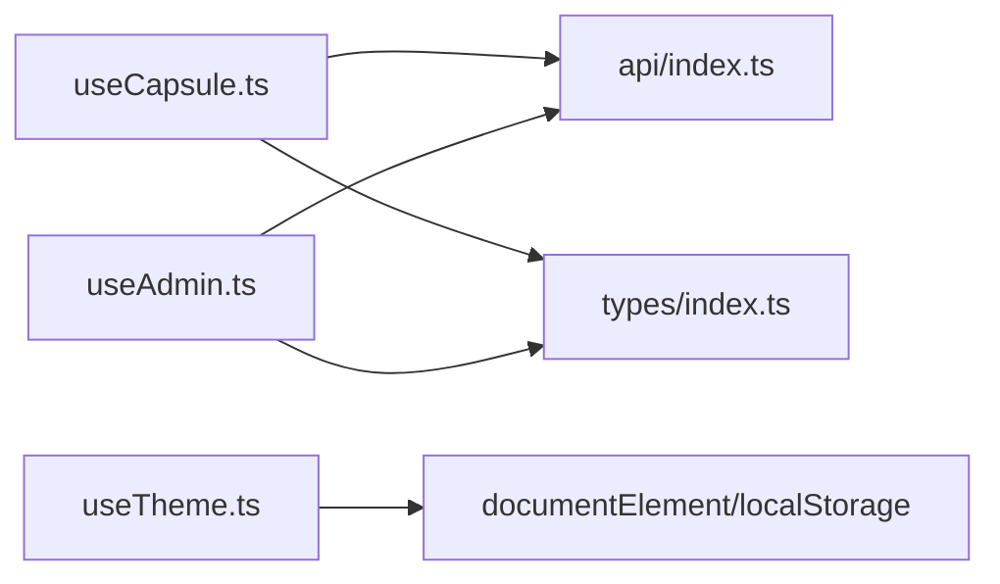

# Hooks模式与自定义Hook

<cite>
**本文档引用的文件**
- [useCapsule.ts](file://frontends/react-ts/src/hooks/useCapsule.ts)
- [useAdmin.ts](file://frontends/react-ts/src/hooks/useAdmin.ts)
- [useTheme.ts](file://frontends/react-ts/src/hooks/useTheme.ts)
- [index.ts](file://frontends/react-ts/src/api/index.ts)
- [index.ts](file://frontends/react-ts/src/types/index.ts)
- [AdminView.tsx](file://frontends/react-ts/src/views/AdminView.tsx)
- [CreateView.tsx](file://frontends/react-ts/src/views/CreateView.tsx)
- [ThemeToggle.tsx](file://frontends/react-ts/src/components/ThemeToggle.tsx)
- [AdminLogin.tsx](file://frontends/react-ts/src/components/AdminLogin.tsx)
- [CapsuleForm.tsx](file://frontends/react-ts/src/components/CapsuleForm.tsx)
- [useCapsule.test.ts](file://frontends/react-ts/src/__tests__/hooks/useCapsule.test.ts)
- [useTheme.test.ts](file://frontends/react-ts/src/__tests__/hooks/useTheme.test.ts)
</cite>

## 目录
1. [简介](#简介)
2. [项目结构](#项目结构)
3. [核心组件](#核心组件)
4. [架构总览](#架构总览)
5. [详细组件分析](#详细组件分析)
6. [依赖关系分析](#依赖关系分析)
7. [性能考虑](#性能考虑)
8. [故障排除指南](#故障排除指南)
9. [结论](#结论)
10. [附录](#附录)

## 简介
本文件系统性梳理 React 自定义 Hook 的设计与实现模式，重点围绕以下三个 Hook 展开：
- useCapsule：封装时间胶囊的创建与查询，演示状态封装、异步操作与错误处理。
- useAdmin：封装管理员登录、登出与胶囊管理，展示 token 管理、跨组件状态共享与认证流程。
- useTheme：封装主题切换与持久化，展示外部状态同步与 UI 主题应用。

同时总结 React Hooks 最佳实践：依赖数组优化、回调函数缓存、避免重复渲染等，并给出可复用的设计模式与测试策略。

## 项目结构
React 前端采用按功能组织的目录结构，Hooks 位于 hooks 目录，配合 API 客户端与类型定义，形成清晰的分层：
- hooks：自定义 Hook 实现
- api：统一的 API 客户端与类型定义
- views/components：使用 Hook 的视图与组件
- __tests__/hooks：针对 Hook 的单元测试

图表来源
- [AdminView.tsx:1-91](file://frontends/react-ts/src/views/AdminView.tsx#L1-L91)
- [CreateView.tsx:1-74](file://frontends/react-ts/src/views/CreateView.tsx#L1-L74)
- [AdminLogin.tsx:1-42](file://frontends/react-ts/src/components/AdminLogin.tsx#L1-L42)
- [CapsuleForm.tsx:1-130](file://frontends/react-ts/src/components/CapsuleForm.tsx#L1-L130)
- [ThemeToggle.tsx:1-17](file://frontends/react-ts/src/components/ThemeToggle.tsx#L1-L17)
- [useCapsule.ts:1-48](file://frontends/react-ts/src/hooks/useCapsule.ts#L1-L48)
- [useAdmin.ts:1-133](file://frontends/react-ts/src/hooks/useAdmin.ts#L1-L133)
- [useTheme.ts:1-48](file://frontends/react-ts/src/hooks/useTheme.ts#L1-L48)
- [index.ts:1-94](file://frontends/react-ts/src/api/index.ts#L1-L94)
- [index.ts:1-80](file://frontends/react-ts/src/types/index.ts#L1-L80)

章节来源
- [useCapsule.ts:1-48](file://frontends/react-ts/src/hooks/useCapsule.ts#L1-L48)
- [useAdmin.ts:1-133](file://frontends/react-ts/src/hooks/useAdmin.ts#L1-L133)
- [useTheme.ts:1-48](file://frontends/react-ts/src/hooks/useTheme.ts#L1-L48)
- [index.ts:1-94](file://frontends/react-ts/src/api/index.ts#L1-L94)
- [index.ts:1-80](file://frontends/react-ts/src/types/index.ts#L1-L80)

## 核心组件
本节概述三个自定义 Hook 的职责与对外暴露的接口，便于快速理解其用途与使用方式。

- useCapsule
  - 状态：胶囊数据、加载状态、错误信息
  - 方法：create（创建）、get（查询）
  - 特点：通过 useCallback 包裹异步方法，避免重复渲染；统一错误处理与 finally 清理

- useAdmin
  - 状态：胶囊列表、分页信息、加载状态、错误信息、登录态
  - 方法：login（登录）、logout（登出）、fetchCapsules（分页查询）、deleteCapsule（删除）
  - 特点：使用 useSyncExternalStore 共享 token；登录后持久化到 sessionStorage；认证失败时自动清理

- useTheme
  - 状态：当前主题（light/dark）
  - 方法：toggle（切换主题）
  - 特点：使用 useSyncExternalStore 共享主题；持久化到 localStorage；初始化即应用主题

章节来源
- [useCapsule.ts:9-47](file://frontends/react-ts/src/hooks/useCapsule.ts#L9-L47)
- [useAdmin.ts:35-132](file://frontends/react-ts/src/hooks/useAdmin.ts#L35-L132)
- [useTheme.ts:39-47](file://frontends/react-ts/src/hooks/useTheme.ts#L39-L47)

## 架构总览
下图展示了自定义 Hook 与其依赖的关系，以及与视图组件的交互方式。

图表来源
- [AdminView.tsx:1-91](file://frontends/react-ts/src/views/AdminView.tsx#L1-L91)
- [CreateView.tsx:1-74](file://frontends/react-ts/src/views/CreateView.tsx#L1-L74)
- [ThemeToggle.tsx:1-17](file://frontends/react-ts/src/components/ThemeToggle.tsx#L1-L17)
- [useCapsule.ts:1-48](file://frontends/react-ts/src/hooks/useCapsule.ts#L1-L48)
- [useAdmin.ts:1-133](file://frontends/react-ts/src/hooks/useAdmin.ts#L1-L133)
- [useTheme.ts:1-48](file://frontends/react-ts/src/hooks/useTheme.ts#L1-L48)
- [index.ts:1-94](file://frontends/react-ts/src/api/index.ts#L1-L94)
- [index.ts:1-80](file://frontends/react-ts/src/types/index.ts#L1-L80)

## 详细组件分析

### useCapsule Hook 分析
- 设计原则
  - 单一职责：聚焦胶囊的创建与查询，不包含 UI 或路由逻辑
  - 状态封装：内部维护 capsule、loading、error 三类状态，避免上层组件重复管理
  - 异步操作：create 与 get 均为异步，统一处理加载态与错误态
  - 错误处理：捕获异常并设置错误信息，同时抛出异常供调用方处理
  - 性能优化：使用 useCallback 包裹异步方法，减少子组件重渲染

- 关键实现要点
  - 状态初始化：空胶囊、非加载、无错误
  - create 流程：设置加载态 → 清空错误 → 调用 API → 设置数据 → 返回结果 → finally 清理加载态
  - get 流程：同 create，但目标为查询接口
  - 返回值：包含状态与方法的对象，便于解构使用

图表来源
- [useCapsule.ts:14-28](file://frontends/react-ts/src/hooks/useCapsule.ts#L14-L28)
- [index.ts:37-45](file://frontends/react-ts/src/api/index.ts#L37-L45)
- [index.ts:10-18](file://frontends/react-ts/src/types/index.ts#L10-L18)

章节来源
- [useCapsule.ts:9-47](file://frontends/react-ts/src/hooks/useCapsule.ts#L9-L47)
- [CreateView.tsx:10-29](file://frontends/react-ts/src/views/CreateView.tsx#L10-L29)
- [index.ts:1-94](file://frontends/react-ts/src/api/index.ts#L1-L94)
- [index.ts:1-80](file://frontends/react-ts/src/types/index.ts#L1-L80)

### useAdmin Hook 分析
- 设计原则
  - 认证与状态分离：登录态通过 useSyncExternalStore 管理，避免在组件内分散存储
  - 外部状态同步：token 变更通过订阅器通知所有订阅者，确保多组件状态一致
  - 错误与认证联动：当检测到认证相关错误时，自动清理 token 与列表数据
  - 分页与刷新：删除后基于当前页码重新拉取，保证数据一致性

- 关键实现要点
  - token 管理：模块级变量保存当前 token，setToken 同步更新 sessionStorage 并广播变更
  - 登录流程：调用后端登录接口，成功后写入 token；失败时设置错误信息
  - 列表查询：携带 token 发起分页请求，解析 totalElements、totalPages、number、size
  - 删除流程：携带 token 删除指定胶囊，随后刷新当前页数据
  - 登出流程：清空 token 与列表，保持状态一致

图表来源
- [useAdmin.ts:49-93](file://frontends/react-ts/src/hooks/useAdmin.ts#L49-L93)
- [useAdmin.ts:95-118](file://frontends/react-ts/src/hooks/useAdmin.ts#L95-L118)
- [index.ts:59-85](file://frontends/react-ts/src/api/index.ts#L59-L85)

章节来源
- [useAdmin.ts:11-33](file://frontends/react-ts/src/hooks/useAdmin.ts#L11-L33)
- [useAdmin.ts:35-132](file://frontends/react-ts/src/hooks/useAdmin.ts#L35-L132)
- [AdminView.tsx:8-47](file://frontends/react-ts/src/views/AdminView.tsx#L8-L47)
- [index.ts:1-94](file://frontends/react-ts/src/api/index.ts#L1-L94)

### useTheme Hook 分析
- 设计原则
  - 外部状态同步：通过 useSyncExternalStore 与模块级状态实现跨组件共享
  - 持久化策略：主题偏好持久化到 localStorage，页面加载时自动应用
  - 主题应用：通过设置 documentElement 的 data-theme 属性驱动样式切换

- 关键实现要点
  - 初始化：从 localStorage 读取主题，若不存在则默认 light；应用到根节点
  - 切换逻辑：根据当前主题在 light/dark 间切换，更新 localStorage 并广播
  - 订阅机制：subscribe 返回取消函数，getSnapshot 提供快照

图表来源
- [useTheme.ts:39-47](file://frontends/react-ts/src/hooks/useTheme.ts#L39-L47)
- [ThemeToggle.tsx:4-16](file://frontends/react-ts/src/components/ThemeToggle.tsx#L4-L16)

章节来源
- [useTheme.ts:10-37](file://frontends/react-ts/src/hooks/useTheme.ts#L10-L37)
- [useTheme.ts:39-47](file://frontends/react-ts/src/hooks/useTheme.ts#L39-L47)
- [ThemeToggle.tsx:1-17](file://frontends/react-ts/src/components/ThemeToggle.tsx#L1-L17)

### 类图：useAdmin 的外部状态模型

图表来源
- [useAdmin.ts:11-33](file://frontends/react-ts/src/hooks/useAdmin.ts#L11-L33)
- [useAdmin.ts:35-132](file://frontends/react-ts/src/hooks/useAdmin.ts#L35-L132)

## 依赖关系分析
- useCapsule 依赖 api 客户端中的 createCapsule 与 getCapsule，类型来自 types/index.ts
- useAdmin 依赖 api 客户端中的 adminLogin、getAdminCapsules、deleteAdminCapsule，类型来自 types/index.ts
- useTheme 不依赖 api，仅依赖浏览器环境的 localStorage 与 documentElement

图表来源
- [useCapsule.ts:1-48](file://frontends/react-ts/src/hooks/useCapsule.ts#L1-L48)
- [useAdmin.ts:1-133](file://frontends/react-ts/src/hooks/useAdmin.ts#L1-L133)
- [useTheme.ts:1-48](file://frontends/react-ts/src/hooks/useTheme.ts#L1-L48)
- [index.ts:1-94](file://frontends/react-ts/src/api/index.ts#L1-L94)
- [index.ts:1-80](file://frontends/react-ts/src/types/index.ts#L1-L80)

章节来源
- [index.ts:1-94](file://frontends/react-ts/src/api/index.ts#L1-L94)
- [index.ts:1-80](file://frontends/react-ts/src/types/index.ts#L1-L80)

## 性能考虑
- 依赖数组优化
  - useAdmin 中 deleteCapsule 的依赖包含 pageInfo.number，确保删除后刷新当前页时使用最新页码，避免旧闭包导致的分页错乱
  - useTheme 的 toggle 依赖 currentTheme，确保切换逻辑只在主题变化时执行

- 回调函数缓存
  - useCapsule 的 create 与 get 使用 useCallback 包裹，避免父组件每次渲染都产生新的函数引用，减少子组件重渲染

- 避免重复渲染
  - useAdmin 通过 useSyncExternalStore 共享 token，只有 token 变化才会触发订阅者的重渲染
  - useTheme 通过 useSyncExternalStore 共享主题，仅在主题变化时触发重渲染

- 加载态与错误态
  - 在异步操作前后显式设置 loading 与 error，避免 UI 状态不一致

章节来源
- [useAdmin.ts:118](file://frontends/react-ts/src/hooks/useAdmin.ts#L118)
- [useTheme.ts:44](file://frontends/react-ts/src/hooks/useTheme.ts#L44)
- [useCapsule.ts:28](file://frontends/react-ts/src/hooks/useCapsule.ts#L28)

## 故障排除指南
- useCapsule
  - 症状：创建/查询失败后 error 未清空
  - 处理：确保在每次调用前清空错误状态；检查 API 返回的 success 字段
  - 测试参考：[useCapsule.test.ts:40-54](file://frontends/react-ts/src/__tests__/hooks/useCapsule.test.ts#L40-L54)

- useAdmin
  - 症状：删除后列表未刷新
  - 处理：确认 deleteCapsule 内部使用当前页码重新拉取；检查 pageInfo.number 是否正确
  - 认证错误：当错误消息包含“认证”字样时，自动清理 token 与列表
  - 测试参考：[useAdmin.ts:84-87](file://frontends/react-ts/src/hooks/useAdmin.ts#L84-L87)

- useTheme
  - 症状：切换主题后未持久化
  - 处理：确认 localStorage 正常可用；检查 setTheme 是否被调用
  - 测试参考：[useTheme.test.ts:16-28](file://frontends/react-ts/src/__tests__/hooks/useTheme.test.ts#L16-L28)

章节来源
- [useCapsule.test.ts:1-89](file://frontends/react-ts/src/__tests__/hooks/useCapsule.test.ts#L1-L89)
- [useAdmin.ts:84-87](file://frontends/react-ts/src/hooks/useAdmin.ts#L84-L87)
- [useTheme.test.ts:1-30](file://frontends/react-ts/src/__tests__/hooks/useTheme.test.ts#L1-L30)

## 结论
本项目通过三个自定义 Hook 展示了 React Hooks 的典型设计模式：
- 状态封装：将业务状态与 UI 解耦，提供简洁的对外接口
- 副作用处理：统一管理异步请求、错误与加载态
- 逻辑复用：通过 Hook 抽象公共逻辑，提升组件复用性
- 外部状态同步：使用 useSyncExternalStore 实现跨组件共享与状态一致性
- 性能优化：合理使用 useCallback、依赖数组与最小化重渲染

## 附录
- 设计模式建议
  - 将“状态 + 方法”的组合以对象形式返回，便于解构使用
  - 将外部状态（如 token、主题）集中管理并通过订阅器广播
  - 在 Hook 内统一错误处理与加载态控制，向上抛出异常供调用方决定 UI 行为
  - 对于分页场景，删除后基于当前页码刷新，避免跨页数据不一致

- 代码示例路径（不直接展示代码）
  - useCapsule 创建流程：[useCapsule.ts:14-28](file://frontends/react-ts/src/hooks/useCapsule.ts#L14-L28)
  - useAdmin 登录与分页查询：[useAdmin.ts:49-93](file://frontends/react-ts/src/hooks/useAdmin.ts#L49-L93)
  - useAdmin 删除后刷新：[useAdmin.ts:95-118](file://frontends/react-ts/src/hooks/useAdmin.ts#L95-L118)
  - useTheme 切换与持久化：[useTheme.ts:39-47](file://frontends/react-ts/src/hooks/useTheme.ts#L39-L47)