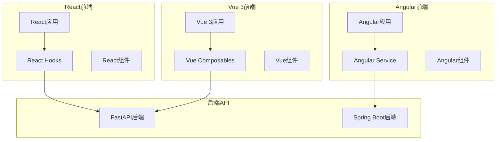
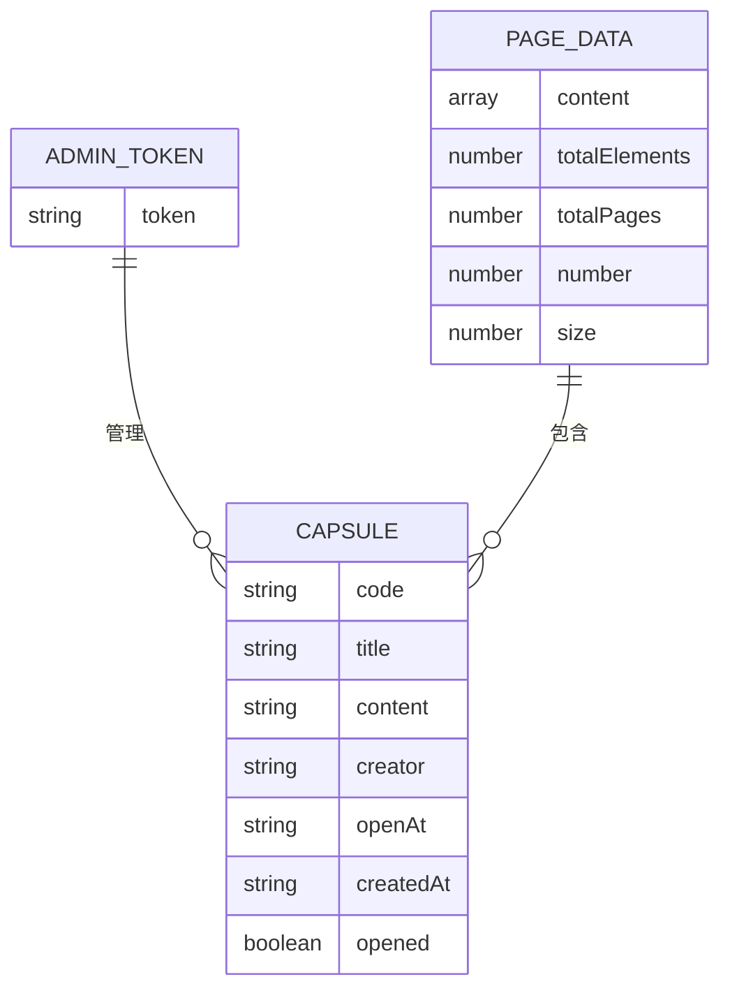
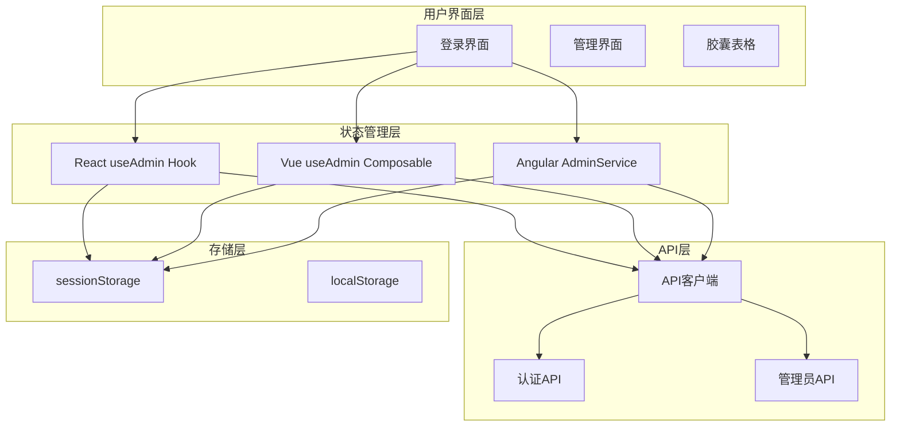
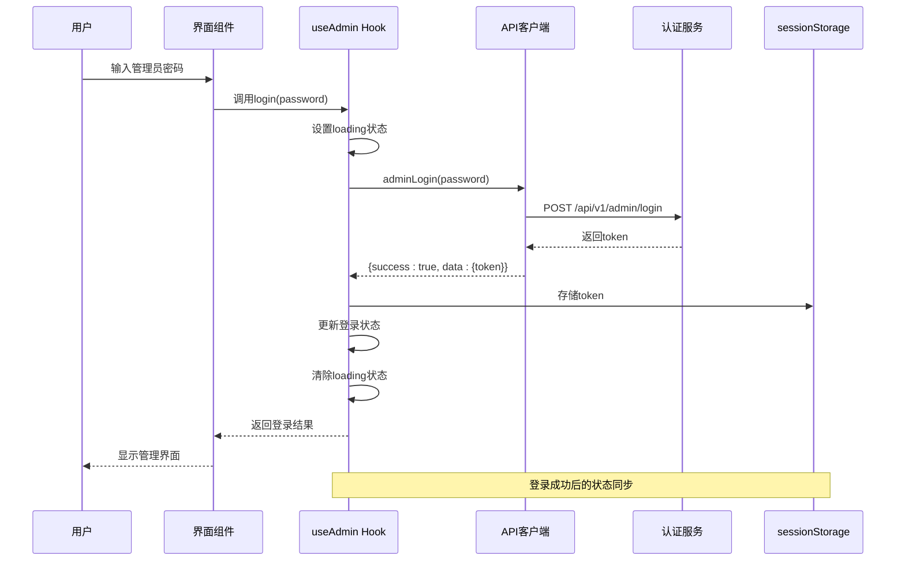
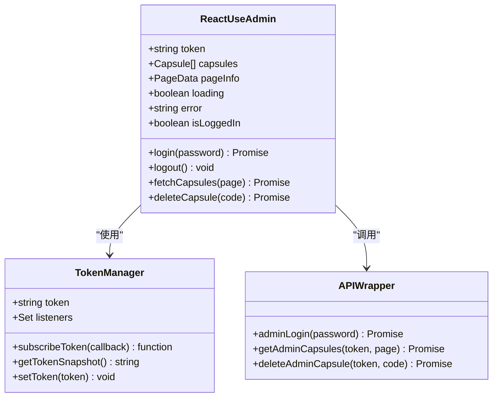
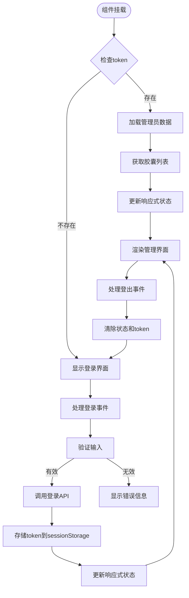
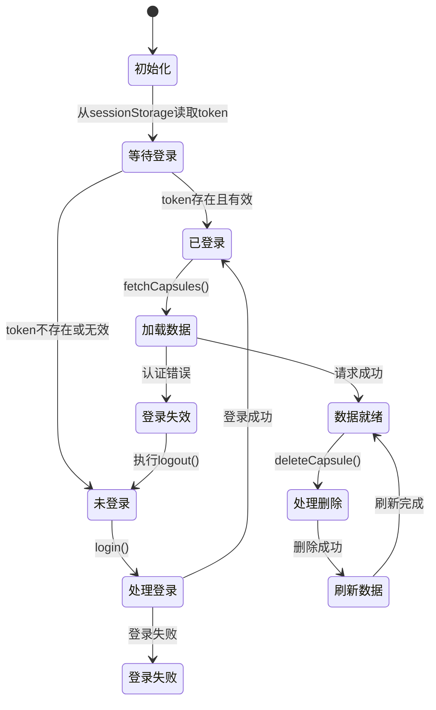
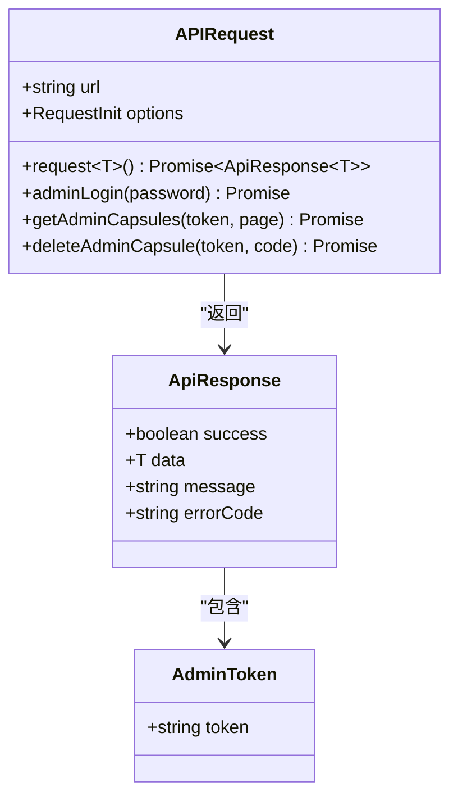
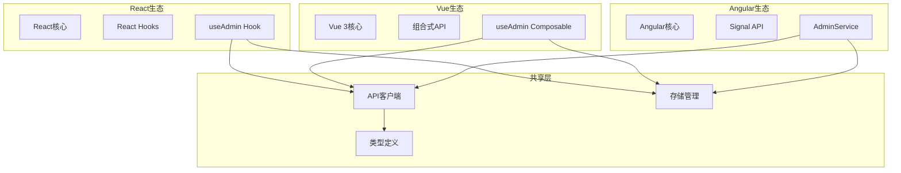
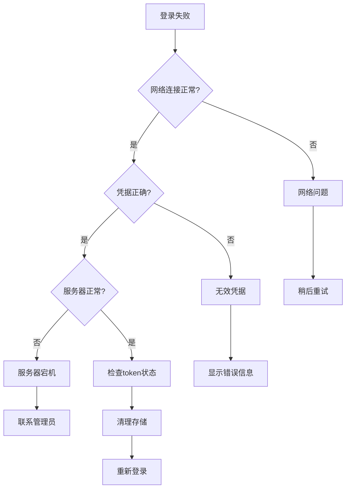

# useAdmin Hook实现

<cite>
**本文档引用的文件**
- [useAdmin.ts](file://frontends/react-ts/src/hooks/useAdmin.ts)
- [useAdmin.ts](file://frontends/vue3-ts/src/composables/useAdmin.ts)
- [admin.service.ts](file://frontends/angular-ts/src/app/services/admin.service.ts)
- [index.ts](file://frontends/react-ts/src/api/index.ts)
- [index.ts](file://frontends/react-ts/src/types/index.ts)
- [AdminView.vue](file://frontends/vue3-ts/src/views/AdminView.vue)
- [AdminLogin.vue](file://frontends/vue3-ts/src/components/AdminLogin.vue)
</cite>

## 目录
1. [简介](#简介)
2. [项目结构](#项目结构)
3. [核心组件](#核心组件)
4. [架构概览](#架构概览)
5. [详细组件分析](#详细组件分析)
6. [依赖关系分析](#依赖关系分析)
7. [性能考虑](#性能考虑)
8. [故障排除指南](#故障排除指南)
9. [结论](#结论)
10. [附录](#附录)

## 简介

useAdmin是一个跨框架的管理员认证自定义Hook，提供了完整的管理员登录、登出和胶囊管理功能。该Hook实现了统一的状态管理、token持久化和错误处理机制，支持React、Vue 3和Angular三种前端框架。

该实现采用sessionStorage进行token存储，确保会话结束后自动清理，同时提供了完善的认证状态管理和自动登出机制。Hook暴露了丰富的API用于管理员功能操作，包括登录验证、胶囊列表管理、删除操作等。

## 项目结构

HelloTime项目采用了多框架架构设计，每个前端框架都有独立的实现：



**图表来源**
- [useAdmin.ts:1-133](file://frontends/react-ts/src/hooks/useAdmin.ts#L1-L133)
- [useAdmin.ts:1-132](file://frontends/vue3-ts/src/composables/useAdmin.ts#L1-L132)
- [admin.service.ts:1-84](file://frontends/angular-ts/src/app/services/admin.service.ts#L1-L84)

**章节来源**
- [useAdmin.ts:1-133](file://frontends/react-ts/src/hooks/useAdmin.ts#L1-L133)
- [useAdmin.ts:1-132](file://frontends/vue3-ts/src/composables/useAdmin.ts#L1-L132)
- [admin.service.ts:1-84](file://frontends/angular-ts/src/app/services/admin.service.ts#L1-L84)

## 核心组件

### 管理员认证状态管理

三个框架的useAdmin实现都提供了相似的核心功能：

| 功能特性 | React实现 | Vue 3实现 | Angular实现 |
|---------|-----------|-----------|-------------|
| Token存储 | sessionStorage | sessionStorage | sessionStorage |
| 状态管理 | useSyncExternalStore | ref + computed | signal + computed |
| 登录状态 | 计算属性 | 计算属性 | 计算属性 |
| 加载状态 | useState | ref | signal |
| 错误处理 | useState | ref | signal |

### 数据模型



**图表来源**
- [index.ts:58-60](file://frontends/react-ts/src/types/index.ts#L58-L60)
- [index.ts:10-18](file://frontends/react-ts/src/types/index.ts#L10-L18)
- [index.ts:46-52](file://frontends/react-ts/src/types/index.ts#L46-L52)

**章节来源**
- [index.ts:1-80](file://frontends/react-ts/src/types/index.ts#L1-L80)

## 架构概览

### 整体架构设计



**图表来源**
- [useAdmin.ts:35-132](file://frontends/react-ts/src/hooks/useAdmin.ts#L35-L132)
- [useAdmin.ts:18-131](file://frontends/vue3-ts/src/composables/useAdmin.ts#L18-L131)
- [admin.service.ts:8-83](file://frontends/angular-ts/src/app/services/admin.service.ts#L8-L83)

### 认证流程序列图



**图表来源**
- [useAdmin.ts:49-62](file://frontends/react-ts/src/hooks/useAdmin.ts#L49-L62)
- [index.ts:59-64](file://frontends/react-ts/src/api/index.ts#L59-L64)

## 详细组件分析

### React实现分析

#### 状态管理模式

React版本使用了`useSyncExternalStore`实现模块级状态共享：



**图表来源**
- [useAdmin.ts:11-33](file://frontends/react-ts/src/hooks/useAdmin.ts#L11-L33)
- [useAdmin.ts:35-132](file://frontends/react-ts/src/hooks/useAdmin.ts#L35-L132)

#### 关键实现细节

1. **模块级Token状态**：使用闭包变量存储token，确保跨组件共享
2. **订阅机制**：通过`tokenListeners`集合实现状态变更通知
3. **同步外部存储**：利用`useSyncExternalStore`实现React状态与外部存储同步

**章节来源**
- [useAdmin.ts:1-133](file://frontends/react-ts/src/hooks/useAdmin.ts#L1-L133)

### Vue 3实现分析

#### 响应式状态管理

Vue 3版本采用组合式API模式：



**图表来源**
- [useAdmin.ts:18-131](file://frontends/vue3-ts/src/composables/useAdmin.ts#L18-L131)

#### 特色功能实现

1. **计算属性登录状态**：`isLoggedIn`基于token值动态计算
2. **自动错误处理**：在API调用中自动检测认证错误并执行登出
3. **响应式分页**：`pageInfo`作为ref对象维护分页状态

**章节来源**
- [useAdmin.ts:1-132](file://frontends/vue3-ts/src/composables/useAdmin.ts#L1-L132)

### Angular实现分析

#### 信号系统集成

Angular版本使用现代的signal API：



**图表来源**
- [admin.service.ts:8-83](file://frontends/angular-ts/src/app/services/admin.service.ts#L8-L83)

**章节来源**
- [admin.service.ts:1-84](file://frontends/angular-ts/src/app/services/admin.service.ts#L1-L84)

### API集成层

#### 请求封装机制



**图表来源**
- [index.ts:14-31](file://frontends/react-ts/src/api/index.ts#L14-L31)
- [index.ts:59-85](file://frontends/react-ts/src/api/index.ts#L59-L85)

**章节来源**
- [index.ts:1-94](file://frontends/react-ts/src/api/index.ts#L1-L94)

## 依赖关系分析

### 组件间依赖关系



**图表来源**
- [useAdmin.ts:7-9](file://frontends/react-ts/src/hooks/useAdmin.ts#L7-L9)
- [useAdmin.ts:6-8](file://frontends/vue3-ts/src/composables/useAdmin.ts#L6-L8)
- [admin.service.ts:1-3](file://frontends/angular-ts/src/app/services/admin.service.ts#L1-L3)

### 外部依赖分析

| 依赖项 | 用途 | 版本要求 | 安全考虑 |
|--------|------|----------|----------|
| React | 前端框架 | ^18.0 | 需要定期更新以获得安全补丁 |
| Vue 3 | 前端框架 | ^3.0 | 使用最新的稳定版本 |
| Angular | 前端框架 | ^16.0 | LTS版本支持 |
| TypeScript | 类型系统 | ^4.0 | 严格模式配置 |
| sessionstorage | 本地存储 | 浏览器原生 | 需要处理存储限制 |

**章节来源**
- [useAdmin.ts:1-133](file://frontends/react-ts/src/hooks/useAdmin.ts#L1-L133)
- [useAdmin.ts:1-132](file://frontends/vue3-ts/src/composables/useAdmin.ts#L1-L132)
- [admin.service.ts:1-84](file://frontends/angular-ts/src/app/services/admin.service.ts#L1-L84)

## 性能考虑

### 状态更新优化

1. **React实现**：使用`useSyncExternalStore`减少不必要的重渲染
2. **Vue实现**：通过响应式系统精确追踪状态变化
3. **Angular实现**：利用signal的细粒度更新机制

### 缓存策略

- **Token缓存**：sessionStorage持久化存储，避免重复登录
- **列表缓存**：分页数据按页缓存，支持快速切换
- **错误缓存**：错误状态临时缓存，提升用户体验

### 内存管理

- 及时清理token监听器，防止内存泄漏
- 在登出时清空所有相关状态
- 合理使用闭包避免意外的状态保留

## 故障排除指南

### 常见问题及解决方案

#### 登录失败问题



#### Token过期处理

1. **自动检测**：API调用失败时检查错误信息中的"认证"关键字
2. **自动登出**：检测到认证错误时自动执行登出流程
3. **状态同步**：确保所有组件的状态与服务器状态保持一致

**章节来源**
- [useAdmin.ts:87-92](file://frontends/vue3-ts/src/composables/useAdmin.ts#L87-L92)
- [useAdmin.ts:84-87](file://frontends/react-ts/src/hooks/useAdmin.ts#L84-L87)

### 调试技巧

1. **浏览器开发者工具**：监控sessionStorage中的token变化
2. **网络面板**：查看API请求和响应
3. **控制台日志**：添加必要的调试信息
4. **状态检查**：定期检查各组件的状态一致性

## 结论

useAdmin Hook实现了跨框架的一致性管理员认证解决方案，具有以下优势：

1. **统一的API设计**：三个框架的实现保持相同的接口和行为
2. **完善的状态管理**：涵盖登录状态、数据状态、错误状态的完整生命周期
3. **安全的存储机制**：使用sessionStorage确保会话安全
4. **良好的用户体验**：提供加载状态、错误处理和自动登出机制

该实现为管理员功能提供了坚实的基础，可以根据具体需求进行扩展和定制。

## 附录

### Hook使用示例

#### React使用方式
```typescript
const { 
  token, 
  isLoggedIn, 
  login, 
  logout, 
  fetchCapsules, 
  deleteCapsule 
} = useAdmin();

// 登录处理
const handleLogin = async (password: string) => {
  try {
    await login(password);
    await fetchCapsules();
  } catch (error) {
    console.error('登录失败:', error);
  }
};
```

#### Vue使用方式
```typescript
const { 
  token, 
  isLoggedIn, 
  login, 
  logout, 
  fetchCapsules, 
  deleteCapsule 
} = useAdmin();

// 在setup函数中使用
onMounted(async () => {
  if (isLoggedIn.value) {
    await fetchCapsules();
  }
});
```

#### Angular使用方式
```typescript
constructor(private adminService: AdminService) {}

ngOnInit() {
  if (this.adminService.isLoggedIn()) {
    this.adminService.fetchCapsules();
  }
}

handleLogin(password: string) {
  this.adminService.login(password).then(() => {
    this.adminService.fetchCapsules();
  });
}
```

### 安全注意事项

1. **Token存储安全**：使用sessionStorage而非localStorage，避免XSS攻击
2. **传输安全**：确保HTTPS传输，防止token被窃听
3. **输入验证**：对用户输入进行严格的验证和清理
4. **权限控制**：在客户端和服务器端都实施权限验证
5. **错误处理**：避免泄露敏感的错误信息给用户
6. **会话超时**：实现合理的会话超时和自动登出机制