# useCapsule Hook实现

<cite>
**本文档引用的文件**
- [useCapsule.ts (React)](file://frontends/react-ts/src/hooks/useCapsule.ts)
- [useCapsule.ts (Vue3)](file://frontends/vue3-ts/src/composables/useCapsule.ts)
- [index.ts (React API)](file://frontends/react-ts/src/api/index.ts)
- [index.ts (Vue3 API)](file://frontends/vue3-ts/src/api/index.ts)
- [index.ts (类型定义)](file://frontends/react-ts/src/types/index.ts)
- [useCapsule.test.ts (React)](file://frontends/react-ts/src/__tests__/hooks/useCapsule.test.ts)
- [useCapsule.test.ts (Vue3)](file://frontends/vue3-ts/src/__tests__/composables/useCapsule.test.ts)
</cite>

## 目录
1. [简介](#简介)
2. [项目结构](#项目结构)
3. [核心组件](#核心组件)
4. [架构概览](#架构概览)
5. [详细组件分析](#详细组件分析)
6. [依赖关系分析](#依赖关系分析)
7. [性能考虑](#性能考虑)
8. [故障排除指南](#故障排除指南)
9. [结论](#结论)
10. [附录](#附录)

## 简介

useCapsule是一个跨框架的时间胶囊业务逻辑封装Hook，负责处理时间胶囊的创建和查询功能。该Hook提供了统一的状态管理机制，包括胶囊数据状态、加载状态和错误状态，并通过API层与后端服务进行交互。

该实现支持React和Vue3两种前端框架，采用相同的业务逻辑但不同的状态管理模式：React版本使用useState和useCallback，Vue3版本使用ref和响应式系统。

## 项目结构

时间胶囊相关的核心文件组织如下：

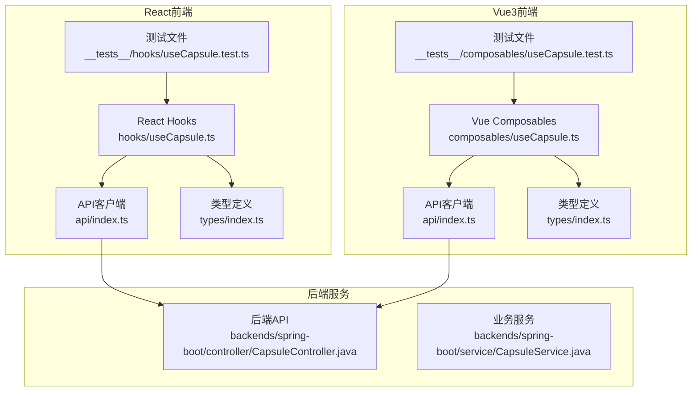

**图表来源**
- [useCapsule.ts (React):1-48](file://frontends/react-ts/src/hooks/useCapsule.ts#L1-L48)
- [useCapsule.ts (Vue3):1-65](file://frontends/vue3-ts/src/composables/useCapsule.ts#L1-L65)
- [index.ts (React API):1-94](file://frontends/react-ts/src/api/index.ts#L1-L94)

**章节来源**
- [useCapsule.ts (React):1-48](file://frontends/react-ts/src/hooks/useCapsule.ts#L1-L48)
- [useCapsule.ts (Vue3):1-65](file://frontends/vue3-ts/src/composables/useCapsule.ts#L1-L65)
- [index.ts (React API):1-94](file://frontends/react-ts/src/api/index.ts#L1-L94)
- [index.ts (Vue3 API):1-120](file://frontends/vue3-ts/src/api/index.ts#L1-L120)

## 核心组件

### 状态管理设计

useCapsule实现了三态状态管理模式：

1. **capsule状态**：存储当前时间胶囊的数据，初始值为null
2. **loading状态**：表示异步操作的执行状态，初始值为false  
3. **error状态**：存储错误信息，初始值为null

这种设计确保了UI组件能够准确反映当前的操作状态和结果。

### 核心方法实现

#### create方法（创建时间胶囊）

create方法负责处理时间胶囊的创建流程：

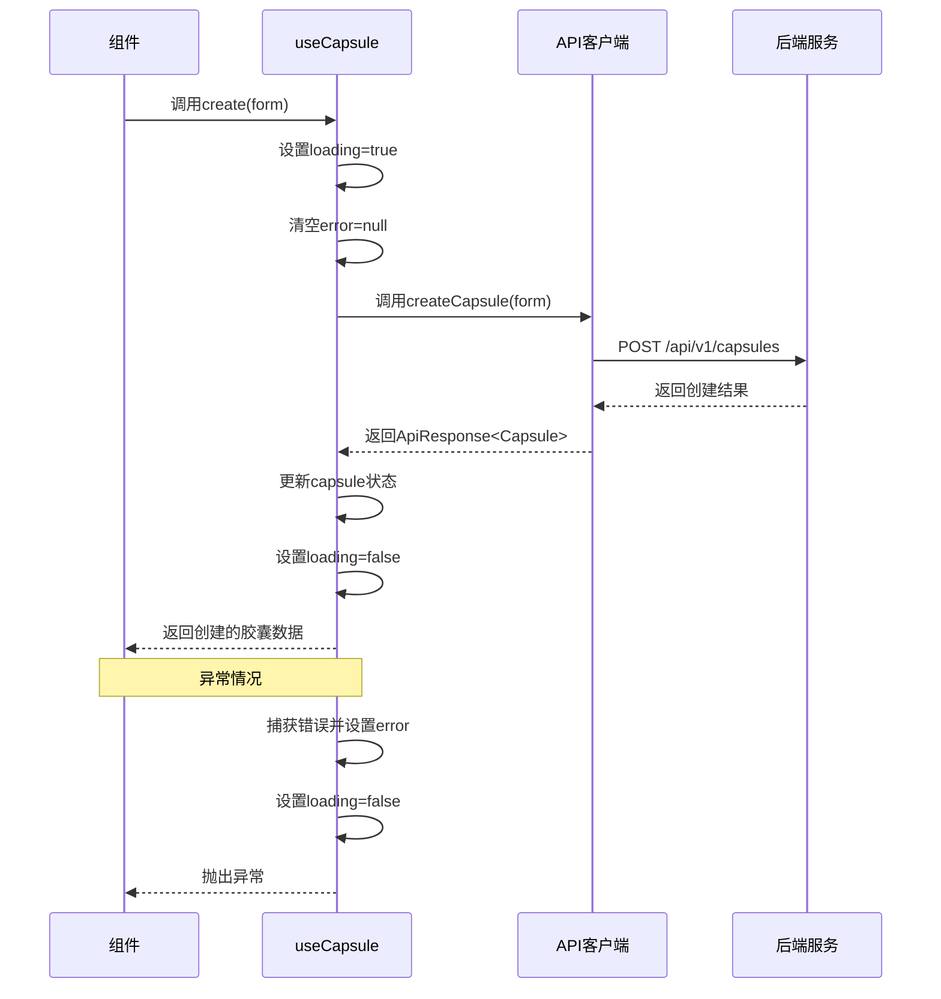

**图表来源**
- [useCapsule.ts (React):14-28](file://frontends/react-ts/src/hooks/useCapsule.ts#L14-L28)
- [useCapsule.ts (Vue3):24-37](file://frontends/vue3-ts/src/composables/useCapsule.ts#L24-L37)

#### get方法（查询时间胶囊）

get方法负责处理时间胶囊的查询流程：

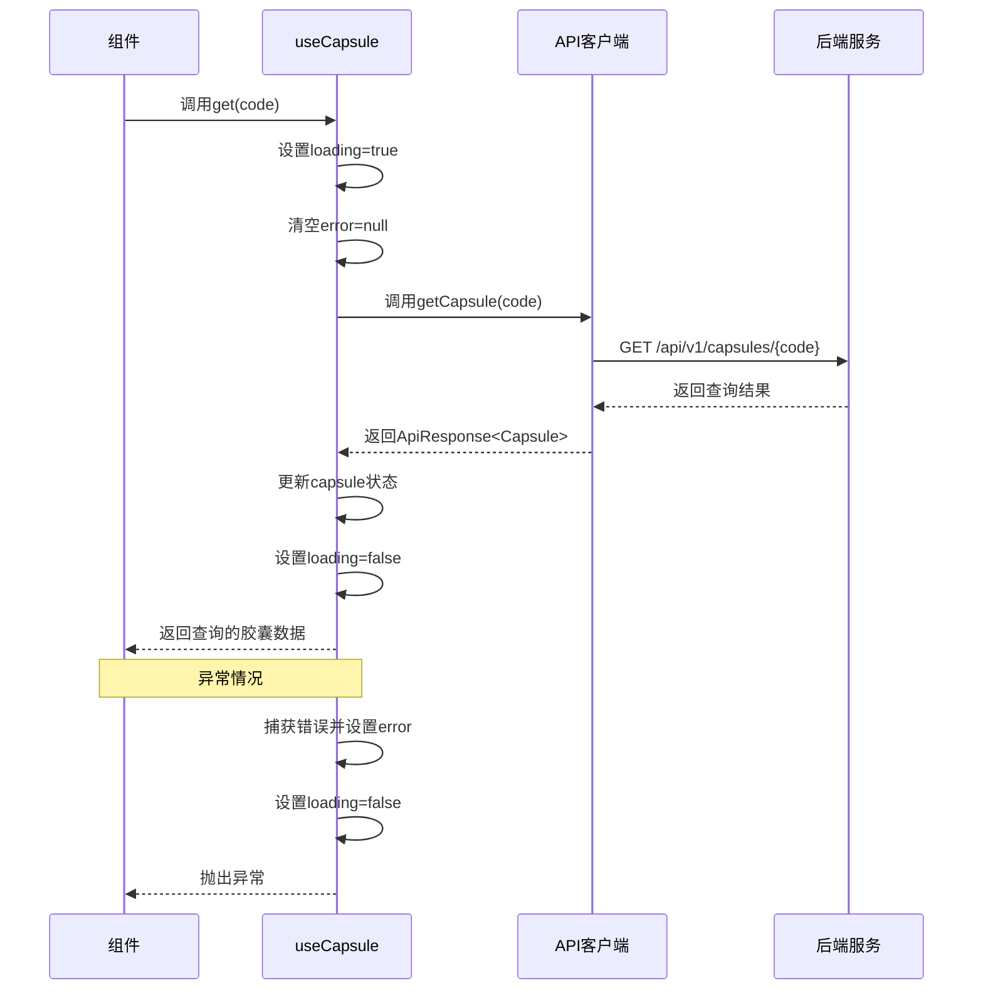

**图表来源**
- [useCapsule.ts (React):30-44](file://frontends/react-ts/src/hooks/useCapsule.ts#L30-L44)
- [useCapsule.ts (Vue3):47-60](file://frontends/vue3-ts/src/composables/useCapsule.ts#L47-L60)

**章节来源**
- [useCapsule.ts (React):9-47](file://frontends/react-ts/src/hooks/useCapsule.ts#L9-L47)
- [useCapsule.ts (Vue3):10-64](file://frontends/vue3-ts/src/composables/useCapsule.ts#L10-L64)

## 架构概览

### 数据流架构

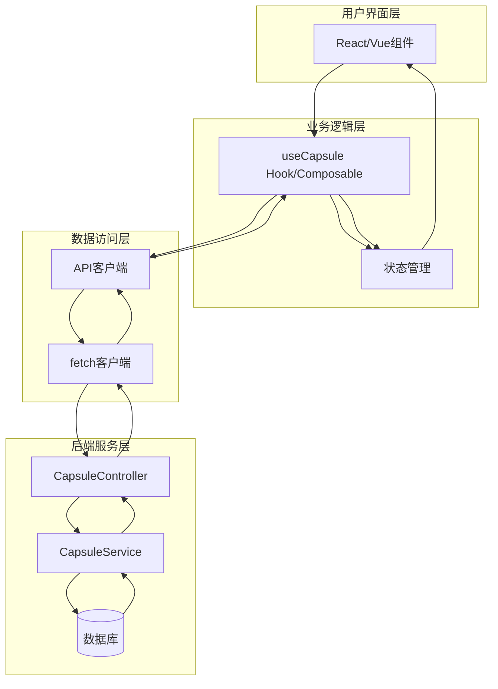

**图表来源**
- [useCapsule.ts (React):1-48](file://frontends/react-ts/src/hooks/useCapsule.ts#L1-L48)
- [useCapsule.ts (Vue3):1-65](file://frontends/vue3-ts/src/composables/useCapsule.ts#L1-L65)
- [index.ts (React API):1-94](file://frontends/react-ts/src/api/index.ts#L1-L94)
- [index.ts (Vue3 API):1-120](file://frontends/vue3-ts/src/api/index.ts#L1-L120)

### 类型安全架构

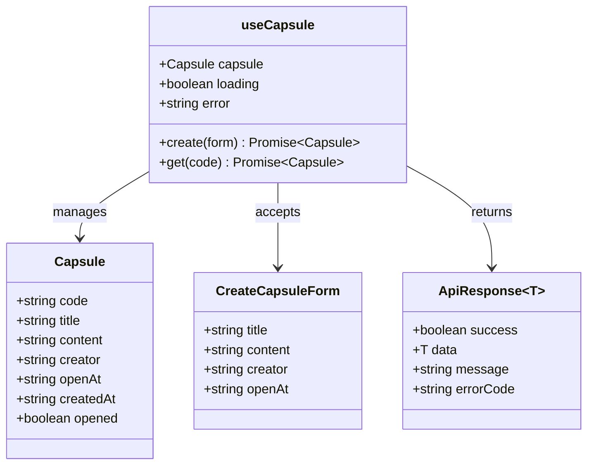

**图表来源**
- [index.ts (类型定义):10-40](file://frontends/react-ts/src/types/index.ts#L10-L40)
- [useCapsule.ts (React):6-12](file://frontends/react-ts/src/hooks/useCapsule.ts#L6-L12)

**章节来源**
- [index.ts (类型定义):1-80](file://frontends/react-ts/src/types/index.ts#L1-L80)

## 详细组件分析

### React版本实现分析

#### 状态管理实现

React版本使用useState钩子实现本地状态管理：

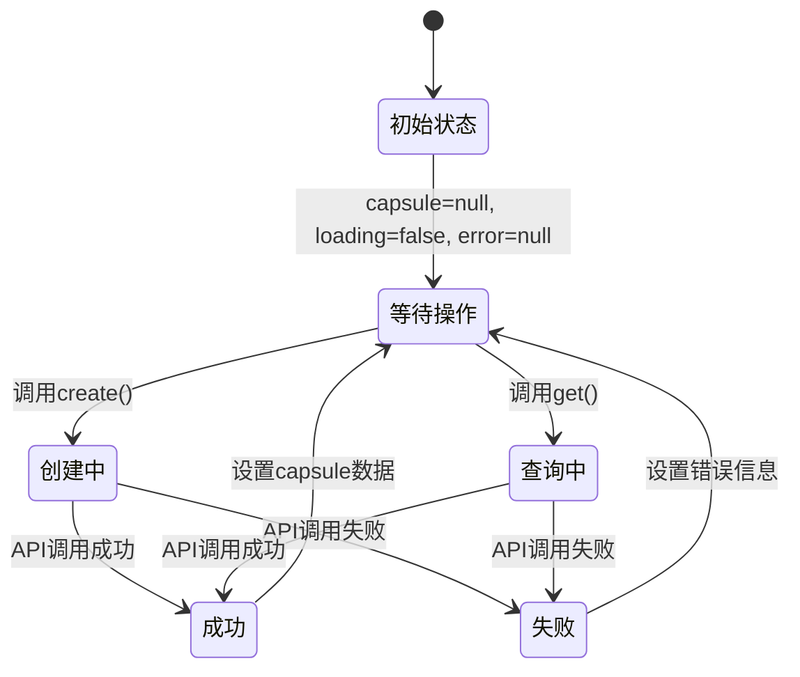

**图表来源**
- [useCapsule.ts (React):10-12](file://frontends/react-ts/src/hooks/useCapsule.ts#L10-L12)

#### useCallback优化策略

React版本使用useCallback对异步方法进行记忆化：

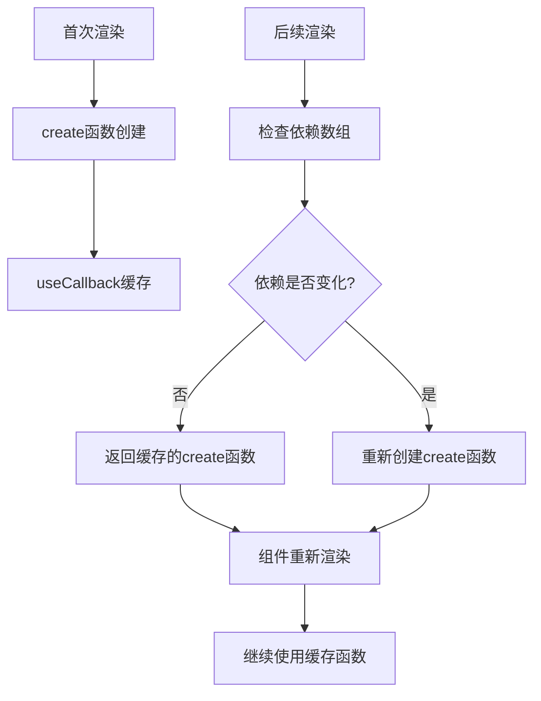

**图表来源**
- [useCapsule.ts (React):14-28](file://frontends/react-ts/src/hooks/useCapsule.ts#L14-L28)

**章节来源**
- [useCapsule.ts (React):1-48](file://frontends/react-ts/src/hooks/useCapsule.ts#L1-L48)

### Vue3版本实现分析

#### 响应式状态管理

Vue3版本使用ref实现响应式状态管理：

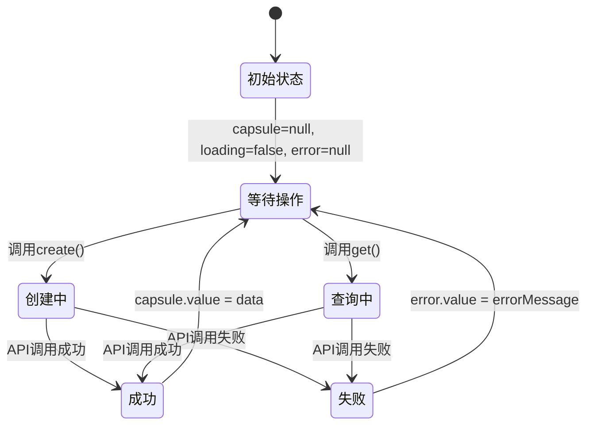

**图表来源**
- [useCapsule.ts (Vue3):12-14](file://frontends/vue3-ts/src/composables/useCapsule.ts#L12-L14)

**章节来源**
- [useCapsule.ts (Vue3):1-65](file://frontends/vue3-ts/src/composables/useCapsule.ts#L1-L65)

### API调用封装分析

#### 统一请求处理

API客户端实现了统一的请求处理机制：

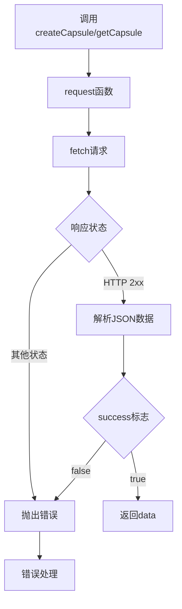

**图表来源**
- [index.ts (React API):14-31](file://frontends/react-ts/src/api/index.ts#L14-L31)
- [index.ts (Vue3 API):19-37](file://frontends/vue3-ts/src/api/index.ts#L19-L37)

**章节来源**
- [index.ts (React API):1-94](file://frontends/react-ts/src/api/index.ts#L1-L94)
- [index.ts (Vue3 API):1-120](file://frontends/vue3-ts/src/api/index.ts#L1-L120)

## 依赖关系分析

### 组件耦合度分析

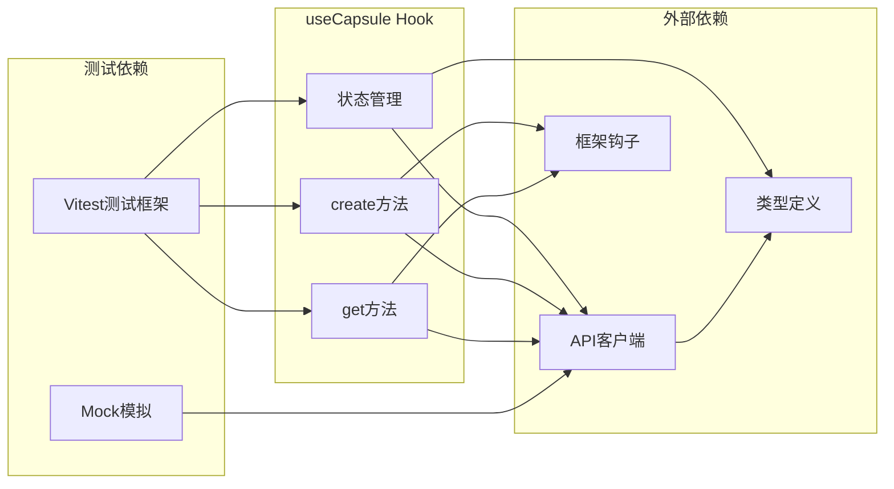

**图表来源**
- [useCapsule.ts (React):5-7](file://frontends/react-ts/src/hooks/useCapsule.ts#L5-L7)
- [useCapsule.ts (Vue3):6-8](file://frontends/vue3-ts/src/composables/useCapsule.ts#L6-L8)

### 依赖注入模式

Hook实现了简单的依赖注入模式，将API客户端作为外部依赖：

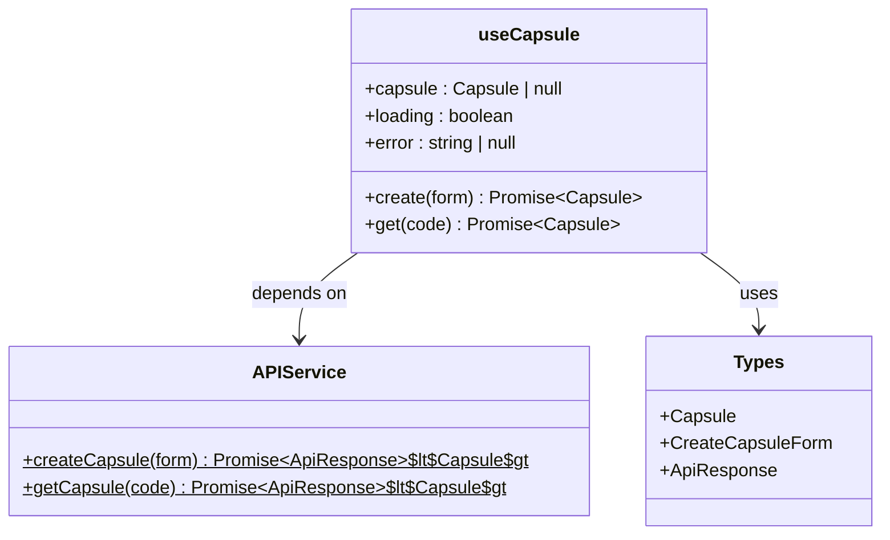

**图表来源**
- [useCapsule.ts (React):6-7](file://frontends/react-ts/src/hooks/useCapsule.ts#L6-L7)
- [useCapsule.ts (Vue3):7-8](file://frontends/vue3-ts/src/composables/useCapsule.ts#L7-L8)

**章节来源**
- [useCapsule.ts (React):1-48](file://frontends/react-ts/src/hooks/useCapsule.ts#L1-L48)
- [useCapsule.ts (Vue3):1-65](file://frontends/vue3-ts/src/composables/useCapsule.ts#L1-L65)

## 性能考虑

### 优化策略

1. **函数记忆化**：React版本使用useCallback避免不必要的函数重建
2. **状态最小化**：只维护必要的状态，减少重渲染
3. **错误边界**：统一的错误处理机制，防止应用崩溃
4. **类型安全**：完整的TypeScript类型定义，编译时错误检测

### 性能监控建议

- 使用React DevTools Profiler监控组件渲染性能
- 实现请求超时和重试机制
- 添加请求去重功能，避免重复请求
- 考虑实现缓存策略，减少重复API调用

## 故障排除指南

### 常见问题及解决方案

#### 状态更新问题

**问题**：状态没有正确更新
**解决方案**：
- 确保在finally块中重置loading状态
- 检查错误状态是否被正确设置
- 验证API响应格式是否符合预期

#### 异步操作问题

**问题**：异步操作没有正确处理
**解决方案**：
- 确保try-catch块正确捕获异常
- 在finally块中清理状态
- 检查Promise链的正确性

#### 类型安全问题

**问题**：TypeScript类型错误
**解决方案**：
- 确保API响应数据符合ApiResponse接口
- 验证CreateCapsuleForm字段完整性
- 检查可选字段的处理逻辑

**章节来源**
- [useCapsule.test.ts (React):1-89](file://frontends/react-ts/src/__tests__/hooks/useCapsule.test.ts#L1-L89)
- [useCapsule.test.ts (Vue3):1-68](file://frontends/vue3-ts/src/__tests__/composables/useCapsule.test.ts#L1-L68)

## 结论

useCapsule Hook实现了优雅的状态管理和API调用封装，具有以下优势：

1. **跨框架兼容**：同时支持React和Vue3，提供一致的开发体验
2. **类型安全**：完整的TypeScript类型定义，提供编译时安全保障
3. **状态管理**：清晰的三态状态模型，便于UI组件状态同步
4. **错误处理**：统一的错误处理机制，提升应用稳定性
5. **测试友好**：完善的单元测试覆盖，确保代码质量

该实现为时间胶囊功能提供了可靠的基础，可以作为复杂业务逻辑封装的最佳实践参考。

## 附录

### 实际使用示例

#### React组件使用示例

```typescript
// 在React组件中使用useCapsule
const MyComponent = () => {
  const { capsule, loading, error, create, get } = useCapsule();
  
  const handleCreate = async (formData) => {
    try {
      const newCapsule = await create(formData);
      // 处理创建成功
    } catch (err) {
      // 处理创建失败
    }
  };
  
  return (
    <div>
      {loading && <div>加载中...</div>}
      {error && <div>错误: {error}</div>}
      {capsule && <div>胶囊数据: {capsule.code}</div>}
    </div>
  );
};
```

#### Vue3组件使用示例

```typescript
// 在Vue3组件中使用useCapsule
const MyComponent = () => {
  const { capsule, loading, error, create, get } = useCapsule();
  
  const handleCreate = async (formData) => {
    try {
      const newCapsule = await create(formData);
      // 处理创建成功
    } catch (err) {
      // 处理创建失败
    }
  };
  
  return h('div', [
    loading.value && h('div', '加载中...'),
    error.value && h('div', `错误: ${error.value}`),
    capsule.value && h('div', `胶囊数据: ${capsule.value.code}`)
  ]);
};
```

### 最佳实践建议

1. **状态管理**：始终在finally块中重置loading状态
2. **错误处理**：提供有意义的错误消息和回退策略
3. **类型安全**：充分利用TypeScript类型系统
4. **测试覆盖**：为每个Hook实现编写单元测试
5. **性能优化**：合理使用useCallback等优化技巧
6. **API设计**：保持API接口的一致性和简洁性