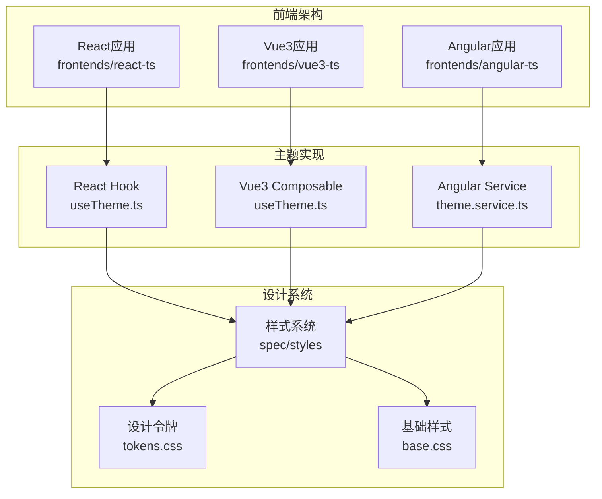
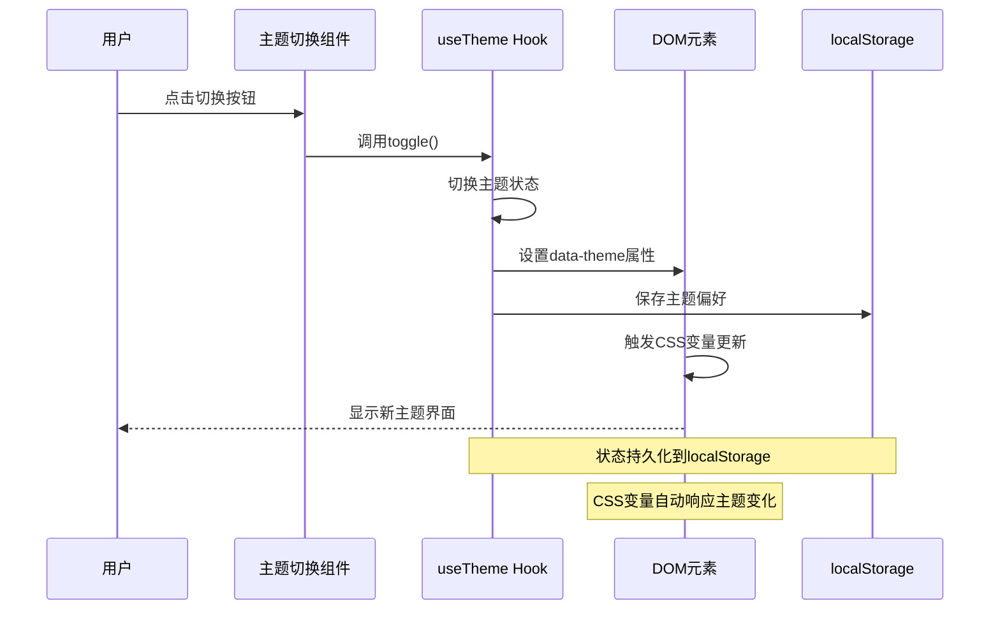
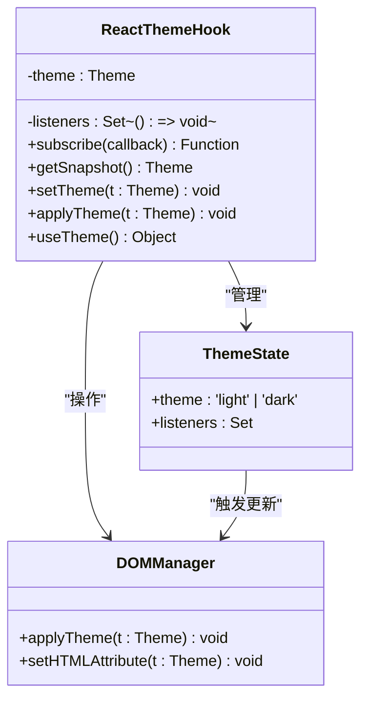
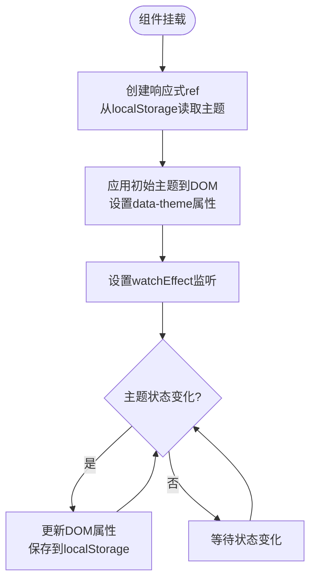
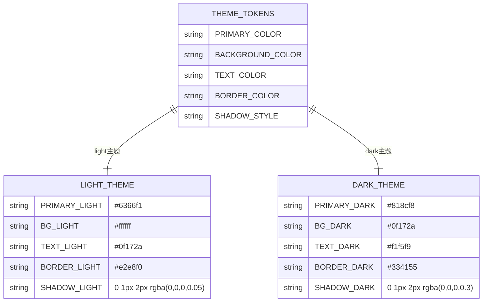
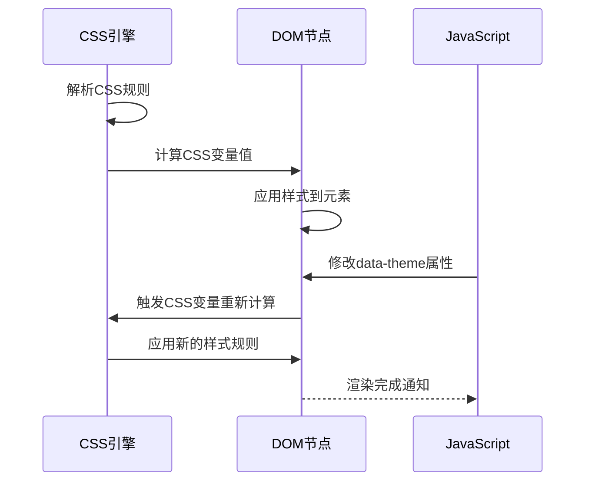
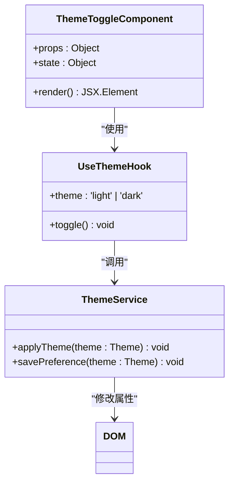
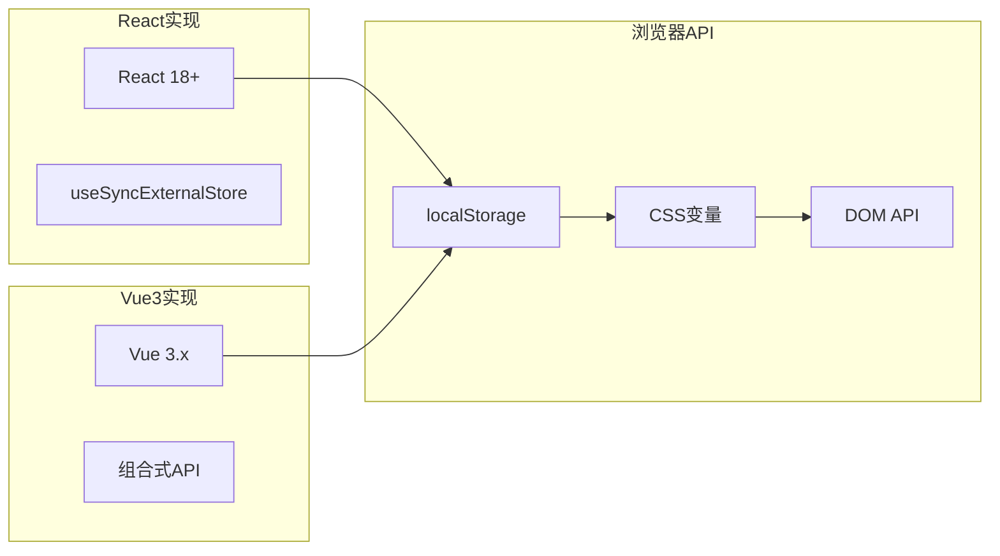
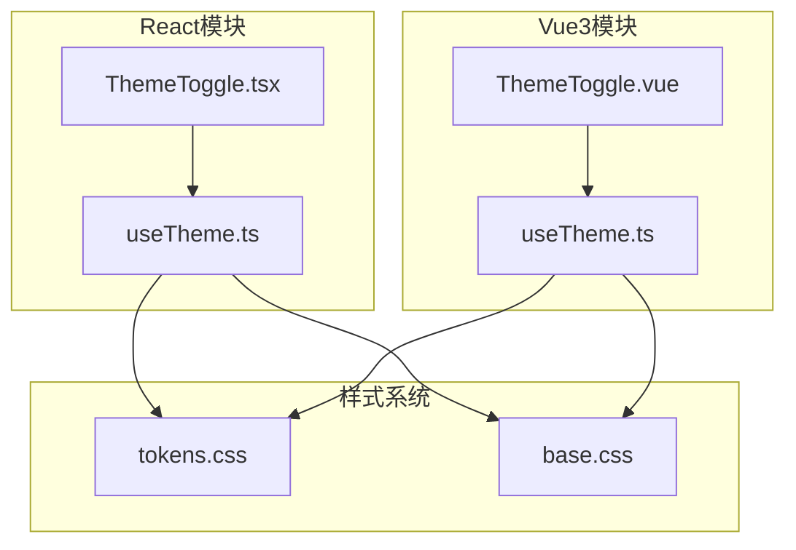

# useTheme Hook实现

<cite>
**本文档引用的文件**
- [useTheme.ts](file://frontends/react-ts/src/hooks/useTheme.ts)
- [useTheme.ts](file://frontends/vue3-ts/src/composables/useTheme.ts)
- [tokens.css](file://spec/styles/tokens.css)
- [base.css](file://spec/styles/base.css)
- [ThemeToggle.tsx](file://frontends/react-ts/src/components/ThemeToggle.tsx)
- [ThemeToggle.vue](file://frontends/vue3-ts/src/components/ThemeToggle.vue)
- [useTheme.test.ts](file://frontends/react-ts/src/__tests__/hooks/useTheme.test.ts)
- [useTheme.test.ts](file://frontends/vue3-ts/src/__tests__/composables/useTheme.test.ts)
- [theme.service.ts](file://frontends/angular-ts/src/app/services/theme.service.ts)
</cite>

## 目录
1. [简介](#简介)
2. [项目结构](#项目结构)
3. [核心组件](#核心组件)
4. [架构概览](#架构概览)
5. [详细组件分析](#详细组件分析)
6. [依赖关系分析](#依赖关系分析)
7. [性能考虑](#性能考虑)
8. [故障排除指南](#故障排除指南)
9. [结论](#结论)
10. [附录](#附录)

## 简介

本文档深入分析了HelloTime项目的useTheme自定义Hook实现，这是一个跨框架的主题切换系统。该系统支持明暗主题切换、主题偏好持久化到localStorage、CSS变量应用以及系统偏好检测。通过统一的设计令牌系统，实现了组件间的状态共享和样式动态更新。

## 项目结构

HelloTime项目采用多框架架构，包含React、Vue3和Angular三个前端实现。每个框架都实现了独立的useTheme Hook或Composable，但共享相同的设计系统和样式架构。



**图表来源**
- [useTheme.ts:1-48](file://frontends/react-ts/src/hooks/useTheme.ts#L1-L48)
- [useTheme.ts:1-57](file://frontends/vue3-ts/src/composables/useTheme.ts#L1-L57)
- [tokens.css:1-104](file://spec/styles/tokens.css#L1-L104)

**章节来源**
- [useTheme.ts:1-48](file://frontends/react-ts/src/hooks/useTheme.ts#L1-L48)
- [useTheme.ts:1-57](file://frontends/vue3-ts/src/composables/useTheme.ts#L1-L57)
- [tokens.css:1-104](file://spec/styles/tokens.css#L1-L104)

## 核心组件

### 主题类型定义

系统使用TypeScript联合类型定义主题状态：

```typescript
type Theme = 'light' | 'dark'
```

这种简单而明确的类型定义确保了类型安全和开发体验的提升。

### 状态管理策略

两个框架采用了不同的状态管理模式：

**React实现**：使用`useSyncExternalStore`实现模块级共享状态
**Vue3实现**：使用`ref`和`watchEffect`实现响应式状态管理

两种实现都确保了主题状态在组件间的正确传播和更新。

**章节来源**
- [useTheme.ts:8-12](file://frontends/react-ts/src/hooks/useTheme.ts#L8-L12)
- [useTheme.ts:7-13](file://frontends/vue3-ts/src/composables/useTheme.ts#L7-L13)

## 架构概览

### 设计系统架构

系统采用分层设计，将设计令牌与主题切换逻辑分离：

```mermaid
graph TD
subgraph "设计令牌层"
RootTokens[:root tokens.css<br/>基础设计令牌]
DarkTokens:[data-theme="dark"] tokens.css<br/>暗色主题覆盖]
end
subgraph "样式层"
BaseStyles[base.css<br/>基础样式规则]
ComponentStyles[组件样式<br/>模块化CSS]
end
subgraph "主题切换层"
ReactHook[React useTheme Hook]
Vue3Comp[Vue3 useTheme Composable]
AngularSvc[Angular Theme Service]
end
subgraph "DOM层"
HTMLDoc[<html>元素<br/>data-theme属性]
CSSVars[CSS变量<br/>动态计算]
end
RootTokens --> BaseStyles
DarkTokens --> BaseStyles
BaseStyles --> CSSVars
ComponentStyles --> CSSVars
ReactHook --> HTMLDoc
Vue3Comp --> HTMLDoc
AngularSvc --> HTMLDoc
HTMLDoc --> CSSVars
```

**图表来源**
- [tokens.css:1-104](file://spec/styles/tokens.css#L1-L104)
- [base.css:1-67](file://spec/styles/base.css#L1-L67)
- [useTheme.ts:14-17](file://frontends/react-ts/src/hooks/useTheme.ts#L14-L17)
- [useTheme.ts:20-23](file://frontends/vue3-ts/src/composables/useTheme.ts#L20-L23)

### 主题切换流程



**图表来源**
- [ThemeToggle.tsx:4-16](file://frontends/react-ts/src/components/ThemeToggle.tsx#L4-L16)
- [useTheme.ts:33-44](file://frontends/react-ts/src/hooks/useTheme.ts#L33-L44)
- [useTheme.ts:51-53](file://frontends/vue3-ts/src/composables/useTheme.ts#L51-L53)

## 详细组件分析

### React useTheme Hook实现

#### 状态管理机制

React版本使用模块级状态和订阅者模式：



**图表来源**
- [useTheme.ts:10-17](file://frontends/react-ts/src/hooks/useTheme.ts#L10-L17)
- [useTheme.ts:24-37](file://frontends/react-ts/src/hooks/useTheme.ts#L24-L37)

#### 核心功能实现

1. **初始化阶段**：从localStorage读取主题偏好，设置默认值为'light'
2. **状态订阅**：使用`useSyncExternalStore`实现跨组件状态同步
3. **主题切换**：实现light/dark双向切换逻辑
4. **持久化存储**：自动保存主题偏好到localStorage

**章节来源**
- [useTheme.ts:1-48](file://frontends/react-ts/src/hooks/useTheme.ts#L1-L48)

### Vue3 useTheme Composable实现

#### 响应式状态管理

Vue3版本采用组合式API模式：



**图表来源**
- [useTheme.ts:13-38](file://frontends/vue3-ts/src/composables/useTheme.ts#L13-L38)

#### 关键特性

1. **响应式设计**：使用`ref`和`watchEffect`实现自动状态追踪
2. **SSR兼容**：检查`document`可用性，确保服务端渲染安全
3. **自动应用**：主题变化时自动更新DOM和localStorage
4. **简洁接口**：提供简单的theme和toggle返回值

**章节来源**
- [useTheme.ts:1-57](file://frontends/vue3-ts/src/composables/useTheme.ts#L1-L57)

### 设计系统集成

#### CSS变量映射

系统使用CSS自定义属性实现主题切换：



**图表来源**
- [tokens.css:4-24](file://spec/styles/tokens.css#L4-L24)
- [tokens.css:83-103](file://spec/styles/tokens.css#L83-L103)

#### 样式动态更新机制



**图表来源**
- [tokens.css:83-103](file://spec/styles/tokens.css#L83-L103)
- [base.css:15-23](file://spec/styles/base.css#L15-L23)

**章节来源**
- [tokens.css:1-104](file://spec/styles/tokens.css#L1-L104)
- [base.css:1-67](file://spec/styles/base.css#L1-L67)

### 组件集成示例

#### React主题切换组件



**图表来源**
- [ThemeToggle.tsx:4-16](file://frontends/react-ts/src/components/ThemeToggle.tsx#L4-L16)
- [useTheme.ts:39-47](file://frontends/react-ts/src/hooks/useTheme.ts#L39-L47)

#### Vue3主题切换组件

Vue3版本采用类似的组件模式，但使用组合式API：

**章节来源**
- [ThemeToggle.tsx:1-17](file://frontends/react-ts/src/components/ThemeToggle.tsx#L1-L17)
- [ThemeToggle.vue:1-34](file://frontends/vue3-ts/src/components/ThemeToggle.vue#L1-L34)

## 依赖关系分析

### 外部依赖

系统依赖最少，主要依赖包括：



**图表来源**
- [useTheme.ts:6-6](file://frontends/react-ts/src/hooks/useTheme.ts#L6-L6)
- [useTheme.ts:5-5](file://frontends/vue3-ts/src/composables/useTheme.ts#L5-L5)

### 内部依赖关系



**图表来源**
- [useTheme.ts:1-48](file://frontends/react-ts/src/hooks/useTheme.ts#L1-L48)
- [useTheme.ts:1-57](file://frontends/vue3-ts/src/composables/useTheme.ts#L1-L57)
- [ThemeToggle.tsx:1-17](file://frontends/react-ts/src/components/ThemeToggle.tsx#L1-L17)
- [ThemeToggle.vue:1-34](file://frontends/vue3-ts/src/components/ThemeToggle.vue#L1-L34)

**章节来源**
- [useTheme.ts:1-48](file://frontends/react-ts/src/hooks/useTheme.ts#L1-L48)
- [useTheme.ts:1-57](file://frontends/vue3-ts/src/composables/useTheme.ts#L1-L57)

## 性能考虑

### 状态更新优化

1. **最小化重渲染**：React使用`useSyncExternalStore`避免不必要的组件重渲染
2. **批量更新**：Vue3的watchEffect确保状态变化时只触发必要的更新
3. **内存管理**：及时清理事件监听器和订阅者

### 存储访问优化

1. **懒加载**：仅在需要时访问localStorage
2. **防抖处理**：避免频繁的存储写入操作
3. **错误处理**：优雅处理localStorage不可用的情况

### 样式计算优化

1. **CSS变量缓存**：浏览器原生缓存CSS变量计算结果
2. **选择器优化**：使用`:root`和`[data-theme]`高效选择器
3. **过渡动画**：利用硬件加速的CSS过渡效果

## 故障排除指南

### 常见问题及解决方案

#### 主题不持久化

**症状**：页面刷新后主题恢复默认值
**原因**：localStorage访问失败或权限问题
**解决方案**：
1. 检查浏览器隐私设置
2. 验证localStorage可用性
3. 添加错误处理和降级方案

#### 样式不更新

**症状**：切换主题后样式未改变
**原因**：CSS变量未正确更新或选择器优先级问题
**解决方案**：
1. 确认`data-theme`属性已正确设置
2. 检查CSS选择器优先级
3. 验证CSS变量命名一致性

#### SSR环境问题

**症状**：服务端渲染时出现undefined错误
**原因**：document对象在服务端不存在
**解决方案**：
1. 检查环境检测逻辑
2. 添加条件渲染
3. 使用适当的SSR兼容模式

**章节来源**
- [useTheme.test.ts:1-30](file://frontends/react-ts/src/__tests__/hooks/useTheme.test.ts#L1-L30)
- [useTheme.test.ts:1-23](file://frontends/vue3-ts/src/__tests__/composables/useTheme.test.ts#L1-L23)

## 结论

HelloTime项目的useTheme系统展现了现代前端主题切换的最佳实践。通过统一的设计令牌系统、模块化的状态管理和高效的CSS变量应用，实现了跨框架的一致用户体验。

### 主要优势

1. **跨框架一致性**：React、Vue3和Angular实现保持相同的API和行为
2. **性能优化**：最小化重渲染和高效的样式更新机制
3. **可维护性**：清晰的代码结构和完整的测试覆盖
4. **扩展性**：易于添加新的主题变量和自定义选项

### 技术亮点

- 使用CSS自定义属性实现动态主题切换
- 通过`data-theme`属性驱动样式系统
- 模块级状态管理确保组件间正确同步
- 完整的测试套件验证核心功能

## 附录

### 主题扩展指南

#### 添加新主题变量

1. 在`tokens.css`中定义新的CSS变量
2. 在`:root`和`[data-theme="dark"]`中设置对应值
3. 在相关组件中使用新变量
4. 更新测试用例验证新功能

#### 自定义主题系统

```typescript
// 扩展主题类型
type ExtendedTheme = Theme | 'auto'

// 添加系统主题检测
function detectSystemTheme(): Theme {
  if (window.matchMedia('(prefers-color-scheme: dark)').matches) {
    return 'dark'
  }
  return 'light'
}
```

#### 性能监控建议

1. 监控主题切换的DOM操作次数
2. 跟踪CSS变量计算的性能影响
3. 分析localStorage访问的延迟
4. 评估组件重渲染的频率