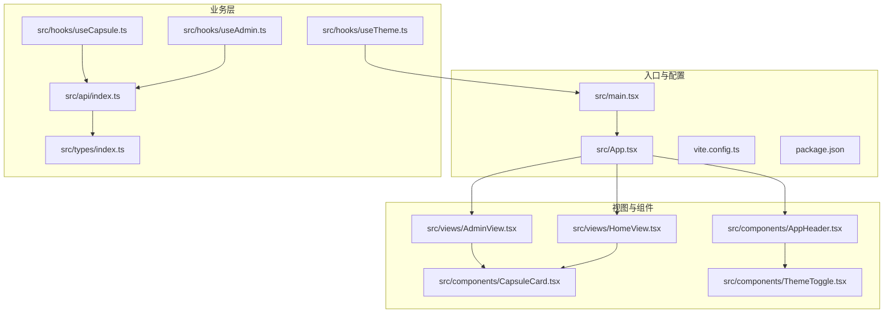
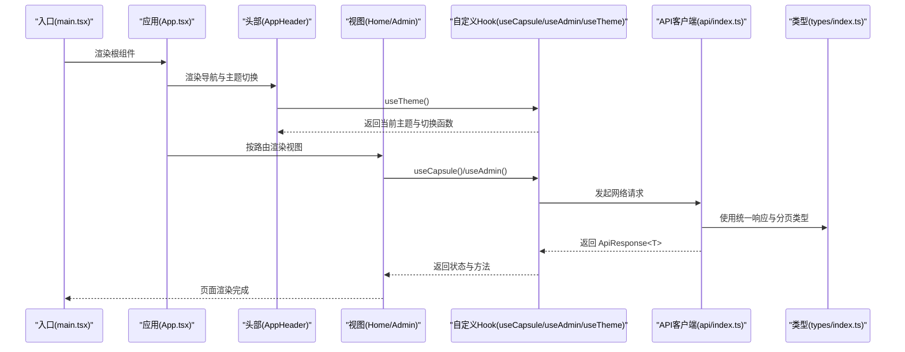
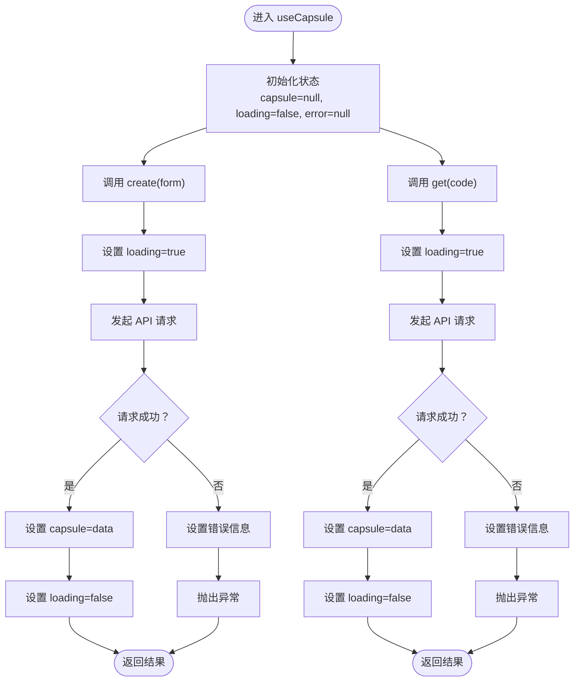
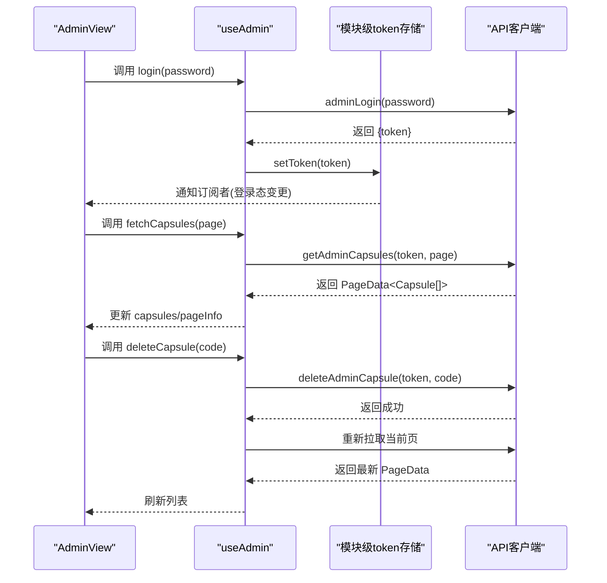
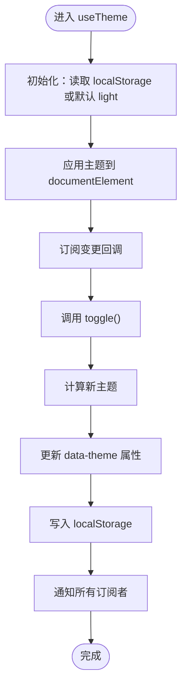
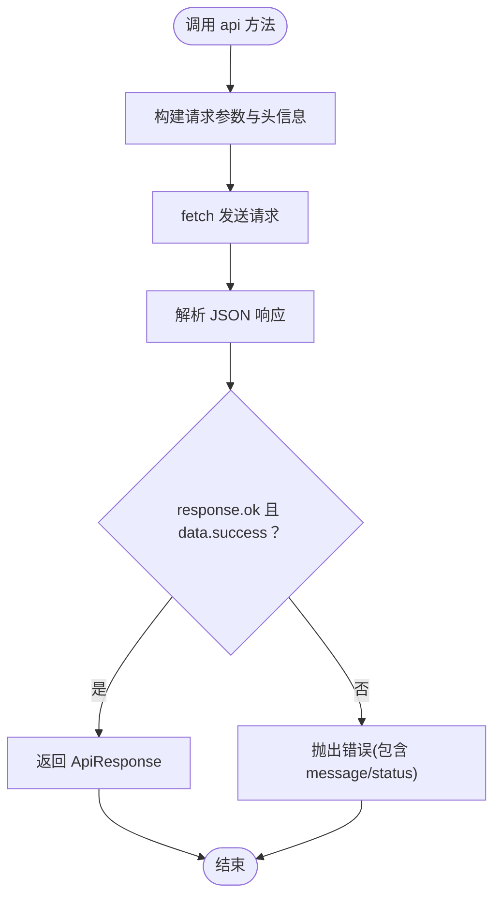
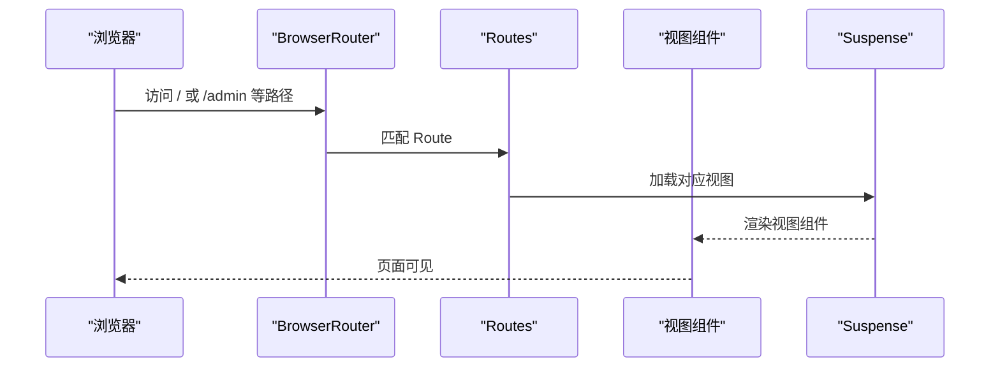
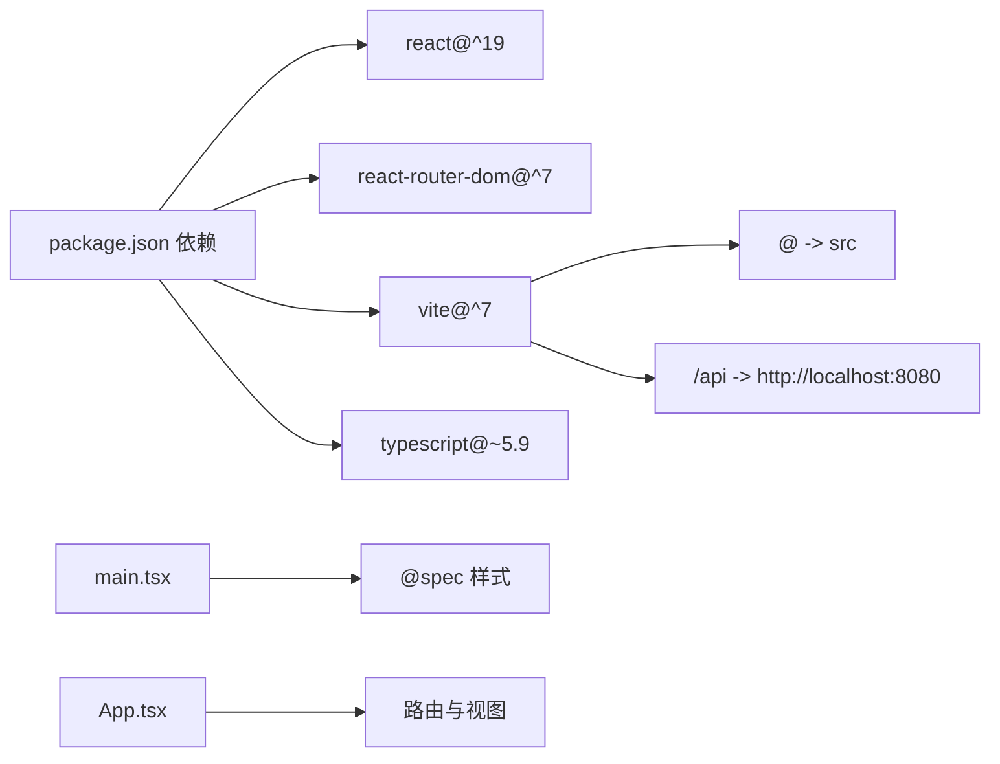

# React 实现

<cite>
**本文引用的文件**
- [package.json](file://frontends/react-ts/package.json)
- [vite.config.ts](file://frontends/react-ts/vite.config.ts)
- [tsconfig.json](file://frontends/react-ts/tsconfig.json)
- [src/main.tsx](file://frontends/react-ts/src/main.tsx)
- [src/App.tsx](file://frontends/react-ts/src/App.tsx)
- [src/hooks/useCapsule.ts](file://frontends/react-ts/src/hooks/useCapsule.ts)
- [src/hooks/useAdmin.ts](file://frontends/react-ts/src/hooks/useAdmin.ts)
- [src/hooks/useTheme.ts](file://frontends/react-ts/src/hooks/useTheme.ts)
- [src/api/index.ts](file://frontends/react-ts/src/api/index.ts)
- [src/types/index.ts](file://frontends/react-ts/src/types/index.ts)
- [src/views/HomeView.tsx](file://frontends/react-ts/src/views/HomeView.tsx)
- [src/views/AdminView.tsx](file://frontends/react-ts/src/views/AdminView.tsx)
- [src/components/CapsuleCard.tsx](file://frontends/react-ts/src/components/CapsuleCard.tsx)
- [src/components/ThemeToggle.tsx](file://frontends/react-ts/src/components/ThemeToggle.tsx)
- [src/components/AppHeader.tsx](file://frontends/react-ts/src/components/AppHeader.tsx)
</cite>

## 目录
1. [简介](#简介)
2. [项目结构](#项目结构)
3. [核心组件](#核心组件)
4. [架构总览](#架构总览)
5. [详细组件分析](#详细组件分析)
6. [依赖关系分析](#依赖关系分析)
7. [性能考量](#性能考量)
8. [故障排查指南](#故障排查指南)
9. [结论](#结论)
10. [附录](#附录)

## 简介
本文件面向 React 19 + TypeScript + Vite 的前端实现，系统性阐述项目架构、组件设计、路由与状态管理、自定义 Hook 设计理念与实现、API 客户端封装与错误处理、样式系统以及与其它框架状态管理模式的对比。重点覆盖以下自定义 Hook：useCapsule（胶囊业务逻辑）、useAdmin（管理员认证与权限）、useTheme（主题切换），并结合真实代码路径帮助读者快速定位实现细节。

## 项目结构
React 前端采用基于功能域的组织方式，主要目录与职责如下：
- src/api：统一的 API 客户端封装，集中处理请求、鉴权头注入与统一错误处理
- src/hooks：可复用的自定义 Hook，封装业务逻辑与状态
- src/types：前后端一致的数据类型定义
- src/components：可复用的 UI 组件
- src/views：页面级视图组件，负责页面布局与业务编排
- src/main.tsx：应用入口，注册全局样式与根组件
- vite.config.ts：Vite 配置，包含路径别名与开发代理
- package.json：依赖与脚本定义

图表来源
- [src/main.tsx:1-20](file://frontends/react-ts/src/main.tsx#L1-L20)
- [src/App.tsx:1-31](file://frontends/react-ts/src/App.tsx#L1-L31)
- [vite.config.ts:1-23](file://frontends/react-ts/vite.config.ts#L1-L23)
- [src/hooks/useCapsule.ts:1-48](file://frontends/react-ts/src/hooks/useCapsule.ts#L1-L48)
- [src/hooks/useAdmin.ts:1-133](file://frontends/react-ts/src/hooks/useAdmin.ts#L1-L133)
- [src/hooks/useTheme.ts:1-48](file://frontends/react-ts/src/hooks/useTheme.ts#L1-L48)
- [src/api/index.ts:1-94](file://frontends/react-ts/src/api/index.ts#L1-L94)
- [src/types/index.ts:1-80](file://frontends/react-ts/src/types/index.ts#L1-L80)
- [src/views/HomeView.tsx:1-44](file://frontends/react-ts/src/views/HomeView.tsx#L1-L44)
- [src/views/AdminView.tsx:1-91](file://frontends/react-ts/src/views/AdminView.tsx#L1-L91)
- [src/components/CapsuleCard.tsx:1-66](file://frontends/react-ts/src/components/CapsuleCard.tsx#L1-L66)
- [src/components/AppHeader.tsx:1-25](file://frontends/react-ts/src/components/AppHeader.tsx#L1-L25)
- [src/components/ThemeToggle.tsx:1-17](file://frontends/react-ts/src/components/ThemeToggle.tsx#L1-L17)

章节来源
- [src/main.tsx:1-20](file://frontends/react-ts/src/main.tsx#L1-L20)
- [src/App.tsx:1-31](file://frontends/react-ts/src/App.tsx#L1-L31)
- [vite.config.ts:1-23](file://frontends/react-ts/vite.config.ts#L1-L23)
- [package.json:1-31](file://frontends/react-ts/package.json#L1-L31)
- [tsconfig.json:1-8](file://frontends/react-ts/tsconfig.json#L1-L8)

## 核心组件
- 函数组件优先：项目以函数组件为主，配合 Hooks 实现状态与副作用管理，提升可读性与可测试性
- 组件组合模式：通过 AppHeader/AppFooter 等布局组件与各视图组件组合，形成清晰的页面结构
- Props 传递机制：通过明确的 Props 接口约束数据类型，确保父子组件间契约清晰；使用 useMemo 优化渲染开销
- 路由系统：基于 React Router v7 的懒加载与 Suspense，实现按需加载与骨架体验
- 状态管理：以自定义 Hook 为核心，结合 useSyncExternalStore 实现跨组件共享状态（如主题、管理员 token）

章节来源
- [src/views/HomeView.tsx:1-44](file://frontends/react-ts/src/views/HomeView.tsx#L1-L44)
- [src/views/AdminView.tsx:1-91](file://frontends/react-ts/src/views/AdminView.tsx#L1-L91)
- [src/components/CapsuleCard.tsx:1-66](file://frontends/react-ts/src/components/CapsuleCard.tsx#L1-L66)
- [src/components/AppHeader.tsx:1-25](file://frontends/react-ts/src/components/AppHeader.tsx#L1-L25)
- [src/components/ThemeToggle.tsx:1-17](file://frontends/react-ts/src/components/ThemeToggle.tsx#L1-L17)

## 架构总览
下图展示了从入口到视图、组件与 Hook 的整体调用链路，以及 API 客户端与类型定义的协作关系：

图表来源
- [src/main.tsx:1-20](file://frontends/react-ts/src/main.tsx#L1-L20)
- [src/App.tsx:1-31](file://frontends/react-ts/src/App.tsx#L1-L31)
- [src/components/AppHeader.tsx:1-25](file://frontends/react-ts/src/components/AppHeader.tsx#L1-L25)
- [src/views/HomeView.tsx:1-44](file://frontends/react-ts/src/views/HomeView.tsx#L1-L44)
- [src/views/AdminView.tsx:1-91](file://frontends/react-ts/src/views/AdminView.tsx#L1-L91)
- [src/hooks/useCapsule.ts:1-48](file://frontends/react-ts/src/hooks/useCapsule.ts#L1-L48)
- [src/hooks/useAdmin.ts:1-133](file://frontends/react-ts/src/hooks/useAdmin.ts#L1-L133)
- [src/hooks/useTheme.ts:1-48](file://frontends/react-ts/src/hooks/useTheme.ts#L1-L48)
- [src/api/index.ts:1-94](file://frontends/react-ts/src/api/index.ts#L1-L94)
- [src/types/index.ts:1-80](file://frontends/react-ts/src/types/index.ts#L1-L80)

## 详细组件分析

### 自定义 Hook：useCapsule（胶囊业务逻辑）
- 设计理念：将“创建”和“查询”两个核心业务动作抽象为 Hook，统一处理 loading/error/capsule 状态，便于多处复用
- 关键点：
  - 使用 useState 管理 capsule/loading/error
  - 使用 useCallback 包裹异步方法，避免重复渲染导致的重新订阅
  - 在 create/get 中统一捕获异常并设置错误信息，同时抛出异常供调用方处理
- 典型调用场景：HomeView 与 OpenView 中分别进行查询与创建

图表来源
- [src/hooks/useCapsule.ts:14-44](file://frontends/react-ts/src/hooks/useCapsule.ts#L14-L44)
- [src/api/index.ts:37-53](file://frontends/react-ts/src/api/index.ts#L37-L53)

章节来源
- [src/hooks/useCapsule.ts:1-48](file://frontends/react-ts/src/hooks/useCapsule.ts#L1-L48)
- [src/api/index.ts:1-94](file://frontends/react-ts/src/api/index.ts#L1-L94)

### 自定义 Hook：useAdmin（管理员认证与胶囊管理）
- 设计理念：使用 useSyncExternalStore 在模块作用域维护 token，实现跨组件共享；同时封装登录、登出、分页查询、删除等管理能力
- 关键点：
  - 模块级 token 状态与监听器集合，支持订阅/快照/更新三件套
  - 登录成功写入 sessionStorage 并广播变更；异常时根据错误信息判断是否清空 token
  - 删除胶囊后刷新当前页，保证 UI 与数据一致性
- 典型调用场景：AdminView 中登录、查看列表、删除确认与分页切换

图表来源
- [src/views/AdminView.tsx:24-47](file://frontends/react-ts/src/views/AdminView.tsx#L24-L47)
- [src/hooks/useAdmin.ts:49-118](file://frontends/react-ts/src/hooks/useAdmin.ts#L49-L118)
- [src/api/index.ts:59-85](file://frontends/react-ts/src/api/index.ts#L59-L85)

章节来源
- [src/hooks/useAdmin.ts:1-133](file://frontends/react-ts/src/hooks/useAdmin.ts#L1-L133)
- [src/views/AdminView.tsx:1-91](file://frontends/react-ts/src/views/AdminView.tsx#L1-L91)
- [src/api/index.ts:1-94](file://frontends/react-ts/src/api/index.ts#L1-L94)

### 自定义 Hook：useTheme（主题切换）
- 设计理念：通过 useSyncExternalStore 实现主题偏好在多个组件间的同步；主题状态持久化至 localStorage，并在初始化时应用
- 关键点：
  - 模块级 theme 状态与 listeners 集合
  - 切换时更新 documentElement 的 data-theme 属性，配合 CSS 变量实现主题切换
  - toggle 依赖当前主题值，确保切换逻辑正确

图表来源
- [src/hooks/useTheme.ts:19-47](file://frontends/react-ts/src/hooks/useTheme.ts#L19-L47)

章节来源
- [src/hooks/useTheme.ts:1-48](file://frontends/react-ts/src/hooks/useTheme.ts#L1-L48)

### API 客户端封装与错误处理
- 统一封装：request 函数统一处理 Content-Type、JSON 解析与错误分支
- 错误策略：当 response.ok 为 false 或 data.success 为 false 时抛出错误，调用方可捕获并显示
- 鉴权集成：管理员相关接口通过 Authorization: Bearer 注入 token
- 健康检查：提供 getHealthInfo 用于调试与监控

图表来源
- [src/api/index.ts:14-31](file://frontends/react-ts/src/api/index.ts#L14-L31)
- [src/api/index.ts:59-85](file://frontends/react-ts/src/api/index.ts#L59-L85)

章节来源
- [src/api/index.ts:1-94](file://frontends/react-ts/src/api/index.ts#L1-L94)

### 样式系统与组件
- 样式方案：采用 CSS Modules（如 HomeView.module.css、CapsuleCard.module.css 等）隔离样式作用域，避免冲突
- 全局样式：入口文件导入共享设计令牌与基础样式，确保主题与布局一致性
- 组件样式：每个组件拥有独立的 .module.css 文件，命名遵循组件名规范，便于维护与重构

章节来源
- [src/main.tsx:9-13](file://frontends/react-ts/src/main.tsx#L9-L13)
- [src/views/HomeView.tsx:3](file://frontends/react-ts/src/views/HomeView.tsx#L3)
- [src/components/CapsuleCard.tsx:3](file://frontends/react-ts/src/components/CapsuleCard.tsx#L3)
- [src/components/ThemeToggle.tsx:2](file://frontends/react-ts/src/components/ThemeToggle.tsx#L2)

### 路由系统与页面导航
- 路由配置：BrowserRouter 包裹 Routes，定义首页、创建、开启、关于、管理后台等路由
- 懒加载：使用 React.lazy 与 Suspense 实现按需加载，减少首屏体积
- 导航组件：AppHeader 使用 NavLink 进行导航，支持激活态样式控制

图表来源
- [src/App.tsx:12-30](file://frontends/react-ts/src/App.tsx#L12-L30)

章节来源
- [src/App.tsx:1-31](file://frontends/react-ts/src/App.tsx#L1-L31)
- [src/components/AppHeader.tsx:1-25](file://frontends/react-ts/src/components/AppHeader.tsx#L1-L25)

## 依赖关系分析
- 构建与工具：Vite 提供开发服务器与打包能力；TypeScript 提供类型安全；React 19 与 React Router DOM 提供运行时与路由能力
- 路径别名：@ 指向 src，@spec 指向共享样式资源，提升导入可读性
- 开发代理：/api 代理到后端 8080 端口，便于前后端联调

图表来源
- [package.json:13-29](file://frontends/react-ts/package.json#L13-L29)
- [vite.config.ts:7-21](file://frontends/react-ts/vite.config.ts#L7-L21)
- [src/main.tsx:10-13](file://frontends/react-ts/src/main.tsx#L10-L13)

章节来源
- [package.json:1-31](file://frontends/react-ts/package.json#L1-L31)
- [vite.config.ts:1-23](file://frontends/react-ts/vite.config.ts#L1-L23)
- [tsconfig.json:1-8](file://frontends/react-ts/tsconfig.json#L1-L8)

## 性能考量
- 懒加载与 Suspense：通过 React.lazy 与 Suspense 减少首屏 JS 体积，提升加载速度
- useCallback 优化：useCapsule/useAdmin 中对异步方法使用 useCallback，避免子组件不必要的重渲染
- useMemo 优化：CapsuleCard 中对剩余时间计算使用 useMemo，避免每次渲染都重新计算
- useSyncExternalStore：在主题与管理员 token 场景中，仅在状态变化时触发订阅者更新，降低全局广播成本

章节来源
- [src/hooks/useCapsule.ts:14-44](file://frontends/react-ts/src/hooks/useCapsule.ts#L14-L44)
- [src/hooks/useAdmin.ts:49-118](file://frontends/react-ts/src/hooks/useAdmin.ts#L49-L118)
- [src/components/CapsuleCard.tsx:20-31](file://frontends/react-ts/src/components/CapsuleCard.tsx#L20-L31)

## 故障排查指南
- 请求失败与错误信息
  - API 客户端会在非 ok 或 success=false 时抛出错误，错误信息包含 message 或状态码
  - 调用方应在组件中捕获并显示友好提示
- 管理员认证失效
  - 当管理员接口返回认证相关错误时，useAdmin 会自动清空 token 与列表，确保状态一致性
- 主题切换不生效
  - 检查 documentElement 上的 data-theme 属性是否更新，确认 localStorage 中的主题值
- 路由懒加载白屏
  - 确认 Suspense 已包裹 Routes，且网络环境允许加载动态模块

章节来源
- [src/api/index.ts:26-31](file://frontends/react-ts/src/api/index.ts#L26-L31)
- [src/hooks/useAdmin.ts:84-87](file://frontends/react-ts/src/hooks/useAdmin.ts#L84-L87)
- [src/hooks/useTheme.ts:14-17](file://frontends/react-ts/src/hooks/useTheme.ts#L14-L17)

## 结论
本项目以函数组件与自定义 Hook 为核心，结合 React Router 的懒加载与 Suspense，实现了清晰的页面导航与良好的用户体验。通过 useSyncExternalStore 实现跨组件共享状态，使主题与管理员登录态管理具备高内聚低耦合特性。API 客户端统一错误处理与类型约束，提升了可维护性与可测试性。整体架构适合在中小型到中大型项目中推广使用。

## 附录
- 最佳实践建议
  - 优先使用函数组件与 Hooks，避免过度使用类组件
  - 将业务逻辑抽取为自定义 Hook，保持组件职责单一
  - 使用 CSS Modules 隔离样式，必要时配合设计令牌与全局样式
  - 对异步方法使用 useCallback，对昂贵计算使用 useMemo
  - 在路由层使用 Suspense 与 lazy，优化首屏性能
- 与其它框架的状态管理模式差异
  - React：以 Hooks 与 Context 为主，useSyncExternalStore 提供细粒度订阅
  - Angular：以服务（Service）+ RxJS Observable 为主，强调响应式数据流
  - Vue：以 Composition API 与 Pinia 为主，强调组合式逻辑与轻量状态管理
  - 本项目更偏向 React 的 Hooks 生态，强调可复用与可测试性